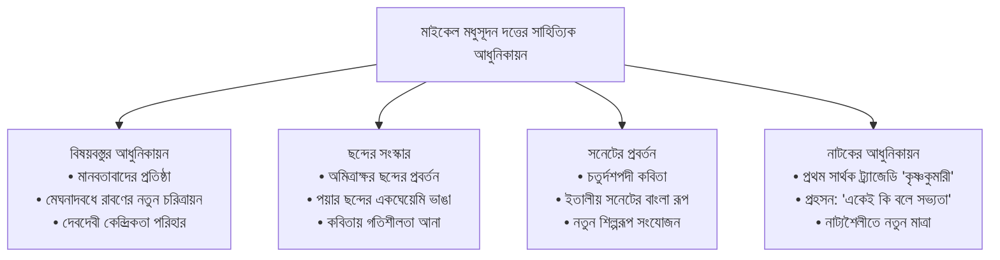
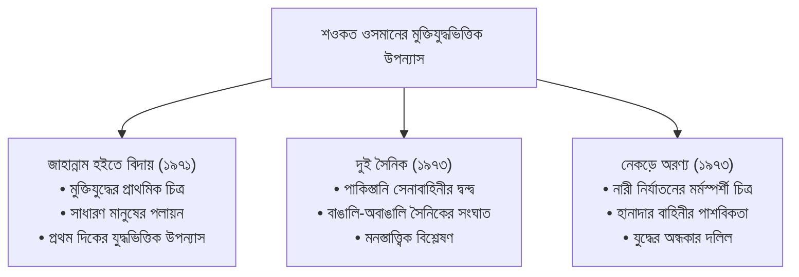
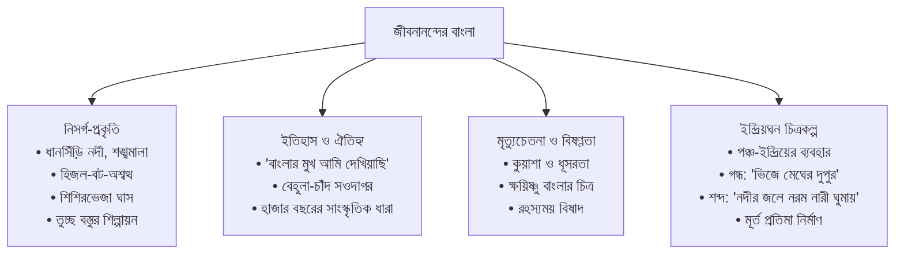
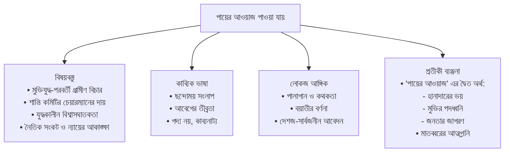
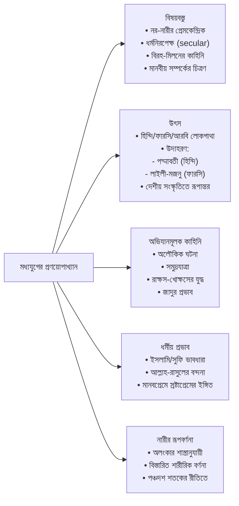

### **০৪। নিচের প্রশ্নগুলো সংক্ষিপ্ত উত্তর দিনঃ- (যেকোনো ছয়টি) (৬×৫ = ৩০)**

---

**(ক) চর্যাপদের ভাষাকে কেন ‘সন্ধ্যা ভাষা’ বলা হয়?**

**উত্তর:**
চর্যাপদের ভাষা ‘সন্ধ্যা ভাষা’ বা ‘আলো-আঁধারি ভাষা’ নামে পরিচিত, কারণ এর অর্থ দ্বি-স্তর বিশিষ্ট। এর একটি বাহ্যিক বা আক্ষরিক অর্থ আছে, যা সাধারণ পাঠকের কাছে প্রতীয়মান হয়, কিন্তু এর গভীরে লুকিয়ে আছে এক গূঢ়, রূপক ও আধ্যাত্মিক অর্থ, যা কেবল বৌদ্ধ সহজিয়া সাধকদের পক্ষেই অনুধাবন করা সম্ভব।

‘সন্ধ্যা’ শব্দটি যেমন দিন ও রাতের মিলনক্ষণ, যেখানে সবকিছু স্পষ্টও নয় আবার অস্পষ্টও নয়, তেমনি চর্যাপদের ভাষাও আক্ষরিক ও রূপক অর্থের মাঝখানে এক মায়াবী কুহেলিকা তৈরি করে। মহামহোপাধ্যায় হরপ্রসাদ শাস্ত্রী এই দ্ব্যর্থবোধক ভাষার জন্যই একে 'সন্ধ্যা ভাষা' নামে অভিহিত করেন। উদাহরণস্বরূপ, "উঁচা উঁচা পাবত তঁহি বসই সবরী বালী" — বাহ্যিক অর্থে উঁচু পর্বতে শবরী বালিকা বাস করে, কিন্তু এর গূঢ় অর্থ হলো, মানবদেহের সর্বোচ্চ স্তর অর্থাৎ মস্তিষ্কে বা মহাসুখচক্রে কুণ্ডলিনী শক্তি অবস্থান করে। এই দ্বৈত অর্থের কারণেই চর্যাপদের ভাষা 'সন্ধ্যা ভাষা' নামে খ্যাত।

---

**(খ) 'শ্রীকৃষ্ণকীর্তন' কাব্যের পরিচয় এবং বিষয়বস্তু সম্পর্কে আলোচনা করুন।**

**উত্তর:**
'শ্রীকৃষ্ণকীর্তন' কাব্য হলো বাংলা সাহিত্যের মধ্যযুগের আদি পর্বে আবিষ্কৃত একমাত্র পূর্ণাঙ্গ আখ্যানকাব্য এবং চর্যাপদের পর এটিই সবচেয়ে গুরুত্বপূর্ণ সাহিত্যিক নিদর্শন। ১৯০৯ সালে বসন্তরঞ্জন রায় বিদ্বদ্বল্লভ পশ্চিমবঙ্গের বাঁকুড়া জেলার এক গৃহস্থের গোয়ালঘর থেকে এই কাব্যের পুঁথিটি আবিষ্কার করেন।

**পরিচয়:** কাব্যটির রচয়িতা বড়ু চণ্ডীদাস। এটি রাধা-কৃষ্ণের প্রেমকাহিনি অবলম্বনে রচিত হলেও এতে লৌকিক ও গ্রাম্য জীবনের প্রভাব অত্যন্ত স্পষ্ট। কাব্যটি ১৩টি খণ্ডে বিভক্ত এবং এর ভাষা চর্যাপদের পরবর্তী বাংলা ভাষার এক আদিম রূপ বহন করে।

**বিষয়বস্তু:** কাব্যের মূল বিষয়বস্তু রাধা ও কৃষ্ণের প্রেম। তবে এই প্রেম বৈষ্ণব পদাবলির মতো স্বর্গীয় বা আধ্যাত্মিক নয়, বরং অত্যন্ত রক্ত-মাংসের, কিছুটা স্থূল ও আদিম প্রবৃত্তিনির্ভর। কাহিনিতে দেখা যায়, কৃষ্ণ বিভিন্ন ছলে-বলে-কৌশলে রাধার প্রেম লাভের চেষ্টা করেন এবং রাধা প্রথমে প্রবল বিরোধিতা করলেও পরে কৃষ্ণের প্রতি অনুরক্ত হন। এই কাব্যে রাধা-কৃষ্ণের প্রেমলীলার মাধ্যমে মূলত মানব-মানবীর চিরন্তন আকর্ষণ-বিকর্ষণের কাহিনিই বর্ণিত হয়েছে, যা একে এক অনন্য মাত্রা দিয়েছে।

---

**(গ) 'মনসামঙ্গল' কাব্যের বেহুলা চরিত্রটির বৈশিষ্ট্য উল্লেখ করুন।**

**উত্তর:**
'মনসামঙ্গল' কাব্যের অজস্র চরিত্রের ভিড়ে বেহুলা এক উজ্জ্বল নক্ষত্র, যিনি কেবল একজন সতীসাধ্বী স্ত্রী নন, বরং দৃঢ়সংকল্প, সাহস ও বিদ্রোহের এক মূর্ত প্রতীক। তাঁর চরিত্রটি বাংলা সাহিত্যের অন্যতম শক্তিশালী নারী চরিত্র।

**বৈশিষ্ট্য:**
*   **পতিপ্রেম ও সতীত্ব:** বেহুলার প্রধান বৈশিষ্ট্য তাঁর স্বামী লখিন্দরের প্রতি গভীর ভালোবাসা ও সতীত্ব। বাসরঘরে সর্পদংশনে মৃত স্বামীর জীবন ফিরিয়ে আনার জন্য তিনি যে আত্মত্যাগ করেন, তা কিংবদন্তিতুল্য।
*   **অসামান্য দৃঢ়তা ও সাহস:** মৃত স্বামীকে নিয়ে কলার ভেলায় ভেসে স্বর্গের পথে যাত্রা করা কোনো সাধারণ নারীর কাজ নয়। পথে নানা প্রতিকূলতা ও প্রলোভনকে উপেক্ষা করে তিনি তাঁর লক্ষ্যে অবিচল থেকেছেন, যা তাঁর মানসিক দৃঢ়তার পরিচায়ক।
*   **বিদ্রোহী সত্তা:** বেহুলা কেবল ভাগ্যের কাছে আত্মসমর্পণ করেননি। তিনি প্রচলিত নিয়তি ও দৈবশক্তির বিরুদ্ধে বিদ্রোহ ঘোষণা করেছেন। স্বর্গে দেবতাদের সামনে তাঁর বলিষ্ঠ যুক্তি ও নৃত্যগীতের মাধ্যমে তিনি মনসার পূজা আদায় করে নেন, যা তাঁর প্রতিবাদী চেতনার স্বাক্ষর বহন করে।
*   **বুদ্ধিমত্তা ও শিল্পনৈপুণ্য:** দেবতাদের মন জয় করার জন্য তাঁর নৃত্যগীতের পারদর্শিতা তাঁর শিল্পগুণের পরিচয় দেয়।

বেহুলা চরিত্রটি ভাগ্যের হাতে ক্রীড়নক না হয়ে নিজ কর্ম ও দৃঢ়তার মাধ্যমে নিয়তিকে জয় করার এক শাশ্বত উদাহরণ।

---

**(ঘ) ঈশ্বরচন্দ্র বিদ্যাসাগরের তিনটি মৌলিক রচনার নাম লিখুন।**

**উত্তর:**
ঈশ্বরচন্দ্র বিদ্যাসাগর মূলত একজন সমাজ সংস্কারক ও শিক্ষাবিদ হলেও বাংলা গদ্যের বিকাশে তাঁর অবদান অবিস্মরণীয়। তিনি যেমন বহু সংস্কৃত গ্রন্থের সার্থক অনুবাদ করেছেন, তেমনি কিছু মৌলিক গ্রন্থও রচনা করেছেন। তাঁর রচিত তিনটি উল্লেখযোগ্য মৌলিক রচনা হলো:

১. **প্রভাবতী সম্ভাষণ (১৮৬৩):** এটি বাংলা সাহিত্যের প্রথম মৌলিক গদ্য রচনা হিসেবে বিবেচিত। বন্ধু রাজকৃষ্ণ বন্দ্যোপাধ্যায়ের অল্পবয়সী কন্যা প্রভাবতীর মৃত্যুতে শোকাহত হয়ে তিনি এটি রচনা করেন। এতে তাঁর ব্যক্তিগত আবেগ ও অনুভূতি প্রকাশ পেয়েছে।

২. **ব্রজবিলাস (১৮৮৪):** এটি একটি ব্যঙ্গাত্মক রচনা। মূলত তৎকালীন বহুবিবাহ প্রথার বিরুদ্ধে এবং বিধবাবিবাহের পক্ষে জনমত গঠনের উদ্দেশ্যে তিনি ছদ্মনামে এটি রচনা করেন।

৩. **অতি অল্প হইল (১৮৭৩) এবং আবার অতি অল্প হইল (১৮৭৩):** এই দুটি পুস্তিকাও ব্যঙ্গাত্মক রচনা, যা কস্যচিৎ উপযুক্ত ভাইপোস্য ছদ্মনামে প্রকাশিত হয়। এর মাধ্যমে তিনি বহুবিবাহ প্রথার কুফল এবং সামাজিক অসংগতির বিরুদ্ধে তীব্র কশাঘাত করেন।

*(বি.দ্র. অনেক সমালোচক 'বিধবা বিবাহ প্রচলিত হওয়া উচিত কিনা এতদ্বিষয়ক প্রস্তাব'-কেও তাঁর শ্রেষ্ঠ মৌলিক রচনা হিসেবে গণ্য করেন।)*

---

**(ঙ) আধুনিক কবি হিসেবে মাইকেল মধুসূদন দত্তের অবদান ব্যাখ্যা করুন।**

**উত্তর:**
মাইকেল মধুসূদন দত্ত বাংলা সাহিত্যের মধ্যযুগীয় বলয় থেকে আধুনিকতার রাজপথে উত্তরণের প্রধান রূপকার। তাঁর হাতেই বাংলা কবিতা ও নাটক পেয়েছে নতুন জীবন। আধুনিক কবি হিসেবে তাঁর অবদান বহুমুখী:

*   **বিষয়বস্তুর আধুনিকায়ন:** তিনিই প্রথম বাংলা সাহিত্যে প্রচলিত দেবদেবীর মাহাত্ম্য প্রচারের পরিবর্তে মানবতাবাদকে প্রতিষ্ঠা করেন। 'মেঘনাদবধ কাব্য'-এ তিনি রাবণকে পরাজিত ভিলেন হিসেবে না দেখিয়ে একজন দেশপ্রেমিক, বীর ও স্নেহশীল পিতা হিসেবে চিত্রিত করেছেন, যা বাংলা সাহিত্যে এক বৈপ্লবিক পরিবর্তন।
*   **নতুন ছন্দের প্রবর্তন:** পয়ারের একঘেয়েমি থেকে বাংলা কবিতাকে মুক্ত করতে তিনি অমিত্রাক্ষর ছন্দের প্রবর্তন করেন, যা বাংলা কবিতায় গাম্ভীর্য ও গতির সঞ্চার করে।
*   **সনেট প্রবর্তন:** ইতালীয় সনেটের আদলে তিনি বাংলা ভাষায় 'চতুর্দশপদী কবিতা' রচনা করে বাংলা কবিতায় এক নতুন শিল্পরূপ যুক্ত করেন।
*   **নাটকে আধুনিকতা:** তিনি বাংলা সাহিত্যে প্রথম সার্থক ট্র্যাজেডি 'কৃষ্ণকুমারী' এবং প্রহসন 'একেই কি বলে সভ্যতা' ও 'বুড়ো সালিকের ঘাড়ে রোঁ' রচনা করে নাট্যসাহিত্যকে আধুনিক করে তোলেন।
*   **ব্যক্তিস্বাতন্ত্র্যবাদ:** তাঁর কাব্যে প্রথমবারের মতো কবির আত্ম-অনুভূতি ও ব্যক্তিস্বাতন্ত্র্য প্রবলভাবে ফুটে ওঠে, যা আধুনিক সাহিত্যের অন্যতম প্রধান লক্ষণ।

বস্তুত, মাইকেল মধুসূদন দত্তই বাংলা সাহিত্যকে আঙ্গিক, বিষয় ও ভাবে আধুনিকতার পথে চালিত করেন।

---

**(চ) শওকত ওসমানের মুক্তিযুদ্ধকেন্দ্রিক তিনটি গ্রন্থের নাম লিখুন।**

**উত্তর:**
কথাশিল্পী শওকত ওসমান বাংলাদেশের মুক্তিযুদ্ধের একজন অন্যতম প্রধান রূপকার। তাঁর লেখনীতে মুক্তিযুদ্ধের ভয়াবহতা, পাকিস্তানি বাহিনীর বর্বরতা এবং বাঙালির অদম্য প্রতিরোধ ও আত্মত্যাগ অত্যন্ত জীবন্তভাবে ফুটে উঠেছে। তাঁর রচিত মুক্তিযুদ্ধকেন্দ্রিক তিনটি উল্লেখযোগ্য গ্রন্থ হলো:

১. **জাহান্নাম হইতে বিদায় (১৯৭১):** এটি মুক্তিযুদ্ধ চলাকালে রচিত একটি অন্যতম শ্রেষ্ঠ উপন্যাস। এতে মুক্তিযুদ্ধের প্রাথমিক দিনগুলোর ভয়াবহতা, সাধারণ মানুষের পলায়ন এবং মুক্তির আকাঙ্ক্ষা বর্ণিত হয়েছে। এটি মুক্তিযুদ্ধের পটভূমিতে লেখা প্রথম দিকের উপন্যাসগুলোর একটি।

২. **দুই সৈনিক (১৯৭৩):** এই উপন্যাসে তিনি পাকিস্তানি সেনাবাহিনীর অন্তর্গত দ্বন্দ্ব, বাঙালি ও অবাঙালি সৈনিকদের মনস্তাত্ত্বিক সংঘাত এবং তাদের পাশবিকতাকে নিপুণভাবে তুলে ধরেছেন।

৩. **নেকড়ে অরণ্য (১৯৭৩):** এটি শওকত ওসমানের আরেকটি শক্তিশালী উপন্যাস, যেখানে পাকিস্তানি হানাদার বাহিনীর ক্যাম্পে বাঙালি নারীদের ওপর চালানো পাশবিক নির্যাতন ও নিগ্রহের এক মর্মস্পর্শী চিত্র অঙ্কিত হয়েছে। এটি মুক্তিযুদ্ধের এক অন্ধকার অধ্যায়ের দলিল।

---

**(ছ) বেগম রোকেয়া সাখাওয়াত হোসেনের 'অবরোধবাসিনী' গ্রন্থের বিষয় বৈশিষ্ট্য বর্ণনা করুন।**

**উত্তর:**
বেগম রোকেয়ার 'অবরোধবাসিনী' (১৯৩১) একটি অসামান্য ও অভিনব গ্রন্থ, যা কোনো উপন্যাস বা প্রবন্ধ নয়, বরং অবরোধ প্রথার নামে বাঙালি মুসলিম নারীদের ওপর চাপিয়ে দেওয়া অমানবিক প্রথার এক জীবন্ত দলিল। এর বিষয় বৈশিষ্ট্যগুলো নিম্নরূপ:

*   **বাস্তব ঘটনার সমাবেশ:** গ্রন্থটি ৪৭টি বাস্তব ঘটনার সংকলন। লেখিকা বিভিন্ন উৎস থেকে সংগৃহীত সত্য ঘটনাগুলোকে নিজের ভাষায় পরিবেশন করেছেন, যা অবরোধ প্রথার নামে প্রচলিত হাস্যকর, করুণ ও মর্মান্তিক দিকগুলোকে তুলে ধরে।
*   **শাণিত ব্যঙ্গ ও বিদ্রূপ:** রোকেয়া সরাসরি যুক্তিতর্ক দিয়ে অবরোধ প্রথার বিরোধিতা করেননি। বরং, ঘটনাগুলোকে এমনভাবে পরিবেশন করেছেন যে, প্রথাটির absurdiity বা অসারতা পাঠকের কাছে আপনাআপনি স্পষ্ট হয়ে ওঠে। তাঁর লেখার ভঙ্গিটি তীব্র ব্যঙ্গাত্মক ও শ্লেষাত্মক।
*   **করুণ ও হাস্যরসের মিশ্রণ:** গ্রন্থটির ঘটনাগুলো পড়তে গিয়ে কখনো হাসি পায়, আবার কখনো ভুক্তভোগী নারীদের জন্য গভীর করুণার উদ্রেক হয়। বোরকা পরতে গিয়ে গরুর গাড়ির চাকার নিচে চাপা পড়া বা রেলগাড়ির টয়লেটে নিজেকে লুকিয়ে রাখার মতো ঘটনাগুলো একই সাথে হাস্যকর ও মর্মান্তিক।
*   **নারীর দৃষ্টিকোণ:** সম্পূর্ণ গ্রন্থটি নারীর দৃষ্টিকোণ থেকে লেখা। এর মাধ্যমে লেখিকা দেখিয়েছেন, যে প্রথাকে ধর্মের নামে নারীর সম্মান রক্ষার কবচ বলা হয়, তা আসলে কীভাবে নারীকে এক জীবন্ত কফিনে বন্দী করে তার মনুষ্যত্বকে কেড়ে নেয়।

'অবরোধবাসিনী' কেবল একটি গ্রন্থ নয়, এটি একটি সামাজিক ব্যাধির বিরুদ্ধে তীব্র শৈল্পিক প্রতিবাদ।

---

**(জ) আবহমান বাংলার ছবি জীবনানন্দ দাশের কবিতায় কীভাবে চিত্রিত হয়েছে লিখুন।**

**উত্তর:**
জীবনানন্দ দাশকে বলা হয় 'রূপসী বাংলার কবি'। তাঁর কবিতায় আবহমান বাংলা তার সমস্ত রূপ, রস, গন্ধ ও বিষণ্ণতা নিয়ে এক মূর্ত ও জীবন্ত রূপে ধরা দিয়েছে। তাঁর কবিতায় বাংলার ছবি চিত্রিত হয়েছে এভাবে:

*   **নিসর্গ-প্রকৃতি:** জীবনানন্দের কবিতায় বাংলার প্রকৃতি এক স্বতন্ত্র চরিত্র। ধানসিঁড়ি নদী, শঙ্খমালা, কার্তিকের নবান্ন, হিজল-বট-অশ্বত্থ, শালিক, লক্ষ্মীপেঁচা, শিশিরভেজা ঘাস—এইসব অনুষঙ্গ তাঁর কবিতায় বারবার ফিরে আসে। তিনি বাংলার তুচ্ছতম প্রাকৃতিক উপাদানকেও দিয়েছেন শৈল্পিক মর্যাদা।
*   **ইতিহাস ও ঐতিহ্য:** তাঁর কবিতায় মিশে আছে বাংলার হাজার বছরের ইতিহাস। 'বাংলার মুখ আমি দেখিয়াছি' কবিতায় তিনি বেহুলা, চাঁদ সওদাগর থেকে শুরু করে বাংলার প্রাচীন ঐতিহ্যের এক নিরবচ্ছিন্ন ধারাকে তুলে ধরেছেন।
*   **মৃত্যুচেতনা ও বিষণ্ণতা:** তাঁর চিত্রিত বাংলায় কেবল রূপ নয়, বিষাদও আছে। কুয়াশা, ধূসরতা, অন্ধকার এবং ক্ষয়িষ্ণুতা তাঁর কবিতার এক অবিচ্ছেদ্য অংশ। তাঁর প্রকৃতি শান্ত, বিষণ্ণ ও রহস্যময়।
*   **ইন্দ্রিয়ঘন চিত্রকল্প:** জীবনানন্দ পঞ্চ-ইন্দ্রিয় দিয়ে বাংলাকে অনুভব করেছেন। তাঁর কবিতায় শুধু বাংলার ছবি দেখা যায় না, এর গন্ধ ('ভিজে মেঘের দুপুরে matière'), শব্দ ('নদীর জলে নরম নারী ঘুমায়') এবং স্পর্শও পাওয়া যায়। তিনি ইন্দ্রিয়গ্রাহ্য চিত্রকল্পের মাধ্যমে বাংলার এক মূর্ত প্রতিমা নির্মাণ করেছেন।

জীবনানন্দের কবিতা যেন বাংলার এক জীবন্ত অ্যালবাম, যেখানে প্রতিটি পাতায় আঁকা আছে এই ভূখণ্ডের শাশ্বত ও বিষাদময় সৌন্দর্য।

---

**(ঝ) সৈয়দ শামসুল হকের ‘পায়ের আওয়াজ পাওয়া যায়' কাব্য নাটকটি সম্পর্কে বিশ্লেষণ করুন।**

**উত্তর:**
সৈয়দ শামসুল হকের 'পায়ের আওয়াজ পাওয়া যায়' (১৯৭৬) বাংলা সাহিত্যের অন্যতম শ্রেষ্ঠ কাব্যনাটক এবং মুক্তিযুদ্ধের এক অবিস্মরণীয় শৈল্পিক দলিল। নাটকটি আঙ্গিক, বিষয় ও সংলাপে অনন্য।

*   **বিষয়বস্তু:** নাটকটির কাহিনি মুক্তিযুদ্ধের শেষ দিকের একটি গ্রামকে কেন্দ্র করে। পাকিস্তানি বাহিনীর আত্মসমর্পণের পর গ্রামের মাতব্বর, যিনি ছিলেন শান্তি কমিটির চেয়ারম্যান এবং নিজের মেয়েকে হানাদারদের হাতে তুলে দিয়েছিলেন, তার বিচারকে কেন্দ্র করে কাহিনি আবর্তিত হয়। নাটকটি যুদ্ধকালীন সময়ে গ্রামের মানুষের ভয়, বিশ্বাসঘাতকতা, প্রতিরোধ এবং যুদ্ধ-পরবর্তী সময়ের নৈতিক সংকট ও ন্যায়ের আকাঙ্ক্ষাকে তুলে ধরে।
*   **কাব্যিক ভাষা:** এটি একটি কাব্যনাটক, তাই এর সংলাপ গদ্য নয়, বরং ছন্দোময় কাব্যিক ভাষায় রচিত। এই কাব্যিকতা নাটকটিকে এক ভিন্ন মাত্রা দিয়েছে এবং আবেগ ও অনুভূতিকে তীব্রতর করেছে।
*   **লোকজ আঙ্গিকের ব্যবহার:** সৈয়দ হক এই নাটকে বাংলার ঐতিহ্যবাহী লোকনাট্য, বিশেষ করে পালাগান ও কথকতার আঙ্গিক ব্যবহার করেছেন। একজন কথক বা বয়াতী পুরো কাহিনিটি বর্ণনা করেন, যা নাটকটিকে এক দেশজ ও সার্বজনীন আবেদন দিয়েছে।
*   **প্রতীকী ব্যঞ্জনা:** নাটকে 'পায়ের আওয়াজ' একটি শক্তিশালী প্রতীক। এটি একদিকে যেমন হানাদার বাহিনীর আগমনের ভয়ংকর আওয়াজ, অন্যদিকে এটি মুক্তির পদধ্বনি এবং সবশেষে গ্রামবাসীর ন্যায়ের দাবিতে এগিয়ে আসার আওয়াজ। মাতব্বরের আত্মগ্লানি ও অসহায়ত্ব এবং গ্রামবাসীর সম্মিলিত প্রতিরোধ নাটকটির মূল সুর।

'পায়ের আওয়াজ পাওয়া যায়' শুধু একটি নাটক নয়, এটি মুক্তিযুদ্ধের চেতনা ও বাঙালির নৈতিক জাগরণের এক শক্তিশালী শৈল্পিক উপস্থাপনা।

---

**(ঞ) মধ্যযুগের রোমান্টিক প্রণয়োপাখ্যানগুলোর বৈশিষ্ট্য সম্পর্কে ধারণা লিপিবদ্ধ করুন।**

**উত্তর:**
বাংলা সাহিত্যের মধ্যযুগে মুসলিম কবিদের হাতে এক বিশেষ ধরনের কাহিনিকাব্য জনপ্রিয়তা লাভ করে, যা 'রোমান্টিক প্রণয়োপাখ্যান' নামে পরিচিত। পারস্য ও ভারতীয় সাহিত্যের প্রভাবে রচিত এই কাব্যগুলোর নিজস্ব কিছু বৈশিষ্ট্য ছিল।

*   **বিষয়বস্তু:** এই কাব্যগুলোর মূল বিষয়বস্তু নর-নারীর প্রেম, যা মানবীয় এবং secular বা ধর্মনিরপেক্ষ। এখানে ধর্মীয় মাহাত্ম্যের চেয়ে মানব-মানবীর প্রেম, বিরহ, মিলন ও দুঃসাহসিক অভিযানই প্রধান।
*   **ঐতিহাসিক বা কাল্পনিক উৎস:** কাহিনিগুলো মূলত হিন্দি, ফারসি বা আরবি লোকগাথা থেকে নেওয়া, যেমন—'পদ্মাবতী' (হিন্দি), 'লাইলী-মজনু' (ফারসি)। কবিরা মূল কাহিনির কাঠামো ঠিক রেখে তাকে দেশীয় परिवेश ও সংস্কৃতির আবরণে পরিবেশন করতেন।
*   **দুঃসাহসিক অভিযান:** নায়কের প্রেম লাভে প্রায়ই নানা অলৌকিক ও দুঃসাহসিক পথ পাড়ি দিতে হতো। সমুদ্রযাত্রা, রাক্ষস-খোক্ষসের সাথে যুদ্ধ, জাদুর প্রভাব ইত্যাদি এই কাব্যগুলোর এক সাধারণ বৈশিষ্ট্য।
*   **ধর্মীয় প্রভাব:** কাব্যগুলো ধর্মনিরপেক্ষ হলেও এতে ইসলামি ও সুফিবাদের প্রভাব লক্ষণীয়। আল্লাহ ও রাসুলের বন্দনা দিয়ে কাব্য শুরু হতো এবং কাহিনির গভীরে মানবপ্রেমের মাধ্যমে স্রষ্টার প্রতি প্রেমের ইঙ্গিত থাকতো।
*   **নারীর রূপের বর্ণনা:** নায়িকার রূপের বর্ণনা ছিল একটি গুরুত্বপূর্ণ অংশ এবং কবিরা পঞ্চদশ শতকের অলংকার শাস্ত্র অনুযায়ী নায়িকার রূপের বিস্তারিত বর্ণনা দিতেন।

আলাওল, দৌলত কাজী, শাহ মুহম্মদ সগীর প্রমুখ কবির হাতে এই প্রণয়োপাখ্যানগুলো মধ্যযুগের বাংলা সাহিত্যকে বিষয়বৈচিত্র্যে সমৃদ্ধ করেছে।