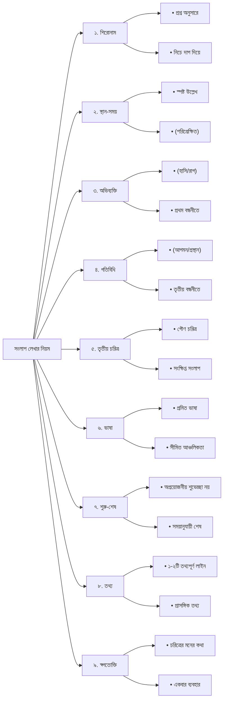

**সংলাপ লেখার নিয়ম**

১. প্রথমে প্রশ্ন অনুসারে একটি শিরোনাম তৈরি করে নিতে হবে। যেমন: ‘দ্রব্যমূল্যের ঊর্ধ্বগতি নিয়ে ক্রেতা ও বিক্রেতার মধ্যে সংলাপ’। শিরোনামের নিচে দাগ দিতে পারেন।
২. এরপর সংলাপের স্থান ও সময় উল্লেখ করবেন। এটি সাধারণত প্রশ্নে দেওয়া থাকে না। তাছাড়া স্থান ও সময়ের নিচে তৃতীয় বন্ধনীতে একটি পরিপ্রেক্ষিত তৈরি করে নিবেন। যেমন: স্থান: একটি বাজার। সময়: ছুটির দিন। সকাল দশটা। (এক কেজি ডাল কেনার পর দাম দিতে গিয়ে ক্রেতা ও বিক্রেতার মধ্যে কথোপকথন।)
৩. কথা বলার সময় আমাদের নানা রকম অভিব্যক্তি হয়। সংলাপ রচনার সময় প্রথম বন্ধনীতে অভিব্যক্তি দিতে হবে। যেমন: (হেসে), (দীর্ঘশ্বাস ফেলে), (রেগে গিয়ে) ইত্যাদি। এ রকম অন্তত চার-পাঁচটি সংলাপে অভিব্যক্তি দেবেন।
৪. চরিত্রের নড়াচড়া ও আগমন-প্রস্থান তৃতীয় বন্ধনীতে দেখাতে হবে। যেমন: \[বিক্রেতা আরেকটি প্যাকেটে আলু ভরতে লাগল।]

\[আরেকজন ক্রেতার আগমন।]

৫. সংলাপ কার কার মধ্যে হবে, সেটি প্রশ্নে নির্দিষ্ট করে দেওয়া থাকে। তবে উত্তর করার সময় তৃতীয় আরেকটি চরিত্র তৈরি করে নিলে ভালো হবে। যেমন, ক্রেতা-বিক্রেতার সংলাপে আরেকজন ক্রেতাকে ঘটনার মধ্যে আনা যায়। তৃতীয় চরিত্রের সংলাপ মাত্র একটি দিতে হবে। সে মোটেই মুখ্য ভূমিকা পালন করবে না। তার আগমন ও প্রস্থান তৃতীয় বন্ধনীতে দেখাতে হবে।

৬. সংলাপে আঞ্চলিকতা পরিহার করতে হবে। তবে দরিদ্র কৃষক, রিকশাওয়ালা ইত্যাদি চরিত্রের সংলাপ লেখার সময়ে ক্রিয়াপদে ও দু-একটি শব্দে সামান্য আঞ্চলিকতা রাখবেন।

৭. সংলাপের শুরু বা শেষ বলে কিছু নেই। শুরুটা কোত্থেকে হচ্ছে, সেটা শুরুর পরিপ্রেক্ষিতে লিখে দিলেই হয়। শুভেচ্ছা বা সালাম বিনিময়ের মাধ্যমে যে শুরু করতে হবে, এমন নয়। আবার শেষ করার ক্ষেত্রে সময়ের দিকে তাকিয়ে কাজ করতে হবে। সময় শেষ হয়ে গেলে এভাবে লিখতে হবে: \[এরপর দুজনের মধ্যে আরও কিছুক্ষণ কথা চলল এবং ক্রেতা গজগজ করতে করতে চলে গেলেন।]

৮. একটি বা দুটি সংলাপ একটু দীর্ঘ হবে, যেখানে কিছু তথ্য থাকবে।

৯. কখনো কখনো চরিত্র মনে মনে কথা বলে। এ রকম সংলাপকে বলা হয় স্বগতোক্তি। সংলাপ রচনার সময়ে একটি স্বগতোক্তি দিতে হবে।

*পরীক্ষায় সংলাপের বিষয় লেখা থাকবে। প্রস্তুতি নেওয়ার সুবিধার্থে এখানে কয়েকটি বিষয় উল্লেখ করা হলো: জলবায়ু পরিবর্তন, সড়ক দুর্ঘটনা, শিক্ষাক্ষেত্রে করোনার প্রভাব, সাইবার অপরাধ, খাদ্যে ভেজাল, স্বাধীনতার পঞ্চাশ বছরে বাংলাদেশের অর্জন, সর্বস্তরে বাংলা ভাষার ব্যবহার, মাদকের কুপ্রভাব, বৃক্ষরোপণের উপযোগিতা ও নৈতিকতার অবক্ষয় ইত্যাদি।*

*কার কার মধ্যে সংলাপ হবে, সেটি প্রশ্নে সাধারণত উল্লেখ থাকে। সংলাপ হতে পারে বিভিন্ন ব্যক্তির মধ্যে; যেমন: মা-বাবা, বাবা-মেয়ে, মা-ছেলে, ভাই-বোন, দাদা-নাতি, দুই বন্ধু, শিক্ষক-শিক্ষার্থী, ক্রেতা-বিক্রেতা, ডাক্তার-রোগী, রিকশাওয়ালা-যাত্রী, পুলিশ-ব্যক্তি, গ্রাহক- ব্যাংক কর্মকর্তা, প্রবীণ-নবীন ইত্যাদি।*

**বিশেষ নির্দেশনা**

প্রশ্নে উল্লেখ না থাকলে চরিত্রের নাম না দেওয়াই ভালো। যেমন: রহিম, করিম না লিখে বন্ধু-১, বন্ধু-২ লেখা ভালো। চরিত্রের পরে, সংলাপে আগে কোলন চিহ্ন দিতে হয়। যেমন: ক্রেতা: তাই বলে এক মাসের মধ্যে এত দাম বেড়ে যাবে? প্রতিটি সংলাপের কোলন চিহ্নগুলো এক বরাবর থাকবে। সময়ের দিকে বিশেষভাবে খেয়াল রাখতে হবে। সংলাপের সংখ্যা হতে পারে ১৫ থেকে ২০টি।

# সংলাপের একটি নমুনা

বইয়ের গুণগত মান নিয়ে বইমেলায় লেখক ও পাঠকের মধ্যে সংলাপ।

স্থান: বইমেলা।
সময়: সন্ধ্যা ৭টা।

\[লেখকের অটোগ্রাফ নেওয়ার পর পাঠক ও লেখকের মধ্যে কথোপকথন শুরু হলো।]

পাঠক: (খুশি খুশি গলায়) আপনার অটোগ্রাফ পেয়ে আমার কী যে ভালো লাগছে, বলে বোঝাতে পারব না।
লেখক: (গম্ভীর স্বরে) হুম্।
পাঠক: গতবছর বইমেলাতে এসে আপনার নতুন বইয়ের খোঁজ করেছিলাম। কিন্তু আপনি মনে হয়, গতবছর কোনো নতুন বই লেখেননি।
লেখক: শুধু গত বছর না, গত দু-তিন বছর আমার কোনো নতুন বই বের হয়নি।
পাঠক: (অবাক হয়ে) মানে!
লেখক: একটি বই চাইলেই তো বের করা যায় না। আমি যে ধরনের বই লিখি, তাতে আমাকে অনেক পড়তে হয়। তারপর চিন্তা করে বিষয়টিকে আমি আমার মতো উপস্থাপন করি।
পাঠক: বুঝেছি। এই জন্যই অনেকে যেখানে বছরে দু-চারটা বই বের করে, আপনার সেখানে দু-চার বছরে একটা বই বের হয়।
লেখক: আমি মনে করি না, সংখ্যা দিয়ে লেখকের মান বিচার হয়।
পাঠক: (হাসতে হাসতে) অথচ আমরা মনে করি, যার যত বই, সে তত বড়ো লেখক।

\[আরেকজন পাঠক অটোগ্রাফ নিতে লেখকের দিকে এগিয়ে এলেন।]

পাঠক-২: আমার এই বইয়ে একটা অটোগ্রাফ দিন না! \[লেখক দ্বিতীয় পাঠকের বইয়ে নাম স্বাক্ষর করে দিলেন। দ্বিতীয় পাঠক খুশি মনে চলে গেল।]
লেখক: এই যে একজন অটোগ্রাফ নিল, দেখলেন তো! \[প্রথম পাঠক লেখকের দিকে তাকিয়ে রইলেন।]
লেখক: যে বইয়ে আমি স্বাক্ষর দিলাম, সেটির গুণগত মান নিয়ে কিছু কথা না বললেই নয়। এর কাগজ, ছাপা, মেকাপ কোনোটাই ভালো না। তার ওপর বইয়ের যে নাম আর প্রচ্ছদের যে ধরন, তাতে মনে হয় না লেখক-প্রকাশক এসব ব্যাপারে সচেতন ছিলেন।
পাঠক: একটু আগে বইমেলায় ঘোষণা শুনছিলাম, মাইকে বলছিল, আজ মেলায় সাড়ে তিনশো নতুন বই এসেছে। এর মানে এক মাসে দশ-বারো হাজার নতুন বই বের হবে। আমার তো মনে হয়, এর শতকরা আশি ভাগ বইই মানসম্পন্ন নয়। গল্প-উপন্যাস-নাটক-কবিতার বইয়ের খুব অল্প সংখ্যকই মানসম্পন্ন। তাছাড়া শিশুদের বইয়ের মান নিয়েও প্রশ্ন আছে। এগুলো দেখার কি কেউ নেই?
লেখক: (স্বগতোক্তি) লেখক-প্রকাশক সচেতন না হলে, বাইরের কে এগুলোর মান নির্ধারণ করবে!
পাঠক: আপনি কিছু ভাবছেন?
লেখক: (অন্যমনস্ক ভঙ্গিতে) না, আপনি ঠিকই বলেছেন। \[লেখক মেলার এদিক-ওদিক তাকাতে থাকলেন।]
পাঠক: (ইতস্তত করে) আমি মনে হয়, আপনার অনেকখানি সময় নিয়ে ফেললাম। ... আবারও ধন্যবাদ জানাচ্ছি আপনার অটোগ্রাফের জন্য।
লেখক: আপনাকেও ধন্যবাদ।

\[পাঠক চলে গেল।]

| ৪৫  | সামাজিক যোগাযোগ মাধ্যমে বাংলা ভাষার অপপ্রয়োগ নিয়ে ছাত্র-শিক্ষকের সংলাপ                                          |
| --- | --------------------------------------------------------------------------------------------------------------- |
| ৪৪  | করোনাকালে শিক্ষাব্যবস্থার ক্ষতি নিয়ে নিয়ে ছাত্র-শিক্ষকের সংলাপ                                                  |
| ৪৩  | ইউক্রেন রাশিয়া যুদ্ধে টালমাটাল বিশ্ব অর্থনীতিতে ক্ষতিগ্রস্থ একজন প্রবাসী শ্রমিকর সাথে একজন অর্থনীতিবীদের সংলাপ |
| ৪১  | মুক্তিযুদ্ধে গণঅভ্যুত্থানের গুরুত্ব নিয়ে ছাত্র-শিক্ষকের সংলাপ                                                   |
| ৪০  | পড়াশুনার পর চাকরি ও নিজ উদ্যোগে ব্যবসা শুরু প্রসঙ্গে দুই বন্ধুর সংলাপ                                           |
| ৩৮  | শিক্ষার অতীত ও বর্তমান নিয়ে ছাত্র-শিক্ষকের সংলাপ                                                                |

***

# সামাজিক যোগাযোগ মাধ্যমে বাংলা ভাষার অপপ্রয়োগ নিয়ে ছাত্র-শিক্ষকের সংলাপ

**স্থান:** বিশ্ববিদ্যালয় প্রাঙ্গণ।
**সময়:** দুপুর একটা।
\[শ্রেণিকক্ষের বাইরে শিক্ষক করিডোর দিয়ে হেঁটে যাচ্ছিলেন, তখন ছাত্রটি তাঁর পথ আগলে দাঁড়ায়।]

**ছাত্র:** স্যার, আসসালামু আলাইকুম। আপনার সাথে কি এক মিনিট কথা বলা যাবে?
**শিক্ষক:** ওয়ালাইকুম আসসালাম। হ্যাঁ, রাহাত, বলো। কোনো সমস্যা?
**ছাত্র:** না, স্যার। আসলে আজ ফেসবুকে একটা লেখা দেখলাম, এমন অদ্ভুত বাংলা অক্ষরে লেখা, অর্ধেক বুঝতেই পারলাম না।
**শিক্ষক:** (দীর্ঘশ্বাস ফেলে) এই সমস্যাটা এখন ভয়াবহ রূপ নিয়েছে। এটা শুধু তোমার একার চোখে পড়েনি।
**ছাত্র:** কিন্তু স্যার, ভাষার এমন বিকৃতি কেন হচ্ছে? ‘Amk’ লিখেছে ‘আমাকে’র বদলে, আবার ‘জানাসে’ লিখেছে ‘জানাচ্ছে’র জায়গায়।
**শিক্ষক:** \[হাঁটতে হাঁটতে করিডোরের বেঞ্চে বসলেন] এর অনেকগুলো কারণ আছে। প্রথমত, দ্রুত টাইপ করার একটা প্রবণতা, যার জন্য অনেকেই রোমান হরফে বাংলা লেখে, যেটাকে তোমরা ‘বাংলিশ’ বলো।
**ছাত্র:** কিন্তু বাংলা হরফেও তো অদ্ভুত সব শব্দ ব্যবহার করছে।
**শিক্ষক:** ঠিক তাই। দ্বিতীয়ত, ভাষার প্রতি এক ধরনের উদাসীনতা ও শ্রদ্ধার অভাব। অনেকেই মনে করে, সামাজিক মাধ্যমে যেভাবে খুশি লেখা যায়, এখানে ব্যাকরণের নিয়ম মানার প্রয়োজন নেই। এই দুটো মিলে বাংলা ভাষার অপপ্রয়োগ এখন একটা মহামারির মতো ছড়িয়ে পড়েছে।
**ছাত্র:** (লজ্জিত ভঙ্গিতে) সত্যি বলতে, স্যার, আমরাও অনেক সময় বন্ধুদের সাথে মজা করে এমন লিখি।
**শিক্ষক:** এই না ভাবাটাই তো মূল সমস্যা। তোমরা এটাকে নিছক মজা হিসেবে দেখছ।
**ছাত্র:** আমরা আসলে এর গভীরতাটা বুঝতে পারিনি।

**\[আরেকজন ছাত্রের আগমন।]**

**সুমন:** স্যার, কালকের ক্লাসটা কি রুটিন অনুযায়ী হবে?
**শিক্ষক:** হ্যাঁ, সুমন, সময়মতোই হবে।

**\[সুমন ধন্যবাদ জানিয়ে চলে গেল।]**

**শিক্ষক:** যা বলছিলাম, এই অপপ্রয়োগ যদি চলতে থাকে, তাহলে আমাদের ভাষার যে সৌন্দর্য ও শুদ্ধতা, তা ধীরে ধীরে হারিয়ে যাবে।
**ছাত্র:** (চিন্তিত মুখে) এখন বুঝতে পারছি বিষয়টা কতটা গুরুতর।
**শিক্ষক:** আমাদের ভাষার জন্য একদা রক্ত দিতে হয়েছে, এই ইতিহাস ভুলে গেলে চলবে না।
**ছাত্র:** জি স্যার, একুশের চেতনা আমাদের সবার মধ্যে আছে।
**শিক্ষক:** এই বিকৃত চর্চা তো সেই চেতনারই অপমান।
**ছাত্র:** (মনে মনে) তাই তো, আমরা তো কখনো এত গভীরভাবে ভাবিনি বিষয়টা নিয়ে।
**শিক্ষক:** তাই তোমাদের মতো তরুণদেরই এর বিরুদ্ধে দাঁড়াতে হবে।
**ছাত্র:** আমাদের করণীয় কী, স্যার?
**শিক্ষক:** প্রথমত, নিজে সচেতন হতে হবে এবং শুদ্ধ বাংলায় লিখবে। দ্বিতীয়ত, কোনো বন্ধু এমন লিখলে তাকে ভালোবাসা দিয়ে বোঝাতে হবে। ভাষার প্রতি ভালোবাসা জাগানোই আসল কাজ।
**ছাত্র:** আপনার কথাগুলো আমাকে খুব অনুপ্রাণিত করল, স্যার।
**শিক্ষক:** \[হাতের ঘড়ির দিকে তাকালেন] আমার আরেকটা ক্লাস আছে এখন।
**ছাত্র:** জি স্যার, আপনাকে অনেক ধন্যবাদ। আমি এখন থেকে চেষ্টা করব এবং বন্ধুদেরও সচেতন করব।
**শিক্ষক:** (হেসে) তোমাদের মতো তরুণেরাই এই পরিবর্তনটা আনতে পারো।
\[এরপর শিক্ষক ক্লাসের দিকে চলে গেলেন এবং রাহাত কিছুক্ষণ সেখানে দাঁড়িয়ে থেকে বিষয়টা নিয়ে ভাবতে লাগল।]

***

### **<u>ইউক্রেন-রাশিয়া যুদ্ধে টালমাটাল বিশ্ব অর্থনীতি: প্রবাসী শ্রমিক ও অর্থনীতিবীদের সংলাপ</u>**

**স্থান:** একটি আন্তর্জাতিক সম্মেলন কক্ষের বাইরে।
**সময়:** বিকেল পাঁচটা।
**\[‘বিশ্ব অর্থনীতি ও আগামীর সংকট’ শীর্ষক সেমিনার শেষে একজন প্রবাসী শ্রমিক বক্তা অর্থনীতিবীদের কাছে এগিয়ে এলেন।]**

**প্রবাসী:** স্যার, আসসালামু আলাইকুম। আমি দুবাই থেকে এসেছি। আপনার বক্তৃতাটা মন দিয়ে শুনলাম।
**অর্থনীতিবীদ:** ওয়ালাইকুম আসসালাম। বলুন, ভাই। কোনো প্রশ্ন আছে?
**প্রবাসী:** প্রশ্ন না স্যার, মনের কষ্ট বলতে এসেছি। আপনি যে বললেন, যুদ্ধের কারণে সবকিছুর দাম বাড়ছে, সেটা তো আমরা হাড়ে হাড়ে টের পাচ্ছি।
**অর্থনীতিবীদ:** (দীর্ঘশ্বাস ফেলে) এটাই বাস্তবতা। এই যুদ্ধের প্রভাব থেকে এখন বিশ্বের কোনো দেশই মুক্ত নয়।
**প্রবাসী:** (বিষণ্ণ মুখে) আমাদের কোম্পানিতে কাজ অর্ধেকে নেমে এসেছে। গত মাসেও বিশজন লোককে ছাঁটাই করেছে। সবাই এখন আতঙ্কে আছি, কখন না জানি নিজের ডাক আসে।
**অর্থনীতিবীদ:** \[তাঁর হাতের ফাইলপত্র গোছাতে শুরু করলেন] দেখুন, যুদ্ধটা শুরু হওয়ার পর বিশ্বজুড়ে তেলের দাম আর খাদ্যপণ্যের সরবরাহ ব্যবস্থা ভেঙে পড়েছে। এর ফলে আপনার কোম্পানির মতো হাজারো প্রতিষ্ঠান কাঁচামালের অভাবে বা খরচ বেড়ে যাওয়ায় উৎপাদন কমাতে বাধ্য হচ্ছে। এটাই সরাসরি প্রভাব।
**প্রবাসী:** আমি আগে দেশে যা টাকা পাঠাতাম, তাতে সংসারটা ভালোভাবে চলে যেত। এখন ডলারের দাম বাড়ার পরও কুলাতে পারছি না।
**অর্থনীতিবীদ:** ঠিক তাই। কারণ আপনার পাঠানো টাকার ক্রয়ক্ষমতা দেশের বাজারে কমে গেছে। মুদ্রাস্ফীতির কারণে জিনিসপত্রের দাম যে হারে বেড়েছে, আপনার আয় সে হারে বাড়েনি।
**প্রবাসী:** (মনে মনে) দেশের ছেলেমেয়েগুলোর মুখটা ভেসে উঠছে। কীভাবে যে ওদের চলবে!
**অর্থনীতিবীদ:** এই পরিস্থিতি শুধু আপনার একার নয়, বিশ্বের কোটি কোটি প্রবাসী এবং তাদের পরিবারের একই অবস্থা।

**\[একজন সাংবাদিকের আগমন।]**

**সাংবাদিক:** স্যার, আপনার প্রেজেন্টেশন অসাধারণ ছিল। পরে কি আপনার একটা বাইট নেওয়া যাবে?
**অর্থনীতিবীদ:** (মাথা নেড়ে) অবশ্যই। আমি এনার সাথে কথা শেষ করেই আসছি।

**\[সাংবাদিক সম্মতি পেয়ে পাশে সরে দাঁড়ালেন।]**

**প্রবাসী:** তাহলে আমাদের ভবিষ্যৎ কী, স্যার?
**অর্থনীতিবীদ:** সত্যি বলতে, ভবিষ্যৎটা এখন বেশ অনিশ্চিত। যুদ্ধ যতদিন চলবে, এই সংকট আরও গভীর হতে পারে।
**প্রবাসী:** (হতাশ ভঙ্গিতে) তাহলে কি সবকিছু ছেড়ে দেশে ফিরে আসব?
**অর্থনীতিবীদ:** \[প্রবাসী শ্রমিকের কাঁধে হাত রাখলেন] না, হুট করে এই সিদ্ধান্ত নেবেন না। দেশের অবস্থাও তো খুব ভালো নয়। নতুন কর্মসংস্থান তৈরি হওয়া কঠিন।
**প্রবাসী:** তাহলে উপায়?
**অর্থনীতিবীদ:** (আশ্বস্ত করে) আপাতত ধৈর্য ধরে পরিস্থিতি পর্যবেক্ষণ করুন। অপ্রয়োজনীয় খরচ কমান। সম্ভব হলে নতুন কোনো কাজের দক্ষতা অর্জন করার চেষ্টা করুন।
**প্রবাসী:** এই বয়সে আর নতুন কী শিখব, স্যার?
**অর্থনীতিবীদ:** হতাশ হবেন না। প্রতিটি সংকটের পরই নতুন সম্ভাবনা তৈরি হয়। হয়তো মধ্যপ্রাচ্যের বাইরে অন্য কোনো শ্রমবাজারে আপনাদের মতো দক্ষ কর্মীর চাহিদা বাড়বে।
**প্রবাসী:** আপনার কথাগুলো শুনে একটু ভরসা পাচ্ছি।
**অর্থনীতিবীদ:** মনে জোর রাখুন। বিশ্ব অর্থনীতি এর চেয়েও বড় সংকট পার করেছে।

**\[এরপর অর্থনীতিবীদ সাংবাদিকের সঙ্গে কথা বলতে এগিয়ে গেলেন এবং প্রবাসী শ্রমিকটি গভীর চিন্তায় মগ্ন হয়ে সেখানেই দাঁড়িয়ে রইলেন।]**

***
### মুক্তিযুদ্ধে উনসত্তরের গণঅভ্যুত্থানের গুরুত্ব নিয়ে ছাত্র-শিক্ষকের সংলাপ

**স্থান:** বিশ্ববিদ্যালয় করিডোর।
**সময়:** দুপুর বারোটা।
**\[ইতিহাস বিভাগের ছাত্র রিয়াদ ক্লাস শেষে করিডোরে তার শিক্ষক, অধ্যাপক জামান সাহেবের জন্য অপেক্ষা করছিল।]**

**রিয়াদ:** স্যার, আসসালামু আলাইকুম। আপনার জন্যেই অপেক্ষা করছিলাম।
**শিক্ষক:** ওয়ালাইকুম আসসালাম। হ্যাঁ, রিয়াদ, বলো। কোনো দরকার?
**রিয়াদ:** জি, স্যার। আজ ক্লাসে আপনি উনসত্তরের গণঅভ্যুত্থান নিয়ে বলছিলেন। আমার প্রশ্ন হলো, আমাদের মহান মুক্তিযুদ্ধে এর প্রকৃত গুরুত্ব ঠিক কতটা ছিল?
**শিক্ষক:** (হেসে) তুমি খুব চমৎকার একটি প্রশ্ন করেছ। উনসত্তরকে বলা যায় একাত্তরের চূড়ান্ত মহড়া।
**রিয়াদ:** মহড়া, স্যার?
**শিক্ষক:** হ্যাঁ। দেখো, কোনো বড় সংগ্রাম হঠাৎ করে একদিনে তৈরি হয় না। উনসত্তরের গণঅভ্যুত্থানই প্রথমবারের মতো ধর্ম, বর্ণ, শ্রেণি নির্বিশেষে পুরো বাঙালি জাতিকে একটি অভিন্ন রাজনৈতিক দাবিতে ঐক্যবদ্ধ করেছিল।
**রিয়াদ:** কিন্তু স্যার, মুক্তিযুদ্ধ তো ছিল একটি সশস্ত্র সংগ্রাম।
**শিক্ষক:** (গভীর মনোযোগের সাথে) ঠিক। কিন্তু সেই সশস্ত্র সংগ্রামের মনস্তাত্ত্বিক এবং রাজনৈতিক ভিত্তি তৈরি করে দিয়েছিল উনসত্তরের গণঅভ্যুত্থান। এই আন্দোলনই আমাদের শিখিয়েছিল স্বৈরশাসকের বিরুদ্ধে কীভাবে সম্মিলিতভাবে রুখে দাঁড়াতে হয়। এই যে ‘জনযুদ্ধ’র কথা আমরা বলি, তার ভিত্তি কিন্তু এই গণজাগরণ।

**\[একজন অফিস সহকারী ফাইল হাতে নিয়ে তাদের পাশ দিয়ে চলে গেলেন।]**

**অফিস সহকারী:** স্যার, আপনার চিঠিটা টেবিলে রেখেছি।
**শিক্ষক:** (মাথা নেড়ে) আচ্ছা, ধন্যবাদ।

**\[অফিস সহকারী চলে গেলেন।]**

**রিয়াদ:** (চিন্তিত মুখে) তার মানে, এই আন্দোলন না হলে সাধারণ মানুষের স্বতঃস্ফূর্ত অংশগ্রহণ হয়তো এতটা ব্যাপক হতো না?
**শিক্ষক:** (দীর্ঘশ্বাস ফেলে) হয়তো হতোই না। উনসত্তরই প্রথম পাকিস্তানি শাসকগোষ্ঠীকে দেখিয়ে দিয়েছিল যে, বাঙালি জাতিকে আর দাবিয়ে রাখা সম্ভব নয়। 
**শিক্ষক:** কী ভাবছ?
**রিয়াদ:** ভাবছি, আমরা ইতিহাসকে কত বিচ্ছিন্নভাবে দেখি!
**শিক্ষক:** ইতিহাস বিচ্ছিন্ন নয়, এটি একটি চলমান স্রোত। উনসত্তরের স্রোতই একাত্তরের মোহনায় গিয়ে মিশেছে।
**রিয়াদ:** আপনার কথা শুনে এখন যোগসূত্রটা ধরতে পারছি, স্যার।
**শিক্ষক:** এই গণজাগরণ না থাকলে নয় মাসে দেশ স্বাধীন করা প্রায় অসম্ভব ছিল।
**রিয়াদ:** আপনাকে অনেক ধন্যবাদ, স্যার। বিষয়টা পরিষ্কারভাবে বুঝিয়ে দেওয়ার জন্য।
**শিক্ষক:** (ছাত্রের কাঁধে হাত রেখে) এই চেতনাগুলো ধারণ করবে, শুধু পরীক্ষায় পাসের জন্য পড়বে না।
**রিয়াদ:** জি, স্যার।

**\[এরপর শিক্ষক নিজের কক্ষের দিকে এগিয়ে গেলেন এবং রিয়াদ করিডোরে দাঁড়িয়ে ইতিহাসের সেই উত্তাল সময়ের কথা ভাবতে লাগল।]**

***

### শিক্ষার অতীত ও বর্তমান: একটি তুলনামূলক আলোচনা

**স্থান:** কলেজ ক্যান্টিন।
**সময়:** দুপুর দুটো।
**\[কলেজের বার্ষিক ক্রীড়া প্রতিযোগিতা শেষে শিক্ষক ও ছাত্র একসঙ্গে বসে চা খাচ্ছিলেন।]**

**ছাত্র:** স্যার, আজ আপনার মুখে আপনাদের ছাত্রজীবনের গল্প শুনে খুব ভালো লাগছিল।
**শিক্ষক:** (হেসে) আমাদের সময়টা তো অন্যরকম ছিল, রফিক। তখন এত সুযোগ-সুবিধা ছিল না।
**ছাত্র:** সেটাই ভাবছিলাম, স্যার। আপনারা এত কম সুযোগ নিয়েও কীভাবে এত ভালো ফল করতেন?
**শিক্ষক:** (চায়ের কাপে চুমুক দিয়ে) এর মূল কারণ ছিল আমাদের মনোযোগ। তখন আমাদের মনোযোগ সরানোর মতো এত উপকরণ ছিল না। একটিমাত্র বই আর শিক্ষকের কথাই ছিল আমাদের ভরসা।
**ছাত্র:** আর এখন তো আমাদের হাতের মুঠোয় সারা বিশ্বের লাইব্রেরি। ইন্টারনেট, ইউটিউব, হাজারো বই।
**শিক্ষক:** ঠিক তাই। কিন্তু এই তথ্যের মহাসমুদ্রে তোমরা অনেক সময় খেই হারিয়ে ফেলো। কোনটা দরকারি আর কোনটা নয়, সেটা বুঝতে বুঝতে অনেক সময় চলে যায়।
**ছাত্র:** (লজ্জিত ভঙ্গিতে) এটা সত্যি, স্যার। একটা বিষয় পড়তে গিয়ে দশটা লিংকে ক্লিক করে ফেলি। মূল পড়াটাই আর হয় না।
**শিক্ষক:** (দীর্ঘশ্বাস ফেলে) এটাই বর্তমান শিক্ষাব্যবস্থার সবচেয়ে বড় চ্যালেঞ্জ। তোমাদের সময় শেখার উপকরণ বেশি, কিন্তু শেখার গভীরতা কমে যাচ্ছে।
**ছাত্র:** আপনাদের সময়ে কি মুখস্থবিদ্যার ওপর বেশি জোর দেওয়া হতো?
**শিক্ষক:** কিছুটা তো ছিলই। কিন্তু তখন শিক্ষকরা শুধু পড়াতেন না, ছাত্রদের নৈতিকতা ও মূল্যবোধও শেখাতেন। শিক্ষা ছিল জীবন গড়ার একটি সামগ্রিক প্রক্রিয়া।

**\[একজন প্রাক্তন ছাত্রের আগমন।]**

**প্রাক্তন ছাত্র:** করিম স্যার, আসসালামু আলাইকুম। কেমন আছেন? আমাকে চিনতে পেরেছেন?
**শিক্ষক:** (খুশি হয়ে) আরে, জামান! হ্যাঁ, চিনব না কেন! এসো, বসো।

**\[প্রাক্তন ছাত্রটি তাদের সাথে কিছু কুশল বিনিময় করে চলে গেল।]**

**ছাত্র:** (মনে মনে) আমাদের শিক্ষকরা কি আমাদের দশ বছর পর এভাবে মনে রাখবেন?
**শিক্ষক:** যা বলছিলাম, এখনকার শিক্ষাব্যবস্থা অনেক বেশি পরীক্ষানির্ভর ও ফলাফলকেন্দ্রিক হয়ে গেছে। জিপিএ-৫ পাওয়ার দৌড়ে জ্ঞান অর্জনের আনন্দ থেকেই বঞ্চিত হচ্ছে।
**ছাত্র:** তাহলে কি আমাদের বর্তমান শিক্ষাব্যবস্থা ভুল পথে এগোচ্ছে?
**শিক্ষক:** (চিন্তিত মুখে) ভুল বলব না, তবে কিছু সংস্কার প্রয়োজন। প্রযুক্তির ভালো দিকগুলো গ্রহণ করতে হবে, কিন্তু এর ফাঁদে পড়া চলবে না।
**ছাত্র:** আমাদের করণীয় কী, স্যার?
**শিক্ষক:** তোমাদেরকে আত্মনিয়ন্ত্রণ শিখতে হবে। তথ্যের সাগর থেকে মুক্তো খুঁজে বের করার দক্ষতা অর্জন করতে হবে।
**ছাত্র:** আর শিক্ষকদের?
**শিক্ষক:** আমাদেরও দায়িত্ব আছে। আমরা শুধু তথ্য প্রদানকারী হব না, আমরা হব পথপ্রদর্শক বা মেন্টর।
**ছাত্র:** আপনার কথাগুলো আমাকে নতুন করে ভাবতে শেখাল, স্যার।
**শিক্ষক:** (ঘড়ির দিকে তাকিয়ে) চলো, এখন ওঠা যাক। অনেক বেলা হলো।

**\[এরপর শিক্ষক ও ছাত্র একসঙ্গে ক্যান্টিন থেকে বেরিয়ে গেলেন এবং ছাত্রটি শিক্ষার প্রকৃত উদ্দেশ্য নিয়ে ভাবতে ভাবতে বাড়ির পথে হাঁটা দিল।]**

***

### পড়াশোনার পর চাকরি না ব্যবসা: দুই বন্ধুর সংলাপ

**স্থান:** বিশ্ববিদ্যালয় ক্যান্টিন।
**সময়:** দুপুর।
**\[বিশ্ববিদ্যালয় জীবন প্রায় শেষ। চাকরির পরীক্ষার জন্য প্রস্তুতি নিতে নিতে দুই বন্ধু ক্যান্টিনে বসে ভবিষ্যৎ নিয়ে কথা বলছিল।]**

**আরেফিন:** কাল একটা ব্যাংকের পরীক্ষার তারিখ দিল। প্রস্তুতি কিছুই নেই।
**সুমন:** (হেসে) তুই তো সারাদিন এই চাকরির পরীক্ষাই নিয়ে পড়ে আছিস। আমার তো ভাবলেই দম বন্ধ হয়ে আসে।
**আরেফিন:** দম বন্ধ হবে কেন? পড়াশোনা শেষ করে একটা ভালো চাকরিই তো সবার স্বপ্ন। মাস শেষে নিশ্চিত বেতন, জীবনটা স্থিতিশীল।
**সুমন:** সবার স্বপ্ন হতে পারে, আমার নয়। আমি অন্যের জন্য কাজ করতে চাই না, আমি নিজে কিছু তৈরি করতে চাই।
**আরেফিন:** (অবাক হয়ে) মানে? তুই কি ব্যবসার কথা ভাবছিস?
**সুমন:** হ্যাঁ। আমি একটা ছোট আইটি ফার্ম দেব ভাবছি। অ্যাপ ডেভেলপমেন্ট নিয়ে কাজ করব।
**আরেফিন:** কিন্তু ব্যবসার অনেক ঝুঁকি। পুঁজি পাবি কোথায়? যদি লোকসান হয়?
**সুমন:** ঝুঁকি তো আছেই। কিন্তু দেখ, দেশে প্রতি বছর লাখ লাখ গ্র্যাজুয়েট বের হচ্ছে, চাকরি পাচ্ছে কয়জন? আমি চাকরিপ্রার্থী হতে চাই না, আমি চাকরিদাতা হতে চাই। এই স্বপ্নটা আমাকে ঝুঁকি নিতে সাহস দেয়।

**\[ক্যান্টিনের বেয়ারা রতনের আগমন।]**

**রতন:** ভাই, আর কিছু লাগব?
**আরেফিন:** না, ভাই। বিলটা নিয়ে এসো।

**\[রতন বিল আনতে চলে গেল।]**

**সুমন:** (মনে মনে) সবাই যদি শুধু চাকরির কথাই ভাবে, তাহলে নতুন কিছু তৈরি করবে কে?
**আরেফিন:** তোর স্বপ্নটা মহৎ, সন্দেহ নেই। কিন্তু বাস্তবতা অনেক কঠিন।
**সুমন:** (আত্মবিশ্বাসের সাথে) কঠিন পথেই তো বড় সাফল্য আসে। আমি ছোট করে শুরু করব। প্রয়োজনে বাবার থেকে কিছু ধার নেব, বাকিটা হয়তো কোনো সরকারি প্রণোদনা থেকে জোগাড় করার চেষ্টা করব।
**আরেফিন:** সরকারি প্রণোদনা পাওয়া কি এতই সোজা?
**সুমন:** চেষ্টা করতে তো দোষ নেই।
**আরেফিন:** (দীর্ঘশ্বাস ফেলে) তোর সাহস আছে বলতে হবে।
**সুমন:** আর তোর আছে ধৈর্য। দুটোই দরকার।
**আরেফিন:** তা ঠিক। যার যার পথ তার তার কাছে।
**সুমন:** (হেসে) ঠিক তাই। দোয়া করিস যেন ডুবে না যাই।
**আরেফিন:** অবশ্যই দোয়া করি। আর তুইও দোয়া করিস যেন একটা ভালো চাকরি পাই।
**সুমন:** নিশ্চয়ই।
**আরেফিন:** \[বিল পরিশোধ করে] চল, ওঠা যাক। লাইব্রেরিতে যেতে হবে।
**সুমন:** চল।

**\[এরপর দুই বন্ধু নিজ নিজ স্বপ্নের পথ ধরে ক্যান্টিন থেকে বেরিয়ে গেল, একজন চাকরির প্রস্তুতির জন্য লাইব্রেরির দিকে, অন্যজন ব্যবসার পরিকল্পনা নিয়ে নতুন উদ্যমে।]**

***
