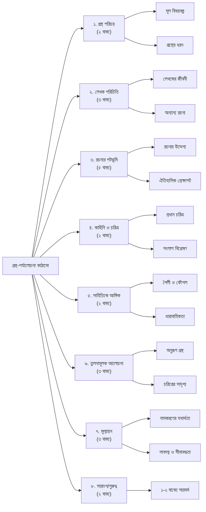

পরীক্ষায় উত্তর করার ক্ষেত্রে সময়কে বিবেচনায় রাখতে হবে। মোটামুটি ১৫ থেকে ১৮ মিনিটের মধ্যে গ্রন্থ-সমালোচনা লেখা শেষ করতে হবে। পুরো উত্তরকে কয়েকটি ছোট ছোট অনুচ্ছেদে ভাগ করে নেবেন। প্রথমে একটি শিরোনাম এবং সারসংক্ষেপ দিয়ে শুরু করবেন। যেমন:

‘একাত্তরের দিনগুলি’: হৃদয়ের রক্তক্ষরণ 
গ্রন্থের নাম: ‘একাত্তরের দিনগুলি’ 
লেখক: জাহানারা ইমাম 
প্রকাশকাল: 
প্রকাশনী: 
প্রচ্ছদশিল্পী: 
পৃষ্ঠাসংখ্যা:

<em>শিরোনামের নিচে গ্রন্থের নাম, লেখকের নাম লিখবেন। প্রথম প্রকাশকাল জানা থাকলে লিখবেন। তবে প্রচ্ছদশিল্পী, প্রকাশনী ও পৃষ্ঠাসংখ্যা লিখতে হবে না।</em>

**১ম অনুচ্ছেদ:** এ অংশে ১-২ বাক্যে গ্রন্থটির সাধারণ পরিচয় নিয়ে লিখবেন। যেমন: ‘একাত্তরের দিনগুলি’ একটি মুক্তিযুদ্ধভিত্তিক গ্রন্থ। এটি দিনলিপির আকারে লেখা।

**২য় অনুচ্ছেদ:** এ অংশে লেখক সম্পর্কে লিখবেন। তাঁর অন্য কোনো বইয়ের নাম জানা থাকলে লিখবেন। লেখকের জন্ম-মৃত্যু সাল জানা না থাকলে অন্তত সময়কাল সম্পর্কে লিখবেন। লেখকের গুরুত্বপূর্ণ অবদান সম্পর্কে লিখবেন। এককথায়, লেখক সম্পর্কে লিখবেন কমবেশি ৩ বাক্যে। যেমন: জাহানারা ইমামের বিশেষ খ্যাতি ‘একাত্তরের দিনগুলি’র জন্য। তিনি শহিদজননী হিসেবে খ্যাত। মুক্তিযুদ্ধের বিরোধিতাকারী শক্তির বিরুদ্ধে তিনি আজীবন ছিলেন সোচ্চার।

**৩য় অনুচ্ছেদ:** এ অংশে গ্রন্থের বৈশিষ্ট্য, গ্রন্থ রচনার কারণ বা উদ্দেশ্য, গ্রন্থের বিষয়ের ঐতিহাসিক প্রেক্ষাপট ইত্যাদি সম্পর্কে লিখতে হবে। যেমন: দিনলিপি জাতীয় গ্রন্থে লেখক দিনের বিবরণ দিয়ে থাকেন। ‘একাত্তরের দিনগুলি’ গ্রন্থে লেখক একাত্তরের শ্বাসরুদ্ধকর সময়কে তুলে এনেছেন। দীর্ঘ ২৩ বছরের শোষণ-বঞ্চনার অনিবার্য পরিণতি ছিল একাত্তরের মুক্তিযুদ্ধ। ১৯৭১ সালের ১ মার্চ থেকে উত্তাল হতে থাকে পূর্ব বাংলা। জাহানারা ইমাম তারিখ দিয়ে সেসব দিনের কাহিনি ও তথ্য তুলে ধরেছেন। মুক্তিযুদ্ধে দেশের পরিস্থিতি, মানুষের ভীতি ও আকাঙ্ক্ষার সঙ্গে একাকার হয়ে মিশে গেছে ব্যক্তিগত আবেগ-অনুভূতি। এভাবে ৪-৫ বাক্য লিখতে হবে।

**৪র্থ অনুচ্ছেদ:** গ্রন্থের কাহিনি, চরিত্র ইত্যাদি নিয়ে লিখতে হবে। এ অংশের সফলতা নির্ভর করে গ্রন্থ-পাঠের ওপর। অনেক গ্রন্থের ভূমিকা পড়েও এ অংশ ভালো লেখা যায়। একটি গ্রন্থ সম্পর্কে যত তথ্য জানা যায়, তত সুন্দর করে এই অনুচ্ছেদ লেখা যায়। এ অংশের নির্দিষ্ট আয়তন নেই। যেমন: ‘একাত্তরের দিনগুলি’ সরাসরি পড়া থাকলে লেখা সহজ হয় এখানকার রুমী চরিত্রটি কেমন, তার কী ভূমিকা, গ্রন্থে আর কোন কোন চরিত্র আছে। গ্রন্থের কাহিনি, বিষয়, সংলাপ এগুলোও আলোচনায় আসবে।

**৫ম অনুচ্ছেদ:** সাহিত্যের মধ্য দিয়ে প্রতিফলিত হয় মানুষের জীবন, অনেক সময় লেখক সুনির্দিষ্টভাবে কোনো মতবাদের প্রয়োগ ঘটান। এর বাইরেও আরও অনেক রকম লক্ষ্য বা আঙ্গিক-বৈচিত্র্য থাকে। এর সঙ্গে আলোচ্য গ্রন্থকে সংশ্লিষ্ট করা গেলে করতে হবে। যেমন: মার্ক্সবাদ, প্রেমম-লক, কল্পকাহিনি, আঞ্চলিক কাহিনি, আত্মজীবনী ইত্যাদি।

**৬ষ্ঠ অনুচ্ছেদ:** এ অংশে তুলনার কাজটি করতে হবে। যেমন: অনুরূপ বিষয় নিয়ে আর কোন কোন সাহিত্য রচিত হয়েছে, এর কিছু নমুনা দিতে হবে। একই গ্রন্থের কিংবা অন্য কোনো গ্রন্থের কোনো চরিত্রের সঙ্গে মেলানো যায় কি না, দেখতে হবে। আয়তন হতে পারে কমবেশি ৩ লাইন।

**৭ম অনুচ্ছেদ:** গ্রন্থের নামকরণের কারণ, বিষয় উপস্থাপনে বা চরিত্র সৃষ্টিতে লেখকের সফলতা-ব্যর্থতা বা কৌশল কিংবা অন্য যেকোনো ভালো-মন্দ দিকের মূল্যায়ন হবে এ অংশে। গ্রন্থের সম্ভাব্য নাম আর কী হতে পারত, কাহিনি অন্য কোন দিকে মোড় ঘোরানো যেত, চরিত্রের পরিণতির অন্য কোনো সুযোগ ছিল কি না, এ রকম বিষয় নিয়ে এ অংশে লিখবেন ৩-৪ লাইনে।

**৮ম অনুচ্ছেদ:** সবশেষে ১-২ বাক্যে উল্লেখ করবেন গ্রন্থটির গুরুত্ব কোথায়।

মোট ২২-২৩ বাক্য

|     |                                                            |
| --- | ---------------------------------------------------------- |
| ৪৫  | সৈয়দ ওয়ালীউল্লাহ এর যে কোন গ্রন্থ                          |
| ৪৪  | মুক্তিযুদ্ধ বিষয়ক গ্রন্থ                                   |
| ৪৩  | বাংলাদেশের জাতীয় চেতনামূলক যেকোনো একটি উপন্যাসের           |
| ৪১  | মুক্তিযুদ্ধ বিষয়ক গ্রন্থ                                   |
| ৪০  | বাংলাদেশের ইতিহাস ঐতিহ্যভিত্তিক গ্রন্থ                     |
| ৩৮  | লাগবে না                                                   |
| ৩৭  | মুক্তিযুদ্ধ বিষয়ক উপন্যাস                                  |
| ৩৬  | বাঙালির ইতিহাস বা ঐতিহ্য নির্ভর                            |
| ৩৫  | সম্প্রতি প্রকাশিত ভাষা আন্দোলন বা মুক্তযুদ্ধভিত্তিক গ্রন্থ |
***

### গ্রন্থ-সমালোচনা: লালসালু

‘লালসালু’: ভণ্ডামির সামাজিক দলিল 
<b>গ্রন্থের নাম:</b> ‘লালসালু’ 
<b>লেখক:</b> সৈয়দ ওয়ালীউল্লাহ 
<b>প্রকাশকাল:</b> ১৯৪৮ 
<b>প্রকাশনী:</b> কমরেড পাবলিশার্স (প্রথম প্রকাশ) 
<b>প্রচ্ছদশিল্পী:</b> কাইয়ুম চৌধুরী (প্রচলিত সংস্করণ) 
<b>পৃষ্ঠাসংখ্যা:</b> ১১২ (সংস্করণভেদে ভিন্ন)

**১ম অনুচ্ছেদ:**
সৈয়দ ওয়ালীউল্লাহ রচিত ‘লালসালু’ আধুনিক বাংলা সাহিত্যের একটি যুগান্তকারী ও ধ্রুপদী উপন্যাস। এটি মূলত একটি সামাজিক সমস্যামূলক আখ্যান, যেখানে গ্রামীণ সমাজের কুসংস্কার, ধর্মীয় ভণ্ডামি এবং সাধারণ মানুষের বিশ্বাসকে পুঁজি করে গড়ে ওঠা শোষণের চিত্র নিপুণভাবে ফুটিয়ে তোলা হয়েছে।

**২য় অনুচ্ছেদ:**
‘লালসালু’-এর অমর স্রষ্টা সৈয়দ ওয়ালীউল্লাহ (১৯২২-১৯৭১) বাংলা সাহিত্যের এক শক্তিমান আধুনিকতাবাদী কথাসাহিত্যিক। ‘চাঁদের অমাবস্যা’ ও ‘কাঁদো নদী কাঁদো’-এর মতো বিখ্যাত উপন্যাসের রচয়িতা তিনি। বাংলা উপন্যাসে তিনি প্রথম মনস্তাত্ত্বিক বিশ্লেষণ ও অস্তিত্ববাদী চেতনার সার্থক প্রয়োগ ঘটান, যা তাঁর রচনাকে দিয়েছে স্বতন্ত্র এক মাত্রা।

**৩য় অনুচ্ছেদ:**
‘লালসালু’ উপন্যাসের প্রেক্ষাপট মূলত দ্বিতীয় বিশ্বযুদ্ধোত্তর কালের এক দুর্ভিক্ষপীড়িত গ্রামীণ বাংলা। লেখক দেখিয়েছেন, কীভাবে ক্ষুধা ও অস্তিত্বের সংকট থেকে বাঁচতে মজিদ নামের এক ধুরন্ধর ব্যক্তি প্রত্যন্ত মহব্বতনগর গ্রামে এসে একটি পুরোনো কবরকে ‘লালসালু’ দিয়ে ঢেকে পীরের মাজার হিসেবে প্রতিষ্ঠা করে। তার মূল উদ্দেশ্য ছিল গ্রামের অশিক্ষিত ও ধর্মভীরু মানুষদের বিশ্বাসকে কাজে লাগিয়ে নিজের জীবিকা, ক্ষমতা ও প্রতিপত্তি নিশ্চিত করা। উপন্যাসটি ধর্মকে ব্যক্তিগত স্বার্থসিদ্ধির হাতিয়ার হিসেবে ব্যবহারের ভয়াবহ সামাজিক ব্যাধিকে উন্মোচন করে।

**৪র্থ অনুচ্ছেদ:**
উপন্যাসের কেন্দ্রীয় চরিত্র মজিদ। সে শঠ, ভণ্ড ও ক্ষমতালোভী হলেও তার চরিত্রটি একমাত্রিক নয়। নিজের সৃষ্ট মিথ্যার জগতে সে নিজেও কখনও কখনও ভীত ও নিঃসঙ্গ। তার দুই স্ত্রী রহিমা ও জমিলা চরিত্র দুটি সম্পূর্ণ বিপরীত। প্রথম স্ত্রী রহিমা গ্রামের আর দশজন মানুষের মতোই স্বামী তথা মজিদের ক্ষমতার প্রতি অনুগত ও বিশ্বাসী। অন্যদিকে, দ্বিতীয় ও তরুণী স্ত্রী জমিলা তারুণ্যের স্পর্ধায় মজিদের ভণ্ডামিকে অবচেতনভাবে অস্বীকার করে এবং তার ক্ষমতার দুর্গে প্রথম আঘাত হানে। এছাড়াও আক্কাস নামে এক শিক্ষিত তরুণের স্কুল প্রতিষ্ঠার উদ্যোগ মজিদের ধর্মীয় আধিপত্যের প্রতি এক সরাসরি চ্যালেঞ্জ ছুড়ে দেয়।

**৫ম অনুচ্ছেদ:**
সাহিত্যতত্ত্বের দৃষ্টিকোণ থেকে ‘লালসালু’ একটি সামাজিক-বাস্তবতাবাদী (Social-Realist) ধারার উপন্যাস। এখানে লেখক কোনো নির্দিষ্ট মতবাদকে প্রতিষ্ঠা করেননি, বরং নির্মোহ দৃষ্টিতে সমাজের গভীরে প্রোথিত একটি সমস্যার ব্যবচ্ছেদ করেছেন। তবে এর গভীরে অস্তিত্ববাদী (Existentialist) চেতনার সুর প্রবহমান। মজিদের টিকে থাকার সংগ্রাম, নিঃসঙ্গতা এবং নিজের তৈরি করা ভণ্ডামির জালে বন্দিদশা—এই সবকিছুই তার অস্তিত্বের সংকটকে তুলে ধরে।

**৬ষ্ঠ অনুচ্ছেদ:**
বিষয়বস্তুর দিক থেকে বিবেচনা করলে, ধর্মীয় ভণ্ডামি নিয়ে রচিত বিশ্বসাহিত্যের অন্যতম শ্রেষ্ঠ নাটক মলিয়েরের ‘তার্তুফ’ (Tartuffe)-এর সঙ্গে ‘লালসালু’র মজিদ চরিত্রের সাদৃশ্য পাওয়া যায়। বাংলা সাহিত্যে মানিক বন্দ্যোপাধ্যায়ের ‘পদ্মা নদীর মাঝি’ উপন্যাসের হোসেন মিয়ার মতো মজিদও একজন স্বপ্নবাজ চরিত্র, যে প্রতিকূলতাকে জয় করে নিজের সাম্রাজ্য গড়তে চায়। তবে হোসেন মিয়ার উদ্যোগ যেখানে আধুনিক ও জাগতিক, সেখানে মজিদের পথটি পুরোপুরি শোষণ ও প্রতারণার।

**৭ম অনুচ্ছেদ:**
উপন্যাসটির ‘লালসালু’ নামকরণ অত্যন্ত প্রতীকী ও সার্থক। লাল রঙের এই কাপড়টিই মজিদের ভণ্ডামি, কর্তৃত্ব এবং শোষণের মূল প্রতীক। চরিত্র চিত্রায়ণে সৈয়দ ওয়ালীউল্লাহর মুন্সিয়ানা অসাধারণ; মজিদ নিছকই একজন खलनायक নয়, বরং পরিস্থিতি ও উচ্চাকাঙ্ক্ষার ফসল এক জটিল মানব চরিত্র। কাহিনির শেষে মজিদের পতন না দেখিয়ে লেখক মূলত বুঝিয়েছেন যে, সমাজে অজ্ঞতা ও কুসংস্কার টিকে থাকলে মজিদের মতো শোষকের বিনাশ হয় না, যা উপন্যাসটিকে এক চিরায়ত আবেদনে উন্নীত করেছে।

**৮ম অনুচ্ছেদ:**
পরিশেষে, ‘লালসালু’ কেবল একটি বিশেষ সময়ের সমাজচিত্র নয়; এটি অন্ধবিশ্বাস ও ধর্মীয় শোষণের বিরুদ্ধে এক শক্তিশালী শৈল্পিক প্রতিবাদ। এর আবেদন তাই দেশ ও কালের গণ্ডি পেরিয়ে সর্বজনীন ও চিরকালীন।

***
### **গ্রন্থ-সমালোচনা: আগুনের পরশমণি**

‘আগুনের পরশমণি’: নাগরিক যুদ্ধের মনস্তাত্ত্বিক উপাখ্যান 
<b>গ্রন্থের নাম:</b> ‘আগুনের পরশমণি’ 
<b>লেখক:</b> হুমায়ূন আহমেদ 
<b>প্রকাশকাল:</b> ১৯৮৬ 
<b>প্রকাশনী:</b> কাকলী প্রকাশনী 
<b>প্রচ্ছদশিল্পী:</b> ধ্রুব এষ 
<b>পৃষ্ঠাসংখ্যা:</b> ৯৬ (সংস্করণভেদে ভিন্ন)

**১ম অনুচ্ছেদ:**
'আগুনের পরশমণি' বাংলাদেশের মুক্তিযুদ্ধভিত্তিক একটি কালজয়ী এবং বহুল পঠিত উপন্যাস। এই উপন্যাসে কোনো বিশাল রণাঙ্গনের পরিবর্তে ঢাকা শহরের একটি মধ্যবিত্ত পরিবারের গণ্ডিতে গেরিলা যুদ্ধ এবং মুক্তিযুদ্ধের ভয়াল দিনগুলোর মানসিক অভিঘাতকে অত্যন্ত নিপুণ ও আবেগময় ভাষায় তুলে ধরা হয়েছে।

**২য় অনুচ্ছেদ:**
এই উপন্যাসের স্রষ্টা হুমায়ূন আহমেদ (১৯৪৮-২০১২) আধুনিক বাংলা সাহিত্যের সবচেয়ে জনপ্রিয় লেখক। ‘নন্দিত নরকে’, ‘শঙ্খনীল কারাগার’ থেকে শুরু করে মুক্তিযুদ্ধভিত্তিক মহাকাব্যিক উপন্যাস ‘জোছনা ও জননীর গল্প’ পর্যন্ত তাঁর সৃষ্টিকর্ম বিপুল পাঠকপ্রিয়তা পেয়েছে। তিনি তাঁর জাদুকরি গদ্য ও চরিত্র সৃষ্টির মাধ্যমে সাহিত্যকে সাধারণ পাঠকের কাছে পৌঁছে দিয়েছেন।

**৩য় অনুচ্ছেদ:**
উপন্যাসটি ১৯৭১ সালের ঢাকা শহরের প্রেক্ষাপটে রচিত, যখন পাকিস্তানি সেনাবাহিনীর অত্যাচারে জনজীবন বিপর্যস্ত এবং শহরজুড়ে চলছে গেরিলা বাহিনীর দুঃসাহসিক প্রতিরোধ। লেখক এখানে যুদ্ধের সামগ্রিক বর্ণনার চেয়ে একটি পরিবারের মনোজগতে তার প্রভাবকে দেখাতে চেয়েছেন। এক রাতের জন্য একজন অজানা গেরিলা যোদ্ধাকে নিজেদের বাড়িতে আশ্রয় দেওয়ার মধ্য দিয়ে কীভাবে একটি সাধারণ পরিবার মুক্তিযুদ্ধের অংশ হয়ে ওঠে এবং তাদের প্রত্যেকের ব্যক্তিগত জগৎ বদলে যায়, সেটিই এই উপন্যাসের মূল উপজীব্য।

**৪র্থ অনুচ্ছেদ:**
উপন্যাসের কেন্দ্রবিন্দুতে রয়েছে ঢাকার এক মধ্যবিত্ত পরিবারের কর্তা মতিন সাহেব, যিনি மிகுந்த ভয় ও শঙ্কার মধ্যেও দেশপ্রেমের টানে মুক্তিযোদ্ধা বদিউল আলমকে আশ্রয় দেন। তাঁর স্ত্রী ও দুই কন্যার ভয়, উদ্বেগ এবং কিশোরী কন্যা রাত্রির সঙ্গে মুক্তিযোদ্ধা বদির গড়ে ওঠা মানবিক সম্পর্ক কাহিনিকে এগিয়ে নেয়। বদিউল আলম চরিত্রটি এখানে ‘আগুনের পরশমণি’র প্রতীক; তার সংস্পর্শে এসে মতিন সাহেবের ভয় সাহসে রূপান্তরিত হয় এবং পুরো পরিবারটির চেতনায় মুক্তিযুদ্ধের আগুন ছড়িয়ে পড়ে। উপন্যাসের স্বল্প পরিসরে প্রতিটি চরিত্রই হয়ে উঠেছে জীবন্ত ও বিশ্বাসযোগ্য।

**৫ম অনুচ্ছেদ:**
সাহিত্য-আঙ্গিক বিচারে এটি একটি মনস্তাত্ত্বিক উপন্যাস। লেখক এখানে যুদ্ধের রাজনৈতিক ও রণকৌশলগত দিকের চেয়ে ব্যক্তির মনস্তাত্ত্বিক দ্বন্দ্ব, ভয়, ভালোবাসা ও আত্মত্যাগের মতো মানবিক অনুভূতিগুলোকে প্রাধান্য দিয়েছেন। হুমায়ূন আহমেদের সহজাত প্রাঞ্জল গদ্য, স্বল্প কথায় গভীর আবেগ সঞ্চারের ক্ষমতা এবং সংলাপনির্ভর কাহিনি কথন এই উপন্যাসকে দিয়েছে এক স্বতন্ত্র মাত্রা, যা পাঠকের হৃদয়কে সরাসরি স্পর্শ করে।

**৬ষ্ঠ অনুচ্ছেদ:**
মুক্তিযুদ্ধভিত্তিক সাহিত্যে জাহানারা ইমামের ‘একাত্তরের দিনগুলি’র সঙ্গে এর তুলনা করা যায়। তবে ‘একাত্তরের দিনগুলি’ যেখানে বাস্তব দিনলিপি, ‘আগুনের পরশমণি’ সেখানে কল্পনার আশ্রয়ে নির্মিত একটি শৈল্পিক আখ্যান। আনোয়ার পাশার ‘রাইফেল রোটি আওরাত’ যেমন যুদ্ধের প্রথম প্রামাণ্য দলিল, তেমনি ‘আগুনের পরশমণি’ হলো যুদ্ধের মানবিক অনুভূতির এক বিশ্বস্ত প্রতিচ্ছবি।

**৭ম অনুচ্ছেদ:**
উপন্যাসের ‘আগুনের পরশমণি’ নামকরণটি রবীন্দ্রনাথের গান থেকে নেওয়া হলেও তা কাহিনির মূল সুরের সঙ্গে সার্থকভাবে মিশে গেছে। লেখক একটি পরিবারের গণ্ডির মধ্যে মুক্তিযুদ্ধের বিশালতাকে ধারণ করে অসাধারণ দক্ষতার পরিচয় দিয়েছেন। কাহিনির সংক্ষিপ্ত পরিসর এবং আবেগময় সমাপ্তি পাঠকের মনে গভীর ও স্থায়ী ছাপ ফেলে, যা এই উপন্যাসের অন্যতম বড় সফলতা। এই উপন্যাসের কাহিনি অন্য কোনো দিকে মোড় নেওয়ার সুযোগ ছিল না, কারণ এর ট্র্যাজিক আবেদনই এর মূল শক্তি।

**৮ম অনুচ্ছেদ:**
পরিশেষে, ‘আগুনের পরশমণি’র গুরুত্ব এখানে যে, এটি মুক্তিযুদ্ধকে একটি মানবিক অভিজ্ঞতার স্তরে নিয়ে আসে। এটি দেখায়, মহৎ কোনো উদ্দেশ্য কীভাবে সাধারণ মানুষকেও ভয় ও স্বার্থপরতার ঊর্ধ্বে তুলে অসাধারণ করে তোলে।
***
### **গ্রন্থ-সমালোচনা: পায়ের আওয়াজ পাওয়া যায়**

‘পায়ের আওয়াজ পাওয়া যায়’: মুক্তিযুদ্ধের এক কাব্যিক ফরিয়াদ 
<b>নাটকের নাম:</b> ‘পায়ের আওয়াজ পাওয়া যায়’ 
<b>নাট্যকার:</b> সৈয়দ শামসুল হক 
<b>প্রকাশকাল:</b> ১৯৭৬ 
<b>প্রকাশনী:</b> বাংলা একাডেমি (প্রথম প্রকাশ) 
<b>প্রচ্ছদশিল্পী:</b> প্রযোজ্য নয় (সাধারণত নাটকের ক্ষেত্রে প্রচ্ছদশিল্পী প্রধান নন) 
<b>পৃষ্ঠাসংখ্যা:</b> ৫৬ (সংস্করণভেদে ভিন্ন)

**১ম অনুচ্ছেদ:**
'পায়ের আওয়াজ পাওয়া যায়' মুক্তিযুদ্ধোত্তর প্রেক্ষাপটে রচিত বাংলা সাহিত্যের প্রথম সার্থক কাব্যনাটক। এই নাটকে মুক্তিযুদ্ধের বিজয়-পরবর্তী সময়ে একটি গ্রামের পটভূমিতে যুদ্ধকালীন সময়ের বিশ্বাসঘাতকতা, নৈতিক স্খলন এবং তার অবশ্যম্ভাবী পরিণতির এক নির্মম বিচার ও আর্তি কাব্যিক সংলাপে ফুটিয়ে তোলা হয়েছে।

**২য় অনুচ্ছেদ:**
এই কালজয়ী নাটকের রচয়িতা ‘সব্যসাচী লেখক’ সৈয়দ শামসুল হক (১৯৩৫-২০১৬)। কবিতা, উপন্যাস, ছোটগল্প, প্রবন্ধ ও নাটক—সাহিত্যের সকল শাখায় তাঁর অবাধ বিচরণ তাঁকে বাংলা সাহিত্যে এক অনন্য উচ্চতায় আসীন করেছে। ‘নূরলদীনের সারাজীবন’-এর মতো কাব্যনাট্য রচনা করে তিনি বাংলা নাটকের মোড় ঘুরিয়ে দিয়েছিলেন এবং ‘পায়ের আওয়াজ পাওয়া যায়’ তাঁর সেই ধারারই এক উজ্জ্বলতম নিদর্শন।

**৩য় অনুচ্ছেদ:**
নাটকটির প্রেক্ষাপট ১৯৭১ সালের ১৬ই ডিসেম্বরের ঠিক পরের কোনো এক গ্রাম। পাকিস্তানি হানাদার বাহিনী পরাজিত হয়েছে, কিন্তু রেখে গেছে তাদের collaborator বা দোসরদের। গ্রামের মাতব্বর, যিনি মুক্তিযুদ্ধের সময় নিজের স্বার্থে পাকিস্তানিদের পক্ষ নিয়েছিলেন, তাকে বিচারের জন্য দাঁড় করিয়েছে মুক্তিপাগল জনতা। নাটকটি মূলত একটি গণ-আদালতের আঙ্গিকে রচিত, যার উদ্দেশ্য হলো মুক্তিযুদ্ধের সময়কার সবচেয়ে যন্ত্রণাদায়ক অধ্যায়—অর্থাৎ ঘরের শত্রুর বিশ্বাসঘাতকতা এবং তার ফলে সৃষ্ট মানবিক বিপর্যয়কে দর্শকের সামনে তুলে ধরা।

**৪র্থ অনুচ্ছেদ:**
নাটকের কাহিনি একটি মাত্র ঘটনাকে কেন্দ্র করে আবর্তিত—গ্রামের মাতব্বরের বিচার। চরিত্র হিসেবে এখানে উপস্থিত রয়েছে গ্রামের সাধারণ মানুষ, যারা একই সঙ্গে বিচারক এবং ভুক্তভোগী। তাদের সম্মিলিত কণ্ঠস্বর বা কোরাস নাটকের বিবেকের ভূমিকা পালন করে। মূল সংঘাত তৈরি হয় যখন মাতব্বরের নিজের মেয়ে, যে কি না তারই বিশ্বাসঘাতকতার কারণে পাকিস্তানি সৈন্যদের দ্বারা নির্যাতিত হয়েছিল, সে তার বাবার বিরুদ্ধে সাক্ষ্য দিতে এগিয়ে আসে। মেয়ের সেই ভয়ংকর অভিজ্ঞতা বর্ণনার মধ্য দিয়ে কাহিনি চূড়ান্ত শিখরে পৌঁছায়। নাটকের শিরোনাম ‘পায়ের আওয়াজ’ এখানে বহুমাত্রিক—কখনো তা বিজয়ী মুক্তিযোদ্ধাদের আগমনী ধ্বনি, আবার কখনো নির্যাতিতের স্মৃতিতে রয়ে যাওয়া হানাদারদের বিভীষিকাময় পদশব্দ।

**৫ম অনুচ্ছেদ:**
আঙ্গিকের দিক থেকে এটি একটি কাব্যনাটক, যা বিষয়বস্তুর গভীরতাকে এক ক্লাসিক্যাল ট্র্যাজেডির মহিমা দিয়েছে। নাট্যকার এখানে গ্রিক নাটকের কোরাসের আঙ্গিক ব্যবহার করেছেন, যেখানে গ্রামবাসীর সম্মিলিত সংলাপ কাহিনির নৈতিক ও সামাজিক ভাষ্য তুলে ধরে। এটি একটি সামাজিক বাস্তবতাবাদী নাটক, যা একই সাথে রাজনৈতিকও বটে। কারণ এটি যুদ্ধোত্তর রাষ্ট্র ও সমাজের সবচেয়ে বড় প্রশ্নটিকে সামনে নিয়ে আসে—যুদ্ধাপরাধ ও বিশ্বাসঘাতকতার বিচার।

**৬ষ্ঠ অনুচ্ছেদ:**
মুক্তিযুদ্ধভিত্তিক অন্যান্য সাহিত্যকর্মের সঙ্গে তুলনা করলে, মমতাজউদদীন আহমদের ‘কী চাহ শঙ্খচিল’ বা ‘সাত ঘাটের কানাকড়ি’ নাটকের মতো এটিও যুদ্ধের ফলে সৃষ্ট মানবিক সংকটকে কেন্দ্র করে গড়ে উঠেছে। তবে কাব্যিক ভাষা ও মঞ্চায়নের নিরীক্ষাধর্মী শৈলীর কারণে ‘পায়ের আওয়াজ পাওয়া যায়’ অনন্য। এর গণ-আদালতের প্রেক্ষাপট আর্থার মিলারের বিখ্যাত নাটক ‘দ্য ক্রুসিবল’-এর কথা মনে করিয়ে দেয়, যেখানে সমাজই তার নৈতিক সংকট নিরসনে বিচারকের আসনে বসে।

**৭ম অনুচ্ছেদ:**
নাটকটির নামকরণ ('পায়ের আওয়াজ পাওয়া যায়') এক কথায় অনবদ্য ও প্রতীকী। এটি একই সঙ্গে আশা ও আতঙ্কের যুগপৎ অনুভূতির ধারক। নাট্যকার হিসেবে সৈয়দ হকের সবচেয়ে বড় সফলতা হলো, তিনি কোনো সরাসরি বর্ণনা বা অ্যাকশনের পরিবর্তে শক্তিশালী কাব্যিক সংলাপের মাধ্যমে যুদ্ধের যাবতীয় নৃশংসতা ও আবেগ মঞ্চে জীবন্ত করে তুলেছেন। কাহিনির শেষে কন্যার মুখ থেকে পিতার অপরাধের বর্ণনা এবং তার বিচার—এই পরিণতি নাটকটিকে এক ভয়াবহ সুন্দর ও অনিবার্য ট্র্যাজেডিতে রূপান্তরিত করেছে।

**৮ম অনুচ্ছেদ:**
পরিশেষে, ‘পায়ের আওয়াজ পাওয়া যায়’-এর গুরুত্ব এখানেই যে, এটি কেবল মুক্তিযুদ্ধের একটি খণ্ডচিত্র নয়, বরং এটি যুদ্ধোত্তর একটি জাতির আত্মজিজ্ঞাসা ও নৈতিক দায়বদ্ধতার শৈল্পিক দলিল। এটি বাংলা নাট্যমঞ্চের এক চিরকালীন সম্পদ, যা বিশ্বাসঘাতকতা ও ন্যায়বিচারের দ্বন্দ্বকে সাহসের সঙ্গে মোকাবেলা করে।
***
### **গ্রন্থ-সমালোচনা: কবর**

‘কবর’: রাষ্ট্রীয় হত্যার বিরুদ্ধে শৈল্পিক প্রতিবাদ 
<b>নাটকের নাম:</b> কবর 
<b>নাট্যকার:</b> মুনীর চৌধুরী 
<b>রচনাকাল:</b> ১৭ জানুয়ারি, ১৯৫৩ (কারাগারে) 
<b>প্রথম মঞ্চায়ন:</b> ২১ ফেব্রুয়ারি, ১৯৫৩ (ঢাকা কেন্দ্রীয় কারাগারে) 
<b>প্রকাশনী:</b> তাজমহল লাইব্রেরি (প্রথম প্রকাশ, সংকলন) 
<b>পৃষ্ঠাসংখ্যা:</b> প্রায় ২০ (একাঙ্কিকা হওয়ায় সংস্করণভেদে ভিন্ন)

**১ম অনুচ্ছেদ:**
'কবর' মুনীর চৌধুরী রচিত ভাষা আন্দোলনভিত্তিক একটি কালজয়ী ও অবিস্মরণীয় একাঙ্কিকা। এটি নিছক একটি নাটক নয়, বরং ১৯৫২ সালের রাষ্ট্রীয় হত্যাকাণ্ডের বিরুদ্ধে ঢাকা কেন্দ্রীয় কারাগারের অভ্যন্তরে বসে লেখা এক জীবন্ত, দুঃসাহসী ও শৈল্পিক প্রতিবাদ, যা বাংলা নাট্যসাহিত্যের ইতিহাসে এক মাইলফলক হিসেবে চিহ্নিত।

**২য় অনুচ্ছেদ:**
নাটকের অমর স্রষ্টা মুনীর চৌধুরী (১৯২৫-১৯৭১) ছিলেন একজন প্রথিতযশা শিক্ষাবিদ, ভাষাবিজ্ঞানী এবং আধুনিক বাংলা নাটকের অন্যতম প্রধান রূপকার। ভাষা আন্দোলনের সক্রিয় কর্মী হিসেবে তিনি কারাবরণ করেন এবং সেখানেই সহবন্দীদের অনুরোধে নাটকটি রচনা ও মঞ্চস্থ করেন। ‘রক্তাক্ত প্রান্তর’-এর মতো মঞ্চসফল ঐতিহাসিক নাটকের এই স্রষ্টা ১৯৭১ সালের ১৪ই ডিসেম্বর আলবদর বাহিনীর হাতে নির্মমভাবে নিহত হন, পরিণত হন আমাদের জাতীয় ইতিহাসের এক উজ্জ্বল শহিদ বুদ্ধিজীবীতে।

**৩য় অনুচ্ছেদ:**
নাটকটির ঐতিহাসিক প্রেক্ষাপট ১৯৫২ সালের ২১শে ফেব্রুয়ারির রক্তাক্ত ঘটনা এবং তার পরবর্তী দমন-পীড়ন। মাতৃভাষার মর্যাদা রক্ষার দাবিতে আন্দোলনরত ছাত্র-জনতার মিছিলে পাকিস্তানি শাসকগোষ্ঠীর পুলিশ নির্বিচারে গুলি চালায়। নাটকটির মূল উদ্দেশ্য হলো, সেই হত্যাকাণ্ডের পর শহিদদের মৃতদেহ গোপনে আঁধারে গণকবর দিয়ে ইতিহাসের সত্যকে ধামাচাপা দেওয়ার যে ঘৃণ্য চক্রান্ত শাসকগোষ্ঠী করেছিল, তাকে শিল্পের আলোয় উন্মোচন করা। এটি ছিল ইতিহাসের সেই নির্মম অধ্যায়কে শিল্পের ভাষায় অমর করে রাখার এক অসামান্য প্রয়াস।

**৪র্থ অনুচ্ছেদ:**
নাটকের কাহিনি আবর্তিত হয়েছে শীতের এক নিশুতি রাতে একটি গোরস্তানের পটভূমিতে। চরিত্র হিসেবে রয়েছে লোভী ও ভীতু গোরখুঁড়ো হাফেজ, কিন্তু ক্ষমতাদর্পী  পুলিশ ইন্সপেক্টর এবং মুর্দা ফকির। ইন্সপেক্টর জোর করে শহিদদের লাশ দাফন করতে চায়, কিন্তু অলৌকিক এক আবহে শহিদদের লাশগুলো যেন জীবন্ত হয়ে ওঠে। তারা কথা বলে, প্রতিবাদ করে এবং নিজেদের পরিচয়হীন কবর অস্বীকার করে। ‘নেতা’ চরিত্রটি এখানে ভাষা আন্দোলনের অবিনাশী চেতনার প্রতীক হিসেবে আবির্ভূত হয় এবং তার দৃপ্ত কণ্ঠস্বর কেবল পুলিশ ইন্সপেক্টর নয়, সমগ্র জাতির বিবেককে প্রশ্নবিদ্ধ করে।

**৫ম অনুচ্ছেদ:**
আঙ্গিকের দিক থেকে ‘কবর’ প্রচলিত বাস্তবতাবাদী নাটক নয়, বরং এটি বাংলা নাটকে **অভিব্যক্তিবাদ (Expressionism)**-এর এক সার্থক প্রয়োগ। এখানে নাট্যকার বাইরের বাস্তবতার চেয়ে ভেতরের মানসিক সত্য ও আবেগকে বড় করে দেখিয়েছেন। মৃত চরিত্রদের জীবন্ত হয়ে কথা বলা, আলো-আঁধারির প্রতীকী ব্যবহার এবং তীব্র আবেগঘন সংলাপ—এই সবকিছুই নাটকটিকে একটি নিছক ঘটনার বর্ণনা থেকে এক শক্তিশালী রাজনৈতিক ও শৈল্পিক ভাষ্যে রূপান্তরিত করেছে।

**৬ষ্ঠ অনুচ্ছেদ:**
থিমের দিক থেকে বিবেচনা করলে, রাষ্ট্রীয় আদেশের বিরুদ্ধে ব্যক্তিগত বিবেকের প্রতিবাদের যে লড়াই, তার সঙ্গে গ্রিক নাট্যকার সফোক্লিসের কালজয়ী নাটক **‘অ্যান্টিগনি’**-র এক গভীর সাদৃশ্য পাওয়া যায়। অ্যান্টিগনি যেমন ভাইয়ের লাশ দাফনের জন্য রাজার অন্যায় আদেশ অমান্য করেছিল, ‘কবর’ নাটকের শহিদরাও তেমনি নিজেদের আত্মত্যাগের সত্যকে কবরস্থ করার রাষ্ট্রীয় চক্রান্তের বিরুদ্ধে এক সম্মিলিত প্রতিরোধ গড়ে তোলে।

**৭ম অনুচ্ছেদ:**
নাটকটির ‘কবর’ নামকরণ এককথায় অনবদ্য ও প্রতীকী। এটি কেবল ঘটনাস্থল বা গোরস্তানকে বোঝায় না, বরং এটি সত্যকে কবর দেওয়ার রাষ্ট্রীয় চক্রান্ত এবং সেই চক্রান্তের বিরুদ্ধে জেগে ওঠা প্রতিবাদের প্রতীক। মুনীর চৌধুরী একটি মাত্র দৃশ্যে, স্বল্প কয়েকটি চরিত্রের মাধ্যমে এবং সীমিত মঞ্চ-সরঞ্জামের কথা মাথায় রেখে (যেহেতু এটি জেলে মঞ্চস্থ হবে) একটি জাতির আত্মজাগরণের বিশাল প্রেক্ষাপটকে ধারণ করে যে মুন্সিয়ানা দেখিয়েছেন, তা এককথায় তুলনাহীন। এই নাটকের কাহিনি বা পরিণতি অন্য কোনো দিকে মোড় নেওয়ার সুযোগ ছিল না, কারণ এর চূড়ান্ত শক্তিই নিহিত এর প্রতিবাদী এবং অপরাজিত চেতনায়।

**৮ম অনুচ্ছেদ:**
পরিশেষে, ‘কবর’ নাটকের প্রকৃত গুরুত্ব হলো এটি ভাষা আন্দোলনের প্রথম এবং সবচেয়ে শক্তিশালী শৈল্পিক দলিল। কারাগারের অন্ধকার প্রকোষ্ঠে বসেও শিল্পের আলোয় কীভাবে স্বৈরাচারের বিরুদ্ধে রুখে দাঁড়ানো যায়, ‘কবর’ তার এক চিরভাস্বর উদাহরণ।

***
### **গ্রন্থ-সমালোচনা: আরেক ফাল্গুন**

‘আরেক ফাল্গুন’: ভাষার জন্য তারুণ্যের অমর উপাখ্যান 
<b>গ্রন্থের নাম:</b> আরেক ফাল্গুন 
<b>লেখক:</b> জহির রায়হান 
<b>প্রকাশকাল:</b> ১৯৬৯ 
<b>প্রকাশনী:</b> সন্ধানী প্রকাশনী (প্রথম প্রকাশ) 
<b>প্রচ্ছদশিল্পী:</b> কাইয়ুম চৌধুরী (প্রচলিত সংস্করণ) 
<b>পৃষ্ঠাসংখ্যা:</b> ১১২ (সংস্করণভেদে ভিন্ন)

**১ম অনুচ্ছেদ:**
'আরেক ফাল্গুন' জহির রায়হান রচিত ভাষা আন্দোলনভিত্তিক একটি কালজয়ী ও অনন্যসাধারণ উপন্যাস। এটি ১৯৫২ সালের প্রত্যক্ষ ঘটনার পরিবর্তে, তার পরবর্তী বছরগুলোতে তরুণ প্রজন্মের মধ্যে একুশের চেতনার যে প্রবহমান স্রোত এবং স্বৈরাচারী শাসনের বিরুদ্ধে তাদের প্রতিবাদের আগুন, তাকে ধারণ করে রচিত এক অনবদ্য আখ্যান।

**২য় অনুচ্ছেদ:**
এর অমর রূপকার জহির রায়হান (১৯৩৫-১৯৭২) বাংলাদেশের এক কিংবদন্তিতুল্য চলচ্চিত্রকার, কথাসাহিত্যিক ও মুক্তিযোদ্ধা। ‘হাজার বছর ধরে’-এর মতো কালজয়ী উপন্যাসের এই স্রষ্টা ‘জীবন থেকে নেয়া’র মতো চলচ্চিত্রের মাধ্যমে বাঙালির স্বাধিকার আন্দোলনকে দিয়েছেন শৈল্পিক রূপ। তিনি আমাদের জাতীয় ইতিহাসের এক উজ্জ্বলতম শহিদ বুদ্ধিজীবী, যিনি স্বাধীন দেশে নিখোঁজ হন।

**৩য় অনুচ্ছেদ:**
উপন্যাসটির প্রেক্ষাপট ১৯৫৫ সালের ঢাকা। তৎকালীন শাসকগোষ্ঠী ২১শে ফেব্রুয়ারি পালনের উপর নিষেধাজ্ঞা জারি করেছে এবং ১৪৪ ধারা বলবৎ রেখেছে। এমন এক শ্বাসরুদ্ধকর রাজনৈতিক পরিস্থিতিতে ঢাকা বিশ্ববিদ্যালয়ের একদল তরুণ-তরুণী সব ভয় ও বাধাকে উপেক্ষা করে একুশে ফেব্রুয়ারি পালনের সিদ্ধান্ত নেয়। এই উপন্যাসের মূল উদ্দেশ্য হলো, ভাষা আন্দোলনের স্মৃতি ও চেতনাকে বাঁচিয়ে রাখার জন্য তরুণ প্রজন্মের যে আপসহীন সংগ্রাম, তাকে শিল্পরূপ দেওয়া। ‘আরেক ফাল্গুন’ নামটিই প্রতীকী—এটি যেন বায়ান্নর ফাল্গুনের পুনরাবৃত্তি, আরেকবার দ্রোহের আগুনে জ্বলে ওঠার আহ্বান।

**৪র্থ অনুচ্ছেদ:**
উপন্যাসের কাহিনি কোনো একক নায়ককে কেন্দ্র করে নয়, বরং এটি একটি সম্মিলিত প্রয়াসের গল্প। এর কেন্দ্রীয় চরিত্রগুলো হলো বিশ্ববিদ্যালয়ের একদল ছাত্র—মুনিম, আসাদ, রসুল এবং তাদের সহযোদ্ধা ডলি, সালমা প্রমুখ। তারা পোস্টার লেখে, চাঁদা তোলে এবং খালি পায়ে শোকমিছিল করার প্রস্তুতি নেয়। তাদের এই সংগ্রামের সঙ্গে যুক্ত হয় ক্যানসারে আক্রান্ত কিশোর বাদলের মতো চরিত্র, যে তার চিকিৎসার জন্য জমানো টাকা মিছিলে শহীদদের জন্য ফুল কেনার উদ্দেশ্যে দান করে কাহিনিতে এক বিষাদময় ও মহৎ মাত্রা যোগ করে। পুলিশের গ্রেফতার, লাঠিচার্জ এবং সব বাধা পেরিয়ে তাদের এগিয়ে যাওয়ার চেষ্টার মধ্য দিয়ে উপন্যাসটি হয়ে ওঠে তারুণ্যের সম্মিলিত শক্তির এক জীবন্ত দলিল।

**৫ম অনুচ্ছেদ:**
আঙ্গিকের দিক থেকে এটি একটি সামাজিক-রাজনৈতিক বাস্তবতাবাদী উপন্যাস। জহির রায়হানের স্বকীয় cinematic বা চলচ্চিত্রীয় গদ্যরীতি এই উপন্যাসের অন্যতম প্রধান বৈশিষ্ট্য। ছোট ছোট দৃশ্য, দ্রুত পট পরিবর্তন এবং তীক্ষ্ণ সংলাপের ব্যবহার কাহিনিকে দিয়েছে এক অসাধারণ গতি। লেখক এখানে নিছক গল্প বলেননি, বরং একটি নির্দিষ্ট সময়ের স্পন্দন ও অনুভূতিকে ক্যামেরার চোখের মতো করে ধারণ করেছেন।

**৬ষ্ঠ অনুচ্ছেদ:**
ভাষা আন্দোলনভিত্তিক সাহিত্যকর্মের মধ্যে মুনীর চৌধুরীর 'কবর' নাটকের সঙ্গে এর তুলনা অনিবার্য। 'কবর' যেখানে বায়ান্নর হত্যাকাণ্ডের তাৎক্ষণিক প্রতিক্রিয়া এবং তা প্রতীকী ও অভিব্যক্তিবাদী আঙ্গিকে রচিত, সেখানে 'আরেক ফাল্গুন' হলো একটি বাস্তবতাবাদী আখ্যান যা আন্দোলনের ধারাবাহিকতা ও তার রাজনৈতিক তাৎপর্যকে তুলে ধরে। একটি শিল্পের আলোয় অলৌকিক প্রতিবাদ, অন্যটি রাজপথের বাস্তব সংগ্রাম—দুটি মিলে ভাষা আন্দোলনের এক পূর্ণাঙ্গ শৈল্পিক চিত্র ফুটে ওঠে।

**৭ম অনুচ্ছেদ:**
উপন্যাসটির ‘আরেক ফাল্গুন’ নামকরণ এর বিষয়বস্তু ও মূল সুরের সঙ্গে শতভাগ সার্থক। লেখক এখানে চরিত্র সৃষ্টি বা কাহিনি নির্মাণের চেয়ে একটি সময়ের সামগ্রিক চিত্র ও তারুণ্যের সম্মিলিত চেতনাকে ফুটিয়ে তুলতে বেশি সফল। কাহিনির আপাত বিক্ষিপ্ত গঠনশৈলী আসলে তৎকালীন সময়ের অস্থিরতা ও তরুণদের স্বতঃস্ফূর্ত আবেগকেই প্রতিফলিত করে। এই উপন্যাসের শক্তি এর কোনো নির্দিষ্ট প্লটে নয়, বরং এর সামগ্রিক বিদ্রোহী আবহে নিহিত।

**৮ম অনুচ্ছেদ:**
পরিশেষে, ‘আরেক ফাল্গুন’-এর গুরুত্ব এই যে, এটি কেবল ভাষা আন্দোলনের একটি দলিল নয়, বরং এটি বাঙালির আপসহীন ও প্রতিবাদী চেতনার এক শাশ্বত উপাখ্যান। এই উপন্যাস দেখায়, কীভাবে একটি দিন একটি জাতির আত্মপরিচয়ের প্রতীকে পরিণত হয় এবং প্রজন্মের পর প্রজন্মকে অন্যায়ের বিরুদ্ধে রুখে দাঁড়াতে অনুপ্রাণিত করে।

***
### **গ্রন্থ-সমালোচনা: নূরলদীনের সারাজীবন**

‘নূরলদীনের সারাজীবন’: গণজাগরণের মহাকাব্য 
<b>নাটকের নাম:</b> নূরলদীনের সারাজীবন 
<b>নাট্যকার:</b> সৈয়দ শামসুল হক 
<b>প্রকাশকাল:</b> ১৯৮২ 
<b>প্রকাশনী:</b> অন্যপ্রকাশ (প্রচলিত সংস্করণ) 
<b>প্রচ্ছদশিল্পী:</b> প্রযোজ্য নয় (সাধারণত নাটকের ক্ষেত্রে অপ্রধান) 
<b>পৃষ্ঠাসংখ্যা:</b> ৮৮ (সংস্করণভেদে ভিন্ন)

**১ম অনুচ্ছেদ:**
'নূরলদীনের সারাজীবন' একটি যুগান্তকারী কাব্যনাটক, যা উনসত্তরের গণঅভ্যুত্থানের প্রত্যক্ষ চিত্রায়ণের পরিবর্তে ঐতিহাসিক প্রেক্ষাপটের রূপক আশ্রয়ে গণমানুষের জাগরণ ও প্রতিবাদের শাশ্বত উপাখ্যান তুলে ধরে। এটি মূলত একটি বিশেষ সময়ের রাজনৈতিক চেতনাকে ইতিহাসের আয়নায় প্রতিফলিত করে রচিত এক অমর শৈল্পিক দলিল।

**২য় অনুচ্ছেদ:**
এই মহাকাব্যিক নাটকের স্রষ্টা ‘সব্যসাচী লেখক’ সৈয়দ শামসুল হক (১৯৩৫-২০১৬)। তিনি একাধারে কবি, ঔপন্যাসিক, ছোটগল্পকার এবং বাংলা নাটকের মোড় ঘুরিয়ে দেওয়া অন্যতম প্রধান নাট্যকার। ‘পায়ের আওয়াজ পাওয়া যায়’-এর মতো কাব্যনাট্য রচনা করে তিনি যে ধারার সূচনা করেছিলেন, ‘নূরলদীনের সারাজীবন’ সেই ধারারই সর্বোচ্চ শৈল্পিক শিখর।

**৩য় অনুচ্ছেদ:**
নাটকটির রচনার প্রত্যক্ষ প্রেরণা ছিল ১৯৬৯-এর গণঅভ্যুত্থান। আইয়ুব খানের স্বৈরাচারী শাসনের বিরুদ্ধে আপামর ছাত্র-জনতার সেই রুখে দাঁড়ানো, একজন অবিসংবাদিত নেতার জন্য আকুতি এবং মুক্তির জন্য সম্মিলিত সংগ্রাম—এই সমকালীন চেতনাকেই নাট্যকার ঐতিহাসিক প্রেক্ষাপটে স্থাপন করেছেন। নাটকের কাহিনি ১৭৮৩ সালের রংপুর অঞ্চলের কৃষক বিদ্রোহকে কেন্দ্র করে গড়ে উঠেছে, যার উদ্দেশ্য ছিল দেখানো যে—শোষণ ও স্বৈরাচারের বিরুদ্ধে সাধারণ মানুষের জেগে ওঠা কোনো বিশেষ কালে সীমাবদ্ধ নয়, এটি ইতিহাসের এক চলমান সত্য।

**৪র্থ অনুচ্ছেদ:**
নাটকের কেন্দ্রীয় চরিত্র নূরলদীন একজন সাধারণ কৃষক, যে সময়ের প্রয়োজনে এবং জনতার আহ্বানে বিদ্রোহের নেতায় পরিণত হয়। ‘জাগো বাহে, কোন্ঠে সবাই?’—এই আকুল আহ্বান তাকে ঘর থেকে রাজপথে নিয়ে আসে। তার স্ত্রী আম্বিয়া, বন্ধু আব্বাস এবং গ্রামবাসীর সম্মিলিত কণ্ঠস্বর বা কোরাস কাহিনিকে এগিয়ে নেয়। নূরলদীন অত্যাচারী ইংরেজ শাসক ও তাদের সহযোগী দেবী সিংহের বিরুদ্ধে বিদ্রোহ করে, যুদ্ধ করে এবং পরিশেষে আত্মাহুতি দেয়। কিন্তু তার মৃত্যুতেই কাহিনি শেষ হয় না; তার চেতনা ও সংগ্রামের স্মৃতি ‘নূরলদীনের কথা মনে পড়ে যায়’—এই পঙক্তির মাধ্যমে বাঙালির সকল গণজাগরণে ফিরে আসে।

**৫ম অনুচ্ছেদ:**
আঙ্গিকে এটি একটি কাব্যনাটক, যেখানে গদ্যের পরিবর্তে ছন্দোময় কাব্যিক সংলাপ ব্যবহৃত হয়েছে। নাট্যকার এখানে অত্যন্ত সফলভাবে রংপুর অঞ্চলের আঞ্চলিক ভাষা ব্যবহার করে নাটকটিকে মাটির কাছাকাছি নিয়ে এসেছেন। পাশাপাশি গ্রিক নাটকের কোরাস এবং বাংলা লোকনাট্য ‘যাত্রা’-এর বিবেকের মতো ‘কালোকোন’ বা কথক চরিত্রের ব্যবহার এর আঙ্গিককে দিয়েছে এক নিরীক্ষাধর্মী ও অনন্য মাত্রা।

**৬ষ্ঠ অনুচ্ছেদ:**
উনসত্তরের গণজাগরণকে কেন্দ্র করে রচিত হলেও, এর রূপকধর্মীতার কারণে এটি অনন্য। শওকত ওসমানের ‘জনতার সংগ্রাম চলবেই’ স্লোগান যেমন গণঅভ্যুত্থানের সরাসরি প্রতিধ্বনি, তেমনি ‘নূরলদীনের সারাজীবন’ হলো সেই সংগ্রামের শৈল্পিক ও দার্শনিক রূপায়ণ। এর ঐতিহাসিক রূপকের ব্যবহার বার্টোল্ট ব্রেখটের ‘এপিক থিয়েটার’-এর কথা স্মরণ করিয়ে দেয়, যেখানে অতীতকে বর্তমানের প্রয়োজনে বিচার করা হয়।

**৭ম অনুচ্ছেদ:**
নাটকের ‘নূরলদীনের সারাজীবন’ নামকরণ অত্যন্ত ব্যঞ্জনাময় ও সার্থক। এটি শুধু একজন ব্যক্তির জীবন নয়, বরং এটি একটি চেতনার সমগ্র জীবনকে বোঝায়, যা প্রজন্মের পর প্রজন্মে সঞ্চারিত হয়। সৈয়দ হকের সবচেয়ে বড় কৃতিত্ব হলো, তিনি ইতিহাস, লোকসংস্কৃতি ও আধুনিক নাট্যচেতনাকে একসূত্রে গেঁথে একটি শক্তিশালী রাজনৈতিক ভাষ্য তৈরি করেছেন। নূরলদীনের শারীরিক পরাজয় সত্ত্বেও তার আদর্শের বিজয় দেখানোই ছিল নাট্যকারের মূল উদ্দেশ্য, এবং তাতে তিনি শতভাগ সফল।

**৮ম অনুচ্ছেদ:**
পরিশেষে, ‘নূরলদীনের সারাজীবন’ কেবল একটি ঐতিহাসিক নাটক বা উনসত্তরের প্রতীকী চিত্রায়ণ নয়; এটি বাঙালির সকল অন্যায়ের বিরুদ্ধে প্রতিবাদের এক চিরন্তন ঘোষণাপত্র। এর সংলাপ ‘হামার এ দ্যাশ, হামার’ এবং ‘জাগো বাহে, কোন্ঠে সবাই?’ আজ আর নাটকের গণ্ডিতে সীমাবদ্ধ নেই, পরিণত হয়েছে বাঙালির জাতীয় স্লোগানে, যা এই নাটকের অবিনশ্বর গুরুত্বকে প্রমাণ করে।
***
### **গ্রন্থ-সমালোচনা: যাত্রা** 

‘যাত্রা’: অবরুদ্ধ সময়ে চেতনার উন্মোচন 
<b>গ্রন্থের নাম:</b> যাত্রা 
<b>লেখক:</b> শওকত আলী 
<b>প্রকাশকাল:</b> ১৯৭৬ 
<b>প্রকাশনী:</b> নওরোজ কিতাবিস্তান (প্রচলিত সংস্করণ) 
<b>প্রচ্ছদশিল্পী:</b> হাশেম খান (প্রচলিত সংস্করণ) 
<b>পৃষ্ঠাসংখ্যা:</b> ৯৬ (সংস্করণভেদে ভিন্ন)

**১ম অনুচ্ছেদ:**
শওকত আলী রচিত 'যাত্রা' উনসত্তরের গণঅভ্যুত্থানের প্রেক্ষাপটে লেখা একটি অসাধারণ মনস্তাত্ত্বিক ও রাজনৈতিক উপন্যাস। এই উপন্যাসে রাজপথের বিশাল মিছিল বা সংগ্রামের প্রত্যক্ষ বর্ণনার পরিবর্তে, কারফিউর সময়ে একটি বাড়িতে আটকে পড়া বিভিন্ন শ্রেণি-পেশার মানুষের মনোজগতের রূপান্তর এবং চেতনার জাগরণের মধ্য দিয়ে গণঅভ্যুত্থানের তাৎপর্যকে তুলে ধরা হয়েছে।

**২য় অনুচ্ছেদ:**
এই উপন্যাসের শক্তিমান স্রষ্টা শওকত আলী (১৯৩৬-২০১৮) বাংলাদেশের একজন অন্যতম প্রধান কথাসাহিত্যিক, যিনি তাঁর সমাজ-সচেতন ও বাস্তবধর্মী রচনার জন্য খ্যাত। ‘প্রদোষে প্রাকৃতজন’-এর মতো ঐতিহাসিক উপন্যাসের এই লেখক তাঁর সাহিত্যে সাধারণ মানুষের জীবন-সংগ্রাম এবং ইতিহাসের বাঁকবদলকে শৈল্পিক বিশ্বস্ততায় ধারণ করেছেন। তাঁর রচনায় প্রান্তিক মানুষের কণ্ঠস্বর জোরালোভাবে ফুটে উঠেছে।

**৩য় অনুচ্ছেদ:**
উপন্যাসটির প্রেক্ষাপট ১৯৬৯ সালের অগ্নিঝরা ঢাকা। স্বৈরাচারী আইয়ুব খানের শাসনের বিরুদ্ধে ছাত্র-জনতার আন্দোলন তখন তুঙ্গে। শহরে জারি করা হয়েছে কারফিউ। উপন্যাসের মূল উদ্দেশ্য হলো, এই অবরুদ্ধ পরিস্থিতিতে একটি বাড়ির সীমিত পরিসরে কীভাবে বাইরের রাজনৈতিক উত্তাপ মানুষের ব্যক্তিগত জীবন, সম্পর্ক ও চিন্তার জগতে আলোড়ন তোলে, তা দেখানো। এটি মূলত একটি জাতির আত্ম-আবিষ্কারের যাত্রা, যেখানে ভয়, নির্লিপ্ততা ও ব্যক্তিগত স্বার্থপরতার খোলস ছেড়ে মানুষ একটি বৃহত্তর চেতনার অংশ হয়ে ওঠে।

**৪র্থ অনুচ্ছেদ:**
উপন্যাসের কাহিনি একটি নির্দিষ্ট বাড়িকে কেন্দ্র করে আবর্তিত, যেখানে কারফিউর কারণে আটকা পড়েছেন বাড়ির কর্তা অধ্যাপক রায়হান, তাঁর স্ত্রী, বিশ্ববিদ্যালয়ের ছাত্র হাসান এবং মারিয়াম নামের এক বারবণিতা। অধ্যাপক রায়হান চরিত্রটি এখানে প্রতিনিধিত্ব করে সেই শিক্ষিত মধ্যবিত্ত শ্রেণির, যারা রাজনৈতিক ঘটনাপ্রবাহ সম্পর্কে সচেতন হলেও সরাসরি সম্পৃক্ত হতে দ্বিধাগ্রস্ত। অন্যদিকে ছাত্র হাসান হলো আন্দোলনের সক্রিয় কর্মী এবং তার উপস্থিতি সেই বাড়ির নির্লিপ্ত পরিবেশে দ্রোহের স্ফুলিঙ্গ ছড়িয়ে দেয়। এই বিভিন্ন চরিত্রের পারস্পরিক ক্রিয়া-প্রতিক্রিয়া এবং তাদের মনস্তাত্ত্বিক দ্বন্দ্বের মধ্য দিয়ে কাহিনি এগিয়ে যায়।

**৫ম অনুচ্ছেদ:**
আঙ্গিকের দিক থেকে এটি একটি মনস্তাত্ত্বিক-বাস্তবতাবাদী উপন্যাস। লেখক এখানে একটি সংকীর্ণ স্থান (claustrophobic setting) এবং স্বল্প সময়কে ব্যবহার করে চরিত্রগুলোর ভেতরের জগৎকে উন্মোচিত করেছেন। বাইরের কারফিউ এবং ভেতরের মানসিক চাপ—এই দুই মিলে এক অসাধারণ নাট্যিক পরিস্থিতি তৈরি হয়েছে। শওকত আলীর নির্মেদ ও শক্তিশালী গদ্য চরিত্রগুলোর ভেতরের টানাপোড়েনকে পাঠকের কাছে জীবন্ত করে তোলে।

**৬ষ্ঠ অনুচ্ছেদ:**
উনসত্তরের গণজাগরণ নিয়ে রচিত সৈয়দ শামসুল হকের কাব্যনাট্য ‘নূরলদীনের সারাজীবন’-এর সঙ্গে এর একটি সুন্দর তুলনা চলে। ‘নূরলদীন’ যেখানে ইতিহাসের রূপক ও কবিতার আশ্রয়ে গণজাগরণের মহাকাব্যিক রূপ দিয়েছে, সেখানে ‘যাত্রা’ উপন্যাসে সমকালীন বাস্তবতার জমিতে দাঁড়িয়ে সেই জাগরণের মনস্তাত্ত্বিক বিশ্লেষণ করা হয়েছে। একটি যদি হয় চেতনার শৈল্পিক বহিঃপ্রকাশ, অন্যটি তবে চেতনার মনস্তাত্ত্বিক উন্মোচন।

**৭ম অনুচ্ছেদ:**
উপন্যাসটির ‘যাত্রা’ নামকরণ অত্যন্ত প্রতীকী ও সার্থক। এটি কেবল স্থান থেকে স্থানান্তরে যাত্রা নয়, বরং এটি ভয় থেকে সাহসে, ব্যক্তি থেকে সমষ্টিতে এবং নির্লিপ্ততা থেকে দায়বদ্ধতায় উত্তরণের এক মানসিক ও আদর্শিক যাত্রা। শওকত আলীর সবচেয়ে বড় সফলতা হলো, তিনি কোনো বড় ঘটনা না ঘটিয়েও শুধুমাত্র চরিত্রগুলোর মানসিক পরিবর্তনের মধ্য দিয়ে একটি জাতির জেগে ওঠার বিশাল প্রক্রিয়াকে ধারণ করেছেন। এই সীমাবদ্ধ পরিসরই উপন্যাসটির সবচেয়ে বড় শক্তি।

**৮ম অনুচ্ছেদ:**
পরিশেষে, ‘যাত্রা’ শুধু উনসত্তরের গণঅভ্যুত্থানের একটি দলিল নয়, এটি একটি জাতির সংকটকালে সাধারণ মানুষের আত্মপরিচয় খুঁজে পাওয়ার এক শাশ্বত উপাখ্যান। এই উপন্যাসের গুরুত্ব এখানেই যে, এটি দেখিয়েছে কীভাবে একটি গণ-আন্দোলন শুধু রাজপথেই নয়, মানুষের মনে ও মস্তিষ্কেও সংঘটিত হয় এবং সেই মানসিক বিপ্লবই পরবর্তীকালে একটি স্বাধীন রাষ্ট্রের জন্ম দেয়।

***
### **গ্রন্থ-সমালোচনা: হাজার বছর ধরে**

‘হাজার বছর ধরে’: শিকড়ের উপাখ্যান 
<b>গ্রন্থের নাম:</b> হাজার বছর ধরে 
<b>লেখক:</b> জহির রায়হান 
<b>প্রকাশকাল:</b> ১৯৬৪ 
<b>প্রকাশনী:</b> সন্ধানী প্রকাশনী (প্রথম প্রকাশ) 
<b>প্রচ্ছদশিল্পী:</b> কাইয়ুম চৌধুরী (প্রচলিত সংস্করণ) 
<b>পৃষ্ঠাসংখ্যা:</b> ১২৪ (সংস্করণভেদে ভিন্ন)

**১ম অনুচ্ছেদ:**
'হাজার বছর ধরে' জহির রায়হান রচিত একটি কালজয়ী আঞ্চলিক উপন্যাস, যা গ্রামীণ বাংলার শাশ্বত জীবনধারার এক বিশ্বস্ত ও কাব্যময় দলিল। এই উপন্যাসে লেখক সময়কে যেন একটি স্থির ক্যানভাসে ধারণ করে দেখিয়েছেন, যেখানে আধুনিকতার ছোঁয়াচবিহীন একটি প্রত্যন্ত জনপদের মানুষের প্রেম, ঘৃণা, সংস্কার ও দৈনন্দিন জীবনের আবর্তন হাজার বছর ধরে একই নিয়মে চলে আসছে।

**২য় অনুচ্ছেদ:**
এই উপন্যাসের অমর স্রষ্টা জহির রায়হান (১৯৩৫-১৯৭২) বাংলাদেশের একজন কিংবদন্তিতুল্য চলচ্চিত্রকার, কথাসাহিত্যিক ও মুক্তিযোদ্ধা। ‘আরেক ফাল্গুন’-এর মতো রাজনৈতিক উপন্যাসের এই রচয়িতা যেমন শহুরে দ্রোহকে ধারণ করেছেন, তেমনি ‘হাজার বছর ধরে’ উপন্যাসে তিনি দেখিয়েছেন গ্রামীণ জীবনের শিকড়ের প্রতি তাঁর গভীর মমত্ববোধ। তাঁর সৃষ্টিকর্ম বাঙালির জীবন ও সংগ্রামের এক অবিচ্ছেদ্য অংশ।

**৩য় অনুচ্ছেদ:**
এই উপন্যাসের কোনো নির্দিষ্ট ঐতিহাসিক প্রেক্ষাপট নেই, কারণ এর প্রেক্ষাপটই হলো ‘সময়হীনতা’। উপন্যাসের পরীর দিঘির পাড়ের গ্রামটি যেন সভ্যতার কোলাহল থেকে বিচ্ছিন্ন এক জগৎ, যেখানে প্রকৃতির নিয়ম আর সামাজিক প্রথাই সর্বোচ্চ আইন। উপন্যাসের মূল উদ্দেশ্য হলো, বাঙালির গ্রামীণ সমাজের সেই আদি ও অকৃত্রিম রূপটিকে তুলে ধরা, যা যুগ যুগ ধরে লোকবিশ্বাস, গ্রামীণ সালিশ, মহাজনি শোষণ এবং প্রকৃতির সঙ্গে একাত্ম হয়ে বেঁচে থাকার সংগ্রামের মধ্য দিয়ে টিকে আছে।

**৪র্থ অনুচ্ছেদ:**
উপন্যাসের কাহিনি আবর্তিত হয়েছে গ্রামের যুবক মন্তুকে কেন্দ্র করে। কাহিনির মূল সংঘাত তৈরি হয় মন্তুর সঙ্গে তার বৃদ্ধ ও অক্ষম বড় ভাইয়ের কিশোরী স্ত্রী টুনির নিষিদ্ধ প্রেমকে ঘিরে। তাদের এই চাপা আবেগ, সামাজিক বিধিনিষেধের ভয় এবং পরিণতিতে সৃষ্ট ট্র্যাজেডিই উপন্যাসের মূল চালিকাশক্তি। এছাড়াও রয়েছে গ্রামের মুরব্বি, আম্বিয়া, গুণী ময়রা, মহাজন ফকির আলীর মতো চরিত্ররা, যারা প্রত্যেকেই গ্রামীণ সমাজের এক একটি জীবন্ত প্রতিচ্ছবি। এই চরিত্রদের মাধ্যমে লেখক দেখিয়েছেন চিরকালীন গ্রামীণ জীবনের আনন্দ-বেদনা, চক্রান্ত ও সরলতার চিত্র।

**৫ম অনুচ্ছেদ:**
আঙ্গিকের দিক থেকে এটি একটি সার্থক আঞ্চলিক উপন্যাস। জহির রায়হানের ভাষা এখানে হয়ে উঠেছে আশ্চর্য কাব্যময় ও 서정적인। তিনি গ্রামীণ মানুষের মুখের ভাষাকে নিপুণভাবে ব্যবহার করেছেন, যা কাহিনিকে দিয়েছে এক অসামান্য বাস্তবতা। লোকগান, প্রবাদ-প্রবচন এবং প্রকৃতির নিবিড় বর্ণনা এই উপন্যাসের গদ্যকে এক ভিন্ন মাত্রা দিয়েছে, যা পাঠককে সরাসরি পরীর দিঘির পাড়ের সেই জগতে নিয়ে যায়।

**৬ষ্ঠ অনুচ্ছেদ:**
বাংলা সাহিত্যে ঐতিহ্যনির্ভর অন্যান্য শ্রেষ্ঠ রচনার সঙ্গে এর তুলনা চলে। মানিক বন্দ্যোপাধ্যায়ের ‘পদ্মা নদীর মাঝি’ যেখানে জেলে জীবনের কঠোর বাস্তব সংগ্রামকে কেন্দ্র করে রচিত, সেখানে ‘হাজার বছর ধরে’ মানুষের অভ্যন্তরীণ আবেগ ও সামাজিক প্রথার দ্বন্দ্বকে বেশি প্রাধান্য দিয়েছে। অদ্বৈত মল্লবর্মণের ‘তিতাস একটি নদীর নাম’-এর মতো এটিও একটি জনগোষ্ঠীর সামগ্রিক জীবনকে ধারণ করে, তবে ‘হাজার বছর ধরে’-এর আবেদন আরও বেশি সর্বজনীন ও সময়কে অতিক্রম করে যাওয়া।

**৭ম অনুচ্ছেদ:**
উপন্যাসটির ‘হাজার বছর ধরে’ নামকরণ এর বিষয়বস্তু ও দর্শনের সঙ্গে সম্পূর্ণ একাত্ম। এটিই উপন্যাসের মূল সুর। লেখক হিসেবে জহির রায়হানের সবচেয়ে বড় সফলতা হলো, তিনি কোনো প্রকার আরোপিত তত্ত্ব বা দর্শন ছাড়াই একটি গ্রামীণ জীবনের আত্মাকে বিশ্বস্ততার সঙ্গে তুলে ধরেছেন। কাহিনির ট্র্যাজিক পরিণতি দেখায় যে, এই হাজার বছরের প্রথার কাছে ব্যক্তির প্রেম ও আবেগ অসহায়, যা উপন্যাসটিকে এক গভীর বিষাদের মহিমায় উন্নীত করেছে।

**৮ম অনুচ্ছেদ:**
পরিশেষে, ‘হাজার বছর ধরে’র গুরুত্ব এই যে, এটি কেবল একটি গ্রামীণ জীবনের গল্প নয়, এটি আধুনিকতার আগ্রাসনে হারিয়ে যাওয়া বাঙালির মূল বা শিকড়ের এক শৈল্পিক সংরক্ষণ। এই উপন্যাসটি আমাদের সেই জীবনধারার কথা মনে করিয়ে দেয়, যা হয়তো বাস্তবে আজ আর নেই, কিন্তু বাঙালির সম্মিলিত স্মৃতির গভীরে তা হাজার বছর ধরে বেঁচে থাকবে।

***
### **গ্রন্থ-সমালোচনা: চিলেকোঠার সেপাই**

‘চিলেকোঠার সেপাই’: জাতীয় জাগরণের মনস্তাত্ত্বিক মহাকাব্য 
<b>গ্রন্থের নাম:</b> চিলেকোঠার সেপাই 
<b>লেখক:</b> আখতারুজ্জামান ইলিয়াস 
<b>প্রকাশকাল:</b> ১৯৮৬ 
<b>প্রকাশনী:</b> ইউনিভার্সিটি প্রেস লিমিটেড (ইউপিএল) 
<b>প্রচ্ছদশিল্পী:</b> কাইয়ুম চৌধুরী 
<b>পৃষ্ঠাসংখ্যা:</b> ৩৪৪ (সংস্করণভেদে ভিন্ন)

**১ম অনুচ্ছেদ:**
আখতারুজ্জামান ইলিয়াস রচিত 'চিলেকোঠার সেপাই' নিছক একটি রাজনৈতিক উপন্যাস নয়, এটি উনসত্তরের গণঅভ্যুত্থানের প্রেক্ষাপটে একটি জাতির মনস্তাত্ত্বিক জাগরণের এক মহাকাব্যিক দলিল। এই উপন্যাসে লেখক দেখিয়েছেন, কীভাবে একটি গণ-আন্দোলন শুধু রাজপথেই সীমাবদ্ধ থাকে না, বরং তা শহরের অলিগলি পেরিয়ে এক সাধারণ, বিচ্ছিন্ন মানুষের চিলেকোঠার ক্ষুদ্র জগতেও হানা দেয় এবং তার চেতনার জগৎকে আমূল বদলে দেয়।

**২য় অনুচ্ছেদ:**
এই কালজয়ী উপন্যাসের স্রষ্টা আখতারুজ্জামান ইলিয়াস (১৯৪৩-১৯৯৭) আধুনিক বাংলা সাহিত্যের এক কিংবদন্তিতুল্য ও আপসহীন কথাসাহিত্যিক। ‘খোয়াবনামা’-র মতো মহাকাব্যিক উপন্যাসের এই রচয়িতা তাঁর লেখনীতে জীবনকে দেখেছেন গভীর ও নির্মোহ দৃষ্টিকোণ থেকে। পুরান ঢাকার জীবনযাত্রা এবং গ্রামীণ সমাজের প্রান্তিক মানুষের বিশ্বস্ত রূপায়ণ তাঁকে বাংলা সাহিত্যে এক স্বতন্ত্র ও অতি উঁচু আসনে প্রতিষ্ঠিত করেছে।

**৩য় অনুচ্ছেদ:**
উপন্যাসটির ঐতিহাসিক প্রেক্ষাপট ১৯৬৯ সালের অগ্নিঝরা গণঅভ্যুত্থান, যখন স্বৈরাচারী আইয়ুব খানের বিরুদ্ধে সমগ্র পূর্ব বাংলা বিক্ষোভে ফেটে পড়েছিল। লেখকের মূল উদ্দেশ্য ছিল, এই গণজাগরণের একটি নিছক তথ্যভিত্তিক বর্ণনা না দিয়ে, এর মনস্তাত্ত্বিক প্রভাবকে ধারণ করা। তিনি দেখিয়েছেন কীভাবে একটি জাতীয় আন্দোলন ব্যক্তির বিচ্ছিন্নতাকে ভেঙে তাকে সমষ্টির সঙ্গে একীভূত করে, কীভাবে রাজনৈতিক স্লোগান আর ব্যক্তিগত বিভ্রম একাকার হয়ে একটি নতুন চেতনার জন্ম দেয়।

**৪র্থ অনুচ্ছেদ:**
উপন্যাসের কেন্দ্রীয় চরিত্র ওসমান গনি, পুরান ঢাকার একটি বাড়ির চিলেকোঠার বাসিন্দা। সে আপাতদৃষ্টিতে কিছুটা অপ্রকৃতিস্থ, ভীতু এবং রাজনীতি থেকে শত হাত দূরে থাকা এক সাধারণ মানুষ। কিন্তু রাজপথের উত্তাল স্লোগান—‘তোমার আমার ঠিকানা, পদ্মা মেঘনা যমুনা’—তার বিচ্ছিন্ন জগতে প্রবেশ করে তার ব্যক্তিগত স্মৃতি ও বিভ্রমের সঙ্গে মিশে যায়। একসময় সে নিজেকে এই গণযুদ্ধের একজন ‘সেপাই’ হিসেবে কল্পনা করতে শুরু করে এবং তার এই মানসিক রূপান্তরই উপন্যাসের মূল চালিকাশক্তি। এছাড়াও রয়েছে রাজনৈতিকভাবে সচেতন ছাত্র আনোয়ার, মধ্যবিত্তের দোদুল্যমানতার প্রতীক রঞ্জু এবং ইতিহাসের চলমান স্রোতের প্রতীক খিজির—যাদের মাধ্যমে লেখক তৎকালীন সমাজের একটি সামগ্রিক চিত্র তুলে ধরেছেন।

**৫ম অনুচ্ছেদ:**
আঙ্গিকের দিক থেকে এটি একটি মনস্তাত্ত্বিক-রাজনৈতিক উপন্যাস, যেখানে লেখক বাস্তবতার সঙ্গে সফলভাবে জাদুবাস্তবতার (Magical Realism) মিশ্রণ ঘটিয়েছেন। ওসমানের হ্যালুসিনেশন বা বিভ্রমগুলোই এর শ্রেষ্ঠ উদাহরণ। উপন্যাসের সবচেয়ে বড় শৈল্পিক বৈশিষ্ট্য হলো পুরান ঢাকার অকৃত্রিম কথ্যভাষার সার্থক ও শিল্পিত প্রয়োগ, যা উপন্যাসটিকে মাটির কাছাকাছি নিয়ে এসেছে এবং এর চরিত্র ও পরিবেশকে জীবন্ত করে তুলেছে।

**৬ষ্ঠ অনুচ্ছেদ:**
উনসত্তরের গণঅভ্যুত্থান নিয়ে রচিত শওকত আলীর ‘যাত্রা’ উপন্যাসের সঙ্গে এর তুলনা চলে। ‘যাত্রা’ যেখানে একটি আবদ্ধ স্থানে কয়েকটি চরিত্রের মানসিক রূপান্তরকে কেন্দ্র করে রচিত, সেখানে ‘চিলেকোঠার সেপাই’-এর ক্যানভাস অনেক বড় ও মহাকাব্যিক; এখানে সমগ্র ঢাকা শহরই যেন একটি চরিত্র। আঙ্গিক ও চেতনার গভীরতায় এটিকে জেমস জয়েসের ‘ইউলিসিস’ বা গাব্রিয়েল গার্সিয়া মার্কেসের রাজনৈতিক উপন্যাসের সঙ্গে তুলনা করা যেতে পারে।

**৭ম অনুচ্ছেদ:**
উপন্যাসটির ‘চিলেকোঠার সেপাই’ নামকরণ অসাধারণ প্রতীকী ও ব্যঞ্জনাময়। ওসমান এমন এক সেপাই, যে সরাসরি রাজপথে যুদ্ধ না করেও তার চিলেকোঠার বিচ্ছিন্ন জগতে বসেই জাতীয় জাগরণের এক অবিচ্ছেদ্য অংশ হয়ে ওঠে। আখতারুজ্জামান ইলিয়াসের শ্রেষ্ঠত্ব এখানেই যে, তিনি দেখিয়েছেন ইতিহাস কেবল নেতা বা সচেতন কর্মীরাই তৈরি করে না, বরং ওসমানের মতো সাধারণ, এমনকি মানসিক ভারসাম্যহীন মানুষের চেতনাতেও তার ঢেউ এসে লাগে। উপন্যাসটি পাঠ করা নিঃসন্দেহে একটি শ্রমসাধ্য ও মননশীল অভিজ্ঞতা, কিন্তু এর গভীরতাই এর শ্রেষ্ঠ শৈল্পিক সম্পদ।

**৮ম অনুচ্ছেদ:**
পরিশেষে, ‘চিলেকোঠার সেপাই’-এর গুরুত্ব এই যে, এটি বাংলাদেশের জাতীয়তাবাদের উন্মেষকে কোনো সরলরৈখিক রাজনৈতিক বয়ানে সীমাবদ্ধ না রেখে, একে সাধারণ মানুষের জটিল ও স্তরবিন্যস্ত চেতনার অংশ হিসেবে দেখিয়েছে। এই উপন্যাস আমাদের শেখায় যে, একটি জাতির সত্যিকারের জাগরণ তখনই ঘটে, যখন তা প্রতিটি ব্যক্তির আত্মপরিচয়ের অংশ হয়ে ওঠে।