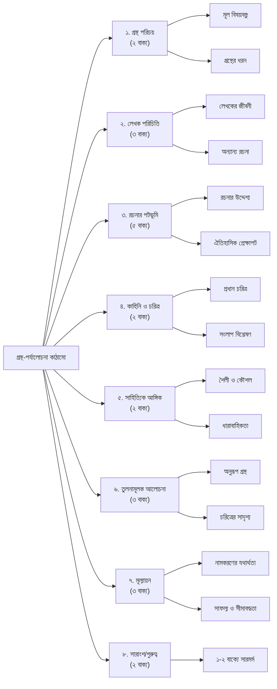

পরীক্ষায় উত্তর করার ক্ষেত্রে সময়কে বিবেচনায় রাখতে হবে। মোটামুটি ১৫ থেকে ১৮ মিনিটের মধ্যে গ্রন্থ-সমালোচনা লেখা শেষ করতে হবে। পুরো উত্তরকে কয়েকটি ছোট ছোট অনুচ্ছেদে ভাগ করে নেবেন। প্রথমে একটি শিরোনাম এবং সারসংক্ষেপ দিয়ে শুরু করবেন। যেমন:

‘একাত্তরের দিনগুলি’: হৃদয়ের রক্তক্ষরণ 
গ্রন্থের নাম: ‘একাত্তরের দিনগুলি’ 
লেখক: জাহানারা ইমাম 
প্রকাশকাল: 
প্রকাশনী: 
প্রচ্ছদশিল্পী: 
পৃষ্ঠাসংখ্যা:

<em>শিরোনামের নিচে গ্রন্থের নাম, লেখকের নাম লিখবেন। প্রথম প্রকাশকাল জানা থাকলে লিখবেন। তবে প্রচ্ছদশিল্পী, প্রকাশনী ও পৃষ্ঠাসংখ্যা লিখতে হবে না।</em>

**১ম অনুচ্ছেদ:** এ অংশে ১-২ বাক্যে গ্রন্থটির সাধারণ পরিচয় নিয়ে লিখবেন। যেমন: ‘একাত্তরের দিনগুলি’ একটি মুক্তিযুদ্ধভিত্তিক গ্রন্থ। এটি দিনলিপির আকারে লেখা।

**২য় অনুচ্ছেদ:** এ অংশে লেখক সম্পর্কে লিখবেন। তাঁর অন্য কোনো বইয়ের নাম জানা থাকলে লিখবেন। লেখকের জন্ম-মৃত্যু সাল জানা না থাকলে অন্তত সময়কাল সম্পর্কে লিখবেন। লেখকের গুরুত্বপূর্ণ অবদান সম্পর্কে লিখবেন। এককথায়, লেখক সম্পর্কে লিখবেন কমবেশি ৩ বাক্যে। যেমন: জাহানারা ইমামের বিশেষ খ্যাতি ‘একাত্তরের দিনগুলি’র জন্য। তিনি শহিদজননী হিসেবে খ্যাত। মুক্তিযুদ্ধের বিরোধিতাকারী শক্তির বিরুদ্ধে তিনি আজীবন ছিলেন সোচ্চার।

**৩য় অনুচ্ছেদ:** এ অংশে গ্রন্থের বৈশিষ্ট্য, গ্রন্থ রচনার কারণ বা উদ্দেশ্য, গ্রন্থের বিষয়ের ঐতিহাসিক প্রেক্ষাপট ইত্যাদি সম্পর্কে লিখতে হবে। যেমন: দিনলিপি জাতীয় গ্রন্থে লেখক দিনের বিবরণ দিয়ে থাকেন। ‘একাত্তরের দিনগুলি’ গ্রন্থে লেখক একাত্তরের শ্বাসরুদ্ধকর সময়কে তুলে এনেছেন। দীর্ঘ ২৩ বছরের শোষণ-বঞ্চনার অনিবার্য পরিণতি ছিল একাত্তরের মুক্তিযুদ্ধ। ১৯৭১ সালের ১ মার্চ থেকে উত্তাল হতে থাকে পূর্ব বাংলা। জাহানারা ইমাম তারিখ দিয়ে সেসব দিনের কাহিনি ও তথ্য তুলে ধরেছেন। মুক্তিযুদ্ধে দেশের পরিস্থিতি, মানুষের ভীতি ও আকাঙ্ক্ষার সঙ্গে একাকার হয়ে মিশে গেছে ব্যক্তিগত আবেগ-অনুভূতি। এভাবে ৪-৫ বাক্য লিখতে হবে।

**৪র্থ অনুচ্ছেদ:** গ্রন্থের কাহিনি, চরিত্র ইত্যাদি নিয়ে লিখতে হবে। এ অংশের সফলতা নির্ভর করে গ্রন্থ-পাঠের ওপর। অনেক গ্রন্থের ভূমিকা পড়েও এ অংশ ভালো লেখা যায়। একটি গ্রন্থ সম্পর্কে যত তথ্য জানা যায়, তত সুন্দর করে এই অনুচ্ছেদ লেখা যায়। এ অংশের নির্দিষ্ট আয়তন নেই। যেমন: ‘একাত্তরের দিনগুলি’ সরাসরি পড়া থাকলে লেখা সহজ হয় এখানকার রুমী চরিত্রটি কেমন, তার কী ভূমিকা, গ্রন্থে আর কোন কোন চরিত্র আছে। গ্রন্থের কাহিনি, বিষয়, সংলাপ এগুলোও আলোচনায় আসবে।

**৫ম অনুচ্ছেদ:** সাহিত্যের মধ্য দিয়ে প্রতিফলিত হয় মানুষের জীবন, অনেক সময় লেখক সুনির্দিষ্টভাবে কোনো মতবাদের প্রয়োগ ঘটান। এর বাইরেও আরও অনেক রকম লক্ষ্য বা আঙ্গিক-বৈচিত্র্য থাকে। এর সঙ্গে আলোচ্য গ্রন্থকে সংশ্লিষ্ট করা গেলে করতে হবে। যেমন: মার্ক্সবাদ, প্রেমম-লক, কল্পকাহিনি, আঞ্চলিক কাহিনি, আত্মজীবনী ইত্যাদি।

**৬ষ্ঠ অনুচ্ছেদ:** এ অংশে তুলনার কাজটি করতে হবে। যেমন: অনুরূপ বিষয় নিয়ে আর কোন কোন সাহিত্য রচিত হয়েছে, এর কিছু নমুনা দিতে হবে। একই গ্রন্থের কিংবা অন্য কোনো গ্রন্থের কোনো চরিত্রের সঙ্গে মেলানো যায় কি না, দেখতে হবে। আয়তন হতে পারে কমবেশি ৩ লাইন।

**৭ম অনুচ্ছেদ:** গ্রন্থের নামকরণের কারণ, বিষয় উপস্থাপনে বা চরিত্র সৃষ্টিতে লেখকের সফলতা-ব্যর্থতা বা কৌশল কিংবা অন্য যেকোনো ভালো-মন্দ দিকের মূল্যায়ন হবে এ অংশে। গ্রন্থের সম্ভাব্য নাম আর কী হতে পারত, কাহিনি অন্য কোন দিকে মোড় ঘোরানো যেত, চরিত্রের পরিণতির অন্য কোনো সুযোগ ছিল কি না, এ রকম বিষয় নিয়ে এ অংশে লিখবেন ৩-৪ লাইনে।

**৮ম অনুচ্ছেদ:** সবশেষে ১-২ বাক্যে উল্লেখ করবেন গ্রন্থটির গুরুত্ব কোথায়।

মোট ২২-২৩ বাক্য