---

### **Subject: Bangladesh Affairs (Code: 005)**


---

### **Question 01**

**(a) Provide a brief description of the Rarh Janapada of ancient Bengal. (5)**

**Answer:**
The Rarh region was one of the most prominent *janapadas* (territorial units) of ancient Bengal, located in its western part. Its geographical extent is historically identified as the area west of the Bhagirathi-Hooghly River.

1.  **Geographical Location:** The Rarh region primarily encompassed the modern-day districts of West Bengal, India, such as Bardhaman, Murshidabad, Birbhum, Bankura, and Hooghly. It was traditionally divided into two parts: Uttara-Rarh (North Rarh) and Dakhin-Rarh (South Rarh).
2.  **Historical References:** The earliest reference to this region is found in the ancient Jain text, the *Acharanga Sutra* (c. 4th century BCE), which describes it as a rugged and inhospitable land. In later periods, it became a significant political and cultural center.
3.  **Political Significance:** The Rarh region was an integral part of the Gauda Kingdom during the reign of Shashanka in the 7th century AD. It also played a crucial role during the Pala and Sena dynasties. The Sena dynasty, in fact, originated from the Rarh region.
4.  **Cultural and Economic Life:** The soil of the Rarh region is predominantly lateritic, making it less fertile than the alluvial plains of eastern Bengal. However, the area was rich in mineral resources, particularly iron ore, which fostered craftsmanship and trade. Over time, it developed into a hub of Brahminical culture and learning.

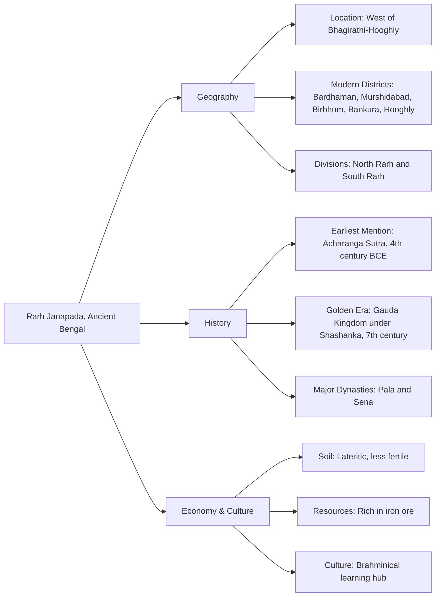
```mermaid
flowchart LR
    A[Rarh Janapada, Ancient Bengal] --> B[Geography]
    A --> C[History]
    A --> D[Economy & Culture]
    
    B --> B1[Location: West of Bhagirathi-Hooghly]
    B --> B2[Modern Districts: Bardhaman, Murshidabad, Birbhum, Bankura, Hooghly]
    B --> B3[Divisions: North Rarh and South Rarh]
    
    C --> C1[Earliest Mention: Acharanga Sutra, 4th century BCE]
    C --> C2[Golden Era: Gauda Kingdom under Shashanka, 7th century]
    C --> C3[Major Dynasties: Pala and Sena]
    
    D --> D1[Soil: Lateritic, less fertile]
    D --> D2[Resources: Rich in iron ore]
    D --> D3[Culture: Brahminical learning hub]
```

In conclusion, the Rarh janapada was a historically significant territory that, despite its challenging terrain, carved out a distinct political and cultural identity in ancient Bengal, serving as a cradle for powerful dynasties and a center of specific cultural traditions.

**(b) What is the Permanent Settlement? (5)**

- [x] **Answer:**
The Permanent Settlement was a landmark land revenue system introduced in 1793 by Lord Cornwallis, the then Governor-General of British India. It fundamentally restructured the land ownership and revenue collection mechanism in Bengal, Bihar, and Orissa.

The key features and consequences of the Permanent Settlement were:

1.  **Creation of a Zamindar Class:** The system recognized the *Zamindars* (landlords) as the absolute proprietors of the land, supplanting the traditional rights of the cultivators. Their ownership was hereditary and transferable.
2.  **Fixed Revenue:** The primary objective for the British East India Company was to secure a stable and fixed annual revenue. The land revenue payable by the Zamindars to the state was fixed in perpetuity. This ensured a predictable income for the Company, insulating it from fluctuations in agricultural output.
3.  **The 'Sunset Law':** A stringent clause dictated that if a Zamindar failed to pay the fixed revenue by sunset on a specified date, their zamindari (estate) would be sold in a public auction. This led to the ruin of many traditional Zamindar families.
4.  **Consequences for Peasants:** The system was disastrous for the peasants (*ryots*). While the state's share was fixed, the rent that Zamindars could extract from the peasants was left unregulated. This led to exorbitant rent demands, illegal cesses, and widespread exploitation, reducing the cultivators to tenants-at-will with no security of tenure.
5.  **Socio-Economic Impact:** The Permanent Settlement created a new, loyal landed aristocracy that supported British rule. However, it also led to widespread agrarian distress, peasant indebtedness, and a series of rural uprisings. It stunted agricultural investment, as neither the Zamindar (focused on rent extraction) nor the peasant (lacking capital and security) had the incentive to improve the land.

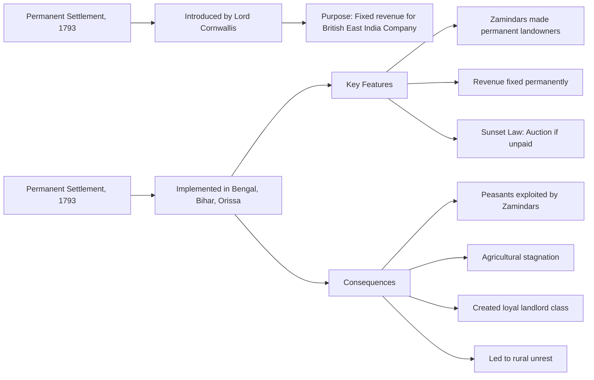
```mermaid
flowchart LR
	P[Permanent Settlement, 1793] --> B[Introduced by Lord Cornwallis]
    A[Permanent Settlement, 1793] --> C[Implemented in Bengal, Bihar, Orissa]
    
    B --> B1[Purpose: Fixed revenue for British East India Company]
    
    C --> C1[Key Features]
    C --> C2[Consequences]
    
    C1 --> C1a[Zamindars made permanent landowners]
    C1 --> C1b[Revenue fixed permanently]
    C1 --> C1c[Sunset Law: Auction if unpaid]
    
    C2 --> C2a[Peasants exploited by Zamindars]
    C2 --> C2b[Agricultural stagnation]
    C2 --> C2c[Created loyal landlord class]
    C2 --> C2d[Led to rural unrest]
```

~~**(c) What are the Six Points of the Awami League? (5)**~~

~~**Answer:**~~
~~The Six-Point Program was a historic political charter presented by Sheikh Mujibur Rahman, the leader of the Awami League, at a conference of opposition parties in Lahore in 1966. It was designed to address the deep-seated political, economic, and administrative disparities between East and West Pakistan and is widely regarded as the "charter of freedom" (*Muktir Sanad*) for the Bengali people.~~

~~The Six Points were:~~
1.  ~~**Federal System of Government:** The constitution should provide for a Federation of Pakistan in its true sense on the basis of the Lahore Resolution, and a parliamentary form of government with the supremacy of a legislature directly elected on the basis of universal adult franchise.~~
2.  ~~**Central Government's Powers:** The federal government should deal with only two subjects: Defence and Foreign Affairs, and all other residuary subjects shall be vested in the federating states.~~
3.  ~~**Separate Currencies:** Two separate but freely convertible currencies for the two wings; or if this is not feasible, a single currency with effective constitutional provisions to stop the flight of capital from East to West Pakistan. A separate Banking Reserve and a separate fiscal and monetary policy for East Pakistan should be established.~~
4.  ~~**Power of Taxation:** The power of taxation and revenue collection shall be vested in the federating units and the federal center will have no such power. The federation will be entitled to a share in the state taxes to meet its expenditures.~~
5.  ~~**Foreign Trade:** The two wings shall have separate accounts for their foreign exchange earnings. The foreign exchange earned by East Pakistan should be under the control of the East Pakistan government, and the foreign policy, including the negotiation of trade and aid, should be handled by the provinces.~~
6.  ~~**Paramilitary Force:** East Pakistan should have a separate militia or paramilitary force to contribute to national security.~~

~~**(d) What was the main significance of the Awami League's victory in 1970? (5)**~~

~~**Answer:**~~
~~The landslide victory of the Awami League in the 1970 general election was a watershed moment in the history of Bangladesh. Its significance transcends that of a mere electoral triumph; it was the decisive political event that paved the way for the independence of Bangladesh.~~

~~The key points of its significance are:~~

1.  ~~**An Unambiguous Mandate for Autonomy:** The election was fought almost exclusively on the platform of the Six-Point Program. The Awami League's victory, securing 167 out of 169 seats in East Pakistan, was an overwhelming and legitimate popular referendum in favor of regional autonomy and an end to West Pakistani domination.~~
2.  ~~**Establishment of Bengali Nationalist Identity:** The result legally and democratically established the Bengalis as a distinct political entity with a unified voice under the leadership of Sheikh Mujibur Rahman. It demonstrated that the "Two-Nation Theory" based on religion had failed to hold the two wings of Pakistan together.~~
3.  ~~**Legitimization of Sheikh Mujibur Rahman's Leadership:** The victory unequivocally positioned Sheikh Mujib as the sole spokesperson for the 75 million people of East Pakistan and the majority leader of Pakistan as a whole, giving him the constitutional authority to form the government.~~
4.  ~~**Exposure of the West Pakistani Establishment:** The subsequent refusal of the Pakistani military-bureaucratic establishment, led by General Yahya Khan and Zulfikar Ali Bhutto, to honor the election results and transfer power to the Awami League exposed their undemocratic nature. This act of political betrayal nullified any remaining hope for a united Pakistan and made the call for independence inevitable.~~

~~In essence, the 1970 election victory provided the constitutional and moral foundation for the Bangladesh Liberation War. It transformed the political struggle for autonomy into a national struggle for liberation.~~

---

### **Question 02**

**(a) Briefly explain the geographical location of Bangladesh in South Asia. (5)**

**Answer:**
Bangladesh possesses a unique and strategic geographical location in South Asia, acting as a bridge between the Indian subcontinent and Southeast Asia.

*   **Coordinates and Boundaries:** It is situated in the northeastern part of the South Asian subcontinent, between 20°34' and 26°38' north latitude and 88°01' and 92°41' east longitude.
*   **Neighboring Countries:** Bangladesh is bordered by India on three sides—west, north, and east. It shares a small southeastern border with Myanmar. To the south lies the Bay of Bengal, providing vital maritime access.

| **Border** | **Country/Body** | **Approximate Length** |
| :--- | :--- | :--- |
| **West, North, East** | India | 4,096 km |
| **Southeast** | Myanmar | 271 km |
| **South** | Bay of Bengal | 580 km coastline |

*   **Geostrategic Importance:** Its location makes it a critical nexus for regional connectivity. It serves as a natural gateway for India's landlocked northeastern states to the sea. Furthermore, its position on the Bay of Bengal places it at the heart of major international shipping lanes, connecting the Indian Ocean region with the Pacific. This strategic positioning is central to regional initiatives like BIMSTEC and BCIM.
*   **Topography:** Bangladesh is predominantly a low-lying riverine delta, formed by the alluvial deposits of the Ganges (Padma), Brahmaputra (Jamuna), and Meghna river systems. This deltaic plain makes the country exceptionally fertile but also highly vulnerable to natural disasters like floods and cyclones.

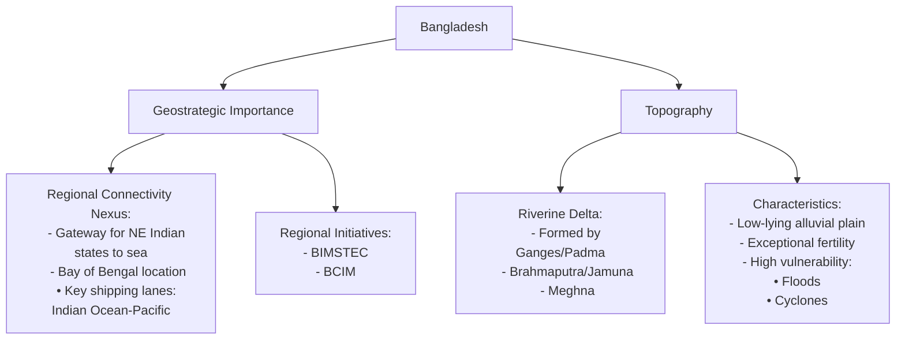
```mermaid
flowchart TD
    A[Bangladesh] --> B[Geostrategic Importance]
    A --> C[Topography]
    
    B --> B1["Regional Connectivity Nexus:
    - Gateway for NE Indian states to sea
    - Bay of Bengal location
    • Key shipping lanes: Indian Ocean-Pacific"]
    
    B --> B2["Regional Initiatives:
    - BIMSTEC
    - BCIM"]
    
    C --> C1["Riverine Delta:
    - Formed by Ganges/Padma
    - Brahmaputra/Jamuna
    - Meghna"]
    
    C --> C2["Characteristics:
    - Low-lying alluvial plain
    - Exceptional fertility
    - High vulnerability:
      • Floods
      • Cyclones"]
```

**(b) What is the economic importance of the Bay of Bengal? (5)**

**Answer:**
The Bay of Bengal is the economic lifeline of Bangladesh, offering immense opportunities that are central to the nation's present and future prosperity. Its economic importance can be summarized as follows:

1.  **Maritime Trade and Ports:** Over 90% of Bangladesh's international trade by volume is conducted through its seaports on the Bay of Bengal. The Chattogram Port is the country's primary maritime gateway, supported by the Mongla and Payra ports. These ports are crucial for the import of industrial raw materials and capital machinery and the export of key products like readymade garments (RMG).
2.  **Fisheries and Marine Resources:** The Bay is a rich source of marine fisheries, contributing significantly to the national diet, employment, and export earnings. Hilsa, the national fish, is a major catch. The shrimp industry is a vital source of foreign currency. The development of a "Blue Economy" aims to sustainably harness these resources further.
3.  **Natural Gas and Energy Reserves:** Following the successful resolution of maritime boundary disputes with Myanmar (2012) and India (2014), Bangladesh has gained sovereign rights over 118,813 square kilometers of sea area. This area contains significant potential for offshore natural gas exploration, which is critical for meeting the country's growing energy demands.
4.  **Tourism:** The coastal belt along the Bay of Bengal, featuring the world's longest natural sea beach at Cox's Bazar and the coral island of St. Martin, is the hub of Bangladesh's tourism industry, generating revenue and employment.
5.  **Shipbuilding and Ship-breaking:** The coastal areas have fostered a burgeoning shipbuilding industry catering to both domestic and international markets. The ship-breaking industry, though controversial for its environmental and safety standards, also provides a significant source of scrap steel for local industries.

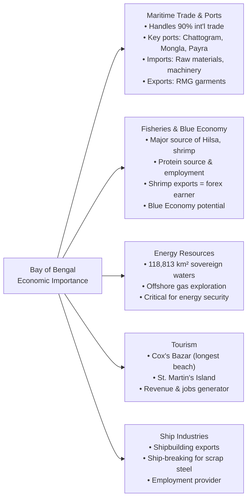
```mermaid
flowchart LR
    A[Bay of Bengal<br>Economic Importance] --> B["Maritime Trade & Ports<br>• Handles 90% int'l trade<br>• Key ports: Chattogram, Mongla, Payra<br>• Imports: Raw materials, machinery<br>• Exports: RMG garments"]
    A --> C["Fisheries & Blue Economy<br>• Major source of Hilsa, shrimp<br>• Protein source & employment<br>• Shrimp exports = forex earner<br>• Blue Economy potential"]
    A --> D["Energy Resources<br>• 118,813 km² sovereign waters<br>• Offshore gas exploration<br>• Critical for energy security"]
    A --> E["Tourism<br>• Cox's Bazar (longest beach)<br>• St. Martin's Island<br>• Revenue & jobs generator"]
    A --> F["Ship Industries<br>• Shipbuilding exports<br>• Ship-breaking for scrap steel<br>• Employment provider"]
```

**(c) Provide a brief description of the forest resources of Bangladesh. (5)**

**Answer:**
Despite its high population density, Bangladesh possesses diverse forest resources that are vital for its ecological balance and economy. According to the Bangladesh Forest Department, total forest cover is approximately 17.5% of the country's land area. These resources can be classified into three main types:

1.  **Hill Forests:** Located in the southeastern (Chattogram Hill Tracts, Cox's Bazar) and northeastern (Sylhet) regions, these evergreen and semi-evergreen forests constitute the largest forest area. They are rich in biodiversity and are a source of valuable timber species like Teak (*Tectona grandis*), Garjan (*Dipterocarpus spp.*), and Jarul (*Lagerstroemia speciosa*). Bamboo and cane are also abundant, serving as crucial raw materials for paper mills and cottage industries.
2.  **Mangrove Forests (The Sundarbans):** The Sundarbans, a UNESCO World Heritage Site located in the southwest, is the world's largest single tract of mangrove forest. It is dominated by the salt-tolerant Sundari (*Heritiera fomes*) tree, from which it derives its name, along with Gewa (*Excoecaria agallocha*). The Sundarbans serve as a critical natural barrier against cyclones and tidal surges. Economically, they provide timber, firewood, honey, and fish, supporting the livelihoods of millions. It is also the last remaining habitat of the Royal Bengal Tiger.
3.  **Plain Land Sal Forests (Deciduous):** These forests are primarily found in the central and northern districts, such as Gazipur, Tangail, and Dinajpur. The dominant species is Sal (*Shorea robusta*). These forests have faced severe degradation due to encroachment and deforestation but are crucial for local ecosystems and provide firewood and non-timber products for local communities.

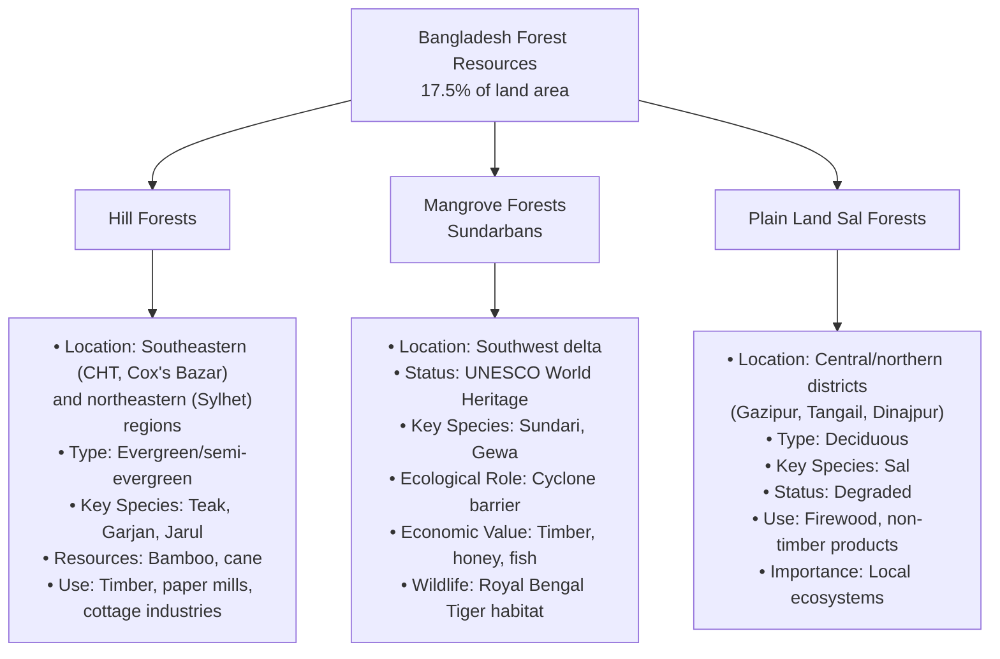
```mermaid
flowchart TD
    A[Bangladesh Forest Resources<br>17.5% of land area] --> B[Hill Forests]
    A --> C[Mangrove Forests<br>Sundarbans]
    A --> D[Plain Land Sal Forests]
    
    B --> B1["• Location: Southeastern (CHT, Cox's Bazar)<br> and northeastern (Sylhet) regions<br>• Type: Evergreen/semi-evergreen<br>• Key Species: Teak, Garjan, Jarul<br>• Resources: Bamboo, cane<br>• Use: Timber, paper mills, cottage industries"]
    
    C --> C1["• Location: Southwest delta<br>• Status: UNESCO World Heritage<br>• Key Species: Sundari, Gewa<br>• Ecological Role: Cyclone barrier<br>• Economic Value: Timber, honey, fish<br>• Wildlife: Royal Bengal Tiger habitat"]
    
    D --> D1["• Location: Central/northern districts<br>(Gazipur, Tangail, Dinajpur)<br>• Type: Deciduous<br>• Key Species: Sal<br>• Status: Degraded<br>• Use: Firewood, non-timber products<br>• Importance: Local ecosystems"]
```

**(d) Briefly discuss the environmental impact of the Teesta River water scarcity. (5)**

**Answer:**
The scarcity of water in the Teesta River, particularly during the dry season (December to March), has precipitated a severe environmental crisis in northern Bangladesh. The reduced flow, largely attributed to upstream water diversion, has the following environmental impacts:

1.  **Desertification and Land Degradation:** The Teesta basin in Bangladesh, covering over 2,750 square kilometers of agricultural land, is experiencing a process akin to desertification. The lack of surface water leads to excessive groundwater extraction, lowering the water table and causing the land to dry out, lose fertility, and become barren.
2.  **Loss of Agricultural Productivity:** The Teesta Barrage Project, designed to irrigate 750,000 hectares of land, operates at a fraction of its capacity due to water shortage. This severely impacts the cultivation of the main dry-season crop, *Boro* rice, leading to massive crop losses, reduced food security, and economic hardship for millions of farmers.
3.  **Impact on River Ecology and Biodiversity:** The drastic reduction in water flow has transformed parts of the once-mighty river into stagnant pools or sandy channels (*char* lands). This has destroyed fish habitats, leading to a sharp decline in native fish populations and threatening the livelihoods of thousands of fishing communities. The overall riverine ecosystem is collapsing.
4.  **Socio-Economic Disruption:** The crisis has triggered a cycle of poverty and forced migration. Farmers and fishermen, unable to sustain their traditional livelihoods, are often forced to move to urban areas in search of work, creating additional pressure on cities. The environmental degradation is thus directly linked to profound social and economic dislocation.

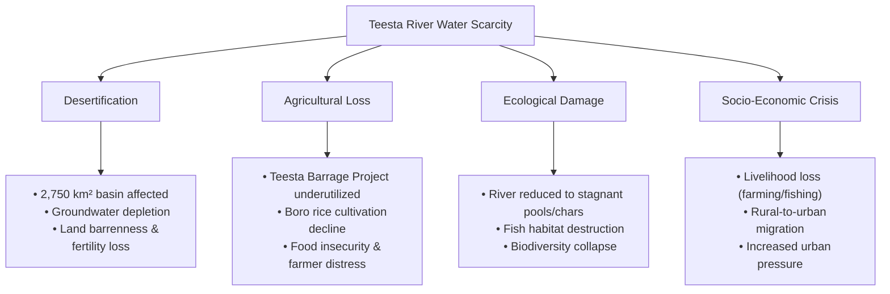
```mermaid
flowchart TD
    A[Teesta River Water Scarcity] --> B[Desertification]
    A --> C[Agricultural Loss]
    A --> D[Ecological Damage]
    A --> E[Socio-Economic Crisis]

    B --> B1["• 2,750 km² basin affected
    • Groundwater depletion
    • Land barrenness & fertility loss"]

    C --> C1["• Teesta Barrage Project underutilized
    • Boro rice cultivation decline
    • Food insecurity & farmer distress"]

    D --> D1["• River reduced to stagnant pools/chars
    • Fish habitat destruction
    • Biodiversity collapse"]

    E --> E1["• Livelihood loss (farming/fishing)
    • Rural-to-urban migration
    • Increased urban pressure"]
```

---
### **Question 03**

**(a) Provide a description of Bangladesh's Gross Domestic Product (GDP) over the last five consecutive years. (5)**

**Answer:**
Over the past five years, Bangladesh's Gross Domestic Product (GDP) has demonstrated remarkable resilience and consistent growth, despite global challenges such as the COVID-19 pandemic and geopolitical tensions. The country's economy has been one of the fastest-growing in the world.

Here is a summary of Bangladesh's GDP growth, based on data from the Bangladesh Bureau of Statistics (BBS) and the Ministry of Finance:

| Fiscal Year (FY) | GDP Growth Rate (%) | Nominal GDP (approx. in US$ Billion) | Key Drivers / Remarks                                                                               |
| :--------------- | :------------------ | :----------------------------------- | :-------------------------------------------------------------------------------------------------- |
| **FY 2018-19**   | 7.88%               | $302                                 | Pre-pandemic peak growth, driven by strong manufacturing and service sectors.                       |
| **FY 2019-20**   | 3.45%               | $324                                 | Growth slowed significantly due to the initial impact of the COVID-19 pandemic and lockdowns.       |
| **FY 2020-21**   | 6.94%               | $353                                 | A strong V-shaped recovery, powered by robust export (RMG) performance and high remittance inflows. |
| **FY 2021-22**   | 7.10%               | $416                                 | Continued strong growth as the economy fully reopened. Strong domestic demand and export growth.    |
| **FY 2022-23**   | 6.03%               | $460                                 | Growth moderated due to global economic slowdown, high inflation, and pressure on foreign reserves. |

**GDP Growth Rate of Bangladesh (FY2019-FY2023)**

```
      8% | 7.88%
         |   *
      7% |       * 6.94% * 7.10%
         |             
      6% |                       * 6.03%
         |
      5% |
         |
      4% |
         |
      3% |   * 3.45%
         |
      2% |
         |
      1% |
         |
      0% +------------------------------------
         FY19    FY20    FY21    FY22    FY23
```
This trajectory showcases the fundamental strength of Bangladesh's economy, underpinned by its dynamic private sector, particularly the RMG industry, resilient agricultural sector, and steady remittance inflows. While recent global headwinds have posed challenges, the long-term growth narrative remains positive.

**(b) What contribution does the remittance sector make to the economic development of Bangladesh? (5)**

**Answer:**
Remittance, the money sent home by millions of Bangladeshi expatriates, is a cornerstone of the nation's economic development. It functions as a stable and significant source of foreign currency, profoundly impacting the economy at both macro and micro levels.

Key contributions include:
1.  **Strengthening Foreign Exchange Reserves:** Remittance is the second-largest source of foreign currency earnings after RMG exports. In FY 2020-21, Bangladesh received a record $24.77 billion. This inflow is vital for maintaining a stable balance of payments, financing imports, and servicing external debt.
2.  **Poverty Alleviation and Improved Livelihoods:** At the micro-level, remittances directly increase the disposable income of recipient households. This money is primarily used for daily consumption, better nutrition, housing, healthcare, and education, leading to a direct reduction in poverty and an improvement in the Human Development Index (HDI).
3.  **Boosting Domestic Demand:** By increasing household consumption, remittances create a significant multiplier effect in the domestic economy. This stimulates local markets, small businesses, and the service sector, contributing to overall GDP growth.
4.  **Fueling Investment and Entrepreneurship:** A portion of remittance income is channeled into savings and small-scale investments, such as purchasing agricultural land, starting small businesses, or investing in real estate. This contributes to capital formation and local economic development.
5.  **Social Transformation:** Remittances empower families, particularly women who often manage household finances. Access to education and healthcare funded by remittances leads to long-term social benefits and human capital development.

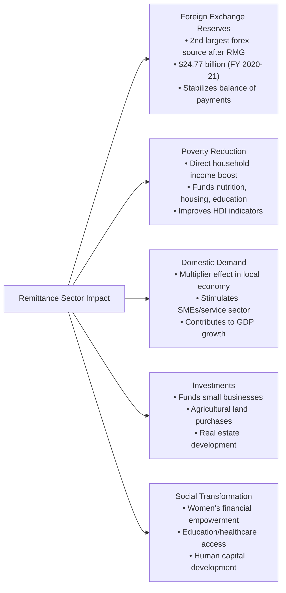
```mermaid
flowchart LR
    A[Remittance Sector Impact] --> B["Foreign Exchange Reserves
    • 2nd largest forex source after RMG
    • $24.77 billion (FY 2020-21)
    • Stabilizes balance of payments"]
    
    A --> C["Poverty Reduction
    • Direct household income boost
    • Funds nutrition, housing, education
    • Improves HDI indicators"]
    
    A --> D["Domestic Demand
    • Multiplier effect in local economy
    • Stimulates SMEs/service sector
    • Contributes to GDP growth"]
    
    A --> E["Investments
    • Funds small businesses
    • Agricultural land purchases
    • Real estate development"]
    
    A --> F["Social Transformation
    • Women's financial empowerment
    • Education/healthcare access
    • Human capital development"]
```

**(c) Highlight five obstacles to industrialization in Bangladesh. (5)**

**Answer:**
Despite significant progress, Bangladesh's path to full-fledged industrialization is constrained by several persistent obstacles. Five of the most critical challenges are:

1.  **Infrastructure Deficit:** Inadequate infrastructure remains a primary bottleneck. This includes an unreliable power supply, which increases operational costs for factories; congested and underdeveloped road, rail, and port networks, which delay the movement of raw materials and finished goods; and a lack of sufficient Economic Zones with full-service utilities.
2.  **Bureaucratic Inefficiency and Corruption:** Complex bureaucratic procedures, a lack of transparency, and pervasive corruption create significant hurdles for investors. Delays in getting licenses, permits, and utility connections, often compounded by demands for illicit payments, increase the cost of doing business and deter both domestic and foreign investment.
3.  **Shortage of Skilled Labor:** While Bangladesh has abundant labor, there is a critical shortage of technically skilled and managerial-level workers. The education system is often not aligned with industry needs, leading to a skills gap. This forces industries to hire expensive foreign experts and limits the country's ability to move up the value chain from low-end manufacturing to more sophisticated production.
4.  **Limited Access to Finance:** Small and Medium Enterprises (SMEs), which form the backbone of the economy, face significant challenges in accessing affordable finance. High-interest rates, stringent collateral requirements by banks, and a nascent corporate bond market limit their ability to expand, innovate, and adopt new technologies.
5.  **Policy and Political Instability:** Although political stability has improved, a history of political unrest and policy inconsistency can create an uncertain investment climate. Abrupt changes in tax, tariff, or regulatory policies can disrupt business planning and undermine investor confidence.

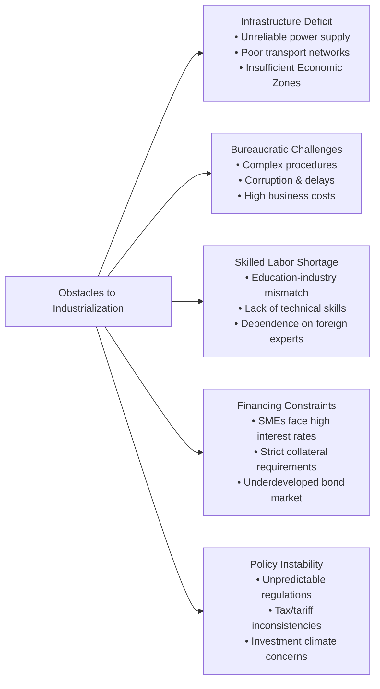
```mermaid
flowchart LR
    A[Obstacles to Industrialization] --> B["Infrastructure Deficit
    • Unreliable power supply
    • Poor transport networks
    • Insufficient Economic Zones"]
    
    A --> C["Bureaucratic Challenges
    • Complex procedures
    • Corruption & delays
    • High business costs"]
    
    A --> D["Skilled Labor Shortage
    • Education-industry mismatch
    • Lack of technical skills
    • Dependence on foreign experts"]
    
    A --> E["Financing Constraints
    • SMEs face high interest rates
    • Strict collateral requirements
    • Underdeveloped bond market"]
    
    A --> F["Policy Instability
    • Unpredictable regulations
    • Tax/tariff inconsistencies
    • Investment climate concerns"]
```

**(d) Provide a brief overview of Bangladesh's progress in social development indicators. (5)**

**Answer:**
Bangladesh has achieved remarkable and widely acclaimed success in social development over the past few decades, often outperforming countries with similar or higher per capita incomes. This progress is a testament to targeted government policies, a vibrant NGO sector, and community participation.

Key areas of progress include:
1.  **Poverty Reduction:** The national poverty rate has seen a dramatic decline, falling from 44.2% in 1991 to 18.7% in 2022, with the extreme poverty rate dropping to 5.6% (BBS data).
2.  **Health and Longevity:** Life expectancy at birth has risen significantly, reaching approximately 72.8 years. The infant mortality rate has been reduced to 21 per 1,000 live births, and the under-five mortality rate has also fallen sharply, thanks to successful immunization programs and improved primary healthcare.
3.  **Education and Gender Parity:** Bangladesh has achieved near-universal primary school enrollment, with a net enrollment rate of over 97%. Critically, it has achieved gender parity in primary and secondary education, with more girls than boys now enrolled in secondary schools.
4.  **Women's Empowerment:** Progress in women's empowerment is a hallmark of Bangladesh's social development. This is evident in women's participation in the labor force (especially in the RMG sector), their involvement in local government, and improved access to microfinance.
5.  **Human Development Index (HDI):** Reflecting these gains, Bangladesh has steadily climbed the UNDP's HDI rankings. In the 2021/22 report, it was placed in the "Medium Human Development" category with a score of 0.661, ranking 129th, ahead of regional peers like India and Pakistan.

This "Bangladesh Paradox" of achieving strong social development despite economic constraints is a celebrated model for other developing nations.

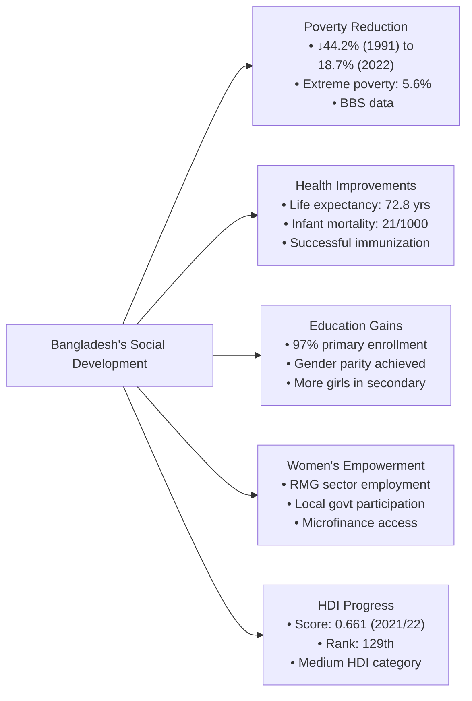
```mermaid
flowchart LR
    A[Bangladesh's Social Development] --> B["Poverty Reduction
    • ↓44.2% (1991) to 18.7% (2022)
    • Extreme poverty: 5.6%
    • BBS data"]
    
    A --> C["Health Improvements
    • Life expectancy: 72.8 yrs
    • Infant mortality: 21/1000
    • Successful immunization"]
    
    A --> D["Education Gains
    • 97% primary enrollment
    • Gender parity achieved
    • More girls in secondary"]
    
    A --> E["Women's Empowerment
    • RMG sector employment
    • Local govt participation
    • Microfinance access"]
    
    A --> F["HDI Progress
    • Score: 0.661 (2021/22)
    • Rank: 129th
    • Medium HDI category"]
```
---
### **Question 04**


**(a) What do you understand by environmental degradation in Bangladesh? (5)**

**Answer:**

Environmental degradation in Bangladesh refers to the systematic deterioration of the natural environment through the depletion of resources such as air, water, and soil; the destruction of ecosystems; and the loss of biodiversity. It is an acute problem driven by the immense pressure of a high population density, unplanned urbanization, and unsustainable industrial and agricultural practices. The World Bank estimates that air and water pollution cost Bangladesh about **3-4% of its GDP annually**.

In the context of Bangladesh, this degradation manifests in several critical forms:

*   **Water Pollution:** Rivers and water bodies, particularly around major cities, are severely polluted. The rivers surrounding Dhaka—the Buriganga, Turag, and Shitalakshya—receive an estimated **1.5 million cubic meters of untreated wastewater** daily from industrial and municipal sources. The tannery and textile dyeing industries are major culprits, discharging toxic effluents containing heavy metals like chromium and lead.

*   **Air Pollution:** Major cities, especially Dhaka, consistently rank among the world's most polluted. Dhaka frequently tops the list with its Air Quality Index (AQI) often exceeding **300**, a level considered "hazardous." Brick kilns are a primary contributor, accounting for an estimated **58% of Dhaka's air pollution** during the dry season.

*   **Deforestation and Land Degradation:** While official figures state forest cover is around **17.5%**, the actual tree cover is estimated to be much lower, closer to **10-13%**. Furthermore, Bangladesh loses approximately **1% of its agricultural land** every year to urbanization and non-agricultural uses. In the coastal belt, salinity has affected over **1 million hectares of land**, a significant increase from previous decades, primarily due to sea-level rise and shrimp farming.

*   **Loss of Biodiversity:** The degradation of habitats is leading to a rapid decline in species. According to the IUCN Red List for Bangladesh, nearly **390 animal species** are now threatened with extinction. This includes a significant number of freshwater fish, birds, and mammals, threatening the nation's ecological balance.

This degradation not only harms the environment but also has severe consequences for public health, economic productivity, and the livelihoods of millions who depend directly on natural resources.

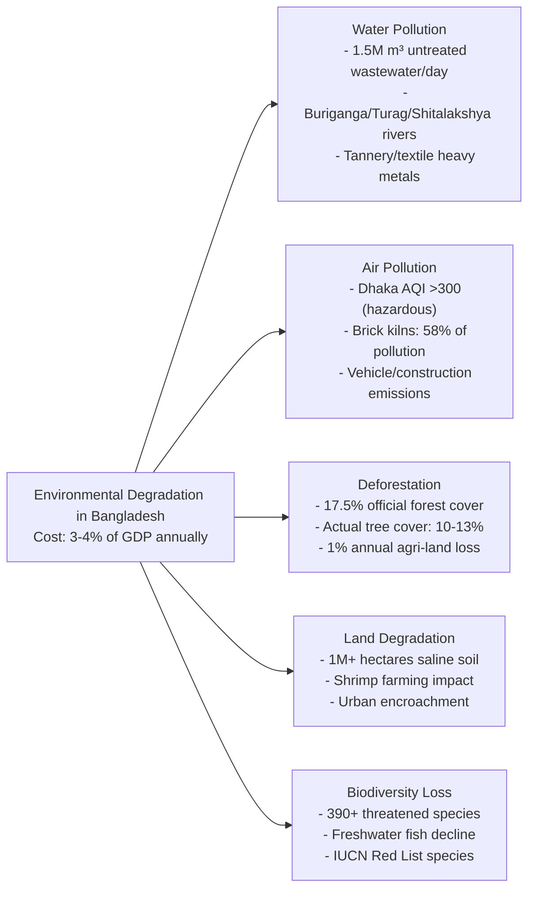
```mermaid
flowchart LR
    A[Environmental Degradation in Bangladesh\nCost: 3-4% of GDP annually] --> B["Water Pollution
    - 1.5M m³ untreated wastewater/day
    - Buriganga/Turag/Shitalakshya rivers
    - Tannery/textile heavy metals"]
    
    A --> C["Air Pollution
    - Dhaka AQI >300 (hazardous)
    - Brick kilns: 58% of pollution
    - Vehicle/construction emissions"]
    
    A --> D["Deforestation
    - 17.5% official forest cover
    - Actual tree cover: 10-13%
    - 1% annual agri-land loss"]
    
    A --> E["Land Degradation
    - 1M+ hectares saline soil
    - Shrimp farming impact
    - Urban encroachment"]
    
    A --> F["Biodiversity Loss
    - 390+ threatened species
    - Freshwater fish decline
    - IUCN Red List species"]
```

**(b) In your view, what are the main causes of river pollution in Bangladesh? (5)**

**Answer:**
In my view, the primary causes of the severe river pollution in Bangladesh are a combination of unregulated industrial growth, inadequate urban waste management, and unsustainable agricultural practices.

The main causes are:
1.  **Untreated Industrial Effluents:** This is arguably the single largest cause. The textile dyeing, pharmaceutical, and leather (tannery) industries are notorious for discharging vast quantities of toxic and untreated liquid waste directly into rivers like the Buriganga, Shitalakshya, and Turag. These effluents contain heavy metals, dyes, and harmful chemicals.
2.  **Inadequate Municipal Waste Management:** Major cities, including Dhaka and Chattogram, lack comprehensive sewage treatment facilities. A massive volume of untreated domestic sewage and solid waste is dumped directly into the surrounding rivers, severely depleting dissolved oxygen and making the water biologically dead.
3.  **Agrochemical Runoff:** The intensive use of chemical fertilizers and pesticides in agriculture leads to significant runoff into rivers and water bodies during the monsoon season. These chemicals cause eutrophication (algal blooms) and harm aquatic life.
4.  **River Encroachment and Dumping:** The illegal encroachment on riverbanks for construction and the direct dumping of solid waste constrict river flow and turn rivers into garbage dumps, further exacerbating pollution.
5.  **Oil and Waste from Water Transport:** Unregulated and often poorly maintained water vessels leak diesel, oil, and other pollutants into the waterways, which are a major mode of transport in the country.
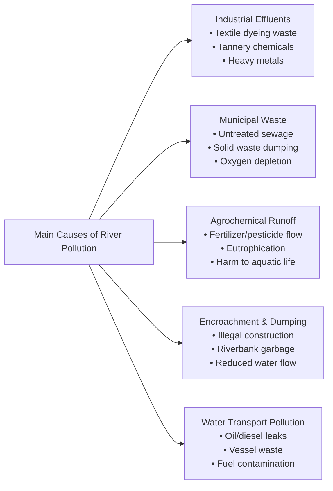
```mermaid
flowchart LR
    A[Main Causes of River Pollution] --> B["Industrial Effluents
    • Textile dyeing waste
    • Tannery chemicals
    • Heavy metals"]
    
    A --> C["Municipal Waste
    • Untreated sewage
    • Solid waste dumping
    • Oxygen depletion"]
    
    A --> D["Agrochemical Runoff
    • Fertilizer/pesticide flow
    • Eutrophication
    • Harm to aquatic life"]
    
    A --> E["Encroachment & Dumping
    • Illegal construction
    • Riverbank garbage
    • Reduced water flow"]
    
    A --> F["Water Transport Pollution
    • Oil/diesel leaks
    • Vessel waste
    • Fuel contamination"]
```
A fundamental lack of enforcement of environmental laws and regulations underpins all these causes.

**(c) Present a picture of waste management in Bangladesh. (5)**

**Answer:**
The waste management system in Bangladesh presents a picture of significant challenges and nascent but growing efforts at modernization. It is characterized by low collection efficiency, reliance on open dumping, and a dominant informal sector.

*   **Collection and Disposal:** In major urban centers, City Corporations are responsible for waste collection. However, collection rates are often below 70%, with a significant portion of waste remaining uncollected on streets and in open spaces. The collected waste is predominantly transported to open, unhygienic landfills (e.g., Matuail and Aminbazar in Dhaka), which lack proper lining and leachate treatment, leading to severe soil and groundwater contamination.
*   **Lack of Segregation:** There is virtually no system for waste segregation at the source (household or commercial level). Organic, plastic, medical, and electronic waste are all mixed, making recycling and treatment difficult and inefficient.
*   **The Informal Sector:** A vast informal sector, comprised of thousands of *tokais* (waste pickers), plays a crucial but unrecognized role. They manually salvage recyclable materials like plastic, glass, and metal from bins and landfills. While they contribute significantly to recycling, they work in hazardous conditions with no health or social protection.
*   **Emerging Initiatives:** Recognizing the crisis, there are emerging initiatives focused on improvement. These include:
    *   Pilot projects for composting organic waste.
    *   Public-Private Partnership (PPP) projects for waste-to-energy plants.
    *   Community-based waste management programs in certain localities.
    *   Government policies promoting the "3R" principle (Reduce, Reuse, Recycle).

However, these efforts are still small in scale and face challenges of funding, public awareness, and institutional capacity.

**(d) What impact could future sea-level rise have on the climate of Bangladesh? (5)**

**Answer:**
Future sea-level rise (SLR), driven by global climate change, poses an existential threat to Bangladesh. Its impact extends beyond simple inundation, threatening to profoundly alter the country's physical, social, and economic landscape.

The key potential impacts are:
1.  **Permanent Inundation and Land Loss:** As a low-lying delta, Bangladesh is extremely vulnerable. A one-meter rise in sea level is projected to inundate approximately 17-20% of the country's coastal land, displacing an estimated 20-30 million people and creating a massive internal and cross-border "climate refugee" crisis.
2.  **Increased Salinity Intrusion:** SLR will push saltwater further inland through rivers and into groundwater aquifers. This will render vast tracts of agricultural land in the coastal belt (the country's "food basket") unfit for traditional crop cultivation, threatening food security. It will also contaminate sources of drinking water, leading to public health crises.
3.  **Exacerbation of Natural Disasters:** A higher sea level will provide an elevated base for storm surges, making cyclones more destructive and capable of penetrating further inland. The frequency and intensity of coastal flooding and waterlogging will increase dramatically.
4.  **Threat to the Sundarbans:** The Sundarbans mangrove forest, a vital ecological buffer and a UNESCO World Heritage site, is critically threatened. Increased salinity and inundation will destroy the habitat of the dominant Sundari trees and other species, leading to a catastrophic loss of biodiversity, including the habitat of the Royal Bengal Tiger, and compromising the coast's primary natural defense against cyclones.
5.  **Damage to Infrastructure:** Coastal infrastructure, including ports, roads, embankments, and urban centers like Chattogram and Khulna, will face increased risks of flooding and damage, requiring massive investment in climate-resilient adaptation measures.

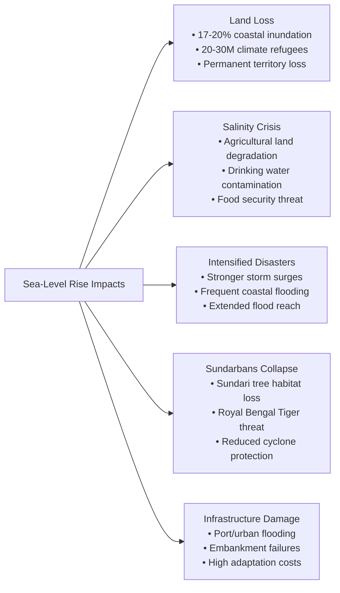
```mermaid
flowchart LR
    A[Sea-Level Rise Impacts] --> B["Land Loss
    • 17-20% coastal inundation
    • 20-30M climate refugees
    • Permanent territory loss"]

    A --> C["Salinity Crisis
    • Agricultural land degradation
    • Drinking water contamination
    • Food security threat"]

    A --> D["Intensified Disasters
    • Stronger storm surges
    • Frequent coastal flooding
    • Extended flood reach"]

    A --> E["Sundarbans Collapse
    • Sundari tree habitat loss
    • Royal Bengal Tiger threat
    • Reduced cyclone protection"]

    A --> F["Infrastructure Damage
    • Port/urban flooding
    • Embankment failures
    • High adaptation costs"]
```
---
### **Question 05**

**(a) Write down Article 12 of the Bangladesh Constitution regarding secularism. (5)**

**Answer:**
Article 12 of the Constitution of the People's Republic of Bangladesh lays down the principles for realizing secularism. This article was part of the original 1972 Constitution, was later removed, and then restored through the 15th Amendment in 2011.

The article, titled "Secularism and Freedom of Religion," states that the principle of secularism shall be realized by the elimination of:
*   **(a) Communalism in all its forms;**
*   **(b) The granting by the State of political status in favour of any religion;**
*   **(c) The abuse of religion for political purposes;**
*   **(d) Any discrimination against, or persecution of, persons practising a particular religion.**

This article provides the constitutional foundation for a state that is neutral in matters of religion, does not favour any single faith, and is committed to preventing the misuse of religion for political ends and protecting all citizens from religious discrimination.

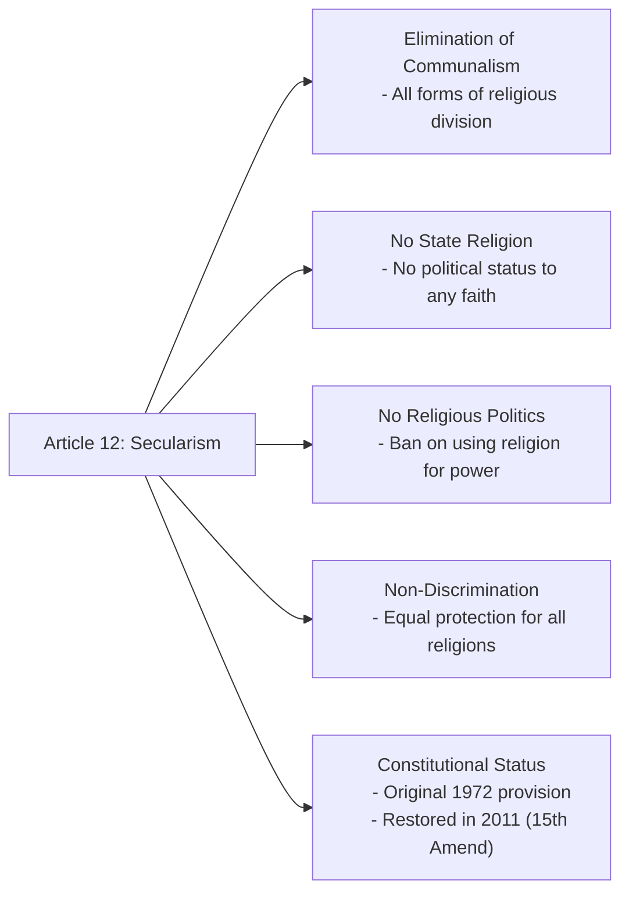
```mermaid
flowchart LR
    A[Article 12: Secularism] --> B["Elimination of Communalism
    - All forms of religious division"]
    
    A --> C["No State Religion
    - No political status to any faith"]
    
    A --> D["No Religious Politics
    - Ban on using religion for power"]
    
    A --> E["Non-Discrimination
    - Equal protection for all religions"]
    
    A --> F["Constitutional Status
    - Original 1972 provision
    - Restored in 2011 (15th Amend)"]
```

(b) What kind of reforms would you propose for Article 70 of the Bangladesh Constitution? (5)**

**Answer:**
Article 70 of the Bangladesh Constitution, which deals with the vacation of a seat by a Member of Parliament (MP) for voting against their party, is a subject of intense debate. While intended to ensure party discipline and government stability, it is widely criticized for stifling internal democracy.

I would propose the following balanced reforms:
1.  **Limit the Scope of Application:** The restrictions of Article 70 should be limited only to critical votes that determine the government's survival. Specifically, it should apply exclusively to:
    *   **Votes of No-Confidence:** An MP voting against their party in a no-confidence motion would have to resign.
    *   **Annual Budget and Finance Bills:** Voting against the national budget would also trigger resignation, as its passage is essential for governance.
2.  **Allow Freedom of Conscience on Other Legislation:** For all other legislative matters, including general bills, amendments, and policy debates, MPs should be free to speak and vote according to their conscience and the interests of their constituents without fear of losing their seat.
3.  **Introduce a "Conscience Vote" Mechanism:** Parliament's Rules of Procedure could be amended to allow party leaders to declare certain bills as matters for a "conscience vote," officially permitting their MPs to vote freely.

This reformed approach would preserve the stability of the executive branch while empowering MPs to be more than just "voting machines." It would foster more robust debate in Parliament, enhance its oversight function, and make MPs more accountable to their electorates rather than solely to their party leadership.

~~**(c) Mention five aspects of the 15th Amendment to the Constitution of Bangladesh. (5)**~~

~~**Answer:**~~
~~The Constitution (Fifteenth Amendment) Act, 2011, brought about some of the most significant changes to the Bangladesh Constitution since its inception. Five key aspects are:~~

1.  ~~**Abolition of the Caretaker Government System:** It repealed the provision for a non-partisan Caretaker Government to oversee general elections, reverting to the system where elections are held under the incumbent government.~~
2.  ~~**Restoration of the 1972 Constitution's Fundamental Principles:** The amendment fully restored the four fundamental principles of the original 1972 constitution: Nationalism, Socialism, Democracy, and Secularism. It reinstated Article 12 on secularism.~~
3.  ~~**Incorporation of the Proclamation of Independence and Historic Speech:** It incorporated the Proclamation of Independence and Sheikh Mujibur Rahman's historic 7th March Speech into the Constitution, giving them constitutional status.~~
4.  ~~**Recognition of Bangabandhu as Father of the Nation:** The amendment constitutionally recognized Sheikh Mujibur Rahman as the Father of the Nation.~~
5.  ~~**Protection of Basic Provisions:** It inserted Article 7B, which declares certain basic provisions of the constitution (e.g., the Preamble, fundamental principles, fundamental rights, the republican form of government) as "basic structures" and makes them unamendable, aiming to prevent future extra-constitutional takeovers.~~

**(d) How is a parliamentary government formed? (5)**

**Answer:**
A parliamentary government, also known as a cabinet government or responsible government, is formed through a process that links the executive branch directly to the legislature. The formation process in a system like Bangladesh's is as follows:

1.  **General Election:** The process begins with a general election where citizens vote to elect members to the legislature (the Jatiya Sangsad or Parliament).
2.  **Identifying the Majority Party:** Following the election, the party or coalition of parties that secures a majority of the seats in the Parliament is identified. A majority means controlling more than half of the total seats (i.e., at least 151 out of 300 elected seats in Bangladesh).
3.  **Appointment of the Prime Minister:** The President, who is the constitutional Head of State, formally appoints the leader of the majority party (or coalition) as the Prime Minister. The Prime Minister is the Head of Government and holds the real executive power.
4.  **Formation of the Cabinet:** The Prime Minister selects a team of ministers to form the Cabinet. These ministers are almost always chosen from among the MPs of the ruling party or coalition. The President formally appoints these ministers on the advice of the Prime Minister.
5.  **Collective Responsibility to Parliament:** The cornerstone of this system is that the government (the Prime Minister and the Cabinet) is collectively responsible and accountable to the Parliament. It must retain the "confidence" (i.e., the support of a majority of MPs) of the Parliament to remain in power. If the government loses a vote of no-confidence, it must resign.


---

### **Question 06**

**(a) How is the Bangladesh Election Commission formed? What are its main functions? (5)**

**Answer:**
The Bangladesh Election Commission (EC) is a crucial constitutional body responsible for ensuring free and fair elections. Its formation and functions are enshrined in the Constitution.

**Formation (Article 118):**
The EC is formed as an independent body.
1.  **Composition:** It consists of a Chief Election Commissioner (CEC) and not more than four Election Commissioners.
2.  **Appointment:** The President appoints the CEC and other commissioners.
3.  **Appointment Law:** Following a Supreme Court directive, the "Appointment of Chief Election Commissioner and Election Commissioners Act, 2022" was passed. This law mandates the formation of a six-member Search Committee (headed by an Appellate Division judge) to recommend suitable candidates to the President, adding a layer of transparency to the appointment process.
4.  **Term and Security of Tenure:** The tenure of a commissioner is five years from the date of appointment. They enjoy the security of tenure similar to a Supreme Court Judge and cannot be removed except through a process of impeachment.

**Main Functions (Article 119):**
The primary duties of the Election Commission are:
1.  **Conducting Elections:** To hold elections for the office of the President and for the members of the Jatiya Sangsad (Parliament).
2.  **Preparing Electoral Rolls:** To prepare and maintain accurate voter lists for the presidential and parliamentary elections.
3.  **Delimiting Constituencies:** To determine the boundaries of the 300 territorial constituencies for parliamentary elections.
4.  **Enforcing Electoral Laws:** To supervise and control the entire election process, including registering political parties, allocating symbols, and enforcing the electoral code of conduct to ensure a level playing field.

**(b) What are the functions of the Attorney General? Discuss briefly. (5)**

**Answer:**
The Attorney General is the principal law officer of the Government of Bangladesh, a constitutional position established under Article 64 of the Constitution.

**Appointment and Qualification:**
The President appoints a person who is qualified to be appointed as a Judge of the Supreme Court to be the Attorney General.

**Functions:**
The duties of the Attorney General are multifaceted and critical for the state's legal operations:
1.  **Legal Advisor to the Government:** The primary function is to provide legal advice to the government on any matter referred by the President.
2.  **State's Representative in Court:** The Attorney General represents the state in all cases before the Supreme Court (both the High Court Division and the Appellate Division). They appear on behalf of the government in crucial constitutional, civil, and criminal matters.
3.  **Performing Assigned Duties:** They perform other duties of a legal character that may be assigned to them by the President.
4.  **Discharging Legal and Constitutional Functions:** They discharge any functions conferred on them by the Constitution or any other law. For instance, the Attorney General's consent is required to initiate contempt of court proceedings.

In essence, the Attorney General acts as the government's chief lawyer, defending its actions in court and providing the legal expertise necessary for the functioning of the state.

**(c) Explain the importance of the Ombudsman in Bangladesh. (5)**

**Answer:**
The office of the Ombudsman is a crucial institution for ensuring good governance, which, despite being provided for in the Constitution, remains unimplemented in Bangladesh. Its importance lies in its potential to act as a public watchdog.

**Constitutional Basis:** Article 77 of the Constitution provides for the establishment of the office of an Ombudsman by an Act of Parliament. The Ombudsman Act was passed in 1980, but the office has never been made functional.

**Importance:**
1.  **Ensuring Administrative Accountability:** The Ombudsman would investigate complaints from citizens against administrative injustices, abuse of power, and maladministration by government officials or agencies. This would make the bureaucracy more accountable to the people.
2.  **Combating Corruption:** As an independent body, the Ombudsman could investigate allegations of corruption within the public service, acting as a powerful anti-graft mechanism.
3.  **Providing Accessible Grievance Redressal:** It would offer a simple, speedy, and inexpensive avenue for citizens to seek redress for their grievances without having to navigate the complex and costly court system.
4.  **Protecting Citizen's Rights:** By holding the executive branch in check, the Ombudsman helps protect the fundamental rights of citizens from administrative overreach.
5.  **Strengthening Democracy:** An effective Ombudsman strengthens the democratic fabric by increasing transparency, reducing the gap between citizens and the government, and fostering public trust in state institutions. The absence of this office is a significant gap in Bangladesh's governance framework.

**(d) Present a picture of the changes in the election expenditure limit for a Member of Parliament in Bangladesh from 2001. (5)**

**Answer:**
The election expenditure limit for parliamentary candidates in Bangladesh, regulated by the Representation of the People Order (RPO), 1972, has been periodically revised upwards to reflect inflation and the increasing costs of campaigning.

The changes from 2001 to the present can be traced as follows:
*   **2001 General Election:** The expenditure ceiling for a candidate was set at **BDT 500,000 (5 lakh)**. This was widely considered unrealistically low even at that time, leading to frequent violations.
*   **2008 General Election:** Ahead of the 9th parliamentary election, major electoral reforms were undertaken. The expenditure limit was significantly increased to **BDT 1,500,000 (15 lakh)**. This was a more realistic figure aimed at encouraging transparency in campaign finance.
*   **2014 & 2018 General Elections:** The RPO was further amended, and the expenditure ceiling for a candidate was raised to its current level of **BDT 2,500,000 (25 lakh)**. This limit was applicable for both the 10th (2014) and 11th (2018) parliamentary elections.

**Evolution of Election Expenditure Ceiling (in BDT)**
```
  3,000,000 +
            |
  2,500,000 +                           * (25 lakh)
            |
  2,000,000 +
            |
  1,500,000 +               * (15 lakh)
            |
  1,000,000 +
            |
    500,000 +   * (5 lakh)
            |
          0 +----------------------------------
              2001       2008       2014/18
```

This trend shows a clear attempt by the Election Commission to set a more practical limit. However, ensuring compliance and verifying the accuracy of submitted expenditure reports remains a significant challenge in making electoral financing truly transparent.

---

### **Question 07**

**(a) Provide a description of the constitutional powers of the Prime Minister of Bangladesh. (5)**

**Answer:**
In Bangladesh's parliamentary system, the Prime Minister is the chief executive and the locus of real governmental power. Their powers are extensive and defined by the Constitution.

1.  **Head of Government and Cabinet:** As per Article 55, the executive power of the Republic is exercised by or on the authority of the Prime Minister. The PM leads the Cabinet, presides over its meetings, and determines the government's policies.
2.  **Power of Appointment:** The Prime Minister advises the President on the appointment of Ministers, Ministers of State, and Deputy Ministers. The PM also has the power to ask any minister to resign and can advise the President to dismiss them.
3.  **Leader of the House:** As the leader of the majority party in the Jatiya Sangsad, the Prime Minister controls the legislative agenda. They guide the passage of bills and the national budget.
4.  **Advisory Role to the President:** According to Article 48(3), the President must act in accordance with the advice of the Prime Minister in the exercise of all his functions, except for the appointment of the Prime Minister and the Chief Justice. This makes the PM's advice binding.
5.  **National Leadership:** The Prime Minister is the nation's chief spokesperson, representing Bangladesh at home and abroad, directing foreign policy, and leading the country during national emergencies.
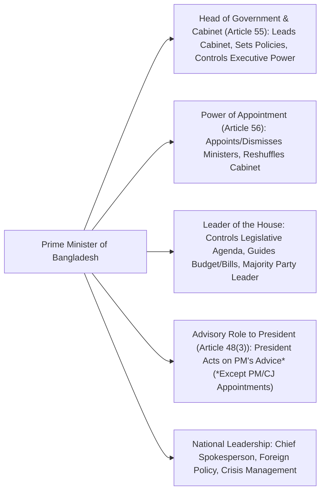
```mermaid
flowchart LR
    A[Prime Minister of Bangladesh] --> B["Head of Government & Cabinet (Article 55): Leads Cabinet, Sets Policies, Controls Executive Power"]
    A --> C["Power of Appointment (Article 56): Appoints/Dismisses Ministers, Reshuffles Cabinet"]
    A --> D["Leader of the House: Controls Legislative Agenda, Guides Budget/Bills, Majority Party Leader"]
    A --> E["Advisory Role to President (Article 48(3)): President Acts on PM's Advice* (*Except PM/CJ Appointments)"]
    A --> F["National Leadership: Chief Spokesperson, Foreign Policy, Crisis Management"]
```
**(b) Write about the structure of the legislature of Bangladesh. (5)**

**Answer:**
The legislature of Bangladesh, known as the **Jatiya Sangsad** (House of the Nation), is the supreme law-making body of the Republic. Its structure is defined in Part V of the Constitution.

1.  **Unicameral Nature:** The Jatiya Sangsad is a unicameral legislature, meaning it consists of a single chamber.
2.  **Composition (Article 65):** The Parliament is composed of 350 members in total:
    *   **300 Members** are directly elected through a general election from 300 single-territorial constituencies based on the first-past-the-post system.
    *   **50 Reserved Seats** are exclusively for women. These women MPs are elected by the 300 directly elected members on the basis of proportional representation of the political parties in Parliament.
3.  **Term:** The term of a Parliament is five years from the date of its first meeting, unless dissolved earlier.
4.  **Leadership and Presiding Officers:** The Parliament is presided over by the Speaker, or in their absence, the Deputy Speaker. Both are elected from among the MPs at the first sitting of a new Parliament.
5.  **Sessions:** The President summons, prorogues, and dissolves Parliament on the advice of the Prime Minister. There must not be a gap of more than 60 days between the end of one session and the first sitting of the next.
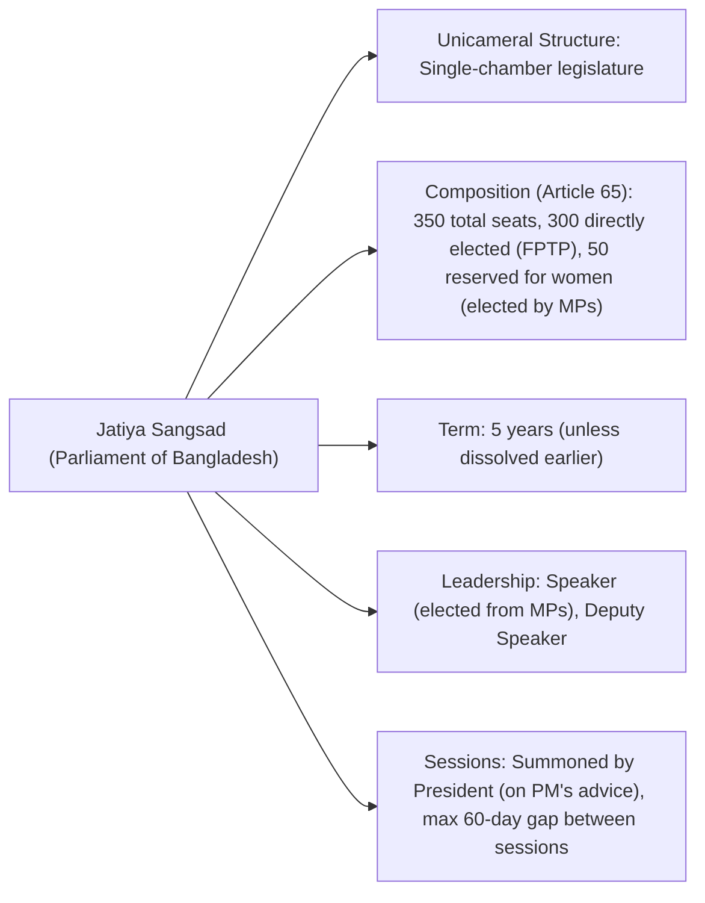
```mermaid
flowchart LR
    A["Jatiya Sangsad (Parliament of Bangladesh)"] --> B["Unicameral Structure: Single-chamber legislature"]
    A --> C["Composition (Article 65): 350 total seats, 300 directly elected (FPTP), 50 reserved for women (elected by MPs)"]
    A --> D["Term: 5 years (unless dissolved earlier)"]
    A --> E["Leadership: Speaker (elected from MPs), Deputy Speaker"]
    A --> F["Sessions: Summoned by President (on PM's advice), max 60-day gap between sessions"]
```

**(c) Briefly write about the importance of the Rules of Procedure in conducting the business of the Jatiya Sangsad. (5)**

**Answer:**
The Rules of Procedure of the Jatiya Sangsad are the operational handbook that governs its internal proceedings. Their importance is paramount for the effective and orderly functioning of the legislature.

1.  **Ensuring Orderly Conduct:** The rules provide a structured framework for debates, discussions, and voting. They empower the Speaker to maintain decorum and prevent chaos, ensuring that legislative business can be conducted efficiently.
2.  **Facilitating Law-making:** They meticulously outline the entire legislative process, from the introduction of a bill to its debate, amendment, and final passage. This ensures that laws are made through a standardized and transparent procedure.
3.  **Enabling Executive Accountability:** The rules are vital for parliamentary oversight. They establish mechanisms through which MPs can hold the government accountable, such as:
    *   **Question Hour:** MPs can ask ministers questions about their portfolios.
    *   **Standing Committees:** These committees scrutinize bills, policies, and the activities of different ministries.
    *   **Calling Attention Notices and Adjournment Motions:** Allow for discussion of urgent public matters.
4.  **Protecting Rights of Members:** The rules protect the rights and privileges of all MPs, including those in the opposition, ensuring they have the opportunity to speak, raise issues, and participate in the legislative process. They are the bedrock of parliamentary democracy in practice.

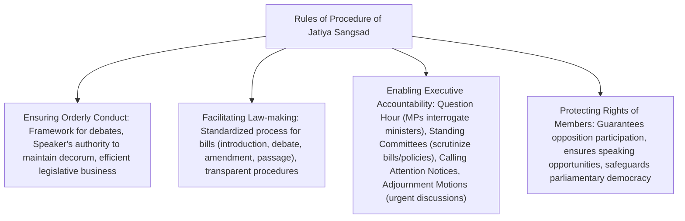
```mermaid
flowchart TD
    A[Rules of Procedure of Jatiya Sangsad] --> B["Ensuring Orderly Conduct: Framework for debates, Speaker's authority to maintain decorum, efficient legislative business"]
    A --> C["Facilitating Law-making: Standardized process for bills (introduction, debate, amendment, passage), transparent procedures"]
    A --> D["Enabling Executive Accountability: Question Hour (MPs interrogate ministers), Standing Committees (scrutinize bills/policies), Calling Attention Notices, Adjournment Motions (urgent discussions)"]
    A --> E["Protecting Rights of Members: Guarantees opposition participation, ensures speaking opportunities, safeguards parliamentary democracy"]
```

**(d) Write about the structure of the High Court of Bangladesh. (5)**

**Answer:**
The High Court of Bangladesh is not a separate court but is one of the two divisions of the **Supreme Court of Bangladesh**, as established by Article 94 of the Constitution. It is the superior court of record for original and appellate jurisdiction.

1.  **Composition:** The High Court Division consists of the Chief Justice and other Judges as the President may appoint to this division. The number of judges is not fixed by the Constitution and varies according to the workload.
2.  **Appointment:** Judges of the High Court Division are appointed by the President. To be appointed, a person must be a citizen of Bangladesh and have been an advocate of the Supreme Court for at least ten years or held a judicial office for ten years.
3.  **Jurisdiction:** The High Court Division has broad jurisdiction:
    *   **Original Jurisdiction (Writ Jurisdiction):** Under Article 102, it has the power to issue orders or directives (writs) to enforce the fundamental rights of citizens and to provide legal remedy against illegal actions by public authorities.
    *   **Appellate Jurisdiction:** It hears appeals and revisions from the orders, judgments, and decrees of subordinate civil and criminal courts.
    *   **Supervisory Jurisdiction:** Under Article 109, it has the power of supervision and control over all subordinate courts and tribunals in Bangladesh.
4.  **Benches:** The High Court Division functions through various "benches," which can be single-judge or division (two-judge) benches, to hear different types of cases simultaneously.

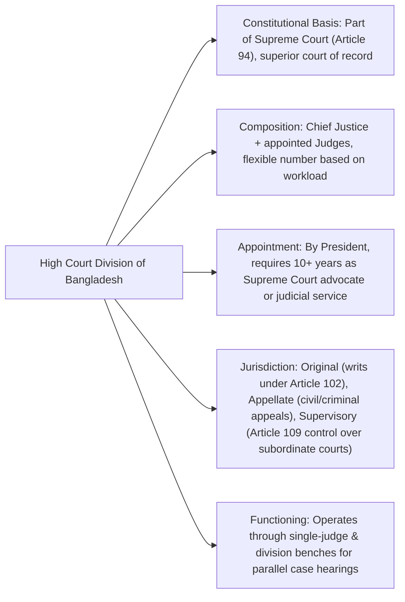
```mermaid
flowchart LR
    A[High Court Division of Bangladesh] --> B["Constitutional Basis: Part of Supreme Court (Article 94), superior court of record"]
    A --> C["Composition: Chief Justice + appointed Judges, flexible number based on workload"]
    A --> D["Appointment: By President, requires 10+ years as Supreme Court advocate or judicial service"]
    A --> E["Jurisdiction: Original (writs under Article 102), Appellate (civil/criminal appeals), Supervisory (Article 109 control over subordinate courts)"]
    A --> F["Functioning: Operates through single-judge & division benches for parallel case hearings"]
```

---

### **Question 08**

**(a) What are the basic principles of Bangladesh's foreign policy? (5)**

**Answer:**
The basic principles of Bangladesh's foreign policy are enshrined in Article 25 of its Constitution and are guided by the overarching philosophy of **"Friendship to all, malice towards none,"** first articulated by Bangabandhu Sheikh Mujibur Rahman.

The core constitutional principles are:
1.  **Sovereignty and Equality:** Respect for the national sovereignty, territorial integrity, and equality of all nations.
2.  **Non-Interference:** The principle of non-interference in the internal affairs of other countries.
3.  **Peaceful Settlement of Disputes:** A commitment to resolving international disputes through peaceful means, as demonstrated by the resolution of maritime boundaries with India and Myanmar through international arbitration.
4.  **Respect for International Law:** Adherence to international law and the principles of the United Nations Charter.
5.  **Support for Self-Determination:** Supporting oppressed peoples worldwide in their struggles against imperialism, colonialism, and racialism. This principle guided Bangladesh's early foreign policy and its support for anti-apartheid movements.

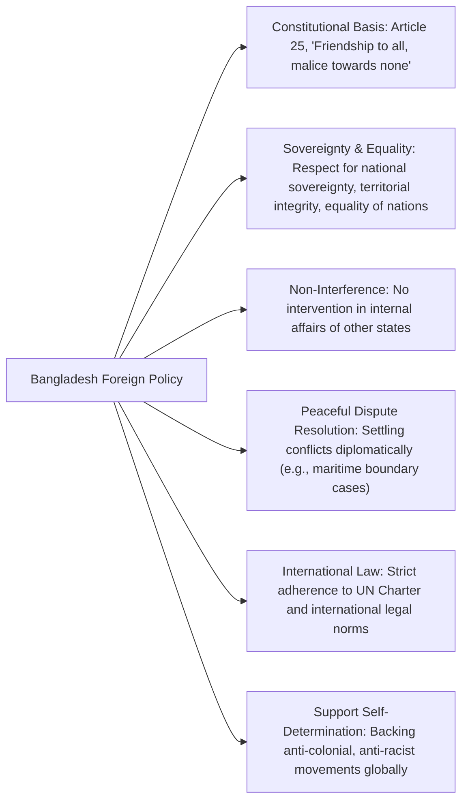
```mermaid
flowchart LR
    A[Bangladesh Foreign Policy] --> B["Constitutional Basis: Article 25, 'Friendship to all, malice towards none'"]
    A --> C["Sovereignty & Equality: Respect for national sovereignty, territorial integrity, equality of nations"]
    A --> D["Non-Interference: No intervention in internal affairs of other states"]
    A --> E["Peaceful Dispute Resolution: Settling conflicts diplomatically (e.g., maritime boundary cases)"]
    A --> F["International Law: Strict adherence to UN Charter and international legal norms"]
    A --> G["Support Self-Determination: Backing anti-colonial, anti-racist movements globally"]
```

**(b) 'The protection of national interest is the main determinant of Bangladesh's foreign policy' – Explain. (5)**

**Answer:**
This statement is accurate. While guided by constitutional principles, Bangladesh's foreign policy is pragmatically driven by the imperative to secure its core national interests. These interests are primarily economic, security-related, and geopolitical.

1.  **Economic Interest:** The primary goal is to foster economic development. This includes securing preferential trade access for its main export (RMG), attracting Foreign Direct Investment (FDI), ensuring favorable conditions for its large expatriate workforce to send remittances, and obtaining development aid and loans.
2.  **Security Interest:** Foreign policy is used to manage critical security challenges. This involves maintaining stable and peaceful relations with its large neighbor, India; managing the Rohingya refugee crisis with Myanmar; and cooperating internationally on counter-terrorism and trans-national crime.
3.  **Geopolitical Balancing:** Located strategically, Bangladesh must carefully balance its relationships with major regional and global powers like India, China, the United States, and Russia. This "balancing act" aims to maximize economic and strategic benefits from all sides without becoming entangled in their rivalries.
4.  **Enhancing National Image:** Participation in UN Peacekeeping operations, for example, is not just altruistic; it enhances the country's soft power and global standing, which translates into diplomatic leverage and goodwill.

Thus, every major foreign policy decision, from trade negotiations to diplomatic alignments, is ultimately weighed against its potential impact on Bangladesh's tangible national interests.

**(c) Briefly highlight the importance of Bangladesh's participation in UN Peacekeeping missions from an economic perspective. (5)**

**Answer:**
Bangladesh's role as a leading troop-contributing country in UN Peacekeeping Operations (UNPKO) carries significant economic benefits, both direct and indirect.

1.  **Source of Foreign Currency:** The UN provides allowances to the troops and police personnel deployed on missions. A significant portion of these earnings is remitted back to Bangladesh, contributing to the country's foreign exchange reserves.
2.  **Reimbursement for Equipment:** The UN reimburses the Government of Bangladesh for Contingent Owned Equipment (COE) used in missions. This provides a steady and valuable stream of revenue that is used to modernize the armed forces and police.
3.  **Employment and Skill Development:** UN missions provide professional employment opportunities for thousands of soldiers and police officers. The skills, training, and experience they gain in complex multinational environments are invaluable assets upon their return.
4.  **Indirect Economic Diplomatic Leverage:** The country's stellar reputation as a reliable peacekeeper enhances its global "brand" and soft power. This positive image can create a favorable climate for trade negotiations, attracting investment, and securing development assistance, thereby yielding indirect but substantial economic dividends.

**(d) What is meant by BCIM? Explain its main significance in enhancing regional cooperation. (5)**

**Answer:**
**BCIM** stands for the **Bangladesh-China-India-Myanmar Economic Corridor**. It is a development initiative aimed at creating a multi-modal transport corridor to enhance connectivity and economic integration among the four nations.

**Concept:** The proposed corridor would connect Kunming in China's Yunnan province with Kolkata in India, running through Mandalay and other nodes in Myanmar, and Dhaka and Chattogram in Bangladesh.

**Significance for Regional Cooperation:**
1.  **Boosting Trade and Connectivity:** Its primary goal is to drastically reduce trade and transport barriers by creating a seamless network of roads, railways, and ports. This would significantly boost intra-regional trade, which is currently very low.
2.  **Creating a Unified Economic Zone:** By linking major economic hubs, the corridor aims to foster the growth of supply chains, joint ventures, and industrial clusters, effectively creating a more integrated economic zone.
3.  **Market Access:** For Bangladesh, it would provide unprecedented land-based access to the vast market of Southwest China and the landlocked regions of Northeast India and Myanmar.
4.  **Bridging South and Southeast Asia:** BCIM is envisioned as a vital bridge linking two of the world's most dynamic regions—South Asia and Southeast Asia—thereby promoting wider inter-regional cooperation.
5.  **Fostering Interdependence:** By creating shared economic stakes, the corridor has the potential to build trust and promote peace and stability in a historically complex region. However, its progress has been slow due to geopolitical sensitivities, particularly between India and China.

---
### **Question 09**

**(a) Briefly explain what type of party system exists in Bangladesh. (5)**

**Answer:**
Bangladesh constitutionally has a **multi-party system**, where any number of political parties can be formed and contest in elections, provided they are registered with the Election Commission.

However, in practice, the political landscape has evolved into a **bipolar or two-party dominant system**. The key characteristics are:
*   **Dominance of Two Blocs:** National politics has been overwhelmingly dominated by two major political parties and their respective alliances: the **Awami League (AL)** and the **Bangladesh Nationalist Party (BNP)**.
*   **Alternation in Power:** From 1991 to 2008, power typically alternated between these two parties after each election.
*   **Marginalization of Third Parties:** While other parties like the Jatiya Party, Jamaat-e-Islami, and various leftist parties exist, they have been unable to challenge the dominance of the two main blocs. Their influence is often limited to acting as junior partners in alliances.
*   **High Polarization:** The system is characterized by intense, often confrontational and personality-driven, rivalry between the two major camps, which polarizes the entire political environment.

~~***(b) Briefly explain the significance of dropping the word 'Muslim' from the 'Awami Muslim League' in 1955. (5)**~~*

*~~**Answer:**~~*
*~~The decision to drop the word 'Muslim' from the party's name and rebrand as the "Awami League" in 1955 was a seminal moment in the political history of Bangladesh. Its significance was profound:~~*

1.  *~~**Shift to Secular Politics:** It marked a deliberate ideological shift from a communal platform to a secular one. The party opened its doors to all Bengalis—Muslims, Hindus, Buddhists, and Christians—uniting them on a common political platform.~~*
2.  *~~**Embracing Bengali Nationalism:** This move signaled that the primary basis for political identity was shifting from religion (as propagated by the Pakistani state) to Bengali language, culture, and ethnicity. It was a crucial step in the consolidation of Bengali nationalism.~~*
3.  *~~**Broadening the Electoral Base:** By becoming an inclusive party, the Awami League could forge a broader coalition and appeal to the significant non-Muslim population of East Bengal, which was essential for creating a united front against the West Pakistani establishment.~~*
4.  *~~**Ideological Challenge to Pakistan:** The act was a direct rejection of the "Two-Nation Theory," the very ideology upon which Pakistan was founded. It implicitly argued that religion alone was not a sufficient basis for nationhood and that cultural and economic factors were more important.*~~

**(c) Briefly describe the functions of a political party in Bangladesh. (5)**

**Answer:**
In Bangladesh's democratic framework, political parties perform several essential functions:
1.  **Contesting Elections and Forming Government:** The primary function is to nominate candidates, mobilize public opinion, and compete in elections with the aim of winning power and forming the government.
2.  **Interest Articulation and Aggregation:** Parties act as a channel for the public to express their needs and demands. They aggregate these diverse interests into a coherent set of policies and a party platform or manifesto.
3.  **Political Recruitment and Leadership:** Parties identify, recruit, and train individuals for political office, from local government representatives to national leaders, thereby creating a pool of potential rulers.
4.  **Policy Formulation and Implementation:** The party that forms the government gets the opportunity to translate its manifesto into public policy and implement it. Opposition parties play a crucial role by scrutinizing these policies and offering alternatives.
5.  **Political Socialization and Education:** Parties help educate the electorate about important public issues and socialize citizens into the political culture, shaping their political attitudes and encouraging participation. They act as a vital link between the people and the state.

**(d) What are the main features of opposition party politics in Bangladesh since 1991? (5)**

**Answer:**
Since the restoration of parliamentary democracy in 1991, opposition party politics in Bangladesh has been defined by a set of distinct and often dysfunctional features:

1.  **Confrontational and Zero-Sum Approach:** Politics is viewed not as a process of negotiation and compromise for the national good, but as a zero-sum game where the winner takes all. The opposition's primary goal is often to unseat the government rather than engage constructively.
2.  **Frequent Parliament Boycotts:** A hallmark of opposition politics has been the prolonged boycott of parliamentary sessions. Instead of using the floor of the House as the primary forum for debate and dissent, opposition parties have frequently stayed away, thereby weakening the legislature itself.
3.  **Reliance on Street Agitation:** The opposition has consistently relied on extra-parliamentary tactics like *hartals* (general strikes) and blockades as its main political tools. This often leads to political violence, economic disruption, and public suffering.
4.  **Rejection of Electoral Outcomes:** There is a persistent trend of the losing major party rejecting the results of general elections, alleging widespread rigging, and refusing to recognize the legitimacy of the new government.
5.  **Demand for a Neutral Election-time Government:** Stemming from deep-seated mistrust in the incumbent's ability to hold a fair election, a core demand of the opposition has been the installation of a non-partisan, neutral administration (like the former Caretaker Government) to oversee polls.

---
### **Question 10**

**Write short notes on any four of the following: (4×5=20)**

**(a) International Labor Market and Bangladesh**
The international labor market is a fundamental pillar of the Bangladeshi economy, serving as a major source of employment and foreign exchange. Over 12 million Bangladeshi migrants work abroad, primarily in the Middle East (Saudi Arabia, UAE, Qatar) and Southeast Asia (Malaysia, Singapore). Their most vital contribution is through remittances, which stood at over $21 billion in Fiscal Year 2023, making it the second-largest source of foreign currency after RMG exports. These inflows are crucial for maintaining a stable balance of payments, financing imports, and directly alleviating poverty by supporting millions of households. However, the sector faces significant challenges, including the predominance of low-skilled labor leading to lower wages, high migration costs, exploitation by recruiting agencies, and inadequate protection of workers' rights in some host nations. Government policy is increasingly focused on promoting skilled migration, formalizing recruitment channels, and exploring new labor markets to sustain and enhance this economic lifeline.

**(b) Bangladesh and the World Trade Organization (WTO)**
As a founding member of the World Trade Organization (WTO) since 1995, Bangladesh has significantly benefited from the multilateral trading system. Being a Least Developed Country (LDC), its greatest advantage has been the special and differential treatment provisions, most notably the duty-free, quota-free market access provided by the European Union's "Everything But Arms" (EBA) initiative. This facility has been instrumental in the phenomenal growth of Bangladesh's Ready-Made Garment (RMG) industry. The WTO provides a rule-based framework for global trade, offering Bangladesh a platform for resolving trade disputes and negotiating better market access. The most critical challenge ahead is Bangladesh's scheduled graduation from LDC status in 2026. Post-graduation, it will lose its preferential trade benefits, which necessitates a strategic shift towards enhancing export competitiveness, diversifying the export basket, and actively negotiating Free Trade Agreements (FTAs) with key partners.

**(c) World Cricket and Bangladesh**
Cricket is more than a sport in Bangladesh; it is a source of immense national pride and a powerful unifying force. The journey in world cricket began in earnest after the Bangladesh national team gained Test status from the International Cricket Council (ICC) in 2000. While the initial years were challenging, the team has since evolved into a formidable competitor, especially in the One-Day International (ODI) format. Major achievements include series victories against top-ranked teams like India, Australia, England, and South Africa at home, and reaching the semi-finals of the 2017 ICC Champions Trophy. The Bangladesh Cricket Board (BCB) is one of the wealthiest cricket boards in the world. The sport's success has a significant "soft power" impact, projecting a positive and dynamic image of Bangladesh on the global stage, celebrated by one of the world's most passionate fan bases.

**(d) Quota in Government Jobs**
The quota system in Bangladesh's government jobs was a form of affirmative action designed to ensure representation for specific segments of the population in the civil service. For decades, a total of 56% of government jobs were reserved under various quotas, including for freedom fighters' children and grandchildren (30%), women (10%), district quota (10%), ethnic minorities (5%), and persons with disabilities (1%). The system's rationale was to promote social equity and uplift disadvantaged groups. However, it became highly controversial, leading to major student-led protests in 2013 and 2018, with demonstrators arguing that the extensive quota system hindered meritocracy and deprived meritorious candidates. In response to the 2018 movement, the government abolished the quota system for direct recruitment in the 9th to 13th grades of the civil service, a landmark reform shifting the recruitment focus primarily to merit.

**(e) Public-Private Partnership in Bangladesh**
Public-Private Partnership (PPP) is a strategic mechanism adopted by Bangladesh to accelerate its infrastructure development by combining the resources and expertise of the government and the private sector. It involves a long-term contract where a private entity finances, builds, and often operates an infrastructure project or service traditionally provided by the public sector. The primary goal is to bridge the massive financing gap for large-scale projects that the government's budget alone cannot cover. The Public-Private Partnership Authority (PPPA) was established to facilitate and regulate these initiatives. Prominent examples of PPP projects include the Dhaka Elevated Expressway, the third terminal of the Hazrat Shahjalal International Airport, and numerous power plants and economic zones. PPP is now a cornerstone of Bangladesh's national development strategy, aimed at attracting investment, enhancing efficiency, and delivering modern infrastructure.

**(f) E-governance and Bangladesh**
E-governance in Bangladesh refers to the use of Information and Communication Technology (ICT) to deliver government services, enhance transparency, and improve administrative efficiency. It is a core component of the government's "Digital Bangladesh" vision (now evolving into "Smart Bangladesh"). Key initiatives have transformed public service delivery. These include the establishment of over 8,000 Digital Centers at the Union level providing citizens with online access to services like birth registration and passport applications; the development of the National ID (NID) database; electronic government procurement (e-GP) to increase transparency; and the use of Mobile Financial Services for direct disbursement of social safety net payments. E-governance aims to reduce corruption, minimize citizens' hassles, and make the government more accessible and accountable. While challenges like the digital divide and cybersecurity remain, it has fundamentally modernized the citizen-state interface.

**(g) Maritime Victory of Bangladesh**
Bangladesh's "Maritime Victory" refers to the successful and peaceful resolution of its maritime boundary disputes with its neighbors, Myanmar and India, through international arbitration. In 2012, the International Tribunal for the Law of the Sea (ITLOS) in Hamburg awarded Bangladesh a significant portion of the disputed sea area with Myanmar. Following this, in 2014, a UN-backed Arbitral Tribunal at The Hague resolved the dispute with India, awarding Bangladesh 19,467 sq km out of a 25,602 sq km disputed area. These landmark legal victories were a major diplomatic triumph, securing Bangladesh's sovereign rights over approximately 118,813 square kilometers of sea territory in the Bay of Bengal. This includes a 200-nautical-mile exclusive economic zone and a substantial portion of the continental shelf, unlocking immense potential for the nation's "Blue Economy," including deep-sea fishing, exploration for offshore oil and gas reserves, and expanded maritime trade.

**(h) Mineral Resources of Bangladesh**
While not rich in metallic minerals, Bangladesh possesses significant deposits of valuable non-metallic and energy resources. The most crucial mineral resource is **natural gas**, which has long been the primary fuel for electricity generation and the fertilizer industry. Major gas fields are located in the eastern part of the country, such as Titas, Bibiyana, and Habiganj. The second major resource is high-quality **bituminous coal**, with large reserves discovered in the northwest at Barapukuria, Phulbari, and Dighipara. Other important extracted resources include **hard rock** from the Maddhapara mine (essential for construction), **white clay/kaolin** (powering the ceramics industry), **limestone** (for cement production), and **silica sand** (for the glass industry). The country's recent maritime victory has also opened up a new frontier for potential offshore oil and gas exploration in the Bay of Bengal, which could be vital for future energy security.