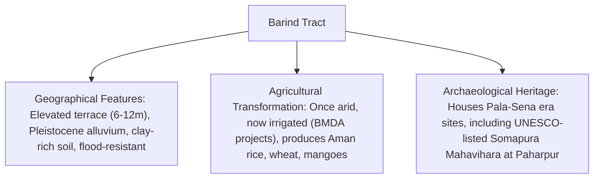
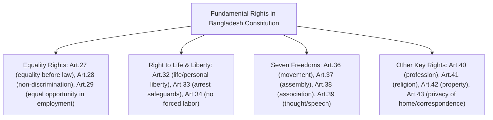
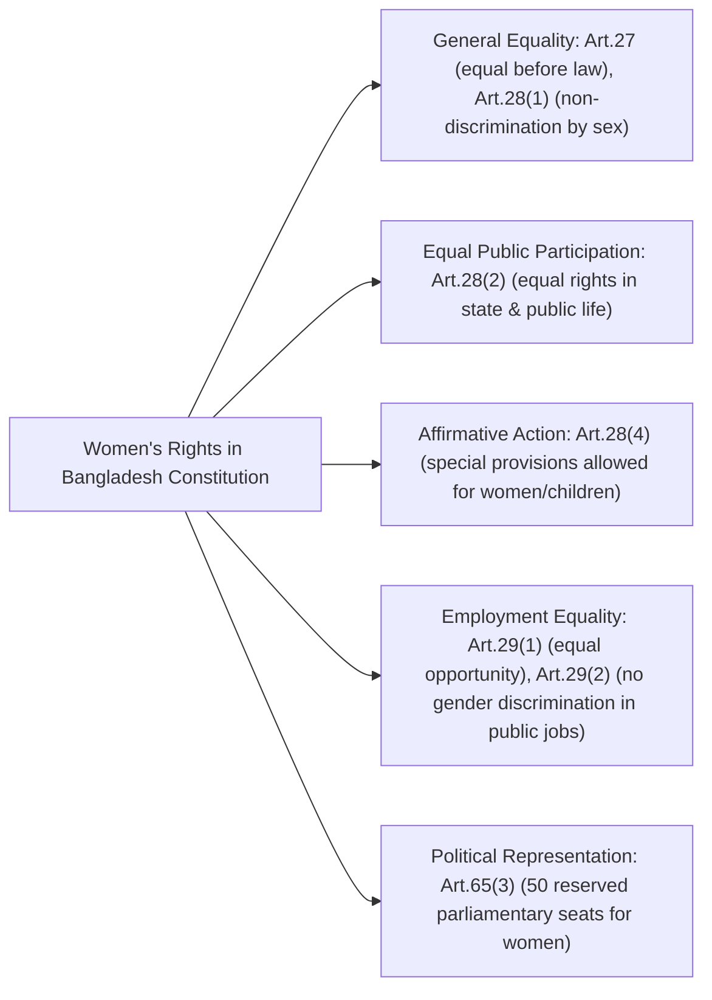

### **Question 01**

**(a) What is the importance of coral islands in the geography of Bangladesh? (5)**

**Answer:**
In the geography of Bangladesh, coral islands hold unique and significant importance, despite being a very small part of the country's landmass. St. Martin's Island is the only coral island in Bangladesh, located in the Bay of Bengal, about 9 km south of Cox's Bazar-Teknaf peninsula.

Its importance can be outlined as follows:

1.  **Unique Biodiversity Hotspot:** St. Martin's Island hosts a unique marine ecosystem distinct from the mainland's deltaic environment. Its surrounding waters support a rich biodiversity, including 66 species of coral, various species of mollusks, crabs, lobsters, and over 240 species of fish. It is also a crucial nesting ground for endangered marine turtles, such as the Olive Ridley turtle.
2.  **Geological and Environmental Indicator:** As a coral island, it is a sensitive indicator of marine environmental health and climate change. The health of its coral reefs provides direct evidence of sea temperature rise, water pollution, and ocean acidification. Its existence serves as a natural laboratory for studying marine ecology and the impacts of climate change on the Bay of Bengal.
3.  **Tourism Hub:** Its pristine beauty, clear blue waters, and unique coral formations make St. Martin's a premier tourist destination in Bangladesh. Tourism is the primary economic activity for the island's inhabitants, generating significant revenue and employment.
4.  **Strategic Importance:** Although small, its location in the Bay of Bengal gives it strategic value, contributing to Bangladesh's maritime presence and national security interests in the southern sea.

**(b) What do you understand by the inactive deltas of Bangladesh? (5)**

**Answer:**
The inactive deltas of Bangladesh refer to the older, mature parts of the Bengal Delta that are no longer actively being built up by silt deposition from the major rivers. The Bengal Delta is a dynamic system, and over centuries, the primary courses of rivers like the Ganges and Brahmaputra have shifted eastward. The regions left behind by these shifting rivers are known as inactive or moribund deltas.

Key characteristics of inactive deltas:
1.  **Location:** The southwestern part of Bangladesh, comprising districts like Jessore, Kushtia, and parts of Khulna, constitutes the primary inactive delta region. This area is often called the "moribund delta."
2.  **Reduced River Flow:** The rivers in this region, such as the Kobadak, Bhairab, and Ichamati, were once major distributaries of the Ganges but now carry significantly less water and silt, especially during the dry season. Many have become disconnected from the main river flow.
3.  **Land Characteristics:** The land in these areas is relatively higher and more stable compared to the active delta in the south-central region. The process of land subsidence is slower, and the soil is more mature.
4.  **Socio-economic Impact:** The lack of fresh river water flow leads to issues like drainage congestion, waterlogging, and increased salinity intrusion from the Bay of Bengal, affecting agriculture and drinking water supplies.

**(c) Describe the importance of the Barind Tract and the Varendra Research Museum in the geography of Bangladesh. (5)**

**Answer:**
**Barind Tract:**
The Barind Tract is a distinctive physiographic unit in northwestern Bangladesh, a large terrace of older, reddish Pleistocene-era alluvium. Its importance is multifaceted:
1.  **Unique Topography and Soil:** Geographically, it stands out as an elevated (6-12 meters higher than surrounding floodplains), undulating landscape with hard, clay-rich soil. This makes it structurally different from the rest of the delta and less prone to flooding.
2.  **Agricultural Significance:** Historically considered a challenging area for agriculture due to its dry climate and less fertile soil, the Barind Tract has been transformed into a major food-producing region through irrigation projects, particularly the Barind Multipurpose Development Authority (BMDA). It is now a key area for producing Aman rice, wheat, and mangoes.
3.  **Archaeological Importance:** The region is rich in archaeological sites from the Pala and Sena dynasties, including the ruins of Somapura Mahavihara at Paharpur, a UNESCO World Heritage site.

**Varendra Research Museum:**
The Varendra Research Museum, located in Rajshahi (in the heart of the Barind Tract), is the oldest museum in Bangladesh, established in 1910. Its importance is immense:
1.  **Preserver of Regional History:** It was founded specifically to house and preserve the vast archaeological treasures discovered in the Varendra (Barind) region. It holds a rich collection of artifacts, including sculptures, inscriptions, coins, and pottery, primarily from the Pala and Sena periods.
2.  **Center for Historical Research:** It serves as a vital center for research on the history, art, and archaeology of ancient and medieval Bengal, providing invaluable primary source material for scholars. It is a testament to the historical glory of the region.

**(d) What is the historical importance of the Central Shaheed Minar, the National Martyrs' Memorial, and the Jatiya Sangsad Bhaban? (5)**

**Answer:**
These three structures are iconic symbols of Bangladesh's history, identity, and sovereignty.

*   **Central Shaheed Minar (Dhaka):** This monument commemorates the martyrs of the 1952 Language Movement. Its historical importance is profound as it symbolizes the Bengali people's struggle to protect their mother tongue, an event that sowed the seeds of Bengali nationalism and the eventual independence movement. The design, with its mother figure and her martyred sons, represents the indomitable spirit of the Bengali nation. It is the epicenter of the annual observance of International Mother Language Day (February 21st).

*   **National Martyrs' Memorial (Savar):** This memorial is dedicated to the memory of the estimated three million martyrs who sacrificed their lives during the Bangladesh Liberation War in 1971. Its seven triangular spires represent the seven major phases of the independence movement, culminating in the 1971 war. It is a solemn and powerful symbol of the nation's profound sacrifice for freedom, embodying the pain, struggle, and ultimate triumph of independence.

*   **Jatiya Sangsad Bhaban (National Parliament Building):** Designed by the world-renowned architect Louis I. Kahn, this architectural masterpiece is the seat of the Parliament of Bangladesh. Its historical importance lies in its representation of the nation's sovereignty and democratic aspirations. Completed after independence, it stands as a monumental symbol of a free and independent nation governing itself through democratic principles. Its grand, modernist design reflects the strength and permanence of the democratic institutions it houses.

---

### **Question 02**

**(a) Describe the significance of the 1952 Language Movement in the emergence of Bengali nationalism. (5)**

**Answer:**
The 1952 Language Movement was the catalyst that transformed the cultural identity of Bengalis in East Pakistan into a potent political force, laying the foundation for Bengali nationalism. Its significance is paramount:

1.  **First Act of Mass Resistance:** It was the first widespread, popular movement against the hegemony of the West Pakistani ruling elite. The attempt to impose Urdu as the sole state language was seen as a direct assault on Bengali culture and identity, uniting the Bengali populace—students, intellectuals, and the general public—in a common cause.
2.  **Shift from Religious to Cultural Identity:** The movement fundamentally challenged the "Two-Nation Theory," which posited religion as the sole basis of nationhood. It asserted that language and culture were more powerful and authentic markers of national identity than shared religion. This marked the birth of secular Bengali nationalism.
3.  **Creation of Martyrs and Symbols:** The sacrifice of the language martyrs on February 21, 1952 (Salam, Barkat, Rafiq, Jabbar, and others) created a powerful new political mythology. The Shaheed Minar became a sacred symbol of resistance and a source of inspiration for all subsequent democratic and nationalist movements.
4.  **Paving the Way for Political Demands:** The success in establishing Bengali as a state language emboldened the Bengalis to demand redress for other grievances, particularly economic disparity and political disenfranchisement. The Language Movement was the political awakening that directly led to subsequent movements like the Six-Point Program and ultimately, the Liberation War.

**(b) Discuss the importance of the 1969 Mass Uprising in the Liberation War of Bangladesh. (5)**

**Answer:**
The 1969 Mass Uprising (*Gono Obbhyutthan*) was a decisive turning point in the struggle for Bangladesh's independence. It was a powerful expression of popular will that irreversibly weakened the Pakistani regime's hold on its eastern wing.

Its importance lies in several key outcomes:
1.  **Fall of a Military Dictator:** The unstoppable momentum of the uprising led directly to the downfall of the decade-long autocratic rule of Field Marshal Ayub Khan. This demonstrated the power of popular protest and shattered the myth of the Pakistani military's invincibility.
2.  **Acceptance of the Demand for Elections:** To quell the protests, the new military ruler, General Yahya Khan, was forced to concede to the central political demand: holding a general election based on universal adult franchise and one-person-one-vote, which gave the majority population of East Pakistan its due representation.
3.  **Unification of All Classes:** The uprising united students, workers, peasants, and the middle class against the Pakistani establishment. It was a truly national movement that radicalized Bengali politics and made the demand for full autonomy, as outlined in the Six-Point Program, non-negotiable, setting the stage for the 1970 election and the subsequent Liberation War.

**(c) Analyze the impact of the 1970 general election on the struggle for Bangladesh's independence. (5)**

**Answer:**
The 1970 general election was the final, decisive political event that created the constitutional and moral justification for Bangladesh's independence. Its impact was profound and multifaceted:

1.  **A Democratic Mandate for Autonomy:** The election functioned as a de facto referendum on the Awami League's Six-Point Program for regional autonomy. The Awami League's landslide victory—winning 167 out of 169 National Assembly seats in East Pakistan—was an unambiguous and overwhelming democratic mandate from the Bengali people in favor of ending West Pakistani domination.
2.  **Exposure of the Pakistani Establishment's Intentions:** The refusal of the Pakistani military junta (led by General Yahya Khan) and the West Pakistani political elite (led by Zulfikar Ali Bhutto) to honor the election results and transfer power was the final betrayal. This act exposed their fundamentally undemocratic and colonial mindset, proving that they would never willingly grant the Bengalis their rights.
3.  **Closing the Door on a United Pakistan:** This political intransigence destroyed any remaining hope for a political settlement within the framework of a united Pakistan. It left the Bengali people with no alternative but to pursue complete independence. The electoral mandate provided the legal and moral high ground for Bangabandhu to launch the non-cooperation movement in March 1971 and ultimately declare independence.

**(d) What do you understand by the Mujibnagar Government? (5)**

**Answer:**
The Mujibnagar Government was the first provisional government of Bangladesh, formed in exile during the Liberation War. Its formation on April 10, 1971, and its formal inauguration on April 17, 1971, in Baidyanathtala (later renamed Mujibnagar) in Meherpur, was a masterstroke of political and diplomatic strategy.

Key aspects of the Mujibnagar Government:
1.  **Legitimacy and Structure:** It was formed by the elected representatives of the 1970 election, thereby giving the Liberation War a legitimate, constitutional, and political leadership. Its structure was:
    *   **President:** Bangabandhu Sheikh Mujibur Rahman (who was imprisoned in Pakistan)
    *   **Vice-President (Acting President):** Syed Nazrul Islam
    *   **Prime Minister:** Tajuddin Ahmad
    *   **Other key ministers:** M. Kamaruzzaman, Mansur Ali, and A. H. M. Qamaruzzaman.
2.  **Functions and Importance:**
    *   **Conducting the War:** It provided central command and coordination for the Mukti Bahini (Liberation Forces), dividing the country into 11 sectors for effective military operations.
    *   **International Diplomacy:** It ran a global diplomatic campaign to gain international recognition and support for Bangladesh's cause, sending envoys to various countries and the UN.
    *   **Administration:** It managed refugee camps in India, ran a radio station (Swadhin Bangla Betar Kendra) to boost morale, and laid the administrative groundwork for the future state.

In essence, the Mujibnagar Government transformed a spontaneous popular resistance into an organized, internationally recognized war of national liberation, providing the political authority that was essential for achieving victory.

---

### **Question 03**

**(a) What were the fundamental principles of state policy in the 1972 Constitution of Bangladesh? (5)**

**Answer:**
The original 1972 Constitution of Bangladesh established four fundamental principles of state policy, which were considered the ideological pillars of the new nation. Outlined in Article 8, these principles were:

1.  **Nationalism:** This was defined as Bengali Nationalism. It was based on the unity and solidarity of the Bengali nation, which, having achieved independence through a national liberation struggle, was pledged to preserve its hard-won sovereignty. It was rooted in the shared language, culture, and history of the Bengali people.
2.  **Socialism:** This principle was interpreted as the establishment of an egalitarian society, free from exploitation. The aim was to ensure economic and social justice for all citizens through state ownership of key sectors, planned economic development, and equitable distribution of wealth.
3.  **Democracy:** This principle guaranteed a system of governance where the Republic would be a democracy in which fundamental human rights and freedoms and respect for the dignity and worth of the human person would be secured, and in which effective participation by the people through their elected representatives in administration at all levels would be ensured.
4.  **Secularism:** This meant the elimination of communalism, the neutrality of the state in matters of religion, the prohibition of the abuse of religion for political purposes, and the end of any discrimination based on religion. It aimed to build a society where all citizens could practice their faith freely.

**(b) What are the fundamental rights of citizens according to the Constitution of Bangladesh? (5)**

**Answer:**
Part III (Articles 26-47A) of the Constitution of Bangladesh guarantees a set of justiciable fundamental rights to its citizens, which are enforceable by the High Court Division. The key rights include:

1.  **Equality Rights:**
    *   Equality before law (Article 27).
    *   Prohibition of discrimination on grounds of religion, race, caste, sex, or place of birth (Article 28).
    *   Equality of opportunity in public employment (Article 29).
2.  **Right to Life and Liberty:**
    *   Protection of the right to life and personal liberty (Article 32).
    *   Safeguards as to arrest and detention (Article 33).
    *   Prohibition of forced labor (Article 34).
3.  **Fundamental Freedoms (The "Seven Freedoms" - Article 36-39):**
    *   Freedom of movement (Article 36).
    *   Freedom of assembly (Article 37).
    *   Freedom of association (Article 38).
    *   Freedom of thought, conscience, and speech (Article 39).
4.  **Other Key Rights:**
    *   Freedom of profession or occupation (Article 40).
    *   Freedom of religion (Article 41).
    *   Right to property (Article 42).
    *   Protection of home and correspondence (Article 43).

**(c) Write down the rights of women mentioned in the Constitution of Bangladesh. (5)**

**Answer:**
The Constitution of Bangladesh provides strong and specific guarantees for the rights and advancement of women, ensuring their equal participation in all spheres of national life.

The key constitutional provisions are:
1.  **General Equality:** Article 27 guarantees that all citizens are equal before the law and are entitled to equal protection of the law. This applies equally to women.
2.  **Prohibition of Discrimination:** Article 28(1) explicitly states that the State shall not discriminate against any citizen on grounds only of religion, race, caste, sex, or place of birth.
3.  **Equal Rights in Public Life:** Article 28(2) is a cornerstone provision, stating: "Women shall have equal rights with men in all spheres of the State and of public life." This provides a broad mandate for gender equality.
4.  **Affirmative Action:** Article 28(4) empowers the state to make special provisions in favor of women or children. This clause allows for affirmative action, such as quotas in education, jobs, and reserved seats in Parliament, to overcome historical disadvantages.
5.  **Equality in Public Employment:** Article 29(1) ensures equality of opportunity for all citizens in public employment, and Article 29(2) prohibits discrimination on the grounds of sex for such employment.
6.  **Reserved Seats in Parliament:** Article 65(3) provides for 50 reserved seats for women in the Jatiya Sangsad, ensuring their political representation at the national level.

**(d) "All powers in the Republic belong to the people" – explain this in accordance with the relevant article of the Constitution of Bangladesh. (5)**

**Answer:**
This fundamental principle of popular sovereignty is enshrined in **Article 7(1)** of the Constitution of Bangladesh. The article states: **"All powers in the Republic belong to the people, and their exercise on behalf of the people shall be effected only under, and by the authority of, this Constitution."**

**Explanation:**
1.  **Source of Authority:** This article establishes that the ultimate source of all state power—legislative, executive, and judicial—is the citizenry. The government, parliament, and courts do not possess inherent power; they are merely agents exercising power delegated to them by the people.
2.  **Constitutional Supremacy:** The second part of the article, "...shall be effected only under, and by the authority of, this Constitution," establishes the supremacy of the Constitution. It means the people's power is not arbitrary but is channeled and exercised through the framework and limitations set out in the constitution, which itself is the embodiment of the people's will.
3.  **Mechanism of Exercise:** The people exercise this sovereign power primarily through their elected representatives in a democratic system. By electing members to the Jatiya Sangsad, the people delegate their power to make laws and form a government on their behalf.
4.  **Foundation of Democracy:** This article is the bedrock of democracy in Bangladesh. It negates any claim to power based on heredity, force, or divine right. Any action by a state organ that is not authorized by the Constitution is, therefore, an illegal usurpation of the people's sovereign power. This principle was famously upheld by the Supreme Court in the 8th Amendment case, where it established the doctrine of "basic structure" to protect the fundamental tenets of the Constitution from being altered.

---

### **Question 04**

**(a) Present the structure of local government in Bangladesh. (5)**

**Answer:**
The structure of local government in Bangladesh is two-tiered, with separate systems for rural and urban areas, as envisioned in Article 59 of the Constitution. It is designed to ensure local participation in administration and development.

**Rural Local Government Structure:**
It is a three-tiered system:
1.  **Zila Parishad (District Council):** At the highest tier, this body is responsible for development activities and coordination across the district. It is composed of an elected chairman, members, and reserved women members, with Members of Parliament from the district acting as advisors.
2.  **Upazila Parishad (Sub-district Council):** This is the most crucial administrative and developmental hub at the sub-district level. It is led by an elected Chairman and two Vice-Chairmen (one of whom must be a woman), with Union Parishad chairmen and Municipality mayors within the upazila as members.
3.  **Union Parishad (Union Council):** This is the oldest and most grassroots tier of local government, comprising several villages. It is led by an elected Chairman and 12 members (9 general and 3 women in reserved seats). It is responsible for a wide range of local civic, police, and development functions.

**Urban Local Government Structure:**
It is divided based on the size and importance of the urban area:
1.  **City Corporation:** These are established in the 12 major metropolitan cities (e.g., Dhaka, Chattogram, Khulna). They are led by an elected Mayor and a large number of ward Councillors. They have extensive responsibilities for civic services, including water supply, waste management, roads, and public health.
2.  **Pourashava (Municipality):** These are established in smaller urban towns. They are also led by an elected Mayor and Councillors and perform similar civic functions on a smaller scale.

~~**(b) Describe the Paurashava Election Rules, 2015. (5)**~~

~~**Answer:**~~
~~The Paurashava (Municipality) Election Rules, 2015, provide the detailed legal framework for conducting elections in urban municipalities across Bangladesh. These rules were significant as they formally introduced partisan elections at this level of local government.~~

~~Key features of the rules include:~~
1.  ~~**Partisan Mayoral Election:** The most significant feature is that the election for the post of Mayor is held on a party basis. Candidates for Mayor are nominated by registered political parties, and the ballot paper features both the candidate's name and their party's symbol.~~
2.  ~~**Non-Partisan Councillor Election:** In contrast, the elections for general ward Councillors and reserved seat women Councillors are held on a non-partisan basis. Candidates contest in their individual capacity.~~
3.  ~~**Conduct of Elections:** The rules detail the entire electoral process, including the announcement of the election schedule by the Election Commission, procedures for submitting nomination papers, scrutiny of nominations, withdrawal of candidature, and allocation of symbols.~~
4.  ~~**Voter and Candidate Eligibility:** They specify the qualifications and disqualifications for voters and candidates, aligning with national laws.~~
5.  ~~**Code of Conduct and Expenditure:** The rules establish a strict electoral code of conduct that all candidates and parties must adhere to. They also set a ceiling on campaign expenditure for mayoral and councillor candidates to ensure a level playing field. Violation of these rules can lead to the cancellation of candidature or the election result.~~

**(c) Discuss the "Hill District Local Government Councils of Bangladesh." (5)**

**Answer:**
The Hill District Local Government Councils are unique, specialized local government bodies established for the three districts of the Chittagong Hill Tracts (CHT): Rangamati, Khagrachhari, and Bandarban. They were created under separate Acts in 1989 and were later strengthened by the CHT Peace Accord of 1997.

Key features and discussion points:
1.  **Special Status and Autonomy:** These councils have a greater degree of administrative and financial autonomy compared to their counterparts in the plains. This was designed to address the unique political and cultural aspirations of the indigenous communities of the CHT.
2.  **Composition:** The councils have a distinctive composition to ensure the representation of the region's indigenous groups. The Chairman of the council must be from an indigenous community. The membership is also allocated based on a quota system reflecting the demographic ratio of different indigenous communities and the Bengali population in the district.
3.  **Special Powers and Functions:** These councils have been vested with authority over 33 subjects, including local police, primary education, health, and, most importantly, **land and resource management**. The consent of these councils is required for any transfer or lease of land within their jurisdiction.
4.  **Challenges:** Despite the legal framework, the full implementation of the councils' powers has been a persistent challenge. Issues include a lack of elections for over two decades, bureaucratic tussles with the central government, and incomplete transfer of all mandated subjects, which remains a source of tension in the region.

~~**(d) Analyze the "Union Parishad Election-2016." (5)**~~

~~**Answer:**~~
~~The Union Parishad (UP) elections held in 2016 were a landmark event in the history of local government in Bangladesh for one primary reason: for the first time, the election for the post of Chairman was held on a party basis.~~

~~**Analysis:**~~
1.  ~~**Introduction of Partisan Politics:** This was the most significant change. Allowing registered political parties to nominate candidates for the Chairman post and use party symbols (like the boat for Awami League and the sheaf of paddy for BNP) formally extended national party politics to the grassroots level.~~
2.  ~~**Rationale and Debate:** The government's rationale was to bring more transparency and accountability, arguing that politics was already present informally. Critics, however, warned that this would intensify political polarization, increase violence, and destroy the traditional non-partisan, community-based character of UP politics.~~
3.  ~~**Widespread Violence and Irregularities:** The 2016 UP elections were marred by unprecedented levels of violence, irregularities, and allegations of voter intimidation and vote-rigging. The intense rivalry between the major national parties was replicated at the local level, leading to numerous casualties. Many candidates were elected unopposed, raising questions about the fairness and competitiveness of the process.~~
4.  ~~**Impact on Governance:** The election results led to the ruling party, the Awami League, securing a dominant majority of the Chairman posts. This has had long-term implications for local governance, with concerns raised about the marginalization of political opposition at the grassroots and the potential for increased politicization of local development activities. The 2016 elections fundamentally altered the landscape of rural politics in Bangladesh.~~

---

### **Question 05**

**(a) Describe the importance of the Instrument of Surrender of the Pakistani forces on 16 December 1971. Who signed the document on behalf of the Pakistani and Indian forces, and who was present on behalf of the Mukti Bahini? (5)**

**Answer:**
The Instrument of Surrender, signed on December 16, 1971, is a document of immense historical importance. It formally marked the end of the Bangladesh Liberation War and the birth of Bangladesh as a sovereign, independent nation.

**Importance:**
*   **Formal Victory:** It was the legal and military confirmation of the victory of the Allied Forces (the Mukti Bahini and the Indian Army) and the definitive defeat of the Pakistani army.
*   **Birth of a Nation:** The surrender signified the end of Pakistani rule over its eastern wing and the culmination of a nine-month-long bloody struggle, establishing the independent state of Bangladesh.
*   **Largest Surrender Since WWII:** The surrender of approximately 93,000 Pakistani soldiers was the largest military surrender in the world since the end of the Second World War, highlighting the scale of the victory.

**Signatories and Presence:**
*   **On behalf of the Pakistan Eastern Command:** The document was signed by **Lieutenant-General Amir Abdullah Khan Niazi**.
*   **On behalf of the Indian and Bangladesh Forces (Joint Command):** It was signed by **Lieutenant-General Jagjit Singh Aurora**, the General Officer Commanding-in-Chief of the Eastern Command of the Indian Army.
*   **Present on behalf of the Mukti Bahini:** Though not a signatory to the formal military instrument, **Group Captain A. K. Khandker**, the Deputy Chief of Staff of the Mukti Bahini, was present at the ceremony, representing the provisional government of Bangladesh and the liberation forces.

~~**(b) Discuss Bangabandhu's Homecoming Day. (5)**~~

~~**Answer:**~~
~~Bangabandhu's Homecoming Day, observed on January 10th, marks the return of the Father of the Nation, Bangabandhu Sheikh Mujibur Rahman, to a newly independent Bangladesh in 1972. After being imprisoned in West Pakistan for the entire duration of the Liberation War, he was released on January 8, 1972. He flew first to London and then to New Delhi before finally arriving in his beloved homeland.~~

~~**Discussion:**~~
1.  ~~**Completion of Victory:** His return symbolized the true completion of the nation's victory. The independence achieved on December 16, 1971, felt incomplete to the nation without the presence of its supreme leader.~~
2.  ~~**A Nation's Emotional Outpouring:** His arrival at Tejgaon Airport in Dhaka was met with an ecstatic and emotional welcome from millions of people. His journey to the Race Course Maidan (now Suhrawardy Udyan), where he delivered a historic and emotional speech, was a moment of profound national unity and joy.~~
3.  ~~**Setting the Course for the New Nation:** In his speech, Bangabandhu laid out the foundational principles and future direction for the war-torn nation. He called for national unity, outlined the principles of socialism, democracy, and secularism, and appealed for international recognition and assistance for the monumental task of nation-building. His return provided the much-needed leadership and sense of direction for the nascent state.~~

~~**(c) Analyze the process of withdrawal of the Indian army from independent Bangladesh. (5)**~~

~~**Answer:**~~
~~The swift and orderly withdrawal of the Indian army from Bangladesh after the Liberation War is a remarkable and rare example of a foreign military intervention followed by a prompt exit, reflecting the strong bond and understanding between the leadership of the two countries.~~

~~**Analysis of the process:**~~
1.  ~~**Agreement between Leaders:** The withdrawal was based on a clear understanding between Indian Prime Minister Indira Gandhi and Bangabandhu Sheikh Mujibur Rahman. During their first meeting in New Delhi in January 1972, Bangabandhu requested the withdrawal of Indian troops from Bangladeshi soil. Indira Gandhi readily agreed.~~
2.  ~~**Formal Announcement:** During her official visit to Kolkata in February 1972, Indira Gandhi publicly announced that the withdrawal would be completed by March 25, 1972, the first anniversary of the Pakistani crackdown.~~
3.  ~~**Swift and Phased Withdrawal:** The withdrawal began almost immediately and was completed ahead of schedule. A farewell parade for the Indian troops was held in Dhaka on March 12, 1972, where Bangabandhu personally thanked them for their contribution. The last batch of Indian soldiers left Bangladesh by March 15, 1972.~~
4.  ~~**Significance:** This prompt withdrawal was a masterstroke of diplomacy. It nullified any international propaganda that India had an occupying agenda. It unequivocally established the sovereignty of the new government of Bangladesh and demonstrated India's respect for Bangladesh's independence. This act cemented the foundation of a strong, trust-based relationship between the two nations.~~

~~**(d) Discuss the achievements of the current government in resolving the enclave issue with Bangladesh. (5)**~~

~~**Answer:**~~
~~The resolution of the long-standing enclave (*chhitmahal*) issue is one of the most significant diplomatic achievements of the current government of Bangladesh, led by Prime Minister Sheikh Hasina. It ended a 68-year-old humanitarian problem.~~

~~**Achievements:**~~
1.  ~~**Ratification of the Land Boundary Agreement (LBA):** The primary achievement was successfully persuading India to ratify the 1974 Land Boundary Agreement and its 2011 Protocol. The government of Bangladesh had ratified the LBA in 1974, but it remained pending in India. Through sustained diplomatic efforts, the Indian Parliament unanimously passed the constitutional amendment to ratify the LBA in May 2015.~~
2.  ~~**Peaceful Exchange of Enclaves:** The agreement was implemented at midnight on July 31, 2015. In a seamless and peaceful exchange, 111 Indian enclaves within Bangladesh became Bangladeshi territory, and 51 Bangladeshi enclaves within India became Indian territory.~~
3.  ~~**Ending a Stateless Existence:** This historic exchange ended the stateless, miserable existence of over 50,000 enclave dwellers who had been deprived of basic rights like education, healthcare, electricity, and law enforcement for decades. They were finally granted the citizenship and rights of the country they chose to live in.~~
4.  ~~**Comprehensive Rehabilitation:** The government of Bangladesh swiftly moved to integrate the new territories and citizens. It undertook massive development projects in the former enclaves, providing infrastructure, electricity, schools, healthcare facilities, and social safety net programs, ensuring a smooth transition and bringing the benefits of citizenship to a previously forgotten people. This resolution stands as a textbook example of peaceful conflict resolution through diplomacy.~~

~~Of course. Here are the detailed answers for questions 06 to 10 from the second set of images, following the previously established format.~~

---

### **Question 06**

**(a) Name three female freedom fighters who were awarded gallantry awards, describe their contributions, and in which sectors they fought. (5)**

**Answer:**
Bangladesh recognized the valiant contributions of many women in the Liberation War. Among them, two were awarded the "Bir Protik," the fourth-highest gallantry award.

1.  **Captain Dr. Sitara Begum, Bir Protik:**
    *   **Sector:** Sector 2.
    *   **Contribution:** She was a military doctor who was commissioned into the Army Medical Corps of the Pakistan Army. During the Liberation War, she served as the Commanding Officer of the Bangladesh Hospital, a field hospital located in Agartala, India, that was crucial for treating wounded Mukti Bahini soldiers. Her dedicated service in managing the hospital and saving countless lives was an invaluable contribution to the war effort.

2.  **Taramon Bibi, Bir Protik:**
    *   **Sector:** Sector 11 (under the command of Colonel Abu Taher).
    *   **Contribution:** Taramon Bibi fought as a direct combatant in her native Kurigram. She initially started by cooking for the freedom fighters but soon took up arms. She courageously participated in several direct battles against the Pakistani army and also served as a spy, gathering vital intelligence on enemy positions and movements. Her bravery in frontline combat broke traditional gender barriers.

3.  **Kakon Bibi:**
    *   **Sector:** Sector 5.
    *   **Contribution:** Although she was recommended for the Bir Protik award, she was not officially gazetted until much later. Kakon Bibi, a member of the Khasia indigenous community, worked as a secret agent for the Mukti Bahini. She was captured and brutally tortured by the Pakistani army but managed to escape. After her escape, she took up arms and fought in approximately 20 direct battles, demonstrating immense courage and resilience.

~~**(b) When was the first female justice appointed to the High Court Division of the Bangladesh Supreme Court? Write down the name of the said justice and briefly her professional biography. (5)**~~

~~**Answer:**~~
~~The appointment of the first female justice was a historic milestone for the judiciary of Bangladesh and for women's empowerment.~~

*   ~~**Appointment Date:** The first female justice was appointed to the High Court Division of the Bangladesh Supreme Court on **February 28, 2000**.~~

*   ~~**Name of the Justice:** **Justice Nazmun Ara Sultana.**~~

*   ~~**Professional Biography:**~~
    ~~Justice Nazmun Ara Sultana was born in 1950. She obtained her law degree from the University of Dhaka. She began her judicial career in 1975, joining the judicial service as a *Munsif* (Assistant Judge). Over the next 25 years, she served with distinction in various capacities in the subordinate judiciary, eventually rising to the position of District and Sessions Judge. Her long and meritorious service led to her historic elevation as the first woman to become a judge of the High Court Division in 2000. Later, on **February 23, 2011**, she achieved another milestone by becoming the first woman to be appointed as a judge of the **Appellate Division**, the highest court in Bangladesh, from which she eventually retired.~~

~~**(c) Describe the international awards received by the current Prime Minister of Bangladesh. (5)**~~

~~**Answer:**~~
~~The current Prime Minister of Bangladesh, Sheikh Hasina, has received numerous prestigious international awards and accolades in recognition of her leadership in various fields, from environmental protection to humanitarianism and women's empowerment. Some of the most notable awards include:~~

1.  ~~**UN 'Champion of the Earth' Award (2015):** The United Nations Environment Programme (UNEP) awarded her its highest environmental accolade in the "Policy Leadership" category for her government's progressive policies in tackling the adverse impacts of climate change.~~
2.  ~~**'Planet 50-50 Champion' Award (2016):** UN-Women recognized her as a "Planet 50-50 Champion" for her outstanding contributions to women's empowerment and for making gender equality a national priority.~~
3.  ~~**'Agent of Change' Award (2016):** The Global Partnership Forum presented her with this award for her visionary role in advancing the cause of women's empowerment in Bangladesh.~~
4.  ~~**Interpress Service 'International Achievement Award' (2018):** She received this award for her exemplary humanitarian response to the Rohingya crisis, providing shelter to over a million forcibly displaced Rohingya refugees from Myanmar.~~
5.  ~~**Gavi, the Vaccine Alliance 'Vaccine Hero' Award (2019):** She was honored for Bangladesh's outstanding success in immunization programs, which have drastically reduced child mortality rates in the country.~~

---

### **Question 07**

~~**(a) How many people have been sentenced to death by the International Crimes Tribunal to date, and whose death sentences have been executed? (5)**~~

~~**Answer:**~~
~~The International Crimes Tribunal (ICT) of Bangladesh was established in 2010 to investigate and prosecute individuals for the genocide, war crimes, and crimes against humanity committed during the 1971 Liberation War.~~

*   ~~**Number of Death Sentences:** Since its inception, the ICT has sentenced several dozen individuals to death for their roles in the 1971 atrocities. The exact number fluctuates as trials are ongoing and verdicts are subject to appeal in the Supreme Court, but it is well over 50 individuals.~~

*   ~~**Death Sentences Executed:** The state has so far executed the death sentences of several high-profile individuals after their verdicts were upheld by the Appellate Division of the Supreme Court. The key figures whose sentences have been carried out are:~~
    1.  ~~**Abdul Quader Molla** (executed December 12, 2013)~~
    2.  ~~**Muhammad Kamaruzzaman** (executed April 11, 2015)~~
    3.  ~~**Ali Ahsan Mohammad Mujahid** (executed November 22, 2015)~~
    4.  ~~**Salahuddin Quader Chowdhury** (executed November 22, 2015)~~
    5.  ~~**Motiur Rahman Nizami** (executed May 11, 2016)~~
    6.  ~~**Mir Quasem Ali** (executed September 3, 2016)~~

**(b) What is meant by E-Tendering? When was the E-Tendering system introduced in Bangladesh? (5)**

**Answer:**
*   **Meaning of E-Tendering:** E-Tendering, or Electronic Tendering, is the process of conducting government procurement activities online using a secure web-based platform. It replaces the traditional paper-based manual tendering system. The entire process—from publishing tender notices, selling tender documents, submitting bids, opening bids, and evaluating them—is carried out electronically. The primary objectives of E-Tendering are to enhance transparency, increase competition among bidders, improve efficiency, reduce costs and processing time, and, most importantly, curb corruption and political influence in the public procurement process.

*   **Introduction in Bangladesh:** The E-Tendering system, known as **e-GP (electronic Government Procurement)**, was introduced in Bangladesh by the Central Procurement Technical Unit (CPTU) of the government. The system was launched on a **pilot basis in 2011** for four key government agencies. Following the successful pilot, it was officially and formally **rolled out for nationwide use in 2012**. Since then, it has been progressively expanded to cover almost all government ministries, departments, and agencies.

**(c) What is meant by a constitutional post? Write the names of 5 constitutional posts in Bangladesh and briefly their duties. (5)**

**Answer:**
*   **Meaning of Constitutional Post:** A constitutional post is an office or position that is created and defined directly by the Constitution of the country. The appointment, tenure, functions, and removal process for the holders of these posts are explicitly laid out in the constitution, giving them a special status and often, greater security of tenure to ensure their independence and impartiality.

*   **Five Constitutional Posts and their Duties:**
    1.  **President (Article 48):** The ceremonial Head of State. Duties include appointing the Prime Minister and Chief Justice, summoning and dissolving Parliament, and acting on the advice of the Prime Minister.
    2.  **Prime Minister (Article 55):** The Head of Government and chief executive. Duties include leading the Cabinet, determining national policy, exercising the executive power of the Republic, and advising the President.
    3.  **Chief Justice (Article 95):** The head of the judiciary. Duties include presiding over the Appellate Division of the Supreme Court, administering the judicial system, and being consulted by the President on the appointment of other judges.
    4.  **Attorney General (Article 64):** The chief law officer of the state. Duties include providing legal advice to the government and representing the state in cases before the Supreme Court.
    5.  **Chief Election Commissioner (Article 118):** The head of the Election Commission. Duties include conducting presidential and parliamentary elections, preparing electoral rolls, and delimiting constituencies to ensure free and fair elections.

**(d) Describe the role/importance of election observation teams in the elections of Bangladesh. (5)**

**Answer:**
Election observation teams, comprising both domestic and international observers, play a crucial role in enhancing the credibility and transparency of the electoral process in Bangladesh.

Their importance can be described as follows:
1.  **Enhancing Transparency and Credibility:** The presence of impartial observers at polling stations and counting centers helps to ensure that the process is transparent. Their independent assessment of the election's conduct adds to its overall credibility, both domestically and internationally.
2.  **Deterring Fraud and Irregularities:** Knowledge that they are being watched can deter political parties, candidates, and election officials from engaging in electoral malpractices such as vote-rigging, ballot-box stuffing, or voter intimidation.
3.  **Building Voter Confidence:** The presence of observers can increase the confidence of voters, assuring them that the election is being monitored for fairness. This can encourage a higher voter turnout and greater public participation in the democratic process.
4.  **Providing Impartial Assessment:** After the election, observation teams publish reports detailing their findings. These reports provide an objective analysis of the entire process, highlighting both strengths and weaknesses.
5.  **Recommending Reforms:** The recommendations made in these reports are valuable for the Election Commission and policymakers. They can help identify systemic problems and lead to important electoral reforms to improve the quality of future elections.

---

### **Question 08**

**Describe the political context and importance of the following amendments to the Constitution of Bangladesh:**

**(a) 5th Amendment:**
*   **Political Context:** The 5th Amendment was passed in 1979 by the parliament formed under the military regime of Ziaur Rahman. Its context was the period following the assassination of Bangabandhu Sheikh Mujibur Rahman on August 15, 1975, and the subsequent military coups. It was enacted to validate and legitimize all proclamations, martial law regulations, and actions taken by the military governments between August 15, 1975, and April 9, 1979.
*   **Importance/Impact:** It fundamentally altered the character of the 1972 Constitution by replacing Bengali Nationalism with Bangladeshi Nationalism, dropping Secularism as a state principle (and inserting "Bismillah-ar-Rahman-ar-Rahim"), and, most infamously, constitutionalizing the "Indemnity Ordinance" which granted immunity to the assassins of Bangabandhu. **In 2005, the Supreme Court declared the 5th Amendment illegal and void**, leading to the eventual restoration of the original principles.

**(b) 12th Amendment:**
*   **Political Context:** The 12th Amendment was passed in 1991 following the fall of the autocratic regime of H.M. Ershad. After a mass uprising, the major political parties (Awami League and BNP) reached a consensus that the presidential system of government, which had been associated with autocracy, should be replaced.
*   **Importance/Impact:** This amendment was of monumental importance as it **re-established the parliamentary system of government** in Bangladesh. It returned executive power to the Prime Minister and the Cabinet, who were made responsible to the Parliament, while making the President the constitutional Head of State. It restored the democratic structure envisioned in the original 1972 Constitution and has been the basis of Bangladesh's governance system ever since.

**(c) 15th Amendment:**
*   **Political Context:** Passed in 2011 by the Awami League-led government, the 15th Amendment was enacted based on the recommendations of a special parliamentary committee and a Supreme Court verdict that had declared the 5th Amendment illegal.
*   **Importance/Impact:** This was one of the most comprehensive amendments. Its key impacts were: (1) It **abolished the non-partisan Caretaker Government system** for holding elections. (2) It fully **restored the four fundamental principles of 1972:** Nationalism, Socialism, Democracy, and Secularism. (3) It incorporated the Proclamation of Independence and the 7th March Speech into the Constitution. (4) It introduced Article 7B, making the basic provisions of the constitution unamendable, thereby creating a "basic structure" doctrine.

**(d) 16th Amendment:**
*   **Political Context:** The 16th Amendment was passed in 2014 by the Awami League government. It aimed to change the process for removing Supreme Court judges.
*   **Importance/Impact:** The amendment **abolished the Supreme Judicial Council (SJC)**, a body composed of senior judges that was responsible for investigating misconduct by judges. Instead, it gave Parliament the power to remove judges for proven misbehavior or incapacity. This was highly controversial, with critics arguing it severely undermined the independence of the judiciary by making judges vulnerable to political pressure. **In a landmark verdict in 2017, the Supreme Court declared the 16th Amendment unconstitutional and void**, stating that it violated the principles of judicial independence and the separation of powers, which are part of the Constitution's basic structure.

---

### **Question 09**

~~**(a) What are 5 notable steps taken by the current government for the empowerment of women? (5)**~~

~~**Answer:**~~
~~The current government of Bangladesh, under Prime Minister Sheikh Hasina, has taken numerous significant steps to promote the empowerment of women. Five of the most notable are:~~

1.  ~~**Enactment of Pro-Women Laws:** The government enacted the **Domestic Violence (Prevention and Protection) Act, 2010**, which for the first time legally recognized and provided protection against physical, psychological, and economic abuse within the home. It also passed the **Human Trafficking (Deterrence and Suppression) Act, 2012**.~~
2.  ~~**Making Mother's Name Mandatory:** A landmark policy decision made it mandatory to include the mother's name alongside the father's in all official documents, including passports, school admission forms, and national ID cards. This was a crucial step in recognizing the mother's identity and status.~~
3.  ~~**Increasing Women's Political Representation:** The number of reserved seats for women in the National Parliament was increased to 50. Furthermore, one-third of the seats in local government bodies like Union Parishads are reserved for women, and the post of Vice-Chairman in Upazila Parishads is directly elected, with one reserved for a woman.~~
4.  ~~**Economic Empowerment Programs:** The government has significantly expanded social safety net programs targeting women, such as allowances for widowed, destitute, and deserted women. It has also promoted women's access to credit and training through various schemes to foster entrepreneurship.~~
5.  ~~**Enhancing Health and Education:** The government has extended paid maternity leave for public sector employees to six months. It also provides stipends for female students up to the higher secondary level to prevent dropouts and end child marriage, which has been a major factor in achieving gender parity in education.~~

---

### **Question 10**

**Write short notes on any four of the following: (ALL are answered as requested)**

**(a) Aaykar Mela (Tax Fair)**
The Aaykar Mela, or Tax Fair, is an annual event organized by the National Board of Revenue (NBR) of Bangladesh. It is designed as a one-stop service center to encourage and facilitate tax compliance among citizens. The primary goal is to expand the country's tax base, simplify the tax submission process, and build a more tax-friendly culture. At the fair, citizens can get their Taxpayer's Identification Number (TIN), file their annual tax returns, pay taxes through on-site bank booths, and receive all necessary information and assistance from tax officials in a festive and welcoming environment. The initiative has been highly successful in increasing the number of registered taxpayers and boosting annual revenue collection.

**(b) National Education Policy-2010**
The National Education Policy-2010 is a comprehensive and forward-looking framework designed to modernize and reform the entire education system of Bangladesh. It was formulated based on the recommendations of a committee led by National Professor Kabir Chowdhury. Key features of the policy include: extending compulsory primary education up to Class 8; introducing pre-primary education; integrating religious, modern, and vocational education streams to reduce disparities; emphasizing science, mathematics, and ICT education; and introducing a unified grading system. The policy aims to create a skilled, knowledgeable, and secular-minded citizenry capable of meeting the challenges of the 21st century.

**(c) Difference between Law and Ordinance**
The primary difference between a law and an ordinance lies in their origin and the context of their creation.
*   A **Law** (or Act) is a piece of legislation that is passed by the Jatiya Sangsad (Parliament) following the standard legislative process of debate, discussion, and voting. It is the primary and most legitimate form of legislation in a democracy.
*   An **Ordinance** is a temporary law that is promulgated by the President of Bangladesh under Article 93 of the Constitution. The President can issue an ordinance only when Parliament is not in session and if they are satisfied that immediate action is necessary. An ordinance has the same force as an Act of Parliament, but it must be placed before Parliament at its next session for approval. If Parliament does not ratify it, the ordinance ceases to have effect.

**(d) SAARC and Bangladesh**
Bangladesh is a founding member of the South Asian Association for Regional Cooperation (SAARC), which was established in 1985 in Dhaka. The idea for a regional cooperation body was first proposed by the then-President of Bangladesh, Ziaur Rahman. SAARC's objective is to promote economic, social, and cultural cooperation and development among its member states (Afghanistan, Bangladesh, Bhutan, India, Maldives, Nepal, Pakistan, and Sri Lanka). Bangladesh hosts several key SAARC institutions, including the SAARC Agricultural Centre (SAC). While Bangladesh remains a strong proponent of regional cooperation, SAARC's overall effectiveness has been severely hampered by political mistrust and rivalry between its two largest members, India and Pakistan, which has often stalled major initiatives.

**(e) Representation of the People's Order (RPO)**
The Representation of the People Order, 1972 (RPO) is the principal law that governs the conduct of parliamentary elections in Bangladesh. It is the legal bible for the Bangladesh Election Commission. The RPO provides the detailed legal framework for the entire electoral process, including: the powers and functions of the Election Commission; the registration of political parties; the qualifications and disqualifications of candidates; procedures for filing nominations; the allocation of symbols; rules for campaign conduct and expenditure; the process of voting and counting; and the definition of electoral offenses and their penalties. It is the foundational legal instrument for ensuring free, fair, and transparent elections in the country.

**(f) Freedom of the Press in Bangladesh**
Freedom of the press in Bangladesh is constitutionally guaranteed under Article 39, which ensures freedom of thought, conscience, and speech, subject to "reasonable restrictions." The country has a vibrant and diverse media landscape with numerous newspapers, television channels, and online news portals. However, in practice, the freedom of the press faces significant challenges. Journalists and media outlets often face political and corporate pressure, leading to a culture of self-censorship. Furthermore, controversial laws like the now-repealed Digital Security Act (DSA), 2018 (replaced by the Cyber Security Act, 2023), have been widely criticized by journalists and human rights groups for containing vaguely worded provisions that have been used to harass, intimidate, and imprison journalists for their reporting, thereby creating a chilling effect on critical and investigative journalism.