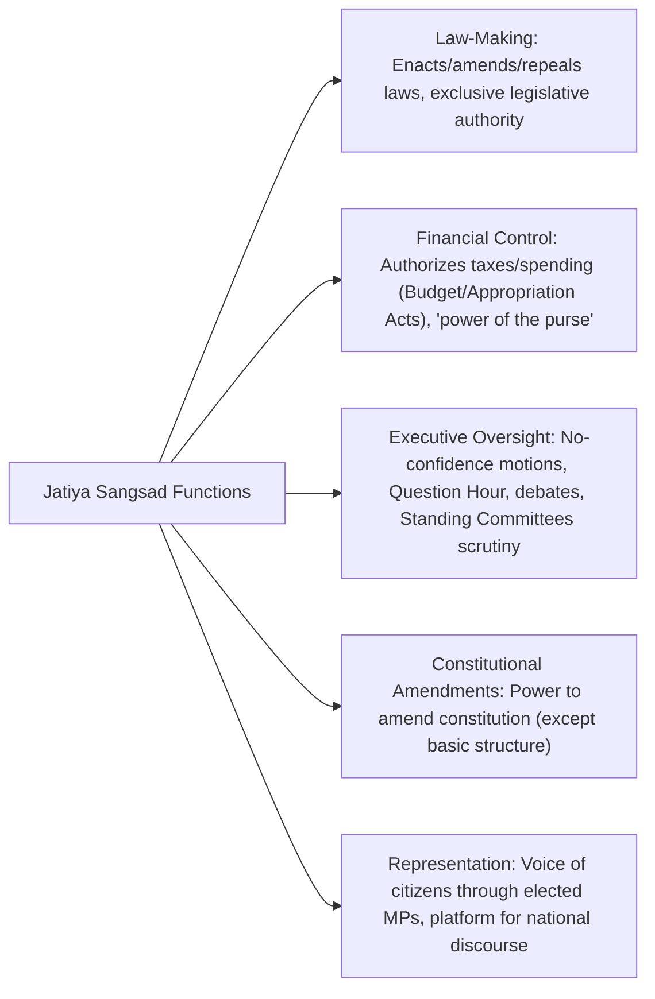
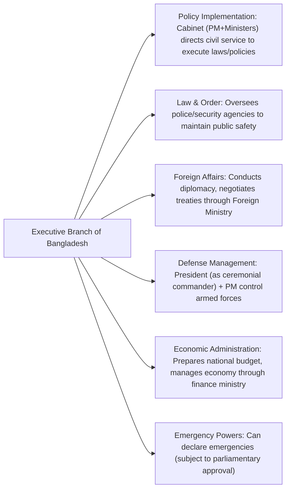
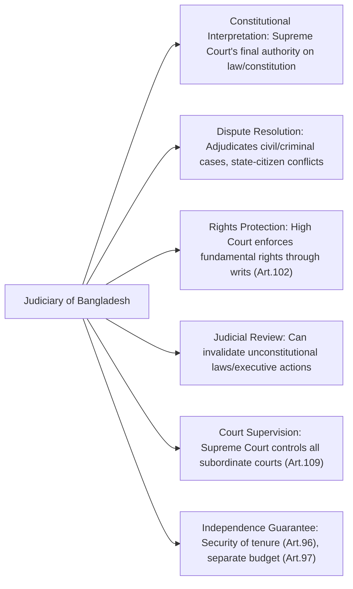

### **Subject: Bangladesh Affairs (Code: 005)**

### **Question 01**

**(a) Describe the geographical location of Bangladesh and its advantages. (3+7=10)**

**Answer:**

**Geographical Location (3 marks):**
Bangladesh is strategically located in the northeastern part of the South Asian subcontinent. Its precise location is between 20°34' and 26°38' north latitude and 88°01' and 92°41' east longitude.
*   **Boundaries:** It shares extensive land borders with India on its west, north, and east sides, and a small border with Myanmar to the southeast. To its south lies the Bay of Bengal, providing it with a significant coastline of approximately 580 kilometers.
*   **Topography:** The country is predominantly a low-lying, vast riverine delta, formed by the confluence of three mighty Himalayan rivers: the Ganges (Padma), the Brahmaputra (Jamuna), and the Meghna.

**Advantages of its Location (7 marks):**
The geographical location of Bangladesh offers several significant strategic, economic, and geopolitical advantages:

1.  **Gateway to the Bay of Bengal:** Its position on the Bay of Bengal makes it a natural maritime gateway for its vast hinterland, including the landlocked northeastern states of India, Nepal, and Bhutan. This gives Bangladesh significant leverage in regional trade and transit.
2.  **Hub for Regional Connectivity:** Bangladesh acts as a physical bridge between South Asia and Southeast Asia. This makes it a crucial node for regional connectivity initiatives like the Bangladesh-Bhutan-India-Nepal (BBIN) Motor Vehicles Agreement, the Bay of Bengal Initiative for Multi-Sectoral Technical and Economic Cooperation (BIMSTEC), and the Bangladesh-China-India-Myanmar (BCIM) Economic Corridor.
3.  **Fertile Agricultural Land:** Being the world's largest delta, Bangladesh is blessed with exceptionally fertile alluvial soil, which is replenished annually by river silt. This supports intensive agriculture, makes the country self-sufficient in rice production, and provides livelihoods for a large portion of its population.
4.  **Abundant Water Resources:** The dense network of rivers provides abundant surface water for irrigation, inland navigation (a cheap mode of transport), and rich freshwater fisheries, which are a vital source of protein and income.
5.  **Strategic Maritime Access:** The coastline provides direct access to international sea lanes in the Indian Ocean, which is critical for its international trade. Over 90% of its trade by volume is conducted via its seaports (Chattogram, Mongla, and Payra).
6.  **Potential for a Blue Economy:** The undisputed maritime area gained after resolving disputes with India and Myanmar opens up vast potential for a "Blue Economy," including deep-sea fishing, offshore energy exploration (oil and gas), and marine tourism.
7.  **Geopolitical Significance:** Its location has attracted the interest of major global and regional powers (USA, China, India, Japan), providing Bangladesh with opportunities to leverage these interests for its economic and strategic benefit through a balanced foreign policy.

**(b) Describe all the adverse effects that are likely to occur in Bangladesh as a result of climate change. (10)**

**Answer:**
As a low-lying, densely populated deltaic nation, Bangladesh is one of the most climate-vulnerable countries in the world. The adverse effects of climate change are not a future possibility but a present reality, and they are projected to intensify, posing an existential threat.

The major adverse effects are:

1.  **Sea-Level Rise and Coastal Inundation:** This is the most critical threat. A one-meter rise in sea level could inundate up to 20% of Bangladesh's coastal areas, permanently displacing an estimated 20-30 million people and creating a massive "climate refugee" crisis.
2.  **Increased Salinity Intrusion:** Rising seas will push saltwater further inland through the vast river network and into groundwater aquifers. This will contaminate drinking water sources, leading to health problems, and render vast tracts of fertile coastal land unsuitable for growing traditional crops like rice, severely threatening the nation's food security.
3.  **Increased Frequency and Intensity of Natural Disasters:** Climate change is leading to more frequent and more intense tropical cyclones, storm surges, and floods. A higher sea level provides an elevated base for storm surges, allowing them to cause greater destruction further inland.
4.  **Erratic Rainfall and Water Scarcity:** Climate change is disrupting traditional monsoon patterns, leading to more extreme weather events: intense rainfall over short periods causing flash floods, and prolonged periods of drought in other seasons, particularly in the northern and western regions. This affects agricultural cycles and leads to water scarcity.
5.  **Threats to Agriculture and Food Security:** The combined effects of salinity, drought, and flooding directly threaten agricultural output. Crop yields are expected to decline significantly, jeopardizing the livelihoods of millions of farmers and the nation's ability to feed its population.
6.  **Impact on Public Health:** Increased flooding and waterlogging will lead to a higher incidence of water-borne diseases like cholera and diarrhea. Heat stress from rising temperatures will also pose a significant health risk.
7.  **Loss of Biodiversity:** The Sundarbans, the world's largest mangrove forest and a UNESCO World Heritage site, is critically threatened by sea-level rise and increased salinity. This will lead to a catastrophic loss of biodiversity, including the habitat of the Royal Bengal Tiger, and will weaken the coast's primary natural defense against cyclones.

---

### **Question 02**

**(a) Write down the differences between Race and Nation. (6)**

**Answer:**
Race and Nation are two distinct concepts used to categorize human groups, but they are based on very different criteria.

| Basis of Difference | **Race** | **Nation** |
| :--- | :--- | :--- |
| **Primary Basis** | Based on perceived biological and physical characteristics, such as skin color, facial features, and hair texture. | Based on shared political identity, culture, language, history, and a sense of collective destiny. |
| **Nature of Concept** | A social construct, not a biologically valid category. Genetic variations within a "race" are often greater than between "races." | A socio-political construct. It is a community of people who feel they belong together and desire political autonomy or sovereignty. |
| **Association with State** | Has no inherent connection to a state or territory. People of the same race can live in many different countries. | Intrinsically linked to the concept of a state or the aspiration for one (a nation-state). It is a political entity. |
| **Defining Element** | Physical phenotype (outward appearance) is the primary (though flawed) defining element. | A sense of shared identity, collective will, and psychological belonging are the defining elements. |
| **Example** | The concept of a "Caucasian race" or "Mongoloid race." These are broad, often arbitrary classifications. | The Bengali nation, the Japanese nation, or the French nation. These are groups with a shared identity and usually a corresponding state. |
| **Flexibility** | An individual cannot change their perceived race. | An individual can change their nationality through naturalization. A nation's identity can also evolve over time. |

**(b) Explain - 'The Bengalis are a mixed race'. (8)**

**Answer:**
The statement that "the Bengalis are a mixed race" is accurate from an ethnological and historical perspective. The Bengali people, who primarily inhabit the Bengal region of the Indian subcontinent, are not a monolithic ethnic group but are the product of centuries of migration, assimilation, and intermingling of various racial and ethnic stocks.

This can be explained through the following historical layers of influence:
1.  **Indigenous Proto-Australoid People:** The earliest inhabitants of the Bengal delta were indigenous groups believed to belong to the Proto-Australoid racial stock. These groups form the aboriginal substratum of the Bengali population.
2.  **Dravidian Influence:** Prior to the Aryan migrations, there was a significant presence of Dravidian-speaking people in the region, who mixed with the indigenous population and contributed to the racial and linguistic makeup.
3.  **Aryan Migration (Indo-European):** The arrival of Indo-European-speaking people, commonly referred to as Aryans, from the north and west led to a significant intermixture. This migration brought the linguistic ancestor of the Bengali language and led to the formation of a distinct Caucasoid-Mongoloid-Australoid blend.
4.  **Mongoloid Influx:** Due to its geographical proximity to Southeast Asia and Tibet, Bengal experienced a continuous influx of people of Tibeto-Burman and Mongoloid stock from the east and north. This is particularly evident in the physical features of people in the eastern and hilly parts of Bengal.
5.  **Later Migrations (Turkic, Persian, Arab, Afghan):** Following the Muslim conquests from the 13th century onwards, there were migrations of Turks, Persians, Arabs, and Afghans who came as rulers, soldiers, traders, and Sufi missionaries. They also intermarried and assimilated into the local population.
6.  **European Contact:** The arrival of Europeans (Portuguese, Dutch, French, and British) also led to some degree of intermingling, though on a smaller scale.

Therefore, the modern Bengali population is a composite people, a rich "sankar" or admixture of diverse racial elements. Their physical features, language, and culture reflect this long and complex history of assimilation, making them a quintessential example of a mixed ethnic group.

**(c) Describe the social and cultural life of the Chakmas of the Chittagong Hill Tracts. (6)**

**Answer:**
The Chakmas are the largest ethnic group in the Chittagong Hill Tracts (CHT) of Bangladesh. They have a rich and distinct social and cultural life that sets them apart from the majority Bengali population.

**Social Life:**
*   **Social Structure:** Chakma society is patriarchal. The basic social unit is the family (*poribar*). Several families form a clan (*goza*), which is headed by an elder. Multiple clans form a village (*adam*), led by a headman (*karbari*). The entire Chakma community is traditionally led by the Chakma Chief or Raja, who also acts as a customary law administrator.
*   **Marriage and Family:** Marriages are typically monogamous and are arranged by parents, though love marriages are also common. Cross-cousin marriage is permitted. The family system is patrilocal, with the wife moving to her husband's home after marriage.
*   **Livelihood:** Traditionally, the Chakmas practiced *jum* (slash-and-burn) cultivation on the hills. However, many have now transitioned to plow cultivation in the valleys and are engaged in horticulture, small businesses, and government service.

**Cultural Life:**
*   **Religion:** The majority of Chakmas practice Theravada Buddhism, which is deeply interwoven with their cultural practices. They celebrate major Buddhist festivals like Buddha Purnima and Kathin Chibar Dan. They also retain elements of their pre-Buddhist animist beliefs.
*   **Language and Script:** The Chakma language belongs to the Indo-Aryan family and has its own unique script, known as "Chakma" or "Ajhā Pāth."
*   **Festivals:** The most important and colorful festival is **Bizu**, which celebrates the Bengali New Year over three days. The first day is *Phool Bizu* (decorating houses with flowers), the second is *Mul Bizu* (the main day of celebration and feasting), and the third is *Gojjya Pojjya Din* (a day of rest).
*   **Dress and Ornaments:** Chakma women wear a traditional two-piece attire consisting of a *pinon* (a skirt wrapped around the waist) and a *hadi* (a decorative breast-cloth). They are known for their exquisite hand-woven textiles with intricate designs.

---

### **Question 03**

**(a) What is meant by poverty alleviation? (5)**

**Answer:**
Poverty alleviation refers to the set of economic and humanitarian strategies and interventions designed to permanently lift people out of poverty. It is a much broader and more sustainable concept than simple poverty relief, which provides temporary support. The ultimate goal of poverty alleviation is not just to meet the immediate needs of the poor but to empower them with the tools, resources, and opportunities to achieve a self-sufficient and dignified life.

Key dimensions of poverty alleviation include:
*   **Increasing Income:** Creating employment and livelihood opportunities.
*   **Building Human Capital:** Providing access to essential services like education, healthcare, and nutrition to enhance people's capabilities.
*   **Reducing Vulnerability:** Implementing social safety nets (like cash transfers, food assistance) to protect the poor from economic shocks, natural disasters, and health crises.
*   **Promoting Empowerment:** Ensuring the social and political inclusion of the poor, particularly women, so they can have a voice in decisions that affect their lives.
*   **Improving Access to Assets:** Facilitating access to credit (microfinance), land, and technology.

In essence, poverty alleviation is a multi-dimensional process aimed at breaking the inter-generational cycle of poverty.

**(b) Briefly describe the steps taken by the Bangladesh government to alleviate poverty. (15)**

**Answer:**
The Government of Bangladesh has adopted a comprehensive and multi-pronged strategy for poverty alleviation, which has resulted in one of the world's most impressive records of poverty reduction. The national poverty rate fell from over 44% in 1991 to 18.7% in 2022.

The key steps and strategies are:

1.  **Macroeconomic Stability and Pro-Poor Growth:** The government has focused on maintaining high GDP growth (averaging over 6% for more than a decade), driven by labor-intensive sectors like the Ready-Made Garment (RMG) industry, which has created millions of jobs, especially for women. This growth has been a primary driver of poverty reduction.

2.  **Expansion of Social Safety Net Programs (SSNPs):** This is a cornerstone of the government's strategy. Bangladesh runs one of the largest social safety net systems in the developing world. Key programs include:
    *   **Cash Transfer Programs:** Allowances for the elderly, widows, and persons with disabilities.
    *   **Food Security Programs:** The Food Friendly Program provides subsidized rice to millions of poor households.
    *   **Public Works Programs:** Employment Generation Program for the Poorest (EGPP) provides short-term employment during the lean agricultural season.
    *   **Stipend Programs:** Extensive stipend programs for primary and secondary school students, especially girls, reduce the cost of education for poor families and prevent child marriage.

3.  **Investment in Human Capital Development:**
    *   **Education:** The government has achieved near-universal primary school enrollment and gender parity in primary and secondary education. Free textbook distribution and stipend programs have been crucial.
    *   **Health:** A vast network of community clinics has been established across the country to provide primary healthcare services at the grassroots level. Successful immunization programs have drastically reduced child mortality.

4.  **Promotion of Microfinance and Financial Inclusion:** While pioneered by NGOs, the government actively supports microfinance through its own institutions like the Palli Sanchay Bank. It has also promoted mobile financial services (MFS) like bKash and Nagad, which have revolutionized financial inclusion, making it easier for the poor to receive payments and access financial services.

5.  **Rural Development and Agricultural Growth:** The government provides subsidies for fertilizer, seeds, and electricity for irrigation. Investment in agricultural research has led to the development of high-yield crop varieties, ensuring food security and boosting rural incomes.

6.  **Infrastructure Development:** Massive investments in rural infrastructure, such as roads, bridges (like the Padma Bridge), and electricity, have improved connectivity, created economic opportunities, and reduced regional disparities.

7.  **Digitalization of Services:** The "Digital Bangladesh" initiative has brought government services to the doorsteps of rural people through Union Digital Centers, reducing costs and corruption and empowering citizens with information.

This integrated approach, combining economic growth with targeted social programs and investments in human capital, has been the key to Bangladesh's remarkable success in poverty alleviation.

---

### **Question 04**

**(a) Describe the fundamental principles of state policy as stated in the Constitution of the People's Republic of Bangladesh. (15)**

**Answer:**
Part II of the Constitution of the People's Republic of Bangladesh lays down the Fundamental Principles of State Policy. These principles, while not judicially enforceable, are "fundamental to the governance of Bangladesh" and serve as a guide for the state in making laws and policies. The 15th Amendment restored the four original principles of the 1972 Constitution.

The key principles are:

1.  **Nationalism (Article 9):** The Constitution specifies that the unity and solidarity of the Bengali nation, which attained independence through a national liberation struggle, are the basis of Bengali Nationalism. This principle is rooted in the shared language, literature, culture, traditions, and history of the Bengali people and aims to inspire citizens to dedicate themselves to the progress and prosperity of Bangladesh.

2.  **Socialism and Freedom from Exploitation (Article 10):** The Constitution pledges to establish an egalitarian and socialist society, "free from the exploitation of man by man." This principle aims to attain a just and equitable social order by ensuring the equitable distribution of wealth, preventing the concentration of wealth in the hands of a few, and ensuring basic necessities of life for all citizens through planned economic growth.

3.  **Democracy and Human Rights (Article 11):** This article affirms that the Republic shall be a democracy. It guarantees fundamental human rights and freedoms, respect for the dignity and worth of the human person, and the effective participation of the people in administration at all levels through their elected representatives. It is the foundation of the country's political system.

4.  **Secularism and Freedom of Religion (Article 12):** This principle mandates the elimination of communalism in all its forms, prevents the state from granting political status to any religion, prohibits the abuse of religion for political purposes, and forbids any discrimination against or persecution of persons practicing a particular religion. It ensures state neutrality and religious freedom for all citizens.

**Other Important Principles include:**
*   **Ownership (Article 13):** Establishes three forms of ownership: state, co-operative, and private.
*   **Emancipation of Peasants and Workers (Article 14):** Pledges to emancipate peasants and workers from all forms of exploitation.
*   **Provision of Basic Necessities (Article 15):** The state has a fundamental responsibility to secure for its citizens the provision of basic necessities like food, clothing, shelter, education, and medical care.
*   **Separation of Judiciary from the Executive (Article 22):** The state shall ensure the separation of the judiciary from the executive organs of the state, a key principle for rule of law.
*   **Foreign Policy (Article 25):** Based on the principle of "friendship to all, malice towards none," it promotes international peace, security, and respect for international law.

**(b) Briefly describe the appointment process and responsibilities of the Attorney-General. (5)**

**Answer:**
The Attorney-General is the principal law officer of the government, a constitutional post established under Article 64 of the Constitution.

**Appointment Process:**
*   The President of Bangladesh appoints the Attorney-General.
*   **Qualification:** To be appointed, a person must be qualified to be appointed as a Judge of the Supreme Court. This means they must be a citizen of Bangladesh and have been an advocate of the Supreme Court for at least ten years or have held a judicial office in Bangladesh for at least ten years.
*   **Tenure:** The Attorney-General holds office "during the pleasure of the President," which in practice means they serve as long as the government that appointed them remains in power.

**Responsibilities:**
The duties of the Attorney-General are crucial for the legal functioning of the state:
1.  **Chief Legal Advisor:** Their primary responsibility is to give legal advice to the Government of Bangladesh on any matter referred to them by the President.
2.  **State's Representative in Court:** They represent the state (the Republic) in all cases before the Supreme Court (both the High Court Division and the Appellate Division). They appear on behalf of the government in all important constitutional, civil, and criminal litigation.
3.  **Performing Other Legal Duties:** They perform other duties of a legal character that may be assigned to them by the President.
4.  **Constitutional Functions:** They discharge any functions conferred on them by the Constitution or any other law. For example, the Attorney-General's consent is required to initiate contempt of court proceedings.

---

### **Question 05**

**Describe the role of the Legislature, the Executive, and the Judiciary in running the state according to the Constitution of the People's Republic of Bangladesh. (20)**

**Answer:**
The Constitution of Bangladesh establishes a parliamentary democracy based on the principle of separation of powers, where the state's functions are distributed among three distinct but inter-related organs: the Legislature, the Executive, and the Judiciary.

**1. The Legislature (Jatiya Sangsad): The Law-Making Body**
The Legislature, known as the Jatiya Sangsad, is the supreme law-making body of the Republic. Its role is central to governance.
*   **Law-Making (Primary Role):** Its most important function is to make, amend, and repeal laws for the country on any matter listed in the Constitution. No law can be enacted without its approval.
*   **Control over Finance:** The Legislature holds the "power of the purse." No tax can be levied, and no money can be spent from the state's Consolidated Fund without the authorization of the Parliament through the passage of the annual budget (Finance Bill and Appropriation Act). This is a powerful tool to control the government.
*   **Ensuring Executive Accountability:** In a parliamentary system, the Executive (the Cabinet) is directly responsible to the Legislature. The Jatiya Sangsad holds the government accountable through various mechanisms:
    *   **No-Confidence Motion:** It can remove the government by passing a vote of no-confidence.
    *   **Question Hour, Motions, and Debates:** Members of Parliament (MPs) can question ministers, raise matters of public importance, and debate government policies.
    *   **Standing Committees:** These parliamentary committees scrutinize the activities of various ministries, examine bills, and investigate matters of public concern, acting as a "watchdog."
*   **Constitutional Amendments:** The Legislature has the power to amend the Constitution, though it cannot alter its "basic structure."

**2. The Executive: The Policy Implementing Body**
The Executive branch is responsible for implementing the laws passed by the legislature and running the day-to-day administration of the country. In Bangladesh's system, the executive comprises the President and the Cabinet, led by the Prime Minister.
*   **Policy Formulation and Implementation (Primary Role):** The Prime Minister and the Cabinet formulate national policies and are responsible for their execution through the various ministries and government departments. The vast civil service machinery works under the direction of the Executive.
*   **Maintaining Law and Order:** The Executive is responsible for maintaining internal law and order and ensuring the security of the state through the police and other law enforcement agencies.
*   **Conducting Foreign Relations:** The Executive, led by the Prime Minister and the Foreign Minister, manages Bangladesh's foreign policy, establishes diplomatic relations, and negotiates treaties and agreements with other countries.
*   **Command of the Armed Forces:** The President is the Supreme Commander of the armed forces, but this power is exercised on the advice of the Prime Minister. The Executive is responsible for national defense.
*   **Financial Administration:** The Executive prepares the annual budget and presents it to the Legislature for approval. It is also responsible for managing the national economy.

**3. The Judiciary: The Interpreting and Adjudicating Body**
The Judiciary, headed by the Supreme Court, is the guardian of the Constitution and the ultimate arbiter of legal disputes. Its independence is crucial for the rule of law.
*   **Interpretation of Laws and the Constitution (Primary Role):** The Judiciary's primary function is to interpret the laws of the land and the provisions of the Constitution. The Supreme Court's interpretation is final and binding on all other courts and state organs.
*   **Adjudication of Disputes:** It settles legal disputes between citizens, between citizens and the state, and between different organs of the state. It administers both civil and criminal justice.
*   **Guardian of Fundamental Rights:** This is a vital role. The High Court Division of the Supreme Court has the power to enforce the fundamental rights of citizens (guaranteed in Part III of the Constitution) by issuing writs and orders against any person or authority.
*   **Judicial Review:** The Judiciary has the power of judicial review, meaning it can examine the actions of the Legislature and the Executive to determine if they are consistent with the Constitution. It can declare any law or executive action that violates the Constitution to be null and void. This power acts as a critical check on the other two branches, preventing them from overstepping their constitutional limits and ensuring constitutional supremacy.
*   **Supervision of Subordinate Courts:** The Supreme Court has the power of supervision and control over all lower courts and tribunals, ensuring the smooth and fair administration of justice throughout the country.

---
### **Question 06**

**(a) Discuss the determinants of Bangladesh's foreign policy formulation. (10)**

**Answer:**
The foreign policy of Bangladesh is formulated based on a combination of constitutional principles, geopolitical realities, and core national interests. These determinants collectively shape how Bangladesh interacts with the rest of the world.

The key determinants are:

1.  **Constitutional Principles (Article 25):** The Constitution provides the ideological foundation. This includes respect for national sovereignty and equality, non-interference in internal affairs of other states, peaceful settlement of international disputes, and respect for international law and the principles of the UN Charter. The guiding philosophy is "Friendship to all, malice towards none."
2.  **Geopolitical and Strategic Factors:**
    *   **Geography:** Bangladesh's location, surrounded by India on three sides with a small border with Myanmar and access to the Bay of Bengal, is a primary determinant. Managing relations with its large neighbor, India, is the single most important aspect of its foreign policy.
    *   **Balancing Major Powers:** Bangladesh must navigate a careful balancing act between major regional and global powers, particularly India, China, and the United States, to maximize its strategic and economic benefits without getting caught in their rivalries.
3.  **Economic Interests:** This is arguably the most powerful pragmatic determinant. Foreign policy is geared towards:
    *   **Promoting Exports:** Securing and expanding market access for its key export, Ready-Made Garments (RMG).
    *   **Attracting FDI:** Creating a favorable climate for foreign direct investment to fuel industrial growth.
    *   **Ensuring Remittances:** Maintaining good relations with labor-importing countries, especially in the Middle East, to protect the interests of its migrant workforce and ensure a smooth flow of remittances.
    *   **Securing Development Aid:** Obtaining development assistance and soft loans from international partners and financial institutions (World Bank, ADB, etc.).
4.  **Historical Legacy:** The experience of the 1971 Liberation War is a foundational element. It instills a strong sense of national sovereignty and a policy of supporting oppressed peoples and promoting peace, as reflected in its leading role in UN Peacekeeping Operations.
5.  **Domestic Factors:** Internal political stability, public opinion, and the government's development agenda also influence foreign policy decisions. For instance, managing the Rohingya refugee crisis is a major foreign policy challenge driven by a domestic humanitarian and security imperative.

**(b) In the context of the current geo-politics, what kind of relationship do you think is possible to maintain between India, Bangladesh, and China? Present a picture of such a relationship. (10)**

**Answer:**
In the current geopolitical context, characterized by escalating India-China rivalry, Bangladesh's optimal strategy is to pursue a policy of **pragmatic and balanced engagement** with both giants. The relationship would not be a formal alliance with either but a carefully calibrated partnership that maximizes Bangladesh's national interests while avoiding entanglement in their disputes.

The picture of such a relationship would look like this:

**Relationship with India (The "Special" Partner):**
*   **Basis:** Historical, cultural, and geographical ties make this relationship foundational. It is a "special relationship" based on shared history (1971), extensive borders, and river systems.
*   **Areas of Deep Cooperation:** Security cooperation (counter-terrorism, border management), trade and transit (providing India's northeast access to ports), connectivity (road, rail, waterways), and energy sector collaboration would remain deep and robust.
*   **Focus:** The focus would be on resolving outstanding bilateral issues like Teesta water-sharing and reducing the trade imbalance through negotiation and mutual trust.

**Relationship with China (The "Strategic" Development Partner):**
*   **Basis:** This relationship is primarily driven by economic and developmental imperatives. China is Bangladesh's largest trading partner and a massive source of investment in infrastructure.
*   **Areas of Deep Cooperation:** China would remain the key partner for large-scale infrastructure projects (bridges, power plants, ports) under its Belt and Road Initiative (BRI). It would also be a crucial source of defense procurement and affordable industrial raw materials.
*   **Focus:** Bangladesh would leverage Chinese investment for its development goals while being cautious about "debt traps" and ensuring projects are economically viable and serve Bangladesh's interests first.

**The Balancing Act (The Core Strategy):**
*   **De-hyphenation:** Bangladesh would "de-hyphenate" its relationships, meaning its ties with New Delhi and Beijing would be treated as independent of each other. It would not view its relationship with one through the lens of the other.
*   **Economic Pragmatism over Geopolitical Alignment:** Bangladesh would welcome economic investment from both countries but would steer clear of any security alliances or military blocs that could be seen as targeting the other. For instance, while engaging with the US-led Indo-Pacific Strategy (IPS), it would frame its participation in economic and non-traditional security terms, not military ones.
*   **Asserting Sovereignty:** In any situation of Indo-China friction, Bangladesh would maintain a neutral stance, emphasizing its sovereign right to pursue an independent foreign policy based on its own national interests.

This triangular relationship would be a delicate tightrope walk, requiring astute diplomacy. The goal is a **"win-win-win" scenario** where Bangladesh benefits from both India's strategic proximity and China's economic might, transforming its geopolitical vulnerability into a strategic advantage.

---

### **Question 07**

**The formation of alliances among political parties in Bangladesh is not a new phenomenon - Discuss. (20)**

**Answer:**
The statement that alliance-based politics is not a new phenomenon in Bangladesh is historically accurate. From the pre-independence period to the present day, forming coalitions and alliances has been a central and enduring feature of the country's political landscape. This practice has been driven by the need to consolidate opposition, challenge incumbent regimes, and maximize electoral prospects.

**1. Pre-Independence Period (The Genesis):**
The roots of alliance politics lie in the struggle against Pakistani domination. The most significant early example was the **United Front (*Jukto Front*)**.
*   **United Front (1954):** This was a coalition of opposition parties in East Bengal, led by the Awami Muslim League (under H.S. Suhrawardy and Sheikh Mujibur Rahman), the Krishak Sramik Party (led by A. K. Fazlul Huq), and others. They united on a 21-point agenda to challenge the ruling Muslim League. The United Front's landslide victory in the 1954 provincial election was a powerful demonstration of how a united opposition could defeat a powerful incumbent, setting a precedent for all future alliance politics.

**2. Post-Independence (Pre-1990):**
During the periods of one-party rule and military regimes, alliances were formed primarily to restore democracy.
*   **Against BAKSAL:** After the formation of the one-party BAKSAL system in 1975, underground political activities often took the form of loose alliances.
*   **Against Military Rule (Ershad Regime):** The movement against the autocratic regime of General H.M. Ershad saw the formation of two major, though often competing, alliances:
    *   The **15-Party Alliance**, led by the Awami League under Sheikh Hasina.
    *   The **7-Party Alliance**, led by the Bangladesh Nationalist Party (BNP) under Khaleda Zia.
    Despite their rivalry, their parallel movements and eventual joint action were instrumental in the downfall of Ershad in 1990 and the restoration of parliamentary democracy.

**3. Post-1991 Parliamentary Era (The Bipolar Alliance System):**
The period after 1991 has been characterized by a highly polarized and formalized two-alliance system.
*   **The Rise of Ideological Blocs:** Politics crystallized around two major poles. The **Awami League** led a center-left, secular-leaning alliance (which evolved into the **14-Party Alliance** and later, the **Grand Alliance**), often including smaller leftist and nationalist parties.
*   The **BNP** led a center-right, nationalist, and often Islamist-leaning alliance (which evolved into the **4-Party Alliance**, later the **18-Party Alliance**, and the **20-Party Alliance**), with the Islamist party Jamaat-e-Islami as its most significant and controversial partner.
*   **Electoral Strategy:** In this era, alliances became the primary tool for contesting elections. The goal was to consolidate anti-incumbent votes and avoid splitting the opposition vote. Elections from 1991 to 2008 were essentially contests between these two major alliances.

**Conclusion:**
Throughout its history, Bangladesh's political dynamics have consistently demonstrated that forming alliances is a fundamental strategy. Whether to fight for language and autonomy (United Front), restore democracy (anti-Ershad movement), or win elections in a polarized environment (post-1991 era), coalition-building has been an indispensable political tool. It is not a recent development but an intrinsic part of the nation's political DNA, reflecting a pragmatic understanding that collective action is often necessary to achieve political objectives.

---

### **Question 08**

**(a) Discuss the role of the Election Commission in advancing the democratic process. (10)**

**Answer:**
The Election Commission (EC) is the constitutional cornerstone of the democratic process in Bangladesh. Its role is not merely to conduct elections but to ensure that they are free, fair, and credible, thereby upholding the principle of popular sovereignty.

The EC's role in advancing democracy can be discussed as follows:
1.  **Guardian of a Free and Fair Vote:** The EC's most fundamental role is to create a level playing field where all political parties and candidates can compete on an equal footing and voters can cast their ballots without fear or intimidation. By ensuring the sanctity of the vote, the EC legitimizes the electoral outcome and facilitates a peaceful transfer of power, which is the hallmark of a functional democracy.
2.  **Upholding Constitutional Mandates:** The EC is constitutionally mandated (Article 119) to conduct elections for the President and Parliament. By fulfilling this duty in a timely and impartial manner, it ensures the continuity of the democratic process and prevents any constitutional vacuum.
3.  **Voter Registration and Empowerment:** The preparation and maintenance of accurate electoral rolls is a critical function. By creating a flawless voter list with photographs, the EC has significantly reduced the scope for vote-rigging and empowered every eligible citizen with the right to participate in the democratic process.
4.  **Regulation of Political Parties:** The EC registers political parties and enforces rules regarding their internal democracy and financial transparency. This role, when exercised effectively, can help to institutionalize political parties and make them more accountable.
5.  **Enforcing the Electoral Code of Conduct:** The EC sets and enforces rules to control campaign expenditure, prevent the use of muscle power and illicit money, and stop inflammatory rhetoric. An impartial and strict enforcement of this code is vital for creating a fair competitive environment.

However, the EC's effectiveness is often constrained by the country's polarized political culture, a lack of cooperation from the incumbent government, and limitations in its institutional capacity. A truly independent, courageous, and effective Election Commission is indispensable for deepening democracy in Bangladesh.

**(b) 'Reducing electoral expenditure is a panacea for curbing corruption' - Give your opinion. (10)**

**Answer:**
The statement that reducing electoral expenditure is a panacea (a cure-all) for curbing corruption is a compelling but overly simplistic argument. While there is a strong and undeniable link between high election costs and systemic corruption, reducing expenditure alone is a necessary but not sufficient condition to eradicate corruption. It is a powerful antidote, but not a panacea.

**Arguments in favor (Why it is a "Mahoushodh" or great medicine):**
1.  **Breaking the Cycle of "Investment and Return":** Elections in Bangladesh have become prohibitively expensive. Candidates often spend many times the legal limit, viewing the expenditure as a political "investment." Once elected, they are under immense pressure to recoup this investment through corrupt means, such as by influencing government contracts, taking bribes, or engaging in illegal patronage. Reducing election costs would break this vicious cycle.
2.  **Curbing the Influence of "Black Money":** High election costs necessitate funding from illicit sources ("black money"). This creates a nexus between politicians and corrupt business interests or criminals, who then demand favors and policy concessions in return, institutionalizing corruption at the highest levels. Limiting expenditure would reduce the demand for such illicit funds.
3.  **Creating a Level Playing Field for Honest Candidates:** Prohibitive costs effectively bar honest and capable individuals without immense personal wealth or corrupt backing from contesting elections. Reducing costs would make it possible for candidates from ordinary backgrounds to compete based on their merit and ideas, improving the quality of political leadership.

**Arguments against (Why it is not a "Panacea" or cure-all):**
1.  **Deep-Rooted Systemic Corruption:** Corruption in Bangladesh is not limited to electoral financing. It is deeply embedded in the bureaucracy, law enforcement, and other state institutions. Even if election costs were zero, the opportunities and incentives for corruption would remain.
2.  **Lack of Political Will and Enforcement:** The greatest challenge is enforcement. Legal expenditure limits already exist but are widely flouted with impunity. Without a strong, independent Election Commission and the political will from all parties to adhere to the rules, simply lowering the legal limit will have little practical effect.
3.  **Other Drivers of Corruption:** Greed, a culture of impunity, weak accountability mechanisms, and a lack of strong anti-corruption institutions are also powerful drivers of corruption that would not be addressed simply by controlling election spending.

**Conclusion (My Opinion):**
In my opinion, drastically reducing and strictly enforcing electoral expenditure limits is the **single most impactful starting point** for tackling political corruption in Bangladesh. It addresses the root cause of much of the high-level corruption that plagues the system. It is a "mahoushodh" (a great medicine) that can treat a critical symptom and prevent the disease from spreading. However, it is not a "panacea." To truly curb corruption, this reform must be accompanied by a broader, holistic strategy that includes strengthening the Anti-Corruption Commission, ensuring judicial independence, reforming the bureaucracy, and fostering a social movement against corruption.

---
### **Question 09**

**(a) In which areas has the government been successful in bringing the digitalization process to the people's doorsteps for the country's socio-economic development? Describe. (10)**

**Answer:**
The government of Bangladesh has been remarkably successful in leveraging digitalization to bring services to the people's doorsteps, a core part of its "Digital Bangladesh" (now "Smart Bangladesh") vision. This has had a profound impact on socio-economic development.

Key areas of success include:

1.  **Public Service Delivery at the Grassroots (Union Digital Centers):** The establishment of over 8,000 Union Digital Centers (UDCs) across the country is perhaps the most significant achievement. These one-stop shops, run by local entrepreneurs, provide rural citizens with access to over 150 types of services, such as online birth registration, passport applications, land record applications, and mobile banking. This has saved citizens time and money and drastically reduced the scope for petty corruption.
2.  **Financial Inclusion (Mobile Financial Services - MFS):** The government created a policy environment that allowed Mobile Financial Services like bKash, Nagad, and Rocket to flourish. This has led to a revolution in financial inclusion. The government now uses these platforms to directly disburse payments for Social Safety Net Programs (e.g., old-age allowances, stipends) to millions of beneficiaries, ensuring transparency and eliminating "leakage."
3.  **Education:** The digitalization of the education sector has been transformative. This includes creating a massive online content repository (e.g., `www.infokosh.gov.bd`), distributing free digital textbooks, centralizing online admission processes for colleges and universities, and publishing public exam results online, making the system more efficient and accessible.
4.  **Health Services:** E-health initiatives have started to take root. The establishment of a national health helpline, the use of telemedicine services from community clinics to connect rural patients with specialist doctors in cities, and the digital registration for COVID-19 vaccination are prominent examples.
5.  **E-Procurement (e-GP):** The implementation of electronic Government Procurement (e-GP) has been a major step in curbing corruption in public contracts. By moving the tendering process online, it has increased transparency, enhanced competition, and reduced the influence of political muscle power.

**(b) Mention the role of civil society in forming public opinion. (10)**

**Answer:**
Civil society, comprising non-governmental organizations (NGOs), community groups, professional associations, academics, intellectuals, and the media, plays an indispensable role in forming public opinion and strengthening democracy in Bangladesh.

The key roles are:
1.  **Acting as a "Watchdog":** Civil society organizations monitor the activities of the government and corporations. They scrutinize government policies, expose corruption, report on human rights violations, and hold the powerful accountable. This "watchdog" function provides the public with critical information that is essential for forming informed opinions.
2.  **Advocacy and Policy Dialogue:** Civil society acts as an advocate for the public good and for marginalized communities. Through research, seminars, and policy dialogues (like those organized by the Centre for Policy Dialogue - CPD), they bring important issues to the forefront of public and political discourse, influencing both public opinion and government policy on topics ranging from the national budget to environmental protection.
3.  **Raising Public Awareness:** Through campaigns, media engagement, and grassroots activities, civil society raises public awareness on critical social issues like gender equality, environmental degradation, workers' rights, and the importance of democratic values. They help shape social norms and priorities.
4.  **Providing an Alternative Voice:** In a highly polarized political environment where political parties often present biased information, civil society can offer a more neutral, evidence-based perspective. This provides citizens with an alternative source of information, helping them to form more balanced opinions.
5.  **Mobilizing Citizens:** Civil society can mobilize citizens to engage in collective action to demand change. Movements for road safety, environmental protection, or the trial of war criminals have often been initiated or strongly supported by civil society actors, demonstrating their power to translate public opinion into action.

In essence, a vibrant and independent civil society is the "conscience" of the nation, crucial for creating an informed citizenry, which is the bedrock of a functioning democracy.

---

### **Question 10**

**Write short notes on any four of the following: (ALL are answered as requested)**

**(a) Export Trade of Bangladesh and the World Trade Organization (WTO)**
Bangladesh's export trade is overwhelmingly dominated by the Ready-Made Garment (RMG) sector, which accounts for over 80% of total export earnings. The World Trade Organization (WTO) has been fundamentally important to this success. As a Least Developed Country (LDC), Bangladesh has benefited from the WTO's provisions for special and differential treatment, particularly the duty-free, quota-free market access granted by the European Union's "Everything But Arms" (EBA) initiative. This preferential access has been the single most important catalyst for the RMG industry's growth. The WTO provides a rule-based multilateral trading system that protects smaller economies like Bangladesh from arbitrary trade practices. However, with Bangladesh's scheduled graduation from LDC status in 2026, it will lose these trade preferences, posing a major challenge. The country's future export strategy now depends on diversifying its export basket beyond RMG and negotiating Free Trade Agreements (FTAs).

**(b) Activities of the IMF in Bangladesh**
The International Monetary Fund (IMF) plays a significant role in Bangladesh's economy, primarily in maintaining macroeconomic stability and providing financial assistance during times of economic stress. Its key activities include:
1.  **Surveillance and Policy Advice:** The IMF regularly conducts economic "health checks" (under its Article IV consultations), analyzing the country's economic policies and providing recommendations on fiscal discipline, monetary policy, and structural reforms.
2.  **Financial Assistance:** When Bangladesh faces balance of payments difficulties, the IMF provides loans with attached policy conditions (conditionalities). Recently, in 2023, the IMF approved a $4.7 billion loan package to help Bangladesh tackle challenges arising from depleted foreign exchange reserves and high inflation.
3.  **Technical Assistance:** The IMF provides technical assistance and training to government officials in areas like tax administration, public financial management, and central banking to help build institutional capacity.

**(c) The 1970 General Election of Pakistan**
The 1970 general election was the first to be held in Pakistan based on universal adult franchise. It was a watershed moment that directly led to the independence of Bangladesh. The Awami League, led by Bangabandhu Sheikh Mujibur Rahman, contested the election on the platform of its Six-Point Program for regional autonomy. The party won a landslide victory, securing 167 out of 169 National Assembly seats in East Pakistan, giving it an absolute majority in the all-Pakistan parliament. This electoral result was a clear democratic mandate for Bengali autonomy. The subsequent refusal of the Pakistani military junta and West Pakistani politicians to honor the verdict and transfer power to the Awami League was the final act of betrayal that closed the door on a united Pakistan and made the Liberation War inevitable.

**(d) The Mujibnagar Government**
The Mujibnagar Government was the first provisional government of Bangladesh, formed in exile on April 10, 1971, during the Liberation War. It was formally proclaimed on April 17, 1971, in Baidyanathtala, Meherpur, which was renamed Mujibnagar. Formed by the elected representatives of the 1970 election, it provided a legitimate political leadership to the liberation struggle. With Bangabandhu Sheikh Mujibur Rahman as President (in absentia), Syed Nazrul Islam as Acting President, and Tajuddin Ahmad as Prime Minister, this government-in-exile performed crucial functions: it organized and commanded the Mukti Bahini (Liberation Forces), conducted a global diplomatic campaign for recognition and support, managed refugee affairs, and ran the Swadhin Bangla Betar Kendra radio station, ultimately guiding the nation to victory.

**(e) Mineral Resources of Bangladesh**
While not rich in metallic minerals, Bangladesh possesses significant deposits of valuable non-metallic and energy resources. The most crucial resource is **natural gas**, which has historically fueled its power plants and fertilizer industry, with major fields located in the eastern part of the country. The second major resource is high-quality **bituminous coal**, with large reserves discovered in the northwest (e.g., Barapukuria, Phulbari). Other important resources include **hard rock** (from Maddhapara, used in construction), **white clay/kaolin** (for the ceramics industry), and **limestone** (for cement). The country's successful resolution of maritime boundaries has also opened up a new frontier for potential offshore oil and gas exploration in the Bay of Bengal.

**(f) The position of women's empowerment in Bangladesh**
Bangladesh has achieved remarkable and internationally acclaimed progress in women's empowerment, often outperforming countries with higher per capita incomes. This is a key driver of its socio-economic development. Key indicators of its position include:
*   **Political Empowerment:** Bangladesh has been led by a female Prime Minister for a significant period. Women hold reserved seats in the national parliament and local government bodies.
*   **Economic Participation:** Millions of women form the backbone of the crucial RMG industry, giving them economic independence. Women's participation in the labor force has steadily increased.
*   **Education and Health:** Bangladesh has achieved gender parity in primary and secondary school enrollment. Maternal and child mortality rates have declined dramatically.
Despite this progress, challenges remain, including high rates of violence against women, child marriage, and a significant gender gap in formal sector employment and wages.