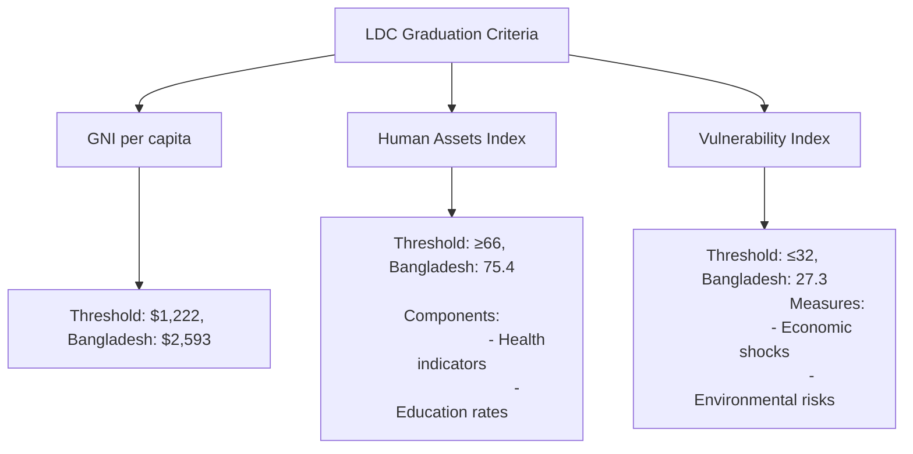
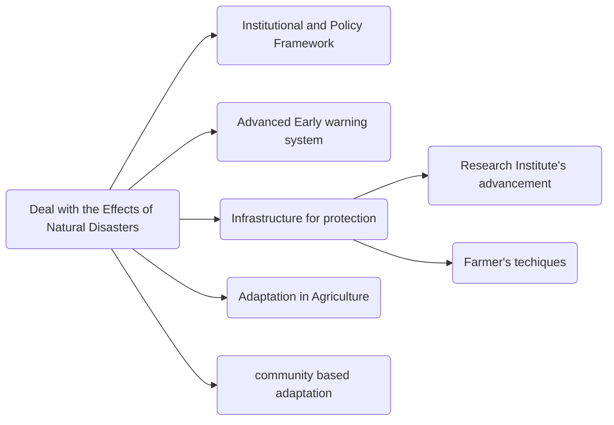

### **Answer to Question 1**

**Question:**
a) What is the geographical location of Bangladesh? (5 marks)
b) Which districts form the Barind region? (5 marks)
c) Give a topographical description of the different regions of Bangladesh. (10 marks)

**Introduction**

Bangladesh is a South Asian country renowned for its unique geography, being the world's largest river delta. Its strategic location, deltaic plains, elevated terraces, and hilly terrains create a diverse topography that has profoundly shaped its climate, economy, culture, and the lives of its people. Understanding these geographical features is fundamental to comprehending the nation's character.

#### **a) Geographical Location of Bangladesh**

Bangladesh is situated in the north-eastern part of South Asia. Its specific geographical coordinates are between 20°34' and 26°38' North latitude and between 88°01' and 92°41' East longitude.

Its location is defined by its neighbors and coastline:
*   It is bordered by **India** on the west, north, and east.
*   It shares a border with **Myanmar** in the southeast.
*   To the south lies the **Bay of Bengal**.

A significant geographical line, the **Tropic of Cancer**, passes through the center of the country. This location places Bangladesh in a subtropical monsoon climate zone, characterized by heavy rainfall, high temperatures, and high humidity.

#### b) Districts Forming the Barind Region

The Barind region, or Barind Tract, is one of the major physiographic units of Bangladesh, consisting of elevated land from the Pleistocene era. It is located in the north-western part of the country, primarily within the Rajshahi and Rangpur divisions.

The Barind Tract covers parts of the following districts:
*   **Core Districts:** The largest parts of the region fall within **Rajshahi, Naogaon, and Chapainawabganj**.
*   **Other Districts:** It also extends into parts of **Bogra, Joypurhat, Pabna, Dinajpur, Gaibandha, and Rangpur**.

This region is characterized by its reddish, less fertile soil and is comparatively higher in elevation than the surrounding floodplains.

#### **c) Topographical Features of Different Regions of Bangladesh**

The topography of Bangladesh can be broadly divided into three main categories:

1.  **Hills of the Tertiary Period:** These hills cover about 12% of the country's total area and are located in two main regions:
    *   **The South-Eastern Hills (Chittagong Hill Tracts):** This region includes the districts of Rangamati, Bandarban, and Khagrachhari. The hills are arranged in parallel ranges running from north to south. They are composed of soft rock, shale, and sandstone. The highest peaks of Bangladesh, including **Tajingdong (Bijoy)** and **Keokradong**, are located here.
    *   **The North-Eastern Hills:** These are low hills and hillocks found in the Sylhet division (in districts like Sylhet, Moulvibazar, and Habiganj). These are much lower in elevation compared to the CHT hills.

2.  **Terraces of the Pleistocene Period:** These elevated landmasses, covering about 8% of the country, are older than the floodplains.
    *   **The Barind Tract:** Located in the northwest, it is the largest terrace region, characterized by its reddish soil and undulating landscape.
    *   **The Madhupur Tract:** This tract is located in the central part of the country, covering parts of Dhaka, Gazipur, Tangail, and Mymensingh districts.
    *   **The Lalmai Hills:** A small range of low hills near Comilla, also belonging to this period.
    These terrace regions are generally flood-free and are important for the cultivation of various crops and forests like the Sal forest.

3.  **Recent Floodplains:** This is the most extensive topographical feature, covering about 80% of Bangladesh. It is a vast, flat, and fertile plain formed by the silt deposited by the three major river systems: the Ganges-Padma, the Brahmaputra-Jamuna, and the Meghna. This deltaic plain is very low-lying, often just a few meters above sea level, making it highly fertile but also vulnerable to flooding. This region can be further subdivided into areas like the piedmont plain in the north, the main deltaic plains in the south-central region, the coastal tidal plains in the south, and the Haor basin in the northeast.

**Conclusion**

The geography of Bangladesh is a dynamic interplay of hills, terraces, and vast riverine plains. While the fertile floodplains form the agricultural heartland, the hills and terraces add to its ecological diversity. This unique topography, however, also presents challenges, most notably the recurring threat of floods and the impacts of climate change.

***

### **Answer to Question 2**

**Question:**
a) What is a population census? (5 marks)
b) What is meant by small ethnic groups? (5 marks)
c) Describe the ethnic and cultural diversity of Bangladesh. (10 marks)

**Introduction**

Demography provides a statistical portrait of a nation, and in Bangladesh, this portrait reveals a fascinating blend of ethnic homogeneity and rich cultural diversity. While the overwhelming majority of the population is ethnically Bengali, the country is home to over 50 other small ethnic groups, each with its unique language, customs, and traditions. This diversity is officially recorded through processes like the population census and is a celebrated aspect of the nation's identity.

#### a) What is a Population Census?

A population census is the official and complete process of collecting, compiling, evaluating, analyzing, and publishing demographic, economic, and social data pertaining to all persons in a country at a specified time. It is typically conducted at regular intervals, usually every ten years.

Key characteristics of a census are:
*   **Individual Enumeration:** Every individual is counted separately.
*   **Universality:** It covers the entire territory of the country.
*   **Simultaneity:** The data is collected for a specific point in time.

In Bangladesh, the **Bangladesh Bureau of Statistics (BBS)** is responsible for conducting the "Population and Housing Census." The census provides a vital statistical backbone for government planning, policy formulation, resource allocation, and research.

#### **b) What is Meant by Small Ethnic Groups?**

"Small ethnic groups" (ক্ষুদ্র নৃ-গোষ্ঠী) refer to minority communities within a country that are distinct from the majority population in terms of their shared ancestry, language, culture, social customs, and traditions. They possess a unique identity and often have a historical connection to a specific territory.

In the context of Bangladesh, the dominant ethnic group is the Bengalis, who comprise over 98% of the population. The "small ethnic groups" are the non-Bengali indigenous communities. The Constitution of Bangladesh recognizes them as "minor races, ethnic sects and communities." Prominent examples include the **Chakma, Marma, and Tripura** in the Chittagong Hill Tracts, and the **Santal, Garo, and Hajong** in the plains.

#### **c) Ethnic and Cultural Diversity of Bangladesh**

Despite being one of the most ethnically homogeneous countries in terms of numbers, Bangladesh possesses a remarkable degree of cultural diversity.

1.  **Ethnic Diversity:**
    *   **The Bengali Majority:** The vast majority of the population are Bengalis, who speak the Bengali (Bangla) language and share a common cultural heritage.
    *   **Other Ethnic Groups:** There are over 50 other distinct ethnic groups. They can be broadly categorized by their location:
        *   **Chittagong Hill Tracts (CHT):** Home to groups like the Chakma, Marma, Tripura, Tanchangya, Bawm, Mro, etc.
        *   **Plains:** Home to the Santal, Garo, Hajong, Oraon, Munda, Rajbongshi, etc., primarily in the northern and central regions.

2.  **Cultural Diversity:** This diversity is manifested in several ways:
    *   **Language:** While Bengali is the official language, the ethnic groups speak their own languages, belonging to different language families like Tibeto-Burman (e.g., Chakma, Garo) and Austro-Asiatic (e.g., Santali).
    *   **Religion:** Islam is the majority religion, but there is a significant presence of Hinduism, Buddhism, and Christianity. Many ethnic communities also practice animism or a blend of traditional beliefs with major religions. The CHT, for example, is predominantly Buddhist.
    *   **Festivals:** Alongside national festivals like Pahela Baishakh and religious festivals like Eid and Durga Puja, there are unique indigenous festivals. For instance, the CHT groups celebrate **Boisabi** (a collective term for Biju, Sangrai, and Boisuk), their New Year festival. The Garos celebrate the harvest festival of **Wangala**.
    *   **Social Systems:** While the mainstream society is patriarchal, some ethnic groups like the **Garo and Khasi** have matrilineal social systems, where lineage and inheritance are traced through the mother.
    *   **Culture and Arts:** Each group has its own unique forms of music, dance, attire (e.g., the *Pinon-Hadi* of Chakma women), and handicrafts, which enriches the national culture.

**Conclusion**

The ethnic and cultural diversity of Bangladesh is a national treasure. The harmonious coexistence of the Bengali majority with over 50 other ethnic groups, each with its unique cultural expressions, creates a vibrant and pluralistic society. This diversity is a source of strength and a key component of the nation's rich heritage.

***

### **Answer to Question 3**

**Question:**
a) What is 'Vision 2041'? (5 marks)
b) What are the major steps taken by the government to achieve 'Vision 2041'? (5 marks)
c) Describe the conditions Bangladesh had to fulfill to graduate from a Least Developed Country (LDC) to a Developing Country. (10 marks)

**I~~ntroduction**~~

~~Bangladesh's development journey is guided by a series of long-term strategic plans. Following the successful implementation of Vision 2021, the government has adopted "Vision 2041," an ambitious perspective plan to transform the nation into a developed country. A crucial milestone on this path was Bangladesh's fulfillment of the United Nations' criteria for graduation from the list of Least Developed Countries (LDCs), a testament to its sustained socio-economic progress.~~

#### ~~**a) What is 'Vision 2041'?**~~

~~'Vision 2041' is the Government of Bangladesh's long-term perspective plan aimed at transforming Bangladesh into a prosperous, high-income, and developed nation by the year 2041, which will mark the 70th anniversary of the country's independence. It is a comprehensive roadmap that outlines the country's development goals and strategies for the next two decades. The ultimate goal is to create a "Smart Bangladesh" characterized by a knowledge-based economy, an innovative society, and a high standard of living for all its citizens, with a target per capita income of over US$12,500.~~

#### ~~**b) Major Steps Taken to Achieve 'Vision 2041'**~~

~~The government has undertaken several major steps across various sectors to realize this vision:~~

1.  ~~**Massive Infrastructure Development:** Implementation of mega projects like the Padma Bridge, Dhaka Metro Rail, Rooppur Nuclear Power Plant, and Matarbari Deep Sea Port to improve connectivity, ensure energy security, and boost trade.~~
2.  ~~**Industrialization and Economic Diversification:** Establishing 100 Special Economic Zones (SEZs) to attract foreign and domestic investment, create jobs, and move the economy beyond its reliance on the RMG sector.~~
3.  ~~**Human Capital Development:** Investing in quality education, with an emphasis on science, technology, and vocational training, and improving public health services to create a skilled and healthy workforce.~~
4.  ~~**Digital Transformation:** Building on the "Digital Bangladesh" initiative to create a "Smart Bangladesh" by leveraging technology for efficient governance, a cashless society, and a knowledge-based economy.~~

#### **c) Conditions for Graduation from LDC Status**

To graduate from the Least Developed Country (LDC) category, a country must meet the criteria set by the United Nations' Committee for Development Policy (CDP) in two consecutive triennial reviews. The three criteria are:

1.  **Gross National Income (GNI) per capita:** This measures the income level of a country. A country must have a GNI per capita above a specific threshold. For the 2021 review, the threshold was **US$1,222**. Bangladesh's GNI per capita was significantly higher, at **US$2,593** (as per World Bank data cited in some reports, with slight variations in other figures).

2.  **Human Assets Index (HAI):** This composite index measures the level of human capital development. It is based on indicators of health and education:
    *   **Health:** Child mortality rate and maternal mortality rate.
    *   **Education:** Secondary school enrollment rate and adult literacy rate.
    The graduation threshold for the HAI is a score of **66 or above**. Bangladesh scored **75.4**, indicating strong progress in its health and education sectors.

3.  **Economic and Environmental Vulnerability Index (EVI):** This index measures a country's structural vulnerability to economic and environmental shocks. A lower score indicates less vulnerability. The graduation threshold is a score of **32 or below**. Bangladesh scored **27.3**, demonstrating increased resilience against external shocks.

Bangladesh successfully met all three criteria in both the 2018 and 2021 CDP reviews. Following the 2021 review, the UN General Assembly approved the recommendation, granting Bangladesh a five-year preparatory period. Therefore, Bangladesh will officially graduate from LDC status in **2026**.

**Conclusion**

Vision 2041 provides a clear and ambitious direction for Bangladesh's future. The country's successful fulfillment of all criteria for LDC graduation is a powerful validation of its past development strategies and serves as a major stepping stone towards achieving the ultimate goal of becoming a prosperous and developed nation by 2041.

***

### **Answer to Question 4**

**Question:**
a) Describe the current environmental and natural challenges of Bangladesh. (10 marks)
b) Describe the steps taken to deal with the effects of natural disasters in various sectors, including agriculture, in Bangladesh. (10 marks)

**Introduction**

Bangladesh's unique geographical setting as a low-lying, densely populated delta makes it one of the most vulnerable countries in the world to environmental challenges and natural disasters. These challenges, intensified by the accelerating impacts of global climate change, pose a significant threat to the nation's development, food security, and the well-being of its people. In response, Bangladesh has developed a world-renowned disaster management system and is actively implementing adaptive measures across all sectors.

#### **a) Current Environmental and Natural Challenges**

Bangladesh faces a multitude of interconnected environmental and natural challenges:

1.  **Climate Change and Sea-Level Rise:** As a low-lying coastal country, Bangladesh is on the frontline of climate change. Rising sea levels threaten to inundate large parts of its coastal areas, leading to permanent loss of land and displacement of millions of "climate refugees."
2.  **Increased Frequency and Intensity of Natural Disasters:**
    *   **Cyclones:** The country is frequently hit by devastating tropical cyclones originating from the Bay of Bengal (e.g., Sidr, Aila, Amphan).
    *   **Floods:** Riverine floods during the monsoon are a regular phenomenon, but their intensity and unpredictability have increased. Flash floods in the hilly and northern regions have also become more common.
    *   **Riverbank Erosion:** The powerful currents of the major rivers erode thousands of hectares of land annually, rendering countless people homeless and landless.
3.  **Salinity Intrusion:** The rise in sea level and reduced freshwater flow in the dry season cause saline water to penetrate further inland, degrading agricultural land, destroying freshwater ecosystems, and creating a drinking water crisis in coastal regions.
4.  **Water and Air Pollution:** Rapid industrialization and unplanned urbanization have led to severe pollution. Industrial effluents and untreated sewage contaminate major rivers, while emissions from brick kilns, vehicles, and construction dust have made Dhaka's air among the most polluted in the world.
5.  **Deforestation and Biodiversity Loss:** Population pressure and land encroachment have led to significant deforestation, particularly in the Chittagong Hill Tracts and the Sundarbans mangrove forest, threatening the habitats of numerous species, including the Royal Bengal Tiger.

#### **b) Steps Taken to Deal with the Effects of Natural Disasters**

Bangladesh has shifted from a post-disaster relief-and-rehabilitation approach to a comprehensive, proactive disaster management and risk reduction model.

1.  **Institutional and Policy Framework:** The government has formulated a robust framework, including the **National Plan for Disaster Management** and the **Standing Orders on Disaster (SOD)**, which clearly define the roles and responsibilities of all government and non-government agencies during different phases of a disaster.
2.  **Advanced Early Warning System:** Bangladesh has developed an effective early warning system for cyclones and floods. The **Cyclone Preparedness Programme (CPP)** utilizes a massive network of over 76,000 trained volunteers to disseminate warnings to the last mile and assist in evacuations.
3.  **Infrastructure for Protection:** A vast network of multi-purpose **cyclone shelters** and **flood shelters** has been constructed along the coast and in flood-prone areas. Additionally, thousands of kilometers of coastal **embankments (polders)** have been built to protect against tidal surges.
4.  **Adaptation in Agriculture:** This has been a key focus area.
    *   Research institutes have developed and disseminated **climate-resilient crop varieties**, such as saline-tolerant rice, submergence-tolerant rice, and drought-tolerant wheat.
    *   Farmers are being encouraged to adopt innovative techniques like **floating gardens** (cultivating vegetables on floating beds of water hyacinth) in water-logged areas and **sorjan farming** (raised beds and ditches) in coastal zones.
5.  **Community-Based Adaptation:** The government and NGOs work closely with local communities to build their resilience through awareness campaigns, training programs, and the promotion of alternative, disaster-resilient livelihoods.

**Conclusion**

While the environmental and natural challenges facing Bangladesh are immense and growing, the country has made remarkable strides in disaster management, dramatically reducing fatalities from major events like cyclones. This success is a result of a holistic approach that combines policy, infrastructure, scientific innovation in agriculture, and strong community participation. The ongoing task is to continue strengthening these adaptive capacities to build a truly climate-resilient nation.

***

### **Answer to Question 5**

**Question:**
a) What are the fundamental principles of state policy as stated in the Constitution of Bangladesh? (5 marks)
b) What are the main organs of the state? (5 marks)
c) Discuss the local government system of Bangladesh. (10 marks)

**Introduction**

The Constitution of the People's Republic of Bangladesh is the supreme law that outlines the nation's guiding ideology, its governing structure, and its commitment to democratic decentralization. It lays down the fundamental principles that form the moral compass of the state, defines the distinct roles of the three organs of government, and mandates a system of local government to ensure people's participation at the grassroots level.

#### **a) Fundamental Principles of State Policy**

As enshrined in **Article 8** of the Constitution, the four fundamental principles of state policy are the pillars upon which the republic is founded. These are:

1.  **Nationalism:** The unity and solidarity of the Bengali nation, forged through a shared language, culture, and the historic struggle for national liberation, shall be the basis of Bengali nationalism.
2.  **Socialism:** The constitution aims to establish an exploitation-free and just society. In the context of Bangladesh, this implies achieving economic and social justice, though it is pursued within a mixed-economy framework that also allows for private ownership.
3.  **Democracy:** This principle guarantees a system of governance where all powers belong to the people. It ensures fundamental human rights, freedoms, respect for human dignity, and a government accountable to the people through elected representatives.
4.  **Secularism:** This principle ensures the elimination of all forms of religious discrimination. It guarantees freedom of religion, allowing every citizen to practice their own faith freely, and prevents the state from granting political status in favour of any particular religion.

#### **b) The Main Organs of the State**

The state of Bangladesh functions through three main, distinct organs:

1.  **The Legislature (Jatiya Sangsad):** This is the national parliament of Bangladesh. Its primary functions are to make laws for the country, approve the national budget, and hold the executive branch accountable through various parliamentary procedures like questions, debates, and no-confidence motions.
2.  **The Executive:** This organ is responsible for implementing the laws passed by the legislature and running the day-to-day administration of the country. It is headed by the Prime Minister, who leads the Cabinet of Ministers. The President is the ceremonial Head of State, while the real executive power is exercised by the Prime Minister and the Cabinet.
3.  **The Judiciary:** This is the guardian of the constitution and the dispenser of justice. It is responsible for interpreting the laws, resolving disputes, and protecting the fundamental rights of citizens. The judiciary is headed by the Supreme Court of Bangladesh, which has two divisions: the High Court Division and the Appellate Division.

#### **c) The Local Government System of Bangladesh**

The local government system in Bangladesh is a constitutional requirement under **Article 59**, designed to decentralize administration and encourage local participation in development. The system has two main tiers: rural and urban.

**Rural Local Government:**
*   **Union Parishad:** This is the lowest and most vital tier of local government. An elected body comprising a Chairman and members (including reserved seats for women), it is responsible for a wide range of local activities, including implementing small development projects, maintaining law and order, resolving minor disputes, and assisting in the delivery of government services like health, education, and social safety nets.
*   **Upazila Parishad:** This is the sub-district level council, led by an elected Chairman and Vice-Chairmen. It serves as a crucial link between the union parishads and the district administration, responsible for coordinating development activities across the unions within its jurisdiction.
*   **Zila Parishad:** This is the district-level body, responsible for overseeing and coordinating development plans for the entire district.

**Urban Local Government:**
*   **City Corporations:** These are established for the major metropolitan cities (e.g., Dhaka, Chattogram, Rajshahi). Headed by an elected Mayor and composed of Ward Councilors, they are responsible for providing extensive civic amenities like water supply, sanitation, waste management, road maintenance, and public health services to a large urban population.
*   **Pourashavas (Municipalities):** These are set up for smaller towns and urban centers. They perform similar functions to city corporations but on a smaller scale.

**Conclusion**

The principles of state policy provide the ideological foundation of Bangladesh, while the three organs of the state carry out its functions. The local government system is the mechanism through which governance reaches the grassroots. While this system has a robust legal framework, its effectiveness often faces challenges related to financial autonomy and political influence, making the journey towards genuine democratic decentralization an ongoing process.

***

### **Answer to Question 6**

**Question:**
a) What are the mega projects undertaken by the current government of Bangladesh? (5 marks)
b) Discuss the socio-economic impact of the mega projects. (15 marks)

**Introduction**

To accelerate its journey towards becoming a developed nation, Bangladesh has embarked on an era of massive infrastructural development, characterized by the implementation of several "mega projects." These large-scale, high-investment ventures are designed to be transformative, aiming to overcome longstanding economic bottlenecks, modernize the country, and create a strong foundation for sustainable growth.

#### **a) Mega Projects Undertaken by the Government**

The government has initiated a portfolio of high-impact mega projects, often referred to as "fast-track projects." The most prominent among these are:

1.  **Padma Multipurpose Bridge:** A 6.15 km road-rail bridge connecting the south-western region with the capital.
2.  **Dhaka Metro Rail (MRT):** A mass rapid transit system to ease traffic congestion in Dhaka.
3.  **Rooppur Nuclear Power Plant:** The country's first nuclear power plant to ensure energy security.
4.  **Matarbari Deep Sea Port & Power Hub:** A deep-sea port and coal-fired power plant project in Cox's Bazar.
5.  **Bangabandhu Sheikh Mujibur Rahman Tunnel:** The first under-river tunnel in South Asia, built beneath the Karnaphuli River in Chattogram.
6.  **Dhaka Elevated Expressway:** A major expressway aimed at reducing traffic in Dhaka.
7.  **Payra Sea Port:** A new seaport in Patuakhali.

#### **b) Socio-Economic Impact of the Mega Projects**

The socio-economic impacts of these mega projects are profound and far-reaching, fundamentally reshaping Bangladesh's development landscape.

**Economic Impacts:**

1.  **Boost to GDP Growth:** These projects are major catalysts for economic growth. The Padma Bridge alone is projected to add over 1.23% to the country's annual GDP.
2.  **Enhanced Connectivity and Trade:** Projects like the Padma Bridge, Karnaphuli Tunnel, and the deep-sea ports drastically reduce transport time and logistics costs. This boosts domestic trade by connecting production hubs with markets and enhances international trade by improving the efficiency of ports.
3.  **Industrialization and Investment:** Reliable power from the Rooppur and Matarbari plants, coupled with improved connectivity, creates an attractive environment for foreign and domestic investment. This is expected to spur industrialization, particularly in previously underdeveloped regions.
4.  **Energy Security:** The Rooppur Nuclear Power Plant and other large power projects are crucial for meeting the country's soaring energy demand, which is essential for sustaining industrial and economic growth.
5.  **Employment Generation:** These massive construction projects have created direct employment for hundreds of thousands of engineers, technicians, and workers. Furthermore, they are generating immense indirect employment in backward linkage industries (cement, steel) and service sectors.

**Social Impacts:**

1.  **Poverty Alleviation:** By stimulating economic activity and creating jobs, especially in less developed regions like the south-west, these projects directly contribute to poverty reduction and balanced regional development.
2.  **Improved Quality of Life:** The Dhaka Metro Rail and Elevated Expressway are designed to significantly reduce the city's crippling traffic congestion, saving commuters millions of hours, reducing stress, and improving air quality.
3.  **Urban Modernization:** These projects are giving major cities like Dhaka and Chattogram a modern, world-class look and feel, improving the country's overall image.
4.  **Increased National Pride:** The successful completion of the Padma Bridge with Bangladesh's own funds has been a tremendous boost to national confidence and has demonstrated the country's capacity to execute complex engineering feats.

**Conclusion**

The portfolio of mega projects represents a bold and strategic investment in Bangladesh's future. While they bring challenges such as a rising foreign debt burden and environmental concerns, their potential to accelerate economic growth, create jobs, and improve the quality of life is undeniable. These projects are the physical pillars upon which the vision of a developed and prosperous Bangladesh is being built.

***

### **Answer to Question 7**

**Question:**
a) Describe the impact of the Russia-Ukraine war on the economy of Bangladesh. (10 marks)
b) Describe the steps taken by the government for the Rohingya population sheltered in Bangladesh. (10 marks)

**Introduction**

In an interconnected world, Bangladesh's development trajectory is inevitably influenced by major global and regional events. The Russia-Ukraine war, though geographically distant, sent severe economic shockwaves through the Bangladeshi economy, primarily by disrupting global supply chains. Concurrently, the nation continues to bear the immense humanitarian and diplomatic burden of hosting the Rohingya population, a crisis with profound regional implications.

#### **a) Impact of the Russia-Ukraine War on Bangladesh's Economy**

The Russia-Ukraine war had a significant negative impact on Bangladesh's economy, which is heavily reliant on imports for energy and essential commodities.

1.  **Soaring Energy Prices:** The war and subsequent sanctions on Russia, a major global energy supplier, caused a sharp spike in global prices for oil and Liquefied Natural Gas (LNG). As a net importer, Bangladesh's import bill skyrocketed, forcing the government to raise domestic fuel prices and resort to power cuts (load shedding) to manage the crisis.
2.  **Inflationary Pressure:** Both Russia and Ukraine are major global suppliers of wheat, sunflower oil, and fertilizer. The disruption in their supply chains led to a global surge in food and commodity prices. This directly translated into high inflation in Bangladesh, eroding the purchasing power of the people and hitting the poor and middle class the hardest.
3.  **Pressure on Foreign Exchange Reserves:** The massive increase in the import bill for fuel, food, and fertilizer put immense pressure on Bangladesh's foreign exchange reserves, causing them to decline at an alarming rate. This led to a depreciation of the Taka against the US dollar, further fueling inflation.
4.  **Impact on Exports:** The economic slowdown in Europe, a major market for Bangladesh's Ready-Made Garments (RMG), raised concerns about a potential drop in export orders. While the sector proved resilient, the increased cost of production due to higher energy and raw material prices squeezed profit margins.
5.  **Challenges for Mega Projects:** The war also created challenges for projects like the Rooppur Nuclear Power Plant, which is being built with Russian assistance, due to complexities related to international financial sanctions.

#### **b) Steps Taken by the Government for the Rohingya Population**

Since the massive influx of Rohingya refugees from Myanmar in August 2017, the Government of Bangladesh has undertaken a comprehensive set of measures, balancing humanitarian responsibilities with national security and diplomatic objectives.

1.  **Providing Shelter and Humanitarian Assistance:** The government provided land in Cox's Bazar to establish what has become the world's largest refugee settlement (Kutupalong-Balukhali). It has worked closely with the UN and hundreds of international and local NGOs to coordinate a massive humanitarian response, ensuring the delivery of food, water, sanitation, and healthcare to over a million Rohingya.
2.  **Registration and Security:** A comprehensive biometric registration process was conducted to create a database of the displaced population, providing them with identity cards. To maintain law and order and prevent criminal activities, a significant presence of law enforcement agencies, including the Armed Police Battalion (APBn), has been established in the camps.
3.  **Relocation to Bhasan Char:** To de-congest the overcrowded camps in Cox's Bazar and provide better living conditions, the government developed the island of Bhasan Char with modern housing and facilities. It has undertaken a voluntary relocation program, moving tens of thousands of Rohingya to the island.
4.  **Diplomatic Efforts for Repatriation:** The government's consistent and primary policy objective is the safe, voluntary, and dignified repatriation of the Rohingya to their homeland in Myanmar. It has pursued this goal relentlessly through:
    *   **Bilateral negotiations** with Myanmar.
    *   **Multilateral diplomacy** at the United Nations, ASEAN, and other international forums.
    *   Seeking international pressure on Myanmar to create conducive conditions for the return of its own people.

**Conclusion**

The Russia-Ukraine war exposed the vulnerabilities of Bangladesh's economy to external shocks, highlighting the need for greater economic resilience. Meanwhile, the government's handling of the Rohingya crisis has earned it international praise for its humanitarian generosity. However, Bangladesh continues to rightfully insist that the only just and sustainable solution is the repatriation of the Rohingya, a responsibility that ultimately lies with Myanmar and the international community.

***

### **Answer to Question 8**

**Question:**
a) What is the importance of holding elections for establishing democracy? (5 marks)
b) Discuss the process of forming the Bangladesh Election Commission. (5 marks)
c) Describe the responsibilities of the Election Commission as stated in the Constitution of Bangladesh. (10 marks)

**Introduction**

Democracy, as a system of government "of the people, by the people, for the people," is fundamentally dependent on the process of regular, free, and fair elections. Elections are the primary mechanism through which citizens exercise their sovereign will. In Bangladesh, the constitution establishes an independent Election Commission as the guardian of this sacred process, entrusting it with the vital responsibility of ensuring that the people's verdict is reflected accurately and peacefully.

#### **a) Importance of Elections for Establishing Democracy**

Holding elections is the cornerstone of establishing and sustaining a democratic system. Its importance lies in several key functions:

1.  **Ensuring Popular Sovereignty:** Elections are the practical expression of the principle that all power belongs to the people. They allow citizens to choose their representatives who will govern on their behalf.
2.  **Legitimizing Government:** A government that comes to power through a free and fair election enjoys popular legitimacy and the moral authority to rule.
3.  **Peaceful Transfer of Power:** Elections provide a structured and non-violent mechanism for changing governments, preventing the chaos, instability, and conflict that can arise from undemocratic power transitions.
4.  **Promoting Political Accountability:** The prospect of facing the electorate at regular intervals forces public representatives to be accountable for their actions and responsive to the needs and demands of their constituents.
5.  **Facilitating Political Participation:** Elections are the most fundamental form of political participation for the vast majority of citizens, fostering a sense of engagement and ownership in the democratic process.

#### **b) Process of Forming the Bangladesh Election Commission**

The process for appointing the Chief Election Commissioner (CEC) and other Election Commissioners has evolved over time. Following a Supreme Court directive, a specific law was enacted in 2022 to make the process more transparent and structured. The current process, under the **"Chief Election Commissioner and Other Election Commissioners Appointment Act, 2022,"** is as follows:

1.  **Formation of a Search Committee:** A six-member Search Committee is formed, headed by a judge of the Appellate Division nominated by the Chief Justice. Other members include a judge of the High Court Division, the Comptroller and Auditor General, the Chairman of the Public Service Commission, and two distinguished citizens (one of whom is a woman).
2.  **Recommendation of Names:** The Search Committee recommends two names for the position of CEC and two names for each of the other Commissioner positions to the President. They do this after soliciting names from registered political parties and individuals.
3.  **Appointment by the President:** From the panel of names recommended by the Search Committee, the **President of Bangladesh** makes the final appointments of the Chief Election Commissioner and up to four other Election Commissioners.

#### **c) Responsibilities of the Election Commission**

The responsibilities of the Election Commission are clearly laid out in **Article 119** of the Constitution of Bangladesh. Its primary duties are:

1.  **Holding Presidential and Parliamentary Elections:** The EC is responsible for the "superintendence, direction, and control" of all aspects related to holding the elections for the office of the President and for the members of the Jatiya Sangsad (Parliament).
2.  **Preparing Electoral Rolls:** It is responsible for preparing and maintaining accurate and up-to-date voter lists (electoral rolls) for both the presidential and parliamentary elections.
3.  **Delimitation of Constituencies:** The Commission is tasked with delimiting the boundaries of the constituencies for the purpose of parliamentary elections, ensuring fair representation.
4.  **Conducting Local Government Elections:** While not explicitly mentioned in Article 119, subsequent laws have empowered the Election Commission to conduct all elections for local government bodies, including City Corporations, Pourashavas, and Union Parishads.
5.  **Ancillary Functions:** The constitution also grants the EC the power to perform any other functions that may be prescribed by the constitution or any other law. This includes registering political parties, allocating electoral symbols, and enforcing the electoral code of conduct to ensure a level playing field for all candidates.

The independence of the Election Commission in carrying out these duties is guaranteed by **Article 118(4)** of the Constitution.

**Conclusion**

Elections are the lifeblood of democracy, and the Election Commission is the heart that pumps this blood through the political system. The constitutional mandate provides the Commission with the authority and independence to conduct free and fair elections. The strength and credibility of Bangladesh's democracy are, therefore, inextricably linked to the ability of the Election Commission to perform its duties impartially, efficiently, and with integrity.

***

### **Answer to Question 9**

#### Question: Give a description of the various movements and struggles that took place from the Language Movement to the Liberation War. (20 marks)

**Introduction**

The emergence of Bangladesh as a sovereign nation in 1971 was not a sudden event but the culmination of a long and arduous 24-year struggle against Pakistani political, economic, and cultural domination. This journey of resistance began with the assertion of cultural identity in the Language Movement and progressively escalated through a series of political and popular movements, each step reinforcing the Bengali people's resolve for self-determination and ultimately leading to the armed Liberation War.

#### **Phases of the Struggle (1947-1971)**

**1. The Language Movement (1948-1952):**
This was the first major assertion of Bengali identity. Immediately after the creation of Pakistan in 1947, the central government declared Urdu as the sole state language, ignoring the Bengali-speaking majority in East Pakistan. This sparked widespread protests. The movement reached its bloody climax on **February 21, 1952**, when police fired on protesting students in Dhaka, killing several, including Salam, Barkat, Rafiq, and Jabbar. This martyrdom galvanized the Bengali nation, sowing the first seeds of nationalism and proving that the people of East Pakistan would not accept cultural subjugation.

**2. The 1954 Provincial Election and the United Front:**
The growing discontent was channeled into politics. A coalition of opposition parties, the "United Front" (Jukto Front), led by A. K. Fazlul Huq, H. S. Suhrawardy, and Maulana Bhasani, contested the 1954 provincial election. They campaigned on a **21-point manifesto** that demanded, among other things, regional autonomy and recognition of Bengali as a state language. The United Front won a landslide victory, decimating the ruling Muslim League. However, the central government unconstitutionally dismissed the elected government within months, further alienating the Bengali populace and deepening their sense of political deprivation.

**3. The 1962 Education Movement:**
When the military regime of General Ayub Khan tried to impose a new education policy (recommended by the Sharif Commission) that sought to commercialize education and undermine the Bengali language, students across East Pakistan launched a massive protest movement. The movement of 1962 demonstrated the students' role as a vanguard force in protecting national interests.

**4. The Six-Point Movement (1966):**
This was the political turning point. In 1966, the leader of the Awami League, **Sheikh Mujibur Rahman**, announced his **Six-Point Program**, which was hailed as the **"charter of survival"** for the Bengalis. The six points demanded a federal system, separate currencies, and complete economic and political autonomy for East Pakistan, leaving only defense and foreign affairs to the central government. The Pakistani regime viewed it as a secessionist plan and arrested Sheikh Mujib, trying to suppress the movement through force.

**5. The 1969 Mass Uprising:**
The Pakistani government filed the **Agartala Conspiracy Case** in 1968, accusing Sheikh Mujib and others of conspiring to secede. This act backfired, leading to a massive popular uprising in 1969, spearheaded by students with their 11-point program. The unprecedented mass movement forced President Ayub Khan to withdraw the case, release Sheikh Mujib unconditionally, and ultimately resign from power. It was during this period that Sheikh Mujib was bestowed with the title **"Bangabandhu"** (Friend of Bengal).

**6. The 1970 General Election and its Aftermath:**
In the general election of December 1970, the Awami League, under Bangabandhu's leadership, won a historic and absolute majority, securing 167 out of 169 seats in East Pakistan and a clear majority in the National Assembly of Pakistan. This gave them the undeniable democratic mandate to form the government. However, the West Pakistani political and military elite, led by Zulfikar Ali Bhutto and General Yahya Khan, conspired to deny the Bengalis their rightful power.

**7. The Non-Cooperation Movement and the 7th March Speech (1971):**
In response to the conspiracy, Bangabandhu called for a non-cooperation movement in March 1971, which brought the entire administration of East Pakistan under his control. The climax of this political phase was his historic **7th March Speech**, where he effectively declared independence, famously stating, "The struggle this time is for our emancipation! The struggle this time is for our independence!" This speech prepared the nation for the final, armed struggle for freedom.

**Conclusion**

From the cultural resistance of the Language Movement to the political articulation of autonomy in the Six-Point Program, and from the popular defiance of the 1969 uprising to the democratic victory of 1970, each movement built upon the last, progressively strengthening the Bengali nation's resolve. This 24-year-long, step-by-step struggle created the ideological, political, and emotional foundation for the nine-month armed Liberation War that finally gave birth to the sovereign state of Bangladesh.

***

### **Answer to Question 10**

**Question:** Write short notes on (any four): (Marks: 4 x 5 = 20)
a) Blue Economy
b) Deep Sea Port
c) Bangabandhu Satellite
d) Food Security
e) Information and Communication Technology
f) Vision 2041

---

#### a) Blue Economy

The Blue Economy is a development concept that emphasizes the sustainable use of ocean and marine resources for economic growth, improved livelihoods, and job creation, while simultaneously ensuring the preservation of the ocean's ecosystem. Following the peaceful resolution of maritime boundary disputes with Myanmar and India, Bangladesh gained sovereign rights over a vast area of the Bay of Bengal. This has opened up immense opportunities in sectors such as fisheries and aquaculture, marine tourism, shipping and port development, offshore oil and gas exploration, and harnessing renewable energy from wind and tides. The government's focus on the Blue Economy is a strategic move to diversify the national economy and tap into a new frontier of sustainable development.

---

#### **b) Deep Sea Port**

A deep-sea port is a port facility that is situated in deep water and is capable of accommodating very large, modern ocean-going vessels, often referred to as "mother vessels." These ports are crucial for international trade as they allow for more efficient handling of large volumes of cargo, reducing shipping costs and turnaround times. In Bangladesh, the development of a deep-sea port has been a long-standing national priority to overcome the limitations of the existing Chittagong and Mongla ports, which cannot handle large container ships. The government is currently developing the **Matarbari Deep Sea Port** in Cox's Bazar with Japanese assistance. Once operational, it is expected to transform Bangladesh into a regional shipping and logistics hub, significantly boosting its import-export capabilities.

---

#### ~~**c) Bangabandhu Satellite-1**~~

~~Bangabandhu Satellite-1 is the first-ever geostationary communications and broadcasting satellite of Bangladesh. It was launched on May 12, 2018, from the Kennedy Space Center in Florida, USA, making Bangladesh the 57th nation in the world to have its own satellite. The satellite, positioned at the 119.1° East longitude orbital slot, was built by the French company Thales Alenia Space. Its primary objective is to ensure uninterrupted telecommunication and broadcasting services across Bangladesh and its surrounding regions. The satellite has significantly improved Direct-to-Home (DTH) television services, internet connectivity in remote areas, and provides a reliable communication medium for disaster management. It has also reduced the country's dependency on foreign satellites, saving a substantial amount of foreign currency annually.~~

---

#### **d) Food Security**

Food security, as defined by the United Nations, means that all people, at all times, have physical, social, and economic access to sufficient, safe, and nutritious food that meets their dietary needs and food preferences for an active and healthy life. It is built on three pillars: **availability** (sufficient quantity of food), **access** (people's ability to obtain food), and **utilization** (proper biological use of food). Bangladesh has made remarkable progress in achieving food security, moving from a food-deficit country to one that is largely self-sufficient in food grains, particularly rice. This success has been driven by agricultural research that developed high-yielding crop varieties, government support for farmers, and the expansion of social safety net programs to ensure access for the poor.

---

#### **e) Information and Communication Technology (ICT)**

Information and Communication Technology (ICT) refers to the technologies that provide access to information through telecommunications. It includes the internet, wireless networks, mobile phones, computers, and other communication mediums. In Bangladesh, ICT has been a key driver of development under the "Digital Bangladesh" initiative. It has revolutionized governance through e-governance services, transformed the economy by creating a booming IT outsourcing and software industry, and empowered citizens by providing access to information and services. The proliferation of mobile phones and mobile financial services (MFS) has brought millions into the formal financial system, while ICT in education and health is making these services more accessible across the country.

---

#### **f) Vision 2041**

Vision 2041 is the long-term perspective plan of the Government of Bangladesh that outlines the pathway to transform the country into a developed, prosperous, and high-income nation by the year 2041, which will mark the 70th anniversary of its independence. It is the successor to the "Vision 2021" plan, which aimed to turn Bangladesh into a middle-income country.

The core objectives of Vision 2041 are two-fold. The first is to completely eliminate extreme poverty and reach the status of an upper-middle-income country by 2031. The second, and ultimate, goal is to become a developed nation with a per capita income of over $12,500, a highly educated and skilled population, and a high quality of life for all citizens by 2041. The strategy to achieve this vision focuses on strengthening good governance, promoting industrialization and exports, investing heavily in infrastructure (e.g., mega projects), developing human capital through modern education, and ensuring sustainable and climate-resilient development. Vision 2041 serves as the guiding framework for all of the country's short and medium-term development plans.