### **Answer to Question 1**

**Question:**
a) Give an introduction to the 'Mujibnagar Government' formed during the Bangladesh Liberation War. (5 marks)
b) Analyze the contribution of the wartime Bangladesh government in managing the Liberation War. (10 marks)
c) Can the wartime Bangladesh government be called a government-in-exile? (5 marks)

**Introduction**

In the face of the Pakistani army's genocidal "Operation Searchlight" launched on March 25, 1971, the scattered resistance of the Bengali people urgently needed a central political authority to legitimize their struggle and guide it to victory. The formation of the Mujibnagar Government on April 10, 1971, fulfilled this critical need. It was the first constitutional government of the People's Republic of Bangladesh, providing the indispensable political leadership that transformed a popular uprising into an organized and successful Liberation War.

#### ~~**a) Introduction to the Mujibnagar Government**~~

~~The Mujibnagar Government was the provisional government of Bangladesh, formally established based on the democratic mandate of the 1970 general election, where the Awami League had won an absolute majority.~~

*   ~~**Formation:** It was formed on **April 10, 1971**, through the Proclamation of Independence, which also served as the interim constitution.~~
*   ~~**Swearing-in Ceremony:** The cabinet took its oath of office on **April 17, 1971**, in a mango grove in the village of Baidyanathtala, Meherpur (then a subdivision of Kushtia district). This location was renamed **Mujibnagar** ("City of Mujib") in honor of the Father of the Nation.~~
*   ~~**Structure of the Cabinet:**~~
    *   ~~**President:** Sheikh Mujibur Rahman (who was imprisoned in Pakistan at the time).~~
    *   ~~**Acting President:** Syed Nazrul Islam.~~
    *   ~~**Prime Minister:** Tajuddin Ahmad.~~
    *   ~~**Finance, Commerce, and Industries Minister:** M. Mansur Ali.~~
    *   ~~**Home, Relief, and Rehabilitation Minister:** A. H. M. Qamaruzzaman.~~
    *   ~~**Foreign Affairs and Law Minister:** Khondaker Mostaq Ahmad.~~
    *   ~~**Commander-in-Chief of the Armed Forces:** Colonel (later General) M. A. G. Osmani.~~

~~This government provided the legal and political foundation for the entire war effort.~~

#### **b) Contribution in Managing the Liberation War**

The contribution of the Mujibnagar Government was pivotal and multifaceted. It orchestrated the entire struggle on political, military, and diplomatic fronts.

1.  **Providing Legitimate Political Leadership:** The government gave the war a formal, constitutional identity, countering Pakistani propaganda that it was merely a secessionist movement by miscreants. It represented the sovereign will of the 75 million Bengalis.
2.  **Organizing the Military Effort:** It formally established the **Mukti Bahini** (Freedom Fighters) as the regular armed force of Bangladesh. It appointed General M. A. G. Osmani as Commander-in-Chief, who then organized the country into **11 strategic sectors** under different commanders, ensuring a coordinated and effective guerrilla and conventional war effort.
3.  **Conducting Global Diplomacy:** Under the leadership of the foreign ministry, it launched a worldwide diplomatic campaign to gain international recognition and support for Bangladesh's cause. It sent emissaries to various capitals, exposed the Pakistani genocide to the world, and successfully lobbied for political and humanitarian aid.
4.  **Managing Refugee Crisis and Civil Administration:** It coordinated with the Government of India to manage the immense challenge of providing food, shelter, and relief to nearly 10 million Bengali refugees. It also established a skeletal civil administration in the liberated zones to maintain law and order and provide essential services.
5.  **Information and Psychological Warfare:** The government operated the clandestine radio station **Swadhin Bangla Betar Kendra**, which served as a vital tool for broadcasting news, patriotic songs, and inspiring speeches, keeping the morale of the fighters and the public high.

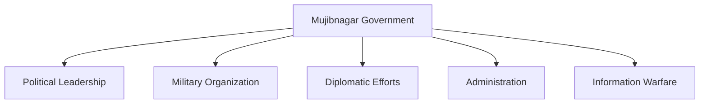
#### **c) Status as a Government-in-Exile**

A "government-in-exile" is a political group that claims to be a country's legitimate government but is unable to exercise legal power from its own territory and instead resides in a foreign country.

*   **Argument for being a Government-in-Exile:** The Mujibnagar Government fits this definition to a large extent. Its main administrative headquarters and the seat of its operations were in **Calcutta (now Kolkata), India**. From there, it directed the war, managed international relations, and coordinated with the Indian government. It did not have control over the nation's capital, Dhaka, for the duration of the war.
*   **Counter-argument/Nuance:** However, it was unique because it was formed on the sovereign soil of Bangladesh (at Mujibnagar). Furthermore, it exercised direct administrative control over significant "liberated zones" inside Bangladesh throughout the war.

**Conclusion**
While the Mujibnagar Government functionally operated as a **government-in-exile** with its primary base in Calcutta, its legitimacy was unquestionable. It was founded on a massive democratic mandate, was proclaimed and sworn in on Bangladesh's own territory, and controlled parts of the country. This unique combination of factors gave it a moral and political authority far greater than that of a typical government-in-exile, enabling it to successfully lead the nation to independence.

***

### **Answer to Question 2**

**Question:**
a) 'The Constitution is the supreme law of Bangladesh' - explain. (5 marks)
b) Describe the process of amending the constitution, citing the relevant article. (10 marks)
c) Discuss the process of removing a High Court judge according to the constitution. (5 marks)

**Introduction**

The Constitution of the People's Republic of Bangladesh, adopted on November 4, 1972, is the foundational legal document of the nation. It is a reflection of the democratic and egalitarian ideals of the Liberation War. It establishes the framework of the state, guarantees fundamental rights to citizens, and asserts its own supremacy over all other laws. This sacred document also contains provisions for its own amendment and for ensuring the independence and accountability of the judiciary.

#### **a) The Constitution as the Supreme Law**

The principle of constitutional supremacy is the bedrock of the rule of law in Bangladesh. This is explicitly stated in **Article 7(2)** of the Constitution, which declares:
*"This Constitution is, as the solemn expression of the will of the people, the supreme law of the Republic, and if any other law is inconsistent with this Constitution that other law shall, to the extent of the inconsistency, be void."*

**Explanation:**
1.  **Hierarchy of Laws:** This article establishes a clear hierarchy where the Constitution stands at the apex. All other laws passed by the Parliament, as well as any executive orders or rules, must conform to the provisions of the Constitution.
2.  **Power of Judicial Review:** The supremacy of the Constitution gives the Supreme Court the power of **judicial review**. This means the High Court Division and the Appellate Division can examine any law and declare it unconstitutional and void if it conflicts with the Constitution.
3.  **Source of All State Power:** All three organs of the state—the Legislature, the Executive, and the Judiciary—derive their existence and authority from the Constitution and are bound to act within the limits it prescribes.

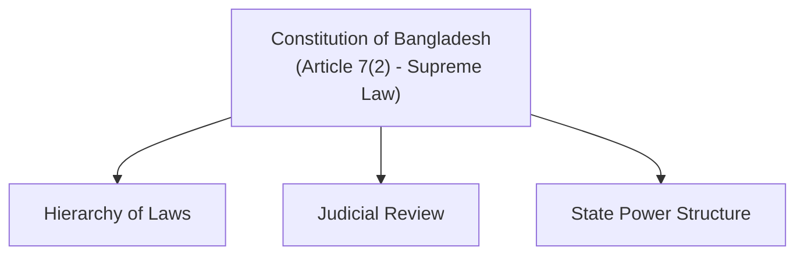
#### **b) The Process of Constitutional Amendment**

The procedure for amending the constitution is outlined in **Article 142**. It is a rigid process, requiring more than a simple majority to ensure that the fundamental law of the land is not changed lightly.

**The steps are as follows:**

1.  **Introduction of a Bill:** An amendment can only be initiated by introducing a bill in the Jatiya Sangsad (Parliament). The bill's long title must explicitly state that it seeks to amend a provision of the Constitution.
2.  **Special Majority for Passing:** For the bill to be passed, it must be supported by the votes of **not less than two-thirds (2/3)** of the total number of members of Parliament. This special majority makes the process significantly more difficult than passing ordinary legislation.
3.  **Presidential Assent:** After being passed by Parliament, the bill is presented to the President. The President must provide his assent within **seven days**. If he does not, the bill is automatically considered to have been assented to upon the expiry of the seven-day period.
4.  **Unamendable Provisions:** It is crucial to note that following the 15th Amendment, **Article 7B** was inserted, which makes certain basic provisions of the constitution (such as the Preamble, fundamental principles of state policy, fundamental rights, and provisions related to the basic structure) unamendable.

#### **c) The Process of Removing a High Court Judge

The process of removing a High Court judge is designed to protect judicial independence. Following a Supreme Court verdict that struck down the 16th Amendment, the current effective procedure is through the **Supreme Judicial Council (SJC)**, as outlined in **Article 96** of the Constitution.

**The process is as follows:**

1.  **Formation of the SJC:** The Supreme Judicial Council is composed of the **Chief Justice of Bangladesh and the next two senior-most judges** of the Appellate Division.
2.  **Initiation of Inquiry:** The SJC can launch an inquiry into allegations of "gross misconduct" or "physical or mental incapacity" against any Supreme Court judge (of either the High Court or Appellate Division). This inquiry can be initiated by the Council itself or upon a reference from the President.
3.  **Investigation and Hearing:** The Council conducts a thorough investigation. During this process, the accused judge is given the right to be heard and to present their defense.
4.  **Recommendation to the President:** If, after the inquiry, the SJC finds the judge guilty of misconduct or to be incapacitated, it will recommend to the President that the judge be removed from office.
5.  **Removal by the President:** Acting on the SJC's recommendation, the President will then issue an order removing the judge from their position.
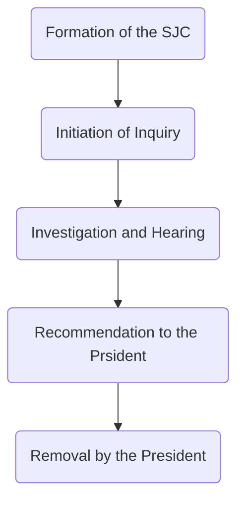
**Conclusion**

The Constitution of Bangladesh rightfully stands as the supreme law, ensuring that all state actions are grounded in legality and popular will. Its amendment process balances the need for evolution with the necessity of preserving its core principles. Similarly, the procedure for judicial removal, by placing the responsibility on the senior-most judges through the Supreme Judicial Council, safeguards the judiciary from political interference, thereby upholding the vital principle of judicial independence, which is essential for a functioning democracy.

***

### **Answer to Question 3**

**Question:**
a) Give a brief introduction to the small ethnic groups living in the plains of Bangladesh. (5 marks)
b) Present the cultural characteristics of the small ethnic groups of the Chittagong Hill Tracts. (10 marks)
c) Describe the lifestyle of either the Santal OR the Garo ethnic group. (5 marks)

**Introduction**

Bangladesh, while predominantly a Bengali nation, is a rich mosaic of cultures, languages, and traditions, significantly enhanced by its diverse indigenous communities. These ethnic groups, constitutionally recognized as "minor races, ethnic sects and communities," are broadly located in two main regions: the plains, particularly in the northern and north-central parts of the country, and the Chittagong Hill Tracts (CHT) in the southeast. Their unique customs and ways of life form an invaluable part of the nation's collective heritage.

#### **a) Ethnic Groups of the Plains**

The plains of Bangladesh are home to several ethnic communities, each with a distinct identity. The most prominent groups are:
*   **Santal:** They are the largest ethnic group in the plains, concentrated mainly in the northern districts of Rajshahi, Dinajpur, and Rangpur. They have their own language (Santali, with its Ol Chiki script) and a rich culture of music, dance, and festivals, with "Sohrai" being their most important celebration.
*   **Garo:** Primarily residing in the greater Mymensingh, Tangail, and Gazipur regions, the Garo are a matrilineal society, where lineage and inheritance are traced through the mother's line. Their most significant festival is the "Wangala," a harvest celebration.
*   **Hajong, Koch, and Rajbongshi:** These groups are also found in the Mymensingh and northern regions. They have their own distinct languages and cultural practices and have historically been involved in agriculture.
*   **Oraon and Munda:** Living in the northern and north-western parts of Bangladesh, these communities migrated from parts of India and have distinct languages and socio-cultural traditions.

#### **b) Cultural Characteristics of the Chittagong Hill Tracts (CHT) Ethnic Groups**

The Chittagong Hill Tracts are a culturally vibrant region, home to at least 11 different ethnic groups. While each group is unique, they share some common cultural characteristics rooted in their hilly environment.

1.  **Major Groups and Religion:** The largest groups are the **Chakma, Marma, and Tripura**. Other groups include the Tanchangya, Mro, Bawm, Lushai, Khiang, Khumi, Chak, and Pankhoa. Religiously, the CHT is diverse: the Chakma and Marma are predominantly Theravada Buddhists; the Tripura are mainly Hindus; and other groups like the Bawm and Lushai are largely Christians, while some still practice animism.
2.  **Livelihood and Economy:** The traditional method of cultivation is **Jhum** (slash-and-burn agriculture) on the hill slopes, which is deeply integrated with their cultural and social life. Many have also adopted horticulture, fruit gardening, and settled farming.
3.  **Social Structure:** Most communities are patriarchal and organized into clans. They have a strong traditional system of governance led by a village chief (*Karbari*) and a circle chief (*Raja*), which operates alongside the formal state administration.
4.  **Festivals:** The most important cultural event is the New Year festival, celebrated in mid-April. It is known as **Biju** among the Chakma, **Sangrai** among the Marma, and **Boisuk** among the Tripura (collectively known as **Boisabi**). The celebrations involve rituals like floating flowers in rivers, traditional games, and visiting relatives. Buddhists also celebrate religious festivals like *Kathin Chibar Dan* (offering of robes to monks).
5.  **Attire and Handicrafts:** The people of the CHT are known for their colorful, hand-woven textiles. Women traditionally wear distinctive garments like the *Pinon* and *Hadi* (Chakma) or *Thami* (Marma). They are skilled artisans, creating intricate crafts from bamboo and cane.

#### **c) Lifestyle of the Santal People**

The Santal people have a rich and distinct lifestyle that sets them apart.

*   **Social Structure:** They are a patrilineal society organized into distinct clans. The village is the central unit of their social life, governed by a village council headed by a *Majhi* (headman), who is respected as the community leader.
*   **Livelihood:** Traditionally, their livelihood is tied to agriculture. They work as farmers on their own small plots of land or as agricultural laborers. They have a deep, spiritual connection to the land and forests.
*   **Religion and Festivals:** The Santal religion is animistic, revolving around the worship of spirits and deities called *Bongas*, who are believed to reside in the hills, forests, and rivers. Their supreme deity is *Thakur Jiu* (the Sun God). Their most important festival is **Sohrai**, a five-day harvest festival celebrated with feasting, drinking rice beer (*Haria*), and performing traditional music and group dances, where men and women dance to the rhythm of instruments like the *Madal* (drum) and flute.
*   **Culture:** Santal culture is known for its collective spirit, reflected in their music, dance, and social gatherings. Their homes are often beautifully decorated with intricate paintings on the mud walls.

**Conclusion**

The indigenous communities of both the plains and the Chittagong Hill Tracts are integral to the identity of Bangladesh. Their diverse languages, unique social structures, vibrant festivals, and deep connection to nature represent a living heritage that enriches the entire nation. Protecting their rights, preserving their culture, and ensuring their socio-economic development is a constitutional obligation and a moral imperative for building a truly inclusive and pluralistic Bangladesh.

***

### **Answer to Question 4**

**Question:**
a) What is meant by archaeological artifacts/sites? (5 marks)
b) Give an introduction to Wari-Bateshwar. (5 marks)
c) 'Archaeological sites are an important element for attracting tourists' - explain. (10 marks)

**Introduction**

Archaeology is the window to our past, allowing us to understand the evolution of human civilization through its material remains. These remains—archaeological sites and artifacts—are tangible evidence of our history, culture, and heritage. In Bangladesh, discoveries like the ancient city of Wari-Bateshwar have not only deepened our understanding of our roots but also highlighted the immense potential of these historical treasures as key attractions for tourism, capable of driving economic growth and fostering national pride.

#### **a) What is Meant by Archaeological Artifacts/Sites?**

Archaeological artifacts and sites are the physical remains of past human life and activities, which have been preserved over time. They are the primary sources that archaeologists study to reconstruct history, especially for periods with no written records.

*   **Artifacts:** These are portable objects made, modified, or used by humans. Examples include pottery shards, stone tools, metal weapons, coins, jewelry, and sculptures.
*   **Sites:** These are locations where significant traces of past human activity are found. They can be ancient cities, villages, monasteries (viharas), temples, forts, burial grounds, or even places of production like kilns.

In essence, these are irreplaceable records of our collective past, providing invaluable insights into the economy, technology, social structure, and beliefs of our ancestors.

#### **b) Introduction to Wari-Bateshwar**

Wari-Bateshwar is one of the most significant archaeological discoveries in Bangladesh, fundamentally changing our understanding of early urbanization in the region.

*   **Location:** It is a site encompassing the twin villages of Wari and Bateshwar in the Narsingdi district of Bangladesh.
*   **Dating and Significance:** Archaeological evidence suggests that it was an ancient fortified urban center (a city-state or *janapada*) that flourished around **450 BCE**, during the pre-Mauryan era. This makes it one of the earliest cities discovered in Bangladesh, contemporaneous with other early cities of the Gangetic plains.
*   **Key Discoveries:** Excavations have revealed a fortified citadel protected by moats and ramparts. Important artifacts found include:
    *   **Punch-marked silver coins:** One of the earliest forms of currency in the Indian subcontinent.
    *   **Semi-precious stone beads:** Indicating a sophisticated craft industry and trade.
    *   **Northern Black Polished Ware (NBPW):** A type of luxury pottery that confirms trade links with northern India.
    *   Iron tools, weapons, and various pottery types.
Wari-Bateshwar provides conclusive evidence of a well-developed, literate, and commercially active urban civilization in ancient Bengal over 2,500 years ago.

#### **c) Explanation: 'Archaeological Sites are an Important Element for Attracting Tourists'**

Archaeological sites are a cornerstone of cultural and heritage tourism, a rapidly growing sector worldwide. Their importance as a tourist attraction can be explained through the following points:

1.  **Educational and Experiential Value:** Tourists are increasingly seeking authentic and educational experiences. Archaeological sites offer a direct, tangible connection to the past. Walking through the ruins of the **Paharpur Buddhist Vihara** or the ancient city of **Mahasthangarh** allows visitors to physically experience history in a way that books or museums cannot replicate.
2.  **Economic Growth and Employment:** Tourism centered around heritage sites generates significant economic benefits.
    *   **Direct Revenue:** Through entry fees, guide services, and souvenir sales.
    *   **Indirect Revenue:** It stimulates the local economy by creating demand for hotels, restaurants, transportation, and other services.
    *   **Job Creation:** It creates employment for local communities, from skilled jobs like archaeologists and curators to service jobs in the hospitality sector, thus helping to alleviate poverty.
3.  **Infrastructure Development:** To facilitate tourism, governments invest in developing infrastructure like roads, electricity, and communication networks around these sites. This development benefits the local population long-term.
4.  **National Pride and Global Branding:** Well-preserved sites, especially **UNESCO World Heritage Sites** like the **Mosque City of Bagerhat** and Paharpur, put Bangladesh on the global cultural map. They enhance the nation's brand image, attract international media attention, and foster a sense of national pride among domestic tourists.
5.  **Conservation and Preservation:** Tourism can create a strong incentive for the conservation of heritage sites. When local communities and governments see the economic value of these sites, they are more likely to invest in their protection and preservation for future generations.
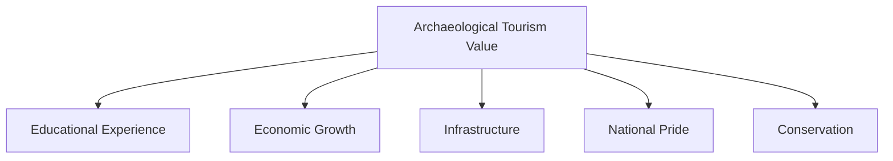
**Conclusion**

Archaeological sites like Wari-Bateshwar are far more than just relics of a bygone era; they are invaluable, non-renewable assets with immense potential. By developing and promoting them as tourist destinations, Bangladesh can not only generate substantial economic revenue and create jobs but also share its rich and ancient heritage with the world. Therefore, investing in the protection, research, and sustainable development of these sites is a crucial strategy for both preserving our past and building a prosperous future.
***

### **Answer to Question 5**

**Question:**
a) What is the 'Blue Economy'? (5 marks)
b) Discuss how the Blue Economy can contribute to the economy of Bangladesh. (10 marks)
c) Describe the initiatives taken by the Government of Bangladesh to harness marine resources. (5 marks)

**Introduction**

Following the successful and peaceful resolution of maritime boundary disputes with Myanmar (2012) and India (2014), Bangladesh gained sovereign rights over a vast expanse of the Bay of Bengal, totaling 118,813 square kilometers. This maritime territory has opened up a new frontier for national development known as the 'Blue Economy'. The Blue Economy represents a strategic shift towards the sustainable use of ocean resources for economic growth, improved livelihoods, and jobs while preserving the health of the ocean ecosystem. It holds immense potential to be a key driver of Bangladesh's future prosperity.

#### a) What is the 'Blue Economy'?

The 'Blue Economy' is a development concept that encourages the sustainable use of ocean resources for economic growth. It is not just about exploiting the sea but doing so in a way that is environmentally responsible and socially inclusive. The key principles are:

*   **Sustainability:** Ensuring that the exploitation of marine resources does not deplete them or harm the marine ecosystem, thus preserving them for future generations.
*   **Economic Growth:** Utilizing ocean-based resources to create new industries, jobs, and economic value.
*   **Inclusivity:** Ensuring that the benefits of the marine economy are shared equitably and contribute to the well-being of coastal communities.

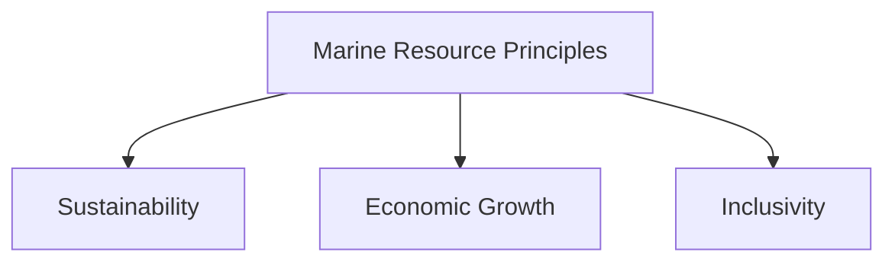
It encompasses a wide range of sectors, including fisheries, maritime transport, tourism, renewable energy, and marine biotechnology.

#### **b) Contribution of the Blue Economy to Bangladesh's Economy**

The Blue Economy has the potential to be a game-changer for Bangladesh, contributing significantly to its GDP, employment, and overall development.

1.  **Fisheries and Aquaculture:** The Bay of Bengal is rich in marine fish and other aquatic life.
    *   **Increased Fish Production:** Sustainable management of fisheries can significantly increase the fish catch, boosting food security and export earnings.
    *   **Mariculture:** There is vast potential for cultivating high-value species like sea bass, groupers, and seaweed, creating new industries and jobs.
2.  **Shipping and Port Development:** As a major trading nation, Bangladesh's economy relies heavily on its seaports.
    *   **Port Modernization:** Expanding the capacity of Chittagong and Mongla ports and developing new deep-sea ports (like Matarbari) will make Bangladesh a regional shipping and logistics hub.
    *   **Shipbuilding and Recycling:** Bangladesh's shipbuilding industry can be expanded to build larger ocean-going vessels. The ship recycling industry, if made environmentally compliant, can also be a major source of steel and employment.
3.  **Energy Resources:**
    *   **Oil and Gas Exploration:** The newly acquired maritime area holds significant potential for undiscovered hydrocarbon reserves. Successful exploration and extraction could drastically reduce Bangladesh's energy import dependency.
    *   **Renewable Energy:** The country can harness offshore wind energy and tidal/wave energy to generate clean electricity, diversifying its energy mix.
4.  **Marine Tourism:** Bangladesh has the world's longest natural sea beach at Cox's Bazar and unique ecosystems like the Sundarbans and St. Martin's Island. Developing eco-friendly and sustainable coastal and marine tourism can attract high-value international tourists and generate substantial revenue.
5.  **Biotechnology and Other Resources:** The ocean is a source of valuable genetic and biological resources for pharmaceuticals, chemicals, and other industries. Marine minerals, such as those found in sea sand and salt, also have commercial value.

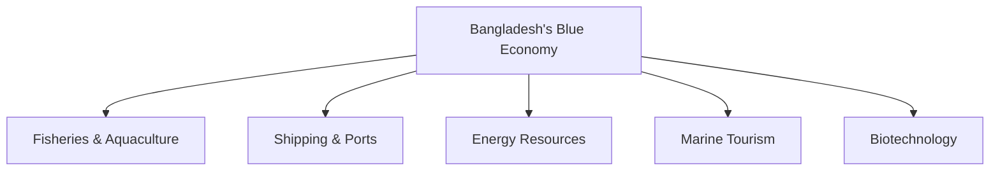
#### **c) Government Initiatives to Harness Marine Resources**

Recognizing this vast potential, the Government of Bangladesh has undertaken several key initiatives:

1.  **Policy and Institutional Framework:** The government has established a dedicated **Blue Economy Cell** under the Ministry of Power, Energy and Mineral Resources to coordinate the activities of different ministries and agencies. It is also in the process of formulating a comprehensive national ocean policy.
2.  **Resource Exploration and Survey:** Bangladesh has initiated hydrographic and seismic surveys in the Bay of Bengal to map the seabed and identify potential reserves of oil, gas, and other mineral resources. It has also sought international cooperation for conducting these surveys.
3.  **Fisheries Management:** The government has taken steps to curb illegal, unreported, and unregulated (IUU) fishing. This includes imposing seasonal fishing bans to allow fish stocks to replenish and promoting sustainable fishing practices.
4.  **Infrastructure Development:** The government is investing heavily in port infrastructure, most notably the **Matarbari Deep Sea Port**, which is being developed with Japanese assistance. This port will be able to accommodate large mother vessels, significantly boosting the country's trade capacity.
5.  **Human Resource Development:** The government has established the **Bangabandhu Sheikh Mujibur Rahman Maritime University** to create skilled manpower in various fields of marine science, engineering, and management.

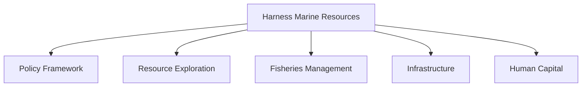
**Conclusion**

The Blue Economy represents a new horizon of opportunity for Bangladesh. It offers a pathway to diversify the economy, ensure energy security, create mass employment, and achieve sustainable development goals. The government has already laid the foundational groundwork through policy formulation and infrastructural investment. The key to success will be the effective, coordinated, and sustainable implementation of these initiatives, ensuring that the vast wealth of the Bay of Bengal is harnessed responsibly for the prosperity of all Bangladeshis.

***

### **Answer to Question 6**

**Question:**
a) What is a mega project? (5 marks)
b) Draw a picture of the future of Bangladesh's economic growth as a result of the implementation of the Padma Bridge project. (10 marks)
c) Give an introduction to the Dhaka Metro Rail project. (5 marks)

**Introduction**

In its quest to become a developed nation by 2041, Bangladesh has embarked on a series of transformative infrastructure ventures known as mega projects. These are large-scale, high-investment projects designed to overcome critical bottlenecks in the country's infrastructure and unlock its full economic potential. Among these, the Padma Multipurpose Bridge stands out as a symbol of national pride and an economic game-changer, while the Dhaka Metro Rail project represents a modern solution to the capital's chronic congestion, collectively heralding a new era of progress.

#### **a) What is a Mega Project?**

A mega project is a large-scale, complex venture that typically costs billions of dollars, takes many years to build, and involves multiple public and private stakeholders. Its defining characteristics are:

*   **High Capital Investment:** They require enormous financial resources, often involving international loans or significant government funding.
*   **Long Gestation Period:** The planning, development, and construction phases can span many years, sometimes a decade or more.
*   **Transformative Impact:** They are designed to bring about a significant, long-term positive impact on the economy, society, and environment, often transforming a region or an entire country.
*   **Complexity:** They are technically and logistically complex, often involving cutting-edge technology and engineering.

In Bangladesh, projects like the Padma Bridge, Rooppur Nuclear Power Plant, and Matarbari Deep Sea Port are prime examples of mega projects.

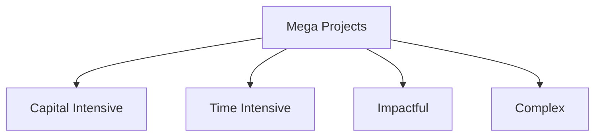
#### ~~**b) Future of Economic Growth from the Padma Bridge**~~

~~The implementation of the Padma Bridge has unleashed a wave of economic dynamism, painting a bright picture for the future growth of Bangladesh.~~

1.  ~~**GDP Growth and Regional Development:** The bridge directly connects the 21 districts of the south-western region with the economic hub of Dhaka. This integration is projected to boost the country's overall **GDP by 1.23%** and the regional GDP of the south-west by over 2% annually.~~
2.  ~~**Industrial and Agricultural Revolution:**~~
    *   ~~**Industrialization:** With fast and reliable connectivity, the south-west is becoming an attractive destination for industrial investment. New economic zones, high-tech parks, and manufacturing plants are being established, creating thousands of jobs.~~
    *   ~~**Agricultural Boost:** Farmers in the fertile south-west can now transport their perishable goods (like fish, vegetables, and flowers) to Dhaka and other markets quickly, reducing wastage and ensuring better prices. This will boost agricultural production and rural incomes.~~
3.  ~~**Trade and Connectivity Hub:** The bridge is a vital part of the **Asian Highway network**, enhancing regional and international trade by connecting Bangladesh with India, Nepal, and Bhutan. The Payra and Mongla seaports will become more vibrant as the bridge provides seamless connectivity for import and export cargo.~~
4.  ~~**Tourism and Real Estate Boom:** The travel time to key tourist spots like the Sundarbans and Kuakata has been reduced dramatically, boosting the tourism industry. The entire region is also witnessing a real estate boom, with land prices and development activities increasing significantly.~~
5.  ~~**Poverty Reduction:** By creating economic opportunities and jobs, the Padma Bridge will play a crucial role in alleviating poverty in the historically less developed south-western region, contributing to balanced national development.~~

~~In short, the Padma Bridge is not just a transport link; it is an economic corridor that will accelerate Bangladesh's journey towards becoming an upper-middle-income country.~~

#### ~~**c) Introduction to the Dhaka Metro Rail Project**~~

~~The Dhaka Metro Rail is a state-of-the-art Mass Rapid Transit (MRT) system designed to provide a modern, fast, and reliable public transport solution for the densely populated and chronically congested capital city, Dhaka.~~

*   ~~**Objective:** Its primary goal is to reduce the crippling traffic congestion that costs the city's economy an estimated $3 billion annually in lost productivity and wasted fuel.~~
*   ~~**Project Details:** The project is being implemented in several phases, consisting of multiple lines (MRT Line-1, 2, 4, 5, 6). The first phase of **MRT Line-6**, a 20.1 km elevated line connecting Uttara to Motijheel, has become partially operational.~~
*   ~~**Key Features:** It is an electric-powered, high-capacity system. The air-conditioned trains can carry a large number of passengers, drastically reducing travel time (e.g., from over two hours by road to under 40 minutes by metro from Uttara to Motijheel).~~
*   ~~**Implementing Agency:** The project is being implemented by the **Dhaka Mass Transit Company Limited (DMTCL)** under the Ministry of Road Transport and Bridges, with financial and technical assistance from the Japan International Cooperation Agency (JICA).~~

~~**Conclusion**~~

~~Mega projects like the Padma Bridge and the Dhaka Metro Rail are the physical manifestations of Bangladesh's developmental aspirations. The Padma Bridge has conquered a mighty river to unleash the economic potential of an entire region, while the Metro Rail is set to modernize urban life in the nation's capital. Together, these projects are creating a virtuous cycle of growth, investment, and improved quality of life, demonstrating that Bangladesh is not only planning for a prosperous future but is actively building it.~~
***

### **Answer to Question 7**

**Question:**
a) What is meant by agricultural research? (5 marks)
b) Determine the contribution of Bangladesh's agricultural research institutes in increasing food production. (10 marks)
c) Describe the role of the government in increasing Hilsa production. (5 marks)

**Introduction**

For a densely populated, agro-based country like Bangladesh, ensuring food security is a paramount national objective. Agricultural research forms the scientific backbone of this endeavor, driving the innovation necessary to increase productivity and overcome challenges. Institutions across the country have played a pivotal role in transforming Bangladesh from a food-deficit nation into one that is self-sufficient in food grains. A specific success story within this broader achievement is the remarkable recovery of the national fish, Hilsa, which showcases the positive impact of targeted government intervention.

#### **a) What is Meant by Agricultural Research?**

Agricultural research is a systematic process of scientific inquiry aimed at improving agricultural productivity, sustainability, and efficiency. It involves a wide range of activities, including:

*   **Crop Improvement:** Developing new, high-yielding, and resilient crop varieties through conventional breeding and modern biotechnology. This includes creating varieties that are resistant to pests, diseases, drought, and salinity.
*   **Soil and Water Management:** Researching methods to improve soil fertility, manage irrigation efficiently, and conserve water resources.
*   **Pest and Disease Management:** Developing environmentally friendly and effective methods to control pests and diseases that affect crops and livestock.
*   **Post-Harvest Technology:** Innovating techniques to reduce post-harvest losses, improve food processing, and add value to agricultural products.
*   **Livestock and Fisheries:** Researching animal breeding, nutrition, and disease control to improve livestock and fish production.
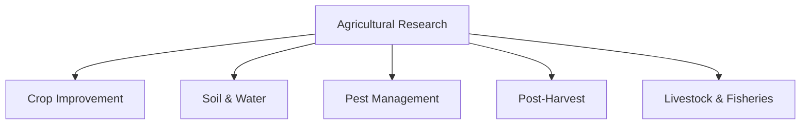
In essence, it is the application of scientific principles to solve practical problems in agriculture and increase food production sustainably.

#### **b) Contribution of Agricultural Research Institutes in Bangladesh**

Bangladesh's journey to food self-sufficiency would have been impossible without the groundbreaking work of its agricultural research institutes.

1.  **Bangladesh Agricultural Research Institute (BARI):** As the largest multi-crop research institute, BARI has developed hundreds of high-yielding varieties of wheat, maize, pulses, oilseeds, tubers, and vegetables. These varieties have significantly increased yields per unit of land. BARI has also developed climate-resilient varieties, such as drought-tolerant wheat and stress-tolerant vegetables.
2.  **Bangladesh Rice Research Institute (BRRI):** This institute is the primary reason for Bangladesh's "green revolution" in rice. BRRI has developed over 100 high-yielding rice varieties, including those suited for different ecological zones (e.g., flood-prone, saline, and drought-prone areas). Varieties like BRRI dhan-28, BRRI dhan-29, and recently developed zinc-enriched rice have revolutionized rice production and nutrition.
3.  **Bangladesh Institute of Nuclear Agriculture (BINA):** Using nuclear techniques like mutation breeding, BINA has developed improved varieties of rice, jute, pulses, and oilseeds that are early-maturing and high-yielding. BINA's innovations have been crucial in fitting more crops into the annual cultivation cycle.
4.  **Bangladesh Fisheries Research Institute (BFRI):** BFRI has played a vital role in increasing fish production by developing advanced techniques for aquaculture, including the induced breeding of native fish species like Pabda, Gulsha, and Tengra, which were once on the verge of extinction.
5.  **Bangladesh Livestock Research Institute (BLRI):** BLRI has contributed by developing improved breeds of poultry and cattle, better feed formulas, and vaccines for animal diseases, significantly boosting the country's meat, milk, and egg production.

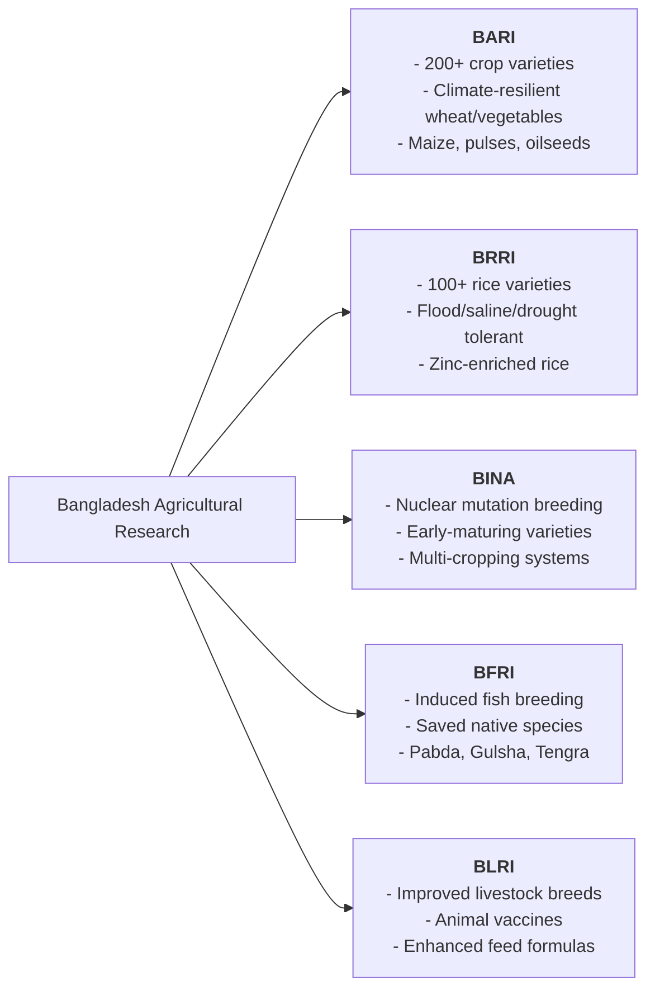

Collectively, these institutes have provided the technological backbone that has allowed Bangladesh's farmers to feed a growing population on shrinking arable land.

#### **c) Government's Role in Increasing Hilsa Production**

Hilsa, the national fish of Bangladesh, faced a severe decline in production due to overfishing and the destruction of its breeding grounds. The government implemented a comprehensive and highly successful conservation program.

1.  **Imposing Fishing Bans:** The government imposes an annual 22-day ban on catching, selling, and transporting Hilsa during its peak breeding season (usually in October) in major river sanctuaries. It also enforces a ban on catching juvenile Hilsa (known as *jatka*) for eight months (November to June).
2.  **Providing Incentives to Fishermen:** Recognizing the economic hardship faced by fishermen during the ban periods, the government provides them with special assistance. This includes distributing free rice (VGF cards) and providing alternative livelihood support to nearly half a million affected fishing families.
3.  **Strict Law Enforcement:** The Coast Guard, river police, and local administration conduct coordinated drives to enforce the fishing bans, seizing illegal nets and boats and penalizing violators. This strong enforcement has been key to the program's success, leading to a dramatic increase in Hilsa production in recent years.

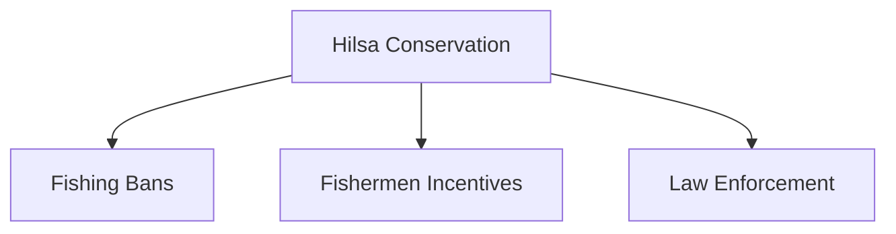

**Conclusion**

Agricultural research has been the engine of Bangladesh's food production success, with its research institutes consistently delivering innovations that empower farmers. The government's targeted and well-designed conservation strategy for Hilsa demonstrates how scientific knowledge, coupled with effective policy and social support, can achieve remarkable results. These combined efforts are fundamental to ensuring the nation's food security, protecting its natural heritage, and sustaining rural livelihoods.

***

### **Answer to Question 8**

**Question:**
a) What is meant by 'Demographic Dividend'? (5 marks)
b) Explain in detail what needs to be done to utilize Bangladesh's 'Demographic Dividend'. (10 marks)
c) Discuss the importance of technical and vocational education for skill development. (5 marks)

**Introduction**

The demographic dividend refers to a unique, time-bound "window of opportunity" for accelerated economic growth that can arise when a country's population structure changes. Bangladesh is currently in the midst of this favorable period, with a larger proportion of its population in the working-age group compared to the dependent population of children and the elderly. However, this dividend is not automatic; it is a potential that can only be realized through strategic and timely investments in human capital and job creation.

#### a) What is meant by 'Demographic Dividend'? (5 marks)

Based on the provided document, the 'demographic dividend' refers to the potential for economic growth that a country can achieve by utilizing its large population of working-age people. The text does not provide a formal definition but explains the concept through Bangladesh's specific situation.

Key points from the text that explain this concept are:

1.  **Large Working-Age Population:** The document states, "Currently, Bangladesh has a large number of working-age people." This large workforce is the foundation of the demographic dividend.
2.  **Economically Viable Workforce:** It specifies the size of this group, noting that according to the 2023 labor force survey, "the economically viable workforce above the age of 15 years is 7.3 crore."
3.  **Utilisation for Economic Gain:** The core of the concept is the active use of this workforce. The text highlights that "Bangladesh is implementing different types of development programmes to accumulate demographic dividend by utilising the huge number of working age people."
4.  **Connection to Human Resource Development:** Achieving this dividend is not automatic. It requires investment in people. The text links it to programmes that "continually improve human resources by enhancing the living standards of underprivileged and poor people," which in turn strengthens the workforce and allows the country to capitalize on its demographic advantage.

In summary, the demographic dividend is the economic benefit derived from having a proportionally large working-age population, which is being actively harnessed through development and human resource improvement programs.
#### **b) What Needs to be Done to Utilize the 'Demographic Dividend'**

To transform Bangladesh's demographic potential into a tangible economic reality, a multi-pronged policy approach is essential.

1.  **Investment in Quality Education and Skill Development:** The large youth population must be equipped with the right skills for the modern economy. This requires shifting from rote learning to a system that fosters critical thinking, problem-solving, and creativity. A special emphasis on science, technology, engineering, and mathematics (STEM) and technical/vocational education is crucial.
2.  **Creation of Quality Jobs:** Education is meaningless without employment opportunities. The government must create an investment-friendly climate to encourage private sector growth and industrialization. Promoting labor-intensive sectors like manufacturing, construction, and services is vital to absorb the millions entering the workforce each year.
3.  **Ensuring Good Health and Nutrition:** A healthy workforce is a productive workforce. Public investment in affordable and quality healthcare, sanitation, and nutrition programs is necessary to ensure that the working-age population is physically and mentally fit to contribute to the economy.
4.  **Promoting Female Labor Force Participation:** A significant portion of the potential workforce—women—remains underutilized. Creating a safe and enabling environment for women to work, ensuring equal pay, and providing support services like childcare can unlock this huge potential and double the dividend's impact.
5.  **Good Governance and Infrastructure:** A stable political environment, rule of law, and efficient infrastructure (power, transport, digital connectivity) are fundamental preconditions. These factors attract the domestic and foreign investment needed to create jobs and drive economic growth.

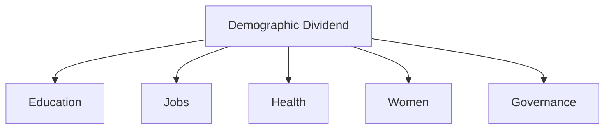
Based on the provided text from the "Bangladesh Economic Review 2024," here are the answers to your questions.

***

#### c) Discuss the importance of technical and vocational education for skill development. (5 marks)

According to the provided text, technical and vocational education is of paramount importance for skill development in Bangladesh, serving as a primary strategy for national economic progress and adapting to global changes. The document highlights its importance in several ways:

1.  **Creating a Skilled Workforce:** The text explicitly states that "Technical and Vocational Education and Training (TVET) is the key element to transform the large population into a skilled workforce for sustainable economic development and growth." This positions TVET as a cornerstone of the country's economic strategy.
2.  **Addressing Modern Challenges:** Its importance is framed as a direct response to contemporary economic shifts. The text notes that to "face the challenges of the Fourth Industrial Revolution, emphasis has also been placed on technical education to develop skilled manpower." It is also designed to address the "evolving labour market."
3.  **Meeting Future and Global Demand:** TVET is forward-looking and practical. It is "designed to address the future demand for job types and the global employment market by shifting the focus from conventional learning to activity-oriented education." This practical, activity-based approach is crucial for developing tangible skills.
4.  **Government Priority and Policy:** The significance of TVET is underscored by the government's formal policies and actions, including the 'TVET Development Action Plan-2020' and the 'Bangladesh National Qualifications Framework (BNQF)'. Furthermore, stipends are provided to attract students, indicating a concerted effort to boost enrollment in this sector.
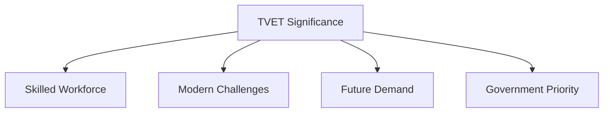
In essence, the document presents technical and vocational education as the critical pathway to developing a skilled, adaptable, and economically productive workforce, which is essential for Bangladesh to navigate the Fourth Industrial Revolution and achieve sustainable growth.

***

### **Answer to Question 9**

**Question:**
a) What is meant by intellectual property? (5 marks)
b) What are the main types of intellectual property? Give an introduction with examples. (5 marks)
c) Describe the role of the Bangladesh government in managing intellectual property. (10 marks)

**Introduction**

In the contemporary global economy, which is increasingly driven by knowledge and innovation, intellectual property (IP) has become one of a nation's most valuable assets. IP refers to creations of the mind—inventions, artistic works, symbols, and designs—that are protected by law, allowing the creator to earn recognition or financial benefit from their work. For a developing country like Bangladesh, the effective management and protection of intellectual property are crucial for fostering creativity, attracting investment, and preserving its unique cultural heritage.

#### **a) What is Meant by Intellectual Property?**

Intellectual Property (IP) refers to intangible creations of the human intellect. Unlike physical property like land or goods, IP is a set of exclusive rights granted to the owner or creator of an original work or invention. These legal rights prevent others from using, copying, or profiting from the creation without the owner's permission for a certain period. The fundamental purpose of IP law is to encourage innovation and creativity by ensuring that creators can reap the benefits of their efforts.

#### **b) Main Types of Intellectual Property**

There are several main types of intellectual property, each protecting a different kind of creation:

1.  **Copyright:** Protects original works of authorship. This includes literary works (books, poems), artistic works (paintings, music, films), computer software, and architectural designs. **Example:** The lyrics and music of a song by a Bangladeshi artist.
2.  **Patent:** Grants exclusive rights for an invention, which can be a product or a process that provides a new way of doing something or offers a new technical solution to a problem. **Example:** A new, more efficient process for manufacturing jute-based bioplastics.
3.  **Trademark:** A sign, symbol, logo, or name capable of distinguishing the goods or services of one enterprise from those of other enterprises. **Example:** The brand name and logo of a company like "Pran" or "Square."
4.  **Geographical Indication (GI):** A sign used on products that have a specific geographical origin and possess qualities or a reputation that are due to that origin. **Example:** The **Jamdani Saree** from Bangladesh, which is renowned for its unique weaving technique originating from the Dhaka region.
5.  **Industrial Design:** Protects the ornamental or aesthetic aspect of an article. The design may consist of three-dimensional features, such as the shape of an article, or two-dimensional features, such as patterns or lines. **Example:** The unique shape of a soft drink bottle.

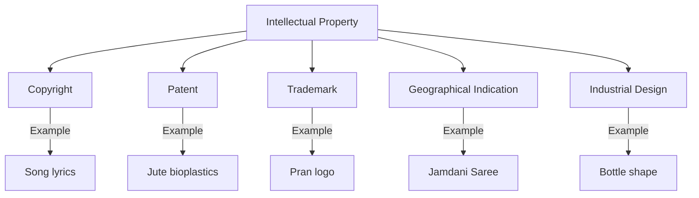
#### **c) Role of the Bangladesh Government in Managing IP**

The Government of Bangladesh has taken several important steps to manage and protect intellectual property rights.

1.  **Establishing a Legal Framework:** The government has enacted specific laws to protect different types of IP, including the Copyright Act, 2000 (with recent amendments); the Patents and Designs Act, 1911; the Trademarks Act, 2009; and the Geographical Indications of Goods (Registration and Protection) Act, 2013.
2.  **Creating Institutional Bodies:** It has established dedicated government agencies to administer these laws:
    *   The **Department of Patents, Designs and Trademarks (DPDT)** is responsible for registering patents, industrial designs, and trademarks.
    *   The **Copyright Office of Bangladesh** is responsible for the registration of creative works.
3.  **Promoting and Protecting Geographical Indications (GI):** This has been a notable recent success. The government, through the DPDT, has actively registered several iconic Bangladeshi products as GI products. This includes **Jamdani Saree, Hilsa fish, Khirsapat Mango,** and various traditional sweets. This legal recognition helps protect the authenticity of these products, prevents misappropriation, and enhances their brand value in international markets.
4.  **Enforcement and International Cooperation:** The government works to enforce IP laws through the judiciary and law enforcement agencies to combat piracy and infringement. Bangladesh is also a member of the **World Intellectual Property Organization (WIPO)** and a signatory to several international IP treaties, aligning its legal framework with global standards.
5.  **Raising Awareness:** Government agencies conduct seminars, workshops, and campaigns to raise awareness among creators, entrepreneurs, and the general public about the importance of intellectual property and how to protect it.

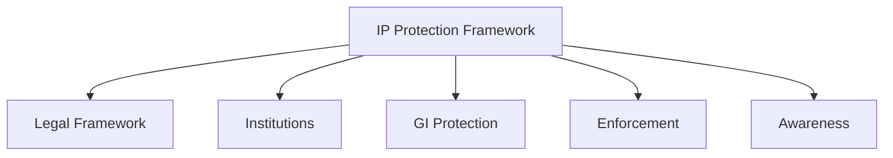
**Conclusion**

The Government of Bangladesh has established a solid legal and institutional framework for the management of intellectual property. By enacting laws, setting up administrative bodies, and actively protecting its cultural and geographical heritage through GI certification, it is fostering an environment conducive to innovation and creativity. While challenges in enforcement and public awareness remain, these efforts are crucial steps towards leveraging intellectual property as a key driver of economic growth and national branding in the global marketplace.

***

### **Answer to Question 10**

**Question:** Write short notes on (any four): (Marks: 4 x 5 = 20)
a) The 7th March Speech
b) Bangla Academy
c) Liberation War Museum
d) Mangal Shobhajatra
e) Baul Sangeet
f) Vision 2041

---

#### ~~**a) The 7th March Speech**~~

~~The 7th March Speech is the historic address delivered by the Father of the Nation, Bangabandhu Sheikh Mujibur Rahman, on March 7, 1971, at the Ramna Race Course (now Suhrawardy Udyan) in Dhaka. Delivered at a critical juncture when the Pakistani military junta refused to hand over power after the Awami League's landslide victory in the 1970 election, this 19-minute extempore speech was a de facto declaration of independence.~~

~~In his speech, Bangabandhu outlined the history of Bengali deprivation and called for a non-cooperation movement. He masterfully laid out the future course of action, instructing people to turn every house into a fortress. He concluded with the thunderous, iconic call: **"Ebarer sangram amader muktir sangram, ebarer sangram shadhinotar sangram"** (The struggle this time is for our emancipation, the struggle this time is for our independence). In 2017, **UNESCO** recognized this powerful speech as a part of the **Memory of the World Register**, acknowledging its immense historical significance as a document of human heritage. It remains a timeless source of inspiration for freedom-loving people worldwide.~~

---

#### **b) Bangla Academy**

Bangla Academy is the national institution of Bangladesh responsible for the research, development, promotion, and preservation of the Bengali language, literature, and culture. It was established on December 3, 1955, born out of the spirit of the Language Movement of 1952. Its founding was a direct result of the Bengali people's demand for an institution to nurture their mother tongue.

Located at the historic Burdwan House in Dhaka, the Academy's functions are multi-faceted. It conducts research, publishes books and dictionaries, translates world literature into Bengali, and confers prestigious literary awards, with the **"Bangla Academy Literary Award"** being the most prominent. Its most famous public event is the month-long **Ekushey Book Fair**, a national cultural festival held every February on its premises to commemorate the martyrs of the Language Movement. As the foremost authority on the Bengali language, Bangla Academy plays a pivotal role in safeguarding the linguistic and cultural identity of the nation.

---

#### **c) Liberation War Museum**

The Liberation War Museum (Mukti Juddha Jadughar) is a museum in Dhaka dedicated to preserving and displaying the history of the Bangladesh Liberation War of 1971. It was established in 1996 through a private initiative of eight trustees, driven by a desire to ensure that future generations would know the true history of the nation's birth.

The museum houses a vast collection of artifacts, documents, photographs, and personal belongings from the period of the war. Its galleries are arranged chronologically, taking visitors on a moving journey from the background of the struggle to the brutal genocide, the armed resistance by the Mukti Bahini, the role of international support, and the final victory. The museum is not just a repository of objects; it is an active center for education and research. Through its outreach programs, oral history projects, and mobile museum, it plays a vital role in disseminating the spirit of the Liberation War and commemorating the sacrifice of millions. Its new, modern premises in Agargaon have further enhanced its capacity to serve as the nation's conscience.

---

#### **d) Mangal Shobhajatra**

Mangal Shobhajatra (Procession of Well-being) is a vibrant and colorful mass procession that takes place at dawn on the first day of the Bengali New Year, Pahela Baishakh, in Bangladesh. It was first organized in 1989 by the students and teachers of the Faculty of Fine Arts, University of Dhaka, as a way to unite people and stand against the then-autocratic rule, promoting democracy and a spirit of non-communal harmony.

The procession features giant, colorful replicas of animals (like elephants, tigers, and birds), masks, and other motifs representing different aspects of Bengali culture and folklore. The themes of the procession often carry a message of unity, peace, and the triumph of good over evil. It has become an iconic element of the Pahela Baishakh celebrations, symbolizing the secular, inclusive, and folk traditions of Bengali culture. In 2016, **UNESCO** inscribed the **Mangal Shobhajatra** on its **Representative List of the Intangible Cultural Heritage of Humanity**, recognizing it as a unique cultural expression that promotes solidarity and democracy.

---

#### **e) Baul Sangeet**

Baul Sangeet (Baul music) is a form of mystical folk song and a spiritual tradition unique to the Bengal region, particularly Bangladesh. The Bauls are a group of mystic minstrels whose philosophy is a syncretic blend of Sufism, Vaishnavism, and Sahajiya Buddhism. Their music is not for entertainment alone; it is a form of spiritual practice (*sadhana*) aimed at finding the divine presence, the "Moner Manush" (the Man of the Heart), within oneself.

Baul songs are characterized by their simple yet profound lyrics that question social conventions, religious orthodoxy, and the caste system. They are typically performed with traditional instruments like the *Ektara* (a one-stringed instrument), *Dotara*, and *Dugi* (a small drum). The most revered figure in the Baul tradition is **Fakir Lalon Shah**, whose songs form the core of Baul music. In 2005, **UNESCO** recognized the unique value of this tradition by proclaiming the **Baul Songs** as a **Masterpiece of the Oral and Intangible Heritage of Humanity**.

---

#### ~~**f) Vision 2041**~~

~~Vision 2041 is the long-term perspective plan of the Government of Bangladesh that outlines the pathway to transform the country into a developed, prosperous, and high-income nation by the year 2041, which will mark the 70th anniversary of its independence. It is the successor to the "Vision 2021" plan, which aimed to turn Bangladesh into a middle-income country.~~

~~The core objectives of Vision 2041 are two-fold. The first is to completely eliminate extreme poverty and reach the status of an upper-middle-income country by 2031. The second, and ultimate, goal is to become a developed nation with a per capita income of over $12,500, a highly educated and skilled population, and a high quality of life for all citizens by 2041. The strategy to achieve this vision focuses on strengthening good governance, promoting industrialization and exports, investing heavily in infrastructure (e.g., mega projects), developing human capital through modern education, and ensuring sustainable and climate-resilient development. Vision 2041 serves as the guiding framework for all of the country's short and medium-term development plans.~~