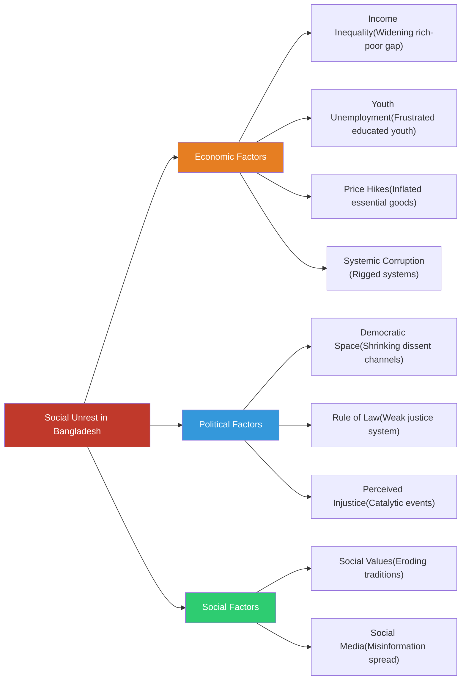
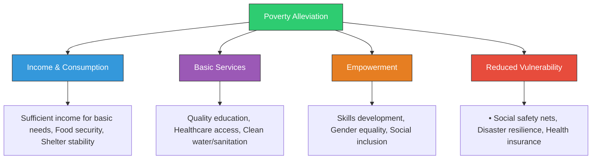
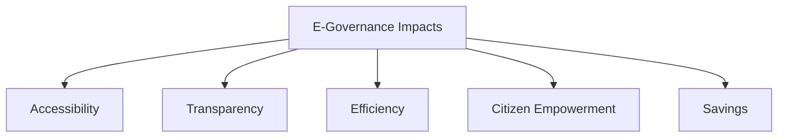

Based on the provided question paper (Question 1), here are concise discussions for each term, suitable for 5-mark answers:

<h2>Short Note</h2>

### (a) Digital Bangladesh

Digital Bangladesh is a transformative vision launched by the Government of Bangladesh aiming to leverage information and communication technology (ICT) for socio-economic development by 2021. Its core objectives include establishing a digital government for transparent service delivery (e.g., online portals, e-filing), building nationwide ICT infrastructure (high-speed internet, digital centers), empowering citizens through digital literacy, and fostering a knowledge-based economy. Key initiatives like the "a2i Programme" have digitized essential services (land records, education, healthcare), significantly improving accessibility and reducing corruption. While progress is evident in mobile penetration and IT exports, challenges like the digital divide and cybersecurity remain.

### (b) Income Tax

Income Tax is a direct tax levied by the Government of Bangladesh on the annual income earned by individuals and entities (companies, firms) within the country, governed primarily by the Income Tax Ordinance, 1984. It is a crucial source of government revenue, funding public services and development projects. Tax rates are progressive for individuals (higher income = higher tax rate) and flat/corporate for businesses. The National Board of Revenue (NBR) administers collection, promoting e-filing for efficiency. Challenges include a narrow tax base, tax evasion, and complexities in the tax structure, hindering optimal revenue generation despite efforts to improve compliance.

### (c) Dhaka Elevated Expressway
 
The Dhaka Elevated Expressway is a major infrastructure project aimed at alleviating Dhaka's chronic traffic congestion. This 19.73 km tolled expressway runs from the airport area (Kawla) to Kutubkhali Point (Dhaka-Chattogram Highway), primarily elevated above existing roads. Phase 1 (Airport to Farmgate) opened in September 2023. It drastically reduces travel time across the city, improves connectivity to key areas (airport, business districts, port), boosts economic activity, and reduces vehicle emissions by minimizing idling. Its completion marks a significant step in modernizing Dhaka's transport network.

### (d) Women Empowerment

Women Empowerment refers to the process of enhancing women's capacity to make life choices, exercise their rights, access resources, and control their own lives. In Bangladesh, it involves ensuring equal opportunities in education, healthcare, economic participation (microcredit, entrepreneurship), political representation (reserved seats), and legal protection against violence and discrimination. Government policies, NGO initiatives (like BRAC), and constitutional guarantees drive progress. Empowerment leads to poverty reduction, improved family health/education, and overall economic growth. However, challenges like gender-based violence, wage gaps, and underrepresentation in leadership persist.

### (e) Geographical Indication (GI)

Geographical Indication (GI) is an intellectual property right identifying a product as originating from a specific geographical location, where its quality, reputation, or characteristics are essentially attributable to that origin. It protects unique local products from imitation and helps producers command premium prices. In Bangladesh, products like Jamdani Saree, Hilsa Fish (from Padma, Meghna, Jamuna rivers), and Khirsapat Mango have received GI tags. This boosts rural economies, preserves cultural heritage, promotes exports, and ensures product authenticity for consumers. The Department of Patents, Designs and Trademarks (DPDT) administers GI registration.

***

<h2>20 Marks Question</h2>

***
Of course. Here are detailed answers to questions 2 and 3, structured to meet the requirements of a 20-mark question.

***

### **Answer to Question 2**

**Question:** What is the difference between the independence struggle (স্বাধীনতা সংগ্রাম) and the liberation war (মুক্তিযুদ্ধ)? Discuss the phases of Bangladesh's independence struggle from 1947 to 1971. (Marks: 20)

**Answer:**

The terms "Independence Struggle" and "Liberation War" are related but distinct concepts in the history of Bangladesh. The Independence Struggle refers to the long, multifaceted movement for rights and autonomy, while the Liberation War was its final, armed culmination.

#### **Difference between Independence Struggle and Liberation War**

#### **Phases of the Independence Struggle (1947-1971)**

The 24-year struggle for Bangladesh's independence was not a single event but a series of interconnected movements that progressively strengthened the demand for self-rule. The key phases are:

**1. The Language Movement (1948-1952):**
This was the first major assertion of Bengali identity. After Pakistan's creation in 1947, the central government in West Pakistan declared Urdu as the sole state language, ignoring the Bengali-speaking majority in East Pakistan. This sparked widespread protests. The movement reached its peak on **February 21, 1952**, when police opened fire on protesting students in Dhaka, killing several. This event solidified Bengali nationalism and is now celebrated as International Mother Language Day. It was the first sign that East Pakistan would not accept cultural subjugation.

**2. The 1954 Provincial Election and the United Front (যুক্তফ্রন্ট):**
The growing discontent was channeled into politics. A coalition of opposition parties, the "United Front," led by A. K. Fazlul Huq, H. S. Suhrawardy, and Maulana Bhasani, contested the 1954 provincial election. They campaigned on a 21-point manifesto demanding regional autonomy. The United Front won a landslide victory, decimating the ruling Muslim League. However, the central government dismissed the elected government within months on flimsy pretexts, further alienating the Bengali populace.

**3. The Six-Point Movement (ছয় দফা আন্দোলন) of 1966:**
This was the political turning point. In 1966, Sheikh Mujibur Rahman, the leader of the Awami League, announced a **Six-Point Program**, which was hailed as the "charter of survival" for the Bengalis. The six points demanded:
*   A federal parliamentary system.
*   Central government control over only defense and foreign affairs.
*   Separate currencies or fiscal policies for the two wings.
*   Taxation rights for the federating units.
*   Separate foreign trade accounts.
*   The right to maintain a paramilitary force.
Essentially, it was a constitutional blueprint for radical autonomy. The Pakistani regime viewed it as a secessionist plan and arrested Sheikh Mujib.

**4. The 1969 Mass Uprising (উনসত্তরের গণঅভ্যুত্থান):**
The Pakistani government filed the **Agartala Conspiracy Case** in 1968, accusing Sheikh Mujib and others of conspiring with India to secede. This act backfired, leading to a massive popular uprising in 1969. The movement, spearheaded by students with their 11-point program, forced President Ayub Khan to withdraw the case, release Sheikh Mujib, and ultimately resign from power. This uprising demonstrated the unshakeable support for Sheikh Mujib and the demand for self-rule.

**5. The 1970 General Election:**
Held in December 1970, this was the first general election in Pakistan's history. The Awami League, under Sheikh Mujib's leadership, won a historic and absolute majority, securing 167 out of 169 seats in East Pakistan and a clear majority in the National Assembly of Pakistan. This gave them the democratic mandate to form the government and frame a new constitution based on the Six-Point Program.

**6. The Non-Cooperation Movement and March 7th Speech (1971):**
The Pakistani military junta and West Pakistani politicians, led by Zulfikar Ali Bhutto, refused to honor the election results and hand over power. In response, Sheikh Mujib called for a non-cooperation movement in March 1971. On **March 7, 1971**, he delivered his historic speech at the Ramna Race Course, where he declared, **"The struggle this time is for our emancipation! The struggle this time is for our independence!"** This speech was a de facto declaration of independence and laid out the final plan for the liberation struggle.

This final political phase ended on the night of March 25, 1971, when the Pakistani military launched **"Operation Searchlight,"** a brutal genocide against the Bengali people, which marked the beginning of the nine-month armed Liberation War.

***

### **Answer to Question 3**

**Question:** What do you know about the preamble of the constitution and its importance? Discuss the changes brought by the 15th Amendment to the Constitution of Bangladesh, including their impact. (Marks: 20)

**Answer:**

The Preamble to the Constitution of the People's Republic of Bangladesh is the introductory statement that reflects the philosophy, spirit, and guiding principles of the entire document. It is considered the "mirror" of the constitution.

#### **The Preamble and its Importance**

The Preamble begins with "Bismillah-Ar-Rahman-Ar-Rahim" (In the name of Allah, the Beneficent, the Merciful) and solemnly declares that the people of Bangladesh have proclaimed independence and established a sovereign republic through a "historic struggle for national liberation."

**Key contents of the Preamble:**
1.  **Source of Power:** It affirms that all powers in the Republic belong to the people.
2.  **Fundamental Principles:** It pledges that the fundamental principles of the state shall be Nationalism, Socialism, Democracy, and Secularism (as originally stated in 1972 and restored by the 15th Amendment).
3.  **Aims of the State:** It outlines the primary objectives of the state, which are to create an exploitation-free society and to secure for all citizens:
    *   The rule of law.
    *   Fundamental human rights and freedoms.
    *   Equality and justice—political, economic, and social.

**Importance of the Preamble:**
*   **Interpretive Guide:** While not directly enforceable in a court of law, the Preamble serves as a crucial tool for interpreting ambiguous provisions of the constitution. The judiciary refers to it to understand the original intent of the framers.
*   **Ideological Foundation:** It encapsulates the core values and aspirations that fueled the Liberation War and led to the birth of Bangladesh. It provides the moral and political compass for the nation.
*   **Source of Legitimacy:** It grounds the constitution in the democratic will and historic struggle of the people, giving it ultimate legitimacy.

---

#### ~~**The 15th Amendment (2011) and its Impact**~~

~~The 15th Amendment, passed in 2011, is one of the most significant and transformative amendments to the Constitution of Bangladesh. It was enacted primarily to align the constitution with a Supreme Court verdict that declared the 5th and 7th amendments (which had incorporated military proclamations) illegal.~~

~~**Major Changes brought by the 15th Amendment:**~~

1.  ~~**Restoration of the Four Fundamental State Principles:** The amendment restored the original four principles of the 1972 Constitution: **Nationalism, Socialism, Democracy, and Secularism**. This reversed the changes made by previous military regimes, which had replaced Secularism with "absolute trust and faith in Almighty Allah."~~

2.  ~~**Abolition of the Non-Partisan Caretaker Government System:** This is arguably the most impactful change. The system of a neutral, non-partisan caretaker government to oversee national elections (introduced by the 13th Amendment) was abolished. The amendment stipulated that elections would now be held under the incumbent government.~~

3.  ~~**Strengthening Constitutional Supremacy:** A new Article 7A was inserted, which declares any unconstitutional takeover of power (such as a military coup) to be an act of sedition and a capital offense. This was done to prevent extra-constitutional forces from subverting democracy in the future.~~

4.  ~~**Recognition of the Father of the Nation:** Sheikh Mujibur Rahman was formally recognized in the constitution as the Father of the Nation.~~

5.  ~~**Incorporation of Historical Documents:** The Proclamation of Independence and Sheikh Mujibur Rahman's historic 7th March Speech were incorporated as schedules into the constitution.~~

6.  ~~**Recognition of Ethnic Minorities:** The constitution now recognizes the culture and heritage of "tribes, minor races, ethnic sects and communities" and calls for their preservation and development.~~

7.  ~~**Increased Reserved Seats for Women:** The number of reserved seats for women in the Parliament was increased to 50, and the provision was extended for 25 years.~~

~~**Impact of the 15th Amendment:**~~

~~The 15th Amendment has had a profound and controversial impact on Bangladesh's political landscape.~~

*   ~~**Positive Impact:**~~
    *   ~~The restoration of secularism and other original principles was widely praised as a return to the foundational spirit of the Liberation War.~~
    *   ~~The inclusion of Article 7A was seen as a bold step to safeguard constitutional continuity and deter future military interventions.~~
    *   ~~The formal recognition of historical documents and the Father of the Nation provided constitutional sanctity to the nation's history.~~

*   ~~**Negative and Controversial Impact:**~~
    *   ~~**The abolition of the caretaker government system created a deep political crisis.** The main opposition party, the Bangladesh Nationalist Party (BNP), and its allies have since refused to participate in general elections, arguing that free and fair polls are impossible under a partisan government.~~
    *   ~~This has led to severe political polarization, electoral boycotts (most notably in the 2014 general election), and a weakening of democratic institutions and accountability. The lack of a credible opposition in parliament has raised concerns about the health of Bangladesh's democracy.~~
    *   ~~The change has entrenched a "winner-takes-all" political culture, where the ruling party has complete control over the election-time administration, creating a significant trust deficit among political actors and the electorate.~~

***

### **Answer to Question 4**

**Question:** What is meant by foreign policy? Discuss the principles, objectives, weaknesses, and limitations of Bangladesh's foreign policy. (Marks: 20)

**Introduction**

Foreign policy is the set of strategies a state uses to guide its interactions with other countries and international bodies to protect and promote its national interests. For Bangladesh, a nation born from a liberation struggle, its foreign policy is deeply rooted in the principles of peace, cooperation, and sovereign equality. Articulated by the Father of the Nation, Sheikh Mujibur Rahman, the guiding principle of "Friendship to all, malice towards none" continues to be the cornerstone of its diplomatic conduct, though it faces numerous geopolitical and economic challenges.

#### **Defining Foreign Policy**

Foreign policy refers to the general objectives and strategies that guide the activities and relationships of one state in its interactions with other states. It is shaped by a nation's history, geography, economic needs, security concerns, and ideological values. Its primary goal is to safeguard national sovereignty, enhance economic prosperity, and project a positive image on the global stage.

#### **Principles and Objectives of Bangladesh's Foreign Policy**

The foreign policy of Bangladesh is enshrined in Article 25 of its constitution.

**Core Principles (মূলনীতি):**
1.  **Sovereign Equality:** Respect for the national sovereignty and equality of all states.
2.  **Non-interference:** Adherence to the principle of not interfering in the internal affairs of other countries.
3.  **Peaceful Settlement of Disputes:** A commitment to resolving international disputes through negotiation and peaceful means.
4.  **Respect for International Law:** Upholding international law and the principles enunciated in the United Nations Charter.
5.  **Anti-Imperialism and Colonialism:** Supporting oppressed peoples worldwide in their struggles against imperialism, colonialism, and racism.

**Key Objectives (উদ্দেশ্য):**
1.  **Protecting Sovereignty:** The foremost objective is to preserve the country's independence and territorial integrity.
2.  **Economic Development:** Promoting trade, attracting foreign direct investment (FDI), securing development aid, and ensuring market access for its exports, particularly ready-made garments (RMG).
3.  **Regional Cooperation:** Fostering close ties with neighboring countries and strengthening regional platforms like SAARC and BIMSTEC.
4.  **Global Peacekeeping:** Actively participating in UN Peacekeeping Operations, which enhances the nation's international prestige and contributes to global peace.
5.  **Managing Bilateral Relations:** Maintaining balanced and constructive relationships with major powers like India, China, the USA, and Russia.

#### **Weaknesses and Limitations (দুর্বলতা এবং সীমাবদ্ধতা)**

Despite its noble principles, Bangladesh's foreign policy operates under several significant constraints.

1.  **Geopolitical Location:** Bangladesh is geographically surrounded by India on three sides, creating a heavy dependence on its large neighbor for transit, trade, and water resources. This "India-locked" position often limits its diplomatic maneuvering space.
2.  **Economic Dependency:** The economy is heavily reliant on RMG exports and remittances from overseas workers, making it vulnerable to global market fluctuations and the foreign policies of host countries.
3.  **Rohingya Refugee Crisis:** Hosting over a million Rohingya refugees has placed an immense strain on Bangladesh's economy, society, and environment. The failure to repatriate them has become a major foreign policy challenge, testing its diplomatic capabilities.
4.  **Resource Constraints:** As a developing country, Bangladesh has limited financial and institutional capacity to pursue ambitious foreign policy goals or maintain a large diplomatic presence worldwide.
5.  **Climate Change Vulnerability:** Being one of the world's most climate-vulnerable nations, Bangladesh's foreign policy is increasingly occupied with climate diplomacy, seeking international support and funds for adaptation and mitigation.
6.  **Internal Political Instability:** Domestic political polarization and governance issues can sometimes weaken the country's negotiating position and international standing.

**Conclusion**

Bangladesh's foreign policy, founded on the idealistic principle of "Friendship to all, malice towards none," is pragmatic in its objectives, focusing on economic development and regional stability. While it has successfully navigated the complex international arena to become a respected voice in forums like the UN, its diplomatic efforts are often constrained by significant geopolitical, economic, and humanitarian challenges. The ongoing Rohingya crisis and the pressing threat of climate change are critical tests for its diplomacy. Balancing its foundational ideals with these real-world limitations remains the central challenge for Bangladesh as it strives to secure a prosperous and sovereign future.

***

### **Answer to Question 5**

**Question:** What is meant by social unrest? Discuss the causes of the rise of social unrest in Bangladesh and its remedies. (Marks: 20)

**Introduction**

Social unrest refers to a disruption of the normal social order, characterized by widespread public dissatisfaction, protests, and conflicts that challenge established norms and authority. It is a symptom of deep-seated issues within a society. In Bangladesh, a rapidly developing nation undergoing significant economic and social transformation, episodes of social unrest have become increasingly common. These manifestations are not random but are rooted in a complex interplay of economic, political, and social factors that require a holistic and well-considered approach for their resolution.

#### **Defining Social Unrest (সামাজিক অস্থিরতা)**

Social unrest is a broad term for organized or unorganized acts of civil disorder and protest by a group of people in response to perceived grievances. It can range from peaceful demonstrations, strikes, and civil disobedience to violent riots and clashes. It signifies a breakdown in the social contract between the state and its citizens, often triggered when a significant portion of the population feels that its rights are being violated, its needs are being ignored, or that the system is fundamentally unjust.

#### **Causes of Social Unrest in Bangladesh**

The rise of social unrest in Bangladesh can be attributed to several interconnected causes:

1.  **Economic Factors:**
    *   **Income Inequality:** Despite impressive GDP growth, the gap between the rich and the poor has widened, leading to feelings of relative deprivation and injustice.
    *   **Youth Unemployment:** A large, educated youth population faces a lack of suitable employment opportunities, creating frustration and making them susceptible to mobilization for protests.
    *   **Price Hikes and Inflation:** Sharp increases in the prices of essential commodities directly impact the living standards of the common people, often acting as a trigger for widespread discontent.
    *   **Systemic Corruption:** Pervasive corruption in both the public and private sectors erodes public trust and creates a sense that the system is rigged in favor of the powerful and well-connected.

2.  **Political and Governance Factors:**
    *   **Lack of Democratic Space:** A perception of shrinking space for dissent, confrontational politics between major parties, and a winner-takes-all political culture have created a volatile environment where grievances often spill onto the streets instead of being resolved through institutional channels.
    *   **Weak Rule of Law:** A weak and slow justice system, coupled with a lack of trust in law enforcement agencies, leads people to believe that they cannot get justice through formal means, prompting extra-institutional actions.
    *   **Perceived Injustice:** Specific events, such as road accidents caused by negligence (e.g., the 2018 Road Safety Movement) or incidents of state-sanctioned violence, can act as catalysts, igniting widespread protests fueled by long-simmering anger.

3.  **Social and Technological Factors:**
    *   **Erosion of Social Values:** Rapid urbanization and modernization have led to the erosion of traditional social support systems, increasing individual anxiety and alienation.
    *   **The Role of Social Media:** While social media can be a tool for positive change, it also facilitates the rapid spread of misinformation and disinformation, which can quickly mobilize and radicalize groups, escalating tensions.

#### **Remedies for Social Unrest 

Addressing social unrest requires a multi-pronged strategy that targets its root causes:

1.  **Ensuring Economic Justice:** The government must focus on inclusive growth by creating quality jobs, controlling inflation, and expanding social safety nets for the poor. A strong and independent Anti-Corruption Commission is essential to combat graft and restore public trust.
2.  **Strengthening Democratic Institutions:** Opening up political space for dialogue and dissent is crucial. Ensuring free, fair, and credible elections can restore faith in the political process. Parliament should be made the center of all national debates.
3.  **Upholding the Rule of Law:** Comprehensive reforms are needed in the police and the judiciary to ensure they are independent, efficient, and accountable. Swift and impartial justice for all citizens is non-negotiable.
4.  **Promoting Social Cohesion:** The education system should promote values of tolerance, critical thinking, and civic responsibility. The government and civil society must work together to counter extremism and promote inter-community harmony.
5.  **Responsive Governance:** The state must become more responsive to public grievances. Establishing effective mechanisms for citizen feedback and ensuring transparency and accountability in public service delivery can help preemptively address issues before they escalate into widespread unrest.

**Conclusion**

Social unrest in Bangladesh is a critical warning sign of underlying systemic problems, not merely a law-and-order issue. It stems from a potent mix of economic disparity, political frustration, and a perceived lack of justice. A sustainable solution does not lie in suppression but in a sincere and comprehensive effort to build a more inclusive, just, and democratic society. By addressing the root causes through good governance, economic equity, and the strengthening of the rule of law, Bangladesh can transform the energy of dissent into a constructive force for positive national development and ensure long-term stability.

***
### **Answer to Question 6**

**Question:** Analyze the nature and crisis of the conversion of agricultural land in Bangladesh to non-agricultural uses. Discuss the ways to overcome this crisis. (Marks: 20)

**Introduction**

In a densely populated and agro-based nation like Bangladesh, agricultural land is the most critical and finite resource, intrinsically linked to national food security, rural livelihoods, and environmental stability. However, rapid economic growth and urbanization have triggered an alarming rate of conversion of this fertile land for non-agricultural purposes. This trend has created a multi-faceted crisis that threatens the very foundation of the nation's self-sufficiency. Analyzing the nature of this conversion and devising effective strategies to mitigate it is one of the most pressing challenges for contemporary Bangladesh.

#### **Nature and Crisis of Agricultural Land Conversion**

The conversion of agricultural land is a complex process driven by developmental pressures and economic incentives. Its nature and the resulting crisis can be analyzed as follows:

**Nature of Conversion:**
The shift from agricultural to non-agricultural use is happening primarily through:
1.  **Unplanned Urbanization and Housing:** The expansion of cities and towns, along with unplanned rural housing projects, encroaches directly onto surrounding farmlands.
2.  **Industrialization:** The establishment of factories, Export Processing Zones (EPZs), and Special Economic Zones (SEZs) often takes place on what was previously agricultural land.
3.  **Infrastructure Development:** The construction of roads, highways, bridges, and other physical infrastructure inevitably consumes significant tracts of land.
4.  **Commercial Activities:** The proliferation of rural markets, brick kilns (which strip topsoil), and fish farming (aquaculture) changes the land's character and often renders it unsuitable for future crop cultivation.

**The Resulting Crisis (সংকট):**
1.  **Threat to Food Security:** Bangladesh has achieved remarkable self-sufficiency in food grains, but losing an estimated 1% of its arable land annually puts this achievement at grave risk. With a continuously growing population, shrinking farmland poses a direct threat to future food production.
2.  **Environmental Degradation:** The loss of green cover disrupts local ecosystems, reduces biodiversity, and affects the natural water table. The stripping of topsoil for brick kilns causes irreversible damage and land degradation.
3.  **Loss of Livelihoods:** Millions of tenant farmers and agricultural laborers depend on this land for their survival. When land is converted, they are displaced, forcing them to migrate to already overcrowded urban centers in search of work, which puts immense pressure on city services.
4.  **Socio-Economic Disparity:** Land conversion often benefits a small group of developers and industrialists while marginalizing the larger farming community, thereby exacerbating social and economic inequalities.

#### **Ways to Overcome the Crisis (Remedies)**

Addressing this crisis requires a comprehensive, multi-pronged approach that balances development needs with the imperative of land preservation.

1.  **Effective Legal and Policy Framework:**
    *   **Strict Enforcement of Laws:** The government must strictly enforce the "Agricultural Land Protection and Land Use Act" to prevent illegal conversion.
    *   **National Land Zoning:** The most critical step is to develop and implement a detailed national land use policy with clear zoning maps. These maps should designate specific zones for agriculture, industry, housing, and conservation, and this zoning must be rigorously enforced at the local level.
2.  **Promoting Planned Development:**
    *   **Vertical Expansion:** Instead of horizontal urban sprawl, policies should encourage the vertical growth of cities through high-rise buildings.
    *   **Planned Rural Growth Centers:** Developing planned industrial and housing estates in designated non-arable areas can accommodate development needs without consuming fertile land.
3.  **Modernizing Agriculture:**
    *   **Increasing Productivity:** Investing in research to develop high-yield crop varieties and promoting modern farming techniques (like vertical farming, hydroponics) can help produce more food on less land.
    *   **Making Farming Profitable:** Providing subsidies, ensuring fair prices for produce, and improving market access can make agriculture more economically viable, reducing the incentive for farmers to sell their land.
4.  **Public Awareness and Incentives:**
    *   **Awareness Campaigns:** Launching nationwide campaigns to educate the public and policymakers about the long-term dangers of losing agricultural land.
    *   **Discouraging Harmful Practices:** Banning the use of topsoil for brick kilns and promoting eco-friendly alternatives (e.g., hollow concrete blocks) is essential.

**Conclusion**

The conversion of agricultural land in Bangladesh is a silent crisis with profound long-term consequences for the nation's food security, environmental health, and social fabric. While development is essential, it cannot come at the cost of the very resource that sustains the population. The solution lies in a paradigm shift from unplanned, haphazard growth to a strategic, well-regulated development model. Through strict implementation of land zoning laws, promotion of agricultural innovation, and planned urbanization, Bangladesh can navigate the path of progress while protecting its invaluable agricultural heritage for generations to come.

***

### **Answer to Question 7**

**Question:** What is meant by poverty alleviation? Discuss the programs undertaken by the Government of Bangladesh for poverty alleviation. (Marks: 20)

**Introduction**

Poverty alleviation is the cornerstone of sustainable development and a primary objective for a developing nation like Bangladesh. Moving beyond a simple definition of increasing income, it encompasses a multi-dimensional approach to enhance human capabilities and ensure a life of dignity. Bangladesh has earned international acclaim for its remarkable success in reducing poverty over the past few decades. This achievement is not accidental but the result of a concerted and strategic effort by the government, which has implemented a wide array of programs targeting the multifaceted nature of poverty.

#### **What is Meant by Poverty Alleviation?**

Poverty alleviation, or poverty reduction, is the set of measures, both economic and humanitarian, intended to permanently lift people out of poverty. It is a far more comprehensive concept than simply providing temporary relief. The modern understanding of poverty, influenced by economists like Amartya Sen, defines it as a "capability deprivation." Therefore, poverty alleviation aims to:

*   **Increase Income and Consumption:** Ensure individuals and households have sufficient income to meet basic needs like food, clothing, and shelter.
*   **Enhance Access to Basic Services:** Improve access to essential services such as quality education, healthcare, clean drinking water, and sanitation.
*   **Empowerment:** Provide people, especially women and marginalized groups, with the skills, resources, and opportunities to participate in economic and social life and make their own choices.
*   **Reduce Vulnerability:** Build resilience among the poor against shocks like natural disasters, economic downturns, and health crises through social protection mechanisms.

In essence, poverty alleviation is about creating an enabling environment where every individual has the opportunity to realize their full potential.

#### **Government Programs for Poverty Alleviation in Bangladesh**

The Government of Bangladesh has adopted a holistic strategy for poverty alleviation, focusing on social protection, employment generation, and human development. Key programs include:

1.  **Social Safety Net Programmes (SSNPs):** These form the largest component of the government's anti-poverty strategy.
    *   **Allowances (Cash Transfers):** Programs like the Old Age Allowance, Widow and Destitute Women Allowance, and Allowance for Financially Insolvent Disabled Persons provide a regular income source for the most vulnerable groups.
    *   **Food Security Programmes:** The Vulnerable Group Feeding (VGF) and Test Relief (TR) programs provide food or cash support during lean seasons and post-disaster situations.
    *   **Education Stipends:** A comprehensive stipend program for primary and secondary school students, with a special focus on girls, has dramatically increased enrollment rates and reduced child labor.

2.  **Employment Generation and Rural Development:**
    *   **"My Village, My Farm" (Amar Gram, Amar Shohor):** This flagship project aims to create urban amenities in rural areas and promote self-employment through cooperative-based farming and small enterprise development, building on the success of the "Ektee Bari Ektee Khamar" (One House, One Farm) project.
    *   **Rural Infrastructure Development:** Projects under the Local Government Engineering Department (LGED) build roads, bridges, and markets, which not only create short-term employment but also improve long-term economic opportunities by connecting rural areas to the mainstream economy.

3.  **Financial Inclusion and Microcredit:**
    *   **Palli Sanchay Bank (Rural Savings Bank):** This specialized government bank was established to provide financial services and encourage savings among the rural poor, helping them build capital and start small businesses.
    *   **Government-run Microfinance:** Various government agencies, like the Bangladesh Rural Development Board (BRDB), run microcredit programs to provide affordable loans to the poor.

4.  **Human Development Initiatives:**
    *   **Healthcare:** The establishment of over 13,000 Community Clinics across the country provides essential primary healthcare services at the grassroots level, reducing out-of-pocket health expenditure for the poor.
    *   **Education:** The policy of providing free education up to the primary level and distributing free textbooks to all students has been a major factor in achieving near-universal primary school enrollment.

**Conclusion**

Bangladesh's journey in poverty alleviation stands as a global testament to what can be achieved with sustained political will and well-designed programs. By employing a multi-pronged strategy that combines social safety nets, employment creation, and investments in human capital, the government has successfully lifted millions out of poverty. However, the task is far from over. Challenges such as urban poverty, climate change-induced vulnerability, and the economic fallout from the COVID-19 pandemic persist. To achieve its goal of eradicating extreme poverty and becoming a developed nation by 2041, Bangladesh must continue to innovate and strengthen these programs, ensuring that the fruits of development reach every last citizen.

***

### **Answer to Question 8**

**Question:** "Today Bangladesh is on the highway of development" - in light of this statement, discuss 3 projects undertaken by the Government of Bangladesh. (Marks: 20)

**Introduction**

The statement "Today Bangladesh is on the highway of development" aptly captures the nation's current trajectory of rapid economic growth and ambitious infrastructural transformation. After decades of steady progress, Bangladesh has entered an era defined by the implementation of several large-scale "mega-projects." These projects are not merely constructions of concrete and steel; they are powerful engines of progress designed to overcome longstanding geographical barriers, modernize urban life, and secure the nation's energy future. An examination of three such landmark projects—the Padma Bridge, the Dhaka Metro Rail, and the Rooppur Nuclear Power Plant—vividly illustrates this journey towards prosperity.

#### **1. The Padma Multipurpose Bridge**

The Padma Bridge is arguably the most potent symbol of Bangladesh's new-found confidence and developmental ambition.
*   **Description:** It is a 6.15 km long multipurpose road-rail bridge spanning the mighty Padma River, connecting the country's less developed south-western region with the capital, Dhaka, and the rest of the country.
*   **Significance and Impact:**
    1.  **National Pride and Resolve:** Its significance transcends its physical structure. Built entirely with domestic funding after the World Bank withdrew its loan, the bridge stands as a powerful testament to Bangladesh's self-reliance and determination.
    2.  **Economic Game-Changer:** The bridge is projected to boost the country's GDP by an estimated 1.23% annually. It drastically reduces travel time, facilitates the swift transport of goods from the agricultural south-west to industrial hubs, and is expected to spur massive industrialization and investment in the 21 southern districts.
    3.  **National Integration:** By eliminating the barrier of a formidable river, it has physically and economically integrated a previously disconnected region, fostering balanced national development.

#### **2. The Dhaka Metro Rail (Mass Rapid Transit - MRT)**

The Dhaka Metro Rail is a modern solution to one of the capital's most debilitating problems: chronic traffic congestion.
*   **Description:** It is a state-of-the-art Mass Rapid Transit (MRT) system being implemented in phases across Dhaka. The first phase of MRT Line-6, connecting Uttara to Agargaon and later Motijheel, is already operational.
*   **Significance and Impact:**
    1.  **Alleviating Traffic Congestion:** Its primary objective is to provide a fast, reliable, and high-capacity mode of transport to millions of city dwellers, thereby reducing the city's notorious traffic jams, which cost the economy billions of dollars in lost productivity each year.
    2.  **Environmental and Economic Benefits:** The electric-powered system reduces dependence on fossil fuel-based vehicles, leading to lower air pollution and carbon emissions. The time saved by commuters translates directly into increased economic efficiency and a better quality of life.
    3.  **Modernizing the Capital:** The Metro Rail is a symbol of a modern, forward-looking megacity. It enhances Dhaka's image as a hub for business and investment and sets a new standard for public transportation in the country.

#### **3. The Rooppur Nuclear Power Plant**

The Rooppur Nuclear Power Plant marks Bangladesh's entry into the age of nuclear energy, a critical step towards securing its long-term energy needs.
*   **Description:** Located in Pabna, it is the country's first nuclear power plant, being constructed with technical and financial assistance from Russia. It will consist of two units, each with a capacity of 1,200 MW, for a total output of 2,400 MW.
*   **Significance and Impact:**
    1.  **Energy Security:** As a fast-growing economy, Bangladesh's demand for electricity is soaring. The Rooppur plant will provide a large, stable, and consistent supply of power, reducing dependence on the country's depleting natural gas reserves and volatile international fuel markets.
    2.  **Clean Energy and Climate Goals:** Nuclear power is a low-carbon energy source. This project will help Bangladesh diversify its energy mix and contribute significantly to its commitments under the Paris Agreement to reduce greenhouse gas emissions.
    3.  **Technological Leap:** The project elevates Bangladesh into the exclusive group of nations that use nuclear technology for peaceful purposes. It fosters the development of a highly skilled scientific and technical workforce and opens up new avenues for research and development.

**Conclusion**

The Padma Bridge, the Dhaka Metro Rail, and the Rooppur Nuclear Power Plant are more than just infrastructure projects; they are the pillars of a new Bangladesh. The bridge conquers geography to unite the nation, the metro rail streamlines the pulse of its economic heart, and the power plant will fuel its future aspirations. Together, these transformative initiatives fully substantiate the claim that Bangladesh is no longer just on a path to development, but is firmly traveling on its highway, accelerating towards its vision of becoming a prosperous, modern, and developed nation by 2041.

***

### **Answer to Question 9**

**Question:** Why is the Teesta water sharing treaty necessary? Discuss the initiatives undertaken by the governments of Bangladesh and India on this matter. (Marks: 20)

**Introduction**

The Teesta, the fourth largest transboundary river shared between India and Bangladesh, is a lifeline for millions in its basin, particularly in the northern regions of Bangladesh. The sharing of its water has become one of the most persistent and critical issues in Indo-Bangladesh bilateral relations. A formal, long-term water-sharing treaty is not merely a diplomatic goal but an urgent necessity for Bangladesh's agricultural sustainability, environmental stability, and the socio-economic well-being of its people. Despite decades of negotiations, a conclusive agreement remains elusive, testing the depths of the otherwise robust friendship between the two neighbors.

#### **The Necessity of the Teesta Water Sharing Treaty**

The need for a Teesta treaty for Bangladesh is acute and multi-dimensional, especially during the lean dry season from December to March.

1.  **Agricultural Survival:** The northern districts of Bangladesh, including Rangpur, Gaibandha, Kurigram, and Lalmonirhat, form a major agricultural belt. During the dry season, the Teesta's water is indispensable for the irrigation of the Boro rice paddy, which is a staple crop. The unilateral withdrawal of water upstream by India through the Gajoldoba Barrage drastically reduces the river's flow downstream, leading to:
    *   Failed crops and reduced agricultural output.
    *   An increase in the poverty and seasonal unemployment known as `Monga`.

2.  **Environmental Protection:** The severe reduction in water flow has catastrophic environmental consequences. It causes:
    *   **Riverbed Drying and Desertification:** Large parts of the riverbed dry up, and surrounding lands face increasing desertification, altering the region's micro-climate.
    *   **Loss of Biodiversity:** The river's ecosystem is severely damaged, leading to a decline in fish populations and threatening aquatic life and local bird species.
    *   **Disruption of the Natural Flow:** It affects navigation, groundwater recharge, and the overall health of the riverine ecosystem.

3.  **Livelihood Security:** The livelihoods of millions are directly tied to the river. The lack of water decimates the fishing communities that depend on the river for their income. It also affects boatmen and others engaged in river-centric economic activities.

4.  **Upholding Riparian Rights:** As the lower riparian country, Bangladesh has a natural and legal right to a fair and equitable share of the water from a common river under international law and conventions. A treaty would formalize and protect this right, moving away from a situation of dependency on the unilateral decisions of the upper riparian country.

#### **Initiatives Undertaken by Bangladesh and India**

The diplomatic journey to resolve the Teesta issue has been long and fraught with challenges.

1.  **Joint Rivers Commission (JRC):** Since its formation in 1972, the JRC has been the primary institutional platform for discussions on water-sharing issues between the two countries. The Teesta issue has been on its agenda for decades.

2.  **1983 Ad-Hoc Agreement:** An initial breakthrough came in 1983 when an ad-hoc agreement on water sharing was reached. It allocated 39% of the water to India and 36% to Bangladesh, leaving the remaining 25% unallocated for the river's natural flow. However, this was a temporary arrangement and was never formalized into a permanent treaty.

3.  **The 2011 Near-Agreement:** The most significant progress was made in 2011, ahead of then-Indian Prime Minister Dr. Manmohan Singh's visit to Dhaka. A comprehensive interim deal was finalized at the secretary level, proposing a 15-year treaty where India would get 42.5% and Bangladesh 37.5% of the Teesta's water during the dry season. However, the deal collapsed at the eleventh hour due to strong opposition from Mamata Banerjee, the Chief Minister of West Bengal, who argued it would harm her state's interests.

4.  **Post-2014 Efforts:** After coming to power, Indian Prime Minister Narendra Modi's government expressed a strong commitment to resolving the issue.
    *   During his 2015 visit to Dhaka, he assured Prime Minister Sheikh Hasina of his government's intent to sign the treaty but emphasized the need for an internal consensus, implicitly referring to the West Bengal government.
    *   During Sheikh Hasina's 2017 visit to India, the issue was raised again. While the central government reiterated its commitment, Mamata Banerjee proposed sharing water from other, smaller rivers like Torsa and Dharla, a proposal Bangladesh found technically unfeasible and unacceptable as a substitute for the Teesta.

5.  **Ongoing Dialogue:** The Teesta issue remains a standing agenda item in every high-level bilateral meeting. Bangladesh has consistently and firmly raised the matter, while India has continued to provide assurances without a concrete timeline, citing the complexities of its federal political structure. Recently, the issue has gained a new geopolitical dimension with China offering to fund a comprehensive Teesta River management project for Bangladesh.

**Conclusion**

The Teesta water sharing treaty is a matter of survival for a significant part of Bangladesh. Its necessity is rooted in the fundamental needs of agriculture, environmental balance, and human livelihood. While decades of diplomatic efforts have established a framework for discussion, the final agreement has been held hostage by India's internal political compulsions. The resolution of this issue is now more than just a matter of water; it is a critical test of the trust and "special relationship" that both countries proudly proclaim. A fair, equitable, and swift conclusion of the Teesta treaty is essential for strengthening bilateral ties and ensuring regional stability and prosperity.

***

### **Answer to Question 10**

**Question:** Discuss the impact of e-governance on the delivery of public services in Bangladesh. (Marks: 20)

**Introduction**

E-governance, the application of Information and Communication Technology (ICT) for delivering government services, has been a cornerstone of the "Digital Bangladesh" vision. It represents a paradigm shift from traditional, paper-based bureaucracy to a more citizen-centric, efficient, and transparent model of service delivery. In Bangladesh, e-governance is not just a technological upgrade; it is a transformative force that has fundamentally reshaped the relationship between the state and its citizens, making public services more accessible and accountable than ever before.

#### **Impact of E-Governance on Public Service Delivery**

The impact of e-governance can be seen across various sectors, bringing tangible benefits to millions of Bangladeshis. The key impacts are:

1.  **Increased Accessibility and Reduced Digital Divide:**
    *   **Union Digital Centres (UDCs):** The establishment of over 8,000 UDCs across the country is perhaps the most significant achievement. These one-stop shops bring government services to the doorsteps of the rural population. Citizens can now apply for birth certificates, passports, land records, and access various other services without traveling to distant district headquarters.
    *   **Online and Mobile Services:** Critical services like utility bill payments (electricity, gas, water), train ticket purchases, and university admissions can now be done online or via Mobile Financial Services (MFS) like bKash and Nagad, saving immense time and effort.

2.  **Enhanced Transparency and Reduced Corruption:**
    *   **Electronic Government Procurement (e-GP):** The online tendering system (e-GP) has revolutionized public procurement. By making the process open, competitive, and anonymous, it has broken the grip of powerful syndicates, reduced political influence, and significantly curbed corruption in public contracts.
    *   **E-Mutation for Land Records:** The digitization of land records and the online mutation process have reduced the harassment and bribery that were rampant in land offices. It has made the process of land transfer more transparent and less prone to manipulation by middlemen.

3.  **Improved Efficiency and Speed of Service:**
    *   **E-Passport:** The introduction of e-passports has streamlined the application and renewal process, significantly reducing the time it takes to get a passport.
    *   **E-TIN and Online Tax Returns:** The process for obtaining a Taxpayer Identification Number (e-TIN) is now fully online and instantaneous. The facility to file tax returns online has made the process faster and more convenient for citizens.
    *   **Company Registration:** The Registrar of Joint Stock Companies and Firms (RJSC) has digitized its processes, allowing for faster registration of new businesses, which improves the country's "Ease of Doing Business" ranking.

4.  **Citizen Empowerment and Information Access:**
    *   **National Information Portal:** The Bangladesh National Portal (bangladesh.gov.bd) serves as a single gateway to information, forms, and details about all government ministries and departments, empowering citizens with knowledge.
    *   **MyGov Platform:** This single-window platform aims to integrate numerous government services, allowing citizens to access them through a single login, thereby simplifying interaction with the government.
    *   **Grievance Redress System (GRS):** An online system allows citizens to file complaints against public service deficiencies and track their status, creating a mechanism for accountability.

5.  **Cost and Time Savings:**
    The cumulative effect of these initiatives is a massive saving in cost, time, and travel (TCT) for citizens. The a2i (Aspire to Innovate) programme estimates that these digital services save citizens billions of dollars and workdays annually, directly contributing to national productivity.

**Conclusion**

E-governance has been a transformative catalyst in modernizing Bangladesh's public administration. It has moved the country away from an archaic, inefficient, and often corrupt system towards one that is more responsive, transparent, and aligned with the needs of the 21st century. By bringing services to people's fingertips, curbing corruption through transparency, and empowering citizens with information, e-governance has had a profoundly positive impact on the lives of millions. While challenges like the digital divide and cybersecurity remain, the successful implementation of e-governance has laid a strong foundation for the next phase of development, the "Smart Bangladesh" vision, ensuring that governance continues to evolve for the betterment of all its citizens.