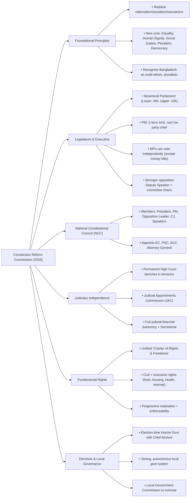

### **Question: What are the main recommendations of the Constitution Reform Commission as outlined in its summary report?**

**Answer:**

The Constitution Reform Commission has put forward a comprehensive set of recommendations aimed at establishing an effective democracy, ensuring fundamental rights, and creating a robust system of accountability in Bangladesh. The reforms are designed to reflect the ideals of the 1971 Liberation War and the aspirations of the 2024 mass uprising. The main recommendations can be summarized under the following key themes:

**1. Foundational Principles and Structure of the Republic:**
The Commission recommends a significant shift in the state's foundational principles. It proposes replacing nationalism, socialism, and secularism with **"Equality, Human Dignity, Social Justice, Pluralism, and Democracy"** as the new fundamental principles. It also recommends formally recognizing Bangladesh as a pluralistic, multi-ethnic, and multi-cultural country, and identifying all citizens as "Bangladeshis" to foster a more inclusive national identity.

**2. Restructuring the Legislature and Executive:**
To establish a genuine balance of power, the Commission proposes a radical overhaul of the legislature and executive branch:
*   **Bicameral Legislature:** Replacing the unicameral parliament with a **bicameral legislature** consisting of a directly elected 400-member Lower House (National Assembly) and a 105-member Upper House (Senate) elected through proportional representation.
*   **Curtailing Prime Ministerial Power:** Significantly reducing the absolute power of the Prime Minister by imposing a **two-term limit**, separating the role of Prime Minister from the head of a political party, and allowing MPs the liberty to vote against their party line (except on money bills).
*   **Empowering the Opposition:** Ensuring a more balanced parliament by having one of two Deputy Speakers and the Chairpersons of all Standing Committees nominated from the opposition.

**3. Establishing a National Constitutional Council (NCC):**
A key institutional innovation is the proposed **National Constitutional Council (NCC)**. This high-powered body, comprising the President, Prime Minister, Leader of the Opposition, Chief Justice, and Speakers of both houses, will act as the supreme institution for checks and balances. Its primary function will be to recommend appointments to all major constitutional posts, including the Election Commission, PSC, Anti-Corruption Commission, and the Attorney General, thereby removing these critical appointments from the sole discretion of the executive.

**4. Ensuring an Independent and Decentralized Judiciary:**
To secure judicial independence, the Commission recommends:
*   **Decentralizing the High Court:** Establishing **permanent benches of the High Court Division in all divisional headquarters** to make justice more accessible.
*   **Judicial Appointments Commission (JAC):** Creating an independent **Judicial Appointments Commission**, headed by the Chief Justice, to manage the appointment of all Supreme Court judges.
*   **Full Financial Autonomy:** Granting the judiciary full financial autonomy and vesting complete control over the appointment, posting, and promotion of local court judges in the Supreme Court through a dedicated Judicial Secretariat.

**5. Fundamental Rights and Governance:**
The report recommends a major expansion and strengthening of citizens' rights. It proposes a single, judicially enforceable charter of **‘Fundamental Rights and Freedoms’**, which merges existing civil and political rights with previously non-enforceable economic and social rights. New rights, such as the right to food, housing, healthcare, and access to the internet, are to be included, with a commitment to their progressive realization.

**6. Election-Time Interim Government and Local Government:**
The Commission provides a specific structure for an election-time **Interim Government**, headed by a Chief Advisor, to ensure free and fair elections. It also recommends establishing a **strong and autonomous local government system** with full financial and functional independence, overseen by a new constitutional body, the Local Government Commission.

In conclusion, the Constitution Reform Commission’s report presents a transformative vision for Bangladesh. Its recommendations collectively aim to dismantle the concentration of executive power and create a truly democratic state with a robust system of checks and balances, an empowered legislature, an independent judiciary, and a stronger guarantee of fundamental rights for all citizens.

