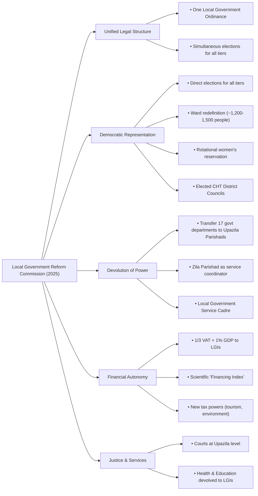

### **Question: What are the main recommendations of the Local Government Reform Commission as outlined in its executive summary report?**

**Answer:**

The Local Government Reform Commission, in its April 2025 report, has put forward a set of comprehensive and transformative recommendations aimed at fundamentally overhauling the local governance system in Bangladesh. The core objective is to move away from a centrally controlled model to an empowered, democratic, and effective system of local self-governance. The main recommendations can be summarized under the following key themes:

**1. Structural and Legal Unification:**
The Commission's most significant recommendation is to simplify the complex and fragmented legal framework. It proposes to repeal the five separate existing laws for Union Parishads, Upazila Parishads, Zila Parishads, Paurashavas (Municipalities), and City Corporations and replace them with a **single, unified "Local Government Ordinance, 2025"**. This unified law would create a cohesive legal structure and enable the holding of **simultaneous elections for all five tiers** of local government under a single schedule, which would drastically reduce election costs, time, and administrative burden.

**2. Strengthening Democracy and Representation:**
To make local government more representative and democratic, the Commission recommends:
*   **Direct Elections for All Tiers:** Creating specific electoral wards for Upazila and Zila Parishads to allow for the **direct election of their members**, moving away from the current system of indirect representation.
*   **Equitable Ward Redefinition:** Restructuring Union Parishad wards based on a population of approximately 1,200-1,500 people per ward to ensure more equitable representation.
*   **Rotational Women's Reservation:** Mandating that one-third of all seats be reserved for women, but implementing a **rotational system** where the reserved wards change over three election cycles. This ensures that all wards are eventually represented by a woman, making female participation more meaningful.
*   **CHT Elections:** Urgently holding elections for the three Chittagong Hill Tracts (CHT) District Councils, which have been run by nominated bodies for decades, and making the traditional Circle Chiefs permanent members of these councils.

**3. Genuine Devolution of Power and Functions:**
The report strongly emphasizes the need for true devolution of power from the central government. It recommends the **full and immediate transfer of government departments, functionaries (personnel), and funds** to the local councils as mandated by law but never fully implemented. This includes transferring 17 government departments at the Upazila level to the Upazila Parishad and reorganizing the Zila Parishad to be the supreme coordinating body for all district-level government services, similar to the CHT model. To support this, the creation of a unified **"Local Government Service"** cadre is proposed to professionalize the workforce.

**4. Ensuring Financial Autonomy and Sustainability:**
To free local bodies from financial dependency on the central government, the Commission makes several key financial recommendations:
*   **Guaranteed National Funding:** Allocating a significant portion of the national budget, specifically **one-third of nationally collected VAT** and at least **1% of the GDP**, to local government institutions.
*   **Scientific Fund Distribution:** Introducing a scientific **"Financing Index"** to ensure funds are distributed based on need and performance, rather than political considerations.
*   **New Revenue Sources:** Empowering local bodies to impose new taxes, such as **environmental and tourism taxes**, to increase their own revenue generation.

**5. Improving Access to Justice and Service Delivery:**
To bring essential services closer to the people, the report recommends:
*   **Decentralizing the Judiciary:** Establishing full-fledged **civil and criminal courts at the Upazila level** to make the formal justice system more accessible to rural citizens.
*   **Devolving Health and Education:** Transferring the authority and management of Upazila Health Complexes and Union Health & Family Welfare Centres directly to the Upazila and Union Parishads respectively, making them accountable to the local populace.

In conclusion, the Commission's report envisions a paradigm shift for local governance in Bangladesh. Its recommendations aim to create a legally coherent, democratically accountable, administratively empowered, and financially self-reliant system of local government that can act as the primary engine for public service delivery and sustainable development.

