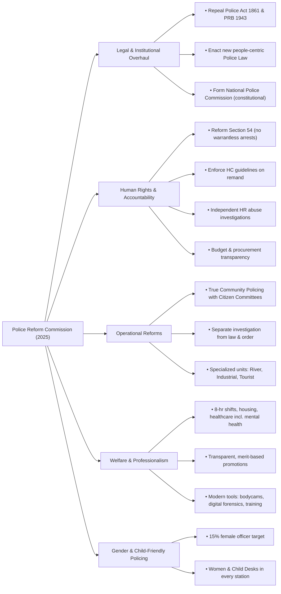

### **Question: What are the main recommendations of the Police Reform Commission as outlined in its executive summary and full report?**

**Answer:**

The Police Reform Commission, in its January 2025 report, has put forward a comprehensive and multi-tiered set of recommendations aimed at transforming the Bangladesh Police into a modern, democratic, accountable, and people-centric service. The report acknowledges the deep public mistrust following the 2024 mass student uprising and proposes fundamental reforms in law, structure, human rights practices, and public engagement. The main recommendations can be summarized under the following key themes:

**1. Legal and Institutional Overhaul:**
The Commission's primary recommendation is to repeal and replace the colonial-era **Police Act of 1861** and the **Police Regulations of Bengal (PRB), 1943**. It proposes a new, modern legal framework that redefines the police as a service accountable to the people, not the state machinery. Central to this is the establishment of an independent **National Police Commission**, a constitutional body responsible for overseeing police appointments, promotions, and ensuring accountability, thereby insulating the police from partisan political influence.

**2. Ensuring Human Rights, Accountability, and Transparency:**
Addressing the core public grievance of human rights violations is a major focus. The recommendations include:
*   **Abolishing Warrantless Arrests:** Reforming Section 54 of the Code of Criminal Procedure to curb the power of arbitrary arrest without a warrant.
*   **Curbing Torture in Remand:** Strictly implementing the High Court's directives regarding remand to prevent torture and abuse in custody.
*   **Independent Investigation of Complaints:** Establishing an independent body to investigate allegations of human rights abuses by police, and empowering the National Human Rights Commission (NHRC) with full authority to probe such cases.
*   **Financial Transparency:** Mandating transparency in the procurement of equipment and requiring the police to make budget and expenditure details public to combat corruption.

**3. Structural and Operational Reforms for a People-Centric Police Force:**
The Commission recommends a paradigm shift from a ruler-centric to a citizen-centric policing model.
*   **Strengthening Community Policing:** Moving beyond tokenism to truly institutionalize community policing with dedicated legal frameworks and budget allocations. This involves creating active and empowered Citizen-Police committees to foster local cooperation.
*   **Separation of Investigation from Law and Order:** Creating a separate, specialized cadre of investigating officers who are distinct from the police responsible for general law and order duties. This is aimed at improving the quality and impartiality of criminal investigations.
*   **Geographic and Specialized Policing:** Recognizing the diverse geography of Bangladesh, the report recommends strengthening specialized units like River Police, Tourist Police, and Industrial Police to address region-specific challenges more effectively.

**4. Improving Welfare and Professionalism of Police Personnel:**
To build a motivated and professional force, the Commission emphasizes the welfare of police members.
*   **Improved Working Conditions:** Mandating an 8-hour workday, ensuring proper housing and rations, and providing better healthcare, including mental health support, for all police personnel.
*   **Merit-Based Career Progression:** Reforming the recruitment and promotion system to be strictly merit-based, transparent, and free from political interference.
*   **Modernization and Training:** Allocating significant resources for modernizing the police with advanced technology (e.g., body-worn cameras, digital forensics) and providing continuous training on human rights, gender sensitivity, and modern investigation techniques.

**5. Gender and Child-Friendly Policing:**
The report places a strong emphasis on making the police force more inclusive and sensitive. A key recommendation is to significantly **increase the number of female police officers** (targeting 15% of the force) and establish dedicated **Women and Child-Friendly Desks** in every police station, staffed by trained female officers to handle cases of gender-based violence.

In conclusion, the Police Reform Commission's report is a comprehensive blueprint for fundamental change. It moves beyond superficial adjustments to recommend deep structural, legal, and cultural reforms aimed at rebuilding public trust and establishing a police service that is efficient, accountable, and truly committed to protecting the rights and safety of all citizens.

