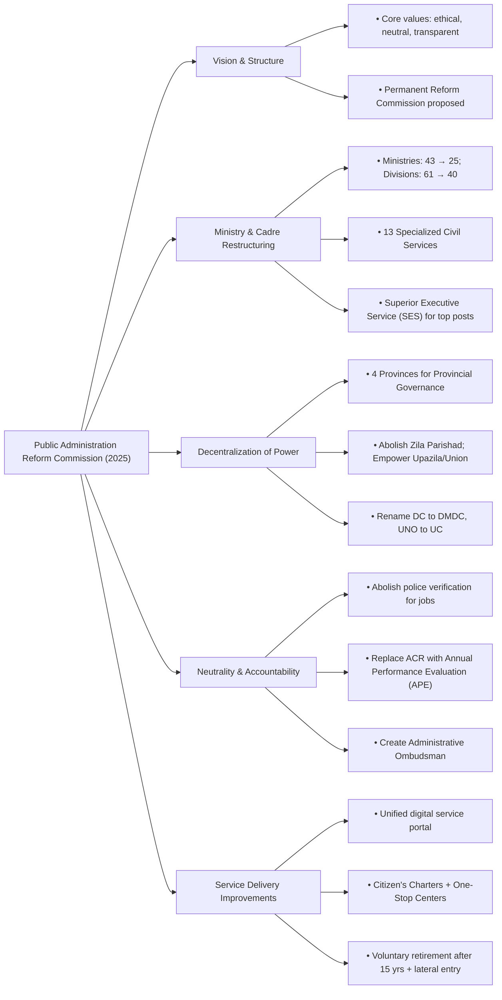

### **Question: What are the main recommendations of the Public Administration Reform Commission as outlined in its executive summary report?**

**Answer:**

The Public Administration Reform Commission, in its January 2025 report, has put forward a comprehensive and multi-tiered set of recommendations aimed at restructuring the public administration of Bangladesh to be more people-centric, accountable, efficient, and neutral. The report addresses fundamental issues ranging from the vision and structure of the civil service to service delivery mechanisms and the decentralization of power. The main recommendations can be summarized under the following key themes:

**1. Foundational Vision, Principles, and Structure:**
The Commission establishes a new vision for public administration: **"to establish good governance for providing citizen services at all levels of the republic."** It recommends embedding core values like being people-friendly, ethical, neutral, transparent, and accountable. A key structural recommendation is to establish a **permanent and independent Public Administration Reform Commission** to ensure that reform is a continuous and sustainable process.

**2. Restructuring Government Ministries and Cadres:**
To reduce complexity and improve efficiency, the Commission makes several bold structural recommendations:
*   **Consolidating Ministries:** Reducing the total number of ministries from 43 to **25** and divisions from 61 to **40** by merging ministries with similar functions.
*   **Unified and Specialized Civil Service:** Reorganizing the numerous existing BCS cadres into **13 unified, specialized services** (e.g., Bangladesh Administrative Service, Bangladesh Judicial Service, Bangladesh Public Security Service). This includes separating the Audit and Accounts cadres and creating a separate cadre for ICT professionals.
*   **Creation of a 'Superior Executive Service' (SES):** Establishing an elite **'Superior Executive Service'** for senior posts from Deputy Secretary to Secretary. Entry into this service would be through a competitive examination open to meritorious officers from all specialized services, breaking the monopoly of any single cadre on top administrative posts.

**3. Decentralization of Power and Administration:**
A central theme of the report is the urgent need for decentralization to bring governance closer to the people.
*   **Provincial Governance:** Proposing the creation of a **Provincial Governance System** by dividing the country into four provinces based on the original four greater districts. This would devolve significant administrative and political authority away from the capital.
*   **Empowering Local Government:** Recommending the **abolition of the Zila Parishad (District Council)** to simplify the local government structure. It also suggests strengthening Upazila and Union Parishads by giving them greater authority over local administration, including the management of land and local law and order.
*   **Redesigning Field Administration:** Proposing a change in the nomenclature and function of the Deputy Commissioner (DC) and Upazila Nirbahi Officer (UNO) to **District Magistrate & District Commissioner (DMDC)** and **Upazila Commissioner (UC)** respectively, with redefined roles focused on coordination and magisterial duties.

**4. Ensuring Neutrality, Accountability, and Efficiency:**
To depoliticize the administration and enhance accountability, the report recommends:
*   **Abolition of Police Verification for Jobs:** Recommending the **abolition of police verification** for entry into government jobs and for promotions, a practice seen as a tool for political screening. Verification should be limited to checking for criminal records.
*   **Performance-Based Evaluation:** Replacing the archaic Annual Confidential Report (ACR) system with a modern, transparent **Annual Performance Evaluation (APE)** system based on mutual discussion and clearly defined Key Performance Indicators (KPIs).
*   **Strengthening Anti-Corruption Mechanisms:** Enhancing the power of anti-corruption bodies and recommending the establishment of an **Administrative Ombudsman** to investigate citizen complaints against civil servants.

**5. Improving Citizen Service Delivery:**
To make public services more accessible and efficient, the Commission proposes:
*   **Digital Transformation:** Creating a unified **web portal-based digital platform** for all government services and strengthening the digital infrastructure down to the district and upazila levels.
*   **Citizen's Charters and One-Stop Services:** Mandating and enforcing Citizen's Charters for all government offices and expanding 'One-Stop Service' centers to reduce bureaucratic hurdles for citizens.
*   **Mandatory Retirement and Lateral Entry:** Allowing government officials to opt for voluntary retirement after **15 years of service** and introducing a system of **lateral entry** for specialized professionals from the private sector to be appointed to senior government posts on a contractual basis.

In conclusion, the Commission's report presents a holistic vision for a fundamental overhaul of Bangladesh's public administration. It seeks to dismantle the centralized, colonial-era structure and replace it with a modern, decentralized, accountable, and performance-driven system fit for a 21st-century democratic state.

