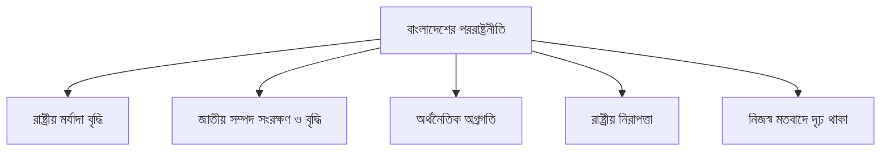
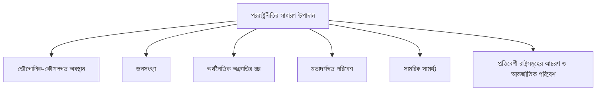
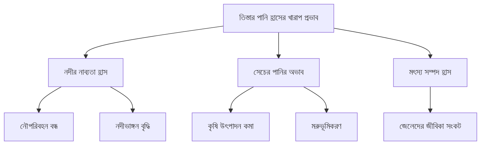
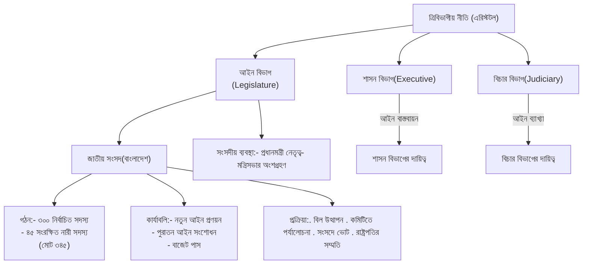
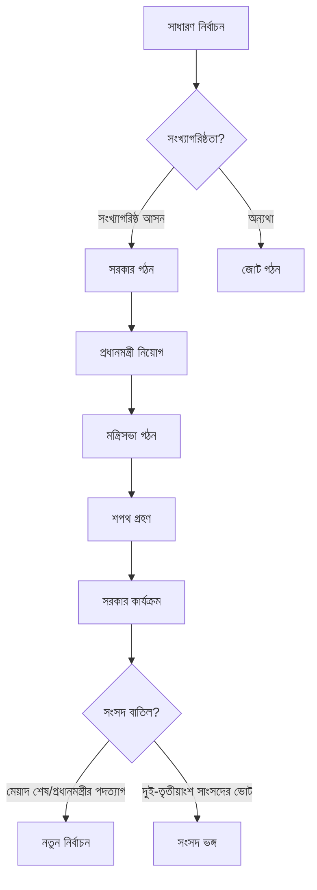

```mermaid
flowchart TD
  A[বাংলাদেশের পররাষ্ট্রনীতি] --> B[রাষ্ট্রীয় মর্যাদা বৃদ্ধি]
  A --> C[জাতীয় সম্পদ সংরক্ষণ ও বৃদ্ধি]
  A --> D[অর্থনৈতিক অগ্রগতি]
  A --> E[রাষ্ট্রীয় নিরাপত্তা]
  A --> F[নিজস্ব মতবাদে দৃঢ় থাকা]
```

```mermaid
flowchart TD
  A[পররাষ্ট্রনীতির সাধারণ উপাদান] --> B[ভৌগোলিক-কৌশলগত অবস্থান]
  A --> C[জনসংখ্যা]
  A --> D[অর্থনৈতিক অগ্রগতির স্তর]
  A --> E[মতাদর্শগত পরিবেশ]
  A --> F[সামরিক সামর্থ্য]
  A --> G[প্রতিবেশী রাষ্ট্রসমূহের আচরণ ও আন্তর্জাতিক পরিবেশ]
```

```mermaid
flowchart TD
    A[তিস্তার পানি হ্রাসের খারাপ প্রভাব] --> B[নদীর নাব্যতা হ্রাস]
    A --> C[সেচের পানির অভাব]
    A --> D[মৎস্য সম্পদ হ্রাস]
    
    B --> E[নৌপরিবহন বন্ধ]
    B --> F[নদীভাঙ্গন বৃদ্ধি]
    
    C --> G[কৃষি উৎপাদন কমা]
    C --> H[মরুভূমিকরণ]
    
    D --> I[জেলেদের জীবিকা সংকট]   
```

```mermaid
flowchart TD
    A["ত্রিবিভাগীয় নীতি (এরিস্টটল)"] --> B["আইন বিভাগ\n(Legislature)"]
    A --> C["শাসন বিভাগ(Executive)"]
    A --> D["বিচার বিভাগ(Judiciary)"]

    B --> E["জাতীয় সংসদ(বাংলাদেশ)"]
    E --> F["গঠন:- ৩০০ নির্বাচিত সদস্য\n- ৪৫ সংরক্ষিত নারী সদস্য\n(মোট ৩৪৫)"]
    E --> G["কার্যাবলি:- নতুন আইন প্রণয়ন\n- পুরাতন আইন সংশোধন\n- বাজেট পাস"]
    E --> H["প্রক্রিয়া:. বিল উত্থাপন . কমিটিতে পর্যালোচনা . সংসদে ভোট . রাষ্ট্রপতির সম্মতি"]

    B --> I["সংসদীয় ব্যবস্থা:- প্রধানমন্ত্রী নেতৃত্ব- মন্ত্রিসভার অংশগ্রহণ"]
    C -->|আইন বাস্তবায়ন| J["শাসন বিভাগের দায়িত্ব"]
    D -->|আইন ব্যাখ্যা| K["বিচার বিভাগের দায়িত্ব"]
```

```mermaid
flowchart TD
    A[সাধারণ নির্বাচন] 
    A --> D{সংখ্যাগরিষ্ঠতা?}
    D -->|সংখ্যাগরিষ্ঠ আসন| E[সরকার গঠন]
    D -->|অন্যথা| F[জোট গঠন]
    E --> G["প্রধানমন্ত্রী নিয়োগ"]
    G --> H[মন্ত্রিসভা গঠন]
    H --> I[শপথ গ্রহণ]
    I --> J[সরকার কার্যক্রম]
    J --> K{সংসদ বাতিল?}
    K -->|মেয়াদ শেষ/প্রধানমন্ত্রীর পদত্যাগ| L[নতুন নির্বাচন]
    K -->|দুই-তৃতীয়াংশ সাংসদের ভোট| M[সংসদ ভঙ্গ]
```

