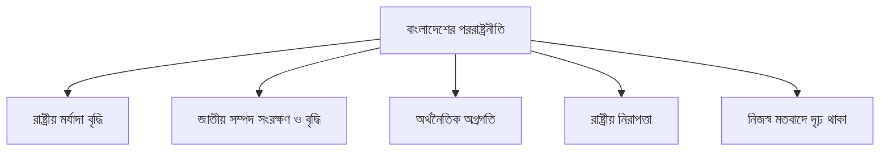
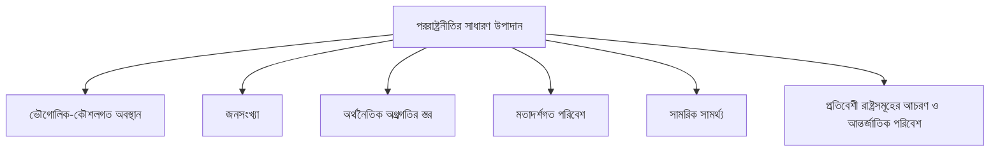
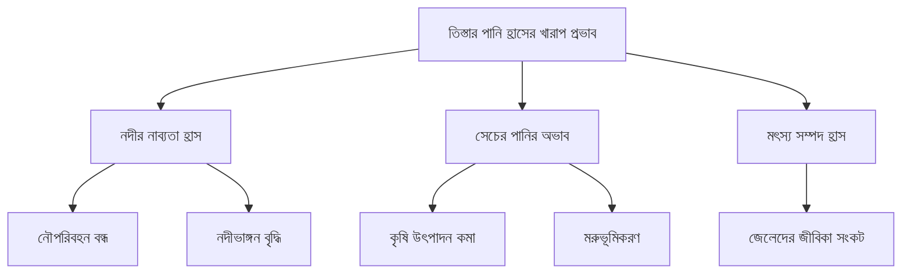

```mermaid
flowchart TD
  A[বাংলাদেশের পররাষ্ট্রনীতি] --> B[রাষ্ট্রীয় মর্যাদা বৃদ্ধি]
  A --> C[জাতীয় সম্পদ সংরক্ষণ ও বৃদ্ধি]
  A --> D[অর্থনৈতিক অগ্রগতি]
  A --> E[রাষ্ট্রীয় নিরাপত্তা]
  A --> F[নিজস্ব মতবাদে দৃঢ় থাকা]
```

```mermaid
flowchart TD
  A[পররাষ্ট্রনীতির সাধারণ উপাদান] --> B[ভৌগোলিক-কৌশলগত অবস্থান]
  A --> C[জনসংখ্যা]
  A --> D[অর্থনৈতিক অগ্রগতির স্তর]
  A --> E[মতাদর্শগত পরিবেশ]
  A --> F[সামরিক সামর্থ্য]
  A --> G[প্রতিবেশী রাষ্ট্রসমূহের আচরণ ও আন্তর্জাতিক পরিবেশ]
```

```mermaid
flowchart TD
    A[তিস্তার পানি হ্রাসের খারাপ প্রভাব] --> B[নদীর নাব্যতা হ্রাস]
    A --> C[সেচের পানির অভাব]
    A --> D[মৎস্য সম্পদ হ্রাস]
    
    B --> E[নৌপরিবহন বন্ধ]
    B --> F[নদীভাঙ্গন বৃদ্ধি]
    
    C --> G[কৃষি উৎপাদন কমা]
    C --> H[মরুভূমিকরণ]
    
    D --> I[জেলেদের জীবিকা সংকট]   
```

