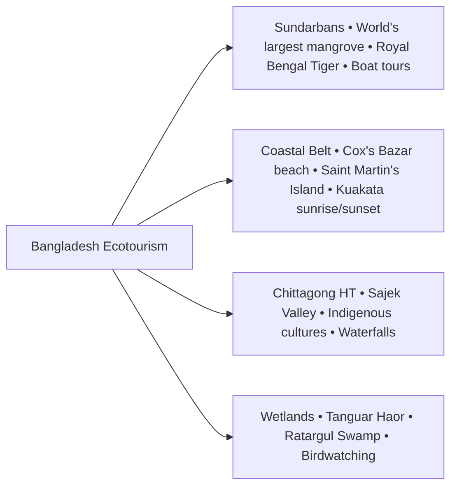
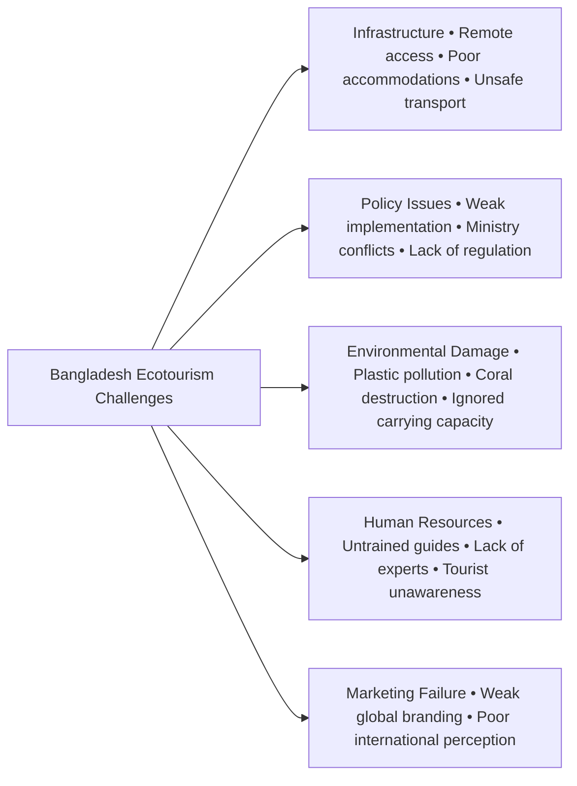
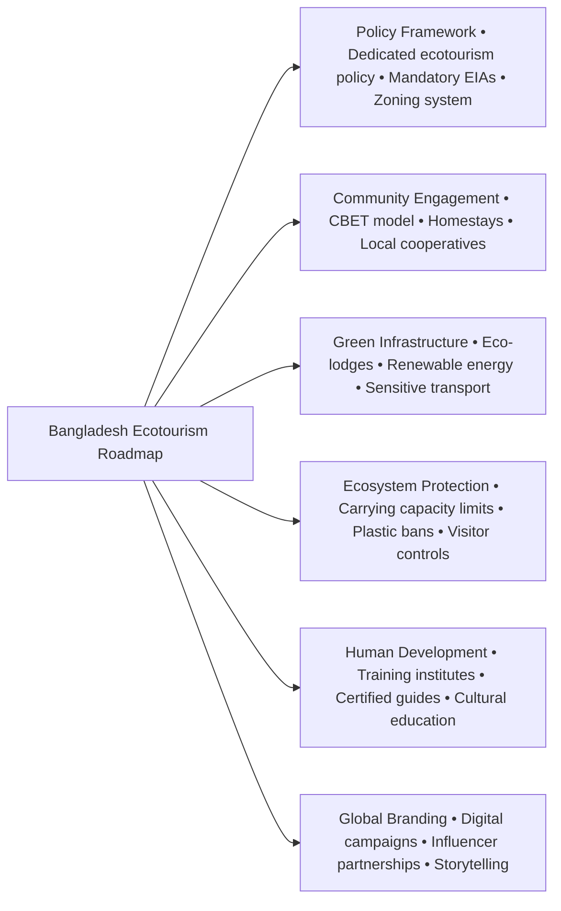

1. Reading the question
2. Finding the keywords
3. Stick to the question
4. Maintaining the word limit
5. *Adding more dimension
6. Mentioning Sources: Optional but super effective
7. **Have to avoid extreme opinion:** My own judgement shouldn't be passed. In some cases my thought can be delivered, but my judgement mustn't.
8. Using graph and charts
9. Handwriting must be clean
10. **Underlining:** Using caps as point name and putting keywords in the beginning of the points.
11. Diagrams are equal important as content for extra mark

Of course. Question number 6 is a classic BCS written exam question type. It asks you to write a **Feature** for a newspaper, which is different from a simple essay or a report. It requires a specific format and a more engaging, narrative tone.

Let's break down how to approach and answer this question perfectly.

### **Understanding the Question**

**"6. Write a feature for the post-editorial page of an English daily with a forwarding note, giving emphasis on the prospects of ecotourism in Bangladesh. (20 marks)"**

This question has two distinct parts:
1.  **A Forwarding Note:** A formal letter to the editor of the newspaper.
2.  **The Feature Article:** The main body of your answer, focusing on the prospects of ecotourism in Bangladesh.

The marks are likely distributed something like this:
*   Forwarding Note: 3-5 marks
*   Feature Article: 15-17 marks

### **Part 1: How to Write the Forwarding Note**

The forwarding note is a short, formal letter. Its purpose is to request the editor to publish your feature.

**Format:**

1.  **Date:** Top left corner.
2.  **The Editor:** Address the editor of a well-known English daily.
3.  **Newspaper's Address:** Include a plausible address.
4.  **Subject Line:** Make it clear and concise.
5.  **Salutation:** Formal salutation like "Dear Sir," or "Dear Editor,".
6.  **Body of the Letter:** In one or two sentences, state your purpose. Mention the title of your feature and express hope that it will be published for the benefit of the readers.
7.  **Closing:** A formal closing like "Sincerely," or "Yours faithfully,".
8.  **Your Name/Signature:** Use a fictional name or simply write "A Concerned Citizen" or "A Reader".

Of course. Here is a complete model answer for question number 6, following the structure and guidelines discussed previously.

---

### **Model Answer**

#### **Forwarding Note**

17 October 2023

The Editor
The Daily Star
64-65 Kazi Nazrul Islam Avenue
Dhaka-1215

**Subject: Request for publishing a feature on the prospects of ecotourism in Bangladesh.**

Dear Sir,

I am submitting a feature article titled **"Bangladesh's Green Gold: Charting a Course for Sustainable Ecotourism"** for your consideration. The piece delves into the immense, yet largely untapped, potential of ecotourism in our country and proposes a sustainable path forward.

I believe this article would resonate strongly with your readers and help foster a national conversation on this important issue. I would be grateful if you would kindly publish it on the post-editorial or op-ed page of your esteemed daily.

Sincerely,
Rizwan Ahmed
An environmental researcher

---

### **The Feature Article**

### **Bangladesh's Green Gold: Charting a Course for Sustainable Ecotourism**

Imagine paddling a silent canoe through the misty canals of the Sundarbans, the only sounds being the chirping of birds and the gentle splash of your oar. Picture yourself sipping tea in a Sreemangal cottage, surrounded by rolling green hills, or trekking through the clouds of Sajek Valley, sharing a meal with a local family. This is not a scene from a glossy travel magazine; this is the immense, raw, and authentic promise of ecotourism in Bangladesh—our nation's "Green Gold." As the world increasingly seeks meaningful, responsible travel, the question is no longer whether Bangladesh has potential, but how we can harness it sustainably before it's too late.

Ecotourism, at its core, is a philosophy of travel that intertwines adventure with responsibility. It is about exploring pristine natural areas in a way that conserves the environment, respects local cultures, and directly benefits the communities who call these places home. For a country blessed with the world's largest mangrove forest, the longest natural sea beach, a unique coral island, sprawling haors, and verdant hill tracts, ecotourism is not just an opportunity—it is a calling. Unlike conventional mass tourism that often leaves a trail of concrete hotels and plastic waste, ecotourism offers a path to economic prosperity that does not cost us our natural soul.

The economic prospects are staggering. By developing community-based ecotourism, we can create thousands of jobs for local people as guides, homestay operators, and conservation workers. When a villager near the Sundarbans earns a living by guiding tourists through the forest, he becomes its most dedicated protector, shunning illegal logging or poaching. This model transforms local communities from passive residents into active stakeholders in conservation. Furthermore, high-value, low-impact ecotourism can attract a global clientele willing to pay a premium for authentic experiences, significantly boosting our foreign currency reserves and diversifying our economy beyond the garments sector.

Beyond the economics, the social and cultural benefits are profound. Ecotourism acts as a bridge between cultures, fostering mutual respect and understanding. It provides an economic incentive for indigenous communities in the Chittagong Hill Tracts to preserve their unique traditions, languages, and crafts, showcasing them to the world not as relics for souvenirs, but as living, breathing cultures. This responsible engagement empowers communities, strengthens their identity, and ensures their heritage is passed down to future generations.

However, we must tread carefully. The very popularity of ecotourism can become its own undoing. As the provided text warns, the line between a committed ecotourist and a "so-called" one who simply wants "the comforts of home package in a pretty setting" is dangerously thin. We are already witnessing this threat in our most precious locations. Unregulated tourism has put Saint Martin's Island, our only coral reef, under severe environmental stress. Plastic pollution chokes the natural beauty of Cox's Bazar and Sajek. If we allow nature to become a mere "commodity and a photo opportunity," we will defeat the very purpose of ecotourism.

The path forward, therefore, requires a delicate balance of promotion and protection. The government must move beyond mere declarations and implement a robust national ecotourism policy. This involves creating designated 'eco-sensitive zones' with strict regulations on construction and tourist numbers, especially in fragile areas like Saint Martin's and the Sundarbans. Investing in training for local guides, promoting homestays over large resorts, and enforcing a 'zero plastic' policy in tourist spots are not optional—they are essential.

Ultimately, as the passage rightly concludes, the future of ecotourism rests on conscious choices. It depends on governments being proactive, tour operators acting responsibly, and tourists themselves understanding their role. Ecotourism is not merely about visiting a beautiful place; it is about leaving it just as beautiful, if not more so, for those who come after. Bangladesh is sitting on a treasure trove of green gold. With wisdom, foresight, and a collective commitment to sustainability, we can chart a course that protects our natural heritage while ensuring a prosperous future for all. Nature is counting on us.

***

### **Ecotourism in Bangladesh: A Pathway to Sustainable Development and Green Prosperity**

**Introduction: The Unveiling of a Natural Treasure**

Bangladesh, a land poetically described as a tapestry woven with the green of paddy fields and the silver of countless rivers, holds within its modest geographical boundaries a treasure trove of natural and cultural diversity. While often overshadowed by narratives of population density and climate vulnerability, the nation possesses an astonishing array of ecosystems, from the world’s largest mangrove forest to its longest natural sea beach, from rolling tea gardens to mist-shrouded hills. In an era where global travelers are increasingly seeking authentic, meaningful, and responsible experiences, the concept of ecotourism emerges not merely as a niche market, but as a vital and transformative pathway for Bangladesh. Ecotourism, as defined by The International Ecotourism Society, is "responsible travel to natural areas that conserves the environment, sustains the well-being of the local people, and involves interpretation and education." It is intrinsically linked to the broader concept of sustainable development, famously defined by the Brundtland Commission as development that “meets the needs of the present without compromising the ability of future generations to meet their own needs.” For Bangladesh, leveraging its natural assets through ecotourism presents a profound opportunity to achieve economic growth, environmental conservation, and social empowerment simultaneously. This essay will explore the immense prospects of ecotourism in Bangladesh, critically analyze the challenges that impede its growth, and propose a strategic roadmap for transforming this latent potential into a cornerstone of national prosperity.

**The Foundation of Potential: Bangladesh's Diverse Ecotourism Assets**

Bangladesh's potential as an ecotourism destination is rooted in its unique and varied natural landscapes, each offering a distinct experience. These assets can be broadly categorized:

**1. The Sundarbans: A Mangrove Majesty**
Designated as a UNESCO World Heritage Site in 1997, the Sundarbans is the crown jewel of Bangladesh’s natural heritage. Spanning approximately 10,000 square kilometers across Bangladesh and India, with over 6,000 sq km in Bangladesh, it is the largest single block of tidal halophytic mangrove forest in the world. It is a critical habitat for a vast array of species, including the iconic Royal Bengal Tiger, spotted deer, saltwater crocodiles, and hundreds of species of birds and fish. Ecotourism here offers unparalleled experiences like silent boat trips through labyrinthine creeks, wildlife spotting from watchtowers in locations like Kotka and Kochikhali, and guided treks through the dense forest floor. The delicate ecosystem demands a low-impact, high-value tourism model that directly contributes to conservation and supports the livelihoods of local communities like the *Mawali* (honey collectors) and *Bawali* (woodcutters).

**2. The Coastal and Marine Belt: Where Sand and Sea Converge**
Bangladesh boasts the world's longest unbroken natural sea beach in Cox's Bazar, stretching over 120 kilometers. Beyond the main beach, areas like Inani with its unique rock formations and the serene Marine Drive offer breathtaking vistas. Further south lies Saint Martin's Island, the country’s only coral island, a biodiversity hotspot with clear blue waters, coconut groves, and a rich marine life. The recent declaration of a 1,743 sq km Marine Protected Area around the island is a step towards its conservation. Kuakata, known as the "Daughter of the Sea," offers the rare spectacle of both sunrise and sunset from the same beach, adding another unique destination to the coastal belt.

**3. The Chittagong Hill Tracts (CHT): A Tapestry of Hills and Cultures**
The southeastern region, comprising Rangamati, Bandarban, and Khagrachhari, presents a dramatic contrast to the flat plains. Rolling hills, pristine lakes, and cascading waterfalls create a stunning landscape. Destinations like Sajek Valley, often called the "Kingdom of Clouds," Nilgiri, and নীলাচল offer panoramic views and a chance to experience life above the clouds. The CHT is also home to over 13 different indigenous groups, each with its unique culture, language, and traditions. Community-based ecotourism here offers travelers an authentic cultural exchange, from staying in indigenous homestays to learning about their customs and crafts, thereby creating a sustainable livelihood for these communities.

**4. The Haors and Wetlands: A Kingdom of Water**
The vast wetlands of the northeastern region, particularly the Haor basin, transform into a veritable inland sea during the monsoon. Tanguar Haor in Sunamganj, a UNESCO Ramsar Site, is an internationally significant wetland that provides a sanctuary for hundreds of species of migratory birds during the winter. A boat journey through this sprawling waterbody, staying overnight on a local vessel, and observing the birds and the lives of the fishing communities is a quintessential ecotourism experience. Similarly, Ratargul Swamp Forest in Sylhet, one of the few freshwater swamp forests in the world, offers a magical experience of canoeing through submerged trees.

**The Multifaceted Prospects: Economic, Environmental, and Social Gains**

Developing these assets through a well-planned ecotourism model can yield transformative benefits for Bangladesh.

*   **Economic Prosperity and Diversification:** Tourism is one of the world's largest industries, and ecotourism is its fastest-growing segment. According to the World Travel and Tourism Council (WTTC), the total contribution of travel and tourism to Bangladesh's GDP is already significant, and with a focus on high-value ecotourism, this can be substantially increased. It can serve as a vital source of foreign currency, reducing the economy's over-reliance on the RMG sector and remittances. Most importantly, it creates jobs directly within local communities, alleviating poverty and reducing rural-to-urban migration.

*   **A Catalyst for Environmental Conservation:** Ecotourism creates a powerful economic incentive for conservation. When local communities see a direct financial benefit from protecting their environment—be it a forest, a wetland, or a coral reef—they become its most ardent defenders. Revenue generated from park fees and tourism activities can be reinvested into conservation projects, scientific research, and anti-poaching initiatives. It raises environmental awareness among both domestic and international tourists, fostering a culture of conservation.

*   **Socio-Cultural Preservation and Empowerment:** Ecotourism provides a platform for indigenous and local communities to showcase their culture with dignity. It helps preserve traditional knowledge, arts, crafts, and languages by making them economically viable. This model empowers marginalized communities, particularly women, by providing them with opportunities for income generation through homestays, culinary services, and handicrafts, strengthening the social fabric.

**The Critical Challenges: Hurdles on the Path to Sustainability**

Despite the immense potential, the road to developing a successful ecotourism industry in Bangladesh is fraught with challenges.

**1. Infrastructural and Logistical Deficiencies:** Many of Bangladesh’s most pristine natural areas are remote and difficult to access due to poor road conditions. There is a severe lack of quality, eco-friendly accommodation, proper sanitation facilities, and safe transportation, which deters high-value international tourists.

**2. Policy Gaps and Weak Implementation:** While Bangladesh has a National Tourism Policy and a newly drafted Tourism Master Plan (2023-2041), the implementation remains weak. There is a lack of coordination among different government ministries (e.g., Tourism, Environment, and Home Affairs), leading to conflicting priorities and ineffective regulation.

**3. Unregulated Tourism and Environmental Degradation:** This is perhaps the most pressing threat. Popular tourist spots like Saint Martin's, Cox's Bazar, and Sajek are suffering from the consequences of mass, unregulated tourism. rampant plastic pollution, unplanned construction of hotels, destruction of coral reefs, and noise pollution are causing irreversible damage. The concept of "carrying capacity"—the maximum number of visitors an ecosystem can sustain without being degraded—is largely ignored.

**4. Lack of Skilled Human Resources and Awareness:** There is a significant shortage of professionally trained tour guides, hospitality managers, and conservation experts who understand the principles of ecotourism. Furthermore, there is a general lack of awareness among domestic tourists about responsible travel practices.

**5. Inadequate Marketing and Branding:** Internationally, Bangladesh is rarely perceived as a primary tourist destination. There has been a failure to create and promote a strong, positive brand image that highlights the country's unique ecotourism offerings to the global market.

**The Way Forward: A Strategic Roadmap**

To overcome these challenges and unlock the true potential of ecotourism, a multi-pronged, strategic approach is essential:

1.  **Implement a Robust National Ecotourism Policy:** The government must finalize and strictly enforce a dedicated ecotourism policy. This policy should introduce mandatory Environmental Impact Assessments (EIAs) for all tourism projects and establish a clear zoning system, designating core conservation areas, eco-sensitive buffer zones, and areas for limited development.
2.  **Embrace the Community-Based Ecotourism (CBET) Model:** The focus must shift from large-scale, corporate-owned resorts to small-scale, community-owned and operated ventures. The government and NGOs can provide training, micro-credit, and market linkages to help local communities establish homestays, cooperatives for guide services, and handicraft centers.
3.  **Invest in Green Infrastructure:** Investment should be directed towards building eco-lodges that use local materials, renewable energy (solar panels), and advanced waste management and water recycling systems. Improving road and river connectivity to remote areas must be done in an environmentally sensitive manner.
4.  **Enforce Carrying Capacity and Regulations:** For fragile ecosystems like Saint Martin's Island and Tanguar Haor, a scientifically determined carrying capacity must be established and strictly enforced. This may involve limiting the number of daily visitors, banning single-use plastics, and controlling the number of hotels and vehicles.
5.  **Develop Human Capital:** A network of tourism and hospitality training institutes should be established across the country, with a specialized curriculum on ecotourism, conservation, and indigenous culture. Certified training programs for local guides are crucial.
6.  **Launch a Global Branding Campaign:** Bangladesh needs to launch a sophisticated and targeted international marketing campaign. This should utilize digital platforms, collaborate with renowned travel influencers and documentary makers, and focus on the unique stories of its nature and people, shifting the global narrative from a country of challenges to a destination of authentic experiences.

**Conclusion: A Commitment to the Future**

Ecotourism in Bangladesh is a double-edged sword. Pursued recklessly, it can destroy the very natural and cultural assets that attract visitors in the first place. Pursued with wisdom, foresight, and a deep commitment to sustainability, it can become a powerful engine for inclusive economic growth and environmental stewardship. The path forward requires a paradigm shift—from a model of mass consumption to one of conscious conservation, from top-down development to community-led empowerment. The silent majesty of the Sundarbans, the vibrant cultures of the hill tracts, and the life-giving rhythm of the haors are not commodities to be sold, but treasures to be cherished. By protecting these treasures, we not only build a prosperous tourism industry but also safeguard our national identity and fulfill our sacred responsibility to future generations. Bangladesh's journey towards becoming a premier ecotourism destination will be a testament to its ability to harmonize development with nature, truly embodying the spirit of a "Golden Bengal."