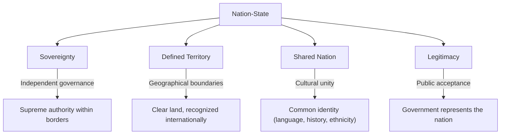
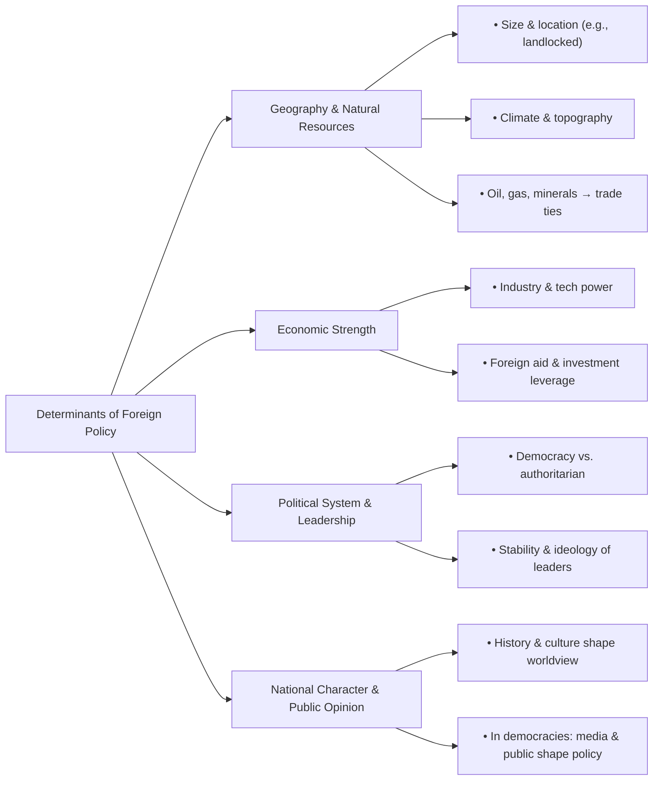
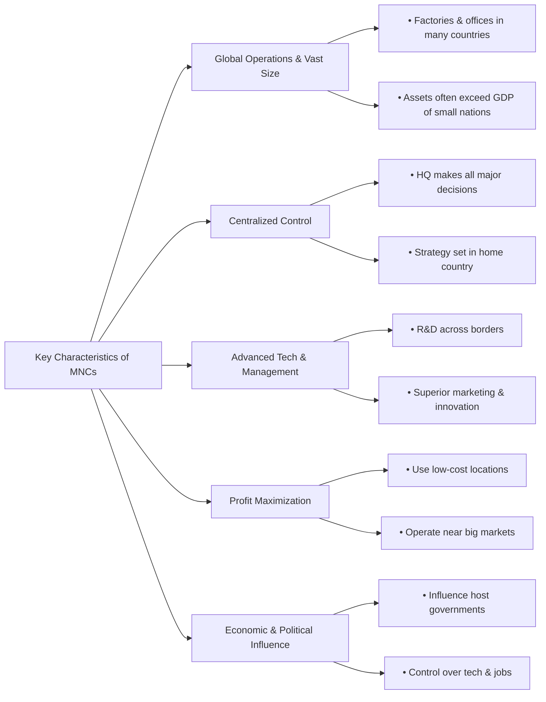

### **01. Brief Discussion on any 10 of the Following Topics (4×10=40)**

**(a) What is meant by a nation-state?**

A nation-state is a political concept where a state, a sovereign political entity with defined territory and a government, is aligned with a nation, a group of people who share a common cultural, linguistic, or ethnic identity. It represents the ideal where the political boundaries of the state coincide with the cultural boundaries of the nation.

**Key characteristics include:**
1.  **Sovereignty:** The state has supreme authority within its borders and is independent externally.
2.  **Territory:** It possesses a clearly defined geographical area.
3.  **Nation:** The majority of the population shares a collective identity, history, and culture, creating a sense of belonging.
4.  **Legitimacy:** The government's right to rule is accepted by the people, often because it is seen as the legitimate representative of the nation.

In practice, perfect nation-states are rare. Most states are multi-national (e.g., India, Canada), and some nations are stateless (e.g., the Kurds). However, countries like Japan and Iceland are often cited as close examples of the nation-state ideal.

---

**(b) What is meant by non-traditional security?**

Non-traditional security (NTS) refers to threats to the survival and well-being of people and states that arise from non-military sources. Unlike traditional security, which focuses on military threats from other states, NTS is people-centric (human security) and transnational in nature.

**Key aspects of Non-Traditional Security include:**
*   **Source of Threat:** The threats are not from invading armies but from challenges like climate change, pandemics (e.g., COVID-19), transnational terrorism, cyber-attacks, resource scarcity (food, water), and massive refugee flows.
*   **Referent Object:** The primary object to be secured is not just the state, but individuals, communities, and humanity as a whole.
*   **Nature of Response:** These threats cannot be effectively addressed by military force alone. They require international cooperation, diplomacy, economic development, and scientific collaboration.

The concept gained prominence after the Cold War, reflecting a broader understanding of what constitutes a security threat in an interconnected world.

---

**(c) What is the difference between sovereignty and sovereign equality?**

While related, sovereignty and sovereign equality are distinct concepts in international relations and law.

*   **Sovereignty:** This is an *attribute* of a state. It refers to the supreme and legitimate authority a state possesses within its own territory (internal sovereignty) and its independence from the authority of other states (external sovereignty). It is the quality of being in command of one's own territory and governance.

*   **Sovereign Equality:** This is a *legal principle* that governs the relationship *between* states. As enshrined in Article 2(1) of the UN Charter, it holds that all sovereign states are legally equal in the international system, regardless of their size, population, wealth, or military power.

**The core difference:** Sovereignty is the *power and authority* a state has. Sovereign equality is the *principle* that all states possessing this authority are equal in status under international law. For example, in the UN General Assembly, the vote of a small nation like Tuvalu carries the same legal weight as the vote of a superpower like the United States, which is a direct application of sovereign equality.

---

**(d) What are the main driving forces of globalization?**

Globalization, the increasing interconnectedness of societies worldwide, is driven by several key forces:

1.  **Technological Advancements:** This is the primary driver. The invention of the microchip, the internet, satellite communications, and mobile technology has made instantaneous global communication possible. Advances in transportation, such as containerization and affordable air travel, have made the movement of goods and people faster and cheaper.
2.  **Economic Liberalization:** The widespread adoption of free-market policies since the 1980s has been crucial. This includes the reduction of trade barriers (tariffs and quotas), deregulation of industries, and privatization, promoted by international institutions like the World Trade Organization (WTO), IMF, and World Bank.
3.  **Political Changes:** The end of the Cold War dismantled the ideological barrier between the East and West, opening up vast new regions to global trade, investment, and cultural exchange.
4.  **Multinational Corporations (MNCs):** Seeking to maximize profits, MNCs have expanded their operations globally to access new markets, cheaper labor, and raw materials, thereby integrating national economies into a global production chain.

---

**(e) Define transit and transshipment.**

Transit and transshipment are two distinct logistics terms related to the international movement of goods.

*   **Transit:** This refers to the passage of goods from one country to a third country *through* the territory of an intermediate country. During transit, the goods do not clear customs or enter the commerce of the intermediate country; it merely acts as a land or air corridor.
    *   **Example:** Goods from landlocked Nepal moving through Indian territory to reach the port of Kolkata for export.

*   ~~**Transshipment:** This is the process of unloading goods from one vessel or mode of transport and loading them onto another at an intermediate port or terminal to complete their journey to the final destination. This is common in major hub ports where large "mother vessels" unload cargo, which is then distributed to smaller regional ports by "feeder vessels."~~
    *   ~~**Example:** Cargo from China arriving at the Port of Singapore on a large ship, being unloaded, and then re-loaded onto a smaller ship bound for Chittagong, Bangladesh.~~

---

**(f) Write the features of Weapons of Mass Destruction (WMD).**

Weapons of Mass Destruction (WMD) are a class of weapons whose destructive capacity far exceeds that of conventional arms. They are broadly categorized as Nuclear, Biological, and Chemical (NBC).

**Key features include:**
1.  **Massive and Indiscriminate Effect:** Their primary characteristic is the ability to kill or injure a very large number of people and cause immense damage to infrastructure and the environment in a single use. Their effects are difficult or impossible to contain to a specific military target, thus harming civilians indiscriminately.
2.  **Long-Term Consequences:** WMDs often have lasting effects beyond the initial blast or release. Nuclear weapons cause long-term radioactive contamination; chemical agents can persist in the environment; and biological weapons can trigger epidemics that continue to spread.
3.  **Psychological Impact:** The mere threat of their use can cause widespread fear, panic, and terror, making them powerful tools of political coercion and psychological warfare.
4.  **Disproportionate Destruction:** The level of destruction is vastly disproportionate to the size or cost of the weapon itself.

---

**(g) What are the internal elements (determinants) of foreign policy?**

The foreign policy of a state is shaped significantly by its internal conditions and characteristics. These internal determinants include:

1.  **Geography and Natural Resources:** A country's size, location (e.g., landlocked vs. maritime), topography, and climate fundamentally influence its foreign policy. The presence or absence of strategic natural resources like oil, gas, or minerals dictates its trade relations and strategic priorities.
2.  **Economic Strength and Development:** A nation's economic power—its industrial capacity, technological advancement, and financial stability—is a key determinant. Economically powerful states can pursue more ambitious and influential foreign policies, using tools like foreign aid and investment.
3.  **Political System and Leadership:** The type of government (democratic, authoritarian), the stability of its political institutions, and the vision and ideology of its leaders heavily influence foreign policy goals and the methods used to achieve them.
4.  **National Character and Public Opinion:** The historical experiences, cultural values, and shared identity of a nation shape its worldview. In democracies, public opinion, interest groups, and the media can exert significant pressure on foreign policy decisions.

---

**(h) What are the fundamental differences between a Friendship Treaty and a Security Treaty?**

Both are international agreements, but they differ fundamentally in their scope and level of commitment.

*   **Friendship Treaty (or Treaty of Amity and Cooperation):**
    *   **Scope:** Broad and general. It aims to foster goodwill, peaceful relations, and cooperation across various non-military sectors like culture, trade, economy, science, and technology.
    *   **Commitment:** The obligations are typically political and aspirational rather than legally binding in a military sense. It signals positive intentions but does not include a mutual defense clause.

*   **Security Treaty (or Defense Pact/Alliance):**
    *   **Scope:** Narrow and specific. It is focused exclusively on matters of national security and mutual defense against external aggression.
    *   **Commitment:** It contains legally binding obligations. Its core is often a mutual defense clause (e.g., NATO's Article 5), which stipulates that an attack on one signatory is considered an attack on all, requiring a collective response.

**The fundamental difference:** A Friendship Treaty is a statement of peaceful intent and broad cooperation, while a Security Treaty is a binding military commitment for collective defense.

---

**(i) Bretton Woods Institutions.**

The Bretton Woods Institutions are the two major international financial organizations created at the United Nations Monetary and Financial Conference held in Bretton Woods, New Hampshire, USA, in 1944. Their purpose was to establish a stable and prosperous global economic framework after World War II.

The two institutions are:
1.  **The International Monetary Fund (IMF):** Its original purpose was to maintain stability in the international monetary system by promoting fixed exchange rates pegged to the US dollar. Today, its primary role is to provide short-to-medium-term loans to countries facing balance-of-payments crises, acting as a "lender of last resort." These loans often come with policy conditions known as structural adjustment programs.
2.  **The International Bank for Reconstruction and Development (IBRD):** Initially created to finance the reconstruction of war-torn Europe, its mission shifted to promoting economic development and poverty reduction in developing countries. The IBRD is now the main lending arm of the **World Bank Group**. It provides long-term loans for development projects like infrastructure, education, and healthcare.

---

**(j) Write five characteristics of a multinational corporation (MNC).**

A multinational corporation (MNC) is a large business entity that operates in multiple countries but is managed from a central headquarters in its home country.

**Five key characteristics are:**
1.  **Global Operations and Vast Size:** MNCs have a network of branches, factories, and offices in many countries. They are typically massive in scale, with assets and revenues often larger than the GDP of small nations.
2.  **Centralized Control:** Despite their decentralized production and sales, major strategic decisions, policies, and overall control are exercised by the parent company in the home country.
3.  **Advanced Technology and Management:** They possess and transfer superior technology, research and development (R&D) capabilities, and modern management and marketing skills across national borders.
4.  **Profit Maximization Objective:** The primary goal is to maximize global profits. They achieve this by strategically locating operations to take advantage of lower labor costs, cheaper raw materials, and proximity to major markets.
5.  **Significant Economic and Political Influence:** Due to their huge financial resources and control over technology and jobs, MNCs can exert substantial influence on the economies and government policies of the host countries in which they operate.

---

**(k) What is Responsibility to Protect (R₂P)?**

Responsibility to Protect (R₂P or R2P) is a global political commitment and emerging international norm, endorsed by the United Nations in 2005. It redefines sovereignty not as an absolute right but as a responsibility. It holds that states have the primary responsibility to protect their populations from four specific mass atrocity crimes: **genocide, war crimes, ethnic cleansing, and crimes against humanity.**

The doctrine is based on three pillars:
1.  **Pillar One:** The State carries the primary responsibility to protect its own population from these four crimes.
2.  **Pillar Two:** The international community has a responsibility to encourage and assist states in meeting this responsibility.
3.  **Pillar Three:** If a state is "manifestly failing" to protect its population, the international community has a responsibility to take timely and decisive collective action through the UN Security Council, which can include diplomatic, humanitarian, and, as a last resort, military intervention.

---

**(l) Eurozone debt crisis.**

The Eurozone debt crisis was a major financial crisis that began in late 2009, affecting several member states of the Eurozone (countries that use the Euro currency).

**Key aspects of the crisis:**
1.  **Core Problem:** Several countries became unable to repay or refinance their government debt or bail out their failing banks without assistance. The most affected countries were Greece, Portugal, Ireland, Italy, and Spain (often called the PIIGS).
2.  **Causes:**
    *   A structural flaw in the Euro: Member states shared a single monetary policy (set by the European Central Bank) but retained independent fiscal policies (national budgets, taxes, and spending). This meant they could not devalue their currency to regain economic competitiveness.
    *   High levels of public and private debt, unsustainable budget deficits, and, in some cases, real estate bubbles that burst after the 2008 global financial crisis.
3.  **Response:** The crisis was managed through massive bailout packages organized by the "Troika"—the European Commission, the European Central Bank (ECB), and the International Monetary Fund (IMF). In return for these loans, the recipient countries had to implement severe austerity measures (deep cuts in government spending and tax increases), which led to economic recession and significant social unrest.

***

Of course. Here are the detailed answers for the remaining questions from the exam paper.

***

### **02. Answer any three of the following questions (15x3=45)**

**(a) (i) Identify the important issues in Bangladesh-India bilateral relations. (ii) Bangladesh and India have initiated several connectivity projects for mutual benefit. Discuss the progress and potential of these initiatives.**

**(i) Important Issues in Bangladesh-India Bilateral Relations**

The relationship between Bangladesh and India is deep-rooted, complex, and multifaceted. While marked by significant cooperation, several persistent issues remain central to the bilateral discourse:

1.  **Water Sharing:** This is arguably the most critical and sensitive issue. The sharing of water from 54 common rivers is a major point of contention. While the **Ganges Water Treaty (1996)** was a landmark achievement, the failure to sign a treaty for the **Teesta River** remains a major obstacle, impacting agriculture and livelihoods in northern Bangladesh.
2.  **Trade and Economic Imbalance:** India is one of Bangladesh's largest trading partners. However, a significant trade deficit exists in India's favor. Bangladesh has long sought the removal of non-tariff barriers (e.g., complex testing, certification) and anti-dumping duties to gain better market access.
3.  **Border Management:** A 4,096-kilometer shared border presents challenges. **Border killings** of Bangladeshi nationals by Indian border forces remain a serious concern. Illicit activities like smuggling, human trafficking, and drug trade also require constant cooperative management. The successful implementation of the **Land Boundary Agreement (2015)** was a major positive step in resolving long-standing border disputes.
4.  **Security Cooperation:** Both countries have shown strong commitment to security cooperation, particularly in **counter-terrorism**. Bangladesh's "zero-tolerance" policy towards anti-India insurgent groups using its territory has been highly appreciated by India. This cooperation is a cornerstone of the current positive relationship.
5.  **Connectivity:** Enhancing connectivity (road, rail, waterway, and energy) is a priority for both nations, viewed as a "win-win" situation. However, the implementation pace and equitable sharing of benefits are subjects of ongoing discussion.
6.  **The Rohingya Crisis:** Bangladesh hosts over a million Rohingya refugees and seeks a more active and supportive role from India in pressuring Myanmar to ensure their safe, sustainable, and dignified repatriation.

**(ii) Progress and Potential of Connectivity Initiatives**

Connectivity has emerged as a key driver of the Bangladesh-India relationship, with the potential to transform the region's economic landscape.

**Progress Made:**

*   **Waterway Connectivity:** The **Protocol on Inland Water Transit and Trade (PIWTT)** has been revitalized. The agreement allowing Bangladesh to use its Chattogram and Mongla ports for the movement of goods to and from India's landlocked northeastern states is a game-changer. Trial runs have been successfully completed.
*   **Rail Connectivity:** Several pre-1965 rail links have been restored. The **Akhaura-Agartala rail link** is nearing completion and will significantly reduce travel time and cost between Kolkata and Agartala via Bangladesh. The **Bandhan Express** (Kolkata-Khulna) and **Mitali Express** (Dhaka-New Jalpaiguri) are operational passenger services.
*   **Road Connectivity:** The **BBIN Motor Vehicles Agreement** (Bangladesh, Bhutan, India, Nepal), though facing hurdles with Bhutan's ratification, aims to create seamless cargo and passenger vehicle movement. Direct bus services like the Dhaka-Kolkata and Dhaka-Agartala routes are already popular.
*   **Energy Connectivity:** Bangladesh imports a significant amount of electricity from India through cross-border grids. A joint-venture thermal power plant (Rampal) is under construction, and discussions are underway for a cross-border petroleum pipeline.

**Potential and Future Prospects:**

*   **Economic Hub for Bangladesh:** By providing transit and transshipment facilities, Bangladesh can position itself as a major logistics and transport hub for the region, generating significant revenue and employment.
*   **Boost to Regional Trade:** Seamless connectivity will drastically reduce logistics costs and time for India's trade with its northeastern states, making regional supply chains more efficient and boosting bilateral trade for both countries.
*   **Integration with broader initiatives:** These connectivity projects align with larger regional frameworks like BIMSTEC and Japan's "Bay of Bengal Industrial Growth Belt" (BIG-B) initiative, potentially attracting massive foreign investment into Bangladesh's infrastructure.
*   **Strengthened People-to-People Ties:** Enhanced connectivity facilitates not just trade in goods but also the movement of people, fostering tourism, cultural exchange, and educational collaboration, which strengthens the foundation of the relationship.

In essence, while progress has been substantial, realizing the full potential requires swift implementation, addressing procedural delays, and ensuring the benefits are equitably shared, solidifying a truly interdependent and mutually beneficial partnership.

---

**(c) (i) What are the composition and main responsibilities of the UN Security Council according to the UN Charter? (ii) Discuss the demand for reform of the Security Council in light of the contemporary geopolitical-economic balance of power.**

**(i) Composition and Main Responsibilities of the UN Security Council**

The United Nations Security Council (UNSC) is the principal organ of the UN tasked with maintaining global peace and security.

**Composition:**
According to Chapter V of the UN Charter, the Security Council is composed of **15 members**:
*   **Five Permanent Members (P5):** These are China, France, the Russian Federation, the United Kingdom, and the United States. The most significant feature of their membership is the **power of veto**. A negative vote from any P5 member on a substantive resolution blocks its adoption.
*   **Ten Non-Permanent Members:** These members are elected by the General Assembly for a **two-year term**. They are chosen based on a formula of equitable geographical distribution:
    *   African Group: 3 seats
    *   Asia-Pacific Group: 2 seats
    *   Latin American and Caribbean Group: 2 seats
    *   Western European and Others Group: 2 seats
    *   Eastern European Group: 1 seat
    A country cannot be elected for two consecutive terms.

**Main Responsibilities:**
Under the UN Charter, member states confer on the Security Council the **primary responsibility for the maintenance of international peace and security** (Article 24). Its key responsibilities and powers include:
*   **Investigation and Mediation (Chapter VI):** To investigate any dispute or situation that might lead to international friction and recommend methods of adjustment or terms of settlement.
*   **Taking Action (Chapter VII):** To determine the existence of a threat to the peace, breach of the peace, or act of aggression. It can take measures to restore peace, including:
    *   Imposing economic sanctions, arms embargoes, and other non-military measures.
    *   Authorizing collective military action as a last resort.
*   **Peacekeeping:** To deploy UN peacekeeping operations to help control conflicts and create conditions for lasting peace.
*   **Other Functions:** To recommend the admission of new members to the General Assembly and the appointment of the Secretary-General.

**(ii) Demand for Security Council Reform**

The demand for UNSC reform is a persistent and central issue at the UN, driven by the argument that its current structure is anachronistic and unrepresentative of the 21st-century world.

**Reasons for Reform based on Contemporary Balance of Power:**

1.  **Reflects a 1945 World Order:** The UNSC’s permanent membership reflects the geopolitical victors of World War II. It does not account for the dramatic shifts in global power over the last 75 years. Major economic and political powers like **Germany, Japan, India, and Brazil** (collectively known as the G4 nations) have emerged, yet they lack permanent representation.
2.  **Lack of Equitable Geographical Representation:** The current composition is geographically imbalanced. Entire continents like **Africa and Latin America** have no permanent representation, despite a significant portion of the Council's agenda being focused on conflicts in these regions. This undermines the Council's legitimacy and is seen as a continuation of a colonial-era power structure.
3.  **The Veto Power:** The veto is the most criticized feature. It is frequently used by the P5 to protect their national interests or those of their allies, often leading to **gridlock and inaction** in the face of mass atrocities. The Council's inability to take decisive action in crises like Syria and Ukraine due to the use or threat of veto highlights this dysfunction. This contravenes the principle of sovereign equality and is viewed as undemocratic.
4.  **Shift in Economic Power:** The global economic center of gravity has shifted. Developing countries and emerging economies now account for a much larger share of global GDP and trade. The UNSC's composition does not reflect this economic reality, weakening its authority in addressing conflicts that are increasingly intertwined with economic factors.

**Key Demands for Reform:**
*   **Expansion of Membership:** The most common proposal is to expand the Council in both permanent and non-permanent categories to make it more representative. The G4 nations advocate for permanent seats for themselves.
*   **African Representation:** The African Union's common position (the Ezulwini Consensus) demands at least two permanent seats with veto power and five non-permanent seats for the continent.
*   **Veto Reform:** Proposals range from abolishing the veto entirely to limiting its use (e.g., in cases of genocide or crimes against humanity) or requiring a "double veto" (two P5 members) to block a resolution.

The primary obstacle to reform is the UN Charter itself, which requires the consent of all five permanent members for any amendment. The P5 are understandably reluctant to dilute their own power and privilege, making meaningful reform a monumental political challenge.

---

**(d) Evaluate the successes and failures in the formation of a political nation in Bangladesh. Present your suggestions to strengthen the spirit of the Liberation War in the country.**

The formation of Bangladesh as a political nation is a story of immense triumph born from a bloody Liberation War, yet it is also a journey marked by profound challenges and internal contradictions.

**Evaluation of Successes and Failures**

**Successes:**

1.  **Forging a Cohesive National Identity:** Bangladesh's primary success is the creation and sustenance of a strong, unified national identity based on the Bengali language and a shared cultural heritage. The spirit of the Language Movement (1952) and the Liberation War (1971) forged a powerful sense of nationhood that has successfully held the country together despite political turmoil.
2.  **Establishment and Survival of State Institutions:** In 1971, Bangladesh started from scratch. The successful establishment of a functioning government, a national bureaucracy, a military, and a judiciary was a monumental achievement. Despite periods of extra-constitutional rule, these institutions have survived and continue to function.
3.  **Maintaining Sovereignty and Territorial Integrity:** Bangladesh has successfully established itself as a sovereign actor on the world stage, maintaining its independence and territorial integrity in a complex and often volatile region. Its active role in UN peacekeeping is a testament to its commitment to global peace.
4.  **Remarkable Socio-Economic Progress:** The nation's progress in reducing poverty, improving health indicators (like infant mortality and life expectancy), and empowering women has been globally acclaimed. This development has strengthened national resilience and provided a foundation for stability.

**Failures and Challenges:**

1.  **Political Instability and Confrontational Politics:** The nation's political journey has been marred by military coups, political assassinations, and a deeply entrenched culture of confrontational, zero-sum politics between the two major political parties. This has weakened democratic institutions and hindered governance.
2.  **Erosion of the Core Principles of the Liberation War:** The 1972 Constitution was founded on the four pillars of **Nationalism, Socialism, Democracy, and Secularism**. Over the decades, these principles have been compromised. The principle of secularism, in particular, has been challenged by constitutional amendments and the rise of religious extremism, creating social divisions.
3.  **Weak Governance and Rule of Law:** Persistent challenges of corruption, nepotism, and a lack of institutional accountability have eroded public trust and hampered development. The politicization of state institutions, including law enforcement and the judiciary, has weakened the rule of law.
4.  **Unresolved Historical Debates:** A lack of national consensus on key aspects of the Liberation War and the role of various historical figures continues to create political polarization, which is exploited for partisan gain.

**Suggestions to Strengthen the Spirit of the Liberation War:**

1.  **Promote Inclusive and Accurate History:** The government and civil society must work to establish an unbiased, comprehensive historical narrative of the Liberation War. This should be integrated into the national educational curriculum to ensure that younger generations understand the true sacrifices and ideals behind the nation's birth.
2.  **Strengthen Democratic Institutions and Culture:** Upholding the democratic ideals of 1971 requires strengthening institutions. This means ensuring free, fair, and credible elections, fostering a culture of political tolerance and dialogue, and guaranteeing the independence of the judiciary, the election commission, and anti-corruption bodies.
3.  **Re-embrace and Protect Secularism:** The state must actively counter religious extremism and protect the rights of all religious and ethnic minorities. This involves promoting a culture of inclusivity and reinforcing the secular, non-communal fabric of the nation as envisioned by the freedom fighters.
4.  **Uphold Social Justice and Equality:** The war was fought for a society free from exploitation. To honor this, the state must prioritize social justice, reduce economic inequality, and ensure equitable access to resources and opportunities for all citizens, fulfilling the promise of a "golden Bengal."
5.  **Cultural Patronage:** The spirit of the war can be kept alive through culture. The state should patronize films, drama, literature, and art that celebrate the values of freedom, humanity, and resistance, ensuring the legacy of 1971 remains a vibrant and living part of the national consciousness.

***

### **03. Solve the Problem:**

**As an official of the Ministry of Foreign Affairs, what issues would you raise in discussions with the United States regarding the reinstatement of GSP facilities, and how would you present Bangladesh's position on these issues?**

**Context:** The US suspended the Generalized System of Preferences (GSP) for Bangladesh in 2013, citing serious concerns about labor rights and workplace safety following the Tazreen Fashions fire and the Rana Plaza collapse. My role is to lead a diplomatic effort to have GSP reinstated.

**Strategy and Talking Points for Discussion with US Counterparts:**

My approach would be constructive, evidence-based, and framed within the context of our broader strategic partnership. The core message will be that Bangladesh has not only met but in many areas exceeded the requirements of the "Action Plan" provided by the US, and that reinstatement is now a matter of recognizing this progress.

**1. Issue: Workplace Safety – A Paradigm Shift**

*   **Position:** I would present the transformation of the RMG sector's safety standards not just as a compliance measure, but as a fundamental, irreversible paradigm shift in our industrial culture.
*   **Evidence and Argument:**
    *   **Comprehensive Inspections:** I would highlight the unprecedented collaboration through the **Accord on Fire and Building Safety** and the **Alliance for Bangladesh Worker Safety**. We can provide data showing that over 4,000 export-oriented factories were inspected for structural, fire, and electrical safety.
    *   **Successful Remediation:** I would present statistics on the high rate of remediation of identified safety hazards. A vast majority of factories have completed their remediation plans, with many others showing significant progress.
    *   **Sustainable National Institutions:** I would emphasize that this progress is sustainable. The work of the Accord and Alliance has been successfully transitioned to a national institution, the **RMG Sustainability Council (RSC)**, which includes brand, factory, and union representatives, ensuring continued oversight.
    *   **Conclusion on Safety:** I will argue that Bangladesh's RMG sector is now verifiably one of the safest in the world, a model that other developing countries can emulate. The initial cause for suspension has been comprehensively addressed.

**2. Issue: Labor Rights and Freedom of Association**

*   **Position:** I will acknowledge that labor rights were a key concern and demonstrate that Bangladesh has made significant and tangible legal and practical reforms.
*   **Evidence and Argument:**
    *   **Legislative Reforms:** I would point to the amendments made to the **Bangladesh Labour Act in 2013 and 2018**, which streamlined the process for trade union registration and enhanced workers' rights.
    *   **Increased Unionization:** I will provide clear data showing the dramatic increase in the number of registered trade unions in the RMG sector post-2013, demonstrating a clear commitment to freedom of association.
    *   **Worker Welfare:** I will mention the establishment of the **Central Fund for RMG sector**, funded by a percentage of export value, which provides financial assistance to workers and their families. I would also note the periodic increases in the minimum wage.
    *   **Addressing Concerns:** While acknowledging that challenges like allegations of anti-union discrimination still exist, I would stress the government's commitment to addressing them through tripartite consultation (government, owners, workers) and strengthening dispute resolution mechanisms.

**3. Issue: The Broader Bangladesh-US Strategic Partnership**

*   **Position:** I would frame the GSP reinstatement as a strategic imperative that serves the mutual interests of both nations, moving the conversation beyond a narrow focus on compliance.
*   **Argument:**
    *   **Shared Goals:** A prosperous and stable Bangladesh is a crucial partner for the US in South Asia. I will highlight our shared interests in counter-terrorism, regional security, maritime security in the Bay of Bengal, and promoting a free and open Indo-Pacific.
    *   **Economic Interdependence:** The US is the single largest export destination for Bangladesh. A positive trade relationship, signaled by GSP reinstatement, strengthens our economic ties and supports a key US ally.
    *   **Goodwill and Leverage:** Reinstating GSP would be a powerful gesture of goodwill, recognizing the immense effort and political capital Bangladesh has invested. It would give the US positive leverage to encourage further reforms, whereas continued suspension only creates resentment.

**4. Issue: Economic and Social Rationale**

*   **Position:** I will argue that GSP reinstatement is not a handout but a tool for shared development goals, including economic diversification and poverty reduction.
*   **Argument:**
    *   **Supporting Diversification:** While RMG is not covered by GSP, the facility is crucial for nascent and diversifying export sectors like ceramics, plastics, and processed foods. Supporting these sectors is vital for reducing our economy's reliance on a single industry.
    *   **Impact on Livelihoods:** The jobs in these emerging sectors are critical for poverty alleviation and women's empowerment, goals strongly supported by US foreign policy and development aid.

**Conclusion of Presentation:**

I would conclude by respectfully stating that Bangladesh has fulfilled its commitments. We have undertaken a painful but necessary transformation. The continued suspension of GSP is no longer aligned with the reality on the ground and sends a discouraging message. We believe that reinstating GSP is the logical next step, one that would recognize our progress, strengthen our partnership, and serve the economic and strategic interests of both Bangladesh and the United States.