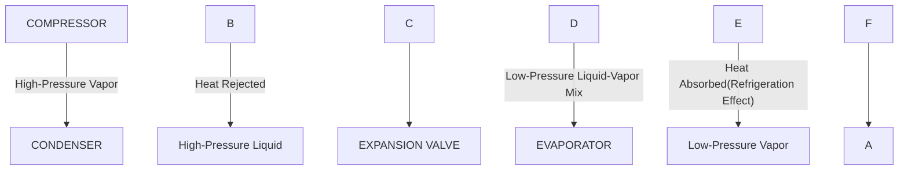
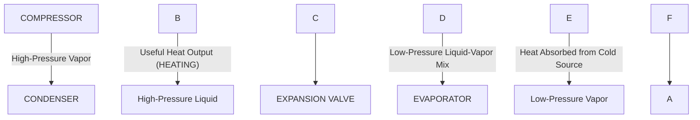

<center><h1>Part I</h1></center>

**Subject Code: 901**
**Full Marks: 200**
**Time: 4 hours**


**Part I**
Marks: 20x5=100

**1.** Write short notes with relevant diagrams (any four): **5x4=20**
(a) Flow measuring instrument. 4
(b) Vapour compression refrigeration system. 4
(c) Shear force and bending moment diagram of a cantilever beam with gradually varying load. 4
(d) Submersible pump. 4
(e) Heat pump. 4
(f) Induced draught. 4

**2.**
(a) Define a steam boiler. **2**
(b) Name the boiler accessories which assist in enhancing the thermal efficiency of a boiler. **4**
(c) What are the advantages of water tube boiler over a fire tube boiler? **5**
(d) Discuss the methods of feed water treatment of a boiler. **5**
(e) Mention the important factors which are considered while selecting the type of boiler. **4**

**3.**
(a) What are the different modes of heat transfer? Briefly explain with practical examples. **6**
(b) What is the critical thickness of insulation and how can it be determined for cylinder? Discuss the physical significance of critical thickness on cylinder surface. **6**
(c) Inside a room, the air temperature is 25°C and outside it is -5°C. The wall has a thickness of 400mm and its thermal conductivity is 1.0w/(m°K). The heat transfer co-efficient on both sides has the value of 5.0w/(m²K). Determine the heat flux. Also determine the temperature gradient in the wall. **10**

**4.**
(a) Draw and explain a general layout of a hydroelectric power plant. **7**
(b) A user is doubtful about the Bourdon type pressure gauge reading. How will you verify the gauge reading? Explain. **6**
(c) A venturimeter is used to measure flow rate of 7,500 litre per minute. The difference in pressure across the venturimeter is equivalent to 8m of flowing fluid. Determine the throat diameter if the pipe diameter is 30cm. Assume that the coefficient of discharge for the venturimeter is 0.96. **7**

**5.**
(a) Draw the block diagram of a vapour absorption refrigeration system and explain its working principle. **8**
(b) A refrigerating unit takes 1.0 hour to produce 600 kg of ice from water at 30°C. During this time the machine consumes 25kwh of energy. Find (i) The capacity of the machine in TOR, and (ii) COP. **8**
(c) Why is subcooling important for vapour compression refrigeration system? Explain with diagram. **4**

**6.**
(a) ‘Zeroth Law of thermodynamics gives us the idea about thermometer.’—Explain. **4**
(b) What is Clausius inequality? Show that the Clausius Inequality is negative for irreversible cycle and is equal to zero for reversible cycle. **5**
(c) What is perpetual motion machine of the first (PMM-I) kind? Explain its possibility in case of real world. **5**
(d) ‘A violation of Clausius Statement of second law of thermodynamics implies the violation of Kelvin-Plank statement and vice-versa.’—Explain with example. **6**

**7.**
(a) Define fit. **2**
(b) Describe three types of fits. **6**
(c) What is meant by ‘hole basis’ and ‘shaft basis’? Which one is preferred and why? **6**
(d) Mention different types of power threads. Discuss their relative advantages and disadvantages. **6**

***

<center><h1>Part II</h1></center>

Marks: 4x5=20

**8.** Write short notes (any five): **4x5=20**
(a) Condensation number, (b) Different types of sensing elements, (c) Regression analysis, (d) Laser beam welding, (e) Technology management, (f) Tool geometry, (g) Universal chuck, (h) Shear angle.

**9.**
(a) Discuss the concept and nature of personnel management. How does personnel management contribute to the optimum utilization of human resources of an organisation? **7**
(b) What is span of control? Suggest the form of organisation for a construction project with explanation. **6**
(c) Explain research cost and research risk. Is research a cost or an investment in an organisation? Give reasons in favour of your opinion. **7**

**10.**
(a) What is centrifugal casting? Describe the main features and advantages of centrifugal casting. **5**
(b) Mention the common drilling operations in manufacturing process. Describe and designate the principle units of vertical drill press. **5**
(c) How are shaping and planning alike? Write the advantages and disadvantages of shaping and planning as compared to other operations. **5**
(d) Briefly describe the working principle of resistance welding. **5**

**11.**
(a) What are the causes and effects of vibration? **4**
(b) Explain why only a part of unbalanced force due to reciprocating masses is balanced by removing mass. **10**
(c) Write short notes on primary and secondary balancing. **6**

**12.**
(a) Explain briefly accuracy and precision. What are the requirements of accurate measuring instruments? **6**
(b) Describe non-destructive testing (NDT). Compare NDT with conventional techniques. **7**
(c) Why is surface finish very important in engineering applications? Describe two methods of testing flatness of surface mentioning the advantages and limitations. **7**

**13.**
(a) Draw the P-V and T-S diagrams of an air standard diesel cycle and explain. Also discuss the deviations of actual cycle compared with air standard cycle. **8**
(b) A diesel engine has a compression ratio of 20 and cut-off takes place at 5% of the stroke. Find the air-standard efficiency. **6**
(c) What is compression ratio in IC engine? Calculate the clearance volume in percent of displacement for air-standard Otto cycle having an efficiency of 50%. **6**

**14.**
(a) With necessary diagrams deduce the working principle of regenerative gas turbine and explain the effectiveness of regenerator for an ideal regenerative Bryton cycle. **6**
(b) What is staging in steam turbine and why is it done? Explain different types of staging with necessary diagrams. **4**
(c) Briefly explain an ideal reheat Rankine cycle with block diagram and corresponding T-S plane. **4**
(d) A synchronous generator is to supply power at 50Hz. If a turbine rotating at a speed of 300rpm is to rotate generator at 750rpm through a gearbox, determine the gear ratio and number of poles of the generator. **6**

***
***
---

<center><h1>PART I</center></h1>

### **1. Write short notes with relevant diagrams:**

**(a) Flow Measuring Instrument (Venturi Meter)**

A flow measuring instrument is a device used to measure the rate of fluid flow (volumetric or mass flow rate) in a pipe or open channel. A common example is the **Venturi meter**.

**Principle:** The Venturi meter works on the principle of Bernoulli's equation, which states that for an incompressible fluid flow, an increase in velocity results in a decrease in pressure.

**Construction and Working:**
*   It consists of a short converging section, a straight section of minimum diameter called the **throat**, and a longer diverging section.
*   As the fluid flows from the inlet through the converging section, its velocity increases, and according to Bernoulli's principle, its pressure decreases. The pressure is at its minimum at the throat.
*   The fluid then flows through the diverging section, where it slows down, and its pressure is recovered.
*   By measuring the pressure difference between the inlet and the throat using a manometer, the flow rate can be calculated. A larger pressure difference indicates a higher flow rate.

**Diagram:**
```
      MANOMETER
         |      |
      P1 |      | P2
         |      |
         |------| h (Pressure Difference)
         |      |
  =======\ ____ /=======
  FLOW ->        -> FLOW
  =========/---\=========
           |   |
  Inlet    Throat  Diverging
 Section          Section
```
*   **P1:** Pressure at the inlet
*   **P2:** Pressure at the throat
*   **h:** Piezometric head difference, which is proportional to the flow rate.

---

**(b) Vapor Compression Refrigeration System (VCRS)**

The Vapor Compression Refrigeration System (VCRS) is the most widely used refrigeration cycle. It works by circulating a refrigerant through a closed loop, causing it to change its state (liquid to gas and back) to absorb heat from a cold space and reject it to a warmer space.

!\[\[Pasted image 20250813214957.png | 1000]]


**Components and Process:**
The system has four main components:
1.  **Compressor:** Takes low-pressure, low-temperature refrigerant vapor and compresses it into a high-pressure, high-temperature superheated vapor.
2.  **Condenser:** The high-pressure vapor flows into the condenser, where it rejects heat to the surroundings (e.g., air or water) and condenses into a high-pressure liquid.
3.  **Expansion Valve:** The high-pressure liquid refrigerant passes through the expansion valve, where its pressure and temperature drop drastically.
4.  **Evaporator:** The low-pressure, low-temperature liquid refrigerant enters the evaporator. It absorbs heat from the space to be cooled, causing it to boil into a low-pressure vapor. This vapor then returns to the compressor, and the cycle repeats.

**Diagram:**



---

**(c) Shear Force and Bending Moment Diagram of a Cantilever Beam with Gradually Varying Load**

A cantilever beam is fixed at one end and free at the other. A gradually varying load (GVL) is a distributed load whose intensity changes linearly. A common case is a triangular load, increasing from zero at the free end to a maximum intensity 'w' (N/m) at the fixed end.

**Analysis:**
Let the length of the beam be 'L'.
*   **Total Load (W):** Area of the triangular load = $$\frac{1}{2} \times base \times height = \frac{wl}{2}$$

**Shear Force (SF):**
*   The shear force at any section 'x' from the free end is the area of the load diagram up to that point. The relationship is parabolic (SF $\propto$ x²).
*   SF at free end (x=0) = 0.
*   SF at fixed end (x=L) = -Total Load = $-\frac{(wL)}{2}$
*   The SF diagram is a **parabolic curve (2nd degree)**.

**Bending Moment (BM):**
*   The bending moment at any section 'x' is the integral of the shear force. The relationship is cubic (BM $\propto$ x³).
*   BM at free end (x=0) = 0.
*   BM at fixed end (x=L) = -(Total Load) × (Distance of centroid from fixed end) = $$-\[\frac{wL}{2}] \times \frac{L}{3} = -\frac{wL^2}{6}$$
*   The BM diagram is a **cubic parabola (3rd degree)**. The moment is negative (hogging).

**Diagram:**
```
          //FIXED WALL//
         +-----------------+
         | \ w (N/m)       |
         |  \              |
         |   \             | -> Free End
         |    \            |
         +-----------------+
                 L
       <------------------->
          LOAD DIAGRAM

          0
         /-----------------| x-axis
        /
       / (Parabolic Curve)
      /
     /
    + -(wL)/2
          SHEAR FORCE DIAGRAM (SFD)

          0
         /-----------------| x-axis
        /
       / (Cubic Curve)
      /
     /
    + -wL²/6
          BENDING MOMENT DIAGRAM (BMD)
```

---

**(d) Submersible Pump**

A submersible pump is a device that has a hermetically sealed motor close-coupled to the pump body. The entire assembly is submerged in the fluid to be pumped.

**Principle and Working:**
*   It is a type of centrifugal pump. The motor drives an impeller, which rotates at high speed.
*   This rotation imparts kinetic energy to the fluid, pushing it outwards into a diffuser.
*   The diffuser converts the kinetic energy into pressure energy, forcing the fluid up the discharge pipe.

**Advantages:**
*   **Self-Priming:** Being submerged, it does not need to be primed.
*   **Prevents Cavitation:** The pump operates with a positive suction pressure from the fluid above it, which helps prevent cavitation (formation of vapor bubbles).
*   **High Efficiency:** It pushes the fluid to the surface rather than pulling it, which requires less energy.
*   **Quiet Operation:** Being submerged, its operational noise is significantly muffled.

**Diagram:**
```
      Ground Level
       | | Discharge Pipe
       | |
 ______|_|______
|      | |      | Water Table
|      | |      |
|      | |      |
|      | |      | Borehole/Well
|      | |<-- Power Cable
|      / \      |
|     /===\     |
|    | PUMP|    | -> Submerged Pump Unit
|    |MOTOR|    |    (Pump + Motor)
|     \===/     |
|      | |      |
|------| |------| -> Intake Screen
|//////WATER////|
```

---

**(e) Heat Pump**

A heat pump is a thermal device that operates on a thermodynamic cycle to transfer heat from a colder location (the "source") to a warmer location (the "sink"). It is essentially a refrigeration system run in reverse, with the objective of heating the sink rather than cooling the source.

**Principle and Working:**
It uses the same Vapour Compression Cycle as a refrigerator.
1.  **Evaporator:** A low-pressure liquid refrigerant absorbs heat from a cold source (e.g., outside air, ground) and evaporates.
2.  **Compressor:** The resulting vapor is compressed, significantly increasing its temperature and pressure.
3.  **Condenser:** The hot, high-pressure vapor releases its heat to the indoor space to be warmed, condensing back into a liquid. This is the desired heating effect.
4.  **Expansion Valve:** The high-pressure liquid expands, cooling down and returning to the evaporator to repeat the cycle.

The performance is measured by the **Coefficient of Performance (COP)**, where COP = (Heat Delivered) / (Work Input). A typical COP is between 3 and 5, meaning it delivers 3 to 5 units of heat for every unit of electrical energy consumed.

**Diagram:**


---

**(f) Induced Draught**

Draught is the small pressure difference required to cause the flow of air and flue gases through a boiler system. **Induced draught** is a type of mechanical draught where a fan is placed at or near the exit of the boiler, before the chimney.

**Working:**
*   The **Induced Draught (ID) fan** sucks the hot flue gases from the furnace and boiler passes and pushes them out through the chimney.
*   This action creates a pressure inside the furnace and flue gas passages that is **below atmospheric pressure** (negative pressure).
*   Because the furnace is at a negative pressure, outside air is naturally "induced" or drawn into the combustion chamber to supply the oxygen needed for burning the fuel.

**Advantages:**
*   **Safety:** Since the furnace is under negative pressure, any leaks in the boiler casing will cause air to leak *in*, rather than allowing hot, toxic flue gases to leak *out* into the boiler room.
*   **Better Control:** It provides good control over the combustion process.

**Diagram:**
```
                      CHIMNEY
                         ^
                         |
      +-------+        +----+
      |  ID   |        |    |
Flue  |  FAN  |------->|    |
Gases +-------+        +----+
  ^       ^
  |       |
+---------------------+
|    BOILER PASSES    |
| (& ECONOMISER, etc.)|
+---------------------+
          ^
          |
  +-------------------+
  |      FURNACE      |
  |  (P < Atmospheric)|
  +-------------------+
          ^
          |
       Fresh Air In
```

---

### **2. Boiler Questions**

**(a) Define a steam boiler.**
A steam boiler is a closed pressure vessel in which water is heated, using heat generated from the combustion of fuel (or other heat sources), to produce steam at a pressure higher than the atmosphere. This steam is then used for power generation, industrial processes, or heating.

---

**(b) Name the boiler accessories which assist in enhancing the thermal efficiency of a boiler.**
Boiler accessories are devices that improve the efficiency and safe operation of a boiler. Those that specifically enhance thermal efficiency by recovering waste heat are:
1.  **Economiser:** A heat exchanger that captures waste heat from the exiting flue gases to preheat the incoming feedwater.
2.  **Air Preheater:** Extracts heat from the hot flue gases to preheat the air supplied to the furnace for combustion.
3.  **Superheater:** Increases the temperature of the saturated steam produced by the boiler without raising its pressure, increasing the energy content of the steam.

---

**(c) What are the advantages of a water tube boiler over a fire tube boiler?**
1.  **Higher Steam Pressure:** They can operate at much higher pressures (>160 bar) as pressure is contained within strong, small-diameter tubes.
2.  **Higher Steam Generation Rate:** They have a larger heating surface and lower water volume, enabling faster steam production.
3.  **Greater Safety:** A tube failure is far less catastrophic than the explosion of the main shell in a fire tube boiler.
4.  **Faster Response to Load Changes:** The lower water volume allows them to adjust quickly to changes in steam demand.
5.  **Higher Thermal Efficiency:** Better heat transfer rates lead to higher efficiency, especially in large-scale plants.
6.  **Flexibility in Design:** The design is more flexible for custom large-capacity applications.

---

**(d) Discuss the methods of feed water treatment of a boiler.**
Boiler feed water must be treated to prevent scaling, corrosion, and carryover. The methods are classified into external and internal treatment.

**1. External Treatment (Pre-treatment):** Treating raw water *before* it enters the boiler.
*   **Ion Exchange (Water Softening):** Removes hardness-causing minerals (calcium, magnesium) by exchanging them for sodium ions.
*   **Demineralization:** A more thorough ion exchange process that removes almost all dissolved mineral salts.
*   **Reverse Osmosis (RO):** Uses a semi-permeable membrane and pressure to remove dissolved solids and impurities.
*   **Deaeration:** Removes dissolved corrosive gases like oxygen (O₂) and carbon dioxide (CO₂) by heating the water or using a vacuum.

**2. Internal Treatment (Conditioning):** Adding chemicals directly *into* the boiler water.
*   **Scale Inhibitors:** Chemicals like phosphates react with residual hardness to form a soft sludge that can be removed via blowdown.
*   **Oxygen Scavengers:** Chemicals like sodium sulphite or hydrazine remove the last traces of dissolved oxygen to prevent pitting corrosion.
*   **Sludge Conditioners:** Polymers keep precipitated sludge particles dispersed for easy removal.

---

**(e) Mention the important factors which are considered while selecting the type of boiler.**
The selection of a suitable boiler depends on several critical factors:

1.  **Steam Requirements:** The required pressure, temperature, and quantity of steam (capacity in kg/hr or TPH). This is the most important factor.
2.  **Type of Fuel:** The availability, cost, and characteristics of the fuel (solid, liquid, or gas) will dictate the boiler and furnace design.
3.  **Operating Pressure & Temperature:** High-pressure and high-temperature requirements generally necessitate a water tube boiler.
4.  **Space Availability:** The physical space available for installation. Fire tube boilers are often more compact for smaller capacities.
5.  **Capital Cost and Operating Cost:** The initial investment cost versus the long-term running costs (fuel, maintenance, water treatment).
6.  **Load Factor:** Whether the steam demand is constant or fluctuates. Water tube boilers handle fluctuating loads better.
7.  **Safety and Environmental Regulations:** Compliance with local safety codes and emission standards is mandatory.

---

### **3.**

**(a) What are the different modes of heat transfer? Briefly explain with practical examples. \[6]**

Heat transfer is the movement of thermal energy from a hotter region to a colder region. There are three distinct modes of heat transfer:

1.  **Conduction:** This is the transfer of heat through a substance by direct molecular interaction, without any bulk movement of the material itself. In solids, it occurs through lattice vibrations and the movement of free electrons.
    *   **Principle:** Governed by Fourier's Law of Heat Conduction, $$Q = -kA \times \frac{dT}{dx}$$
    *   **Practical Examples:**
        *   A metal spoon getting hot when left in a cup of hot tea.
        *   Heat loss through the solid brick wall of a house on a cold day.
        *   The handle of a cooking pot getting hot.

2.  **Convection:** This is the transfer of heat through the movement of fluids (liquids or gases). When a fluid is heated, it becomes less dense and rises, while cooler, denser fluid sinks to take its place, creating a convection current.
    *   **Principle:** Governed by Newton's Law of Cooling, $Q = hA(T_{surface} - T_{fluid})$.
    *   **It can be of two types:**
        *   **Natural (or Free) Convection:** Fluid motion is caused by density differences (buoyancy forces). Example: Boiling water in a pot, sea and land breezes.
        *   **Forced Convection:** Fluid motion is caused by an external source like a fan, pump, or wind. Example: Using a fan to cool a computer's CPU, a car radiator.

3.  **Radiation:** This is the transfer of heat in the form of electromagnetic waves (like infrared radiation). Unlike conduction and convection, it does not require a medium and can occur through a vacuum.
    *   **Principle:** Governed by the Stefan-Boltzmann Law, `Q = εσA(T_surface⁴ - T_surroundings⁴)`.
    *   **Practical Examples:**
        *   Heat felt from the Sun, which travels through the vacuum of space.
        *   The warmth felt when standing near a campfire or bonfire.
        *   A microwave oven cooking food.

---

**(b) What is the critical thickness of insulation and how can it be determined for a cylinder? Discuss the physical significance of critical thickness on a cylinder surface. \[6]**

**Definition:**
The critical thickness of insulation corresponds to the outer radius of insulation at which the rate of heat transfer from a surface is maximum. Below this radius, adding more insulation *increases* heat loss, while above this radius, adding more insulation *decreases* heat loss.

**Determination for a Cylinder:**
Consider a cylinder of inner radius `r_i` insulated with a material of thermal conductivity `k`. The outer radius of insulation is `r_o` and the cylinder is exposed to a surrounding fluid with a convective heat transfer coefficient `h`.

The total thermal resistance (`R_total`) is the sum of conductive and convective resistances:
*   Conductive Resistance: `R_cond = ln(r_o / r_i) / (2πkL)`
*   Convective Resistance: `R_conv = 1 / (h * A_o) = 1 / (h * 2πr_o * L)`

`R_total = \[ln(r_o / r_i) / (2πkL)] + \[1 / (h * 2πr_o * L)]`

To find the radius at which heat transfer is maximum (i.e., resistance is minimum), we differentiate `R_total` with respect to `r_o` and set the derivative to zero:
`dR_total / dr_o = 0`
`\[1 / (2πkL * r_o)] - \[1 / (2πhL * r_o²)] = 0`
`1 / (k * r_o) = 1 / (h * r_o²)`
Solving for `r_o`, we get the critical radius, `r_c`:
**`r_c = k / h`**

**Physical Significance:**
The concept of critical radius is crucial in thermal engineering. Adding insulation has two opposing effects:
1.  It increases the path length for conduction, thus increasing conductive resistance.
2.  It increases the outer surface area, thus decreasing the convective resistance to the surroundings.

*   **When `r_o < r_c`:** The effect of decreasing convective resistance is greater than the effect of increasing conductive resistance. Therefore, adding insulation in this range actually *increases* the total heat loss. This principle is sometimes used to enhance cooling, for example, on thin electrical wires.
*   **When `r_o > r_c`:** The effect of increasing conductive resistance dominates. Adding more insulation *decreases* the total heat loss, which is the desired outcome for applications like insulating steam pipes or hot water tanks.

---

**(c) Inside a room, the air temperature is 25°C and outside it is -5°C. The wall has a thickness of 400mm and its thermal conductivity is 1.0 W/(m·K). The heat transfer co-efficient on both sides has the value of 5.0 W/(m²·K). Determine the heat flux. Also determine the temperature gradient in the wall. \[10]**

**Given Data:**
*   Inside air temperature, `T_i` = 25°C
*   Outside air temperature, `T_o` = -5°C
*   Wall thickness, `L` = 400 mm = 0.4 m
*   Thermal conductivity of wall, `k` = 1.0 W/(m·K)
*   Inside heat transfer coefficient, `h_i` = 5.0 W/(m²·K)
*   Outside heat transfer coefficient, `h_o` = 5.0 W/(m²·K)

**1. Determine the Heat Flux (q):**
Heat flux (`q` = Q/A) is the rate of heat transfer per unit area. It can be calculated using the overall heat transfer concept.

The total thermal resistance per unit area (`R_total`) is the sum of the individual resistances (inside convection, conduction, and outside convection).

`R_total = R_conv_i + R_cond + R_conv_o`
`R_total = (1 / h_i) + (L / k) + (1 / h_o)`

Substituting the values:
`R_total = (1 / 5.0) + (0.4 / 1.0) + (1 / 5.0)`
`R_total = 0.2 + 0.4 + 0.2`
`R_total = 0.8 m²·K/W`

Now, the heat flux `q` can be calculated as:
`q = (T_i - T_o) / R_total`
`q = (25 - (-5)) / 0.8`
`q = 30 / 0.8`
`q = 37.5 W/m²`

**The heat flux through the wall is 37.5 W/m².**

**2. Determine the Temperature Gradient in the Wall (dT/dx):**
The temperature gradient is the rate of change of temperature with respect to distance within the wall. It can be found using Fourier's Law of Heat Conduction.

`q = -k * (dT/dx)`

Rearranging the formula to solve for the temperature gradient `(dT/dx)`:
`dT/dx = -q / k`

Substituting the values:
`dT/dx = -37.5 / 1.0`
`dT/dx = -37.5 °C/m` (or K/m, since it's a difference)

**The temperature gradient in the wall is -37.5 °C/m.** The negative sign indicates that the temperature decreases as we move from the inside to the outside of the wall, which is consistent with the direction of heat flow.

---

### **4.**

**(a) Draw and explain a general layout of a hydroelectric power plant. \[7]**

A hydroelectric power plant converts the potential energy of water stored at a height into electrical energy.

**General Layout Diagram:**
```
                     RESERVOIR
                     (Water at High Potential Energy)
      +~~~~~~~~~~~~~~~~~~~~~+
      | Dam                 |
 +====|=====================|======+
 |    |   INTAKE/TRASH RACK |      |
 |    +---------------------+      |
 |                           \     |
 |                            \    | PENSTOCK
 |                             \   | (Water flows down,
 |                              \  |  gaining kinetic energy)
 |      SURGE TANK               \ |
 |        | |                      \|
 |        +-+                     VALVE HOUSE
 |                                  |
 |      POWERHOUSE                +---+
 |      +-----------------------+ | V |
 |      | TURBINE <-------------+---+
 |      |    |                  |
 |      | GENERATOR             | DRAFT TUBE
 |      +-----------------------+    |
 |          |                        |
 |          | TRANSMISSION LINES     V
 +==========+===================+====+
                               | TAILRACE
                               | (Water at Low Potential Energy)
                               +~~~~+
```

**Explanation of Components and Working:**
1.  **Dam and Reservoir:** A dam is built across a river to create a large artificial lake called a reservoir. This stores water and raises its level, creating a "head" or high potential energy.
2.  **Intake and Trash Rack:** The intake is the opening through which water enters the system. A trash rack (a screen) is placed at the intake to prevent debris like logs and rocks from entering and damaging the turbine.
3.  **Penstock:** This is a large pipe or tunnel that carries water from the reservoir down to the powerhouse. As water flows down the penstock, its potential energy is converted into kinetic energy.
4.  **Surge Tank:** A surge tank is connected to the penstock. It is a small reservoir or tank that absorbs sudden pressure surges in the penstock (known as water hammer) that occur when the turbine load changes rapidly.
5.  **Turbine:** The high-velocity water from the penstock strikes the blades of the turbine, causing it to rotate at high speed. This converts the kinetic energy of the water into mechanical (rotational) energy.
6.  **Generator:** The turbine is connected by a shaft to a generator. As the turbine rotates, it spins the generator, which converts the mechanical energy into electrical energy.
7.  **Draft Tube:** This is a diverging tube at the exit of the turbine. It slows down the exiting water, recovering some of its residual kinetic energy and thereby increasing the net head acting on the turbine.
8.  **Tailrace:** This is the channel that carries the water away from the powerhouse and back into the river downstream.

---

**(b) A user is doubtful about the Bourdon type pressure gauge reading. How will you verify the gauge reading? Explain. \[6]**

To verify or calibrate a Bourdon type pressure gauge, its readings must be compared against a known, accurate pressure standard. The most common and reliable method for this is using a **Dead Weight Tester**.

**Principle:**
A Dead Weight Tester works on the basic principle of pressure: `P = F / A`, where `P` is pressure, `F` is force, and `A` is area. It generates a precise and known pressure by applying a known force (from calibrated weights) onto a piston with a precisely known area.

**Procedure for Verification:**
1.  **Setup:** The Bourdon gauge to be tested is securely connected to the pressure port of the Dead Weight Tester. The system is filled with oil, and all air is bled from the system.
2.  **Zero Check:** With no weights on the piston, the gauge should read zero. If not, the pointer may need adjustment.
3.  **Applying Pressure:** A known, calibrated mass (`m`) is placed on the piston platter. The force `F` exerted by this mass is `F = m * g`, where `g` is the acceleration due to gravity.
4.  **Generating Pressure:** The piston is gently rotated to minimize friction as it is raised by a hand-operated screw pump until it floats freely within the cylinder. At this point, the pressure generated in the oil is precisely `P = (m * g) / A`, where `A` is the cross-sectional area of the piston.
5.  **Taking the Reading:** The reading on the Bourdon gauge is recorded and compared to the calculated pressure from the Dead Weight Tester.
6.  **Repeatability:** The process is repeated by adding more weights in increments to check the gauge's accuracy, linearity, and hysteresis (by taking readings while both increasing and decreasing the pressure) across its entire operating range.
7.  **Calibration Chart:** The results are recorded in a calibration chart, noting the standard pressure (from the tester) versus the gauge reading. Any necessary correction factors can be determined from this chart.

---

**(c) A venturimeter is used to measure a flow rate of 7,500 litres per minute. The difference in pressure across the venturimeter is equivalent to 8m of flowing fluid. Determine the throat diameter if the pipe diameter is 30cm. Assume that the coefficient of discharge for the venturimeter is 0.96. \[7]**

**Given Data:**
*   Flow Rate, `Q` = 7,500 L/min
*   Pressure Head Difference, `h` = 8 m of fluid
*   Pipe Diameter, `D1` = 30 cm = 0.3 m
*   Coefficient of Discharge, `Cd` = 0.96
*   Throat Diameter, `D2` = ?

**Step 1: Convert Flow Rate to Standard Units (m³/s)**
`Q = 7,500 L/min = (7,500 / 1000) m³/min = 7.5 m³/min`
`Q = 7.5 / 60 m³/s = 0.125 m³/s`

**Step 2: Calculate the Area of the Pipe (Inlet)**
`A1 = (π / 4) * D1²`
`A1 = (π / 4) * (0.3)² = 0.070686 m²`

**Step 3: Use the Venturimeter Discharge Formula**
The formula for discharge `Q` through a venturimeter is:
`Q = Cd * (A1 * A2) / sqrt(A1² - A2²) * sqrt(2 * g * h)`
where `A2` is the area of the throat.

**Step 4: Rearrange and Solve for A2**
Let's rearrange the formula to make it easier to solve.
`Q / (Cd * sqrt(2 * g * h)) = (A1 * A2) / sqrt(A1² - A2²)`

First, calculate the known parts:
`sqrt(2 * g * h) = sqrt(2 * 9.81 * 8) = sqrt(156.96) = 12.528 m/s`
`Cd * sqrt(2 * g * h) = 0.96 * 12.528 = 12.027`

Substitute this back into the equation:
`0.125 / 12.027 = (0.070686 * A2) / sqrt((0.070686)² - A2²)`
`0.01039 = (0.070686 * A2) / sqrt(0.004996 - A2²)`

Square both sides to eliminate the square root:
`(0.01039)² = (0.070686 * A2)² / (0.004996 - A2²)`
`1.08 × 10⁻⁴ = (0.004996 * A2²) / (0.004996 - A2²)`

Now, solve for `A2²`:
`1.08 × 10⁻⁴ * (0.004996 - A2²) = 0.004996 * A2²`
`5.396 × 10⁻⁷ - (1.08 × 10⁻⁴ * A2²) = 0.004996 * A2²`
`5.396 × 10⁻⁷ = (0.004996 + 1.08 × 10⁻⁴) * A2²`
`5.396 × 10⁻⁷ = 0.005104 * A2²`
`A2² = (5.396 × 10⁻⁷) / 0.005104 = 0.0001057`
`A2 = sqrt(0.0001057) = 0.01028 m²`

**Step 5: Calculate the Throat Diameter (D2)**
`A2 = (π / 4) * D2²`
`D2 = sqrt((4 * A2) / π)`
`D2 = sqrt((4 * 0.01028) / 3.14159) = sqrt(0.01309)`
`D2 = 0.1144 m`

`D2 = 11.44 cm`

**The throat diameter of the venturimeter is 11.44 cm.**

---

### **5.**

**(a) Draw the block diagram of a vapour absorption refrigeration system and explain its working principle. \[8]**

**Block Diagram (Ammonia-Water System):**
```
                             +-----------+
    HIGH-PRESSURE NH3 VAPOR  | CONDENSER |-----> HEAT REJECTED
                             +-----------+
                                  |
    HEAT INPUT (e.g., Waste Heat) | HIGH-PRESSURE NH3 LIQUID
           |                      |
           V                      V
     +-----------+         +-------------+
     | GENERATOR |--------->| EXP. VALVE  |
     +-----------+         +-------------+
           ^                      |
           |                      | LOW-PRESSURE NH3 LIQUID
           | WEAK SOLUTION        |
           V (NH3 + H2O)          V
     +-----------+         +-------------+
     |PRESSURE   |         | EVAPORATOR  |<----- HEAT ABSORBED
     |REDUCING   |<--------|             |      (REFRIGERATION)
     |VALVE      |         +-------------+
     +-----------+                ^
           |                      |
           V                      | LOW-PRESSURE NH3 VAPOR
      +----------+                |
      | ABSORBER |<---------------+
      +----------+
           ^                      HEAT REJECTED
           |                      <-----
           | STRONG SOLUTION
           | (NH3 + H2O)
           |
     +-----------+
     |   PUMP    |
     +-----------+
           ^
           |-----------------------> TO GENERATOR
```

**Working Principle:**
The Vapour Absorption Refrigeration (VAR) system works on the same principle as the Vapour Compression system, except that the mechanical compressor is replaced by a "thermal compressor" consisting of an **absorber, a pump, a generator, and a pressure-reducing valve**. It uses a refrigerant-absorbent pair (e.g., ammonia as refrigerant and water as absorbent).

1.  **Evaporator:** Low-pressure liquid refrigerant (ammonia) enters the evaporator. It absorbs heat from the space to be cooled and boils, turning into a low-pressure vapor. This produces the cooling effect.
2.  **Absorber:** The low-pressure ammonia vapor from the evaporator flows into the absorber, where it is readily absorbed by the absorbent (cool water). This creates a strong solution of ammonia-water. This absorption process is exothermic, so heat must be removed from the absorber.
3.  **Pump:** The strong ammonia-water solution is a liquid, so it is pumped to a high pressure using a small liquid pump, which consumes very little energy compared to a vapor compressor.
4.  **Generator:** The high-pressure strong solution is heated in the generator using an external heat source (like waste heat, solar energy, or a gas flame). This heat boils the ammonia (which has a lower boiling point than water) out of the solution, producing high-pressure ammonia vapor. The remaining weak water solution is sent back to the absorber through a pressure-reducing valve.
5.  **Condenser & Expansion Valve:** The high-pressure ammonia vapor flows to the condenser, where it rejects heat to the surroundings and condenses into a high-pressure liquid. This liquid then passes through an expansion valve, where its pressure drops, and it flows to the evaporator to repeat the cycle.

---

**(b) A refrigerating unit takes 1.0 hour to produce 600 kg of ice from water at 30°C. During this time the machine consumes 25 kWh of energy. Find (i) The capacity of the machine in TOR, and (ii) COP. \[8]**

**Given Data:**
*   Mass of ice produced, `m` = 600 kg
*   Initial water temperature, `T_initial` = 30°C
*   Final ice temperature, `T_final` = 0°C (assuming ice is formed at 0°C)
*   Time taken, `t` = 1.0 hour = 3600 seconds
*   Energy consumed (Work Input), `W_in` = 25 kWh

**Constants:**
*   Specific heat of water, `c_w` = 4.187 kJ/(kg·K)
*   Latent heat of fusion of ice, `L_f` = 335 kJ/kg
*   1 Ton of Refrigeration (TOR) = 3.517 kW

**Step 1: Calculate the Total Heat Removed (Refrigeration Effect, Q_e)**
The total heat removed has two components:
1.  Sensible heat to cool water from 30°C to 0°C (`Q_sensible`).
2.  Latent heat to freeze water at 0°C into ice at 0°C (`Q_latent`).

`Q_sensible = m * c_w * (T_initial - T_final)`
`Q_sensible = 600 kg * 4.187 kJ/(kg·K) * (30 - 0)°C`
`Q_sensible = 75,366 kJ`

`Q_latent = m * L_f`
`Q_latent = 600 kg * 335 kJ/kg`
`Q_latent = 201,000 kJ`

`Total Heat Removed, Q_e = Q_sensible + Q_latent`
`Q_e = 75,366 + 201,000 = 276,366 kJ`

**Step 2: Calculate the Capacity of the Machine in kW and TOR**
The refrigeration capacity is the rate at which heat is removed.
`Refrigeration Capacity (kW) = Q_e / t`
`Refrigeration Capacity (kW) = 276,366 kJ / 3600 s = 76.77 kW`

Now, convert this to Tons of Refrigeration (TOR):
`(i) Capacity (TOR) = Refrigeration Capacity (kW) / 3.517`
`Capacity (TOR) = 76.77 / 3.517 = 21.83 TOR`

**Step 3: Calculate the Coefficient of Performance (COP)**
The COP is the ratio of the desired output (heat removed) to the required input (work done).
`COP = Refrigeration Effect / Work Input`

First, convert the work input to the same units (kJ).
`Work Input = 25 kWh = 25 kJ/s * 3600 s = 90,000 kJ`

` (ii) COP = Q_e / Work Input`
`COP = 276,366 kJ / 90,000 kJ = 3.07`

Alternatively, using power:
`Work Input Power = 25 kWh / 1 h = 25 kW`
`COP = Refrigeration Capacity (kW) / Work Input Power (kW)`
`COP = 76.77 kW / 25 kW = 3.07`

**The capacity of the machine is 21.83 TOR and its COP is 3.07.**

---

**(c) Why is subcooling important for a vapour compression refrigeration system? Explain with a diagram. \[4]**

**Subcooling** is the process of cooling the liquid refrigerant below its saturation temperature after it has completely condensed in the condenser. It is important for two main reasons:

1.  **Increases Refrigeration Effect:** Subcooling reduces the enthalpy of the liquid refrigerant entering the expansion valve. Since the throttling process is isenthalpic, the refrigerant entering the evaporator has a lower enthalpy, which means it can absorb more heat per unit mass from the refrigerated space. This increases the net refrigerating effect and improves the system's Coefficient of Performance (COP).
2.  **Ensures Pure Liquid Entry to Expansion Valve:** Subcooling provides a safety margin, ensuring that only liquid refrigerant enters the expansion valve. If any vapor ("flash gas") enters the valve, it reduces the mass flow rate of the refrigerant and can cause improper operation of the valve, leading to reduced system efficiency and capacity.

**Diagram (Pressure-Enthalpy or P-h Diagram):**
```
      Pressure (P)
         ^
         |
         |         /-----\      Critical Point
         |        /       \
     Pc--|-------/--2-------\----Saturated Vapor Line
         |      |           |
         |      |     3'<---3--- Saturated Liquid Line
         |      |      |    |
     Pe--|------4'-----4----------
         |      ^           |
         |      |___________|
         |          1
         +---------------------------------> Enthalpy (h)

Process 1-2: Compression
Process 2-3: Condensation
Process 3-3': Subcooling
Process 3-4: Throttling (Standard Cycle)
Process 3'-4': Throttling (Subcooled Cycle)
```
**Explanation of Diagram:**
*   The standard cycle is `1-2-3-4-1`. The refrigeration effect is `h1 - h4`.
*   The cycle with subcooling is `1-2-3-3'-4'-1`. The liquid is cooled from state 3 to 3'.
*   Because `h4' < h4`, the new refrigeration effect is `h1 - h4'`.
*   The **"Increase in Refrigerating Effect"** is the difference `(h1 - h4') - (h1 - h4)`, which simplifies to `h4 - h4'`. This increase is clearly visible on the diagram, leading to a higher COP.

***

Of course. Here are the detailed answers for the final set of questions.

---

### **6.**

**(a) ‘Zeroth Law of thermodynamics gives us the idea about thermometer.’—Explain. \[4]**

The Zeroth Law of Thermodynamics states:
*If two bodies are each in thermal equilibrium with a third body, then they are also in thermal equilibrium with each other.*

**Explanation of its relation to a thermometer:**
This law provides the fundamental scientific basis for measuring temperature. Here’s how:

1.  Let Body 'A' be the object whose temperature we want to measure (e.g., a patient).
2.  Let Body 'B' be the thermometer.
3.  Let Body 'C' be a reference standard (e.g., melting ice at a defined 0°C).

When we place the thermometer (B) in contact with the patient (A), we wait until they reach **thermal equilibrium**. At this point, the thermometer's measurable property (like the height of a mercury column) stabilizes, and we take a reading.

Later, if we place the same thermometer (B) in contact with the reference standard (C) and it gives the exact same reading, the Zeroth Law allows us to conclude that Body A (the patient) and Body C (the reference standard) are at the same temperature, even though they never touched each other.

Therefore, the Zeroth Law establishes that temperature is a valid property that can be measured and compared. The thermometer acts as the "third body," allowing us to assign a numerical value to the state of thermal equilibrium.

---

**(b) What is Clausius inequality? Show that the Clausius Inequality is negative for irreversible cycle and is equal to zero for reversible cycle. \[5]**

**Clausius Inequality:**
The Clausius inequality is a mathematical statement of the Second Law of Thermodynamics, applicable to any thermodynamic cycle. It states that the cyclic integral of `δQ/T` is always less than or equal to zero.

**∮ (δQ / T) ≤ 0**

Where:
*   `∮` represents the integral over a complete cycle.
*   `δQ` is the infinitesimal heat transferred to the system.
*   `T` is the absolute temperature of the boundary where the heat transfer occurs.

**Proof and Explanation:**
Consider a system undergoing any cycle (reversible or irreversible) and exchanging heat with a series of thermal reservoirs. We connect this system to a reversible heat engine operating between each reservoir and a common reference reservoir at temperature `T₀`.

The combined system (original cycle + reversible engine) now exchanges heat only with the single reservoir at `T₀`.
According to the First Law for the combined system, `ΔU = 0`, so `W_net = Q_net`.
The net work done by the combined system `(W_net)` is equal to the net heat it receives from the reservoir at `T₀`.

According to the Kelvin-Planck statement, a device operating in a cycle cannot produce net work by exchanging heat with only a single reservoir. Therefore, the net work of our combined system must be less than or equal to zero.
**`W_net ≤ 0`**

From the properties of a reversible engine, the work it does is related to the heat transfers. Summing over the entire cycle, this leads to the relation:
**`W_net = T₀ * ∮ (δQ / T)`**

Combining the two results:
`T₀ * ∮ (δQ / T) ≤ 0`

Since `T₀` (absolute temperature) is always positive, we must have:
**`∮ (δQ / T) ≤ 0`** (This is the Clausius Inequality)

*   **For a Reversible Cycle:** A reversible cycle can be run in reverse. If we reverse the cycle, `δQ` changes sign, and the inequality becomes `∮ (-δQ / T) ≤ 0`, which means `∮ (δQ / T) ≥ 0`. The only way for `∮ (δQ / T)` to be both less than or equal to zero and greater than or equal to zero is for it to be exactly zero.
    *   **Therefore, for a reversible cycle: ∮ (δQ / T) = 0**

*   **For an Irreversible Cycle:** An irreversible cycle cannot be run in reverse. The presence of irreversibilities (like friction) always leads to a loss of work potential. Thus, the net work done by the combined system will be negative (`W_net < 0`, meaning work is consumed). This leads directly to the strict inequality.
    *   **Therefore, for an irreversible cycle: ∮ (δQ / T) < 0**

---

**(c) What is perpetual motion machine of the first (PMM-I) kind? Explain its possibility in case of real world. \[5]**

**Definition:**
A Perpetual Motion Machine of the First Kind (PMM-I) is a hypothetical device that continuously produces work without consuming any energy from an external source. In other words, it is a machine that creates energy from nothing.

**Violation of Law:**
A PMM-I violates the **First Law of Thermodynamics**, which is the principle of conservation of energy. The First Law for a system undergoing a cycle states that the net work done (`∮δW`) is equal to the net heat supplied (`∮δQ`).
`∮δQ = ∮δW`

For a PMM-I, the device produces work (`∮δW > 0`) without any heat input (`∮δQ = 0`). This would mean `0 = (a positive value)`, which is a clear contradiction of the law of conservation of energy.

**Possibility in the Real World:**
A PMM-I is **impossible** in the real world. The law of conservation of energy is one of the most fundamental and rigorously tested principles in all of science. Every real machine or process requires an energy input to produce a work output. Furthermore, all real machines suffer from energy losses due to factors like friction and heat dissipation, meaning the useful work output is always less than the energy input. No machine has ever been built that can create energy, and the First Law of Thermodynamics confirms that none ever will.

---

**(d) ‘A violation of Clausius Statement of second law of thermodynamics implies the violation of Kelvin-Plank statement and vice-versa.’—Explain with example. \\[6]**

The Clausius and Kelvin-Planck statements are two different formulations of the Second Law of Thermodynamics, but they are entirely equivalent. The violation of one automatically implies the violation of the other.

**Case 1: Violation of Clausius Statement implies Violation of Kelvin-Planck**

1.  **Assumption:** Assume the Clausius statement is false. This means we can build a refrigerator (let's call it $Ref_V$) that transfers heat $Q_L$ from a low-temperature reservoir ($T_L$) to a high-temperature reservoir ($T_H$) with **no work input**.
2.  **Setup:** Combine this $Ref_V$ with a standard heat engine ($HE$) operating between the same two reservoirs. The $HE$ takes heat $Q_H$ from $T_H$, produces work $W = Q_H - Q_L$, and rejects heat $Q_L$ to $T_L$.
3.  **Analysis:** Arrange it so that the heat `Q_L` rejected by the engine is the same heat `Q_L` absorbed by the violating refrigerator. The net effect on the cold reservoir `T_L` is zero. The combined system now draws a net amount of heat `(Q_H - Q_L)` from the *single* hot reservoir `T_H` and converts it entirely into work `W`.
4.  **Conclusion:** This combined device violates the Kelvin-Planck statement, which says it's impossible to create a device that produces net work by exchanging heat with only a single reservoir.

**Case 2: Violation of Kelvin-Planck Statement implies Violation of Clausius**

1.  **Assumption:** Assume the Kelvin-Planck statement is false. This means we can build a heat engine (`HE_V`) that takes heat `Q_H` from a hot reservoir `T_H` and converts it **100% into work** (`W = Q_H`), with no heat rejected.
2.  **Setup:** Use the work `W` produced by this violating engine (`HE_V`) to drive a standard refrigerator (`Ref`). This refrigerator will draw heat `Q_L` from the cold reservoir `T_L` and reject heat `(Q_L + W)` to the hot reservoir `T_H`.
3.  **Analysis:** The work produced by `HE_V` is entirely consumed by `Ref`, so there is no net work interaction with the surroundings. The hot reservoir `T_H` gives `Q_H` to `HE_V` and receives `(Q_L + W)` from `Ref`. Since `W = Q_H`, the net heat rejected to the hot reservoir is `(Q_L + Q_H) - Q_H = Q_L`. The cold reservoir gives up heat `Q_L`.
4.  **Conclusion:** The net effect of this combined system is to transfer heat `Q_L` from the cold reservoir `T_L` to the hot reservoir `T_H` with **no external work input**. This violates the Clausius statement.

Therefore, the two statements are logically equivalent.

---

### **7.**

**(a) Define fit. \[2]**

Fit is the relationship between two mating parts, such as a hole and a shaft, that results from the difference between their sizes before assembly. It defines the degree of tightness or looseness between them.

---

**(b) Describe three types of fits. \[6]**

The three main types of fits are Clearance, Interference, and Transition.

1.  **Clearance Fit:**
    *   **Description:** In this type of fit, there is always a gap or "clearance" between the hole and the shaft. The tolerance zone of the hole is entirely above the tolerance zone of the shaft.
    *   **Condition:** The maximum size of the shaft is always smaller than the minimum size of the hole.
    *   **Application:** Used for parts that must move or rotate relative to each other, such as a shaft rotating in a bearing bush.

2.  **Interference Fit:**
    *   **Description:** In this type of fit, the shaft is always larger than the hole, resulting in an "interference." The tolerance zone of the shaft is entirely above the tolerance zone of the hole. Assembly requires force (press-fit) or thermal expansion/contraction (shrink-fit).
    *   **Condition:** The minimum size of the shaft is always larger than the maximum size of the hole.
    *   **Application:** Used for permanent or semi-permanent assemblies that need to transmit torque or prevent relative motion, like fitting a bearing into a housing.

3.  **Transition Fit:**
    *   **Description:** This type of fit may result in either a clearance or an interference, depending on the actual sizes of the specific hole and shaft being mated. The tolerance zones of the hole and the shaft overlap.
    *   **Condition:** The tolerance zones overlap.
    *   **Application:** Used where accurate location is important but a small amount of either clearance or interference is permissible, such as for spigots, couplings, and locating dowels.

---

**(c) What is meant by ‘hole basis’ and ‘shaft basis’? Which one is preferred and why? \[6]**

**Definitions:**
*   **Hole Basis System:** In this system, the size of the hole is kept as the basic size (its lower deviation is zero, designated 'H'). Different fits (clearance, transition, interference) are achieved by varying the size of the shaft.
*   **Shaft Basis System:** In this system, the size of the shaft is kept as the basic size (its upper deviation is zero, designated 'h'). Different fits are achieved by varying the size of the hole.

**Preferred System and Reasons:**
The **Hole Basis System** is overwhelmingly preferred in industry. The reasons are:

1.  **Manufacturing Economy:** It is significantly easier and more economical to manufacture shafts to various precise external diameters using processes like turning and grinding. In contrast, producing accurate internal holes of various sizes is more difficult and expensive.
2.  **Standard Tooling:** Standard tools for producing holes, such as drills and reamers, are available in fixed, standard sizes. It is much cheaper to use these standard tools for all holes and vary the shaft size than to procure a wide range of custom-sized hole-making tools.
3.  **Simplified Gauging:** With a hole basis system, a smaller inventory of standard plug gauges is required to check the holes. The more easily varied shafts can then be checked with adjustable gauges like micrometers or snap gauges.

---

**(d) Mention different types of power threads. Discuss their relative advantages and disadvantages. \[6]**

Power threads (or power screws) are designed to transmit power and motion. The main types are:

1.  **Square Thread:**
    *   **Description:** Has a square cross-section, with flanks perpendicular to the screw axis.
    *   **Advantages:**
        *   Highest efficiency of all thread forms because there is no radial or "bursting" pressure on the nut.
        *   No side thrust. Ideal for transmitting power.
    *   **Disadvantages:**
        *   Difficult and expensive to manufacture due to the sharp corners.
        *   Cannot be easily compensated for wear.

2.  **Acme Thread:**
    *   **Description:** Has a trapezoidal shape with a 29° included angle.
    *   **Advantages:**
        *   Much easier to manufacture (cut) than a square thread.
        *   Stronger at the root than a square thread.
        *   Wear can be compensated for by using a split nut.
    *   **Disadvantages:**
        *   Lower efficiency than a square thread due to the thread angle, which introduces friction and a bursting pressure on the nut.

3.  **Buttress Thread:**
    *   **Description:** An asymmetric thread where one flank is perpendicular to the axis (like a square thread) and the other is angled (e.g., at 45°).
    *   **Advantages:**
        *   Combines the high efficiency of a square thread with the strength of an Acme thread.
        *   Ideal for transmitting very high axial loads in **one direction only**.
    *   **Disadvantages:**
        *   It is unidirectional; it can only support high loads on the perpendicular flank. Used in applications like screw jacks and vices where the load is always applied in the same direction.

***
***

<center><h1>PART II</center></h1>


Of course. Here are the detailed answers for questions 8, 9, 10, and 11.

---

### **8. Write short notes (any five):**

**(a) Condensation Number (Co)**
The Condensation number is a dimensionless parameter used in the study of heat transfer, specifically in the analysis of film condensation on a vertical plate. It represents the ratio of surface tension forces to viscous forces within the condensate film. It is defined as:
**Co = (μ² / (ρ * σ * g * Y³)) ^ (1/2)**
where:
*   `μ` is the dynamic viscosity of the liquid
*   `ρ` is the density of the liquid
*   `σ` is the surface tension
*   `g` is the acceleration due to gravity
*   `Y` is a characteristic length

The Condensation number helps in correlating experimental data for heat transfer during condensation and is a part of more complex correlations that account for the effects of ripples and waves on the surface of the condensate film.

---

**(b) Different Types of Sensing Elements**
A sensing element (or transducer) is a device that detects a physical quantity and converts it into a signal that can be measured or recorded, typically an electrical signal. Different types are designed for different physical phenomena:

1.  **Temperature Sensing:**
    *   **Thermocouple:** Works on the Seebeck effect, where a voltage is produced when two dissimilar metals are joined at two different temperatures.
    *   **Resistance Temperature Detector (RTD):** Works on the principle that the electrical resistance of a metal (like platinum) changes predictably with temperature.
2.  **Pressure Sensing:**
    *   **Bourdon Tube:** A C-shaped, sealed tube that tends to straighten when pressurized, causing a linked pointer to move.
    *   **Diaphragm:** A flexible membrane that deflects under pressure, and this deflection is measured.
3.  **Displacement/Position Sensing:**
    *   **Linear Variable Differential Transformer (LVDT):** A non-contact sensor that measures linear displacement by detecting the change in magnetic coupling between primary and secondary coils as a core moves.
4.  **Flow Sensing:**
    *   **Orifice Plate/Venturi Meter:** Creates a pressure differential in a fluid flow, which can be measured and related to the flow rate.

---

**(c) Regression Analysis**
Regression analysis is a statistical method used to model the relationship between a dependent variable and one or more independent variables. The primary goal is to find the "best-fit" line or curve that describes how the dependent variable changes as the independent variables change.

*   **Purpose:** It is used for prediction and forecasting. Once a relationship is established, one can predict the value of the dependent variable for a given set of independent variables.
*   **Method:** The most common method is the **least squares method**, which minimizes the sum of the squared differences (residuals) between the observed values and the values predicted by the model.
*   **Example:** A simple linear regression might model house prices (dependent variable) based on house size (independent variable), resulting in an equation like `Price = m * (Size) + c`.

**Diagram:**
```
     ^ Price
     |
     |        .
     |       . .
     |      .   .
     |     / . .
     |    /.
     |   .
     |  .
     +----------------> Size
       Scatter Plot with a Best-Fit Regression Line
```

---

**(d) Laser Beam Welding (LBW)**
Laser Beam Welding is a high-energy beam welding process that uses a precisely focused beam of laser light to melt and fuse materials together.

*   **Working Principle:** A high-intensity laser beam is directed and focused onto the joint between the workpieces. The concentrated energy rapidly heats, melts, and vaporizes the material, creating a deep, narrow "keyhole." As the laser beam moves along the joint line, the molten material flows behind it and solidifies, forming a strong weld.
*   **Advantages:**
    *   High welding speed and deep penetration.
    *   Very narrow weld bead and a small Heat Affected Zone (HAZ), which minimizes distortion.
    *   High precision, suitable for delicate components.
    *   Can weld dissimilar materials.
*   **Disadvantages:**
    *   High capital equipment cost.
    *   Requires strict safety precautions due to the high-intensity laser.

**Diagram:**
```
        Laser Beam
            |
            V
       +----------+
       | Focusing |
       |   Lens   |
       +----------+
            |
            V <--- Shielding Gas
      +=============+
      |  Workpiece  |---> Molten Pool / Keyhole
      +=============+
```

---

**(f) Tool Geometry**
Tool geometry refers to the specific angles and shapes of a cutting tool's faces and edges. Proper geometry is crucial for efficient cutting, good surface finish, and long tool life. It is often described by a series of angles in a standard format called the **tool signature**.

Key elements include:
1.  **Rake Angle (α):** The angle of the tool's rake face (the surface the chip flows over). A positive rake angle reduces cutting forces and power consumption but weakens the tool tip. A negative rake angle is used for hard materials and interrupted cuts.
2.  **Clearance (or Relief) Angle (γ):** The angle between the flank face of the tool and the newly cut work surface. It prevents the tool from rubbing against the workpiece, which would cause friction and wear.
3.  **Cutting Edge Angles:** These angles determine the shape of the tool nose and how the tool engages with the workpiece.

**Diagram of a Single-Point Cutting Tool:**
```
           <-- Rake Angle (α)
         \ | /
          \|/ Chip Flow
    +------V----------+
    |   Rake Face     | Tool
    +-----------------+
    |  Flank Face | / <-- Clearance Angle (γ)
    +-------------+/
                    Workpiece
```

---

### **9.**

**(a) Discuss the concept and nature of personnel management. How does personnel management contribute to the optimum utilization of human resources of an organisation? \[7]**

**Concept and Nature of Personnel Management:**
Personnel management (now often called Human Resource Management or HRM) is the part of management concerned with the "people" dimension of an organization. It involves the planning, organizing, directing, and controlling of the procurement, development, compensation, integration, and maintenance of human resources to achieve individual, organizational, and societal objectives.

**Nature:**
*   **People-Oriented:** It focuses on managing people at work, their relationships, and their well-being.
*   **Continuous Function:** It is not a one-time task but a continuous process of managing the workforce.
*   **Pervasive Function:** It is a responsibility of all managers in an organization, not just the HR department.
*   **Action-Oriented:** It focuses on solving human-related problems to achieve organizational goals.

**Contribution to Optimum Utilization of Human Resources:**
Personnel management ensures that human resources are used effectively and efficiently in the following ways:

1.  **Effective Recruitment and Selection:** By using scientific methods to hire the right people with the right skills for the right jobs, it ensures that the organization has a competent workforce from the start.
2.  **Training and Development:** It identifies skill gaps and provides necessary training to improve employee performance, productivity, and adaptability to new technologies.
3.  **Performance Appraisal:** Systematic evaluation of employee performance provides feedback for improvement and forms the basis for promotions and rewards, motivating employees to perform better.
4.  **Motivation and Morale:** By designing fair compensation systems, providing good working conditions, and addressing employee grievances, it keeps employee morale and motivation high, leading to increased productivity and lower turnover.
5.  **Effective Industrial Relations:** It helps in maintaining harmonious relationships between management and employees, minimizing conflicts, strikes, and lockouts, which ensures smooth and uninterrupted production.

---

**(b) What is span of control? Suggest the form of organisation for a construction project with explanation. \[6]**

**Span of Control:**
Span of control (or span of management) refers to the number of subordinates that a manager or supervisor can directly and effectively manage. The span can be:
*   **Narrow:** A manager supervises a small number of subordinates. This leads to a "tall" organizational structure with many hierarchical levels.
*   **Wide:** A manager supervises a large number of subordinates. This leads to a "flat" organizational structure with fewer levels.

**Suggested Organization for a Construction Project:**
For a construction project, a **Matrix Organizational Structure** is often the most suitable form. This structure combines a traditional functional hierarchy with a project-based team structure.

**Explanation:**
A construction project is complex, temporary, and requires collaboration between various specialists (e.g., civil engineers, architects, electrical engineers, plumbers, surveyors).

*   In a matrix structure, a **Project Manager** is given the authority to lead the project team.
*   Team members are drawn from different functional departments (e.g., the electrical department "lends" an engineer to the project).
*   These team members report to **two bosses**: their functional department head (for administrative and technical standards) and the project manager (for project-specific tasks and deadlines).

**Why it's suitable:**
1.  **Flexibility:** It allows the organization to assemble a skilled team specifically for the project and disband it upon completion.
2.  **Improved Communication:** It breaks down departmental silos and encourages direct communication between specialists, which is vital for quick problem-solving on a construction site.
3.  **Efficient Resource Use:** Specialist resources (like a senior structural engineer) can be shared across multiple projects.
4.  **Focus on Project Goals:** The Project Manager provides a single point of focus and responsibility for achieving the project's objectives on time and within budget.

---

**(c) Explain research cost and research risk. Is research a cost or an investment in an organisation? Give reasons in favour of your opinion. \[7]**

**Research Cost:** This refers to all the direct and indirect expenses incurred by an organization in conducting research and development (R&D) activities. This includes salaries of researchers, cost of materials and supplies, expenditure on laboratory equipment, and overheads.

**Research Risk:** This is the uncertainty associated with R&D. It has two main components:
1.  **Technical Risk:** The risk that the research project will fail to achieve its scientific or technical objectives (e.g., a new drug is found to be ineffective).
2.  **Commercial Risk:** The risk that even if the research is technically successful, the resulting product will not be commercially viable or profitable (e.g., a competitor launches a better product first, or the market doesn't want it).

**Is Research a Cost or an Investment?**
In my opinion, research should be treated as an **investment**, not merely a cost.

**Reasons:**
1.  **Future-Oriented with Expectation of Return:** A cost is an expenditure for a current benefit. An investment is an expenditure made with the expectation of generating future returns. The fundamental purpose of R&D is to create future revenue streams through new products, improved processes, or market leadership.
2.  **Creation of Valuable Assets:** Successful research creates valuable intangible assets for the organization, such as patents, copyrights, and proprietary knowledge (trade secrets). These assets provide a long-term competitive advantage and can be licensed or sold.
3.  **Essential for Long-Term Survival and Growth:** In a competitive market, companies that do not invest in R&D will eventually be overtaken by more innovative rivals. Research is not just about spending money; it's about securing the future viability and growth of the organization.
4.  **Drives Competitive Advantage:** Investment in R&D is a primary driver of innovation, which allows a company to differentiate its products, reduce production costs, and maintain a strong position in the market.

While research has costs and risks, its strategic intent and potential to generate long-term value make it a crucial investment for any forward-thinking organization.

---

### **10.**

**(a) What is centrifugal casting? Describe the main features and advantages of centrifugal casting. \[5]**

**Centrifugal Casting:**
Centrifugal casting is a process where molten metal is poured into a rotating mold. The high-speed rotation generates strong centrifugal forces that push the molten metal against the inner walls of the mold, where it solidifies.

**Main Features:**
*   **Rotational Mold:** The mold rotates about its own axis at high speeds (300-3000 RPM).
*   **Forced Solidification:** The centrifugal force distributes the metal evenly and forces it to solidify under pressure.
*   **Impurity Segregation:** Lighter impurities, such as slag and dross, are less dense and get forced towards the center (inner diameter) of the casting, where they can be machined away.
*   **Coreless Process:** It is naturally suited for producing hollow cylindrical parts without the need for a core.

**Advantages:**
1.  **High Density and Purity:** The pressure from the centrifugal force creates a very dense casting with a fine-grained structure, free from porosity.
2.  **Improved Mechanical Properties:** The resulting castings have superior strength and durability compared to static castings.
3.  **Excellent for Hollow Parts:** It is the ideal method for producing hollow cylindrical objects like pipes, tubes, bushings, and engine cylinder liners.
4.  **Good Dimensional Accuracy:** The process yields parts with good surface finish and dimensional accuracy.

---

**(b) Mention the common drilling operations in manufacturing process. Describe and designate the principle units of vertical drill press. \[5]**

**Common Drilling Operations:**
1.  **Drilling:** Creating a new round hole in a workpiece using a drill bit.
2.  **Reaming:** Slightly enlarging a previously drilled hole to give it a very smooth finish and highly accurate diameter.
3.  **Tapping:** Cutting internal threads in a hole using a tool called a tap.
4.  **Counterboring:** Enlarging the top part of a hole to a specific diameter and depth, creating a square shoulder to seat a bolt head or nut.
5.  **Countersinking:** Creating a cone-shaped (chamfered) opening at the top of a hole, typically to accommodate the head of a flat-head screw.

**Principle Units of a Vertical Drill Press:**
1.  **Base:** The heavy foundation of the machine that provides stability.
2.  **Column:** The vertical pillar that supports the table and the drill head.
3.  **Table:** The platform that supports the workpiece. It can be raised, lowered, and sometimes tilted.
4.  **Drill Head:** Contains the electric motor, pulleys/gears for changing speeds, and the spindle mechanism.
5.  **Spindle:** The rotating shaft that holds the drill chuck and the cutting tool.
6.  **Quill and Feed Handle:** The quill is a sleeve that allows the rotating spindle to be moved up and down. This vertical movement (feed) is controlled manually by the operator using the feed handle.

---

**(c) How are shaping and planning alike? Write the advantages and disadvantages of shaping and planning as compared to other operations. \[5]**

**Similarities between Shaping and Planning:**
*   **Function:** Both are used to produce flat surfaces.
*   **Tool:** Both use a single-point cutting tool.
*   **Mechanism:** Both use a reciprocating (back-and-forth) cutting motion, where cutting occurs in the forward stroke and the return stroke is idle.

The key difference is that in a **shaper**, the tool reciprocates while the workpiece is stationary, whereas in a **planner**, the large workpiece reciprocates while the tool is stationary.

**Advantages and Disadvantages (Compared to Milling, etc.):**
*   **Advantages:**
    *   **Low Tool Cost:** Single-point cutting tools are much cheaper to produce and maintain than complex milling cutters.
    *   **Simplicity:** The machines and setups are generally simpler than for milling operations.
    *   **Versatility for Simple Shapes:** Very effective for producing simple flat surfaces, keyways, and slots.

*   **Disadvantages:**
    *   **Low Productivity:** The reciprocating motion with an idle return stroke makes them much slower than continuous cutting operations like milling. They are not suitable for mass production.
    *   **Lower Surface Finish:** Can leave tool marks and generally produces a lower quality surface finish compared to grinding or fine milling.
    *   **Inefficient Use of Time:** About half the operating time is non-productive (the return stroke).

---

**(d) Briefly describe the working principle of resistance welding. \[5]**

The working principle of resistance welding is based on **Joule's Law of Heating**, which states that the heat generated (`H`) is proportional to the square of the current (`I`), the resistance of the material (`R`), and the time the current flows (`t`).
**H = I²RT**

**Working Steps:**
1.  **Clamping:** The workpieces to be joined are clamped between two copper electrodes, which apply a mechanical force or pressure.
2.  **Current Application:** A very high electrical current (typically thousands of amperes) at a low voltage is passed through the electrodes and the workpieces for a short, controlled duration.
3.  **Heat Generation:** The electrical resistance is highest at the interface between the two workpieces. According to Joule's law, this point of highest resistance generates the most intense heat, causing the metal to melt and form a small molten pool called a "nugget."
4.  **Solidification:** The current is switched off, but the pressure from the electrodes is maintained for a brief moment. This allows the molten nugget to cool and solidify, creating a strong, localized weld joint.

The most common form of resistance welding is **spot welding**.

---

### **11.**

**(a) What are the causes and effects of vibration? \[4]**

**Causes of Vibration:**
1.  **Unbalanced Forces:** Unbalanced rotating or reciprocating parts in machinery (e.g., an unbalanced tire on a car, a piston in an engine).
2.  **Misalignment:** Misaligned shafts, bearings, and couplings.
3.  **External Excitation:** External forces acting on a system, such as a vehicle traveling on a rough road or wind forces on a bridge.
4.  **Fluid Flow:** Turbulent flow of fluids in pipes or around objects can induce vibration.
5.  **Dry Friction:** Stick-slip motion between two surfaces can cause self-excited vibrations.

**Effects of Vibration:**
1.  **Structural Fatigue and Failure:** Continuous cyclic stress from vibration can lead to material fatigue and eventual failure of machine parts and structures.
2.  **Noise:** Vibration of surfaces is a primary source of unwanted noise.
3.  **Wear:** It causes excessive wear on components like bearings, gears, and seals, reducing their lifespan.
4.  **Poor Performance:** It can degrade the performance and precision of machines (e.g., causing poor surface finish in a lathe).
5.  **Human Discomfort:** Exposure to vibration can be uncomfortable and harmful to human health.

---

**(b) Explain why only a part of unbalanced force due to reciprocating masses is balanced by removing mass. \[10]**

This question refers to balancing a single-cylinder engine. The unbalanced force caused by the reciprocating masses (piston, part of connecting rod) is complex.

**1. The Unbalanced Force:**
The primary unbalanced force (`F_p`) due to the reciprocating mass `m` is given by:
`F_p = m * r * ω² * cos(θ)`
where `r` is the crank radius, `ω` is the angular velocity, and `θ` is the crank angle. This force acts along the line of stroke.

**2. The Method of Balancing:**
The standard method to balance this force is to add a counter-rotating mass (`m_b`) at a radius `b` on the crankshaft, directly opposite the crank pin. This mass produces a centrifugal force `F_b = m_b * b * ω²`.

**3. The Problem/Trade-off:**
The horizontal component of this balancing force is `F_b_x = (m_b * b * ω²) * cos(θ)`.
The vertical component of this balancing force is `F_b_y = (m_b * b * ω²) * sin(θ)`.

If we choose the balancing mass such that it completely balances the primary force (`m_b * b = m * r`), then:
*   The unbalanced force along the line of stroke (horizontal) is completely cancelled out.
*   **However**, we have now introduced a *new* unbalanced force of the same magnitude (`m * r * ω² * sin(θ)`) in the perpendicular direction (vertical).

We have not eliminated the shaking force; we have merely shifted it from the horizontal to the vertical direction. This is often not an improvement.

**4. The Compromise Solution:**
Since complete balancing is not possible with this method, a compromise is made. Instead of balancing the entire reciprocating mass, we only balance a fraction 'c' of it (where `c` is typically between 1/2 and 2/3).

So, the balancing mass is chosen such that:
**`m_b * b = c * m * r`**

**5. The Result of Partial Balancing:**
*   **Resultant Horizontal Force:** The primary force (`m * r * ω² * cos(θ)`) is opposed by the balancing force component (`c * m * r * ω² * cos(θ)`). This leaves a remaining, smaller unbalanced horizontal force of `(1-c) * m * r * ω² * cos(θ)`.
*   **Resultant Vertical Force:** The introduced unbalanced vertical force is now `c * m * r * ω² * sin(θ)`.

By choosing a fraction 'c', we are left with a smaller unbalanced force in *both* the horizontal and vertical directions. The overall shaking effect on the engine foundation is significantly reduced compared to either no balancing or complete balancing. This partial balancing is the best compromise that can be achieved with a single rotating counterweight.

---

**(c) Write short notes on primary and secondary balancing. \[6]**

The unbalanced force from a reciprocating mass (`F_u`) can be expressed as a series:
`F_u = mrω²(cosθ + (cos(2θ)/n))`
where `n` is the ratio of the connecting rod length to the crank radius. This force consists of two main components:

**1. Primary Balancing:**
*   **Definition:** This refers to the balancing of the **primary unbalanced force**, which is the first term in the expression: `F_p = mrω²cosθ`.
*   **Characteristics:** The primary force has a frequency equal to the rotational speed of the crankshaft (`ω`). It is the larger of the two components.
*   **Balancing Method:** As explained in 11(b), it is balanced by adding a rotating counterweight to the crankshaft. This balancing can be complete or partial, depending on the engine configuration and design trade-offs. For multi-cylinder engines, the arrangement of cranks can be designed to make the primary forces and moments cancel each other out.

**2. Secondary Balancing:**
*   **Definition:** This refers to the balancing of the **secondary unbalanced force**, which is the second term: `F_s = mrω²(cos(2θ)/n)`.
*   **Characteristics:** The secondary force has a frequency that is **twice** the rotational speed of the crankshaft (`2ω`). It is smaller than the primary force but becomes significant at high speeds.
*   **Balancing Method:** Secondary forces cannot be balanced by a simple counterweight on the crankshaft. They require a more complex system, most commonly a pair of counter-rotating shafts (called **Lanchester balance shafts**) that spin at twice the crankshaft speed. The eccentric masses on these shafts generate a force that cancels out the secondary shaking force.

***

Of course. Here are the detailed answers for questions 12, 13, and 14.

---

### **12.**

**(a) Explain briefly accuracy and precision. What are the requirements of accurate measuring instruments? \[6]**

**Accuracy and Precision:**
*   **Accuracy:** This is the degree of closeness of a measured value to the actual or true value of the quantity being measured. An accurate measurement has a small error.
*   **Precision:** This is the degree of repeatability or agreement between repeated measurements of the same quantity under the same conditions. A precise instrument will give very similar readings every time, even if those readings are not accurate.

The classic dartboard analogy illustrates the difference:
*   **High Accuracy, High Precision:** All darts are clustered tightly in the bullseye.
*   **Low Accuracy, High Precision:** All darts are clustered tightly together, but far from the bullseye.
*   **High Accuracy, Low Precision:** Darts are spread out, but their average position is the bullseye.
*   **Low Accuracy, Low Precision:** Darts are spread out all over the board, far from the bullseye.

**Requirements of Accurate Measuring Instruments:**
For an instrument to be considered accurate and reliable, it must possess several key characteristics:
1.  **High Sensitivity:** The instrument must be able to detect very small changes in the quantity being measured.
2.  **High Precision:** The instrument must give repeatable readings under constant conditions.
3.  **Stability:** The instrument's readings should not drift or change over time when measuring a constant value.
4.  **Linearity:** The output of the instrument should be directly proportional to the input quantity over its entire range.
5.  **Readability:** The scale or display of the instrument must be clearly marked and easy to read without ambiguity.
6.  **Low Hysteresis:** The instrument should give the same reading for the same quantity, regardless of whether the value was reached by increasing or decreasing from a previous value.

---

**(b) Describe non-destructive testing (NDT). Compare NDT with conventional techniques. \[7]**

**Non-Destructive Testing (NDT):**
NDT is a wide group of analysis techniques used in science and industry to evaluate the properties of a material, component, or system without causing damage. The primary purpose of NDT is to find and characterize material defects (like cracks, voids, or inclusions) and measure physical properties, ensuring quality and safety while preserving the part for its intended service.

Common NDT methods include: Ultrasonic Testing (UT), Radiographic Testing (RT), Magnetic Particle Testing (MPT), and Liquid Penetrant Testing (LPT).

**Comparison of NDT with Conventional (Destructive) Techniques:**

| Feature                | Non-Destructive Testing (NDT)                               | Conventional (Destructive) Testing (DT)                     |
| ---------------------- | ----------------------------------------------------------- | ----------------------------------------------------------- |
| **Part Integrity**     | The part is not damaged and can be used after testing.      | The part is destroyed or damaged and cannot be used.        |
| **Scope of Testing**   | Can be used to inspect 100% of manufactured parts.          | Can only be used on a small, statistical sample of a batch. |
| **Purpose**            | To find flaws, defects, and discontinuities in a material.  | To determine the bulk mechanical properties (e.g., tensile strength, hardness, toughness). |
| **Information Provided** | Provides information about the presence, size, and location of defects. | Provides quantitative data on a material's ultimate limits. |
| **Cost**               | Can have high initial equipment cost but low cost per part.  | Lower equipment cost but involves the cost of the destroyed part. |
| **Application**        | Quality control during manufacturing, in-service inspection of critical components (e.g., aircraft wings, pressure vessels). | Material selection, quality assurance of raw materials, research and development. |

---

**(c) Why is surface finish very important in engineering applications? Describe two methods of testing flatness of a surface mentioning the advantages and limitations. \[7]**

**Importance of Surface Finish:**
Surface finish (or surface roughness) is critical in engineering for several reasons:
1.  **Friction and Wear:** Smoother surfaces have lower coefficients of friction and wear less, which is crucial for moving parts like bearings, seals, and gears.
2.  **Fatigue Life:** Rough surfaces have microscopic peaks and valleys that act as stress concentrators. A smoother surface finish significantly improves the fatigue life of a component under cyclic loading.
3.  **Corrosion Resistance:** Rough surfaces can trap moisture and contaminants, accelerating corrosion. A smooth surface is easier to clean and more resistant to chemical attack.
4.  **Fit and Assembly:** In precision fits (e.g., interference fits), the quality of the surface finish directly affects the consistency and reliability of the assembly.
5.  **Aesthetics:** For consumer products, a high-quality surface finish is often essential for visual appeal.

**Two Methods of Testing Flatness:**

**1. Straight Edge and Feeler Gauges:**
*   **Description:** A calibrated straight edge is placed on the surface to be tested. The operator then attempts to insert thin strips of metal of known thickness (feeler gauges) into any gaps between the straight edge and the surface. The size of the largest feeler gauge that fits indicates the magnitude of the deviation from flatness.
*   **Advantages:** Simple, inexpensive, portable, and quick for workshop applications.
*   **Limitations:** Low accuracy, highly dependent on operator skill, and only checks flatness along the line of the straight edge, not over the entire surface area at once.

**2. Optical Flat and Monochromatic Light:**
*   **Description:** This is a high-precision method. An optical flat (a disc of high-quality glass or quartz, ground to be almost perfectly flat) is placed on the clean, reflective surface. The setup is illuminated by a monochromatic light source (light of a single wavelength). Interference fringes (light and dark bands) are formed by the light reflecting off the bottom of the optical flat and the top of the workpiece.
    *   If the fringes are straight, parallel, and evenly spaced, the surface is flat.
    *   Curved fringes indicate that the surface is either concave or convex.
*   **Advantages:** Extremely high accuracy (can measure deviations in the order of micrometers), non-contact method.
*   **Limitations:** The surface must be clean and highly reflective. The equipment is expensive, and interpreting the fringe patterns requires skill and knowledge.

---

### **13.**

**(a) Draw the P-V and T-S diagrams of an air standard diesel cycle and explain. Also discuss the deviations of actual cycle compared with air standard cycle. \[8]**

**P-V and T-S Diagrams of Air-Standard Diesel Cycle:**

```
      P ^                         T ^
        |   2----3                    |         3
        |  /|                         |        /
        | / |                         |     2 /
        |/  |                         |      /
        1   |                         |     /
        |\  |                         |    /  4
        | \ |                         |   /  /
        |  \4                         |  /  /
        +----------------> V          +---------------> S

P-V DIAGRAM                         T-S DIAGRAM
```

**Explanation of Processes:**
*   **Process 1-2 (Isentropic Compression):** Air is compressed adiabatically from volume V1 to V2. Pressure and temperature increase. No heat transfer occurs.
*   **Process 2-3 (Constant Pressure Heat Addition):** Fuel is injected and combusts as the piston moves, keeping the pressure constant. Heat is added to the system. This is the "cut-off" point.
*   **Process 3-4 (Isentropic Expansion):** The hot gas expands adiabatically, pushing the piston and producing work. Pressure and temperature decrease.
*   **Process 4-1 (Constant Volume Heat Rejection):** Heat is rejected from the system at constant volume, and the pressure and temperature drop back to their initial state.

**Deviations of Actual Cycle from Air-Standard Cycle:**
The actual diesel engine cycle differs from the ideal air-standard cycle in several ways:
1.  **Working Fluid:** The actual cycle uses air and fuel, and the combustion products have variable specific heats, whereas the ideal cycle assumes air is a perfect gas with constant specific heats.
2.  **Heat Transfer:** The ideal cycle assumes isentropic (adiabatic) processes, but in a real engine, there is significant heat loss to the cylinder walls.
3.  **Combustion Process:** Ideal heat addition is at constant pressure. In reality, combustion is not instantaneous and pressure varies.
4.  **Valve Operation:** The corners of the diagrams are rounded in the actual cycle because valves take a finite time to open and close.
5.  **Pumping Losses:** The actual P-V diagram includes a negative work loop (the "pumping loop") due to the work required to push exhaust gases out and draw fresh air in.
6.  **Blowdown Loss:** The exhaust valve opens before the piston reaches the bottom dead center to facilitate exhaust, resulting in a loss of potential work.

---

**(b) A diesel engine has a compression ratio of 20 and cut-off takes place at 5% of the stroke. Find the air-standard efficiency. \[6]**

**Given Data:**
*   Compression ratio, `r = V1 / V2 = 20`
*   Cut-off occurs at 5% of the stroke.
*   Assume air as the working fluid, so `γ = 1.4`.

**Step 1: Determine the Cut-off Ratio (ρ)**
The cut-off ratio is `ρ = V3 / V2`.
Stroke Volume, `Vs = V1 - V2`.
Clearance Volume, `Vc = V2`.
Volume at cut-off, `V3`.
The volume change during cut-off is `V3 - V2 = 0.05 * Vs`.

We know `r = V1 / V2 = (Vs + Vc) / Vc = (Vs / V2) + 1`.
So, `Vs / V2 = r - 1 = 20 - 1 = 19`.

Now find `ρ`:
`ρ = V3 / V2 = (V2 + (V3 - V2)) / V2`
`ρ = 1 + (V3 - V2) / V2`
`ρ = 1 + (0.05 * Vs) / V2`
`ρ = 1 + 0.05 * (Vs / V2)`
`ρ = 1 + 0.05 * (19) = 1 + 0.95 = 1.95`

**Step 2: Calculate the Air-Standard Efficiency (η)**
The formula for Diesel cycle efficiency is:
`η_diesel = 1 - \[1 / (r^(γ-1))] * \[(ρ^γ - 1) / (γ(ρ - 1))]`

Substitute the values:
`η_diesel = 1 - \[1 / (20^(1.4-1))] * \[(1.95^1.4 - 1) / (1.4 * (1.95 - 1))]`
`η_diesel = 1 - \[1 / (20^0.4)] * \[(2.553 - 1) / (1.4 * 0.95)]`
`η_diesel = 1 - \[1 / 3.314] * \[1.553 / 1.33]`
`η_diesel = 1 - \[0.3017] * \[1.1677]`
`η_diesel = 1 - 0.3523 = 0.6477`

**The air-standard efficiency of the engine is 64.77%.**

---

**(c) What is compression ratio in IC engine? Calculate the clearance volume in percent of displacement for an air-standard Otto cycle having an efficiency of 50%. \[6]**

**Compression Ratio (r):**
The compression ratio in an internal combustion (IC) engine is the ratio of the total volume of the cylinder (when the piston is at the bottom dead center) to the clearance volume (when the piston is at the top dead center).
`r = Total Volume / Clearance Volume = (V_displacement + V_clearance) / V_clearance`

**Calculation:**
**Given Data:**
*   Otto cycle efficiency, `η_otto` = 50% = 0.5
*   Assume air, so `γ = 1.4`.

**Step 1: Find the Compression Ratio (r)**
The formula for Otto cycle efficiency is:
`η_otto = 1 - (1 / r^(γ-1))`
`0.5 = 1 - (1 / r^(1.4-1))`
`1 / r^0.4 = 1 - 0.5 = 0.5`
`r^0.4 = 1 / 0.5 = 2`
`r = 2^(1/0.4) = 2^2.5 = 5.657`

**Step 2: Calculate Clearance Volume (Vc) in percent of Displacement Volume (Vs)**
We know `r = (Vs + Vc) / Vc`.
`r * Vc = Vs + Vc`
`(r - 1) * Vc = Vs`
`Vc / Vs = 1 / (r - 1)`

Substitute the value of `r`:
`Vc / Vs = 1 / (5.657 - 1) = 1 / 4.657 = 0.2147`

To express this as a percentage:
`Percent = 0.2147 * 100 = 21.47%`

**The clearance volume is 21.47% of the displacement volume.**

---

### **14.**

**(a) With necessary diagrams deduce the working principle of a regenerative gas turbine and explain the effectiveness of a regenerator for an ideal regenerative Bryton cycle. \[6]**

**Working Principle and Diagrams:**

**Block Diagram:**
```
                          +------------+
                          | COMBUSTION |<--- FUEL
                          |  CHAMBER   |
                          +------------+
                                ^
                                | T3
     +------------+         T4  |         +---------+
AIR  | COMPRESSOR |----------->+-----------| TURBINE |--> WORK OUT
IN ->+------------+  T2      REGENERATOR    +---------+
 T1      ^                    ^   | T5        |
         |                    |   V           |
         +--------------------+--EXHAUST------+
                 WORK IN          T6
```

**T-S Diagram:**
```
    T ^
      |       4
      |      / \
      |   3 /   \
      |    /     \ 5
      |   /       \
      |  2         \
      | /           \ 6
      |/
      1
      +----------------> S
```
The regenerative cycle re-routes the hot exhaust gas from the turbine (at T5) to preheat the compressed air coming from the compressor (at T2) before it enters the combustion chamber. This preheating to T3 reduces the amount of fuel required to reach the final combustion temperature T4.

**Effectiveness of a Regenerator (ε):**
The effectiveness of a regenerator is a measure of how well it transfers heat. It is defined as the ratio of the actual heat transferred to the compressed air to the maximum possible heat that could be transferred.

`ε = (Actual Heat Transfer) / (Maximum Possible Heat Transfer)`

Using the temperatures from the T-S diagram:
*   Actual Heat Gained by Air = `cp * (T3 - T2)`
*   Maximum Possible Heat Transfer would occur if the cold air (at T2) was heated to the temperature of the incoming hot gas (at T5). The maximum temperature difference available for heat transfer is `(T5 - T2)`.
    *   Maximum Heat Transfer = `cp * (T5 - T2)`

Therefore, the effectiveness is:
**`ε = (T3 - T2) / (T5 - T2)`**

A higher effectiveness (closer to 1 or 100%) means more waste heat is recovered, less fuel is needed, and the overall thermal efficiency of the gas turbine cycle is significantly increased.

---

**(b) What is staging in steam turbine and why is it done? Explain different types of staging with necessary diagrams. \[4]**

**Staging:**
Staging in a steam turbine is the process of expanding the high-pressure steam in a series of smaller steps or stages, rather than in a single large expansion. Each stage consists of a set of nozzles and blades.

**Why it is Done:**
It is done to control and reduce the velocity of the steam and the rotational speed of the turbine. If the entire pressure drop occurred in a single stage, the steam velocity would be extremely high (supersonic), requiring the turbine to rotate at impractically high speeds (e.g., 30,000 RPM), which would create immense centrifugal stresses. Staging keeps the speeds at manageable and efficient levels.

**Types of Staging (Compounding):**
1.  **Pressure Compounding (Rateau Staging):** The total pressure drop is divided among multiple stages. Each stage has a set of nozzles and moving blades. Pressure drops only in the nozzles, where velocity increases. Velocity then drops as it does work on the moving blades.
    ```
    P ^ |-\___
      | | \__
      | |  \_
      +---------
    V ^ | / \ / \
      | |/   \|/
      +---------
        N  MB N  MB
    ```
2.  **Velocity Compounding (Curtis Staging):** The entire pressure drop occurs in a single set of nozzles. The resulting high-velocity steam then passes through multiple rows of moving blades separated by fixed guide blades. The velocity drops in steps across each row of moving blades.
    ```
    P ^ |-\
      | | \
      | |  \
      +---------
    V ^ | /|\ /|\
      | |/ | \| \|
      +---------
        N MB FB MB
    ```

---

**(c) Briefly explain an ideal reheat Rankine cycle with block diagram and corresponding T-S plane. \[4]**

The ideal reheat Rankine cycle involves expanding the steam in two stages and reheating it in between. The primary purpose is to increase the quality (dryness) of the steam at the turbine outlet, which prevents erosion of the turbine blades and can improve thermal efficiency.

**Block Diagram:**
```
          +---------+      +----------+
          | BOILER  |----->| HP-TURBINE |-----+
          +---------+      +----------+     |
               ^                |           |
               |                V           |
          +---------+      +----------+     |
          | REHEATER|<-----| LP-TURBINE |<----+
          +---------+      +----------+
               ^                |
               |                V
           +------+        +-----------+
           | PUMP |<-------| CONDENSER |
           +------+        +-----------+
```
**T-S Diagram:**
```
      T ^
        |        3
        |       / \
        |      /   \ 4
        |     /     \
        |    /       5
        |   /       / \
        |  2       /   \ 6
        | /       /
        |/_______/
        1
        +------------------> S
```
**Process:** High-pressure steam expands through a high-pressure (HP) turbine (3-4). It is then routed back to the boiler to be reheated at constant pressure to a high temperature (4-5). This reheated steam then expands through a low-pressure (LP) turbine to the condenser pressure (5-6).

---

**(d) A synchronous generator is to supply power at 50Hz. If a turbine rotating at a speed of 300rpm is to rotate a generator at 750rpm through a gearbox, determine the gear ratio and number of poles of the generator. \[6]**

**Given Data:**
*   Generator Frequency, `f` = 50 Hz
*   Turbine Speed (Driving Speed), `N_turbine` = 300 rpm
*   Generator Speed (Driven Speed), `N_generator` = 750 rpm

**1. Determine the Gear Ratio:**
The gear ratio is the ratio of the speed of the driven gear (generator) to the speed of the driving gear (turbine).
`Gear Ratio = N_generator / N_turbine`
`Gear Ratio = 750 rpm / 300 rpm`
`Gear Ratio = 2.5`

**The gear ratio is 2.5:1 (a step-up ratio).**

**2. Determine the Number of Poles of the Generator:**
The synchronous speed (`Ns`) of a generator is related to the frequency (`f`) and the number of poles (`P`) by the formula:
`Ns = (120 * f) / P`

Here, the synchronous speed `Ns` is the generator speed, `N_generator`.
`750 = (120 * 50) / P`
`750 = 6000 / P`

Rearranging to solve for `P`:
`P = 6000 / 750`
`P = 8`

**The generator must have 8 poles.**