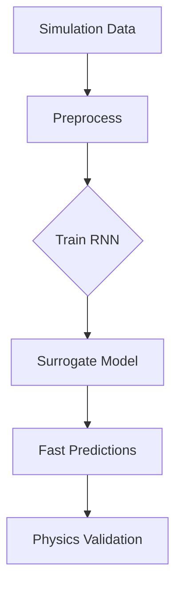

Here's a step-by-step guide to building an RNN surrogate model for simulations, using PyTorch. This model will learn to mimic complex simulations (like fluid dynamics or financial forecasts) at lower computational cost.

### 1. Problem Setup
**Goal**: Replace computationally expensive simulations with a fast neural network that predicts system evolution.

```python
import torch
import torch.nn as nn
import numpy as np

# Example simulation parameters
INPUT_DIM = 3  # e.g., [pressure, velocity_x, velocity_y]
HIDDEN_DIM = 128
OUTPUT_DIM = 3  # Same as input (autoregressive)
SEQ_LEN = 50    # Input sequence length
```

### 2. RNN Architecture (GRU/LSTM)
```python
class SimulationRNN(nn.Module):
    def __init__(self):
        super().__init__()
        self.gru = nn.GRU(INPUT_DIM, HIDDEN_DIM, batch_first=True)
        self.fc = nn.Linear(HIDDEN_DIM, OUTPUT_DIM)
    
    def forward(self, x, h=None):
        # x shape: (batch_size, seq_len, input_dim)
        output, hidden = self.gru(x, h)  # Pass through GRU
        prediction = self.fc(output[:, -1, :])  # Predict next state
        return prediction, hidden
```

### 3. Data Preparation (Key Steps)
Assume your simulation data is stored as:
- `X_train`: `[num_samples, seq_len, input_dim]` (historical states)
- `y_train`: `[num_samples, output_dim]` (next state)

```python
# Normalize data (critical for stability)
data_mean = X_train.mean(axis=(0,1))
data_std = X_train.std(axis=(0,1))
X_normalized = (X_train - data_mean) / data_std
y_normalized = (y_train - data_mean) / data_std

# Convert to PyTorch tensors
train_data = torch.utils.data.TensorDataset(
    torch.FloatTensor(X_normalized),
    torch.FloatTensor(y_normalized)
)
```

### 4. Training Loop
```python
model = SimulationRNN()
optimizer = torch.optim.Adam(model.parameters(), lr=1e-3)
loss_fn = nn.MSELoss()

for epoch in range(100):
    hidden = None
    for batch_x, batch_y in dataloader:
        optimizer.zero_grad()
        
        # Predict next state
        pred, hidden = model(batch_x, hidden)
        
        # Detach hidden state to prevent backprop through entire sequence
        hidden = hidden.detach()
        
        loss = loss_fn(pred, batch_y)
        loss.backward()
        optimizer.step()
```

### 5. Autoregressive Prediction
Generate long-term predictions by feeding outputs back as inputs:
```python
def predict(model, initial_state, steps=100):
    current_state = initial_state
    predictions = []
    hidden = None
    
    for _ in range(steps):
        with torch.no_grad():
            # Reshape to [1, 1, input_dim]
            input_tensor = current_state.unsqueeze(0).unsqueeze(0)
            pred, hidden = model(input_tensor, hidden)
            predictions.append(pred.numpy())
            current_state = pred  # Feed prediction as next input
            
    return np.array(predictions)
```

### Key Considerations:
1. **Data Representation**:
   - Frame simulation states as time sequences
   - Include control parameters (e.g., Reynolds number) as extra input channels

2. **Architecture Choices**:
   - Use **GRU/LSTM** for long-term dependencies
   - Add **skip connections** if simulating stiff systems
   - Consider **teacher forcing** during training

3. **Validation**:
   - Compare against ground-truth simulations
   - Monitor key physical invariants (e.g., mass conservation)
   - Test extrapolation to unseen parameters



### When to Use This:
- Simulations with **slow solvers** (CFD, FEM)
- **Parameter exploration** requiring 1000s of runs
- **Real-time control** systems needing fast feedback

> **Note**: For chaotic systems, add noise injection during training to improve stability.