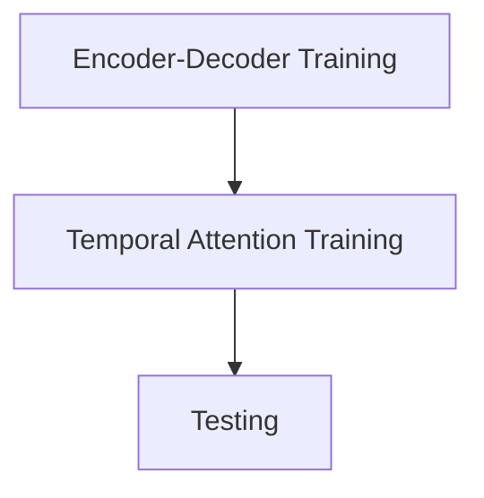

>[!Important] shows all packages installed under current virtual env/pip
>```Bash
pip freeze

>[!Important] uninstall all packages of pip
>```Bash
pip freeze | xargs pip uninstall -y

>[!Important] clear pip caache
>```Bash
>	pip cache purge

pytorch\==2.6 + cu 12.4
pytorch_cluster
pytorch_scatter
numpy\==1.26
dgl
wandb\==0.16.5

>[!Tip]
>with proper wandb, no issue will occur with protobuf or onnx



