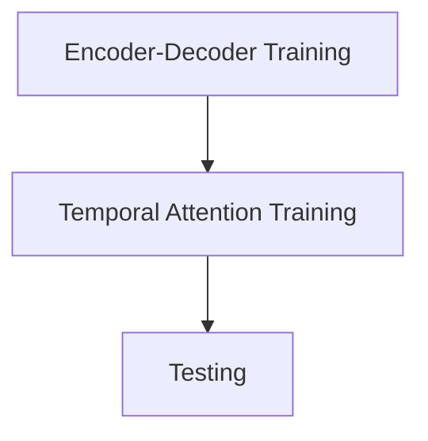

>[!Important] shows all packages installed under current virtual env/pip
>```Bash
pip freeze

>[!Important] uninstall all packages of pip
>```Bash
pip freeze | xargs pip uninstall -y


>[!Important] remove unnecessary packages
>```bash
>pip freeze | grep -vE '^(pip|setuptools|wheel)' | xargs pip uninstall -y

```

>[!Important] clear pip caache
>```Bash
>	pip cache purge

pytorch\==2.6 + cu 12.4
pytorch_cluster
pytorch_scatter
numpy\==1.26
dgl
wandb\==0.16.5

>[!Tip]
>with proper wandb, no issue will occur with protobuf or onnx



### Our Steps

### Suggested by GPT
```bash
torch==2.0.1+cu118
torchvision==0.15.2+cu118
torchaudio==2.0.2+cu118
--extra-index-url https://download.pytorch.org/whl/cu118

dgl-cu118==1.1.2

physicsnemo==0.3.1

wandb>=0.16.6
mlflow>=2.11.1
numpy
matplotlib
scipy
pydantic<2 
```

Our installation
1. pytorch\==2.4.1+cuda\==12.4
2. dgl (requires pytorch 2.4 + cuda 12.4)

```bash
pip install torch==2.4.0 torchvision==0.19.0 torchaudio==2.4.0 --index-url https://download.pytorch.org/whl/cu124
```

```bash
pip install  dgl -f https://data.dgl.ai/wheels/torch-2.4/cu124/repo.html
```

```bash
pip install nvidia-physicsnemo
```

```zsh
pip install Cython
```

```zsh
pip install nvidia-physicsnemo-sym --no-build-isolation
```

