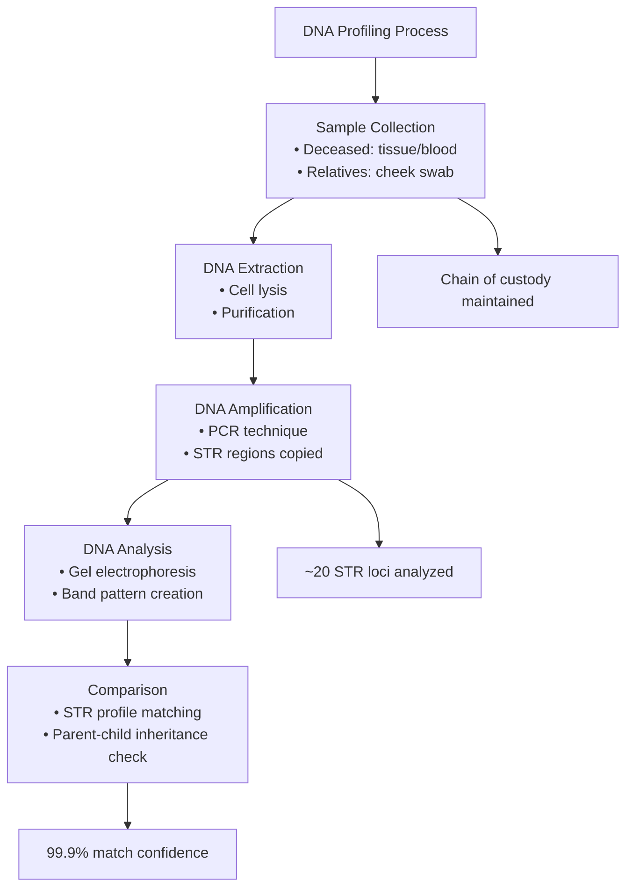
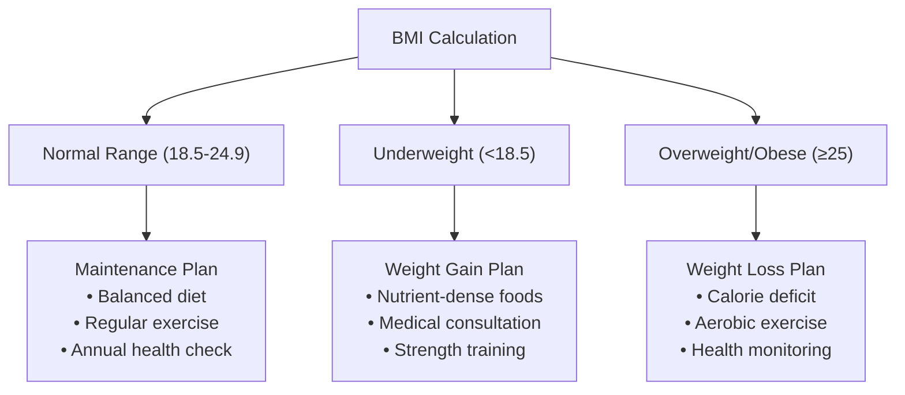
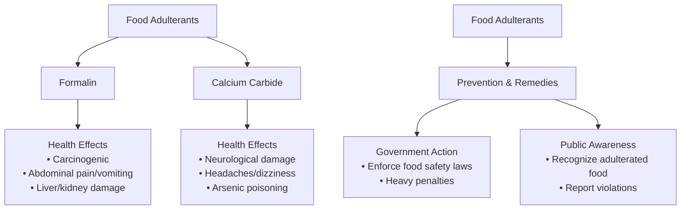
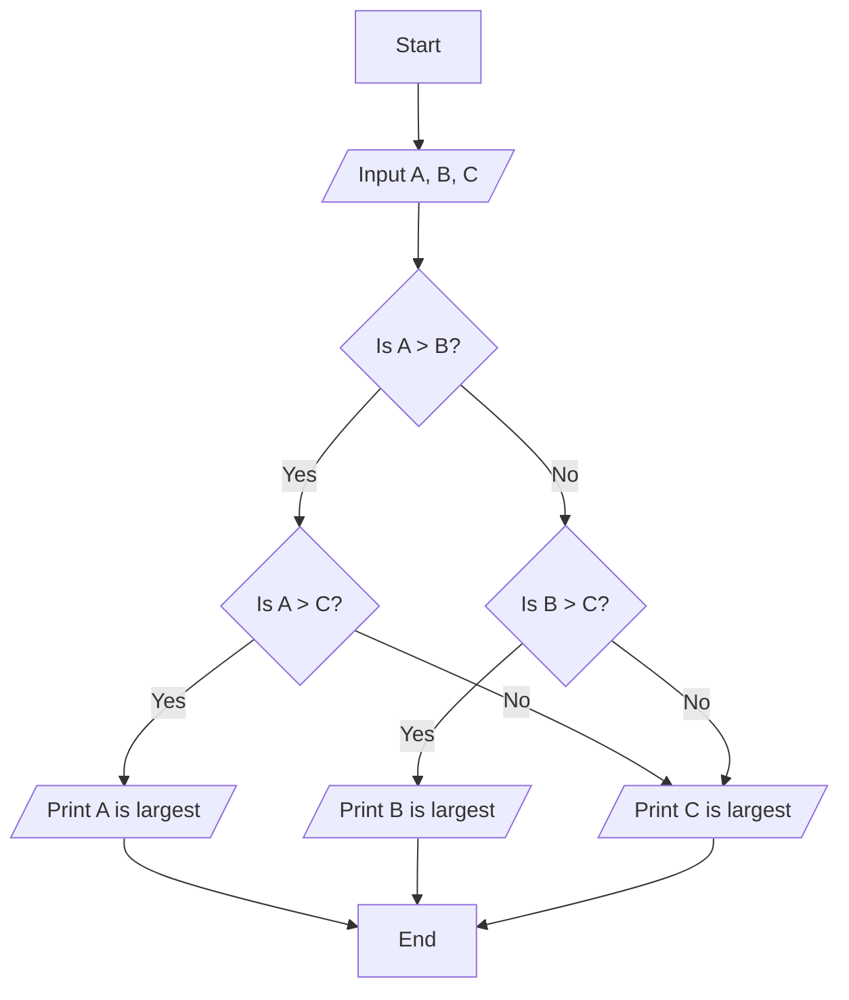

### **Part A: General Science**
**Total Marks: 60**
**(Answer any eight questions)**

---

### **Question 1**

**Scenario:** *After an accident, a body is disfigured, and relatives fail to identify their loved one. The authorities arrange for the identification of the body through a special method.*

**(a) What is meant by Gene therapy? (1.5 marks)**

**Answer:**
Gene therapy is an experimental medical technique that aims to treat or prevent disease by using genes. The approach involves introducing new or modified genetic material into a patient's cells to correct a faulty gene that is causing a disorder. Its goal is to fix the genetic root of a disease rather than just treating its symptoms.

---

**(b) Write the uses of the DNA test. (2 marks)**

**Answer:**
The uses of a DNA test are diverse and significant:
1.  **Forensic Science:** To identify suspects by matching DNA from a crime scene with a database or a suspect's DNA.
2.  **Paternity/Maternity Testing:** To establish biological relationships between individuals, such as determining a child's father or mother.
3.  **Identification of Remains:** To identify deceased individuals, especially in cases of accidents, natural disasters, or when the body is unrecognizable.
4.  **Medical Diagnosis:** To diagnose genetic disorders and determine an individual's predisposition to certain hereditary diseases.

---

**(c) Explain how the method adopted by the authorities in the given scenario will be accomplished. (3 marks)**

**Answer:**
The method adopted by the authorities is **DNA profiling** (or DNA fingerprinting). It will be accomplished through the following steps:
1.  **Sample Collection:** A biological sample (such as tissue, blood, or bone) is collected from the deceased person's body. Simultaneously, DNA samples are collected from the potential relatives (e.g., from a cheek swab).
2.  **DNA Extraction:** DNA is extracted from the cells in all the collected samples in a laboratory.
3.  **DNA Amplification:** A technique called **PCR (Polymerase Chain Reaction)** is used to make millions of copies of specific, highly variable regions of the DNA, known as Short Tandem Repeats (STRs).
4.  **DNA Analysis:** The amplified DNA fragments are separated by size using gel electrophoresis. This creates a unique pattern of bands for each individual, which is their "DNA profile".
5.  **Comparison:** The DNA profile of the deceased is compared to the profiles of the relatives. Since a person inherits half of their DNA from each parent, the profiles will show specific, predictable matches if they are related. A conclusive match confirms the identity of the deceased.

---

**(d) Explain the benefits of the mentioned technology. (1.5 marks)**

**Answer:**
The benefits of DNA profiling technology are immense:
*   **High Accuracy:** It provides an extremely accurate and reliable method for identification, far surpassing traditional methods.
*   **Justice System:** It is a powerful tool in the criminal justice system, helping to convict the guilty and exonerate the innocent.
*   **Social and Legal Resolution:** It resolves personal and legal disputes regarding paternity and inheritance.
*   **Humanitarian Aid:** It is invaluable for identifying victims after mass disasters, bringing closure to families.

---

### **Question 2**

**(a) What is meant by Body Mass Index (BMI)? (1 mark)**

**Answer:**
Body Mass Index (BMI) is a measure that uses a person's weight and height to estimate their body fat. It is a simple screening tool used to categorize an individual's weight status as underweight, normal weight, overweight, or obese.

---

**(b) From the perspective of BMI, how should one take care of their body? - Explain. (2 marks)**

**Answer:**
One should use their BMI value as a guide to maintain a healthy weight.
*   **If BMI is in the normal range (18.5-24.9):** The goal is to maintain this healthy weight through a balanced diet and regular physical activity.
*   **If BMI is in the underweight range (<18.5):** The person should consult a doctor or nutritionist to develop a plan to gain weight healthily by consuming nutrient-dense foods.
*   **If BMI is in the overweight or obese range (≥25):** The person should focus on a combination of a calorie-controlled, balanced diet and increased physical exercise to lose weight gradually and reduce the risk of associated health problems like heart disease and diabetes.

---

**(c) What are the effects of eating excessive amounts of fast food on the human body? (1.5 marks)**

**Answer:**
Eating excessive amounts of fast food has several negative effects:
*   **Weight Gain and Obesity:** Fast food is typically high in calories, unhealthy fats, and sugar, which can lead to significant weight gain.
*   **Increased Risk of Chronic Diseases:** It increases the risk of developing type 2 diabetes, heart disease, and high blood pressure due to its high content of saturated fats and sodium.
*   **Nutritional Deficiencies:** It often lacks essential nutrients like vitamins, minerals, and fiber, which can lead to poor overall health.

---

**(d) Analyze the reaction created in the human body by the use of formalin and calcium carbide in food preservation and its remedy. (3 marks)**

**Answer:**
Both formalin and calcium carbide are highly toxic chemicals illegally used in food, causing severe health reactions.
*   **Formalin (used to preserve fish, etc.):**
    *   **Reaction:** It is a known carcinogen. Ingestion can cause severe abdominal pain, vomiting, and damage to the digestive tract. Long-term exposure can lead to liver and kidney damage and increases the risk of cancer.
*   **Calcium Carbide (used to artificially ripen fruits):**
    *   **Reaction:** Commercial-grade calcium carbide often contains impurities like arsenic and phosphorus, which are highly toxic. When it reacts with moisture, it produces acetylene gas, which ripens the fruit but can also cause headaches, dizziness, and neurological damage to consumers.
*   **Remedy/Analysis:**
    *   **Prevention is the only effective remedy.** This requires strict government enforcement of food safety laws to stop the use of these chemicals.
    *   **Public awareness** is crucial to help consumers identify and avoid adulterated food.
    *   Thoroughly washing fruits and vegetables may reduce surface contamination but cannot remove chemicals that have been absorbed into the food. Ultimately, preventing their entry into the food chain is the only solution.

---

### **Question 3**

**(a) Discuss the causes and effects of global warming. (2.5 marks)**

**Answer:**
*   **Causes:** The primary cause is the **enhanced greenhouse effect**, driven by the increased concentration of greenhouse gases (GHGs) in the atmosphere from human activities. This includes:
    *   Burning of fossil fuels (coal, oil, gas) for energy, releasing carbon dioxide (CO₂).
    *   Deforestation, which reduces the Earth's ability to absorb CO₂.
    *   Agricultural practices that release methane (CH₄) and nitrous oxide (N₂O).
*   **Effects:**
    *   **Rising Temperatures:** An increase in the average global temperature.
    *   **Melting Ice and Rising Sea Levels:** Threatening coastal communities.
    *   **Extreme Weather:** Increased frequency of heatwaves, floods, droughts, and powerful storms.
    *   **Loss of Biodiversity:** Disruption of ecosystems and extinction of species.

---

**(b) Discuss whether any particular type of paddy cultivation method is responsible for global warming. (2.5 marks)**

**Answer:**
Yes, the traditional method of **flooded paddy (rice) cultivation** is a significant contributor to global warming.
*   **Mechanism:** Rice is typically grown in fields that are flooded with water for a large part of the growing season. This waterlogged condition creates an anaerobic (oxygen-poor) environment in the soil.
*   **Methane Production:** In this anaerobic soil, specific types of microbes (methanogens) decompose the organic matter and produce **methane (CH₄)** as a byproduct.
*   **Impact:** Methane is a greenhouse gas that is over 25 times more potent at trapping heat than carbon dioxide over a 100-year period. The methane produced in these flooded paddy fields escapes into the atmosphere, contributing significantly to the overall greenhouse effect and global warming.

---

**(c) Discuss the role of zinc-rich food in the human body. (2.5 marks)**

**Answer:**
Zinc is an essential trace mineral that plays several vital roles in the human body:
1.  **Immune Function:** Zinc is crucial for the normal development and function of immune cells. A deficiency can impair the immune system, making a person more susceptible to infections.
2.  **Wound Healing:** It plays a key role in cell growth, protein synthesis, and collagen formation, which are necessary for repairing tissues and healing wounds.
3.  **Sense of Taste and Smell:** Zinc is essential for maintaining a proper sense of taste and smell.
4.  **Growth and Development:** It is vital for normal growth and development during pregnancy, childhood, and adolescence.
5.  **Enzyme Function:** It is a cofactor for hundreds of enzymes involved in metabolism and digestion.

---

### **Question 4**

**(a) What are the BOD and TDS of water? (1 mark)**

**Answer:**
*   **BOD (Biochemical Oxygen Demand):** BOD is a measure of the amount of dissolved oxygen needed by aerobic bacteria to break down the organic waste present in a water sample. It is an indicator of organic pollution.
*   **TDS (Total Dissolved Solids):** TDS is the total concentration of all dissolved substances (minerals, salts, and organic matter) in water.

---

**(b) Discuss the importance of pH and PF of soil in crop production. (2 marks)**

**Answer:**
*   **Importance of pH:** Soil pH is a master variable that affects the **availability of essential nutrients** for plants. Most crops grow best in a pH range of 6.0 to 7.0. If the soil is too acidic (low pH) or too alkaline (high pH), key nutrients like nitrogen, phosphorus, and potassium can become "locked up" and unavailable for plant roots to absorb, even if they are present in the soil. Extreme pH can also lead to the toxicity of elements like aluminum.
*   **Importance of PF:** PF is a measure of **soil water potential** or how tightly water is held in the soil. It is crucial because it determines how easily plant roots can extract water from the soil. A proper PF value ensures that plants have access to sufficient moisture for growth without being waterlogged or facing drought stress.

---

**(c) Discuss the importance of freshwater in protecting the environment. (2 marks)**

**Answer:**
Freshwater is fundamental to protecting and maintaining the environment:
1.  **Supports Ecosystems:** Freshwater bodies like rivers, lakes, and wetlands are critical habitats for a vast array of plants and animals, forming the base of many ecosystems and food webs.
2.  **Maintains Biodiversity:** The health and availability of freshwater sources are essential for sustaining biodiversity, both aquatic and terrestrial.
3.  **Nutrient Cycling:** Water is the primary medium for transporting nutrients through ecosystems, a process vital for the health of forests and agricultural lands.
4.  **Climate Regulation:** Large freshwater bodies can influence local weather patterns and contribute to the global water cycle, which helps regulate the Earth's climate.

---

**(d) What reaction does DDT create in the human body? (2.5 marks)**

**Answer:**
DDT (Dichlorodiphenyltrichloroethane) is a persistent organic pollutant that can create several harmful reactions in the human body.
*   **Bioaccumulation:** It is fat-soluble and accumulates in the fatty tissues of the body over time.
*   **Endocrine Disruption:** DDT and its breakdown products can act as endocrine disruptors, meaning they can interfere with the body's hormone system. This can lead to reproductive problems and developmental issues.
*   **Carcinogenic Effects:** It is classified as a probable human carcinogen and has been linked to an increased risk of liver cancer and other cancers.
*   **Neurological Effects:** High levels of exposure can cause neurological damage, leading to symptoms like tremors and seizures.
Due to these harmful effects, its use has been banned in most countries.

---

### **Question 5**

**Scenario:** *A doctor, after examination, found that you are suffering from stomach pain due to drinking excessive soft drinks.*

**(a) According to the electronic concept, define acid and base. (1 mark)**

**Answer:**
According to the **Lewis electronic concept**:
*   An **acid** is a substance that can accept a pair of electrons.
*   A **base** is a substance that can donate a pair of electrons.

---

**(b) Write the names of two indicators and mention the color they show in acidic and alkaline media. (2 marks)**

**Answer:**

| Indicator | Color in Acidic Medium | Color in Alkaline (Basic) Medium |
| :--- | :--- | :--- |
| **Litmus** | Red | Blue |
| **Phenolphthalein**| Colorless | Pink |

---

**(c) Discuss the importance of the reaction of acid and alkali in daily life. (2 marks)**

**Answer:**
The reaction of acids and alkalis (bases), known as **neutralization**, is important in daily life:
1.  **Treating Indigestion:** Antacids, which are weak bases (like magnesium hydroxide), are used to neutralize excess stomach acid and relieve heartburn.
2.  **Agriculture:** Farmers add lime (a base) to acidic soil to neutralize it and make it more suitable for growing crops.
3.  **Treating Stings:** The sting of a bee is acidic and can be neutralized by applying a weak base like baking soda. The sting of a wasp is alkaline and can be neutralized by a weak acid like vinegar.

---

**(d) Explain the cause of your stomach pain in the given scenario. (2.5 marks)**

**Answer:**
In the given scenario, the stomach pain from drinking excessive soft drinks is likely caused by two main factors:
1.  **High Acidity:** Most soft drinks are highly acidic, primarily due to the presence of **carbonic acid** (from dissolved CO₂) and **phosphoric acid**. Consuming these in large quantities can irritate the sensitive lining of the stomach and esophagus, leading to inflammation and pain.
2.  **High Sugar Content:** The large amount of sugar in soft drinks can cause rapid fermentation by gut bacteria, leading to the production of excess gas, which can cause bloating, cramping, and stomach pain.

---

### **Question 6**

**(a) What measures can be taken to increase the strength of the magnetic field created in a solenoid? (2.5 marks)**

**Answer:**
The strength of the magnetic field inside a solenoid can be increased in three main ways:
1.  **Increase the Current:** The magnetic field strength is directly proportional to the electric current flowing through the coil. Increasing the current will increase the field strength.
2.  **Increase the Number of Turns:** Increasing the number of turns (loops) of wire per unit length of the solenoid will concentrate the magnetic field, making it stronger.
3.  **Insert an Iron Core:** Placing a soft iron core inside the solenoid dramatically increases the magnetic field strength. The iron becomes strongly magnetized, and its magnetic field adds to the field of the coil.

---

**(b) Mention how electromagnetic induction works in a transformer. (2 marks)**

**Answer:**
A transformer works on the principle of mutual electromagnetic induction:
1.  An **alternating current (AC)** flowing through the primary coil creates a continuously changing magnetic field in the shared iron core.
2.  According to Faraday's Law of Induction, this **changing magnetic field** that passes through the secondary coil induces an alternating voltage (and thus a current) in the secondary coil.
It's crucial that the current is AC, as a DC current would create a constant magnetic field that cannot induce a current in the secondary coil.

---

**(c) For a given temperature, which of two wires of the same material, one thick and one thin, will conduct more electricity and why? (2.5 marks)**

**Answer:**
The **thick wire** will conduct more electricity.
**Reason:**
Electrical resistance is **inversely proportional** to the cross-sectional area of a conductor. A thick wire has a larger cross-sectional area than a thin wire of the same material. This larger area provides more pathways for the electrons to flow, resulting in **lower resistance**. According to Ohm's Law (I = V/R), for a given voltage, a lower resistance will allow a higher current (more electricity) to flow.

---

### **Question 7**

**Scenario:** *Two workers in a ship-breaking industry have been suffering from various physical problems including coughing and chest pain for a long time. Upon examination, it was found that the cell division in one worker's respiratory organ has become uncontrolled. The other worker's disease has spread beyond the respiratory organ to the intestines and bones.*

**(a) Explain Benign and Malignant. (1 mark)**

**Answer:**
*   **Benign:** A benign tumor is a non-cancerous growth. Its cells do not spread (metastasize) to other parts of the body, and while it can grow large, it is usually not life-threatening.
*   **Malignant:** A malignant tumor is cancerous. Its cells grow uncontrollably and can invade nearby tissues and spread to distant parts of the body through the bloodstream or lymphatic system (metastasis).

---

**(b) Write the names of the two diseases of the respiratory organs of the two workers. (1 mark)**

**Answer:**
Based on the scenario and the common risks in the ship-breaking industry (exposure to asbestos), the diseases are likely:
*   **Worker 1 (uncontrolled cell division):** Lung Cancer
*   **Worker 2 (spread to intestines and bones):** Metastatic Lung Cancer (cancer that originated in the lungs and has spread). Another possibility is Mesothelioma, a cancer caused by asbestos exposure.

---

**(c) Between the diseases of the two workers, which one is relatively easier to cure and why? (2.5 marks)**

**Answer:**
The disease of the **first worker (uncontrolled cell division in the respiratory organ)** is relatively easier to cure.
**Reason:**
This disease is described as being localized ("in the respiratory organ"). A localized, non-metastatic tumor (like a benign tumor or early-stage lung cancer) can often be treated more effectively. It may be possible to completely remove the tumor through surgery or target it precisely with radiation therapy. The disease of the second worker has already **metastasized** (spread to other organs), making it much more difficult to treat and cure, as the cancer cells are present throughout the body.

---

**(d) Discuss the symptoms, prevention, and control of a person affected by the Zika virus. (3 marks)**

**Answer:**
*   **Symptoms:** Many people with Zika virus have no symptoms. If symptoms occur, they are usually mild and include fever, rash, joint pain, conjunctivitis (red eyes), and headache.
*   **Prevention:** The primary method of prevention is to avoid bites from the **Aedes mosquito**, which transmits the virus. This includes:
    *   Using insect repellent.
    *   Wearing long-sleeved shirts and long pants.
    *   Eliminating stagnant water where mosquitoes breed.
    *   Using condoms, as Zika can also be transmitted sexually.
*   **Control:** There is no specific treatment for Zika. Control focuses on managing symptoms, such as getting plenty of rest, drinking fluids to prevent dehydration, and taking medicine like paracetamol to reduce fever and pain.

---

### **Question 8**

**(a) What is the area of the Bangladesh part of the Sundarbans? (1 mark)**

**Answer:**
The area of the Bangladesh part of the Sundarbans is approximately **6,017 square kilometers**.

---

**(b) What are pneumatophores? (1 mark)**

**Answer:**
Pneumatophores (or breathing roots) are specialized aerial roots that grow upwards from the waterlogged soil of mangrove forests, like the Sundarbans. They have pores that allow the mangrove trees to get oxygen directly from the air, which is unavailable in the anaerobic mud.

---

**(c) What are Moist deciduous, dry deciduous, and wet deciduous forests? (1 mark)**

**Answer:**
*   **Moist Deciduous Forest:** A type of forest that experiences significant rainfall and has trees that shed their leaves during the dry season, but for a shorter period.
*   **Dry Deciduous Forest:** A forest found in areas with less rainfall, where trees shed their leaves for a longer period during the dry season to conserve water.
*   **Wet Deciduous Forest:** This is not a standard forestry classification. The question likely means "Wet Evergreen Forest" or is referring to a variation of moist deciduous forest. A wet evergreen forest receives very high rainfall and its trees remain green year-round.

---

**(d) Discuss the importance of a Rain forest. (2.5 marks)**

**Answer:**
Rainforests are vitally important for the planet:
1.  **Incredible Biodiversity:** They are home to more than half of the world's plant and animal species, making them the most biodiverse ecosystems on Earth.
2.  **Climate Regulation ("Lungs of the Planet"):** They play a crucial role in regulating the global climate by absorbing enormous amounts of carbon dioxide and producing oxygen through photosynthesis.
3.  **Source of Resources:** They are a source of valuable resources, including medicines, food, timber, and other industrial products.
4.  **Water Cycle:** They contribute significantly to the water cycle through transpiration, influencing rainfall patterns locally and globally.

---

### **Question 9**

**(a) Discuss the importance of Biodiversity conservation. (2 marks)**

**Answer:**
Biodiversity conservation is crucial for several reasons:
1.  **Ecosystem Services:** Biodiversity provides essential services that support human life, such as pollination of crops, soil formation, water purification, and climate regulation.
2.  **Economic Value:** It provides direct economic benefits through resources for food, medicine, and industrial products. Ecotourism is also a significant source of income.
3.  **Ethical and Aesthetic Reasons:** Many people believe that every species has an intrinsic right to exist, and a diverse natural world provides immense aesthetic, cultural, and recreational value.
4.  **Ecosystem Resilience:** A diverse ecosystem is more resilient and stable, better able to withstand disturbances like climate change or disease outbreaks.

---

**(b) What are the threats to tiger conservation in Bangladesh? (2 marks)**

**Answer:**
The main threats to the conservation of the Bengal tiger in Bangladesh (primarily in the Sundarbans) are:
*   **Poaching:** Illegal hunting of tigers for their skin, bones, and other body parts, which are in high demand in the illegal international wildlife trade.
*   **Habitat Loss and Degradation:** The mangrove forest habitat is shrinking due to climate change (sea-level rise), increased salinity, and human encroachment.
*   **Human-Tiger Conflict:** As human settlements expand, tigers may prey on livestock, leading to retaliatory killings by villagers.
*   **Prey Depletion:** A decline in the population of prey animals, like deer, due to poaching and habitat loss.

---

**(c) What is meant by a Community Conserved Area (CCA)? (2 marks)**

**Answer:**
A Community Conserved Area (CCA) is a natural area or ecosystem where a local or indigenous community takes the primary role in governing, managing, and conserving the biodiversity and natural resources. Unlike traditional protected areas managed by the government, in a CCA, the conservation efforts are driven by the community's own rules, traditions, and institutions. This approach recognizes the deep connection and traditional knowledge that local communities have with their environment.

---

**(d) What is meant by Renewable resource? (1.5 marks)**

**Answer:**
A renewable resource is a natural resource that can be replenished naturally over a short period of time, making it sustainable for use. It is essentially inexhaustible on a human timescale. Examples include solar energy, wind energy, hydropower (water), geothermal energy, and biomass. This is in contrast to non-renewable resources like fossil fuels, which are finite and take millions of years to form.

***

Of course. Here are the detailed answers for Part B of the exam paper.

***

### **Part B: Computer and Information Technology**
**Total Marks: 25**
**(Answer any ten questions)**

---

**(1) Name and briefly describe the components of a computer system. (2.5 marks)**

**Answer:**
The main components of a computer system are:
1.  **Hardware:** The physical parts of the computer that you can touch. This includes the CPU, memory (RAM), storage drives (HDD/SSD), input devices (keyboard, mouse), and output devices (monitor, printer).
2.  **Software:** The set of instructions that tells the hardware what to do. It includes the operating system (like Windows) and application programs (like MS Word).
3.  **Data:** The raw facts and figures that are processed by the computer to create information.
4.  **User:** The person who operates the computer.

---

**(2) Name five important uses of computers in social life. (2.5 marks)**

**Answer:**
Five important uses of computers in social life are:
1.  **Communication:** Connecting with friends and family through email, social media, and video calls.
2.  **Information Access:** Accessing news, educational resources, and a vast amount of information through the internet.
3.  **Entertainment:** Watching movies, listening to music, and playing games.
4.  **E-commerce:** Shopping for goods and services online.
5.  **Social Networking:** Building and maintaining social relationships and participating in online communities.

---

**(3) Show the classification of computer memory. (2.5 marks)**

**Answer:**
Computer memory can be classified into two main categories:
1.  **Primary Memory (Main Memory):** This is the memory that the CPU can access directly. It is volatile.
    *   **RAM (Random Access Memory):** The computer's working memory.
    *   **ROM (Read-Only Memory):** Stores the boot-up instructions (BIOS).
2.  **Secondary Memory (Storage):** This is non-volatile memory used for long-term storage of data and programs.
    *   **Magnetic Storage:** Hard Disk Drive (HDD).
    *   **Solid-State Storage:** Solid-State Drive (SSD), Flash Drives (Pen Drives).
    *   **Optical Storage:** CD, DVD, Blu-ray Disc.

---

**(4) Briefly describe how cache memory works with a diagram. (2.5 marks)**

**Answer:**
**How it Works:** Cache memory is a small, extremely fast memory that sits between the CPU and the main memory (RAM). It stores copies of the data and instructions that are most frequently used by the CPU. When the CPU needs data, it first checks the cache. If the data is there (a "cache hit"), it can be retrieved much faster than going to the slower RAM. If the data is not there (a "cache miss"), the CPU retrieves it from RAM and also places a copy in the cache for future use. This process significantly speeds up the computer's performance.

**Simplified Diagram:**
```
+-------+   <-- Very Fast -->   +-------------+   <-- Slower -->   +----------+
|  CPU  | <-------------------> | Cache Memory| <----------------> |    RAM   |
+-------+                       +-------------+                    +----------+
```

---

**(5) Show a brief classification of computer software. (2.5 marks)**

**Answer:**
Computer software can be broadly classified into two main types:
1.  **System Software:** Software designed to manage the computer's hardware and provide a platform for application software to run.
    *   **Operating System:** (e.g., Windows, macOS, Linux)
    *   **Device Drivers:** (e.g., Printer driver, Graphics driver)
    *   **Utility Programs:** (e.g., Antivirus software, Disk defragmenter)
2.  **Application Software:** Software designed to perform specific tasks for the end-user.
    *   **General Purpose:** (e.g., MS Word, Excel, Chrome)
    *   **Specific Purpose:** (e.g., Accounting software, Payroll system)

---

**(6) Briefly describe the various services of an operating system with their names. (2.5 marks)**

**Answer:**
1.  **Process Management:** Manages the execution of programs (processes).
2.  **Memory Management:** Allocates and manages the computer's main memory (RAM).
3.  **File Management:** Organizes and controls the storage and retrieval of files.
4.  **Device (I/O) Management:** Manages all input and output devices.
5.  **Security Management:** Provides security through user accounts, passwords, and access controls.

---

**(7) What is software? Write the difference between system software and application software. (2.5 marks)**

**Answer:**
*   **Software:** A set of instructions or programs that tells a computer what to do.
*   **Difference:**

| Feature | System Software | Application Software |
| :--- | :--- | :--- |
| **Purpose** | Manages the computer hardware. | Performs specific user tasks. |
| **User Interaction** | Runs in the background with little direct user interaction. | User interacts with it directly. |
| **Dependency** | Application software depends on it to run. | It depends on system software. |

---

**(8) What is LAN? Briefly describe the different types of LAN topology. (2.5 marks)**

**Answer:**
*   **LAN (Local Area Network):** A computer network that interconnects computers within a limited area such as a residence, school, or office building.
*   **Types of LAN Topology:**
    1.  **Bus Topology:** All devices are connected to a single central cable.
    2.  **Star Topology:** All devices are connected to a central device (hub or switch). Most common today.
    3.  **Ring Topology:** All devices are connected in a closed loop.
    4.  **Mesh Topology:** Every device is connected to every other device, providing high redundancy.

---

**(9) What is meant by Router, Gateway, Switch, and Hub? (2.5 marks)**

**Answer:**
*   **Router:** A device that connects different networks together (like a home network to the internet) and directs traffic between them.
*   **Gateway:** A device that acts as a bridge between two different networks that use different protocols. A router is a common type of gateway.
*   **Switch:** A device that connects multiple devices on the same local network. It intelligently forwards data only to the intended recipient.
*   **Hub:** A simple, older device that also connects devices on a local network, but it broadcasts all data to every connected device, making it inefficient.

---

**(10) Discuss Bluetooth technology. (2.5 marks)**

**Answer:**
Bluetooth is a short-range wireless communication technology used to connect and exchange data between devices like smartphones, headphones, speakers, and computers. It operates in the 2.4 GHz frequency band and creates a Personal Area Network (PAN). It is designed for low power consumption, making it ideal for portable devices. It allows for cable-free connections, for example, connecting a wireless headset to a phone or a wireless mouse to a laptop.

---

**(11) Briefly describe packet switching and circuit switching with examples. (2.5 marks)**

**Answer:**
*   **Circuit Switching:** A dedicated communication path (a circuit) is established between two devices for the duration of the communication session. The path is reserved exclusively for them.
    *   **Example:** A traditional telephone call. The line is dedicated to your conversation until you hang up.
*   **Packet Switching:** Data is broken down into small blocks called packets. Each packet is sent independently through the network and may take a different route to the destination. The packets are reassembled at the destination.
    *   **Example:** The internet. Data you send or receive (like an email or web page) is broken into packets and sent across the network.

---

**(12) What is a flowchart? Draw a flowchart to find the largest number among three numbers. (2.5 marks)**

**Answer:**
*   **Flowchart:** A flowchart is a type of diagram that represents a workflow or process, showing the steps as boxes of various kinds and their order by connecting them with arrows.
*   **Flowchart to Find the Largest of Three Numbers (A, B, C):**



