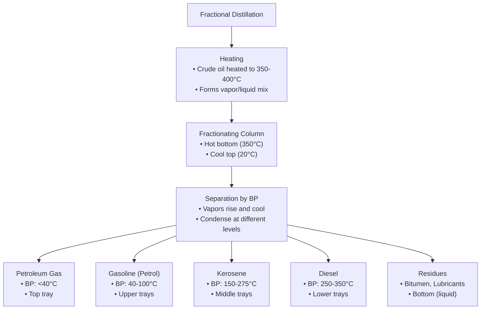
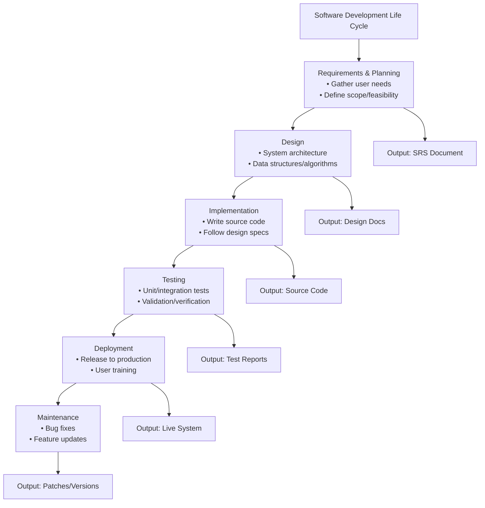
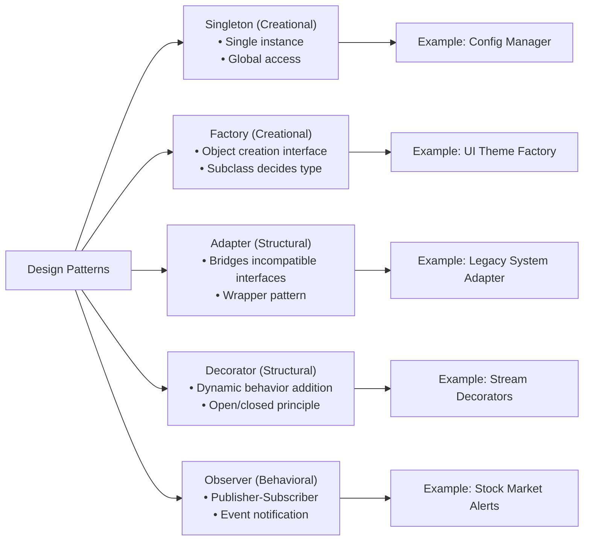
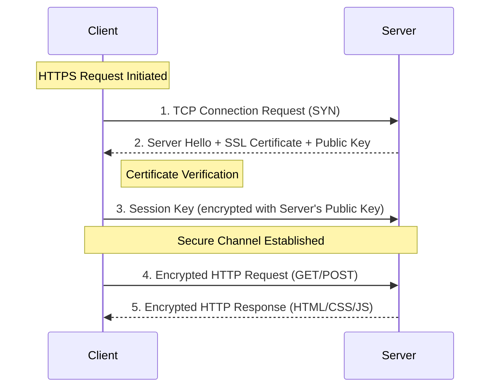
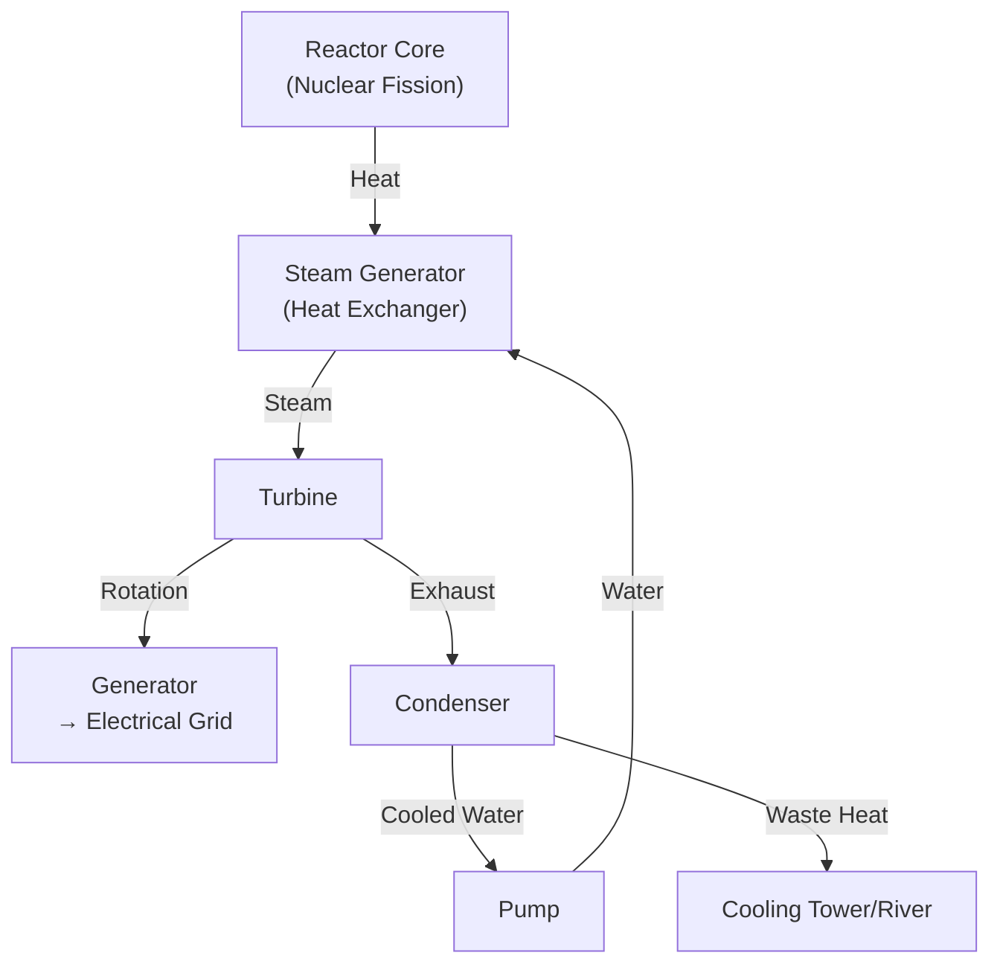
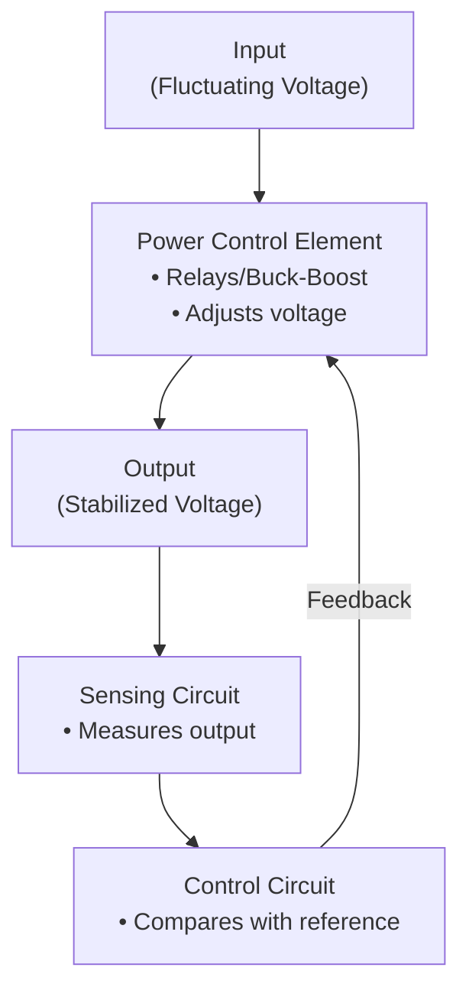

### **Part A: General Science**
**Total Marks: 60**
**(Answer any eight questions)**

---

### **Question 1**

**(a) Write the general characteristics of acids and bases. What is an indicator? (1.5 + 0.5 marks)**

**Answer:**
*   **General Characteristics of Acids:**
    *   They have a sour taste.
    *   They turn blue litmus paper red.
    *   They react with active metals to produce hydrogen gas.
    *   They react with bases to form salt and water (neutralization).
*   **General Characteristics of Bases:**
    *   They have a bitter taste and feel slippery.
    *   They turn red litmus paper blue.
    *   They react with acids to form salt and water.
*   **Indicator:** An indicator is a substance (usually a weak organic acid or base) that changes color in response to a change in chemical conditions, such as pH. It is used to visually determine the acidity or basicity of a solution.

---

**(b) Discuss the causes of acidity in the human body and the method of selecting the right food for its remedy. (2.5 marks)**

**Answer:**
*   **Causes of Acidity:** Acidity (acid reflux or heartburn) in the human body is primarily caused by the backflow of stomach acid into the esophagus. This can be triggered by:
    *   Overeating or eating large meals.
    *   Lying down immediately after eating.
    *   Consumption of certain foods like spicy, fatty, or fried foods, citrus fruits, tomatoes, caffeine, and carbonated drinks.
    *   Lifestyle factors like obesity, smoking, and stress.
*   **Selecting the Right Food for Remedy:** To remedy acidity, one should select alkaline-forming or low-acid foods. This includes:
    *   **Vegetables:** Leafy greens, cucumbers, broccoli.
    *   **Non-citrus Fruits:** Bananas, melons, apples.
    *   **Lean Proteins:** Grilled chicken, fish.
    *   **Whole Grains:** Oatmeal, brown rice.
    *   Drinking plenty of water and avoiding trigger foods are crucial.

---

**(c) What is pH? If the concentration of H⁺ ions increases 10 times by adding acid to pure water, what will be the pH of the water? Why does aquatic life become unsuitable in a water body when industrial waste containing sulfuric acid is discharged into it? (1.5 + 3 marks)**

**Answer:**
*   **pH:** pH is a scale used to specify the acidity or basicity of an aqueous solution. It is the negative logarithm of the hydrogen ion concentration ($pH = -log[H⁺]$).
*   **pH Calculation:**
    *   Pure water has a neutral pH of 7. This means its \[H⁺] is 10⁻⁷ M.
    *   If the \[H⁺] concentration increases 10 times, the new concentration will be 10 x 10⁻⁷ M = 10⁻⁶ M.
    *   The new pH will be: $pH = -log(10^{-6}) = 6$.
*   **Effect on Aquatic Life:** When industrial waste containing sulfuric acid is discharged into a water body, it drastically lowers the pH, making the water highly acidic. This severe change in pH is unsuitable for aquatic life because:
    *   It damages the gills and skin of fish.
    *   It disrupts the enzymes and metabolic processes essential for their survival.
    *   It can dissolve toxic heavy metals from sediments into the water, further poisoning the aquatic organisms.

---

### **Question 2**

**(a) What is fossil fuel? How is this fuel formed in nature? (1.5 marks)**

**Answer:**
*   **Fossil Fuel:** Fossil fuels are natural fuels, such as coal, oil, and natural gas, formed in the Earth's crust from the fossilized, buried remains of dead plants and animals that lived millions of years ago.
*   **Formation:** Over millions of years, the remains of these organisms were buried under layers of sediment. The immense heat and pressure from these layers transformed the organic matter into carbon-rich substances. Plant remains primarily formed coal, while marine organisms formed oil and natural gas.

---

**(b) What is petroleum gas? Describe how petroleum gas and gasoline are obtained from crude oil by fractional distillation. (3 marks)**

**Answer:**
*   **Petroleum Gas:** A mixture of flammable hydrocarbon gases (like propane and butane) obtained during the refining of crude oil. It is often liquefied under pressure to form LPG.
*   **Fractional Distillation:** This process separates crude oil into different components (fractions) based on their different boiling points.
    1.  Crude oil is heated in a furnace to a high temperature, turning it into a hot mixture of liquid and vapor.
    2.  This mixture is pumped into the bottom of a tall fractionating column, which is hot at the bottom and cooler at the top.
    3.  The hot vapors rise up the column. As they rise, they cool and condense at different levels (on trays) according to their boiling points.
    *   Fractions with low boiling points, like **petroleum gas**, rise to the very top before condensing.
    *   Fractions with slightly higher boiling points, like **gasoline (petrol)**, condense on trays lower down.
    The different condensed liquids are then collected from their respective trays.



---

**(c) What are biomass and biogas? Briefly write the main components of biogas and its uses. (3 marks)**

**Answer:**
*   **Biomass:** Renewable organic material that comes from plants and animals, such as wood, agricultural crops, and animal manure. It contains stored energy from the sun.
*   **Biogas:** A mixture of gases produced by the breakdown (anaerobic digestion) of organic matter in the absence of oxygen.
*   **Main Components of Biogas:**
    *   Methane (CH₄): ~50-75%
    *   Carbon Dioxide (CO₂): ~25-50%
    *   Trace amounts of other gases like hydrogen sulfide (H₂S).
*   **Uses:**
    *   Used as a clean cooking fuel in rural areas.
    *   Used to generate electricity.
    *   The leftover slurry is a nutrient-rich organic fertilizer.

---

### **Question 3**

**(a) How many layers are there in the atmosphere and what are they? Mention the characteristics of any two layers. (2 marks)**

**Answer:**
*   There are **five** main layers in the atmosphere:
    1.  Troposphere
    2.  Stratosphere
    3.  Mesosphere
    4.  Thermosphere
    5.  Exosphere
*   **Characteristics of Two Layers:**
    1.  **Troposphere:** It is the lowest layer, extending up to about 8-15 km. It contains about 75% of the atmosphere's mass and almost all of its water vapor. All weather phenomena occur in this layer.
    2.  **Stratosphere:** This layer lies above the troposphere and contains the **ozone layer**, which absorbs the majority of the sun's harmful ultraviolet (UV) radiation.

---

**(b) What is the role of O₂, CO₂, and N₂ in the atmosphere? Why does the sea level rise if the amount of CO₂ increases? (2.5 marks)**

**Answer:**
*   **Role of Gases:**
    *   **Oxygen (O₂):** Essential for the respiration of most living organisms.
    *   **Carbon Dioxide (CO₂):** Used by plants for photosynthesis; also a major greenhouse gas that traps heat.
    *   **Nitrogen (N₂):** The most abundant gas, it is relatively inert but is a crucial component of proteins and nucleic acids for life.
*   **Reason for Sea Level Rise:** An increase in the amount of CO₂ in the atmosphere enhances the greenhouse effect, trapping more heat and causing **global warming**. This rise in global temperature leads to two main effects that cause sea levels to rise:
    1.  **Melting of Ice:** Glaciers and polar ice caps melt at an accelerated rate, adding vast amounts of water to the oceans.
    2.  **Thermal Expansion:** As the ocean water warms, it expands in volume.

---

**(c) What is a tide? Why do high tides and low tides occur twice a day? (1.5 marks)**

**Answer:**
*   **Tide:** Tides are the regular rise and fall of the Earth's ocean water levels, caused by the gravitational pull of the Moon and, to a lesser extent, the Sun.
*   **Reason for Twice-Daily Tides:** The Moon's gravity pulls the ocean water on the side of the Earth nearest to it, creating a **high tide bulge**. Simultaneously, on the opposite side of the Earth, the centrifugal force created by the Earth's rotation causes another **high tide bulge**. The areas in between these two bulges experience **low tides**. As the Earth rotates on its axis once every 24 hours, any given point on the coast passes through both of these high tide bulges and both low tide areas, thus experiencing two high tides and two low tides approximately each day.

---

### **Question 4**

**(a) What is ultraviolet ray? What is it used for? (1.5 marks)**

**Answer:**
*   **Ultraviolet (UV) Ray:** Ultraviolet rays are a form of electromagnetic radiation with a wavelength shorter than that of visible light but longer than X-rays. They are invisible to the human eye.
*   **Uses:**
    *   **Sterilization:** UV light can kill bacteria and viruses, so it is used to sterilize medical equipment and purify water.
    *   **Vitamin D Production:** It stimulates the production of Vitamin D in the skin.
    *   **Forensics:** Used to detect bodily fluids and forged documents.
    *   Used in "black lights" for special effects and inspection.

---

**(b) What is magnetism? How many types of magnetism are there and what are they? Describe the use of magnetism in the medical field. (3 marks)**

**Answer:**
*   **Magnetism:** Magnetism is a physical phenomenon produced by the motion of electric charge, resulting in attractive and repulsive forces between objects.
*   **Types of Magnetism:** The main types are:
    1.  **Ferromagnetism:** Strong attraction to magnets (e.g., iron).
    2.  **Paramagnetism:** Weak attraction to magnets (e.g., aluminum).
    3.  **Diamagnetism:** Weak repulsion from magnets (e.g., water, copper).
*   **Use in the Medical Field:** The most significant use is in **Magnetic Resonance Imaging (MRI)**. MRI machines use powerful magnets and radio waves to generate detailed images of soft tissues, organs, and bones inside the body without using harmful ionizing radiation, making it an invaluable diagnostic tool.

---

**(c) What is meant by the polarity and Curie point of a magnet? What is ferromagnetism? Describe how a ferromagnet can be converted into a paramagnet. (3 marks)**

**Answer:**
*   **Polarity:** The polarity of a magnet refers to its two poles, the **north pole** and the **south pole**, where the magnetic force is strongest.
*   **Curie Point (or Curie Temperature):** The Curie point is the specific temperature above which a ferromagnetic material loses its permanent magnetic properties and becomes paramagnetic.
*   **Ferromagnetism:** Ferromagnetism is the property of certain materials (like iron) that allows them to be strongly attracted to a magnet and to be magnetized themselves.
*   **Conversion to Paramagnet:** A ferromagnetic material can be converted into a paramagnetic material simply by **heating it above its Curie point**. At this high temperature, the thermal energy becomes strong enough to overcome the alignment of the magnetic domains, causing them to become randomly oriented, thus losing their strong, permanent magnetism.

---

### **Question 5**

**(a) What are monosaccharides and polysaccharides? Why are they important for the human body? (1.5 marks)**

**Answer:**
*   **Monosaccharides:** These are the simplest form of carbohydrates ("simple sugars") and are the basic building blocks for more complex carbohydrates (e.g., glucose, fructose).
*   **Polysaccharides:** These are complex carbohydrates made of long chains of monosaccharide units (e.g., starch, cellulose).
*   **Importance:** They are the body's **primary source of energy**. Carbohydrates are broken down into glucose, which is used by cells for fuel to carry out all life processes.

---

**(b) Discuss the ways in which food is adulterated in our country. (1.5 marks)**

**Answer:**
Food adulteration is a serious problem in Bangladesh. Common methods include:
*   **Use of Harmful Chemicals:** Adding chemicals like formalin to preserve fish and fruits, calcium carbide to ripen fruits artificially, and toxic industrial dyes to color sweets and spices.
*   **Mixing with Cheaper Substances:** Mixing milk with water, pure ghee with vegetable oil, or adding brick dust to chili powder.
*   **Selling Expired or Decomposed Products:** Re-labeling expired packaged goods or selling rotten food items.
*   **Adding Contaminants:** Mixing sand, pebbles, or sawdust with grains and spices to increase their weight.

---

**(c) What is a lipid? Mention the characteristics and functions of lipids. (3 marks)**

**Answer:**
*   **Lipid:** A lipid is a broad group of naturally occurring organic molecules that are insoluble in water but soluble in nonpolar organic solvents. They include fats, oils, waxes, and steroids.
*   **Characteristics:**
    *   They are hydrophobic (water-repelling).
    *   They are energy-rich compounds.
*   **Functions:**
    1.  **Energy Storage:** They are the most efficient way for the body to store long-term energy.
    2.  **Insulation and Protection:** Body fat insulates against cold and cushions vital organs.
    3.  **Cell Structure:** Lipids (phospholipids) are the main component of all cell membranes.
    4.  **Hormone Production:** Steroid lipids are the precursors for many hormones, like estrogen and testosterone.
    5.  **Vitamin Absorption:** They are essential for the absorption of fat-soluble vitamins (A, D, E, K).

---

### **Question 6**

**(a) Write the causes and symptoms of Dengue fever. Write the genetic material of the Dengue virus. (1.5 marks)**

**Answer:**
*   **Cause:** Dengue fever is a viral infection caused by the Dengue virus, which is transmitted to humans through the bite of an infected **Aedes mosquito**.
*   **Symptoms:** High fever, severe headache, pain behind the eyes, severe joint and muscle pain (earning it the name "breakbone fever"), fatigue, nausea, and a characteristic skin rash.
*   **Genetic Material:** The genetic material of the Dengue virus is **single-stranded RNA**.

---

**(b) What steps should we take to prevent the spread of the Dengue virus? Why are antibiotics not effective against Dengue virus? (1.5 marks)**

**Answer:**
*   **Preventive Steps:** The primary way to prevent Dengue is to control the mosquito population and avoid bites. This includes:
    *   Eliminating mosquito breeding sites by removing stagnant water from containers like flower pots, old tires, and buckets.
    *   Using mosquito repellents.
    *   Wearing long-sleeved clothing.
    *   Using mosquito nets while sleeping.
*   **Why Antibiotics are Ineffective:** Antibiotics are drugs designed to kill or inhibit the growth of **bacteria**. Dengue is caused by a **virus**. Viruses have a different structure and replication mechanism than bacteria, so antibiotics have no effect on them.

---

**(c) What is night blindness? What causes night blindness? Discuss in detail. What steps should be taken to remedy this disease? (2.5 marks)**

**Answer:**
*   **Night Blindness (Nyctalopia):** A condition where a person finds it difficult or impossible to see in low light or at night.
*   **Cause:** The most common cause is a **deficiency of Vitamin A**. Vitamin A is essential for the production of **rhodopsin**, a light-sensitive pigment in the **rod cells** of the retina. Rod cells are responsible for vision in low-light conditions. Without sufficient Vitamin A, the body cannot produce enough rhodopsin, leading to an inability to see properly in the dark.
*   **Remedy:** The primary remedy is to ensure an adequate intake of Vitamin A. This can be done by:
    *   Consuming Vitamin A-rich foods like carrots, sweet potatoes, spinach, liver, and dairy products.
    *   Taking Vitamin A supplements under medical supervision.

---

**(d) What are the components of a balanced diet? How does diet lead to weight gain and subsequently cause diabetes? (2.5 marks)**

**Answer:**
*   **Components of a Balanced Diet:**
    1.  Carbohydrates
    2.  Proteins
    3.  Fats
    4.  Vitamins
    5.  Minerals
    6.  Water
*   **How Diet Leads to Diabetes:** A diet high in processed foods, unhealthy fats, and refined sugars is very calorie-dense. Consuming more calories than the body uses for energy leads to **weight gain** and **obesity**, particularly an accumulation of visceral fat around the abdomen. This excess fat can cause the body's cells to become resistant to the effects of **insulin** (a condition called insulin resistance). Insulin resistance means the pancreas has to work harder to control blood sugar, and eventually, it may not be able to produce enough insulin, leading to the development of **Type 2 Diabetes**.

---

### **Question 7**

**(a) Name four waterborne diseases. What is the cause of Beriberi? Why is Vitamin D found in sunlight? - Explain. (1.5 marks)**

**Answer:**
*   **Four Waterborne Diseases:** Cholera, Typhoid, Dysentery, Hepatitis A.
*   **Cause of Beriberi:** Beriberi is caused by a deficiency of **Vitamin B1 (Thiamine)**.
*   **Vitamin D in Sunlight:** Vitamin D is not literally "found" in sunlight. Rather, sunlight (specifically, ultraviolet B or UVB radiation) acts as a catalyst. When UVB rays from the sun strike the skin, they trigger a chemical reaction that converts a type of cholesterol in the skin into **Vitamin D3**, which the body can then use.

---

**(b) What are blood cells? Why does blood look red? What is Hepatitis? What causes Hepatitis? Name two Hepatitis viruses transmitted through blood. (3 marks)**

**Answer:**
*   **Blood Cells:** The cellular components of blood, which include red blood cells, white blood cells, and platelets.
*   **Why Blood is Red:** Blood looks red because of the protein **hemoglobin** found in red blood cells. Hemoglobin contains iron, and when it binds with oxygen, it gives blood its characteristic red color.
*   **Hepatitis:** Hepatitis is the inflammation of the liver.
*   **Causes:** It is most commonly caused by a viral infection, but it can also be caused by alcohol abuse, toxins, or certain autoimmune diseases.
*   **Two Hepatitis Viruses Transmitted by Blood:** Hepatitis B and Hepatitis C.

---

**(c) What is an antiseptic? Name three important antiseptics used in medical practice. What is stem cell therapy? Discuss the contribution of stem cell therapy in medical science with an example. (3 marks)**

**Answer:**
*   **Antiseptic:** An antiseptic is a substance that is applied to living tissue (like skin) to prevent or stop the growth of microorganisms and prevent infection.
*   **Three Antiseptics:** Povidone-iodine (Betadine), Chlorhexidine, Hydrogen peroxide.
*   **Stem Cell Therapy:** A type of regenerative medicine that uses stem cells to repair or replace damaged cells, tissues, or organs. Stem cells are unique because they can develop into many different types of cells.
*   **Contribution and Example:** Stem cell therapy has immense potential. A key example is **bone marrow transplantation** (a type of stem cell therapy) used to treat leukemia and other blood cancers. In this procedure, the patient's cancerous bone marrow is destroyed, and they are infused with healthy stem cells from a donor. These stem cells then repopulate the bone marrow and produce healthy blood cells.

---

### **Question 8**

**(a) What is a polymer semiconductor? Discuss its characteristics. (1.5 marks)**

**Answer:**
*   **Polymer Semiconductor (or Conductive Polymer):** An organic polymer that possesses the electrical properties of a semiconductor or a metal. Unlike conventional inorganic semiconductors (like silicon), these materials are based on long carbon chains.
*   **Characteristics:**
    *   **Mechanical Flexibility:** They are lightweight, flexible, and can be processed into thin films.
    *   **Tunable Properties:** Their electrical and optical properties can be easily modified through chemical synthesis.
    *   **Low-Cost Manufacturing:** They can be manufactured using low-cost techniques like printing.

---

**(b) Describe the synthesis method of Teflon and Polyester. Briefly discuss the role of rubber and plastic in environmental pollution. (3 marks)**

**Answer:**
*   **Synthesis:**
    *   **Teflon (PTFE):** Synthesized by the **addition polymerization** of tetrafluoroethylene monomers under high pressure.
    *   **Polyester (e.g., PET):** Synthesized by the **condensation polymerization** of a dicarboxylic acid (like terephthalic acid) and a dialcohol (like ethylene glycol), with the elimination of a water molecule at each step.
*   **Role in Pollution:**
    *   Both rubber and plastic are largely non-biodegradable, persisting in the environment for hundreds of years. They pollute land and oceans, break down into harmful microplastics, and can harm wildlife through ingestion and entanglement.

---

**(c) What is meant by genetic disease? Write in detail about the genetic diseases Sickle Cell Anemia and Thalassemia. (3 marks)**

**Answer:**
*   **Genetic Disease:** A disease or disorder caused by an abnormality in an individual's DNA. This can range from a small mutation in a single gene to the addition or subtraction of an entire chromosome.
*   **Sickle Cell Anemia:** An inherited blood disorder caused by a mutation in the gene that codes for hemoglobin. This causes red blood cells to become rigid and sickle-shaped. These abnormal cells can block blood flow, causing severe pain, organ damage, and anemia.
*   **Thalassemia:** A group of inherited blood disorders characterized by a reduced production of hemoglobin. This results in fewer and smaller red blood cells, leading to a lack of oxygen in the body (anemia) and symptoms like fatigue, weakness, and slow growth. Severe forms require regular blood transfusions. HBA1 and HBA2 are the culprit gene.

---

### **Question 9**

**(a) What is acid rain? Explain the scientific reason for the formation of acid rain in nature. Discuss how people's daily lives are affected by acid rain. (1.5 marks)**

**Answer:**
*   **Acid Rain:** Rain or any other form of precipitation that is unusually acidic (has a low pH).
*   **Scientific Reason:** It is formed when pollutants like **sulfur dioxide (SO₂)** and **nitrogen oxides (NOx)**, released from burning fossil fuels in power plants and vehicles, react with water, oxygen, and other chemicals in the atmosphere to form **sulfuric acid** and **nitric acid**. These acids then fall to the Earth as acid rain.
*   **Effect on Daily Life:**
    *   It damages buildings and monuments made of limestone and marble.
    *   It can leach toxic metals from the soil into drinking water supplies.
    *   It damages forests and harms crops, affecting agriculture.
    *   It can cause respiratory problems in humans.

---

**(b) What are biotechnology and nanotechnology? Describe the applications of biotechnology and nanotechnology. (3 marks)**

**Answer:**
*   **Biotechnology:** The use of living organisms or their components to develop or create products and processes for specific uses (e.g., genetic engineering, fermentation).
*   **Nanotechnology:** The manipulation of matter on an atomic and molecular scale (1-100 nanometers) to create new materials and devices with unique properties.
*   **Applications:**
    *   **Biotechnology:** Production of medicines (insulin, vaccines), development of genetically modified crops, production of biofuels, and use in forensic science.
    *   **Nanotechnology:** Used in medicine for drug delivery, in electronics for smaller and more powerful components, in materials science to create stronger and lighter materials, and in sunscreens.

---

**(c) Why does the sun look red at sunrise and sunset? (3 marks)**

**Answer:**
The sun looks red at sunrise and sunset due to the **scattering of light** by the Earth's atmosphere. At these times, the sunlight has to travel through a much thicker layer of the atmosphere to reach our eyes compared to when the sun is overhead.
1.  According to Rayleigh's Law, shorter wavelength light (like blue and violet) is scattered much more effectively by the air molecules than longer wavelength light (like red and orange).
2.  When the sun is low on the horizon, most of the blue light is scattered away from our line of sight.
3.  This leaves the longer wavelength red and orange light to travel directly to our eyes, making the sun and the surrounding sky appear red.

***

Of course. Here are the solutions to all questions in **Part B (Computer and Information Technology)** and **Part C (Electrical and Electronic Technology)**, presented in English with a formal, academic tone suitable for the allocated marks.

---

### **Part B: Computer and Information Technology**

**(Answer any ten questions. Each question carries 2.5 marks)**

**10. (a) Differentiate between Authentication and Authorization.**
Authentication is the process of verifying the identity of a user or system. It answers the question, "Who are you?". Authorization is the process of granting or denying specific permissions to an authenticated user. It answers the question, "What are you allowed to do?".

| Basis for Comparison | Authentication | Authorization |
| :--- | :--- | :--- |
| **Purpose** | To verify the identity of a user. | To determine the access rights or privileges of a user. |
| **Process** | A user provides credentials (e.g., password, biometrics) which are validated against a secure database. | The system checks an access control list (ACL) or role-based policies to see if the authenticated user has permission for the requested action. |
| **Timing** | Occurs before authorization. | Occurs after successful authentication. |
| **Example** | Logging into an email account with a username and password. | Once logged in, being able to read emails but not being able to change system-level settings. |

---
**10. (b) Describe the main phases of the Software Development Life Cycle (SDLC).**
The Software Development Life Cycle (SDLC) is a structured framework that defines the tasks performed at each step in the software development process. The main phases are:
1.  **Requirement Analysis and Planning:** Identifying and documenting the project goals and user requirements. This phase determines the scope and feasibility of the project.
2.  **Design:** Creating the high-level and low-level design of the software, including system architecture, data structures, interfaces, and algorithms, based on the requirements.
3.  **Implementation (Coding):** Writing the source code for the software modules using the chosen programming language, following the design specifications.
4.  **Testing:** Verifying and validating the software to ensure it is free of defects and meets the user requirements. This includes unit testing, integration testing, system testing, and acceptance testing.
5.  **Deployment:** Releasing the tested software to the production environment for end-users to use.
6.  **Maintenance:** Providing ongoing support for the software, including fixing bugs, making enhancements, and updating it to adapt to new environments.

---
**10. (c) Describe data and information in the context of software.**
**Data** refers to raw, unorganized, and unprocessed facts, figures, or symbols. In the context of software, it is the input that the system accepts. By itself, data lacks context and meaning.
*   *Example:* A list of numbers: 101, 105, 98.

**Information** is data that has been processed, organized, structured, or presented in a given context to make it meaningful and useful. It is the output of a software system after processing the data.
*   *Example:* "The average score of the students is 101.3," which is derived by processing the raw data (101, 105, 98).

In essence, software transforms raw **data** into meaningful **information** to support decision-making.

---
**10. (d) Name any two protocols of the TCP/IP suite and briefly describe them.**
1.  **TCP (Transmission Control Protocol):** TCP operates at the Transport Layer. It is a **connection-oriented** protocol that provides reliable, ordered, and error-checked delivery of a stream of data between applications. Before transmitting data, TCP establishes a connection (a "three-way handshake"). It ensures data integrity by segmenting data, acknowledging received packets, and retransmitting lost packets.
2.  **IP (Internet Protocol):** IP operates at the Network Layer. It is a **connectionless** protocol responsible for addressing hosts and routing datagrams (packets) from a source host to a destination host across one or more IP networks. IP does not guarantee delivery; it provides a "best-effort" service. Reliability is handled by higher-level protocols like TCP.

---
**10. (e) Differentiate between a Compiler and an Interpreter.**

| Basis for Comparison | Compiler | Interpreter |
| :--- | :--- | :--- |
| **Translation** | Scans the entire program and translates it as a whole into machine code. | Translates the program one statement at a time. |
| **Output** | Generates an intermediate object code or an executable file (`.exe`). | Does not generate any intermediate code. The result of execution is directly available. |
| **Execution Speed**| Compiled code runs faster because it is already translated into the native machine language. | Interpreted code runs slower because translation and execution occur simultaneously for each line. |
| **Error Detection** | Displays all errors and warnings only after scanning the entire program. | Stops execution as soon as the first error is found. |
| **Example Languages** | C, C++, Java (compiles to bytecode) | Python, JavaScript, Ruby |

---
**10. (f) Name five different design patterns in the context of Software Engineering.**
A design pattern is a general, reusable solution to a commonly occurring problem in software design. Five common design patterns are:
1.  **Singleton Pattern (Creational):** Ensures a class has only one instance and provides a global point of access to it.
2.  **Factory Pattern (Creational):** Defines an interface for creating an object but lets subclasses alter the type of objects that will be created.
3.  **Adapter Pattern (Structural):** Allows the interface of an existing class to be used as another interface, enabling incompatible classes to work together.
4.  **Decorator Pattern (Structural):** Allows behavior to be added to an individual object, either statically or dynamically, without affecting the behavior of other objects from the same class.
5.  **Observer Pattern (Behavioral):** Defines a one-to-many dependency between objects so that when one object changes state, all its dependents are notified and updated automatically.



---
**10. (g) Briefly describe Integration Testing and Beta Testing.**
**Integration Testing:** This is a phase in software testing where individual software modules are combined and tested as a group. The primary purpose is to expose faults in the interaction between integrated units. It verifies that different modules work together as expected, focusing on data communication and interface compatibility.

**Beta Testing:** This is a type of User Acceptance Testing (UAT) and one of the final stages of testing before a product is commercially released. The software is distributed to a limited number of external end-users (the "beta testers") who use it in a real-world environment. Its purpose is to gather feedback on usability, functionality, and performance to identify any remaining bugs or issues.

---
**10. (h) What is a program counter in a general-purpose microprocessor? Describe its use.**
A **Program Counter (PC)** is a special-purpose register within a microprocessor's CPU. Its primary function is to **store the memory address of the next instruction** that is to be fetched from memory and executed.

**Use:** The PC is fundamental to the CPU's fetch-decode-execute cycle.
1.  The CPU fetches the instruction located at the memory address currently stored in the PC.
2.  After fetching, the PC is automatically incremented to point to the address of the next sequential instruction.
3.  In the case of a jump or branch instruction, the PC is not incremented but is instead loaded with the target memory address specified in that instruction, thus altering the flow of program control.

---
**10. (i) What is the function of a computer network router? Draw its operational block diagram.**
**Function:** A router is a networking device that operates at the Network Layer (Layer 3) of the OSI model. Its primary function is to forward data packets between different computer networks. It inspects the destination IP address of an incoming packet, uses a routing table to determine the best path to the destination network, and then forwards the packet to the next appropriate router or the final destination.

**Operational Block Diagram:**
```
            +-------------------------------------------+
            |                  ROUTER                   |
            |                                           |
+---------->| Input Port  -->  +-------------------+  --> Output Port | ---->
 (from LAN 1| (Physical &      | Switching Fabric  |      (Physical &  | (to LAN 2
  or WAN)   |  Data Link       | (Connects inputs  |       Data Link |  or WAN)
            |  Processing)     |  to outputs)      |       Processing)|
            |                  +---------^---------+                  |
            |                            |                            |
            |                  +---------|---------+                  |
            |                  | Routing Processor |                  |
            |                  | (Runs routing     |                  |
            |                  |  protocols,       |                  |
            |                  |  maintains routing|                  |
            |                  |  table)           |                  |
            |                  +-------------------+                  |
            +-------------------------------------------+
```


---
**10. (j) In the context of object-oriented programming, what is meant by function overloading? Give an example.**
**Function Overloading** is a feature of object-oriented programming (OOP) that allows multiple functions to have the **same name** but **different parameters** within the same class or scope. The differentiation can be based on the number of arguments, the data types of the arguments, or the order of the arguments. The compiler or interpreter determines which function to call based on the arguments provided.

**Example (in C++):**
```cpp
#include <iostream>

// Function to add two integers
int add(int a, int b) {
    return a + b;
}

// Overloaded function to add three integers
int add(int a, int b, int c) {
    return a + b + c;
}

// Overloaded function to add two doubles
double add(double a, double b) {
    return a + b;
}

int main() {
    std::cout << add(5, 3) << std::endl;         // Calls the first function
    std::cout << add(5, 3, 2) << std::endl;      // Calls the second function
    std::cout << add(5.5, 3.3) << std::endl;    // Calls the third function
    return 0;
}
```
---
**10. (k) What is meant by DBMS? Describe the classification of DBMS.**
A **Database Management System (DBMS)** is a software system that enables users to create, define, maintain, and control access to a database. It acts as an interface between the user/application and the physical database, managing data storage, retrieval, security, and integrity.

DBMS can be classified based on the underlying data model:
1.  **Relational DBMS (RDBMS):** Data is stored in tables (relations) consisting of rows and columns. This is the most widely used model. *Examples: MySQL, Oracle, SQL Server.*
2.  **Hierarchical DBMS:** Data is organized in a tree-like structure with a single root, where each record has one parent. *Example: IBM's IMS.*
3.  **Network DBMS:** An extension of the hierarchical model, allowing a record to have multiple parent and child records, forming a graph-like structure.
4.  **Object-Oriented DBMS:** Data is stored in the form of objects, as used in object-oriented programming, including classes, attributes, and methods.
5.  **NoSQL DBMS:** Designed for large-scale data storage and unstructured data, not based on the relational model. Includes document, key-value, and graph databases. *Examples: MongoDB, Cassandra.*

---
**10. (l) How does HTTPS provide security to a website? Answer with a block diagram.**
HTTPS (Hypertext Transfer Protocol Secure) provides security by encrypting the communication between a user's web browser and the website's server. It layers the standard HTTP protocol on top of a security protocol, **SSL (Secure Sockets Layer)** or its modern successor, **TLS (Transport Layer Security)**.

This provides three key layers of protection:
1.  **Encryption:** Encrypts the exchanged data to protect it from being read by eavesdroppers.
2.  **Integrity:** Prevents data from being modified or corrupted during transfer without detection.
3.  **Authentication:** Verifies that the user is communicating with the intended website (not an imposter) through the use of digital certificates.

**Block Diagram of HTTPS Connection:**
```
     +---------------+                              +-----------------+
     |   CLIENT      |                              |     SERVER      |
     | (Web Browser) |                              | (Website Host)  |
     +---------------+                              +-----------------+
             |                                              |
             |  1. TCP Connection Request (Handshake)       |
             |--------------------------------------------->|
             |                                              |
             |  2. Server sends its SSL Certificate &       |
             |     Public Key                               |
             |<---------------------------------------------|
             |                                              |
             |  3. Client verifies Certificate. Creates     |
             |     Session Key, encrypts it with Server's   |
             |     Public Key, and sends it.                |
             |--------------------------------------------->|
             |                                              |
             |         <-- Secure Encrypted Channel -->     |
             |            (using symmetric session key)     |
             |                                              |
             |  4. Encrypted HTTP Request (e.g., GET /page) |
             |--------------------------------------------->|
             |                                              |
             |  5. Encrypted HTTP Response (HTML, etc.)     |
             |<---------------------------------------------|
             |                                              |
```


---

### **Part C: Electrical and Electronic Technology**

**(Answer any six questions. Each question carries 2.5 marks)**

**11. (a) Show the process of nuclear power generation using a block diagram.**
Nuclear power generation uses the heat from a controlled nuclear fission reaction to produce electricity.

**Process:**
1.  **Fission:** In the reactor core, uranium-235 atoms are split (fission), releasing a tremendous amount of thermal energy.
2.  **Heat Transfer:** This heat is used to boil water, either directly (in a BWR) or via a heat exchanger (in a PWR), creating high-pressure steam.
3.  **Generation:** The steam expands and spins the blades of a turbine. The turbine is connected to a generator, which converts mechanical energy into electrical energy.
4.  **Condensation:** The steam is then cooled in a condenser, turning it back into water, which is pumped back to be reheated.

**Block Diagram:**
![[Pasted image 20250802215801.png]]


---
**11. (b) Name five basic tools to measure electrical parameters in a circuit.**
1.  **Multimeter (or VOM):** A versatile instrument that can measure multiple parameters, including voltage (Voltmeter), current (Ammeter), and resistance (Ohmmeter).
2.  **Ammeter:** A device used specifically to measure the electric current flowing through a circuit. It must be connected in series with the load.
3.  **Voltmeter:** A device used to measure the potential difference (voltage) between two points in a circuit. It must be connected in parallel across the component.
4.  **Ohmmeter:** A device used to measure electrical resistance. It is used only on de-energized circuits.
5.  **Oscilloscope:** An instrument that allows for the visualization of voltage signals as a waveform over time. It can measure voltage, frequency, period, and phase.

---
**11. (c) When will the maximum current flow in an RLC series circuit? Give a practical example.**
Maximum current flows in an RLC series circuit when it is in a state of **resonance**. This occurs at a specific frequency, known as the **resonant frequency ($f_r$)**, where the inductive reactance ($X_L$) becomes equal to the capacitive reactance ($X_C$).

*   **Condition:** $X_L = X_C$
*   **Result:** At resonance, the two reactances cancel each other out. The total impedance (Z) of the circuit becomes minimal and is equal to only the resistance (Z = R). According to Ohm's Law (I = V/Z), when the impedance is at its minimum, the current (I) flowing through the circuit is at its maximum.

**Practical Example:**
The most common practical example is the **tuning circuit of a radio receiver**. The antenna of the radio receives signals from many different stations at various frequencies. The tuning circuit is an RLC circuit. When you turn the tuning knob, you are typically changing the capacitance (C). By adjusting C, you change the resonant frequency of the circuit. When the circuit's resonant frequency matches the frequency of a desired radio station, the impedance for that specific frequency becomes very low, allowing maximum current for that signal to pass through to the amplifier, while signals at other frequencies are rejected. This is how you select and listen to a single station.

---
**11. (d) Differentiate between an Alternator and a Generator.**
While both devices convert mechanical energy into electrical energy, the terms are often used to distinguish the type of current produced.

| Feature | Alternator | Generator (specifically DC Generator) |
| :--- | :--- | :--- |
| **Output Current**| Produces Alternating Current (AC) only. | General term, but often used to refer to a device that produces Direct Current (DC). |
| **Armature**| The armature (coils where voltage is induced) is stationary, and the magnetic field rotates. | The armature rotates within a stationary magnetic field. |
| **Current Collection**| Uses **slip rings** and brushes to collect the AC from the stationary armature. | Uses a **commutator** and brushes to convert the internally generated AC into DC at the output. |
| **Construction**| Generally more robust and can be built for higher power outputs. | The commutator is a point of mechanical wear, limiting speed and voltage. |
| **Primary Use**| Power plants for grid electricity generation, vehicle charging systems. | Small DC motors, older vehicle systems, specific industrial DC applications. |

---
**11. (e) Explain the open circuit and short circuit conditions.**
**Open Circuit:** An open circuit is a condition in an electrical circuit where the path for current flow is interrupted or broken.
*   **Resistance:** The resistance across the break is theoretically infinite.
*   **Current:** Because of the infinite resistance, no current can flow (I = 0).
*   **Voltage:** The full source voltage appears across the two terminals of the open break.
*   *Example:* A broken wire or an open switch.

**Short Circuit:** A short circuit is a condition where an unintended, low-resistance path is created across a voltage source, bypassing the intended load.
*   **Resistance:** The resistance of this path is theoretically zero (or very close to it).
*   **Current:** According to Ohm's Law (I = V/R), as resistance approaches zero, the current flowing through this path becomes dangerously large (theoretically infinite).
*   **Effect:** This excessive current can cause overheating, fire, and damage to the power source and components.
*   *Example:* The insulation on two parallel wires wearing away and the bare conductors touching.

---
**11. (f) What are the four main parts of an electrical circuit?**
An electrical circuit has four essential components to function:
1.  **Source:** The source provides the electrical energy or potential difference (voltage) that drives the current. It is the power supply for the circuit.
    *   *Examples:* Battery, generator, power outlet.
2.  **Path:** The path consists of conductors that provide a route for the current to flow from the source, through the load, and back to the source.
    *   *Examples:* Copper wires, traces on a circuit board.
3.  **Load:** The load is the device or component that consumes electrical energy and converts it into another form of energy, such as light, heat, or motion. It is the reason for the circuit's existence.
    *   *Examples:* Light bulb, motor, resistor, heater.
4.  **Control Device:** A control device is used to intentionally start, stop, or regulate the flow of current in the circuit.
    *   *Examples:* Switch, relay, circuit breaker, potentiometer.

---
**11. (g) What is meant by a voltage stabilizer? Show its main parts in a block diagram.**
A **voltage stabilizer** is an electrical appliance designed to automatically maintain a constant voltage level at its output, regardless of fluctuations in the input (supply) voltage or changes in the load current. It protects sensitive electronic equipment from damage caused by over-voltage and under-voltage conditions.

**Block Diagram of a Voltage Stabilizer:**
```
            +----------------+
            | SENSING        |<--------------------------+
            | CIRCUIT        |                           |
            +-------+--------+                           | (Feedback)
                    | (Measures Output Voltage)            |
                    V                                      |
+-----------+   +----------------+    +----------------+   +------------+
|           |   |                |    |                |   |            |
| INPUT     |-->| POWER CONTROL  |<---| CONTROL CIRCUIT|-->| OUTPUT     |
|(Fluctuating|   | ELEMENT (e.g., |    | (Compares with |   |(Stabilized |
| Voltage)  |   | Relays/Buck-   |    |  Reference)    |   | Voltage)   |
|           |   | Boost)         |    |                |   |            |
+-----------+   +----------------+    +----------------+   +------------+
```



**Main Parts:**
*   **Sensing Circuit:** Monitors the output voltage.
*   **Control Circuit (e.g., Microcontroller):** Compares the sensed voltage to a stable internal reference voltage and decides if correction is needed.
*   **Power Control Element:** The active component that adjusts the voltage (e.g., a transformer with multiple taps selected by relays, or a buck-boost converter).

---
**11. (h) Describe Ohm's Law. Show Ohm's Law using a graph.**
**Ohm's Law** states that for a conductor at a constant temperature, the current flowing through it is directly proportional to the potential difference (voltage) across its ends.

Mathematically, it is expressed as:
**V = I × R**
Where:
*   **V** is the voltage in Volts (V).
*   **I** is the current in Amperes (A).
*   **R** is the resistance in Ohms (Ω), which is the constant of proportionality.

**Graphical Representation:**
The linear relationship between voltage and current can be shown on a V-I graph. For an ohmic conductor (one that obeys Ohm's Law), the graph is a straight line passing through the origin.

*   **Y-axis:** Voltage (V)
*   **X-axis:** Current (I)

```
      Voltage (V)
      ^
      |
      |     /
      |    /
      |   /  Slope = R = V/I
      |  /
      | /
      |/
      +----------------> Current (I)
     (0,0)
```
The slope of this line represents the resistance (R) of the conductor. A steeper slope indicates a higher resistance.