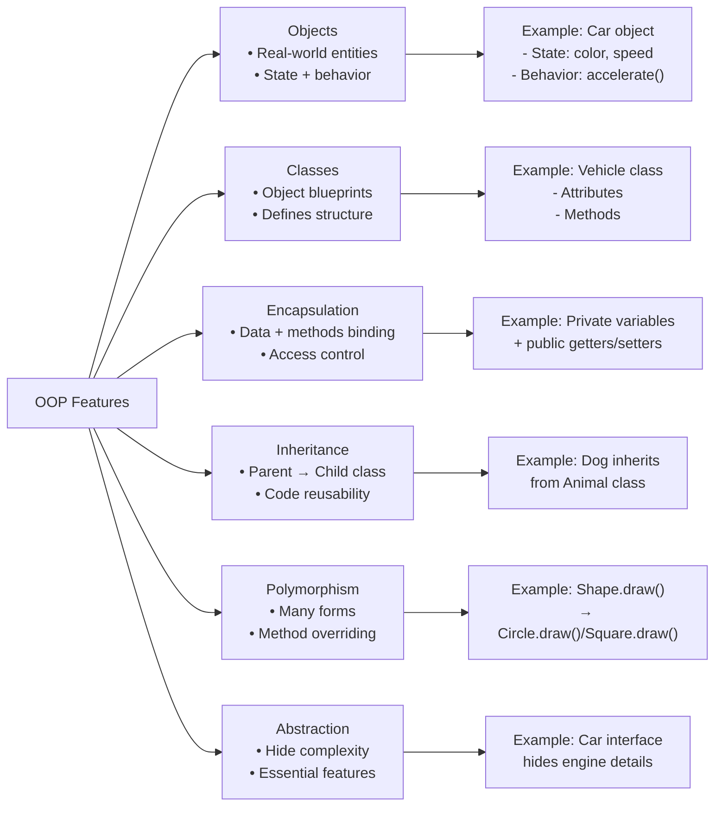
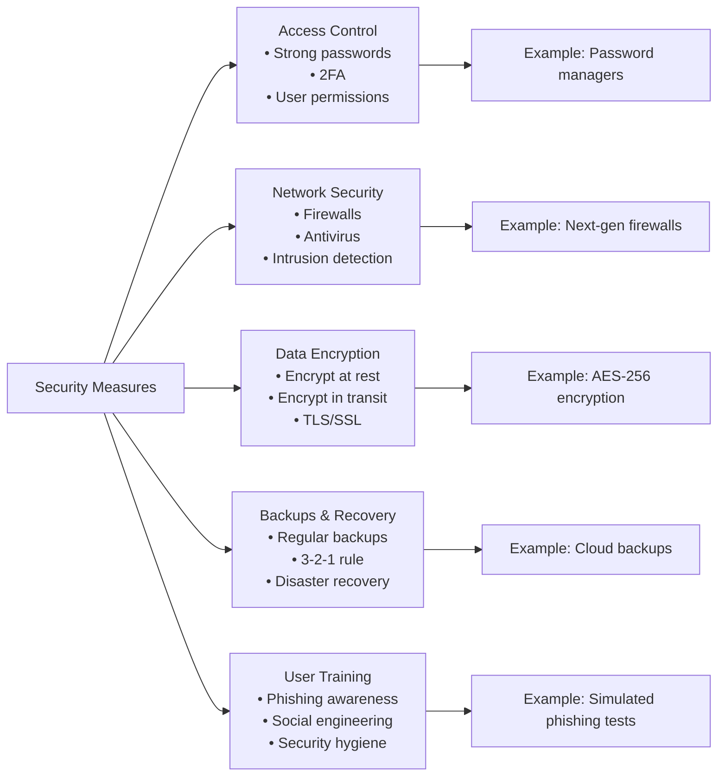
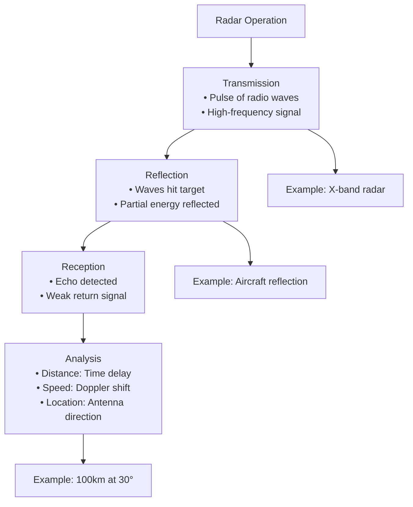

### **Part A: General Science**
**Total Marks: 60**
**(Answer any eight questions)**

---

### **Question 1**

**(a) Write the differences between an antibiotic and an antibody. (2 marks)**

**Answer:**

| Basis of Difference | Antibiotic | Antibody |
| :--- | :--- | :--- |
| **Origin** | A drug, either naturally produced (by fungi, bacteria) or synthetically made. | A protein produced naturally by the body's immune system (specifically, by B-cells). |
| **Target** | Specifically targets and kills or inhibits the growth of bacteria. | Specifically identifies and neutralizes foreign invaders (antigens), such as viruses, bacteria, or toxins. |
| **Function** | A form of external medication used to treat bacterial infections. | An internal component of the body's natural defense mechanism. |

---

**(b) Write the characteristics of contaminated and potable water. (2 marks)**

**Answer:**
*   **Contaminated Water:**
    *   Often has a foul odor, unpleasant taste, and may be turbid or colored.
    *   Contains harmful microorganisms (bacteria, viruses), toxic chemicals, or excessive minerals.
    *   Unsafe for drinking and can cause diseases like cholera, typhoid, and dysentery.
*   **Potable (Drinkable) Water:**
    *   It is colorless, odorless, and has a pleasant taste.
    *   Free from harmful pathogens and toxic chemicals.
    *   Contains beneficial minerals within safe limits.

---

**(c) What is Pasteurization? Why does pasteurized milk spoil when kept at room temperature? (1.5 + 2 = 3.5 marks)**

**Answer:**
*   **Pasteurization:** Pasteurization is a process of heating a liquid (like milk) to a specific temperature for a set period to kill or inactivate most of the harmful pathogenic bacteria. It is not sterilization; it does not kill all microorganisms. A common method is heating milk to 72°C for 15 seconds.
*   **Reason for Spoilage:** Pasteurized milk spoils at room temperature because the process does not kill all microorganisms. It eliminates the harmful pathogens that cause disease but leaves some harmless, spoilage-causing (thermoduric) bacteria. At warm room temperatures, these surviving bacteria multiply rapidly, consuming the lactose in the milk and producing lactic acid, which causes the milk to sour and spoil. Refrigeration slows down this bacterial growth, extending the milk's shelf life.

---

### **Question 2**

**(a) Write the chemical composition of a chromosome. (2 marks)**

**Answer:**
A chromosome is primarily composed of two main types of organic macromolecules:
1.  **DNA (Deoxyribonucleic Acid):** This is the genetic material that carries the hereditary information. It is a long, thread-like molecule.
2.  **Proteins:** The DNA is tightly coiled and packaged around proteins. There are two types:
    *   **Histone Proteins:** These are basic proteins that form a core structure (nucleosome) around which the DNA wraps. They are crucial for compacting the DNA.
    *   **Non-histone Proteins:** These include various enzymes and structural proteins involved in DNA replication and gene regulation.

---

**(b) How does fast food harm the human body? (2 marks)**

**Answer:**
Fast food harms the human body in several ways due to its typical composition:
*   **High in Unhealthy Fats:** It is often high in saturated and trans fats, which can raise bad (LDL) cholesterol levels, leading to an increased risk of heart disease and stroke.
*   **High in Sugar and Refined Carbohydrates:** This can cause rapid spikes in blood sugar, increasing the risk of type 2 diabetes and insulin resistance.
*   **High in Sodium (Salt):** Excessive sodium intake contributes to high blood pressure (hypertension).
*   **High in Calories, Low in Nutrients:** Fast food is calorie-dense but often lacks essential nutrients like vitamins, minerals, and fiber. This combination can lead to weight gain, obesity, and nutritional deficiencies.

---

**(c) Discuss the importance of genetic engineering in agricultural development. (3.5 marks)**

**Answer:**
Genetic engineering (gene technology) is immensely important for agricultural development. It allows for the precise modification of a plant's genetic material to introduce desirable traits, leading to:
1.  **Increased Crop Yield:** Developing crops that are more productive.
2.  **Pest and Disease Resistance:** Creating crops that are naturally resistant to certain insects (e.g., Bt cotton) or viral diseases, which reduces the need for chemical pesticides.
3.  **Herbicide Tolerance:** Engineering crops to tolerate specific herbicides, making weed control easier and more effective.
4.  **Improved Nutritional Value:** Enhancing the nutritional content of staple crops, such as "Golden Rice," which is enriched with Vitamin A to combat deficiency.
5.  **Tolerance to Environmental Stress:** Developing crops that can withstand adverse conditions like drought, salinity, or extreme temperatures, allowing agriculture to expand into marginal lands.

---

### **Question 3**

**(a) What type of test is required to confirm paternity? (2 marks)**

**Answer:**
To confirm paternity, a **DNA profiling test** (also known as DNA fingerprinting or genetic testing) is required. This test compares the DNA profile of the child with that of the alleged father. A child inherits half of their DNA from their mother and half from their father. By analyzing specific DNA markers, the test can determine with extremely high accuracy whether the man is the biological father.

---

**(b) What group of viruses does SARS-CoV-2 belong to? Which organ of the body does this virus affect first and most, and why? What steps should be taken to prevent the transmission of this virus? (5.5 marks)**

**Answer:**
*   **Virus Group:** SARS-CoV-2 belongs to the **Coronavirus** family.
*   **Organ Affected:** This virus primarily affects the **respiratory system**, especially the **lungs**.
    *   **Why:** The virus has spike proteins on its surface that bind very effectively to a specific receptor called **ACE2 (angiotensin-converting enzyme 2)**, which is found in high concentrations on the surface of cells in the lungs and airways. This binding allows the virus to easily enter and infect these cells.
*   **Preventive Steps:**
    1.  **Vaccination:** Getting vaccinated is the most effective way to prevent severe illness.
    2.  **Mask-Wearing:** Wearing a well-fitting mask in crowded or indoor public spaces.
    3.  **Hand Hygiene:** Frequent washing of hands with soap and water or using an alcohol-based hand sanitizer.
    4.  **Social Distancing:** Maintaining physical distance from others.
    5.  **Improving Ventilation:** Ensuring good airflow in indoor spaces by opening windows or using air purifiers.

---

### **Question 4**

**(a) Define acid and base. (2 marks)**

**Answer:**
*   **Acid:** An acid is a substance that produces hydrogen ions (H⁺) when dissolved in water. It typically has a sour taste, reacts with metals to produce hydrogen gas, and turns blue litmus paper red.
*   **Base:** A base is a substance that produces hydroxide ions (OH⁻) when dissolved in water. It usually has a bitter taste, feels slippery to the touch, and turns red litmus paper blue.

---

**(b) Write the names of three weak and three strong acids. (3 marks)**

**Answer:**
*   **Three Weak Acids:**
    1.  Acetic Acid (CH₃COOH)
    2.  Carbonic Acid (H₂CO₃)
    3.  Citric Acid
*   **Three Strong Acids:**
    1.  Hydrochloric Acid (HCl)
    2.  Sulfuric Acid (H₂SO₄)
    3.  Nitric Acid (HNO₃)

---

**(c) What is vinegar? Write its chemical formula. Why is vinegar used to preserve pickles? (2.5 marks)**

**Answer:**
*   **Vinegar:** Vinegar is a dilute aqueous solution of acetic acid.
*   **Chemical Formula:** The chemical formula for the active component, acetic acid, is **CH₃COOH**.
*   **Why it's used for pickles:** Vinegar is used to preserve pickles because its acidic nature creates an environment with a low pH. This acidic environment inhibits the growth of most spoilage-causing bacteria and other microorganisms that would otherwise cause the food to rot. It acts as a natural preservative.

---

### **Question 5**

**(a) Define scalar and vector quantities. (1+1=2 marks)**

**Answer:**
*   **Scalar Quantity:** A scalar quantity is a physical quantity that is fully described by its magnitude (or numerical value) alone. It has no direction associated with it. Examples include mass, speed, distance, and temperature.
*   **Vector Quantity:** A vector quantity is a physical quantity that is described by both its magnitude and its direction. Examples include velocity, displacement, force, and acceleration.

---

**(b) What is noise pollution? What are its harmful effects? (1+2=3 marks)**

**Answer:**
*   **Noise Pollution:** Noise pollution is the presence of unwanted, excessive, or disturbing sound in the environment that has harmful effects on human health, wildlife, and environmental quality.
*   **Harmful Effects:**
    *   **Health Issues:** It can cause hearing loss, tinnitus (ringing in the ears), high blood pressure, sleep disturbances, and increased stress and anxiety.
    *   **Cognitive Effects:** It can impair concentration and learning abilities.
    *   **Wildlife Disruption:** It can interfere with the communication and navigation of animals.

---

**(c) Write the applications of resonance. (2 marks)**

**Answer:**
Resonance, the tendency of a system to oscillate with greater amplitude at certain frequencies, has several important applications:
1.  **Radio and Television Tuning:** When you tune a radio, you are adjusting the natural frequency of the receiver circuit to match the frequency of the desired station, causing it to resonate and amplify that signal strongly.
2.  **Musical Instruments:** The bodies of string instruments (like guitars and violins) are designed to resonate with the frequencies produced by the strings, amplifying the sound.
3.  **Microwave Ovens:** Microwave ovens use microwaves at a frequency that matches the natural resonant frequency of water molecules, causing them to vibrate rapidly and generate heat to cook the food.

---

### **Question 6**

**(a) What are BOD and TDS of water? (1+1=2 marks)**

**Answer:**
*   **BOD (Biochemical Oxygen Demand):** BOD is a measure of the amount of dissolved oxygen needed by aerobic biological organisms to break down the organic material present in a given water sample. A high BOD indicates a high level of organic pollution.
*   **TDS (Total Dissolved Solids):** TDS is the total concentration of all dissolved substances (minerals, salts, and organic matter) in water. It is a measure of the overall mineral content of the water.

---

**(b) What are LDL and HDL? Describe their function in the human body. (1+2=3 marks)**

**Answer:**
*   **LDL and HDL:** LDL (Low-Density Lipoprotein) and HDL (High-Density Lipoprotein) are types of lipoproteins, which are particles that transport cholesterol in the blood.
*   **Their Function:**
    *   **LDL (often called "bad" cholesterol):** Its primary function is to transport cholesterol from the liver to the cells throughout the body. However, if there is too much LDL, it can build up in the walls of the arteries, forming plaque and leading to <font color="#ffff00">atherosclerosis</font> (hardening of the arteries).
    *   **HDL (often called "good" cholesterol):** Its main function is to act as a scavenger, picking up excess cholesterol from the cells and arteries and transporting it back to the liver to be removed from the body. This helps prevent plaque buildup.

---

**(c) What is the Rh factor of blood? Why is it important? (2.5 marks)**

**Answer:**
*   **Rh Factor:** The Rh factor is an inherited protein (an antigen) found on the surface of red blood cells. If your blood has this protein, you are Rh-positive. If your blood lacks this protein, you are Rh-negative.
*   **Importance:** The Rh factor is critically important in two main situations:
    1.  **Blood Transfusion:** An Rh-negative person should not receive Rh-positive blood because their immune system will produce antibodies against the Rh factor, leading to a potentially fatal transfusion reaction.
    2.  **Pregnancy:** It is crucial if an **Rh-negative mother** is carrying an **Rh-positive fetus**. During delivery, some of the baby's blood can enter the mother's bloodstream, causing her to develop anti-Rh antibodies. In a subsequent pregnancy with another Rh-positive baby, these antibodies can cross the placenta and attack the baby's red blood cells, causing a serious condition called hemolytic disease of the newborn.

---

### **Question 7**

**(a) What is called refraction of light? Write the laws of refraction of light. (3.5 marks)**

**Answer:**
*   **Refraction of Light:** Refraction is the bending of a light ray as it passes at an angle from one transparent medium to another medium of a different optical density.
*   **Laws of Refraction:**
    1.  **First Law:** The incident ray, the refracted ray, and the normal to the interface at the point of incidence all lie in the same plane.
    2.  **Second Law (Snell's Law):** For a given pair of media, the ratio of the sine of the angle of incidence (i) to the sine of the angle of refraction (r) is a constant. This constant is called the refractive index of the second medium with respect to the first.
        **Formula:** $$\frac{sin(i)}{sin(r)} = constant (\mu)$$

---

### **Question 8**

**(a) Discuss the causes of soil acidity. (4 marks)**

**Answer:**
Soil acidity (low pH) is caused by several natural and man-made factors:
1.  **High Rainfall (Leaching):** In regions with heavy rainfall, water percolates through the soil and leaches away basic cations like calcium, magnesium, and potassium. These are replaced by acidic cations like hydrogen and aluminum, making the soil acidic.
2.  **Parent Material:** Soils that develop from acidic parent rocks, such as granite and sandstone, are naturally more acidic.
3.  **Decomposition of Organic Matter:** The decomposition of organic matter by microorganisms releases carbon dioxide, which forms weak carbonic acid in the soil water.
4.  **Use of Nitrogen Fertilizers:** The application of ammonium-based nitrogen fertilizers can lead to soil acidification through a process called nitrification.
5.  **Acid Rain:** Atmospheric pollutants like sulfur dioxide and nitrogen oxides from industrial emissions can dissolve in rainwater to form acid rain, which lowers the pH of the soil.

---

**(b) Discuss the importance of renewable energy. (2 marks)**

**Answer:**
The importance of renewable energy is immense:
1.  **Environmental Protection:** Renewable sources like solar, wind, and hydro produce little to no greenhouse gas emissions, helping to combat climate change and reduce air pollution.
2.  **Energy Security:** They reduce a country's dependence on imported fossil fuels, which are often subject to price volatility and geopolitical instability.
3.  **Sustainability:** Unlike finite fossil fuels, renewable energy sources are inexhaustible and sustainable for future generations.
4.  **Economic Benefits:** The renewable energy sector creates jobs and stimulates economic growth through investment in new technologies.

---

**(c) Discuss the importance of biodiversity conservation. (1.5 marks)**

**Answer:**
Biodiversity conservation is crucial because:
1.  **Ecosystem Services:** Biodiversity provides essential services like pollination, soil formation, water purification, and climate regulation, which are vital for human survival.
2.  **Economic Value:** It provides resources for food, medicine, and industrial products. Ecotourism is also a significant source of income.
3.  **Ethical and Aesthetic Value:** Many people believe that every species has an intrinsic right to exist, and a diverse natural world provides immense aesthetic and cultural value.

---

### **Question 9**

**(a) Discuss the role of zinc-rich food in the human body. (2 marks)**

**Answer:**
Zinc is an essential trace mineral with several vital roles in the human body:
1.  **Immune Function:** Zinc is crucial for the normal development and function of immune cells. A deficiency can impair the immune system, making a person more susceptible to infections.
2.  **Wound Healing:** It plays a key role in cell growth and protein synthesis, which are necessary for repairing tissues and healing wounds.
3.  **Sense of Taste and Smell:** Zinc is essential for maintaining a proper sense of taste and smell.
4.  **Growth and Development:** It is vital for normal growth and development during pregnancy, childhood, and adolescence.

---

**(b) How many fat-soluble vitamins are there and what are they? Discuss the importance of these vitamins in the human body. (4 marks)**

**Answer:**
*   There are **four** fat-soluble vitamins: **A, D, E, and K**.
*   **Importance:**
    1.  **Vitamin A:** Essential for vision (especially night vision), immune function, and maintaining healthy skin and mucous membranes.
    2.  **Vitamin D:** Crucial for the absorption of calcium and phosphorus, which is necessary for building and maintaining strong bones and teeth. It also plays a role in immune function.
    3.  **Vitamin E:** Acts as a powerful antioxidant, protecting cells from damage caused by free radicals. It also supports immune function and helps prevent blood clots.
    4.  **Vitamin K:** Plays a vital role in blood clotting, which is essential to prevent excessive bleeding. It is also important for bone health.

---

**(c) In modern biology, why are not all enzymes called proteins? Justify with an example. (1.5 marks)**

**Answer:**
In modern biology, not all enzymes are called proteins because it has been discovered that some **RNA molecules**, called **ribozymes**, can also act as biological catalysts.
*   **Justification with Example:** For a long time, it was believed that only proteins had the complex three-dimensional structures needed for catalytic activity. However, the discovery of ribozymes proved this wrong. A key example is the **ribosome**, the cellular machinery responsible for protein synthesis. The part of the ribosome that catalyzes the formation of peptide bonds between amino acids is actually an RNA component, not a protein. This demonstrates that catalysis is not an exclusive property of proteins.

***

Of course. Here are the detailed answers for the remaining questions from the provided exam paper.

***

### **Part B: Computer and Information Technology**
**Total Marks: 25**
**(Answer any ten questions)**

---

**(a) What is the main function of the Central Processing Unit (CPU)? Describe the different parts of the CPU with a diagram. (2.5 marks)**

**Answer:**
**Main Function:** The main function of the CPU is to execute instructions and process data. It is the "brain" of the computer, performing all the necessary calculations and coordinating the activities of all other components.

**Diagram and Parts of CPU:**

```
      +--------------------------------+
      |      Central Processing Unit   |
      |             (CPU)              |
      |   +-----------+   +--------+   |
      |   | Control   |   |  ALU   |   |
      |   |   Unit    |   |        |   |
      |   |   (CU)    |   +--------+   |
      |   +-----------+                |
      +--------------------------------+
```

1.  **Arithmetic Logic Unit (ALU):** Performs all arithmetic operations (addition, subtraction) and logical operations (AND, OR, NOT, comparisons).
2.  **Control Unit (CU):** Directs and manages the operations of the entire computer system. It fetches instructions from memory, decodes them, and executes them.
3.  **Registers:** Small, high-speed memory units within the CPU used to temporarily store data, instructions, and memory addresses during processing.

---

**(b) What is cache memory used for? Write the differences between a Compiler and an Interpreter. (2.5 marks)**

**Answer:**
*   **Cache Memory:** Cache memory is a small, extremely fast type of volatile memory that is built into the CPU or located very close to it. It is used to temporarily store frequently accessed data and instructions from the main memory (RAM). Because the CPU can access the cache much faster than RAM, it significantly speeds up the computer's overall performance.

*   **Differences between Compiler and Interpreter:**

| Feature | Compiler | Interpreter |
| :--- | :--- | :--- |
| **Translation** | Translates the entire program at once into machine code. | Translates and executes the program line by line. |
| **Output** | Creates a separate executable file. | Does not create an executable file. |
| **Execution Speed** | The resulting program runs faster. | Execution is slower as translation occurs during runtime. |
| **Error Checking** | Reports all errors after scanning the whole program. | Reports an error as soon as it is found and stops execution. |

---

**(c) What is meant by Software? Give a brief description of System Software and Application Software with examples. (2.5 marks)**

**Answer:**
*   **Software:** A set of instructions, data, or programs used to operate computers and execute specific tasks. It tells the hardware what to do.

*   **System Software:** Manages the computer's hardware and provides a platform for application software to run. It works in the background.
    *   **Examples:** Microsoft Windows, macOS, Linux, Android.

*   **Application Software:** Designed to perform specific tasks for the end-user. The user interacts directly with this software.
    *   **Examples:** Microsoft Word (word processing), Google Chrome (web browsing), Photoshop (image editing).

---

**(d) What are the main features of OOP language? Name two OOP languages. (2.5 marks)**

**Answer:**
**Main Features of Object-Oriented Programming (OOP):**
1.  **Objects:** Real-world entities that have state and behavior.
2.  **Classes:** Blueprints for creating objects.
3.  **Encapsulation:** Binding data and the methods that operate on that data together into a single unit (a class).
4.  **Inheritance:** A mechanism where a new class (subclass) inherits properties and behavior from an existing class (superclass).
5.  **Polymorphism:** The ability of an object or method to take on many forms.
6.  **Abstraction:** Hiding complex implementation details and showing only the essential features of the object.

**Two OOP Languages:**
1.  Java
2.  C++ (or Python)

---

**(e) What is meant by SRS? At which stage of software development is SRS prepared? (2.5 marks)**

**Answer:**
*   **SRS (Software Requirement Specification):** An SRS is a comprehensive document that describes the features and behavior of a software application. It outlines the functional and non-functional requirements of the software to be developed. It serves as a contract between the development team and the client.

*   **Stage of Preparation:** The SRS is prepared during the **Requirement Analysis** phase of the Software Development Life Cycle (SDLC). This is one of the earliest stages, occurring after initial planning and before the design phase begins.

---

**(f) Write the main difference between Open Source and Proprietary Software. Give an example of an Open Source and a Proprietary Operating System. (2.5 marks)**

**Answer:**
*   **Main Difference:** The main difference lies in the accessibility of the **source code**.
    *   **Open Source Software:** The source code is freely available to the public. Anyone can view, modify, and distribute the code. It is often developed collaboratively and is usually free of charge.
    *   **Proprietary Software (Closed Source):** The source code is a protected secret owned by a company or individual. Users purchase a license to use the software but cannot access or modify the source code.

*   **Examples:**
    *   **Open Source OS:** Linux (e.g., Ubuntu)
    *   **Proprietary OS:** Microsoft Windows

---

**(g) What is meant by DBMS? Briefly describe the role of primary key and foreign key in a Relational Database with an example. (2.5 marks)**

**Answer:**
*   **DBMS (Database Management System):** A DBMS is a software system used to create, manage, and interact with databases. It allows users to store, retrieve, update, and manage data in an organized way.

*   **Role of Keys:**
    *   **Primary Key:** A primary key is a column that **uniquely identifies** each record (row) in a table. It cannot have duplicate or null values.
    *   **Foreign Key:** A foreign key is a column in one table that is a primary key in another table. It is used to **create a link or relationship** between the two tables.

*   **Example:** In a `Students` table, `StudentID` would be the primary key. In a `Courses` table, `CourseID` would be the primary key. An `Enrollments` table could have both `StudentID` and `CourseID` as foreign keys to link students to the courses they are enrolled in.

---

**(h) Write the names of the different layers of the TCP/IP Protocol Suite. What is HTTPS? Briefly describe the necessity of its use. (2.5 marks)**

**Answer:**
*   **Layers of TCP/IP Suite (4-layer model):**
    1.  Application Layer
    2.  Transport Layer
    3.  Internet Layer
    4.  Network Interface Layer (or Link Layer)

*   **HTTPS:** HTTPS stands for **Hypertext Transfer Protocol Secure**. It is the secure version of HTTP.

*   **Necessity:** It encrypts the data exchanged between a user's web browser and a website. This encryption is essential to protect sensitive information like passwords, credit card details, and personal data from being intercepted and stolen by attackers, especially during online banking, shopping, and logins.

---

~~**(i) Give a brief description of the 'Bangabandhu-1 Satellite'. (2.5 marks)**~~

~~**Answer:**~~
~~Bangabandhu-1 is the first geostationary communications satellite of Bangladesh. Launched on May 12, 2018, it is located at the 119.1° East orbital slot. The satellite provides a wide range of telecommunication services, including Direct-to-Home (DTH) television broadcasting, broadband internet services, and support for cellular backhaul. Its primary objectives are to ensure uninterrupted telecommunication services, especially in rural and remote areas, reduce the country's dependence on foreign satellites, and earn foreign currency by leasing out its transponders.~~

---

**(j) Write the difference between E-Commerce and F-Commerce. Briefly write about the social impact of F-Commerce run by women. (2.5 marks)**

**Answer:**
*   **Difference:**
    *   **E-Commerce (Electronic Commerce):** The broad practice of buying and selling goods and services over the internet, typically through dedicated websites or large online marketplaces (e.g., Amazon, Daraz).
    *   **F-Commerce (Facebook Commerce):** A specific subset of e-commerce where business activities are conducted exclusively on the Facebook platform, using features like Pages, Groups, and Messenger.

*   **Social Impact of F-Commerce run by Women:** F-Commerce has had a significant positive social impact by empowering women. It provides a low-cost, low-barrier entry point for women to start their own businesses from home. This enhances their financial independence, develops their entrepreneurial skills, and increases their participation in the economy, thereby improving their social standing and contributing to overall women's empowerment.

---

**(k) What is meant by Malware? Give a brief description with an example. (2.5 marks)**

**Answer:**
*   **Malware:** Short for "malicious software," malware is any software intentionally designed to cause damage to a computer, server, or network, or to steal information without the owner's consent.
*   **Description:** It is a broad category of cyber threats.
*   **Example:** **Ransomware** is a type of malware that encrypts a victim's files, making them inaccessible. The attacker then demands a ransom payment in exchange for the decryption key. A famous example is the **WannaCry** ransomware attack in 2017.

---

**(l) What is meant by a Wi-Fi access point? Write the difference between a Router and a Switch. (2.5 marks)**

**Answer:**
*   **Wi-Fi Access Point (AP):** A networking device that creates a wireless local area network (WLAN). It connects to a wired network (like a router) and broadcasts a Wi-Fi signal, allowing wireless devices to connect to the network and the internet.

*   **Difference between Router and Switch:**
    *   **Switch:** Connects devices on the **same** local network. It intelligently forwards data packets only to the intended recipient device using its MAC address.
    *   **Router:** Connects **different** networks together (e.g., your home network to the internet). It directs traffic between networks, finding the best path for data to travel using IP addresses.

---

**(m) What is an Information System? Briefly describe the necessary steps for the security of an Information System. (2.5 marks)**

**Answer:**
*   **Information System (IS):** An IS is an integrated system composed of people, processes, data, software, and hardware that work together to collect, process, store, and distribute information.
*   **Necessary Security Steps:**
    1.  **Access Control:** Implementing strong passwords, two-factor authentication, and user permissions to restrict access to authorized individuals.
    2.  **Network Security:** Using firewalls to block unauthorized network traffic and antivirus software to protect against malware.
    3.  **Data Encryption:** Encrypting sensitive data both at rest (in storage) and in transit (over the network).
    4.  **Regular Backups and Recovery Plan:** Creating regular backups of important data and having a plan to restore it in case of data loss or system failure.
    5.  **User Training:** Educating users about security best practices to prevent phishing and other social engineering attacks.



***

### **Part C: Computer and Information Technology**
**Total Marks: 15**
**(Answer any six questions)**

---

**(a) Write the main difference between Analog and Digital signals. Explain the relationship between wavelength and frequency of a wave. (2.5 marks)**

**Answer:**
*   **Difference between Analog and Digital Signals:**
    *   **Analog Signal:** A continuous wave that represents information in a continuous range of values. It is more susceptible to noise.
    *   **Digital Signal:** A discrete wave that represents information in a binary format (0s and 1s). It is more immune to noise.
*   **Relationship between Wavelength and Frequency:** Wavelength (λ) and frequency (f) are **inversely proportional**. This means that as the frequency of a wave increases, its wavelength decreases, and vice versa. Their relationship is defined by the formula: `c = fλ`, where 'c' is the constant speed of the wave (the speed of light for electromagnetic waves).

---

**(b) Describe Kirchhoff's Voltage Law with a diagram. (2.5 marks)**

**Answer:**
**Kirchhoff's Voltage Law (KVL):** It states that the algebraic sum of all the potential differences (voltages) around any closed loop in a circuit is equal to zero. This law is based on the conservation of energy.

**Diagram and Explanation:**
In the series circuit below, a voltage source (V) provides a voltage rise. The current (I) flows through resistors R₁ and R₂, creating voltage drops (V₁ and V₂) across them.
```
      +-------[ R₁ ]-------+
      |                    |
      V (+)                |
      | (-)                |
      +-------[ R₂ ]-------+
```
According to KVL, the sum of the voltage rises must equal the sum of the voltage drops.
`V - V₁ - V₂ = 0` or `V = V₁ + V₂`

---

**(c) What is an IC? Briefly mention the uses of Digital ICs. (2.5 marks)**

**Answer:**
*   **IC (Integrated Circuit):** An IC, also known as a microchip, is a set of electronic circuits on a small, flat piece of semiconductor material (usually silicon). It integrates thousands or millions of tiny components like transistors, resistors, and capacitors into a single chip.
*   **Uses of Digital ICs:** They are the fundamental building blocks of almost all modern electronic devices. Uses include:
    *   Computers (microprocessors, memory chips)
    *   Smartphones and tablets
    *   Digital watches, calculators, and cameras
    *   Logic gates and microcontrollers used in digital systems.

---

**(d) Write the difference between AC and DC voltage. (2.5 marks)**

**Answer:**

| Feature | AC (Alternating Current) Voltage | DC (Direct Current) Voltage |
| :--- | :--- | :--- |
| **Direction of Flow** | The polarity periodically reverses, causing the current to change direction. | The polarity is constant, and the current flows steadily in one direction. |
| **Waveform** | Typically a sine wave. | A straight, constant line. |
| **Source** | Generated by alternators in power plants. | Produced by batteries, solar cells, and power adapters. |

---

**(e) Briefly describe how Radar works. (2.5 marks)**

**Answer:**
**RADAR** (Radio Detection and Ranging) works on the principle of transmitting radio waves and analyzing the echoes that return.
1.  **Transmission:** A radar system transmits a pulse of high-frequency radio waves from an antenna.
2.  **Reflection:** These waves travel through the air and reflect off an object (e.g., an airplane, a ship).
3.  **Reception:** A small part of the reflected wave (the echo) travels back and is detected by the radar's receiver.
4.  **Analysis:** The system calculates the **distance** to the object based on the time it took for the echo to return. It can also determine the object's **speed** by measuring the frequency shift in the echo (Doppler effect) and its **location** from the direction the antenna was pointing.

---

**(f) Briefly describe the working principle of an electrical transformer. (2.5 marks)**

**Answer:**
The working principle of an electrical transformer is **mutual induction**. It consists of two coils, a primary and a secondary coil, wound on a common iron core. When an **alternating current (AC)** flows through the primary coil, it creates a continuously changing magnetic field in the core. According to Faraday's Law of Induction, this changing magnetic field induces an AC voltage in the secondary coil. The voltage is "stepped up" or "stepped down" depending on the ratio of the number of turns in the two coils. Transformers only work with AC, not DC.

---

**(g) Mention the differences between radio waves and microwaves. (2.5 marks)**

**Answer:**

| Feature | Radio Waves | Microwaves |
| :--- | :--- | :--- |
| **Frequency/Wavelength** | Lower frequency and longer wavelength. | Higher frequency and shorter wavelength. |
| **Bandwidth** | Offer lower bandwidth. | Offer much higher bandwidth, allowing for faster data rates. |
| **Propagation** | Can travel long distances and pass through obstacles like walls. | Travel in a straight line (line-of-sight) and are easily blocked by obstacles. |
| **Applications** | AM/FM radio broadcasting, television signals. | Satellite communication, Wi-Fi, radar, microwave ovens. |

---

**(h) Briefly explain how a circuit breaker works with a diagram. (2.5 marks)**

**Answer:**
A circuit breaker is an automatic switch that protects a circuit from overcurrent. A common type (MCB) uses two mechanisms:
1.  **Thermal Trip (for Overloads):** A bimetallic strip heats up and bends when a sustained overcurrent flows. This bending trips a switch, opening the circuit.
2.  **Magnetic Trip (for Short Circuits):** A very high, sudden current creates a strong magnetic field in a coil, which instantly pulls a plunger to trip the switch.

**Diagram:**
A simplified diagram would show the bimetallic strip and the electromagnet connected to a switch/latch mechanism inside the circuit breaker's housing.
```
   [ Input ]----(Bimetallic Strip)----(Switch Latch)----[ Output ]
                     |
                  (Electromagnet)
```

***

### **Part C: Computer and Information Technology**
**Total Marks: 15**
**(Answer any six questions)**

---

### **Question 11**

**(a) Write the main difference between Analog and Digital signals. Explain the relationship between wavelength and frequency of a wave. (2.5 marks)**

**Answer:**
*   **Difference between Analog and Digital Signals:**
    *   **Analog Signal:** A continuous wave that represents information in a continuous range of values. It is more susceptible to noise and degradation.
    *   **Digital Signal:** A discrete wave that represents information in a binary format (a series of 0s and 1s) at distinct intervals. It is more immune to noise.

*   **Relationship between Wavelength and Frequency:**
    Wavelength (λ) and frequency (f) of a wave are **inversely proportional**. This means that as the frequency of a wave increases, its wavelength decreases, and vice versa. The relationship is defined by the formula:
    `c = fλ`
    where:
    *   `c` is the constant speed of the wave (e.g., the speed of light for electromagnetic waves).
    *   `f` is the frequency.
    *   `λ` is the wavelength.

---

**(b) Describe Kirchhoff's Voltage Law with a diagram. (2.5 marks)**

**Answer:**
**Kirchhoff's Voltage Law (KVL):** This law states that the algebraic sum of all the potential differences (voltages) around any closed loop or mesh in a circuit is equal to zero. This law is based on the principle of conservation of energy.

**Diagram and Explanation:**
Consider a simple series circuit with a voltage source (V) and two resistors (R₁ and R₂).

```
      +-------[ R₁ ]-------+
      |                    |
      V (+)                |   (Current I flows in this direction)
      | (-)                |
      +-------[ R₂ ]-------+
```

1.  The battery provides a voltage rise (V).
2.  As current (I) flows through the resistors, it creates a voltage drop across each one (V₁ across R₁ and V₂ across R₂).
3.  According to KVL, for the closed loop, the sum of voltage rises must equal the sum of voltage drops.
    Therefore: `V = V₁ + V₂`
    Or, expressed as an algebraic sum around the loop: `V - V₁ - V₂ = 0`

---

**(c) What is an IC? Briefly mention the uses of Digital ICs. (2.5 marks)**

**Answer:**
*   **IC (Integrated Circuit):** An IC, also known as a microchip, is a set of electronic circuits on a single small, flat piece of semiconductor material (usually silicon). It integrates thousands or millions of tiny electronic components like transistors, resistors, and capacitors into a compact package.
*   **Uses of Digital ICs:** Digital ICs are the fundamental building blocks of almost all modern electronic devices. Their uses include:
    *   **Computers and Smartphones:** In microprocessors (CPUs) and memory chips (RAM, ROM).
    *   **Logic Operations:** Logic gates (AND, OR, NOT) used to perform digital logic.
    *   **Consumer Electronics:** In calculators, digital watches, cameras, and televisions.
    *   **Embedded Systems:** In microcontrollers that control devices like washing machines and cars.

---

**(d) Write the difference between AC and DC voltage. (2.5 marks)**

**Answer:**

| Feature | AC (Alternating Current) Voltage | DC (Direct Current) Voltage |
| :--- | :--- | :--- |
| **Direction of Flow** | The polarity periodically reverses, causing the current to change direction. | The polarity is constant, and the current flows steadily in one direction. |
| **Waveform** | Typically a sine wave. | A straight, constant line. |
| **Source** | Generated by alternators (e.g., in power plants). | Produced by batteries, solar cells, and AC-to-DC power adapters. |
| **Transmission** | Can be easily stepped up or down with transformers, making it efficient for long-distance transmission. | Difficult and expensive to step up or down, making long-distance transmission less efficient. |

---

**(e) Briefly describe how Radar works. (2.5 marks)**

**Answer:**
**RADAR** (which stands for **RA**dio **D**etection **A**nd **R**anging) works on the principle of transmitting radio waves and analyzing the echoes that return after hitting an object. The process is as follows:
1.  **Transmission:** The radar system's antenna transmits a short pulse of high-frequency radio waves in a specific direction.
2.  **Reflection (Echo):** These waves travel through the air until they strike an object (like an airplane or a ship), at which point they are reflected in various directions.
3.  **Reception:** A small portion of the reflected waves (the echo) travels back to the radar's antenna, which now acts as a receiver.
4.  **Analysis:** The system's computer analyzes the echo to determine:
    *   **Distance:** Calculated from the time it took for the echo to return.
    *   **Direction:** Determined by the direction the antenna was pointing when the echo was received.
    *   **Speed:** Calculated by measuring the change in the echo's frequency (the Doppler effect).

---

**(f) Briefly describe the working principle of an electrical transformer. (2.5 marks)**

**Answer:**
The working principle of an electrical transformer is **mutual electromagnetic induction**. A transformer consists of two separate coils of wire, a **primary coil** and a **secondary coil**, that are wound on a common laminated iron core.
1.  When an **alternating current (AC)** is passed through the primary coil, it creates a continuously changing magnetic field (or magnetic flux) in the iron core.
2.  This changing magnetic flux links with the secondary coil.
3.  According to Faraday's Law of Induction, this changing flux induces an alternating voltage in the secondary coil.
The voltage is "stepped up" if the secondary coil has more turns than the primary, and "stepped down" if it has fewer turns. Transformers only work with AC, as DC produces a constant magnetic field which cannot induce a voltage.

---

**(g) Mention the differences between radio waves and microwaves. (2.5 marks)**

**Answer:**

| Feature | Radio Waves | Microwaves |
| :--- | :--- | :--- |
| **Frequency/Wavelength** | Lower frequency and longer wavelength. | Higher frequency and shorter wavelength. |
| **Bandwidth** | Offer lower bandwidth, suitable for carrying less information (e.g., sound). | Offer much higher bandwidth, allowing for faster data rates (e.g., for internet). |
| **Propagation** | Can travel long distances and can diffract around obstacles and pass through walls. | Travel in a straight line (line-of-sight) and are easily blocked by obstacles like buildings. |
| **Applications** | AM/FM radio broadcasting, television signals, long-range communication. | Satellite communication, Wi-Fi, radar, mobile phone networks, and microwave ovens. |

---

**(h) Briefly explain how a circuit breaker works with a diagram. (2.5 marks)**

**Answer:**
A circuit breaker is an automatic electrical switch designed to protect a circuit from damage caused by an overcurrent. It works using two mechanisms:

1.  **Thermal Trip (for Overloads):** A **bimetallic strip** inside the breaker heats up and bends when a sustained, moderate overcurrent flows through it. This bending trips a mechanical latch, opening the circuit. This protects against overloaded circuits.
2.  **Magnetic Trip (for Short Circuits):** A very high and sudden surge of current (a short circuit) creates a strong magnetic field in an **electromagnet** (solenoid). This magnetic force instantly pulls a plunger that trips the latch, opening the circuit much faster than the thermal mechanism.

**Simplified Diagram Description:**
A diagram would show the input and output terminals connected through a pair of contacts. One contact is movable and held in place by a spring-loaded latch. Both the bimetallic strip and the electromagnet are positioned to release this latch when activated, causing the contacts to spring apart and break the circuit.
```
   [ Input ]----(Bimetallic Strip)----+----(Movable Contact)---->[ Output ]
                     |               |
                  (Electromagnet)  (Latch Mechanism)
```