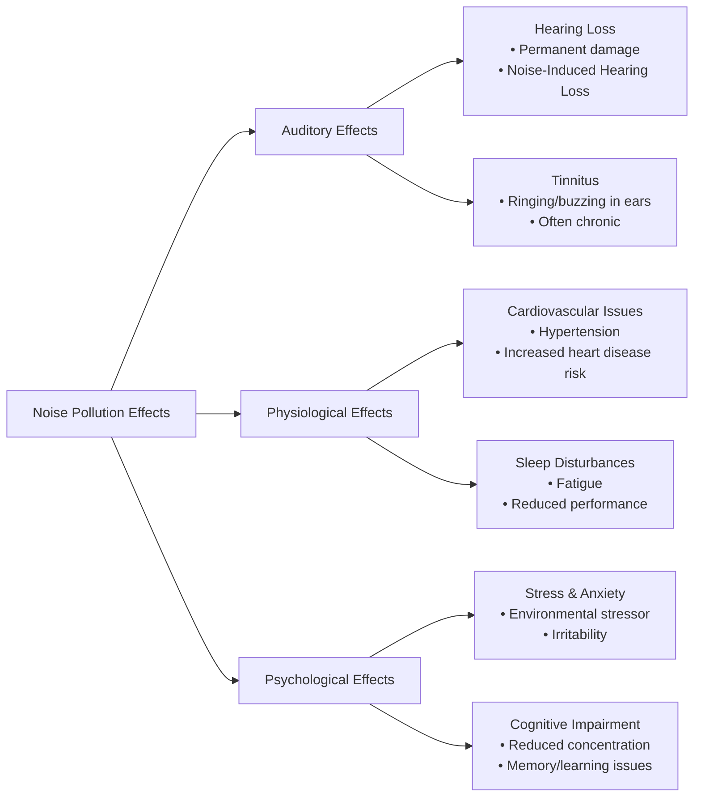
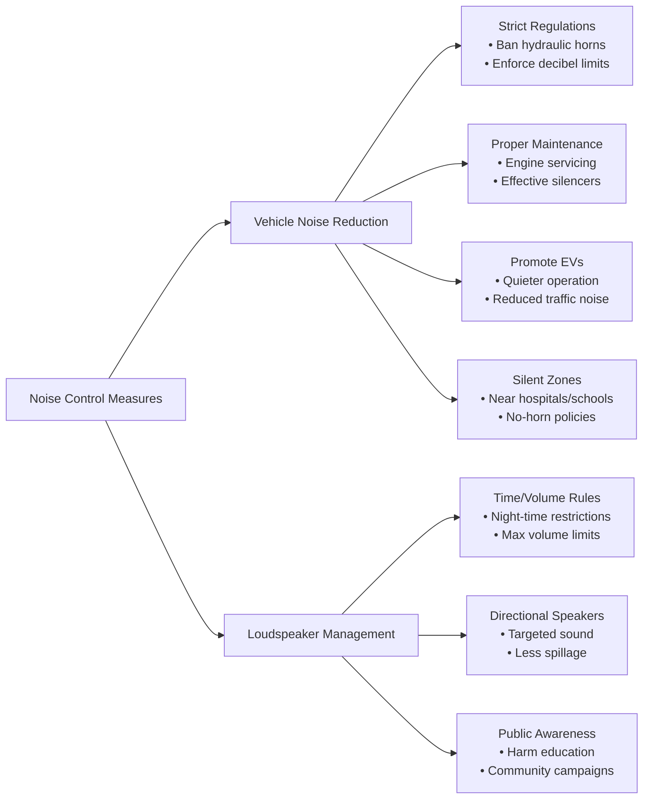
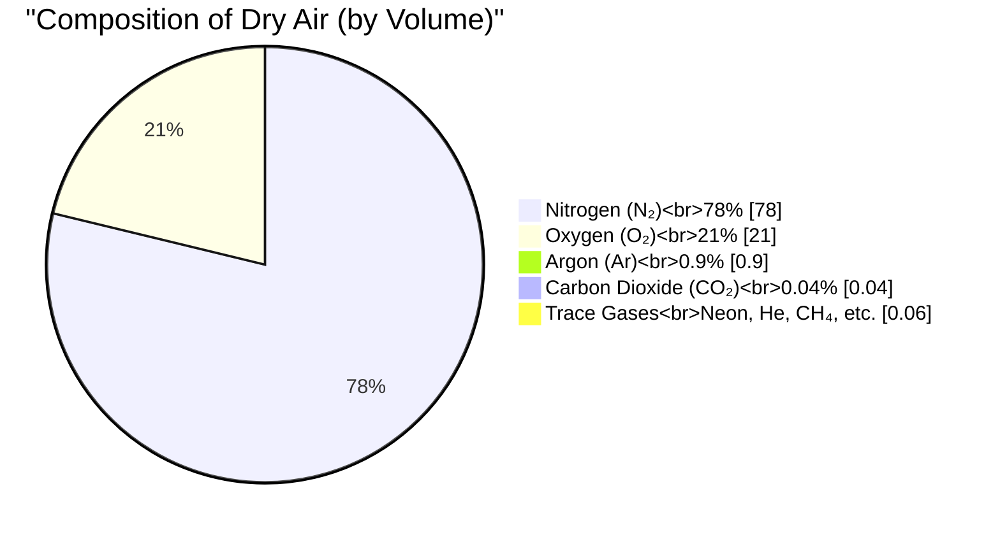
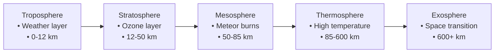

### **Part A: General Science**
**Total Marks: 60**
**(Answer any eight questions)**

---

### **Question 1**

**(a) What are the harmful effects of noise pollution? (2.5 marks)**

**Answer:**
Noise pollution has significant harmful effects on human health and well-being, which can be categorized as:
*   **Auditory Effects:**
    *   **Hearing Loss:** Prolonged exposure to loud noise can cause permanent, irreversible hearing damage (Noise-Induced Hearing Loss).
    *   **Tinnitus:** A persistent ringing or buzzing sound in the ears.
*   **Physiological Effects:**
    *   **Cardiovascular Issues:** Chronic noise exposure can increase heart rate, blood pressure (hypertension), and the risk of heart disease.
    *   **Sleep Disturbances:** Noise can disrupt sleep patterns, leading to fatigue and reduced performance.
*   **Psychological Effects:**
    *   **Stress and Anxiety:** Unwanted noise is a major environmental stressor, increasing irritability, anxiety, and stress levels.
    *   **Cognitive Impairment:** It can interfere with concentration, memory, and learning abilities, especially in children.

---

**(b) What is a decibel? What is its acceptable level for school students? (2.5 marks)**

**Answer:**
*   **Decibel (dB):** A decibel is a logarithmic unit used to measure the intensity or loudness of a sound. The decibel scale is logarithmic, meaning that a small increase in decibels represents a large increase in sound intensity. For example, a 10 dB increase corresponds to a 10-fold increase in sound intensity.
*   **Acceptable Level:** The World Health Organization (WHO) recommends that noise levels inside classrooms should not exceed **35 dB** to ensure a good learning environment. In Bangladesh, schools are designated as "silent zones," where the acceptable noise limit is generally **50 dB** during the day.

---

**(c) What measures should be taken to control noise pollution caused by vehicles and loudspeakers? (2.5 marks)**

**Answer:**
Measures to control noise pollution from vehicles and loudspeakers include:
*   **For Vehicles:**
    1.  **Strict Regulations:** Enforce a ban on the use of high-pitched hydraulic horns.
    2.  **Proper Maintenance:** Ensure regular maintenance of vehicle engines and use effective silencers to reduce engine noise.
    3.  **Promote Alternatives:** Encourage the use of electric vehicles, which are significantly quieter.
    4.  **Create Silent Zones:** Designate and enforce "no-horn" or "silent zones" around hospitals, schools, and residential areas.
*   **For Loudspeakers:**
    1.  **Time and Volume Restrictions:** Regulate the hours of use and set maximum permissible volume levels for loudspeakers, especially during night hours.
    2.  **Use of Directional Speakers:** Promote the use of speakers that direct sound towards the intended audience, minimizing sound spillage.
    3.  **Public Awareness:** Conduct campaigns to educate the public about the harmful effects of noise pollution.

---

### **Question 2**

**(a) What are the components of air? Mention the layering of the atmosphere. (2.5 marks)**

**Answer:**
*   **Components of Air:** The composition of dry air by volume is approximately:
    *   **Nitrogen (N₂):** 78%
    *   **Oxygen (O₂):** 21%
    *   **Argon (Ar):** 0.9%
    *   **Carbon Dioxide (CO₂):** ~0.04%
    *   **Trace Gases:** Small amounts of Neon, Helium, Methane, Krypton, and Hydrogen.

*   **Layering of the Atmosphere:** The atmosphere is divided into five main layers based on temperature changes:
    1.  **Troposphere:** The lowest layer, where weather occurs.
    2.  **Stratosphere:** Contains the ozone layer.
    3.  **Mesosphere:** The layer where meteors burn up.
    4.  **Thermosphere:** Characterized by very high temperatures.
    5.  **Exosphere:** The outermost layer, fading into space.

---

**(b) What is ozone gas? What harm does this gas do to the human body? (2.5 marks)**

**Answer:**
*   **Ozone Gas (O₃):** Ozone is a molecule made up of three oxygen atoms. Its role depends on its location in the atmosphere. In the stratosphere, it forms the protective "ozone layer" that absorbs harmful UV radiation.
*   **Harm to the Human Body:** When ozone is present in the troposphere (ground-level ozone), it is a harmful air pollutant and a primary component of smog. Inhaling ground-level ozone can:
    *   Irritate the respiratory system, causing coughing and throat soreness.
    *   Reduce lung function and make it more difficult to breathe deeply.
    *   Aggravate asthma and other chronic lung diseases like bronchitis and emphysema.
    *   Increase susceptibility to respiratory infections.

---

**(c) What is carbon emission? What are its harmful effects on the atmosphere and ways to control it? (2.5 marks)**

**Answer:**
*   **Carbon Emission:** The release of carbon, primarily in the form of carbon dioxide (CO₂) and methane (CH₄), into the atmosphere. The main source is the burning of fossil fuels (coal, oil, and natural gas) for energy and transportation.
*   **Harmful Effects:** Carbon emissions are the primary driver of the **enhanced greenhouse effect**. These gases trap heat in the atmosphere, leading to **global warming** and **climate change**. The consequences include rising sea levels, more frequent and intense extreme weather events (heatwaves, floods, droughts), and disruption of ecosystems.
*   **Ways to Control It:**
    1.  **Transition to Renewable Energy:** Shifting from fossil fuels to solar, wind, and hydropower.
    2.  **Improve Energy Efficiency:** Using less energy in homes, industries, and transportation.
    3.  **Afforestation and Reforestation:** Planting trees, which absorb CO₂.
    4.  **Carbon Capture Technologies:** Developing technologies to capture CO₂ emissions from sources like power plants.

---

### **Question 3**

**(a) What is a triglyceride? What is its role in the human body? (2.5 marks)**

**Answer:**
*   **Triglyceride:** A triglyceride is a type of fat (lipid) found in the blood. It is the main constituent of body fat in humans and is also found in vegetable and animal fats. Chemically, it is an ester formed from a glycerol molecule and three fatty acid molecules.
*   **Role in the Human Body:**
    1.  **Energy Storage:** The primary role of triglycerides is to store unused calories. When you eat, your body converts any calories it doesn't need to use right away into triglycerides, which are stored in fat cells.
    2.  **Energy Source:** Between meals, hormones release these stored triglycerides for energy.
    3.  **Insulation and Protection:** Body fat provides insulation against cold and cushions vital organs.
    While essential, very high levels of triglycerides in the blood are associated with an increased risk of heart disease.

---

**(b) How can blood sugar and high blood pressure be controlled without medicine? (2.5 marks)**

**Answer:**
Blood sugar and high blood pressure can often be managed or controlled through significant lifestyle modifications:
1.  **Dietary Changes:**
    *   **For Blood Sugar:** Reduce intake of refined carbohydrates and sugary foods. Focus on high-fiber foods, whole grains, and lean proteins.
    *   **For Blood Pressure:** Limit sodium (salt) intake. Follow a diet rich in fruits, vegetables, and low-fat dairy (like the DASH diet).
2.  **Regular Physical Activity:** Engaging in at least 150 minutes of moderate-intensity aerobic exercise (like brisk walking, cycling) per week.
3.  **Weight Management:** Losing even a small amount of excess weight can significantly improve both blood sugar and blood pressure levels.
4.  **Stress Reduction:** Practicing stress-management techniques like meditation, yoga, or deep breathing.
5.  **Limit Alcohol and Quit Smoking:** Both alcohol and smoking can raise blood pressure and affect blood sugar control.

---

**(c) Is controlling cholesterol in food the only way to reduce blood cholesterol? Explain. (2.5 marks)**

**Answer:**
No, controlling the amount of cholesterol in food is **not** the only, or even the most effective, way to reduce blood cholesterol.
**Explanation:**
The majority of cholesterol in our blood is actually produced by our own liver. The amount of cholesterol the liver produces is more strongly influenced by the types of fat we eat than by the amount of cholesterol we eat.
*   **Saturated and Trans Fats:** Diets high in saturated fats (found in red meat, butter) and trans fats (found in fried and processed foods) are the main dietary culprits. These fats signal the liver to produce more harmful LDL cholesterol.
*   **Other Factors:** Beyond diet, other factors like genetics, physical inactivity, and being overweight also play a major role in determining blood cholesterol levels.
Therefore, a more effective strategy is to reduce intake of saturated and trans fats, increase physical activity, and maintain a healthy weight, rather than solely focusing on the cholesterol content of food.

---

### **Question 4**

**(a) What is your idea about the use of modern instruments in human disease control and healthcare? (2.5 marks)**

**Answer:**
Modern instruments have revolutionized healthcare and disease control by enabling:
1.  **Accurate and Early Diagnosis:** Instruments like MRI, CT scans, and ultrasound provide detailed images of the inside of the body, allowing for the early and precise detection of diseases like cancer, heart conditions, and internal injuries, often before symptoms become severe.
2.  **Non-Invasive Procedures:** Many diagnostic techniques are non-invasive or minimally invasive, reducing risk and recovery time for patients.
3.  **Targeted Treatment:** Technologies like linear accelerators for radiotherapy allow for precise targeting of tumors, minimizing damage to surrounding healthy tissue.
4.  **Monitoring and Management:** Devices for monitoring vital signs (ECG), blood glucose, etc., help in the continuous management of chronic diseases.
In essence, these instruments have made healthcare more effective, safer, and less painful, significantly improving patient outcomes.

---

**(b) Mention what types of diseases can be diagnosed by X-ray, CT scan, MRI, and ultrasonography. (2.5 marks)**

**Answer:**
*   **X-ray:** Primarily used to visualize dense structures like bones. Diagnoses bone fractures, dislocations, dental problems, and lung conditions like pneumonia and lung cancer.
*   **CT (Computed Tomography) Scan:** Creates detailed cross-sectional images. Used to diagnose tumors, internal bleeding, blood clots, and complex bone fractures.
*   **MRI (Magnetic Resonance Imaging):** Excellent for visualizing soft tissues. Used to diagnose brain and spinal cord injuries, torn ligaments and tendons, tumors, and strokes.
*   **Ultrasonography:** Uses sound waves to create images. It is very safe and used to monitor fetal development during pregnancy, examine abdominal organs (liver, gallbladder, kidneys), and visualize blood flow in vessels.

---

**(c) What do you mean by DNA and RNA? (2.5 marks)**

**Answer:**
**DNA (Deoxyribonucleic Acid):** DNA is a molecule that carries the genetic instructions for the development, functioning, growth, and reproduction of all known organisms and many viruses. It is often referred to as the "blueprint of life." Structurally, it is a double helix, composed of two long chains of nucleotides.

**RNA (Ribonucleic Acid):** RNA is a molecule that plays several vital roles in the coding, decoding, regulation, and expression of genes. Unlike the double-stranded DNA, RNA is typically single-stranded. Its primary function is to act as a messenger (mRNA), carrying instructions from the DNA in the cell's nucleus to the ribosomes, where proteins are synthesized.

---

### **Question 5**

**(a) What is fiber-rich food? Write its importance for human health. (2.5 marks)**

**Answer:**
*   **Fiber-rich Food:** Dietary fiber is a type of carbohydrate found in plant-based foods like fruits, vegetables, whole grains, nuts, and legumes. Unlike other carbohydrates, it cannot be digested or absorbed by the human body.
*   **Importance for Human Health:**
    1.  **Promotes Digestive Health:** It adds bulk to stool, which helps prevent constipation and maintain regular bowel movements.
    2.  **Helps Control Blood Sugar:** Soluble fiber can slow the absorption of sugar, helping to improve blood sugar levels.
    3.  **Lowers Cholesterol:** It can help lower levels of "bad" LDL cholesterol, reducing the risk of heart disease.
    4.  **Aids in Weight Management:** High-fiber foods are more filling, which can help you eat less and stay satisfied longer.

---

**(b) Provide a daily balanced diet chart for a pregnant mother. (2.5 marks)**

**Answer:**
A balanced diet for a pregnant mother should be rich in folic acid, iron, calcium, and protein. Here is a sample daily chart:
*   **Breakfast:** One bowl of oatmeal or fortified cereal with milk, one boiled egg, and a banana.
*   **Mid-morning Snack:** A handful of almonds and an apple.
*   **Lunch:** A portion of brown rice, a bowl of lentil soup (dal), a serving of lean chicken or fish curry, and a large portion of mixed vegetable salad.
*   **Afternoon Snack:** A cup of yogurt and a piece of fruit.
*   **Dinner:** Two whole-wheat rotis, a serving of leafy green vegetables (like spinach), and a bowl of beans or paneer curry.
    *It is also crucial to drink plenty of water throughout the day.*

---

**(c) How do rubber and plastic disrupt the balance of our environment? (2.5 marks)**

**Answer:**
Rubber and plastic disrupt the environmental balance in several significant ways:
1.  **Non-Biodegradability:** Most plastics and synthetic rubbers do not biodegrade. They persist in the environment for hundreds or thousands of years, accumulating in landfills, soil, and oceans.
2.  **Pollution:** They break down into smaller particles called **microplastics**, which contaminate soil and water. These particles can absorb toxins and are ingested by wildlife, entering the food chain and potentially harming human health.
3.  **Harm to Wildlife:** Animals can mistake plastic debris for food or become entangled in it, leading to injury, suffocation, and death.
4.  **Resource Depletion:** The majority of plastics are produced from fossil fuels, which are finite, non-renewable resources.
5.  **Air Pollution:** The manufacturing process and the burning of plastic waste release greenhouse gases and toxic fumes into the atmosphere.

---

### **Question 6**

**(a) What is light? Discuss the electromagnetic theory of light. (2.5 marks)**

**Answer:**
*   **Light:** Light is a form of energy and a type of electromagnetic radiation that is visible to the human eye. It behaves as both a wave and a particle (a concept known as wave-particle duality).
*   **Electromagnetic Theory of Light:** Proposed by James Clerk Maxwell in the 19th century, this theory states that light consists of oscillating electric and magnetic fields. Key points of the theory are:
    *   The electric and magnetic fields vibrate perpendicular to each other and to the direction of the wave's propagation, making light a **transverse wave**.
    *   Light does not require a medium to travel and can propagate through a vacuum.
    *   The speed of light in a vacuum (c) is a universal constant, approximately 3 x 10⁸ m/s.
    This theory successfully unified electricity, magnetism, and optics.

**Particle Theory of Light**
The particle theory of light, also known as the quantum theory of light, posits that light is composed of a stream of discrete, massless particles or energy packets called **photons**.

Key aspects of this theory are:

1. **Quantized Energy:** Each photon carries a specific, discrete amount of energy (a quantum) which is directly proportional to the frequency of the light. This is described by the equation **E = hf**, where h is Planck's constant and f is the frequency.
    
2. **Photoelectric Effect:** This theory successfully explains the **photoelectric effect**, where light hitting a metal surface can eject electrons. This phenomenon could not be explained by the classical wave theory of light and provided strong evidence for the particle nature of light.
---

**(b) Write the names of different electromagnetic waves in order of energy and wavelength. (2.5 marks)**

**Answer:**
The electromagnetic spectrum is arranged in order of wavelength and energy. Energy and frequency are directly proportional, while both are inversely proportional to wavelength.

**In order of increasing energy/frequency (and decreasing wavelength):**
1.  **Radio waves** (Lowest energy, longest wavelength)
2.  **Microwaves**
3.  **Infrared**
4.  **Visible Light**
5.  **Ultraviolet**
6.  **X-rays**
7.  **Gamma rays** (Highest energy, shortest wavelength)

---

**(c) What is color blindness? Explain. (2.5 marks)**

**Answer:**
*   **Color Blindness:** Color blindness, or more accurately, color vision deficiency, is a condition where a person has a reduced ability to distinguish between certain colors. It is not usually a total inability to see color, but rather a difficulty with specific color pairs.
*   **Explanation:** This condition occurs due to a problem with the color-sensing pigments in the **cone cells** of the retina. The retina has three types of cone cells, each sensitive to red, green, or blue light. If one or more of these types of cones are faulty or absent, the person will have a color deficiency. The most common form is **red-green color blindness**, which is a genetic condition passed down on the X chromosome, making it far more common in males than in females.

---

### **Question 7**

**(a) Define acid and base. Mention two modern theories about them. (2.5 marks)**

**Answer:**
*   **Acid:** Traditionally, an acid is a substance that tastes sour, reacts with metals, and turns blue litmus paper red.
*   **Base:** Traditionally, a base is a substance that tastes bitter, feels slippery, and turns red litmus paper blue.
*   **Two Modern Theories:**
    1.  **Brønsted-Lowry Theory:** This theory defines an acid as a **proton (H⁺ ion) donor** and a base as a **proton (H⁺ ion) acceptor**. This theory is broader as it is not limited to aqueous solutions.
    2.  **Lewis Theory:** This is the most general theory. It defines an acid as an **electron-pair acceptor** and a base as an **electron-pair donor**.

---

**(b) What is pH? Write the names of two organic and two inorganic acids and comment on their pH. (2.5 marks)**

**Answer:**
*   **pH:** pH is a scale used to specify the acidity or basicity of an aqueous solution. It is defined as the negative logarithm of the hydrogen ion concentration (`pH = -log[H⁺]`). A pH of 7 is neutral, a pH less than 7 is acidic, and a pH greater than 7 is basic.
*   **Acids and their pH:**
    1.  **Organic Acids:** Acetic acid (CH₃COOH), Citric acid.
    2.  **Inorganic (Mineral) Acids:** Hydrochloric acid (HCl), Sulfuric acid (H₂SO₄).
*   **Comment on pH:** Organic acids are generally **weak acids**, meaning they do not fully dissociate in water. Their pH would be in the mildly acidic range (e.g., pH 2.5 to 6). Most common inorganic acids are **strong acids**, meaning they dissociate completely. Their pH would be in the highly acidic range (e.g., pH 0 to 2).

---

**(c) How many types of salts are there? Write the name and example of each type. (2.5 marks)**

**Answer:**
Based on their formation from acids and bases, salts can be classified into three main types:
1.  **Normal (or Neutral) Salt:** Formed by the complete neutralization of a strong acid and a strong base. Their aqueous solution has a pH of approximately 7.
    *   **Example:** Sodium Chloride (NaCl)
2.  **Acidic Salt:** Formed from the reaction of a strong acid and a weak base. Their aqueous solution is acidic (pH < 7) due to the hydrolysis of the cation.
    *   **Example:** Ammonium Chloride (NH₄Cl)
3.  **Basic Salt:** Formed from the reaction of a weak acid and a strong base. Their aqueous solution is basic (pH > 7) due to the hydrolysis of the anion.
    *   **Example:** Sodium Acetate (CH₃COONa)

---

### **Question 8**

**(a) What is the difference between water and heavy water? (2.5 marks)**

**Answer:**
The primary difference between normal water (H₂O) and heavy water (D₂O) lies in the isotope of hydrogen they contain.
*   **Composition:**
    *   **Water (H₂O):** Contains the most common hydrogen isotope, **protium (¹H)**, which has a nucleus with only one proton.
    *   **Heavy Water (D₂O):** Contains a heavier hydrogen isotope, **deuterium (²H or D)**, which has a nucleus with one proton and one neutron.
*   **Properties:** Due to the heavier deuterium atom, heavy water is about 10% denser than normal water and has slightly higher boiling and freezing points. Its main use is as a neutron moderator in certain types of nuclear reactors.

---

**(b) What is a hydrogen bond? Write the effect of hydrogen bonds on water and ice. (2.5 marks)**

**Answer:**
*   **Hydrogen Bond:** A hydrogen bond is a special type of electrostatic attraction between a hydrogen atom covalently bonded to a highly electronegative atom (like oxygen, nitrogen, or fluorine) and another nearby electronegative atom. It is stronger than a typical van der Waals interaction but weaker than a covalent bond.
*   **Effect on Water and Ice:**
    *   **In Liquid Water:** Hydrogen bonds are constantly forming and breaking, pulling the water molecules close together. This is responsible for many of water's unique properties, such as its high boiling point and high surface tension.
    *   **In Ice:** As water freezes, the hydrogen bonds lock the water molecules into a fixed, open hexagonal crystal lattice. This orderly arrangement forces the molecules farther apart than they are in the liquid state, making ice **less dense than liquid water**. This is why ice floats.

---

**(c) Give your opinion on dealing with the future crisis of pure water. (2.5 marks)**

**Answer:**
Dealing with the future crisis of pure water requires a multi-faceted and integrated approach involving technology, policy, and individual action. My opinion is that the focus must be on sustainability and efficiency. Key strategies should include:
1.  **Aggressive Water Conservation:** This is the most cost-effective solution. We must drastically reduce water waste in agriculture (through drip irrigation), industries, and our homes.
2.  **Wastewater Treatment and Reuse:** Investing in advanced technologies to treat wastewater to a high standard, making it safe for reuse in agriculture, industry, or even for replenishing groundwater.
3.  **Sustainable Desalination:** Making desalination of seawater more energy-efficient and environmentally friendly by powering it with renewable energy.
4.  **Protecting Natural Sources:** Implementing and enforcing strict policies to prevent the pollution of rivers, lakes, and groundwater from industrial and agricultural runoff.
5.  **Public Awareness:** Educating the public about the value of water to foster a culture of conservation.

---

### **Question 9**

**Write the differences:** (2.5 x 3 = 7.5 marks)

**(a) Saline soil and acidic soil**

**Answer:**

| Feature | Saline Soil | Acidic Soil |
| :--- | :--- | :--- |
| **pH Level** | pH is typically neutral to alkaline (pH ≥ 7.0). | pH is low (pH < 6.5). |
| **Problem** | High concentration of soluble salts, which hinders water absorption by plants (osmotic stress). | High acidity, which can lead to aluminum and manganese toxicity and deficiency of key nutrients. |
| **Formation** | Common in arid and semi-arid regions where evaporation exceeds precipitation. | Common in regions with high rainfall, which leaches away basic minerals from the soil. |

---

**(b) Food safety and food security**

**Answer:**

| Feature | Food Safety | Food Security |
| :--- | :--- | :--- |
| **Definition** | A scientific discipline describing the handling, preparation, and storage of food to prevent foodborne illness. | A condition where all people, at all times, have physical and economic access to sufficient, safe, and nutritious food. |
| **Focus** | Focuses on preventing contamination and ensuring food is not harmful to health. It is about the **quality** of food. | Focuses on availability, access, and proper utilization of food. It is about the **quantity and access**. |
| **Scope** | Deals with microbiology, chemistry, and processing from farm to fork. | Deals with economics, agriculture, policy, and social distribution systems. |

---

**(c) Radiotherapy and chemotherapy**

**Answer:**

| Feature | Radiotherapy | Chemotherapy |
| :--- | :--- | :--- |
| **Method** | Uses high-energy radiation (like X-rays) to destroy cancer cells and shrink tumors. | Uses cytotoxic (cell-killing) drugs to destroy cancer cells. |
| **Treatment Scope** | **Local Treatment:** It targets a specific, localized area of the body where the tumor is located. | **Systemic Treatment:** The drugs travel throughout the entire body via the bloodstream to reach cancer cells wherever they are. |
| **Side Effects** | Side effects are usually confined to the treated area (e.g., skin redness, fatigue). | Side effects can affect the whole body (e.g., nausea, hair loss, fatigue, increased risk of infection). |
***

### **Part B: Computer and Information Technology**
**Total Marks: 25**
**(Answer any ten questions)**

---

**(a) Explain the differences between RAM and ROM. (2.5 marks)**

**Answer:**

| Basis of Difference | RAM (Random Access Memory) | ROM (Read-Only Memory) |
| :--- | :--- | :--- |
| **Volatility** | It is **volatile** memory. Its contents are lost when the power is turned off. | It is **non-volatile** memory. Its contents are retained even when the power is off. |
| **Function** | Used as the main working memory of the computer to temporarily store data and programs that the CPU is actively using. | Used to store firmware like the BIOS, which is needed to boot up the computer. |
| **Operation** | Data can be both read from and written to RAM easily and quickly. | Data can only be read from it. Writing new data is difficult or impossible. |
| **Speed** | It is much faster than ROM. | It is slower compared to RAM. |

---

**(b) Write the full forms of the following abbreviations: EEPROM, MICR, POST, HCI, SMTP. (2.5 marks)**

**Answer:**
*   **EEPROM:** Electrically Erasable Programmable Read-Only Memory
*   **MICR:** Magnetic Ink Character Recognition
*   **POST:** Power-On Self-Test
*   **HCI:** Human-Computer Interaction
*   **SMTP:** Simple Mail Transfer Protocol

---

**(c) Describe the function of BIOS in a computer. (2.5 marks)**

**Answer:**
**BIOS (Basic Input/Output System)** is firmware stored on a chip on the motherboard. Its main functions occur during the computer's startup:
1.  **POST (Power-On Self-Test):** When the computer is turned on, the BIOS runs a diagnostic test to check that the core hardware components (like RAM, keyboard, etc.) are present and working correctly.
2.  **Bootstrap Loader:** After a successful POST, the BIOS locates the operating system on a storage device (like an HDD or SSD) and loads it into the main memory (RAM).
3.  **Hardware Initialization:** The BIOS identifies and configures the system hardware, allowing the operating system to communicate with it.

---

**(d) Write the differences between a Compiler and an Interpreter. (2.5 marks)**

**Answer:**

| Basis of Difference | Compiler                                                                                    | Interpreter                                                                       |
| :------------------ | :------------------------------------------------------------------------------------------ | :-------------------------------------------------------------------------------- |
| **Translation**     | Translates the entire source code into machine code in one go, creating an executable file. | Translates and executes the source code line by line.                             |
| **Object Code**     | Generates an intermediate object code or executable file.                                   | Does not generate any intermediate object code.                                   |
| **Execution Speed** | The compiled program runs faster because it is already translated into machine code.        | The interpreted program runs slower because translation happens during execution. |
| **Error Detection** | Displays all errors only after scanning the entire program.                                 | Displays errors one by one for each line as it is encountered.                    |

---

**(e) Write the impact of Computer Networks on our society. (2.5 marks)**

**Answer:**
Computer networks have a profound impact on society:
1.  **Global Communication:** Networks like the internet allow for instant communication across the globe through email, instant messaging, and video calls.
2.  **Information Access:** They provide access to a vast repository of information and knowledge, revolutionizing education and research.
3.  **Economic Growth:** They enable e-commerce, online banking, and remote work, creating new business opportunities and boosting the economy.
4.  **Entertainment:** They provide on-demand access to movies, music, and games.
5.  **Social Connectivity:** Social media platforms allow people to connect and share with friends, family, and communities.

---

**(f) Define the terms Data and Information with suitable examples. (2.5 marks)**

**Answer:**
*   **Data:** Data refers to raw, unorganized facts, figures, and symbols that have no specific meaning on their own. It is the basic input for processing.
    *   **Example:** A list of student test scores: 75, 82, 68, 91.

*   **Information:** Information is data that has been processed, organized, and structured in a given context to make it meaningful and useful. It is the output of processing.
    *   **Example:** The average score of the class is 79. This is meaningful information derived from the raw data of individual scores.

---

**(g) Explain how a computer works. (2.5 marks)**

**Answer:**
A computer works based on the **Input-Process-Output (IPO) cycle**.
1.  **Input:** The computer receives data and instructions from an input device (like a keyboard or mouse).
2.  **Process:** The **Central Processing Unit (CPU)**, the brain of the computer, takes the input data and processes it according to the given instructions. It performs arithmetic and logical calculations. During this process, it uses memory (RAM) to hold the data and instructions.
3.  **Output:** Once the processing is complete, the result (information) is sent to an output device (like a monitor or printer) for the user to see. The processed data can also be saved to a storage device (like a hard drive) for future use.

---

**(h) Write the names of different types of LAN topology. (2.5 marks)**

**Answer:**
The different types of LAN (Local Area Network) topology are:
1.  Bus Topology
2.  Star Topology
3.  Ring Topology
4.  Mesh Topology
5.  Tree Topology
6.  Hybrid Topology

---

**(i) Write the differences between System Software and Application Software. Give two examples of each. (2.5 marks)**

**Answer:**

| Basis of Difference | System Software | Application Software |
| :--- | :--- | :--- |
| **Purpose** | Designed to manage the computer's hardware and provide a platform for other software to run. | Designed to perform specific tasks for the end-user. |
| **User Interaction** | The user does not interact directly with it. It runs in the background. | The user directly interacts with it to complete a task. |
| **Dependency** | Application software depends on system software to function. | System software can run independently of application software. |

*   **Examples of System Software:** Microsoft Windows, Linux, Device Drivers.
*   **Examples of Application Software:** Microsoft Word, Google Chrome, Photoshop.

---

**(j) Name the major components of a Telecommunication System. (2.5 marks)**

**Answer:**
The five major components of a telecommunication system are:
1.  **Sender (Source):** The device that creates and sends the message.
2.  **Receiver (Destination):** The device that receives the message.
3.  **Message:** The data or information to be communicated.
4.  **Transmission Medium:** The physical path through which the message travels (e.g., cable, air).
5.  **Protocol:** A set of rules that governs the data communication process between the devices.

---

**(k) What is the main function of transmission media in a computer network? Give some examples of transmission media. (2.5 marks)**

**Answer:**
*   **Main Function:** The main function of transmission media is to act as a physical pathway to carry information-carrying signals from a sender to a receiver. It provides the channel through which data is transmitted between devices in a network.
*   **Examples:**
    1.  **Guided Media (Wired):** Twisted-Pair Cable, Coaxial Cable, Fiber-Optic Cable.
    2.  **Unguided Media (Wireless):** Radio waves (Wi-Fi), Microwaves, Infrared.

---

**(l) Explain the role of e-commerce technology in our society. (2.5 marks)**

**Answer:**
E-commerce technology has transformed our society by:
1.  **Providing Convenience:** It allows consumers to shop for goods and services 24/7 from anywhere, without the need to physically visit stores.
2.  **Expanding Market Reach:** It enables businesses, both large and small, to reach a global customer base, breaking down geographical barriers.
3.  **Reducing Costs:** It reduces operational costs for businesses (e.g., rent for physical stores, staffing) and often provides lower prices for consumers.
4.  **Empowering Small Businesses:** It provides a platform for small entrepreneurs and artisans to sell their products directly to a wide audience.
5.  **Facilitating Digital Payments:** It has driven the adoption of secure online payment systems, contributing to a more digital economy.

---

### **Part C: Electrical and Electronic Technology**
**Total Marks: 15**
**(Answer any three questions)**

---

**(a) Name at least five Electrical Components and briefly describe their function. (5 marks)**

**Answer:**
1.  **Resistor:** An electrical component that opposes the flow of electric current. Its main function is to control the amount of current in a circuit and to create voltage drops.
2.  **Capacitor:** A component that stores electrical energy in an electric field. It is used for filtering signals, storing energy, and in timing circuits.
3.  **Inductor:** A component that stores energy in a magnetic field when current flows through it. It is used in filters, oscillators, and transformers.
4.  **Diode:** A semiconductor device that allows current to flow in only one direction. It is used for converting AC to DC (rectification) and for circuit protection.
5.  **Transistor:** A semiconductor device used to amplify or switch electronic signals and electrical power. It is the fundamental building block of modern electronic devices.

---

**(b) Describe Open Circuit and Short Circuit with suitable diagrams. Write the main problem of these circuits. (5 marks)**

**Answer:**
*   **Open Circuit:** An open circuit is an electrical circuit that has a break in its path, preventing the flow of current.
    *   **Diagram:** A simple circuit with a battery, a lamp, and a switch shown in the open position.
    *   **Explanation:** In an open circuit, the resistance is infinitely high, and therefore, the current is zero.
    *   **Main Problem:** The circuit is incomplete, so the intended load (e.g., a lamp) will not receive power and will not function.

*   **Short Circuit:** A short circuit is an abnormal connection between two points of a circuit with very low resistance, creating a new path for the current to bypass the intended load.
    *   **Diagram:** A circuit with a battery and a lamp, where a wire is shown connecting the positive and negative terminals of the battery directly, bypassing the lamp.
    *   **Explanation:** This low-resistance path causes an extremely high current to flow from the power source.
    *   **Main Problem:** The excessive current can cause overheating, damage the power source, melt wires, and create a serious fire hazard.

---

**(c) Explain the difference between: (i) AC voltage & DC voltage, and (ii) IPS & UPS. (5 marks)**

**Answer:**
**(i) Difference between AC voltage and DC voltage:**

| Feature               | AC (Alternating Current) Voltage                                             | DC (Direct Current) Voltage                                                |
| :-------------------- | :--------------------------------------------------------------------------- | :------------------------------------------------------------------------- |
| **Direction of Flow** | The polarity periodically reverses, causing the current to change direction. | The polarity is constant, and the current flows steadily in one direction. |
| **Waveform**          | Typically a sine wave.                                                       | A straight, constant line.                                                 |
| **Source**            | Generated by alternators (e.g., in power plants).                            | Produced by batteries, solar cells, and power adapters.                    |

**(ii) Difference between IPS and UPS:**

| Feature | IPS (Inverter Power System) | UPS (Uninterruptible Power Supply) |
| :--- | :--- | :--- |
| **Switching Time** | There is a noticeable delay (a few milliseconds) when switching from mains to battery power. | An online UPS has zero switching time, providing truly uninterrupted power. |
| **Application** | Suitable for devices that can tolerate a brief power interruption, like lights and fans. | Essential for sensitive electronic devices like computers and servers, which would shut down during a power gap. |
| **Primary Power Path** | Powers the load directly from the mains. The inverter is off. | Powers the load continuously through its inverter and battery. The mains power is used to charge the battery. |

---

**(d) What is the main function of a Voltage Stabilizer? Explain how it works. (5 marks)**

**Answer:**
*   **Main Function:** The main function of a voltage stabilizer is to automatically maintain a constant output voltage level, protecting electrical and electronic appliances from damage caused by voltage fluctuations (both over-voltage and under-voltage) in the main power supply.

*   **How it Works:**
    A voltage stabilizer works using an autotransformer with multiple output connections called "taps." A control circuit continuously monitors the incoming voltage from the mains.
    1.  If the input voltage drops too low (under-voltage), the control circuit activates a relay or electronic switch to select a tap on the transformer that **boosts** (increases) the output voltage.
    2.  If the input voltage rises too high (over-voltage), the control circuit selects a different tap that **bucks** (decreases) the output voltage.
    By automatically switching between these taps, the stabilizer ensures that the voltage supplied to the appliance remains within a safe and stable range.
