Of course. Here is the translation of the questions and their detailed answers in English, tailored to the marks allocated for each.

***

### **Subject: General Science & Technology (Compulsory)**
**Total Marks: 60**

### **Question 1**

**(a) How many types of reflection of light are there and what are they? Explain.** (1.5 Marks)

**Answer:**
There are two main types of reflection of light:

1.  **Specular (or Regular) Reflection:** This occurs when a beam of parallel light rays strikes a smooth, polished surface (like a mirror or calm water) and reflects as a beam of parallel rays in a single direction. It creates a clear, reflected image.

2.  **Diffuse Reflection:** This occurs when parallel light rays strike a rough or uneven surface (like paper, wood, or cloth). The light is reflected and scattered in many different directions. This is why we can see non-shiny objects from any angle, as they scatter light all around.

---

**(b) What is LASER? Discuss its characteristics and uses.** (3 Marks)

**Answer:**
**LASER** stands for **L**ight **A**mplification by **S**timulated **E**mission of **R**adiation. It is a device that emits a highly concentrated beam of light through a process of optical amplification based on the stimulated emission of electromagnetic radiation.

**Characteristics of LASER:**
1.  **Monochromatic:** The light produced by a laser is of a single wavelength or color. It has a very narrow frequency range.
2.  **Coherent:** The light waves are in phase, meaning their crests and troughs align perfectly. This property allows lasers to be focused on a very small spot.
3.  **Highly Directional:** A laser beam spreads out very little as it travels over long distances. It is a narrow, non-divergent beam.
4.  **High Intensity:** Because the beam is concentrated and directional, it possesses very high power per unit area.

**Uses of LASER:**
*   **Medicine:** In surgery (e.g., eye surgery like LASIK), dermatology (for tattoo removal), and cancer treatment.
*   **Industry:** For precise cutting, welding, and engraving of metals and other materials.
*   **Telecommunications:** In fiber-optic communication systems to transmit data over long distances.
*   **Consumer Electronics:** In barcode scanners, CD/DVD/Blu-ray players, and laser printers.
*   **Scientific Research:** In spectroscopy, nuclear fusion research, and for precise measurements.

**How Laser Works**
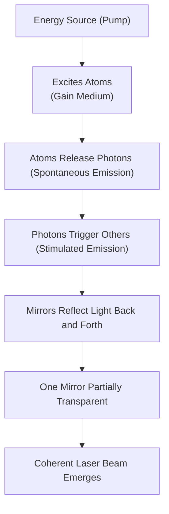


***

**(c) Write down the uses of different parts of the electromagnetic spectrum.** (3 Marks)

**The Electromagnetic Spectrum by Wavelength**
The electromagnetic spectrum is a continuous range of radiation. The boundaries between regions are approximate and can overlap. The table below outlines the distinct parts, their approximate wavelength ranges, and their primary uses.

| **Region**           | **Wavelength Range (Approximate)** | **Typical Uses**                                                                                                           |
| :------------------- | :--------------------------------- | :------------------------------------------------------------------------------------------------------------------------- |
| **Radio Waves**      | > 30 centimeters                   | Long-distance communication, AM/FM radio broadcasting, television signals, Wi-Fi, and mobile phone communication.          |
| **Microwaves**       | 1 millimeter to 30 centimeters     | Cooking (microwave ovens), telecommunications (satellite, GPS), radar systems for weather and navigation.                  |
| **Infrared (IR)**    | 700 nanometers to 1 millimeter     | Remote controls, thermal imaging cameras (night vision), fiber-optic communication, and physical therapy.                  |
| **Visible Light**    | 400 nanometers to 700 nanometers   | Human vision, photography, lighting, and optical instruments like microscopes and telescopes.                              |
| **Ultraviolet (UV)** | 10 nanometers to 400 nanometers    | Sterilization of medical equipment and water, production of Vitamin D in the skin, and forensic analysis ("black lights"). |
| **X-rays**           | 0.01 nanometers to 10 nanometers   | Medical imaging of bones and internal organs, security screening at airports, and industrial inspection of materials.      |
| **Gamma Rays**       | < 0.01 nanometers                  | Medical treatment for cancer (radiotherapy), sterilizing food and medical equipment, and high-energy astronomy.            |
#### **Notes on Wavelength Units:**
*   **cm** = centimeter (1 cm = 0.01 meters)
*   **mm** = millimeter (1 mm = 0.001 meters)
*   **nm** = nanometer (1 nm = one-billionth of a meter, or 10⁻⁹ meters)
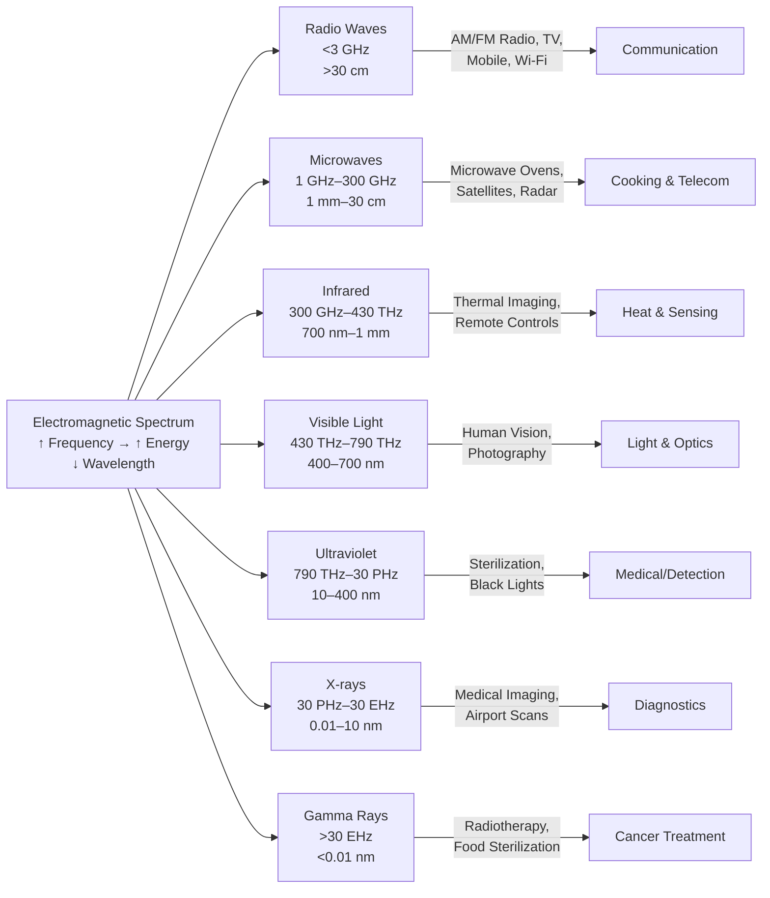


---

### **Question 2**

**(a) What is torque? Write its applications.** (2 Marks)

**Answer:**
**Torque** is the rotational equivalent of linear force. It is a measure of the force that can cause an object to rotate about an axis. It is calculated as the product of the force applied and the perpendicular distance from the axis of rotation to the point where the force is applied.

**Applications:**
*   **Opening a Door:** We apply a force to the handle, which is far from the hinges (the axis of rotation), to create torque and rotate the door open.
*   **Tightening a Bolt:** A wrench is used to apply torque to a nut or bolt. The longer the handle of the wrench, the less force is needed to produce the required torque.
*   **Steering a Car:** The driver applies torque to the steering wheel to turn the car's wheels.

---

**(b) Differentiate between natural and artificial magnets.** (2 Marks)

**Answer:**

| Basis of Difference | Natural Magnet                                                | Artificial Magnet                                                                 |
| :------------------ | :------------------------------------------------------------ | :-------------------------------------------------------------------------------- |
| **Origin**          | Found naturally in the earth.                                 | Man-made by magnetizing specific materials.                                       |
| **Strength**        | Generally have weak magnetic force.                           | Can be made with very strong magnetic force.                                      |
| **Shape**           | Have irregular and undefined shapes.                          | Can be made into specific shapes like bar, U-shape, or disc.                      |
| **Durability**      | Their magnetic property is permanent and long-lasting.        | Can be either permanent (like a bar magnet) or temporary (like an electromagnet). |
| **Example**         | <font color="#ffff00">Lodestone</font> (a form of magnetite). | Bar magnet, <font color="#ffff00">horseshoe</font> magnet, electromagnet.         |

---

**(c) Write the characteristics of sound waves.** (1.5 Marks)

**Answer:**
The main characteristics of sound waves are:

1.  **Mechanical Waves:** Sound requires a medium (solid, liquid, or gas) to travel; it cannot propagate through a vacuum.
2.  **Longitudinal Waves:** The particles of the medium vibrate parallel to the direction of the wave's propagation, creating areas of compression and rarefaction.
3.  **Properties of Waves:** Sound waves exhibit properties like reflection (echo), refraction (bending), and diffraction (spreading around obstacles).

---

**(d) Write a few uses of ultrasound waves.** (2 Marks)

**Answer:**
Ultrasound waves are sound waves with frequencies higher than the upper audible limit of human hearing. Their uses include:

1.  **Medical Imaging (Sonography):** Used to create images of internal body organs, such as the heart (echocardiography), abdomen, and to monitor the development of a fetus during pregnancy.
2.  **Marine Technology (SONAR):** Used in ships and submarines to detect underwater objects, map the seabed, and locate schools of fish.
3.  **Industrial Cleaning:** High-frequency sound waves are used in ultrasonic cleaners to clean delicate items like jewelry, lenses, and surgical instruments.
4.  **Non-destructive Testing:** Used to detect flaws, cracks, or defects inside metal structures and welds without damaging them.
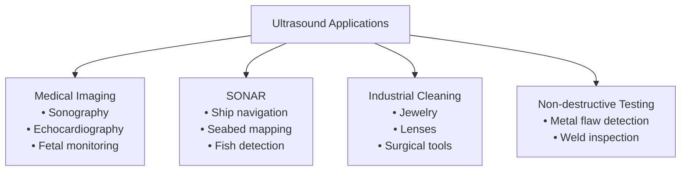
---

### **Question 3**

**(a) What are the differences between organic and mineral (inorganic) acids? Explain with examples.** (2.5 Marks)

**Answer:**
The key differences between organic and mineral acids are:

| Feature | Organic Acids | Mineral (Inorganic) Acids |
| :--- | :--- | :--- |
| **Origin** | Derived from living organisms (plants and animals) or contain a carbon backbone. | Derived from inorganic minerals and do not contain carbon (with some exceptions like carbonic acid). |
| **Strength** | Generally weak acids; they do not fully dissociate in water. | Mostly strong acids (with some exceptions); they dissociate almost completely in water. |
| **Composition** | Always contain carbon atoms, along with hydrogen and oxygen. | Typically do not contain carbon atoms. Composed of hydrogen and one or more non-metallic elements. |
| **Examples** | Acetic acid (CH₃COOH) in vinegar, Citric acid in lemons, Lactic acid in milk. | Sulfuric acid (H₂SO₄), Hydrochloric acid (HCl), Nitric acid (HNO₃). |

**Explanation with Example:**
Hydrochloric acid (HCl), a mineral acid, is strong because in water, nearly all its molecules break up into H⁺ and Cl⁻ ions, releasing a high concentration of hydrogen ions.
In contrast, acetic acid (CH₃COOH), an organic acid, is weak because in water, only a small fraction of its molecules dissociate into H⁺ and CH₃COO⁻ ions, resulting in a low concentration of hydrogen ions.

---

**(b) What is aqua regia? What are its uses?** (2 Marks)

**Answer:**
**Aqua Regia** (Latin for "royal water") is a highly corrosive, fuming yellow or red liquid. It is a mixture of <font color="#ffff00">concentrated nitric acid (HNO₃) and concentrated hydrochloric acid</font> (HCl), optimally in a molar ratio of 1:3.

**Uses:**
*   **Dissolving Noble Metals:** Its primary use is to dissolve noble metals like gold (Au) and platinum (Pt), which are resistant to being dissolved by single acids.
*   **Analytical Chemistry:** It is used in chemical analysis to dissolve certain difficult samples for testing.
*   **Metal Etching and Cleaning:** Used for etching metals and cleaning glassware in laboratories of residual organic compounds and metal particles.

---

**(c) What is a buffer solution? How does an equimolar solution of CH3COOH and CH3COONa act as a buffer?** (2 Marks)

**Answer:**
A **buffer solution** is an aqueous solution consisting of a mixture of a weak acid and its conjugate base, or a weak base and its conjugate acid. It has the property of resisting changes in pH upon the addition of small amounts of an acid or a base.

An equimolar solution of acetic acid (CH₃COOH, a weak acid) and sodium acetate (CH₃COONa, which provides the conjugate base CH₃COO⁻) acts as a buffer because:

1.  **When a strong acid (like H⁺) is added:** The conjugate base (acetate ion) in the buffer reacts with the added H⁺ ions, neutralizing them and forming weak acetic acid.
    $$CH₃COO⁻(aq) + H⁺(aq) → CH₃COOH(aq)$$
    This prevents the pH from dropping significantly.

2.  **When a strong base (like OH⁻) is added:** The weak acid (acetic acid) in the buffer reacts with the added OH⁻ ions, neutralizing them and forming water and the acetate ion.
    $$CH₃COOH(aq) + OH⁻(aq) → CH₃COO⁻(aq) + H₂O(l)$$
    This prevents the pH from rising significantly.

In both cases, the buffer system consumes the added strong acid or base, thus keeping the overall pH of the solution relatively stable.

---

**(d) What is the function of ascorbic acid?** (1 Mark)

**Answer:**
Ascorbic acid, commonly known as **Vitamin C**, is an essential nutrient and powerful antioxidant. Its primary functions are:
*   The growth, development, and repair of all body tissues.
*   Formation of collagen, an important protein used to make skin, tendons, ligaments, and blood vessels.
*   Wound healing and maintenance of cartilage, bones, and teeth.
*   Aiding in the absorption of iron.

---

### **Question 4**

**(a) What are monosaccharides and polysaccharides? What is the difference between the basic structures of starch and cellulose?** (2.5 Marks)

**Answer:**
*   **Monosaccharides:** These are the simplest form of carbohydrates, often called "simple sugars." They are the fundamental building blocks (monomers) for more complex carbohydrates. Examples include glucose, fructose, and galactose.
*   **Polysaccharides:** These are large, complex carbohydrates made up of many monosaccharide units linked together in long chains. They are polymers. Examples include starch, cellulose, and glycogen.

| Starch                                                                                                                                                                                                          | Cellulose                                                                                                                                                                                                                                        |
| --------------------------------------------------------------------------------------------------------------------------------------------------------------------------------------------------------------- | ------------------------------------------------------------------------------------------------------------------------------------------------------------------------------------------------------------------------------------------------ |
| The glucose units in starch are linked by **alpha (α)-1,4 glycosidic bonds**. These bonds create a helical or coiled structure. Humans have enzymes that can break these alpha bonds, making starch digestible. | The glucose units in cellulose are linked by **beta (β)-1,4 glycosidic bonds**. These bonds result in long, straight, fibrous chains. Humans lack the enzymes to break these beta bonds, which is why cellulose is indigestible (dietary fiber). |

---

**(b) Give the basic concept of food and nutrition.** (2 Marks)

**Answer:**
**Food:** Food refers to any substance, usually composed of carbohydrates, fats, proteins, and water, that is consumed by an organism to provide nutritional support. Its main purposes are to provide energy for life processes, raw materials for growth and repair of tissues, and to regulate bodily functions.

**Nutrition:** Nutrition is the scientific study of how food and its components affect the body. It involves the processes of ingestion, digestion, absorption, assimilation, and excretion of nutrients. Good nutrition means obtaining the right amount of nutrients from healthy foods in the right combinations to maintain health, prevent disease, and support overall well-being.

---

**(c) What are vitamins, antioxidants, and free radicals? Explain their role in maintaining health.** (3 Marks)

**Answer:**
*   **Vitamins:** These are organic compounds that are essential micronutrients an organism needs in small quantities for the proper functioning of its metabolism. They cannot be synthesized in sufficient quantities by the body and must be obtained from the diet.
*   **Free Radicals:** These are highly reactive and unstable molecules with an unpaired electron. They are produced in the body as byproducts of normal metabolic processes and through exposure to toxins. They can damage cells, proteins, and DNA by "stealing" electrons from other molecules, a process called oxidation.
*   **Antioxidants:** These are molecules that can safely donate an electron to a free radical, thereby neutralizing it and preventing it from causing cellular damage. The body produces some antioxidants, but many are obtained from food (e.g., Vitamin C, Vitamin E, beta-carotene).

**Role in Maintaining Health:**
Health is maintained by a balance between free radicals and antioxidants. Free radicals, if left unchecked, contribute to aging and a range of diseases like cancer, heart disease, and arthritis. Vitamins and other antioxidants from our diet protect the body by neutralizing these harmful free radicals. For example, Vitamin C protects cells from oxidative stress, and Vitamin E protects cell membranes. Therefore, a diet rich in vitamins and antioxidants is crucial for preventing cellular damage and maintaining long-term health.

---

### **Question 5**

**(a) Discuss the causes and effects of global warming.** (2.5 Marks)

**Answer:**
**Causes of Global Warming:**
The primary cause of global warming is the **enhanced greenhouse effect**, driven by human activities. This involves the release of greenhouse gases (GHGs) that trap heat in the Earth's atmosphere. Key causes include:
1.  **Burning of Fossil Fuels:** The combustion of coal, oil, and natural gas for electricity, transportation, and industry releases large amounts of carbon dioxide (CO₂).
2.  **Deforestation:** Trees absorb CO₂. Cutting down forests reduces the planet's ability to remove this gas from the atmosphere.
3.  **Agriculture:** Practices like rice cultivation and livestock farming release methane (CH₄), a potent GHG. The use of nitrogen-based fertilizers releases nitrous oxide (N₂O).
4.  **Industrial Processes:** Certain industries release fluorinated gases, which are extremely powerful greenhouse gases.

**Effects of Global Warming:**
1.  **Rising Temperatures:** An increase in the average global surface temperature.
2.  **Melting Ice and Rising Sea Levels:** Glaciers and polar ice caps are melting, contributing to a rise in sea levels, which threatens coastal communities.
3.  **Extreme Weather Events:** Increased frequency and intensity of heatwaves, droughts, heavy rainfall, floods, and powerful storms.
4.  **Impact on Ecosystems:** Disruption of habitats, leading to loss of biodiversity and extinction of species. Coral reefs are bleaching due to warmer ocean temperatures.
5.  **Impact on Agriculture:** Changes in growing seasons, crop failures due to droughts or floods, and proliferation of pests.

---

**(b) What is the importance of the ozone layer? How can we protect it?** (3 Marks)

**Answer:**
**Importance of the Ozone Layer:**
The ozone layer is a region of Earth's stratosphere that contains a high concentration of ozone (O₃). Its importance is critical for life on Earth:
1.  **UV Radiation Shield:** It acts as a natural filter, absorbing about 97-99% of the sun's harmful ultraviolet (UV-B and UV-C) radiation.
2.  **Protection of Life:** By blocking this radiation, the ozone layer protects humans from skin cancer, cataracts, and immune system damage. It also protects plants and marine ecosystems (like phytoplankton) from harm.
3.  **Regulating Stratospheric Temperature:** The absorption of UV radiation by ozone warms the stratosphere, playing a role in the Earth's atmospheric temperature structure.

**How to Protect It:**
The primary threat to the ozone layer comes from man-made chemicals, especially chlorofluorocarbons (CFCs) and halons. We can protect it by:
1.  **Adhering to International Agreements:** Supporting and enforcing the Montreal Protocol, which phases out the production and use of ozone-depleting substances (ODS) globally.
2.  **Avoiding ODS Products:** Avoiding the use of products that contain CFCs or other ODS, such as old aerosol spray cans, refrigerators, and air conditioning units. Opting for "CFC-free" or "ozone-friendly" alternatives.
3.  **Proper Disposal:** Ensuring that old appliances containing refrigerants are disposed of responsibly by certified technicians to prevent the release of ODS into the atmosphere.
4.  **Reducing Vehicle Emissions:** Minimizing the use of private vehicles, as they can produce nitrous oxide, another ozone-depleting substance.
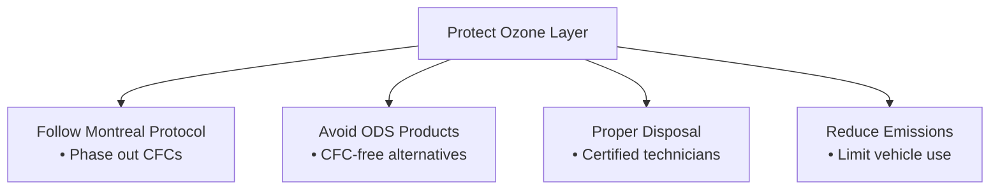
---

**(c) What are the advantages of natural gas as a fuel?** (2 Marks)

**Answer:**
Natural gas (primarily methane, CH₄) has several advantages as a fuel compared to other fossil fuels like coal and oil:
1.  **Cleaner Burning:** It produces significantly lower emissions of pollutants. It releases almost no sulfur dioxide or particulate matter and about 45% less carbon dioxide (CO₂) than coal for the same amount of energy produced.
2.  **High Efficiency:** It is an efficient fuel for electricity generation, heating, and industrial processes.
3.  **Abundant and Relatively Inexpensive:** Natural gas reserves are found worldwide, making it a widely available and often more affordable fuel source.
4.  **Versatility:** It can be used for a wide range of applications, including generating electricity, heating homes and water, cooking, and as a fuel for vehicles (as CNG).
5.  **Infrastructure in Place:** In many countries, an extensive pipeline network already exists for its distribution.
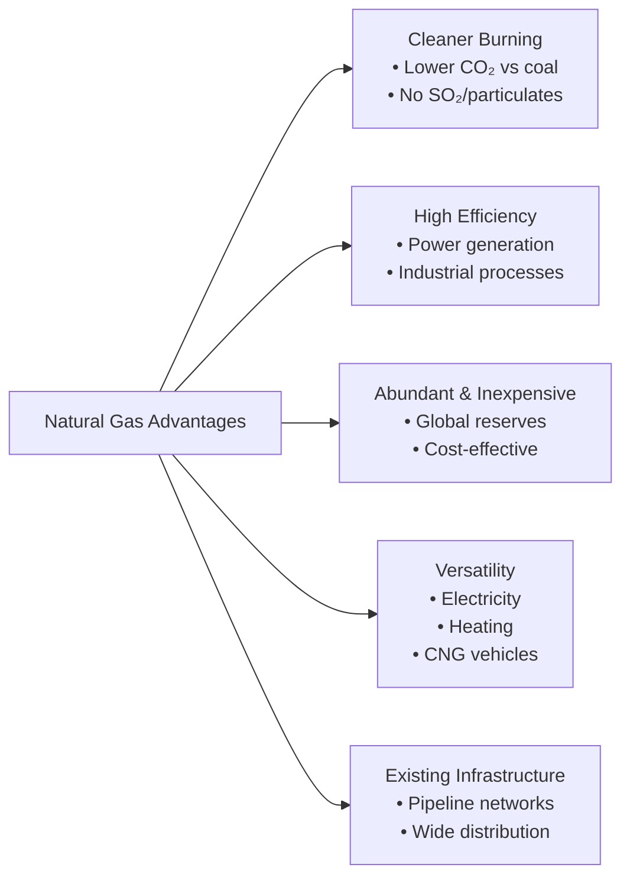
---

### **Question 6**

**(a) What is a chromosome? How are chromosomes classified based on the position of the centromere?** (2.5 Marks)

**Answer:**
A **chromosome** is a thread-like structure of nucleic acids and protein found in the nucleus of most living cells. It carries genetic information in the form of genes. Chromosomes become tightly coiled and visible under a microscope during cell division.

Based on the position of the **centromere** (the constricted region that joins the two sister chromatids), chromosomes are classified into four main types:

1.  **Metacentric:** The centromere is located exactly in the middle, dividing the chromosome into two arms of equal length. It appears V-shaped during anaphase.
2.  **Sub-metacentric:** The centromere is located slightly away from the center, resulting in one shorter arm (p arm) and one longer arm (q arm). It appears L-shaped during anaphase.
3.  **Acrocentric:** The centromere is located very close to one end, creating one very short arm and one very long arm. It appears J-shaped during anaphase.
4.  **Telocentric:** The centromere is located at the terminal end of the chromosome. This results in only one arm. Telocentric chromosomes are not found in humans.
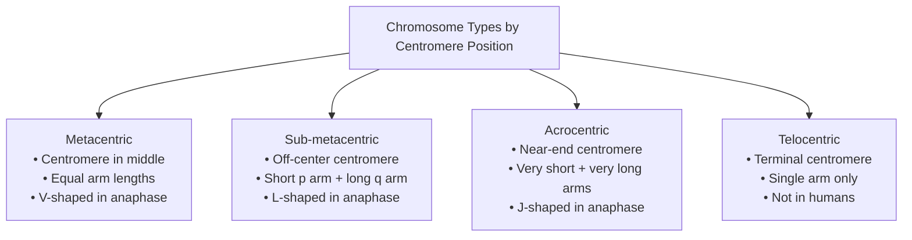
---

**(b) What is gene therapy? Discuss the genetic diseases Huntington's and Down syndrome.** (2.5 Marks)

**Answer:**
**Gene therapy** is an experimental technique that uses genes to treat or prevent disease. The approach involves introducing a new, correct copy of a gene into a patient's cells to replace a mutated or missing gene, or introducing a gene that helps fight a disease.

**Genetic Diseases:**

1.  **Huntington's Disease:** This is a fatal, inherited neurodegenerative disorder caused by a mutation in a single gene (the HTT gene). It is an autosomal dominant disorder, meaning a person only needs one copy of the defective gene to develop the disease. It causes the progressive breakdown of nerve cells in the brain, leading to uncontrolled movements (chorea), cognitive decline, and psychiatric problems, typically starting in adulthood.

2.  **Down Syndrome (Trisomy 21):** This is a chromosomal condition, not a single-gene disorder. It is caused by the presence of a full or partial extra copy of chromosome 21. This extra genetic material alters the course of development and causes the characteristics associated with the syndrome, which include distinct facial features, intellectual disability of varying degrees, and a higher risk of certain health problems like heart defects and thyroid issues.
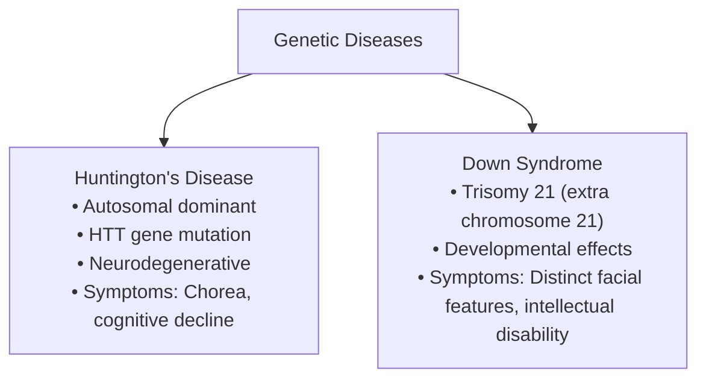
---

**(c) What is nanotechnology? Write the uses of nanotechnology in agriculture.** (2.5 Marks)

**Answer:**
**Nanotechnology** is the manipulation of matter on an atomic, molecular, and supramolecular scale, typically between 1 and 100 nanometers. It involves designing, producing, and applying structures, devices, and systems by controlling their shape and size at the nanoscale to give them unique properties.

**Uses of Nanotechnology in Agriculture (Agri-nanotechnology):**
1.  **Enhanced Fertilizers and Pesticides:** Nanoparticles can be used to create "nano-fertilizers" and "nano-pesticides" that allow for a slow, targeted release of chemicals. This reduces the amount of chemicals needed, minimizes environmental runoff, and increases efficiency.
2.  **Crop Improvement:** Nanoparticles can be used to deliver DNA and other chemicals into plant cells to modify their genes, potentially improving crop yields and resistance to disease and drought.
3.  **Soil and Water Remediation:** Nanomaterials can be used to detect and remove contaminants (like heavy metals and pesticides) from soil and water sources.
4.  **Nanosensors:** Smart sensors can be developed to monitor soil conditions, plant health, and the presence of pathogens in real-time, allowing farmers to take precise and timely action.
5.  **Food Packaging:** Nanotechnology is used to create "smart" packaging that can extend the shelf life of food, detect spoilage, and provide better protection against microbes.
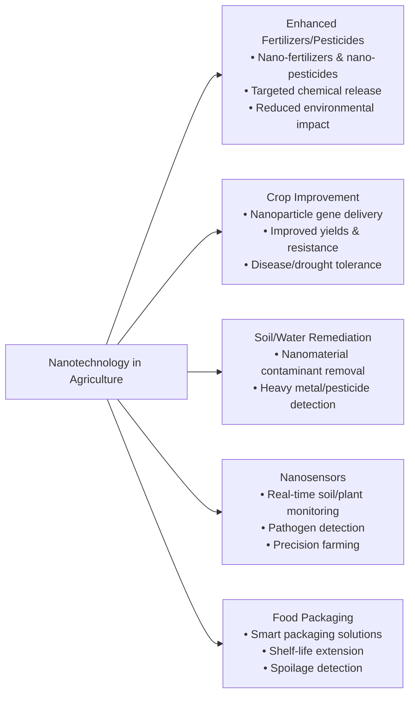
---

### **Question 7**

**(a) What is polymerization? Describe how polymers are formed from monomers.** (2.5 Marks)

**Answer:**
**Polymerization** is a chemical process in which relatively small molecules, called **monomers**, combine chemically to produce a very large chain-like or network molecule, called a **polymer**.

Polymers are formed from monomers through two main types of polymerization reactions:

1.  **Addition Polymerization:** In this process, monomer units are added to one another in such a way that the polymer contains all the atoms of the monomer unit. It typically involves breaking a double or triple bond within the monomer. The process has three steps: initiation (starting the chain), propagation (growing the chain), and termination (ending the chain).
    *   **Example:** Ethene monomers (CH₂=CH₂) polymerize to form poly(ethene) or polythene (-[CH₂-CH₂]n-).

2.  **Condensation Polymerization:** In this process, two monomers react to form a larger structural unit while releasing a smaller molecule such as water (H₂O), ammonia (NH₃), or methanol (CH₃OH). This process continues, linking monomers to form a long polymer chain.
    *   **Example:** The formation of <font color="#ffff00">Nylon</font> from the reaction of a dicarboxylic acid and a diamine, with the elimination of a water molecule at each step.

---

**(b) Mention the differences between cellulosic and non-cellulosic fibers.** (2.5 Marks)

**Answer:**

| Feature | Cellulosic Fibers | Non-Cellulosic (Synthetic) Fibers |
| :--- | :--- | :--- |
| **Source** | Derived from natural plant sources. | Entirely man-made through chemical synthesis, often from petroleum byproducts. |
| **Chemical Composition** | Composed of cellulose, a natural polymer of glucose. | Composed of synthetic polymers like polyesters, polyamides, acrylics, etc. |
| **Moisture Absorption** | Highly absorbent and breathable. | Generally have low moisture absorption (hydrophobic), making them quick-drying but less breathable. |
| **Biodegradability** | Are biodegradable as they are of natural origin. | Are non-biodegradable and persist in the environment for a long time. |
| **Comfort** | Generally comfortable to wear in warm climates due to breathability. | Can feel less comfortable and clammy against the skin as they don't absorb sweat well. |
| **Examples** | Cotton, linen, jute, rayon (regenerated cellulosic). | Polyester, Nylon, Acrylic, Spandex. |

---

**(c) What is polythene? Discuss how polythene and plastics pollute agricultural land.** (2.5 Marks)

**Answer:**
**Polythene**, also known as polyethylene, is a thermoplastic polymer made from the polymerization of <font color="#ffff00">ethene monomers</font>. It is one of the most widely produced plastics in the world, known for its flexibility, durability, and resistance to chemicals.

Polythene and other plastics cause severe pollution of agricultural land in several ways:
1.  **Physical Barrier:** When plastic bags and sheets accumulate in the soil, they create an impermeable layer that prevents water from seeping into the ground, hindering water absorption by plant roots and depleting groundwater.
2.  **Restricted Root Growth:** The plastic barrier physically obstructs the growth of plant roots, stunting crop development and reducing yields.
3.  **Soil Contamination:** Plastics are not biodegradable and can persist in the soil for hundreds of years. Over time, they break down into smaller pieces called **microplastics**, which contaminate the soil. These microplastics can be ingested by soil organisms and can enter the food chain.
4.  **Leaching of Toxic Chemicals:** Many plastics contain additives like plasticizers and stabilizers (e.g., phthalates, BPA). These toxic chemicals can leach out into the soil, harming soil microorganisms and being absorbed by crops, thereby posing a health risk to consumers.
5.  **Clogging Drainage Systems:** Plastic waste clogs irrigation channels and drainage systems in agricultural fields, leading to waterlogging and crop damage.

---

### **Question 8**

**(a) Write three parameters for water purity.** (1.5 Marks)

**Answer:**
Three key parameters for water purity are:
1.  **pH Level:** A measure of the acidity or alkalinity of the water. For drinking water, the ideal pH is neutral, typically between 6.5 and 8.5.
2.  **Total Dissolved Solids (TDS):** The total concentration of all inorganic and organic substances dissolved in the water. Low TDS is generally preferred for drinking water.
3.  **Microbiological Contamination:** The presence of harmful microorganisms like bacteria (e.g., *E. coli*), viruses, and protozoa. Pure water should be free from these pathogens.
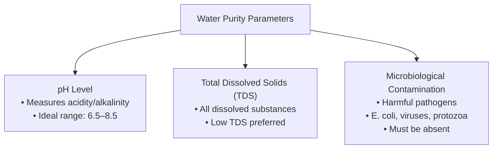
---

**(b) Write the importance of dissolved oxygen in water.** (1.5 Marks)

**Answer:**
Dissolved oxygen (DO) is the amount of gaseous oxygen dissolved in water. Its importance is crucial for aquatic life:
1.  **Respiration for Aquatic Organisms:** Fish, invertebrates, and most aerobic aquatic organisms rely on DO for respiration, just as land animals rely on oxygen from the air.
2.  **Indicator of Water Quality:** Low levels of DO (hypoxia) indicate pollution, often from organic waste or fertilizer runoff, which leads to eutrophication. Healthy water bodies have high DO levels.
3.  **Decomposition of Organic Matter:** Aerobic bacteria use DO to break down organic waste. In the absence of DO, anaerobic decomposition occurs, producing foul-smelling and toxic byproducts.
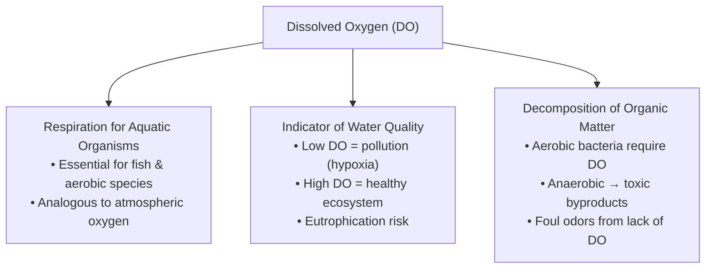
---

**(c) Discuss different methods of water purification.** (2.5 Marks)

**Answer:**
Water purification is the process of removing undesirable chemicals, biological contaminants, and suspended solids from water. Methods range from simple physical processes to complex chemical ones:

1.  **Physical Methods:**
    *   **Boiling:** Kills most pathogenic microorganisms like bacteria, viruses, and protozoa. It is a simple and effective household method.
    *   **Filtration:** Passing water through a physical barrier or filter medium. Simple cloth filters remove large particles, while advanced filters like ceramic or carbon filters can remove smaller particles, chemicals, and some microbes.
    *   **Distillation:** Boiling water to create steam and then condensing the steam back into pure liquid water, leaving salts, minerals, and other impurities behind.

2.  **Chemical Methods:**
    *   **Chlorination:** Adding chlorine or chlorine compounds to water to kill bacteria and other microbes. It is a widely used method for municipal water supplies.
    *   **Coagulation and Flocculation:** Adding chemicals like <font color="#ffff00">alum</font> that cause small suspended particles to clump together (flocculate) into larger particles, which can then be easily removed by sedimentation and filtration.

3.  **Advanced Methods:**
    *   **Reverse Osmosis (RO):** Using high pressure to force water through a semi-permeable membrane that blocks dissolved salts, contaminants, and microorganisms.
    *   **UV (Ultraviolet) Sterilization:** Exposing water to UV light, which damages the DNA of microorganisms and prevents them from reproducing, effectively disinfecting the water without adding chemicals.

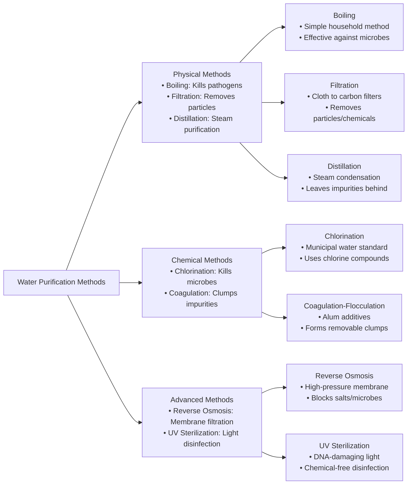
---

**(d) What should you do as a citizen to prevent water pollution?** (2 Marks)

**Answer:**
As a responsible citizen, I can take the following actions to prevent water pollution:
1.  **Proper Waste Disposal:** Never throw trash, chemicals, oils, paints, or medicines into the sink, toilet, or street drains. Dispose of them according to local regulations for hazardous waste.
2.  **Reduce Chemical Use:** Use biodegradable and phosphate-free soaps and detergents. Minimize the use of pesticides and herbicides in gardens, opting for natural alternatives.
3.  **Conserve Water:** Using less water reduces the volume of wastewater that needs to be treated.
4.  **Prevent Runoff:** Use barrels to collect rainwater for gardening. Avoid washing cars on driveways where soapy water runs directly into storm drains; use a commercial car wash that treats its wastewater.
5.  **Community Involvement:** Participate in or organize local clean-up drives for rivers, lakes, and beaches. Raise awareness among friends, family, and the community about the importance of clean water.
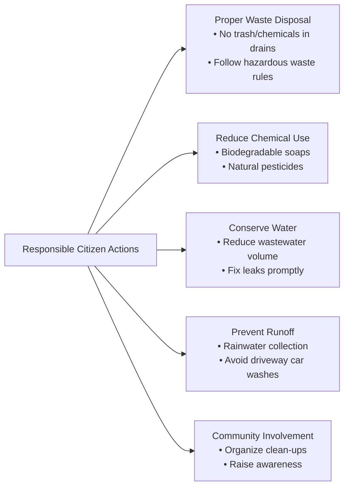
***

### **Technology Section**
**Total Marks: 40**

---

### **Question 1**

**(a) Describe the functional units of a computer with a diagram.** (2.5 Marks)

**Answer:**
The main functional units of a computer system work together to process data. These units are the Input Unit, Central Processing Unit (CPU), Memory Unit, and Output Unit.

**Diagram of Functional Units:**

```
              +---------------------------------+
              |      Central Processing Unit    |
              |             (CPU)               |
              |      +-----------+ +--------+   |
Control Flow <------>| Control   | |  ALU   |<------> Data Flow
   |          |      |   Unit    | |        |   |
   |          |      |   (CU)    | +--------+   |
   |          |      +-----------+              |
   |          +----------------|----------------+
   |                           |
   |                           |
   v                           v
+-------+      +-------------------------------+      +--------+
| Input |----->|         Memory Unit           |<---->| Output |
| Unit  |      |   (Primary and Secondary)     |      |  Unit  |
+-------+      +-------------------------------+      +--------+
```


**Description of Units:**
1.  **Input Unit:** This unit accepts data and instructions from the user or another computer system. Examples of input devices include keyboards, mice, scanners, and microphones.
2.  **Central Processing Unit (CPU):** Known as the "brain" of the computer, the CPU processes the instructions. It has two main components:
    *   **Arithmetic Logic Unit (ALU):** Performs all arithmetic calculations (addition, subtraction, etc.) and logical operations (AND, OR, NOT, comparisons).
    *   **Control Unit (CU):** Directs and coordinates the operations of all other units. It fetches instructions from memory, decodes them, and executes them.
3.  **Memory Unit:** This unit stores data, instructions, and intermediate results. It is divided into:
    *   **Primary Memory (Main Memory):** e.g., RAM. It is volatile and holds data that the CPU is currently working on.
    *   **Secondary Memory (Storage):** e.g., HDD, SSD. It is non-volatile and stores data and programs permanently.
4.  **Output Unit:** This unit presents the processed data (information) to the user. Examples of output devices include monitors, printers, and speakers.
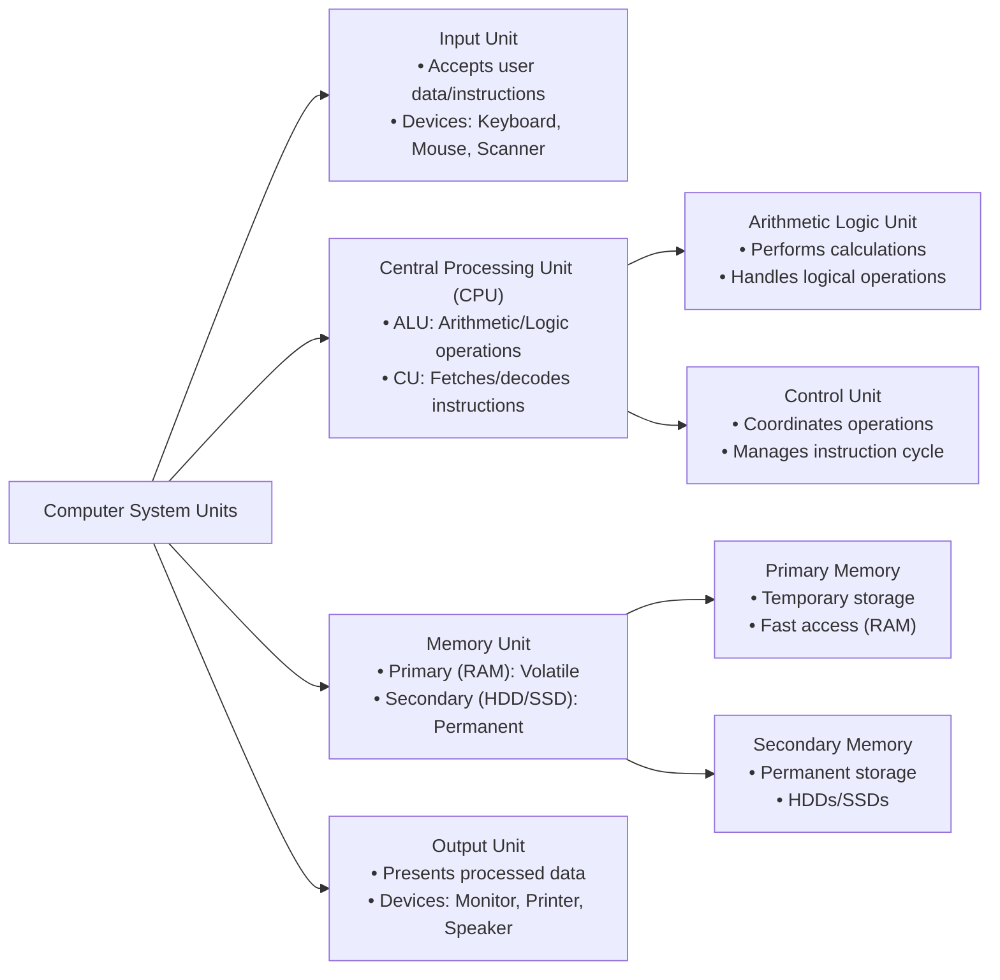
---

**(b) What are Volatile and Non-volatile memory? Give examples.** (2.5 Marks)

**Answer:**
**Volatile Memory:**
This is a type of computer memory that requires power to maintain the stored information. Its contents are lost when the system's power is turned off or interrupted. It is typically used for primary storage or main memory because it offers very fast access speeds for the CPU.
*   **Example:** **RAM (Random Access Memory)** is the most common type of volatile memory.

**Non-volatile Memory:**
This is a type of computer memory that can retain stored information even when not powered. It is used for long-term storage of programs and data. While generally slower than volatile memory, it is essential for starting a computer and saving work permanently.
*   **Examples:** **ROM (Read-Only Memory)**, **HDD (Hard Disk Drive)**, **SSD (Solid-State Drive)**, and **Flash Drives (Pen Drives)**.

---

### **Question 2**

**(a) Write the differences between a web browser and a search engine.** (2.5 Marks)

**Answer:**

| Basis for Comparison | Web Browser | Search Engine |
| :--- | :--- | :--- |
| **Primary Function** | A software application used to access and display websites on the internet. | A website (or web service) used to find information on the World Wide Web. |
| **Purpose** | To retrieve and render web pages from a given URL (web address). | To search its index of web pages for keywords and provide a list of relevant results. |
| **How it Works** | It sends requests to web servers and interprets the received files (HTML, CSS, etc.) to display the content. | It uses "spiders" or "crawlers" to index the content of the internet, then uses algorithms to rank pages based on user queries. |
| **Requirement** | Requires the installation of software on a device (computer, phone). | Does not require installation; it is accessed through a web browser. |
| **Examples** | Google Chrome, Mozilla Firefox, Microsoft Edge, Safari. | Google, Bing, DuckDuckGo, Yahoo. |

---

**(b) What is the function of Spyware? Give an example.** (2.5 Marks)

**Answer:**
**Spyware** is a type of malicious software (malware) that secretly installs itself on a computer to gather information about a user, their computer activity, and their data without their knowledge or consent.

**Function of Spyware:**
*   **Monitoring Activity:** It can track browsing habits, search history, and online activities.
*   **Keystroke Logging:** It can record every key pressed on the keyboard, capturing sensitive information like usernames, passwords, and credit card numbers.
*   **Data Theft:** It can scan files on the computer and steal personal information, documents, and other sensitive data.
*   **System Modification:** Some spyware can change computer settings, redirect web browsers to malicious sites, or slow down the system's performance.

**Example:**
**CoolWebSearch** is a well-known example of spyware that hijacks web browsers, changes the home page, and redirects searches to its own affiliated sites. Another example is **FinFisher (FinSpy)**, a high-end surveillance tool sold to governments.
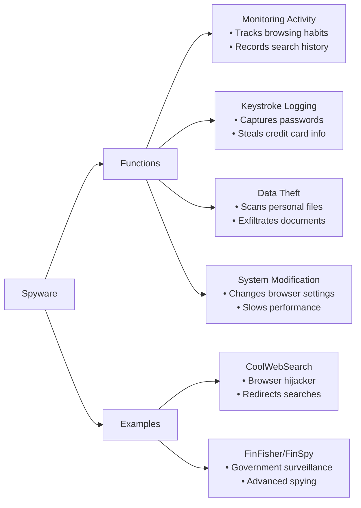
---

### **Question 3**

**(a) What is meant by authentication? Describe two-factor authentication.** (2.5 Marks)

**Answer:**
**Authentication** is the process of verifying the identity of a user, process, or device. It is a security measure designed to ensure that a person or system is who or what it claims to be before granting access to resources, data, or a system.

**Two-Factor Authentication (2FA):**
Two-Factor Authentication is an enhanced security method that requires a user to provide two different types of evidence—or factors—to prove their identity. A simple password is only one factor. 2FA adds a second layer of security, making it much harder for unauthorized users to gain access.

The factors are typically categorized as:
1.  **Something you know:** A password, a PIN, or an answer to a security question.
2.  **Something you have:** A physical object like a smartphone (to receive a code), a security token, or a smart card.
3.  **Something you are:** A biometric characteristic, such as a fingerprint, facial scan, or voice recognition.

**Description:** In a typical 2FA setup, after a user enters their password (the first factor), the system prompts them for a second factor. This is often a one-time password (OTP) sent via SMS to their registered mobile phone or generated by an authenticator app (the second factor). Only after successfully providing both factors is the user granted access.

---

**(b) Write the difference between a digital signature and a conventional signature.** (2.5 Marks)

**Answer:**

| Feature | Conventional Signature | Digital Signature |
| :--- | :--- | :--- |
| **Form** | A physical, handwritten mark on a paper document. | An electronic, encrypted code attached to a digital document. |
| **Verification** | Verified by visually comparing it with a known, authentic signature. This can be subjective. | Verified mathematically using public key cryptography. The verification is objective and automated. |
| **Security** | Can be forged or copied relatively easily. | Highly secure. It ensures authenticity (proves sender's identity), integrity (proves document hasn't been altered), and non-repudiation (sender cannot deny signing). |
| **Uniqueness** | The style of the signature is the same for all documents signed by a person. | It is unique to both the signer and the specific document being signed. If the document is changed even slightly, the signature becomes invalid. |
| **Process** | Created using a pen or similar instrument. | Created using a private key and verified using the corresponding public key. |

---

### **Question 4**

**(a) What are the main roles of BIOS in a computer system?** (2.5 Marks)

**Answer:**
**BIOS (Basic Input/Output System)** is firmware stored on a chip on the motherboard. Its main roles during the computer's startup process are:

1.  **POST (Power-On Self-Test):** This is the first job of the BIOS. It runs a diagnostic test to check that the computer's core hardware components (like the CPU, memory, keyboard, and storage drives) are present and functioning correctly. If any error is detected, the BIOS will report it using beep codes or on-screen messages.
2.  **Bootstrap Loader:** After a successful POST, the BIOS locates the operating system. It looks for a bootable device (like a hard drive or SSD) in a pre-determined order, finds the Master Boot Record (MBR) or bootloader, and loads the operating system into the main memory (RAM).
3.  **Hardware Initialization and Configuration:** The BIOS identifies and configures system hardware. It also provides a basic set of drivers that allow the operating system to communicate with the hardware before more advanced, OS-specific drivers are loaded.
4.  **System Setup Utility:** The BIOS provides a user-accessible interface (often called CMOS setup) where users can configure hardware settings, set the system clock, and define the boot order.
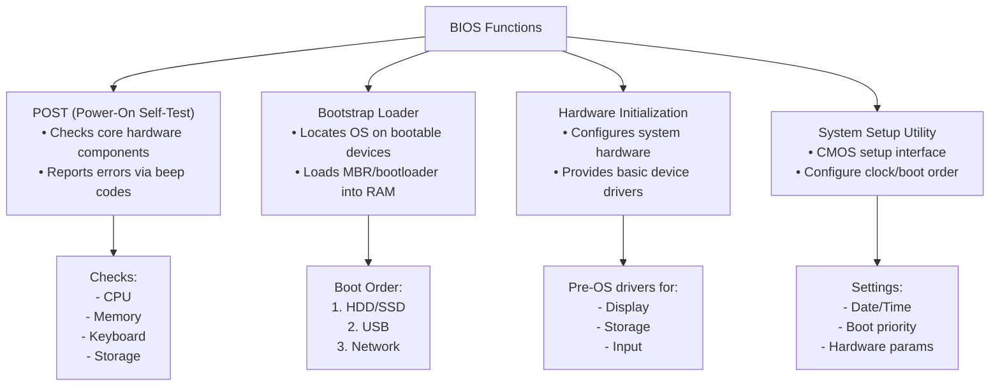
---

**(b) What is the main function of a computer's ALU?** (2.5 Marks)

**Answer:**
The **ALU (Arithmetic Logic Unit)** is a fundamental digital circuit within the Central Processing Unit (CPU) of a computer. Its main function is to perform all the computational tasks. This is broadly divided into two categories:

1.  **Arithmetic Operations:** The ALU executes basic mathematical calculations on binary numbers. This includes:
    *   Addition
    *   Subtraction
    *   Multiplication
    *   Division
    *   Increment and Decrement

2.  **Logical Operations:** The ALU performs logical operations and comparisons. These operations are fundamental to decision-making in computer programs. This includes:
    *   **Bitwise Logic:** AND, OR, NOT, XOR.
    *   **Comparison:** Comparing two values to determine if one is equal to, not equal to, greater than, or less than the other.

In essence, the ALU is the calculating powerhouse of the CPU, handling all the mathematical and logical processing required by software instructions.

---

### **Question 5**

**(a) Write the difference between system software and application software with examples.** (2.5 Marks)

**Answer:**

| Basis for Comparison | System Software | Application Software |
| :--- | :--- | :--- |
| **Purpose** | Designed to manage the computer's hardware resources and provide a platform for application software to run. | Designed to perform specific tasks for the end-user. |
| **Interaction** | Generally runs in the background and has limited direct interaction with the user. | The user directly interacts with this software to accomplish a task. |
| **Dependency** | Application software is dependent on system software to function. | System software can run independently of application software. The computer needs system software to even start. |
| **Generality** | It is general-purpose software that is not specific to any application. | It is specific-purpose software designed for a particular function. |
| **Examples** | **Operating Systems** (Windows, macOS, Linux), **Device Drivers**, **Firmware** (BIOS), **Utility Programs** (Antivirus, Disk Defragmenter). | **Word Processors** (MS Word), **Web Browsers** (Chrome), **Spreadsheet Software** (MS Excel), **Media Players** (VLC), **Games**. |

---

**(b) Why is a Primary Key used in a Database? Explain.** (2.5 Marks)

**Answer:**
A **Primary Key** is a special relational database table column (or combination of columns) designated to uniquely identify each table record. It is used for several crucial reasons:

1.  **Unique Identification:** The most important function of a primary key is to provide a unique identifier for every row in a table. This ensures that no two records are identical, which is fundamental to maintaining data integrity and preventing duplicate entries.
2.  **Fast Data Retrieval:** Database systems create a unique index for the primary key column. This index allows the database to locate and retrieve specific records much faster, significantly improving query performance.
3.  **Establishing Relationships:** The primary key is essential for creating relationships between tables. The primary key of one table can be used as a **Foreign Key** in another table to link the two tables together. This relational structure is the foundation of relational databases, allowing for complex data organization and querying.
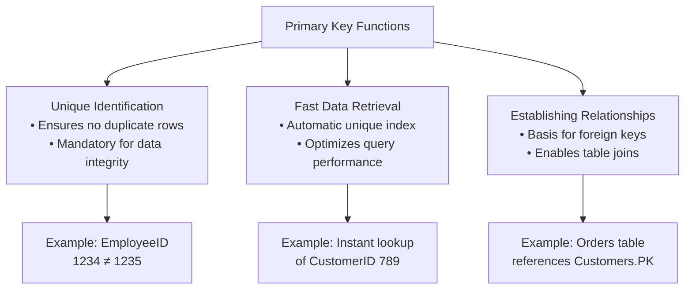
In summary, a primary key enforces entity integrity, speeds up data access, and enables the linking of data across the database, making it a cornerstone of database design.

---

### **Question 6**

**(a) Explain the working principle of a transformer with a diagram.** (2.5 Marks)

**Answer:**
A transformer is a static electrical device that transfers electrical energy from one circuit to another through electromagnetic induction. It is used to "step-up" (increase) or "step-down" (decrease) AC voltage levels.

**Working Principle: Mutual Induction**
The operation of a transformer is based on the principle of **mutual induction**. When an alternating current (AC) flows through the primary coil, it produces a continuously changing magnetic flux in the laminated soft iron core. This changing magnetic flux gets linked with the secondary coil. According to Faraday's Law of Electromagnetic Induction, this changing flux induces an alternating electromotive force (EMF), or voltage, in the secondary coil.

**Diagram:**
```
     Primary Coil (Np turns)       Secondary Coil (Ns turns)
            |                            |
       <----|------>                 <----|------>
   +------\ /------+             +------\ /------+
   |       |       |             |       |       |
 AC Voltage (Vp)   ~            Load
   |               |             |               |
   +---------------+             +---------------+
           |                            |
           |     Laminated Iron Core    |
           +----------------------------+
           |       Magnetic Flux (Φ)    |
           +----------------------------+
```

![[Pasted image 20250801204430.png]]
*   If the number of turns in the secondary coil (Ns) is greater than the primary (Np), the transformer is a **step-up transformer** (Vs > Vp).
*   If Ns is less than Np, it is a **step-down transformer** (Vs < Vp).
The relationship is given by the formula: `Vp / Vs = Np / Ns`.

---

**(b) Why is an NPN transistor used in high-frequency circuits?** (2.5 Marks)

**Answer:**
An NPN transistor is generally preferred over a PNP transistor for use in high-frequency circuits primarily due to the **higher mobility of its majority charge carriers**.

**Explanation:**
1.  **Charge Carriers:** In an NPN transistor, the majority charge carriers responsible for conducting current are **electrons**. In a PNP transistor, the majority charge carriers are **holes**.
2.  **Mobility:** Electrons are physically smaller and lighter than holes and can move through the semiconductor crystal lattice much more easily and quickly. This property is known as higher **mobility**. The mobility of electrons is roughly two to three times that of holes in silicon.
3.  **Switching Speed:** Because electrons can move faster, an NPN transistor can switch on and off more rapidly than a PNP transistor. This fast switching speed is essential for amplifying or processing signals that change direction very quickly, i.e., high-frequency signals.
4.  **Frequency Response:** The superior switching speed gives NPN transistors a better frequency response, allowing them to operate effectively at higher frequencies with less signal degradation or delay. This makes them the standard choice for applications like radio frequency (RF) amplifiers and high-speed logic circuits.

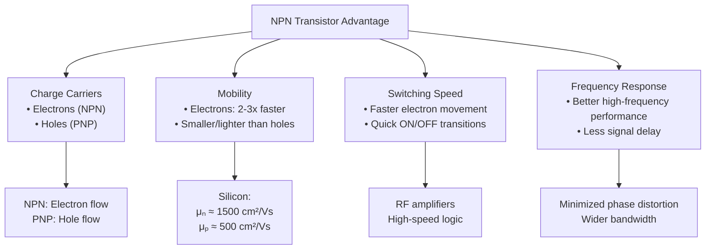


---

### **Question 7**

**(a) What is meant by an ideal voltage source? Explain.** (2.5 Marks)

**Answer:**
An **ideal voltage source** is a theoretical two-terminal circuit element that provides a constant, specified voltage across its terminals regardless of the current flowing through it or the load resistance connected to it.

**Explanation:**
The key characteristic of an ideal voltage source is that it has **zero internal resistance**. In a real-world voltage source (like a battery), there is always some internal resistance. When current flows, this internal resistance causes a voltage drop within the source itself, so the voltage delivered to the external circuit decreases as the current increases (according to Ohm's law, V_drop = I * R_internal).

Because an ideal voltage source has no internal resistance, there is no internal voltage drop. Therefore, it can supply any amount of current to a load while maintaining its terminal voltage at a constant, fixed value. While no true ideal voltage source exists in practice, the concept is a fundamental tool used in circuit analysis to simplify calculations and understand circuit behavior.

---

**(b) Explain the functions of different types of circuit breakers.** (2.5 Marks)

**Answer:**
A **circuit breaker** is an automatic electrical switch designed to protect an electrical circuit from damage caused by an overcurrent, typically resulting from an overload or a short circuit. Its basic function is to interrupt the current flow once a fault is detected. Different types are designed for various voltage and current levels.

**Functions of Different Types:**
1.  **MCB (Miniature Circuit Breaker):**
    *   **Function:** Provides overcurrent and short-circuit protection for low-voltage residential and commercial circuits (e.g., lighting, outlets).
    *   **Operation:** It uses a bimetallic strip that bends when heated by an overload current (thermal trip) and an electromagnet that trips the switch instantly during a high-current short circuit (magnetic trip).

2.  **MCCB (Molded Case Circuit Breaker):**
    *   **Function:** Used for higher current ratings (up to ~2500 A) and higher fault levels, typically in industrial settings and commercial distribution panels.
    *   **Operation:** Works on the same thermal-magnetic principle as an MCB but is more robust. Many MCCBs have adjustable trip settings, allowing them to be customized for specific loads.

3.  **ELCB/RCCB (Earth Leakage / Residual Current Circuit Breaker):**
    *   **Function:** Specifically designed for shock protection. It does not protect against overloads but disconnects the circuit when it detects a small leakage of current to the earth, which could happen if a person touches a live wire.
    *   **Operation:** It monitors the balance of current between the live and neutral wires. Any imbalance indicates a leakage, causing it to trip instantly.

4.  **Air Circuit Breaker (ACB):**
    *   **Function:** Used for protecting large-scale industrial plants and power distribution networks with very high currents (up to 10,000 A) and low voltage.
    *   **Operation:** It uses air at atmospheric pressure as the medium to extinguish the electrical arc that forms when the circuit is interrupted.

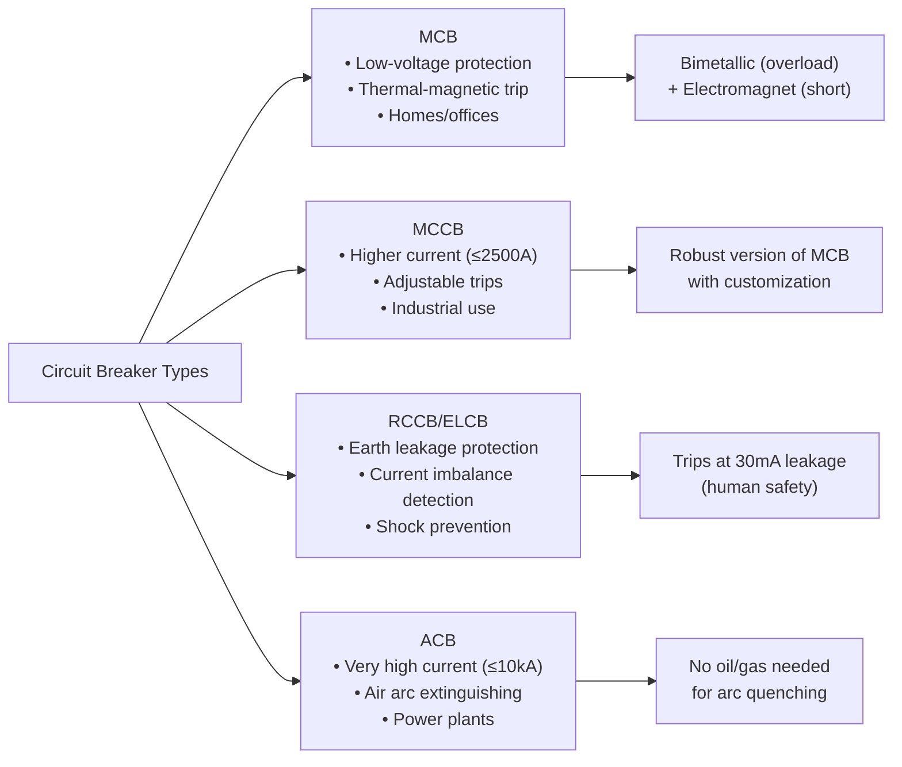

---

### **Question 8**

**(a) State and explain Kirchhoff's laws.** (2.5 Marks)

**Answer:**
Kirchhoff's laws are two fundamental rules that deal with the conservation of charge and energy in electrical circuits.

1.  **Kirchhoff's Current Law (KCL) or Junction Rule:**
    *   **Statement:** The algebraic sum of all currents entering and leaving a junction (or node) in an electrical circuit is equal to zero.
    *   **Explanation:** This law is based on the **principle of conservation of charge**. Since charge cannot be created or destroyed, the total amount of charge flowing into a junction per unit time must be equal to the total amount of charge flowing out of it. Conventionally, currents entering a junction are taken as positive, and currents leaving are taken as negative.
    *   **Formula:** ΣI = 0 (at a junction)

2.  **Kirchhoff's Voltage Law (KVL) or Loop Rule:**
    *   **Statement:** The algebraic sum of all the potential differences (voltages) around any closed loop or mesh in a circuit is equal to zero.
    *   **Explanation:** This law is based on the **principle of conservation of energy**. As a charge moves around a closed loop and returns to its starting point, its net change in potential energy must be zero. The sum of the voltage rises (e.g., across a battery) must equal the sum of the voltage drops (e.g., across resistors).
    *   **Formula:** ΣV = 0 (around a loop)

---

**(b) Derive the Wheatstone bridge principle using Kirchhoff's laws.** (2.5 Marks)

**Answer:**
A Wheatstone bridge is a circuit used to measure an unknown electrical resistance. It consists of four resistors (P, Q, R, S), a galvanometer (G), and a voltage source.

**Diagram:**
A standard Wheatstone bridge diagram with junctions A, B, C, D. Resistor P between A and B, Q between B and C, R between A and D, and S between D and C. A galvanometer G is connected between B and D. A voltage source is connected between A and C.

Of course. Here is the derivation of the Wheatstone bridge principle using Kirchhoff's laws, complete with a diagram.

---

### Derivation of the Wheatstone Bridge Principle

The Wheatstone bridge is a circuit used to measure an unknown electrical resistance. Its principle is based on the condition of a 'balanced' bridge, where no current flows through the central path.

**Principle:** When the bridge is balanced, the ratio of resistances in the two arms is equal. i.e., $\frac{R_1}{R_2} = \frac{R_3}{R_4}$.

#### **Circuit Diagram**

Let's consider a Wheatstone bridge as shown below, consisting of four resistors $R_1, R_2, R_3,$ and $R_4$. A galvanometer (G) is connected between points B and D, and a voltage source (E) is connected between points A and C.


#### **Derivation using Kirchhoff's Laws**

The bridge is said to be **balanced** when the galvanometer shows **zero deflection**. This implies that there is no current flowing through the galvanometer.
Let the current through the galvanometer be $I_g$. The balanced condition is:
$$ I_g = 0 $$
This also means that the potential at point B is equal to the potential at point D, i.e., $V_B = V_D$.

We will now apply Kirchhoff's Voltage Law (KVL) or the loop rule to the closed loops in the circuit.

**1. Apply KVL to loop ABDA:**
Traversing the loop ABDA in a clockwise direction, the sum of potential changes is zero:
$$ -I_1 R_1 - I_g G + I_2 R_3 = 0 $$
where G is the resistance of the galvanometer.

**2. Apply KVL to loop BCDB:**
Traversing the loop BCDB in a clockwise direction, the sum of potential changes is zero:
$$ -(I_1 - I_g) R_2 + (I_2 + I_g) R_4 + I_g G = 0 $$

**3. Apply the Balanced Condition ($I_g = 0$):**
Now, we substitute the balanced condition, $I_g = 0$, into the two loop equations derived above.

From the equation for loop ABDA:
$$ -I_1 R_1 - (0)G + I_2 R_3 = 0 $$
$$ \implies I_1 R_1 = I_2 R_3 \quad \cdots (1) $$

From the equation for loop BCDB:
$$ -(I_1 - 0)R_2 + (I_2 + 0)R_4 + (0)G = 0 $$
$$ \implies -I_1 R_2 + I_2 R_4 = 0 $$
$$ \implies I_1 R_2 = I_2 R_4 \quad \cdots (2) $$

**4. Derive the Final Relation:**
Now, we divide Equation (1) by Equation (2):
$$ \frac{I_1 R_1}{I_1 R_2} = \frac{I_2 R_3}{I_2 R_4} $$

Since $I_1 \neq 0$ and $I_2 \neq 0$, we can cancel the currents from both sides:
$$ \frac{R_1}{R_2} = \frac{R_3}{R_4} $$

This is the required condition for a balanced Wheatstone bridge. If any three of the resistances are known, the fourth unknown resistance can be determined using this formula.